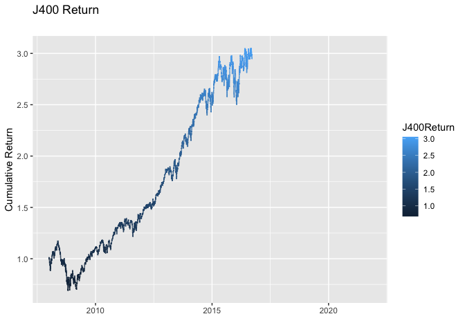
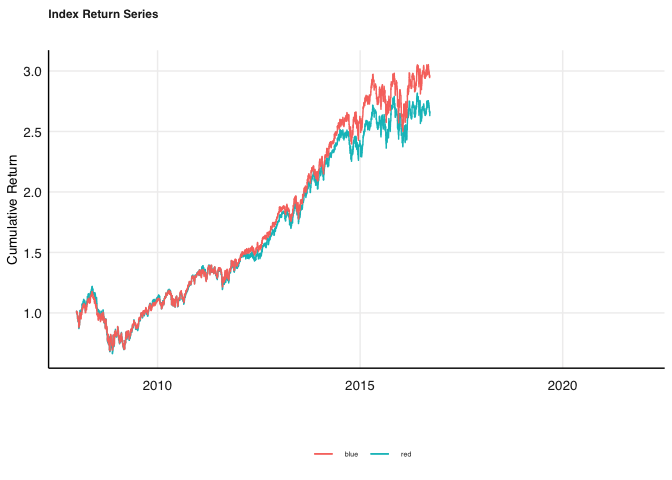

# Description

Produced below is my attempt at the Financial Econometrics 871
practical.

``` r
rm(list = ls()) # Clean your environment:
gc() # garbage collection - It can be useful to call gc after a large object has been removed, as this may prompt R to return memory to the operating system.
```

    ##          used (Mb) gc trigger (Mb) limit (Mb) max used (Mb)
    ## Ncells 409914 21.9     842280   45         NA   657805 35.2
    ## Vcells 775744  6.0    8388608   64      16384  1802259 13.8

``` r
library(tidyverse)
```

    ## ── Attaching packages ─────────────────────────────────────── tidyverse 1.3.1 ──

    ## ✓ ggplot2 3.3.5     ✓ purrr   0.3.4
    ## ✓ tibble  3.1.4     ✓ dplyr   1.0.7
    ## ✓ tidyr   1.1.3     ✓ stringr 1.4.0
    ## ✓ readr   2.0.1     ✓ forcats 0.5.1

    ## ── Conflicts ────────────────────────────────────────── tidyverse_conflicts() ──
    ## x dplyr::filter() masks stats::filter()
    ## x dplyr::lag()    masks stats::lag()

``` r
list.files('code/', full.names = T, recursive = T) %>% .[grepl('.R', .)] %>% as.list() %>% walk(~source(.))
```

``` r
#Texevier::create_template_html(directory = "Questions", template_name = "Question1")

#Texevier::create_template_html(directory = "Questions", template_name = "Question2")

#Texevier::create_template_html(directory = "Questions", template_name = "Question3")

#Texevier::create_template_html(directory = "Questions", template_name = "Question4")

#Texevier::create_template_html(directory = "Questions", template_name = "Question5")

#Texevier::create_template_html(directory = "Questions", template_name = "Question6")
```

# Question 1

## Yield Spread

Economists recently pointed out that the current yield spreads in local
mid to longer dated bond yields have since 2020 been the highest in
decades. Lets start our analysis with looking at the yield spreads over
the different dated SA bonds.

``` r
SA_bonds_clean <- SA_bonds %>%  
                
    arrange(date) %>% 
    
    gather(Ticker, Yield, -date) %>% 
    
    tbl2xts::tbl_xts(cols_to_xts = Yield, spread_by = Ticker) %>% 
    
    tbl2xts::xts_tbl() %>% gather(Ticker, Yield, -date)
```

``` r
SA_Bond_All <- SA_bonds_clean %>% 
    
                ggplot() +
    
                geom_line(aes(date, Yield, color = Ticker)) +
               
  
  # Nice clean theme, with many additions that are now simplified (explore this yourself):
  # E.g. using fmxdat::ggpts, we can change the sizes more easily in millimeters. 
  # theme_fmx also offers simplified size settings, as e.g. below:
  
  fmxdat::theme_fmx(title.size = ggpts(30),
                    
                    subtitle.size = ggpts(28),
                    
                    caption.size = ggpts(25),
                    
                    CustomCaption = T) + 
  
  # crisp colours:
  fmxdat::fmx_cols() + 
  
  labs(x = "", y = "Bond Yields", caption = "Note:\nCalculation own",
       
       title = "Bond Yields in South Africa across the 3 month, 2 year and 10 year maturities",
       
       subtitle = "") + 
  
  guides(color = F)
  

  fmxdat::finplot(SA_Bond_All, x.vert = T, x.date.type = "%Y", x.date.dist = "2 years")
```

 \`\` A
cursory analysis indicates that bond yields for all maturities have
declined over the 20-year period examined. The largest decline is
experienced by the shortest maturity. We are however, more interested in
the spreads between bonds of different maturities.

``` r
#bond spreads with the 3m bond yield as the reference point 
Bond_spreads_st %>% ggplot +
    
                geom_line(aes(date, Spread, color = Ticker))+
    
                labs(title = "Mid and Long Term SA Spreads over shortest matur", y = "Yield Spreads", x ="",
                     
                subtitle = "") +
    
                fmxdat::theme_fmx(title.size = ggpts(25), subtitle.size = ggpts(20)) + 
    
                fmxdat::fmx_cols()
```


Evidently, the spread between the shortest dated maturity and the mid
and longer termed bonds have widened recently. The divergence seems to
have started in late 2018 and has continued to have widened since.

## Carry trade


# Question 2

The ALSI Top40 is an equity Index of the 40 largest companies by market
capitalisation, listed on the JSE where the fund is rebalanced
quarterly.

The SWIX All Share Index represents 99% of the full market cap value of
all eligible securities listed on the Main Board of the JSE however, all
constituents are weighted by an alternate free float, called the SWIX
free float. The SWIX top 40 thus represents the largest 40 companies
weighted by the SWIX free float.




 The
difference between the indexes above is how each index is capped. The
figure above indicates that the J200 has returned above that of the
J400.

# Question 3

PCA allows the modeler a means of identifying structure in the
covariance / correlation matrix to locate low-dimensional subspaces
containing most of the variation in the data. WE first need to ensure
our data is mean centered, as well as scaled.This is an important step
as our returns data are typically skew, non-normal and non-zero meaned.
Thus a log transformation, scaling and mean-centering is standard
practice.

Our dateset contains many na’s. While filling these na’s with column
averages may provide some insatnt relief, we fail to preserve the
underlying data generating process. It is better to draw a generated
distribution mapping the DGP.

    ## [1] FALSE

*A**E* = *λ**E*

*E*<sup>*T*</sup>*Σ**E* = *λ*

where E and λ the eigenvectors and eigenvalues, and Σ the demeaned
covariance matrix.

    ## [1] TRUE

    ##  [1] 0.1190046230 0.0462993472 0.0311528999 0.0222604677 0.0190042572
    ##  [6] 0.0170513353 0.0161847370 0.0156714439 0.0153625391 0.0146990383
    ## [11] 0.0145789405 0.0143862752 0.0141635096 0.0137626262 0.0133923568
    ## [16] 0.0133797962 0.0132220955 0.0129860315 0.0128189778 0.0126340450
    ## [21] 0.0122981356 0.0122058511 0.0121090222 0.0119874626 0.0119086106
    ## [26] 0.0118974091 0.0116560419 0.0115362643 0.0113623097 0.0113433388
    ## [31] 0.0111885566 0.0111047001 0.0110020843 0.0109710621 0.0108584587
    ## [36] 0.0107218965 0.0106057134 0.0105219732 0.0104633641 0.0103864577
    ## [41] 0.0101671068 0.0101208906 0.0099945819 0.0098666260 0.0097621555
    ## [46] 0.0096970502 0.0096306677 0.0095066018 0.0094856406 0.0093570916
    ## [51] 0.0090096986 0.0089751630 0.0088977791 0.0088781036 0.0086290950
    ## [56] 0.0085292520 0.0084317176 0.0082244426 0.0081835251 0.0080953521
    ## [61] 0.0079921989 0.0078838208 0.0078672664 0.0075405619 0.0073268676
    ## [66] 0.0070370458 0.0067982277 0.0065629013 0.0063042651 0.0062676550
    ## [71] 0.0061191523 0.0058799940 0.0054319962 0.0053118094 0.0050496367
    ## [76] 0.0047402954 0.0045161088 0.0041665987 0.0038775025 0.0036262615
    ## [81] 0.0034878493 0.0031529902 0.0024205757 0.0023194656 0.0021809580
    ## [86] 0.0020798814 0.0018178173 0.0006536999


# Calcualating a rolling constituent correlation perspective

    ## [1] FALSE

We use the performance analytics package to create a rolling correlation
between the J200 and J400.


# Question 4

The ZAR has generally performed well during periods where G10 currency
carry trades have been favourable and these currency valuations
relatively cheap. Globally, it has been one of the currencies that most
benefit during periods where the Dollar is comparatively strong,
indicating a risk-on sentiment


We can note the relative depreciation of the ZAR to the USD over the 30
year window. Our concern falls on whether the ZAR has become more
volatile in comparison to global currencies.

    ## [1] "uGARCHfit"
    ## attr(,"package")
    ## [1] "rugarch"

    ## 
    ## *---------------------------------*
    ## *          GARCH Model Fit        *
    ## *---------------------------------*
    ## 
    ## Conditional Variance Dynamics    
    ## -----------------------------------
    ## GARCH Model  : sGARCH(1,1)
    ## Mean Model   : ARFIMA(1,0,0)
    ## Distribution : norm 
    ## 
    ## Optimal Parameters
    ## ------------------------------------
    ##         Estimate  Std. Error   t value Pr(>|t|)
    ## mu      0.000166    0.000063  2.661357 0.007783
    ## ar1    -0.000261    0.013125 -0.019865 0.984151
    ## omega   0.000000    0.000001  0.377397 0.705878
    ## alpha1  0.093920    0.012934  7.261390 0.000000
    ## beta1   0.905080    0.012550 72.118869 0.000000
    ## 
    ## Robust Standard Errors:
    ##         Estimate  Std. Error   t value Pr(>|t|)
    ## mu      0.000166    0.000341  0.488095  0.62548
    ## ar1    -0.000261    0.092963 -0.002805  0.99776
    ## omega   0.000000    0.000043  0.005384  0.99570
    ## alpha1  0.093920    0.813285  0.115482  0.90806
    ## beta1   0.905080    0.806621  1.122063  0.26184
    ## 
    ## LogLikelihood : 23130.33 
    ## 
    ## Information Criteria
    ## ------------------------------------
    ##                     
    ## Akaike       -6.9613
    ## Bayes        -6.9561
    ## Shibata      -6.9613
    ## Hannan-Quinn -6.9595
    ## 
    ## Weighted Ljung-Box Test on Standardized Residuals
    ## ------------------------------------
    ##                         statistic p-value
    ## Lag[1]                     0.4771  0.4897
    ## Lag[2*(p+q)+(p+q)-1][2]    0.5112  0.9616
    ## Lag[4*(p+q)+(p+q)-1][5]    0.8345  0.9685
    ## d.o.f=1
    ## H0 : No serial correlation
    ## 
    ## Weighted Ljung-Box Test on Standardized Squared Residuals
    ## ------------------------------------
    ##                         statistic   p-value
    ## Lag[1]                      27.42 1.639e-07
    ## Lag[2*(p+q)+(p+q)-1][5]     28.70 7.321e-08
    ## Lag[4*(p+q)+(p+q)-1][9]     29.80 4.936e-07
    ## d.o.f=2
    ## 
    ## Weighted ARCH LM Tests
    ## ------------------------------------
    ##             Statistic Shape Scale P-Value
    ## ARCH Lag[3]    0.2956 0.500 2.000  0.5866
    ## ARCH Lag[5]    0.7331 1.440 1.667  0.8134
    ## ARCH Lag[7]    1.3704 2.315 1.543  0.8470
    ## 
    ## Nyblom stability test
    ## ------------------------------------
    ## Joint Statistic:  458.7754
    ## Individual Statistics:                
    ## mu       0.03886
    ## ar1      0.11074
    ## omega  141.33127
    ## alpha1   0.90380
    ## beta1    0.88377
    ## 
    ## Asymptotic Critical Values (10% 5% 1%)
    ## Joint Statistic:          1.28 1.47 1.88
    ## Individual Statistic:     0.35 0.47 0.75
    ## 
    ## Sign Bias Test
    ## ------------------------------------
    ##                    t-value     prob sig
    ## Sign Bias           0.5608 0.574950    
    ## Negative Sign Bias  1.9470 0.051579   *
    ## Positive Sign Bias  0.8094 0.418306    
    ## Joint Effect       12.1827 0.006783 ***
    ## 
    ## 
    ## Adjusted Pearson Goodness-of-Fit Test:
    ## ------------------------------------
    ##   group statistic p-value(g-1)
    ## 1    20     119.0    1.672e-16
    ## 2    30     140.2    1.565e-16
    ## 3    40     154.8    9.944e-16
    ## 4    50     173.9    6.894e-16
    ## 
    ## 
    ## Elapsed time : 0.6390619

\[1\] “fit” “model” \[1\] “hessian” “cvar” “var” “sigma”  
\[5\] “condH” “z” “LLH” “log.likelihoods” \[9\] “residuals” “coef”
“robust.cvar” “A”  
\[13\] “B” “scores” “se.coef” “tval”  
\[17\] “matcoef” “robust.se.coef” “robust.tval” “robust.matcoef” \[21\]
“fitted.values” “convergence” “kappa” “persistence”  
\[25\] “timer” “ipars” “solver”  
\[1\] “modelinc” “modeldesc” “modeldata” “pars” “start.pars” \[6\]
“fixed.pars” “maxOrder” “pos.matrix” “fmodel” “pidx”  
\[11\] “n.start”  
Estimate Std. Error t value Pr(\>\|t\|) mu 1.664533e-04 6.254451e-05
2.66135746 7.782629e-03 ar1 -2.607292e-04 1.312513e-02 -0.01986488
9.841512e-01 omega 2.297036e-07 6.086521e-07 0.37739719 7.058785e-01
alpha1 9.392003e-02 1.293417e-02 7.26138996 3.830269e-13 beta1
9.050800e-01 1.254984e-02 72.11886874 0.000000e+00
    ## [1] 0.999


# Question 5

In the MSCI universe, we’ll look into the equity returns in China. This
is decided on given China’s rise to profilerence in the last decade.

``` r
# Calculate China retunrs

stockreturns <- msci %>% filter(Name %in% "MSCI China") %>% 
    
    mutate(dlogret = log(Price) - log(lag(Price))) %>% 
    
    mutate(scaledret = (dlogret - mean(dlogret, na.rm = T))) %>% 
    
    filter(date > dplyr::first(date)) %>% select(-Price) %>%
    
    filter(date > as.Date("2005-06-20")) %>% 
    
    rename("MSCI China" = scaledret) %>%
    
    select(date, "MSCI China")
```

Japan, and their bond yields have been plagued by secular stagnation.
That is, their returns to their factor inputs and productivity are
diminishing. Their long-term yields will be an interesting case study.

``` r
# Calculate 10 Year Bond Returns

bondreturns <- bonds %>% filter(Name %in% "EURO_10Yr") %>% 
    
    mutate(dlogret = Bond_10Yr/lag(Bond_10Yr) - 1) %>%
    
    mutate(scaledret = (dlogret - mean(dlogret, na.rm = T))) %>% 
    
    filter(date > dplyr::first(date)) %>% select(-Bond_10Yr) %>%
    
    filter(date > as.Date("2005-06-20"))%>% 
    
    rename(EURO_10Yr = scaledret) %>%
    
    select(date, EURO_10Yr)
```

Lets test the hypothesis: Safe as houses

``` r
# Calculate US Real Estate Returns
USreit <- msci %>% filter(Name %in% "MSCI_USREIT") %>% 
    
    mutate(dlogret = log(Price) - log(lag(Price))) %>% 
    
    mutate(scaledret = (dlogret - mean(dlogret, na.rm = T))) %>% 
    
    filter(date > dplyr::first(date)) %>% select(-Price) %>%
    
    filter(date > as.Date("2005-06-20")) %>% 
    
    rename(MSCI_USREIT = scaledret) %>%
    
    select(date, MSCI_USREIT)
```

Oil is the largest commodity traded

``` r
# Calculate Brent Crude Oil Returns

OilReturn <- comms %>% filter(Name %in% "Oil_Brent" ) %>% 
    
    mutate(dlogret = log(Price) - log(lag(Price))) %>% 
    
    mutate(scaledret = (dlogret -  mean(dlogret, na.rm = T))) %>% 
    
    filter(date > dplyr::first(date)) %>% select(-Price) %>%
    
    filter(date > as.Date("2005-06-20")) %>% 
    
    rename(Oil_Brent = scaledret) %>% 
    
    select(date, Oil_Brent)
```

``` r
Combinedassets <- left_join(stockreturns, bondreturns, by = c("date")) %>% 
    
    left_join(., USreit, by = c("date")) %>% 
    
    left_join(., OilReturn, by = c("date")) %>% 
    
    tbl_xts()
```

``` r
xts_rtn <- Combinedassets
```

``` r
# So, let's be clever about defining more informative col names. 
# I will create a renaming function below:

renamingdcc <- function(ReturnSeries, DCC.TV.Cor) {
  
ncolrtn <- ncol(ReturnSeries)
namesrtn <- colnames(ReturnSeries)
paste(namesrtn, collapse = "_")

nam <- c()
xx <- mapply(rep, times = ncolrtn:1, x = namesrtn)
# Now let's be creative in designing a nested for loop to save the names corresponding to the columns of interest.. 

# TIP: draw what you want to achieve on a paper first. Then apply code.

# See if you can do this on your own first.. Then check vs my solution:

nam <- c()
for (j in 1:(ncolrtn)) {
for (i in 1:(ncolrtn)) {
  nam[(i + (j-1)*(ncolrtn))] <- paste(xx[[j]][1], xx[[i]][1], sep="_")
}
}

colnames(DCC.TV.Cor) <- nam

# So to plot all the time-varying correlations wrt SBK:
 # First append the date column that has (again) been removed...
DCC.TV.Cor <- 
    data.frame( cbind( date = index(ReturnSeries), DCC.TV.Cor)) %>% # Add date column which dropped away...
    mutate(date = as.Date(date)) %>%  tbl_df() 

DCC.TV.Cor <- DCC.TV.Cor %>% gather(Pairs, Rho, -date)

DCC.TV.Cor

}
```

``` r
# Using the rugarch package, let's specify our own univariate
# functions to be used in the dcc process:

# Step 1: Give the specifications to be used first:

# A) Univariate GARCH specifications:
uspec <- ugarchspec(variance.model = list(model = "gjrGARCH", 
    garchOrder = c(1, 1)), mean.model = list(armaOrder = c(1, 
    0), include.mean = TRUE), distribution.model = "sstd")
# B) Repeat uspec n times. This specification should be
# self-explanatory...
multi_univ_garch_spec <- multispec(replicate(ncol(xts_rtn), uspec))

# Right, so now every series will have a GJR Garch univariate
# specification. (see ?ugarchspec for other options...)

# C) DCC Specs
spec.dcc = dccspec(multi_univ_garch_spec, dccOrder = c(1, 1), 
    distribution = "mvnorm", lag.criterion = c("AIC", "HQ", "SC", 
        "FPE")[1], model = c("DCC", "aDCC")[1])  # Change to aDCC e.g.

# D) Enable clustering for speed:
cl = makePSOCKcluster(10)

# ------------------------ Step 2: The specs are now saved.
# Let's now build our DCC models...  ------------------------

# First, fit the univariate series for each column:
multf = multifit(multi_univ_garch_spec, xts_rtn, cluster = cl)

# Now we can use multf to estimate the dcc model using our
# dcc.spec:
fit.dcc = dccfit(spec.dcc, data = xts_rtn, solver = "solnp", 
    cluster = cl, fit.control = list(eval.se = FALSE), fit = multf)

# And that is our DCC fitted model!

# We can now test the model's fit as follows: Let's use the
# covariance matrices to test the adequacy of MV model in
# fitting mean residual processes:
RcovList <- rcov(fit.dcc)  # This is now a list of the monthly covariances of our DCC model series.
covmat = matrix(RcovList, nrow(xts_rtn), ncol(xts_rtn) * ncol(xts_rtn), 
    byrow = TRUE)
mc1 = MCHdiag(xts_rtn, covmat)
```

    ## Test results:  
    ## Q(m) of et: 
    ## Test and p-value:  0.2313559 0.9999998 
    ## Rank-based test: 
    ## Test and p-value:  44.65814 2.506296e-06 
    ## Qk(m) of epsilon_t: 
    ## Test and p-value:  416.8161 0 
    ## Robust Qk(m):  
    ## Test and p-value:  243.1225 2.471573e-05

``` r
dcc.time.var.cor <- rcor(fit.dcc)
dcc.time.var.cor <- aperm(dcc.time.var.cor, c(3, 2, 1))
dim(dcc.time.var.cor) <- c(nrow(dcc.time.var.cor), ncol(dcc.time.var.cor)^2)
```

``` r
dcc.time.var.cor <- renamingdcc(ReturnSeries = xts_rtn, DCC.TV.Cor = dcc.time.var.cor)
dcc.time.var.cor
```

    ## # A tibble: 68,304 × 3
    ##    date       Pairs                   Rho
    ##    <date>     <chr>                 <dbl>
    ##  1 2005-06-21 MSCI.China_MSCI.China     1
    ##  2 2005-06-22 MSCI.China_MSCI.China     1
    ##  3 2005-06-23 MSCI.China_MSCI.China     1
    ##  4 2005-06-24 MSCI.China_MSCI.China     1
    ##  5 2005-06-27 MSCI.China_MSCI.China     1
    ##  6 2005-06-28 MSCI.China_MSCI.China     1
    ##  7 2005-06-29 MSCI.China_MSCI.China     1
    ##  8 2005-06-30 MSCI.China_MSCI.China     1
    ##  9 2005-07-01 MSCI.China_MSCI.China     1
    ## 10 2005-07-04 MSCI.China_MSCI.China     1
    ## # … with 68,294 more rows

``` r
Oil_as_base <- ggplot(dcc.time.var.cor %>% 
                          
            filter(grepl("Oil_Brent_", Pairs), !grepl("_Oil_Brent", Pairs))) + 
    
            geom_line(aes(x = date, y = Rho, colour = Pairs)) + 
    
            theme_hc() + 
    
            labs(subtitle = "Dynamic Conditional Correlations: Oil_Brent", x = "", y = "") +
        
            fmx_cols() + theme_fmx(subtitle.size = ggpts(25), legend.size = ggpts(15))

Oil_as_base
```


The hypothesis is in fact true. There appears to be have been a
convergence in the asset-class returns in the periods pre-Covid-19. I
would argue that the convergence still exists. The divergence we see in
the oil-bond spread is attributable to the temporary supply side shocks
coupled with accomodative monetary policy that I se coming to an end
mid-2022.
