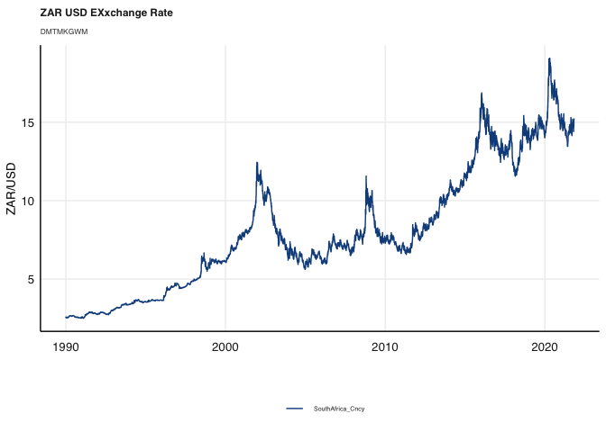
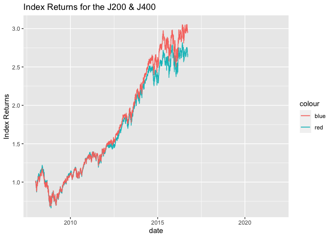

# Purpose

Purpose of this work folder.

Ideally store a minimum working example data set in data folder.

Add binary files in bin, and closed R functions in code. Human Readable
settings files (e.g. csv) should be placed in settings/

``` r
rm(list = ls()) # Clean your environment:
gc() # garbage collection - It can be useful to call gc after a large object has been removed, as this may prompt R to return memory to the operating system.
```

    ##          used (Mb) gc trigger (Mb) limit (Mb) max used (Mb)
    ## Ncells 409971 21.9     842442   45         NA   657805 35.2
    ## Vcells 775172  6.0    8388608   64      16384  1802259 13.8

``` r
library(tidyverse)
```

    ## ── Attaching packages ─────────────────────────────────────── tidyverse 1.3.1 ──

    ## ✓ ggplot2 3.3.5     ✓ purrr   0.3.4
    ## ✓ tibble  3.1.4     ✓ dplyr   1.0.7
    ## ✓ tidyr   1.1.3     ✓ stringr 1.4.0
    ## ✓ readr   2.0.1     ✓ forcats 0.5.1

    ## ── Conflicts ────────────────────────────────────────── tidyverse_conflicts() ──
    ## x dplyr::filter() masks stats::filter()
    ## x dplyr::lag()    masks stats::lag()

``` r
list.files('code/', full.names = T, recursive = T) %>% .[grepl('.R', .)] %>% as.list() %>% walk(~source(.))
```

``` r
#Texevier::create_template_html(directory = "Questions", template_name = "Question1")

#Texevier::create_template_html(directory = "Questions", template_name = "Question2")

#Texevier::create_template_html(directory = "Questions", template_name = "Question3")

#Texevier::create_template_html(directory = "Questions", template_name = "Question4")

#Texevier::create_template_html(directory = "Questions", template_name = "Question5")

#Texevier::create_template_html(directory = "Questions", template_name = "Question6")
```

\#Question 1

\#\#Yield Spread

    ## [1] "/Users/camshepherd/Desktop/FMX/20887671"

\#\#Load in Data

Economists recently pointed out that the current yield spreads in local
mid to longer dated bond yields have since 2020 been the highest in
decades. Lets start our analysis with looking at the yield spreads over
the different dated SA bonds.

    ## # A tibble: 17,145 × 3
    ##    date       Ticker Yield
    ##    <date>     <chr>  <dbl>
    ##  1 1999-12-06 SA_3M   11.3
    ##  2 1999-12-07 SA_3M   11.3
    ##  3 1999-12-08 SA_3M   11.3
    ##  4 1999-12-09 SA_3M   11.3
    ##  5 1999-12-10 SA_3M   11.3
    ##  6 1999-12-13 SA_3M   11.3
    ##  7 1999-12-14 SA_3M   11.3
    ##  8 1999-12-15 SA_3M   11.3
    ##  9 1999-12-16 SA_3M   11.3
    ## 10 1999-12-17 SA_3M   11.3
    ## # … with 17,135 more rows

``` r
SA_Bond_All <- SA_bonds_clean %>% 
    
                ggplot() +
                geom_line(aes(date, Yield, color = Ticker)) +
               
  
  # Nice clean theme, with many additions that are now simplified (explore this yourself):
  # E.g. using fmxdat::ggpts, we can change the sizes more easily in millimeters. 
  # theme_fmx also offers simplified size settings, as e.g. below:
  
  fmxdat::theme_fmx(title.size = ggpts(30), 
                    subtitle.size = ggpts(28),
                    caption.size = ggpts(25),
                    # Makes nicer caption. If no caption given, this will break function, so careful:
                    CustomCaption = T) + 
  
  # crisp colours:
  fmxdat::fmx_cols() + 
  
  labs(x = "", y = "Bond Yields", caption = "Note:\nCalculation own",
       title = "Bond Yields in South Africa across the 3 month, 2 year and 10 year maturities",
       subtitle = "") + 
  
  guides(color = F)
  
# Finplot now adds finishing touches easily:

  fmxdat::finplot(SA_Bond_All, x.vert = T, x.date.type = "%Y", x.date.dist = "2 years")
```


``` r
 #come back and add legend 
```

\`\` A cursory analysis indicates that bond yields for all maturities
have declined over the 20-year period examined. The largest decline is
experienced by the shortest maturity. We are however, more interested in
the spreads between bonds of different maturities.

    ## # A tibble: 11,430 × 3
    ##    date       Ticker       Spread
    ##    <date>     <chr>         <dbl>
    ##  1 1999-12-06 spread3M10Yr   2.75
    ##  2 1999-12-07 spread3M10Yr   2.72
    ##  3 1999-12-08 spread3M10Yr   2.83
    ##  4 1999-12-09 spread3M10Yr   2.76
    ##  5 1999-12-10 spread3M10Yr   2.67
    ##  6 1999-12-13 spread3M10Yr   2.66
    ##  7 1999-12-14 spread3M10Yr   2.62
    ##  8 1999-12-15 spread3M10Yr   2.55
    ##  9 1999-12-16 spread3M10Yr   2.55
    ## 10 1999-12-17 spread3M10Yr   2.45
    ## # … with 11,420 more rows

``` r
#bond spreads with the 3m bond yield as the reference point 
Bond_spreads_st %>% ggplot + 
                geom_line(aes(date, Spread, color = Ticker))+
                theme_bw()
```


Evidently, the spread between the shortest dated maturity and the mid
and longer termed bonds have widened recently. The divergence seems to
have started in late 2018 and has continued to have widened since.

    ## # A tibble: 5,715 × 4
    ##    date       SA_3M ZA_10Yr ZA_2Yr
    ##    <date>     <dbl>   <dbl>  <dbl>
    ##  1 1999-12-06  11.3    14.0   12.7
    ##  2 1999-12-07  11.3    14.0   12.7
    ##  3 1999-12-08  11.3    14.1   12.8
    ##  4 1999-12-09  11.3    14.1   12.7
    ##  5 1999-12-10  11.3    14.0   12.7
    ##  6 1999-12-13  11.3    14.0   12.7
    ##  7 1999-12-14  11.3    13.9   12.6
    ##  8 1999-12-15  11.3    13.8   12.6
    ##  9 1999-12-16  11.3    13.8   12.6
    ## 10 1999-12-17  11.3    13.7   12.5
    ## # … with 5,705 more rows

\#\#Comparing local spreads to international spreads

    ## # A tibble: 149,948 × 3
    ##    date       Name     Bond_10Yr
    ##    <date>     <chr>        <dbl>
    ##  1 1999-11-02 AUS_10Yr      6.57
    ##  2 1999-11-03 AUS_10Yr      6.57
    ##  3 1999-11-04 AUS_10Yr      6.57
    ##  4 1999-11-05 AUS_10Yr      6.57
    ##  5 1999-11-08 AUS_10Yr      6.57
    ##  6 1999-11-09 AUS_10Yr      6.57
    ##  7 1999-11-10 AUS_10Yr      6.57
    ##  8 1999-11-11 AUS_10Yr      6.57
    ##  9 1999-11-12 AUS_10Yr      6.57
    ## 10 1999-11-15 AUS_10Yr      6.57
    ## # … with 149,938 more rows

\#\#Carry trade


\#Question 2

The ALSI Top40 is an equity Index of the 40 largest companies by market
capitalisation, listed on the JSE where the fund is rebalanced
quarterly.

The SWIX All Share Index represents 99% of the full market cap value of
all eligible securities listed on the Main Board of the JSE however, all
constituents are weighted by an alternate free float, called the SWIX
free float. The SWIX top 40 thus represents the largest 40 companies
weighted by the SWIX free float.

    ## # A tibble: 146,383 × 8
    ##    date       Tickers       Short.Name    Return Sector Index_Name   J400   J200
    ##    <date>     <chr>         <chr>          <dbl> <chr>  <chr>       <dbl>  <dbl>
    ##  1 2008-01-02 AGL SJ Equity ANGLO AMER…  1.06e-2 Resou… Large_Caps 0.0747 0.156 
    ##  2 2008-01-02 BHP SJ Equity BHP GROUP …  1.40e-2 Resou… Large_Caps 0.0686 0.143 
    ##  3 2008-01-02 CFR SJ Equity RICHEMONT-…  5.41e-3 Indus… Large_Caps 0.0431 0.0675
    ##  4 2008-01-02 MTN SJ Equity MTN GROUP …  2.69e-2 Indus… Large_Caps 0.106  0.0663
    ##  5 2008-01-02 SAB SJ Equity SABMILLER …  1.42e-2 Indus… Large_Caps 0.0381 0.0597
    ##  6 2008-01-02 SOL SJ Equity SASOL LTD    1.77e-2 Resou… Large_Caps 0.0709 0.0593
    ##  7 2008-01-02 IMP SJ Equity IMPALA PLA…  2.17e-2 Resou… Large_Caps 0.0501 0.0419
    ##  8 2008-01-02 SBK SJ Equity STANDARD B…  1.32e-2 Finan… Large_Caps 0.0612 0.0384
    ##  9 2008-01-02 OML SJ Equity OLD MUTUAL… -4.36e-4 Finan… Large_Caps 0.0224 0.0352
    ## 10 2008-01-02 REM SJ Equity REMGRO LTD  -1.61e-3 Indus… Large_Caps 0.0431 0.0271
    ## # … with 146,373 more rows

    ## # A tibble: 146,383 × 3
    ##    date       J400Return J200Return
    ##    <date>          <dbl>      <dbl>
    ##  1 2008-01-02       1.00       1.00
    ##  2 2008-01-02       1.00       1.00
    ##  3 2008-01-02       1.00       1.00
    ##  4 2008-01-02       1.00       1.01
    ##  5 2008-01-02       1.01       1.01
    ##  6 2008-01-02       1.01       1.01
    ##  7 2008-01-02       1.01       1.01
    ##  8 2008-01-02       1.01       1.01
    ##  9 2008-01-02       1.01       1.01
    ## 10 2008-01-02       1.01       1.01
    ## # … with 146,373 more rows


 The
difference between the indexes above is how each index is capped. The
figure above indicates that the J200 has returned above that of the
J400.

\#Question 3

PCA allows the modeler a means of identifying structure in the
covariance / correlation matrix to locate low-dimensional subspaces
containing most of the variation in the data.

Let’s ensure our data is mean centered, as well as scaled, when doing
the PCA (this is important, as our returns data are typically skew,
non-normal and non-zero meaned. Thus a log transformation, scaling and
mean-centering is standard practice).

    ## # A tibble: 144,663 × 3
    ##    date       Tickers          Return
    ##    <date>     <chr>             <dbl>
    ##  1 2008-01-02 AGL SJ Equity  0.0106  
    ##  2 2008-01-02 BHP SJ Equity  0.0140  
    ##  3 2008-01-02 CFR SJ Equity  0.00541 
    ##  4 2008-01-02 MTN SJ Equity  0.0269  
    ##  5 2008-01-02 SAB SJ Equity  0.0142  
    ##  6 2008-01-02 SOL SJ Equity  0.0177  
    ##  7 2008-01-02 IMP SJ Equity  0.0217  
    ##  8 2008-01-02 SBK SJ Equity  0.0132  
    ##  9 2008-01-02 OML SJ Equity -0.000436
    ## 10 2008-01-02 REM SJ Equity -0.00161 
    ## # … with 144,653 more rows

    ## # A tibble: 3,458 × 89
    ##    date       `ABG SJ Equity` `ACL SJ Equity` `AEG SJ Equity` `AGL SJ Equity`
    ##    <date>               <dbl>           <dbl>           <dbl>           <dbl>
    ##  1 2008-01-02       -0.000524        0.0257           0.00784        0.00996 
    ##  2 2008-01-03       -0.0185         -0.000614         0.00291       -0.0117  
    ##  3 2008-01-04       -0.0115          0.00439         -0.0183        -0.00240 
    ##  4 2008-01-07       -0.0171         -0.00346         -0.0221        -0.0272  
    ##  5 2008-01-08        0.0192          0.0197           0.0175        -0.00555 
    ##  6 2008-01-09       -0.00987         0.0159          -0.0231        -0.0356  
    ##  7 2008-01-10       -0.0128         -0.0260          -0.0428        -0.0237  
    ##  8 2008-01-11       -0.0174         -0.0227          -0.0440         0.00470 
    ##  9 2008-01-14        0.0281          0.0363           0.00398        0.0157  
    ## 10 2008-01-15       -0.0144          0.00709         -0.0291        -0.000591
    ## # … with 3,448 more rows, and 84 more variables: AMS SJ Equity <dbl>,
    ## #   ANG SJ Equity <dbl>, APN SJ Equity <dbl>, ARI SJ Equity <dbl>,
    ## #   ASR SJ Equity <dbl>, AXL SJ Equity <dbl>, BAT SJ Equity <dbl>,
    ## #   BAW SJ Equity <dbl>, BHP SJ Equity <dbl>, BID SJ Equity <dbl>,
    ## #   BTI SJ Equity <dbl>, BVT SJ Equity <dbl>, CCO SJ Equity <dbl>,
    ## #   CFR SJ Equity <dbl>, CLS SJ Equity <dbl>, CPI SJ Equity <dbl>,
    ## #   DSY SJ Equity <dbl>, EXX SJ Equity <dbl>, FFA SJ Equity <dbl>, …

    ## [1] FALSE

*A**E* = *λ**E*

*E*<sup>*T*</sup>*Σ**E* = *λ*

where E and λ the eigenvectors and eigenvalues, and Σ the demeaned
covariance matrix. Note, eigen does not demean the data, we have to (as
done using earlier).

    ## [1] TRUE

    ##  [1] 0.1190046230 0.0462993472 0.0311528999 0.0222604677 0.0190042572
    ##  [6] 0.0170513353 0.0161847370 0.0156714439 0.0153625391 0.0146990383
    ## [11] 0.0145789405 0.0143862752 0.0141635096 0.0137626262 0.0133923568
    ## [16] 0.0133797962 0.0132220955 0.0129860315 0.0128189778 0.0126340450
    ## [21] 0.0122981356 0.0122058511 0.0121090222 0.0119874626 0.0119086106
    ## [26] 0.0118974091 0.0116560419 0.0115362643 0.0113623097 0.0113433388
    ## [31] 0.0111885566 0.0111047001 0.0110020843 0.0109710621 0.0108584587
    ## [36] 0.0107218965 0.0106057134 0.0105219732 0.0104633641 0.0103864577
    ## [41] 0.0101671068 0.0101208906 0.0099945819 0.0098666260 0.0097621555
    ## [46] 0.0096970502 0.0096306677 0.0095066018 0.0094856406 0.0093570916
    ## [51] 0.0090096986 0.0089751630 0.0088977791 0.0088781036 0.0086290950
    ## [56] 0.0085292520 0.0084317176 0.0082244426 0.0081835251 0.0080953521
    ## [61] 0.0079921989 0.0078838208 0.0078672664 0.0075405619 0.0073268676
    ## [66] 0.0070370458 0.0067982277 0.0065629013 0.0063042651 0.0062676550
    ## [71] 0.0061191523 0.0058799940 0.0054319962 0.0053118094 0.0050496367
    ## [76] 0.0047402954 0.0045161088 0.0041665987 0.0038775025 0.0036262615
    ## [81] 0.0034878493 0.0031529902 0.0024205757 0.0023194656 0.0021809580
    ## [86] 0.0020798814 0.0018178173 0.0006536999


\#Calcualating a rolling constituent correlation perspective

    ## # A tibble: 144,379 × 3
    ##    date       Tickers          Return
    ##    <date>     <chr>             <dbl>
    ##  1 2008-01-02 AGL SJ Equity  0.0106  
    ##  2 2008-01-02 BHP SJ Equity  0.0140  
    ##  3 2008-01-02 CFR SJ Equity  0.00541 
    ##  4 2008-01-02 MTN SJ Equity  0.0269  
    ##  5 2008-01-02 SAB SJ Equity  0.0142  
    ##  6 2008-01-02 SOL SJ Equity  0.0177  
    ##  7 2008-01-02 IMP SJ Equity  0.0217  
    ##  8 2008-01-02 SBK SJ Equity  0.0132  
    ##  9 2008-01-02 OML SJ Equity -0.000436
    ## 10 2008-01-02 REM SJ Equity -0.00161 
    ## # … with 144,369 more rows

    ## [1] FALSE

We use the performance analytics package to create a rolling correlation
between the J200 and J400.


\#Question 4

The South African rand (ZAR) has over the past few years been one of the
most volatile currencies

    ## # A tibble: 340,146 × 3
    ##    date       Name           Price
    ##    <date>     <chr>          <dbl>
    ##  1 1992-01-03 Argentina_Cncy 0.988
    ##  2 1992-01-06 Argentina_Cncy 0.992
    ##  3 1992-01-07 Argentina_Cncy 0.992
    ##  4 1992-01-08 Argentina_Cncy 0.996
    ##  5 1992-01-09 Argentina_Cncy 1.00 
    ##  6 1992-01-10 Argentina_Cncy 1.00 
    ##  7 1992-01-13 Argentina_Cncy 1.00 
    ##  8 1992-01-14 Argentina_Cncy 1.00 
    ##  9 1992-01-15 Argentina_Cncy 0.991
    ## 10 1992-01-16 Argentina_Cncy 0.994
    ## # … with 340,136 more rows

The ZAR has generally performed well during periods where G10 currency
carry trades have been favourable and these currency valuations
relatively cheap. Globally, it has been one of the currencies that most
benefit during periods where the Dollar is comparatively strong,
indicating a risk-on sentiment

    ## # A tibble: 11,627 × 42
    ##    date       `Argentina ` `Australia  ` `Bostwana  ` `Brazil ` `Bulgaria `
    ##    <date>            <dbl>         <dbl>        <dbl>     <dbl>       <dbl>
    ##  1 1990-01-01           NA          1.27           NA        NA          NA
    ##  2 1990-01-02           NA          1.27           NA        NA          NA
    ##  3 1990-01-03           NA          1.28           NA        NA          NA
    ##  4 1990-01-04           NA          1.27           NA        NA          NA
    ##  5 1990-01-05           NA          1.27           NA        NA          NA
    ##  6 1990-01-06           NA         NA              NA        NA          NA
    ##  7 1990-01-07           NA         NA              NA        NA          NA
    ##  8 1990-01-08           NA          1.27           NA        NA          NA
    ##  9 1990-01-09           NA          1.27           NA        NA          NA
    ## 10 1990-01-10           NA          1.27           NA        NA          NA
    ## # … with 11,617 more rows, and 36 more variables: Canada  <dbl>, Chile  <dbl>,
    ## #   China  <dbl>, Columbia  <dbl>, Czech  <dbl>, Denmark  <dbl>, Egypt  <dbl>,
    ## #   EU   <dbl>, Ghana  <dbl>, HongKong  <dbl>, Hungary  <dbl>, India  <dbl>,
    ## #   Israel  <dbl>, Japan  <dbl>, Malaysia  <dbl>, Mexico  <dbl>,
    ## #   Nigeria  <dbl>, Norway  <dbl>, NZ   <dbl>, Peru  <dbl>, Philipines  <dbl>,
    ## #   Poland  <dbl>, Romania  <dbl>, Russia  <dbl>, Saudi  <dbl>,
    ## #   Singapore  <dbl>, SouthAfrica  <dbl>, SouthKorea  <dbl>, Sweden  <dbl>, …

    ## # A tibble: 11,627 × 2
    ##    date       `SouthAfrica `
    ##    <date>              <dbl>
    ##  1 1990-01-01           2.55
    ##  2 1990-01-02           2.57
    ##  3 1990-01-03           2.58
    ##  4 1990-01-04           2.53
    ##  5 1990-01-05           2.54
    ##  6 1990-01-06          NA   
    ##  7 1990-01-07          NA   
    ##  8 1990-01-08           2.53
    ##  9 1990-01-09           2.54
    ## 10 1990-01-10           2.54
    ## # … with 11,617 more rows


We can note the relative depreciation of the ZAR to the USD over the 30
year window. Our concern falls on whether the ZAR has become more
volatile in comparison to global currencies.

    ## # A tibble: 11,627 × 4
    ##    date       `SouthAfrica `  dlogret scaledret
    ##    <date>              <dbl>    <dbl>     <dbl>
    ##  1 1990-01-01           2.55 NA        NA      
    ##  2 1990-01-02           2.57  0.00508   0.00491
    ##  3 1990-01-03           2.58  0.00486   0.00469
    ##  4 1990-01-04           2.53 -0.0188   -0.0190 
    ##  5 1990-01-05           2.54  0.00296   0.00279
    ##  6 1990-01-06          NA    NA        NA      
    ##  7 1990-01-07          NA    NA        NA      
    ##  8 1990-01-08           2.53 NA        NA      
    ##  9 1990-01-09           2.54  0.00375   0.00358
    ## 10 1990-01-10           2.54  0.00118   0.00101
    ## # … with 11,617 more rows

    ##                  dlogret
    ## 1990-01-02  5.080120e-03
    ## 1990-01-03  4.860513e-03
    ## 1990-01-04 -1.879460e-02
    ## 1990-01-05  2.960042e-03
    ## 1990-01-09  3.747909e-03
    ## 1990-01-10  1.180638e-03
    ## 1990-01-11  0.000000e+00
    ## 1990-01-12  9.828011e-04
    ## 1990-01-16  2.928260e-03
    ## 1990-01-17 -1.951220e-03
    ## 1990-01-18  1.951220e-03
    ## 1990-01-19 -4.885208e-03
    ## 1990-01-23 -8.391112e-03
    ## 1990-01-24  4.106782e-03
    ## 1990-01-25 -3.714932e-03
    ## 1990-01-26  1.958672e-04
    ## 1990-01-30  6.245141e-03
    ## 1990-01-31 -2.532387e-03
    ## 1990-02-01 -5.280153e-03
    ## 1990-02-02  2.741337e-03
    ## 1990-02-06  2.968829e-03
    ## 1990-02-07  3.951788e-04
    ## 1990-02-08  2.958874e-03
    ## 1990-02-09  5.907256e-04
    ## 1990-02-13 -2.951306e-03
    ## 1990-02-14  2.558301e-03
    ## 1990-02-15  1.963480e-03
    ## 1990-02-16  2.351098e-03
    ## 1990-02-20 -6.298469e-04
    ## 1990-02-21 -1.379175e-03
    ## 1990-02-22 -3.943995e-04
    ## 1990-02-23  3.937013e-03
    ## 1990-02-27  1.764187e-03
    ## 1990-02-28  1.956565e-03
    ## 1990-03-01  1.107991e-02
    ## 1990-03-02 -1.160542e-03
    ## 1990-03-06  4.852965e-03
    ## 1990-03-07  3.872217e-04
    ## 1990-03-08  2.320187e-03
    ## 1990-03-09  0.000000e+00
    ## 1990-03-13  4.974183e-03
    ## 1990-03-14  9.537435e-04
    ## 1990-03-15 -9.537435e-04
    ## 1990-03-16 -7.278331e-03
    ## 1990-03-20  2.874942e-03
    ## 1990-03-21  6.295928e-03
    ## 1990-03-22 -1.522650e-03
    ## 1990-03-23  2.663117e-03
    ## 1990-03-27  2.828856e-03
    ## 1990-03-28 -3.767188e-04
    ## 1990-03-29 -2.263298e-03
    ## 1990-03-30  2.640017e-03
    ## 1990-04-03 -6.569709e-03
    ## 1990-04-04  0.000000e+00
    ## 1990-04-05 -3.767188e-04
    ## 1990-04-06  3.767188e-04
    ## 1990-04-10 -1.701484e-03
    ## 1990-04-11  5.674832e-04
    ## 1990-04-12  1.322877e-03
    ## 1990-04-13  0.000000e+00
    ## 1990-04-17  1.886793e-03
    ## 1990-04-18  0.000000e+00
    ## 1990-04-19 -1.697953e-03
    ## 1990-04-20  1.132289e-03
    ## 1990-04-24 -5.648122e-04
    ## 1990-04-25 -2.828856e-03
    ## 1990-04-26  3.205433e-03
    ## 1990-04-27 -5.095793e-03
    ## 1990-05-01  5.630102e-04
    ## 1990-05-02 -3.759403e-03
    ## 1990-05-03  3.384098e-03
    ## 1990-05-04 -6.212954e-03
    ## 1990-05-08  9.447332e-04
    ## 1990-05-09 -1.044148e-02
    ## 1990-05-10  4.759647e-03
    ## 1990-05-11 -9.501188e-04
    ## 1990-05-15  1.897534e-03
    ## 1990-05-16  1.893940e-03
    ## 1990-05-17  0.000000e+00
    ## 1990-05-18  0.000000e+00
    ## 1990-05-22  1.892148e-03
    ## 1990-05-23  7.561151e-05
    ## 1990-05-24 -4.812712e-03
    ## 1990-05-25  7.945558e-03
    ## 1990-05-29  1.129944e-03
    ## 1990-05-30  1.692525e-03
    ## 1990-05-31  5.635390e-04
    ## 1990-06-01  1.876173e-03
    ## 1990-06-05 -3.766483e-03
    ## 1990-06-06  6.394605e-03
    ## 1990-06-07 -7.501876e-04
    ## 1990-06-08  1.499813e-03
    ## 1990-06-12  7.494848e-04
    ## 1990-06-13 -2.625658e-03
    ## 1990-06-14  9.385266e-04
    ## 1990-06-15  0.000000e+00
    ## 1990-06-19  1.881468e-03
    ## 1990-06-20  3.565066e-03
    ## 1990-06-21 -1.687131e-03
    ## 1990-06-22 -9.385266e-04
    ## 1990-06-26 -2.818226e-03
    ## 1990-06-27  9.778848e-04
    ## 1990-06-28 -3.759328e-05
    ## 1990-06-29 -1.881468e-03
    ## 1990-07-03 -9.438415e-04
    ## 1990-07-04 -9.447332e-04
    ## 1990-07-05  4.535833e-04
    ## 1990-07-06 -4.535833e-04
    ## 1990-07-10 -2.461423e-03
    ## 1990-07-11  7.580065e-04
    ## 1990-07-12  2.837418e-03
    ## 1990-07-13 -2.837418e-03
    ## 1990-07-17 -7.983316e-03
    ## 1990-07-18  3.809528e-03
    ## 1990-07-19 -3.803004e-04
    ## 1990-07-20 -9.170871e-03
    ## 1990-07-24  8.666400e-03
    ## 1990-07-25 -7.699749e-03
    ## 1990-07-26  2.894358e-03
    ## 1990-07-27  9.629274e-04
    ## 1990-07-31 -3.854312e-03
    ## 1990-08-01  1.930688e-04
    ## 1990-08-02 -1.930688e-04
    ## 1990-08-03 -5.421117e-03
    ## 1990-08-07 -6.211200e-03
    ## 1990-08-08  1.007370e-02
    ## 1990-08-09  0.000000e+00
    ## 1990-08-10  5.780904e-04
    ## 1990-08-14 -9.672116e-04
    ## 1990-08-15 -3.295535e-03
    ## 1990-08-16  7.763976e-04
    ## 1990-08-17 -4.082829e-03
    ## 1990-08-21  3.897876e-04
    ## 1990-08-22 -2.341008e-03
    ## 1990-08-23 -4.502308e-03
    ## 1990-08-24  2.547273e-03
    ## 1990-08-28 -2.154962e-03
    ## 1990-08-29 -1.961361e-04
    ## 1990-08-30  4.306133e-03
    ## 1990-08-31  4.870930e-03
    ## 1990-09-04 -1.939865e-03
    ## 1990-09-05 -3.891055e-03
    ## 1990-09-06 -3.899396e-04
    ## 1990-09-07  7.266824e-03
    ## 1990-09-11  4.570817e-03
    ## 1990-09-12 -1.934237e-03
    ## 1990-09-13  9.675859e-04
    ## 1990-09-14 -5.819609e-03
    ## 1990-09-18 -2.928260e-03
    ## 1990-09-19  5.847970e-03
    ## 1990-09-20  1.359620e-03
    ## 1990-09-21  1.551591e-03
    ## 1990-09-25 -1.559455e-03
    ## 1990-09-26  2.143624e-03
    ## 1990-09-27 -9.738047e-04
    ## 1990-09-28  7.791196e-04
    ## 1990-10-02  2.528446e-03
    ## 1990-10-03 -2.333723e-03
    ## 1990-10-04 -3.901683e-03
    ## 1990-10-05 -3.916965e-03
    ## 1990-10-09 -2.282926e-03
    ## 1990-10-10  9.059220e-04
    ## 1990-10-11  5.903769e-04
    ## 1990-10-12 -5.325982e-03
    ## 1990-10-16  2.165142e-03
    ## 1990-10-17 -4.137529e-03
    ## 1990-10-18  1.974139e-04
    ## 1990-10-19  7.892660e-04
    ## 1990-10-23 -7.877117e-04
    ## 1990-10-24 -1.182732e-03
    ## 1990-10-25 -2.053389e-03
    ## 1990-10-26  4.023833e-03
    ## 1990-10-30 -1.688361e-03
    ## 1990-10-31 -8.649159e-04
    ## 1990-11-01  1.964637e-03
    ## 1990-11-02 -2.948405e-03
    ## 1990-11-06 -1.345097e-03
    ## 1990-11-07 -3.959612e-04
    ## 1990-11-08  3.952574e-03
    ## 1990-11-09 -9.866799e-04
    ## 1990-11-13 -3.959612e-04
    ## 1990-11-14  0.000000e+00
    ## 1990-11-15  1.859656e-03
    ## 1990-11-16 -2.767509e-04
    ## 1990-11-20  1.584159e-03
    ## 1990-11-21 -3.170831e-03
    ## 1990-11-22 -3.970617e-04
    ## 1990-11-23 -1.192132e-03
    ## 1990-11-27 -2.977079e-03
    ## 1990-11-28 -2.188838e-03
    ## 1990-11-29 -1.195934e-03
    ## 1990-11-30  4.814876e-03
    ## 1990-12-04  3.947893e-03
    ## 1990-12-05 -3.947893e-03
    ## 1990-12-06 -5.951218e-03
    ## 1990-12-07  7.955450e-04
    ## 1990-12-11  1.592991e-03
    ## 1990-12-12 -1.989852e-04
    ## 1990-12-13  3.575689e-03
    ## 1990-12-14 -9.919652e-04
    ## 1990-12-18  4.578489e-03
    ## 1990-12-19 -3.980105e-03
    ## 1990-12-20  1.268097e-02
    ## 1990-12-21  8.040047e-03
    ## 1990-12-25  0.000000e+00
    ## 1990-12-26  0.000000e+00
    ## 1990-12-27 -7.739938e-04
    ## 1990-12-28 -7.382975e-03
    ## 1991-01-01  0.000000e+00
    ## 1991-01-02 -5.870858e-03
    ## 1991-01-03 -2.948405e-03
    ## 1991-01-04 -5.527057e-03
    ## 1991-01-08 -1.943635e-03
    ## 1991-01-09 -4.093972e-03
    ## 1991-01-10  2.536339e-03
    ## 1991-01-11  7.764014e-03
    ## 1991-01-15  0.000000e+00
    ## 1991-01-16 -1.156738e-03
    ## 1991-01-17 -8.913060e-03
    ## 1991-01-18 -7.619457e-03
    ## 1991-01-22 -8.862687e-03
    ## 1991-01-23  1.978044e-04
    ## 1991-01-24  6.702174e-03
    ## 1991-01-25  1.570475e-03
    ## 1991-01-29 -9.818361e-04
    ## 1991-01-30 -2.951306e-03
    ## 1991-01-31  2.165142e-03
    ## 1991-02-01 -1.186723e-02
    ## 1991-02-05 -9.925559e-04
    ## 1991-02-06 -4.977611e-03
    ## 1991-02-07 -3.599284e-03
    ## 1991-02-08  1.155161e-02
    ## 1991-02-12  6.354271e-03
    ## 1991-02-13  3.556613e-03
    ## 1991-02-14  7.886436e-04
    ## 1991-02-15  3.940887e-04
    ## 1991-02-19 -4.145697e-03
    ## 1991-02-20  7.685524e-03
    ## 1991-02-21 -2.948985e-03
    ## 1991-02-22 -1.969085e-04
    ## 1991-02-26  1.754557e-03
    ## 1991-02-27  3.894839e-04
    ## 1991-02-28 -3.894839e-04
    ## 1991-03-01  8.919974e-03
    ## 1991-03-05  2.905571e-03
    ## 1991-03-06 -1.936109e-03
    ## 1991-03-07  5.797118e-03
    ## 1991-03-08 -3.667604e-03
    ## 1991-03-12  7.659901e-04
    ## 1991-03-13 -1.724304e-03
    ## 1991-03-14  7.640916e-03
    ## 1991-03-15  5.314114e-03
    ## 1991-03-19  1.743044e-02
    ## 1991-03-20 -7.380107e-03
    ## 1991-03-21 -1.192264e-02
    ## 1991-03-22  1.099629e-02
    ## 1991-03-26  9.189552e-03
    ## 1991-03-27 -5.489981e-04
    ## 1991-03-28  5.489981e-04
    ## 1991-03-29  0.000000e+00
    ## 1991-04-02 -1.214813e-02
    ## 1991-04-03 -1.853569e-03
    ## 1991-04-04  5.181359e-03
    ## 1991-04-05 -5.181359e-03
    ## 1991-04-09 -2.766253e-03
    ## 1991-04-10 -2.773927e-03
    ## 1991-04-11 -9.263549e-04
    ## 1991-04-12  7.386922e-03
    ## 1991-04-16  3.682563e-04
    ## 1991-04-17 -1.068317e-03
    ## 1991-04-18  4.376536e-03
    ## 1991-04-19  1.637889e-02
    ## 1991-04-23  0.000000e+00
    ## 1991-04-24  1.978240e-03
    ## 1991-04-25 -1.438332e-03
    ## 1991-04-26  3.053986e-03
    ## 1991-04-30 -8.104502e-03
    ## 1991-05-01 -3.623192e-03
    ## 1991-05-02  6.151639e-03
    ## 1991-05-03  1.094279e-02
    ## 1991-05-07 -5.165375e-03
    ## 1991-05-08 -1.115489e-03
    ## 1991-05-09  6.280864e-03
    ## 1991-05-10 -1.432152e-03
    ## 1991-05-14 -3.226387e-03
    ## 1991-05-15 -3.597126e-03
    ## 1991-05-16  1.800181e-03
    ## 1991-05-17  1.215603e-02
    ## 1991-05-21 -4.771579e-03
    ## 1991-05-22  1.212856e-03
    ## 1991-05-23  1.780944e-03
    ## 1991-05-24 -3.565066e-03
    ## 1991-05-28  1.070855e-03
    ## 1991-05-29 -1.964111e-03
    ## 1991-05-30  4.458322e-03
    ## 1991-05-31  4.261370e-03
    ## 1991-06-04 -2.298242e-03
    ## 1991-06-05 -1.771480e-03
    ## 1991-06-06  6.362694e-03
    ## 1991-06-07  1.760254e-03
    ## 1991-06-11  7.027407e-04
    ## 1991-06-12  5.604218e-03
    ## 1991-06-13  6.961393e-03
    ## 1991-06-14 -3.474639e-03
    ## 1991-06-18  2.943470e-03
    ## 1991-06-19 -5.026443e-03
    ## 1991-06-20 -1.737770e-04
    ## 1991-06-21  1.389372e-03
    ## 1991-06-25  7.654874e-03
    ## 1991-06-26 -2.603038e-03
    ## 1991-06-27 -8.691874e-04
    ## 1991-06-28  4.511547e-03
    ## 1991-07-02  5.859055e-03
    ## 1991-07-03 -2.821847e-03
    ## 1991-07-04  2.684381e-03
    ## 1991-07-05  4.810501e-04
    ## 1991-07-09  7.809150e-03
    ## 1991-07-10 -2.596280e-03
    ## 1991-07-11  5.185837e-03
    ## 1991-07-12 -1.214239e-02
    ## 1991-07-16  5.231049e-03
    ## 1991-07-17 -8.699435e-04
    ## 1991-07-18 -8.707010e-04
    ## 1991-07-19 -6.642220e-03
    ## 1991-07-23  3.484324e-03
    ## 1991-07-24 -7.681602e-03
    ## 1991-07-25  4.546257e-03
    ## 1991-07-26 -1.012376e-03
    ## 1991-07-30  2.228568e-03
    ## 1991-07-31 -3.798510e-03
    ## 1991-08-01  6.631647e-04
    ## 1991-08-02  3.830755e-03
    ## 1991-08-06 -1.052447e-03
    ## 1991-08-07 -3.164003e-03
    ## 1991-08-08  1.759015e-03
    ## 1991-08-09  6.132301e-03
    ## 1991-08-13  1.748405e-04
    ## 1991-08-14  3.316174e-03
    ## 1991-08-15  2.262641e-03
    ## 1991-08-16  3.471020e-03
    ## 1991-08-20 -7.926976e-03
    ## 1991-08-21 -1.218466e-02
    ## 1991-08-22  4.891694e-03
    ## 1991-08-23  3.722585e-03
    ## 1991-08-27  2.783579e-03
    ## 1991-08-28 -1.065419e-02
    ## 1991-08-29  9.785156e-03
    ## 1991-08-30 -5.217845e-04
    ## 1991-09-03 -1.913210e-03
    ## 1991-09-04 -1.184545e-03
    ## 1991-09-05  1.394311e-04
    ## 1991-09-06 -4.016420e-03
    ## 1991-09-10  9.719967e-03
    ## 1991-09-11 -3.518030e-04
    ## 1991-09-12 -3.524854e-03
    ## 1991-09-13 -2.333228e-03
    ## 1991-09-17  8.272172e-03
    ## 1991-09-18  3.473826e-03
    ## 1991-09-19  0.000000e+00
    ## 1991-09-20  2.826857e-03
    ## 1991-09-24 -3.337716e-03
    ## 1991-09-25  4.931624e-03
    ## 1991-09-26 -3.403414e-03
    ## 1991-09-27  3.297232e-03
    ## 1991-10-01  1.248106e-03
    ## 1991-10-02  1.068566e-03
    ## 1991-10-03 -3.560620e-04
    ## 1991-10-04 -1.425517e-03
    ## 1991-10-08  2.200846e-03
    ## 1991-10-09  3.680899e-03
    ## 1991-10-10 -9.189553e-04
    ## 1991-10-11 -1.061383e-03
    ## 1991-10-15  3.530454e-03
    ## 1991-10-16  1.761959e-04
    ## 1991-10-17 -7.049701e-04
    ## 1991-10-18 -3.526715e-04
    ## 1991-10-22  2.328208e-03
    ## 1991-10-23  4.570071e-03
    ## 1991-10-24 -1.403952e-03
    ## 1991-10-25  3.160612e-04
    ## 1991-10-29 -1.402771e-03
    ## 1991-10-30 -2.318882e-03
    ## 1991-10-31 -3.664944e-03
    ## 1991-11-01  0.000000e+00
    ## 1991-11-05  1.068947e-03
    ## 1991-11-06 -1.782214e-03
    ## 1991-11-07  7.132668e-04
    ## 1991-11-08  0.000000e+00
    ## 1991-11-12 -3.030575e-03
    ## 1991-11-13 -5.357621e-04
    ## 1991-11-14 -1.787950e-03
    ## 1991-11-15  1.073153e-03
    ## 1991-11-19 -3.591890e-05
    ## 1991-11-20  3.591309e-04
    ## 1991-11-21 -7.183908e-04
    ## 1991-11-22 -2.518440e-03
    ## 1991-11-26  2.524798e-03
    ## 1991-11-27  6.821064e-03
    ## 1991-11-28  1.430104e-03
    ## 1991-11-29  1.071237e-03
    ## 1991-12-03  1.791794e-03
    ## 1991-12-04 -1.074691e-03
    ## 1991-12-05 -1.434720e-03
    ## 1991-12-06 -3.055633e-03
    ## 1991-12-10 -3.247342e-03
    ## 1991-12-11  1.985739e-03
    ## 1991-12-12 -6.855370e-04
    ## 1991-12-13  1.658913e-03
    ## 1991-12-17 -9.017946e-04
    ## 1991-12-18 -7.220217e-04
    ## 1991-12-19  1.263196e-03
    ## 1991-12-20 -5.606308e-03
    ## 1991-12-24 -1.820996e-04
    ## 1991-12-25  0.000000e+00
    ## 1991-12-26  0.000000e+00
    ## 1991-12-27 -1.275627e-03
    ## 1991-12-31 -1.274233e-03
    ## 1992-01-01  0.000000e+00
    ## 1992-01-02 -1.640689e-03
    ## 1992-01-03  6.401651e-03
    ## 1992-01-07 -3.648969e-04
    ## 1992-01-08 -5.475952e-04
    ## 1992-01-09  5.280901e-03
    ## 1992-01-10  1.514088e-02
    ## 1992-01-14 -2.871502e-03
    ## 1992-01-15  1.285732e-02
    ## 1992-01-16 -1.065152e-03
    ## 1992-01-17 -1.777778e-03
    ## 1992-01-21 -8.980692e-04
    ## 1992-01-22 -8.988765e-04
    ## 1992-01-23  2.155948e-03
    ## 1992-01-24  4.833954e-03
    ## 1992-01-28 -3.925772e-03
    ## 1992-01-29 -5.522102e-03
    ## 1992-01-30  7.379843e-03
    ## 1992-01-31 -9.284389e-04
    ## 1992-02-04 -2.869442e-03
    ## 1992-02-05 -2.157498e-03
    ## 1992-02-06 -9.003332e-04
    ## 1992-02-07  1.620017e-03
    ## 1992-02-11  3.603608e-03
    ## 1992-02-12  7.882520e-03
    ## 1992-02-13  4.628814e-03
    ## 1992-02-14  1.774623e-03
    ## 1992-02-18  7.305515e-03
    ## 1992-02-19  1.553508e-03
    ## 1992-02-20  1.938497e-03
    ## 1992-02-21  3.514942e-03
    ## 1992-02-25 -1.746725e-03
    ## 1992-02-26  5.231049e-03
    ## 1992-02-27 -3.135345e-03
    ## 1992-02-28 -7.705817e-03
    ## 1992-03-03  5.957614e-03
    ## 1992-03-04  6.234890e-03
    ## 1992-03-05 -6.599629e-04
    ## 1992-03-06  1.735810e-03
    ## 1992-03-10 -1.425071e-03
    ## 1992-03-11  6.932437e-03
    ## 1992-03-12  0.000000e+00
    ## 1992-03-13 -1.555613e-03
    ## 1992-03-17 -2.770085e-03
    ## 1992-03-18 -2.430135e-03
    ## 1992-03-19  2.083334e-03
    ## 1992-03-20  3.635423e-03
    ## 1992-03-24  1.072089e-03
    ## 1992-03-25 -3.878793e-03
    ## 1992-03-26  2.460623e-03
    ## 1992-03-27 -6.925208e-04
    ## 1992-03-31 -1.909889e-03
    ## 1992-04-01  3.475239e-04
    ## 1992-04-02  4.160894e-03
    ## 1992-04-03 -6.038959e-03
    ## 1992-04-07  4.779940e-03
    ## 1992-04-08 -3.481288e-04
    ## 1992-04-09  1.217921e-03
    ## 1992-04-10 -3.832757e-03
    ## 1992-04-14 -8.684325e-04
    ## 1992-04-15  1.736112e-03
    ## 1992-04-16  1.906248e-03
    ## 1992-04-17  0.000000e+00
    ## 1992-04-21  5.192557e-04
    ## 1992-04-22 -1.558577e-03
    ## 1992-04-23  3.465604e-04
    ## 1992-04-24 -2.046445e-03
    ## 1992-04-28  8.682817e-04
    ## 1992-04-29 -1.737318e-03
    ## 1992-04-30 -3.130380e-04
    ## 1992-05-01 -3.345184e-03
    ## 1992-05-05  1.745048e-04
    ## 1992-05-06 -2.096071e-03
    ## 1992-05-07  1.397868e-03
    ## 1992-05-08  3.312127e-03
    ## 1992-05-12 -2.614381e-03
    ## 1992-05-13 -5.249356e-03
    ## 1992-05-14 -2.635048e-03
    ## 1992-05-15  2.459594e-03
    ## 1992-05-19 -4.595271e-03
    ## 1992-05-20  1.416180e-03
    ## 1992-05-21  2.649944e-03
    ## 1992-05-22  1.692286e-03
    ## 1992-05-26 -2.857397e-03
    ## 1992-05-27  6.865136e-03
    ## 1992-05-28  2.806427e-04
    ## 1992-05-29 -4.746427e-03
    ## 1992-06-02  1.409940e-03
    ## 1992-06-03 -7.047217e-04
    ## 1992-06-04 -1.375637e-03
    ## 1992-06-05 -3.925665e-03
    ## 1992-06-09 -1.775253e-03
    ## 1992-06-10  2.838895e-03
    ## 1992-06-11 -4.261370e-03
    ## 1992-06-12  8.892842e-04
    ## 1992-06-16  1.427043e-03
    ## 1992-06-17  4.633507e-04
    ## 1992-06-18  2.494077e-04
    ## 1992-06-19  0.000000e+00
    ## 1992-06-23 -2.136753e-03
    ## 1992-06-24 -2.498663e-03
    ## 1992-06-25 -1.072770e-03
    ## 1992-06-26 -3.763783e-03
    ## 1992-06-30  1.804566e-04
    ## 1992-07-01 -4.339971e-03
    ## 1992-07-02 -5.438231e-04
    ## 1992-07-03  1.811595e-03
    ## 1992-07-07 -3.231842e-03
    ## 1992-07-08  2.182056e-04
    ## 1992-07-09  8.689410e-03
    ## 1992-07-10 -5.422027e-03
    ## 1992-07-14  2.623813e-03
    ## 1992-07-15  8.367136e-04
    ## 1992-07-16 -1.637704e-03
    ## 1992-07-17 -3.831772e-03
    ## 1992-07-21  6.343474e-03
    ## 1992-07-22 -1.989331e-03
    ## 1992-07-23  1.085580e-03
    ## 1992-07-24  3.615983e-04
    ## 1992-07-28 -8.341343e-04
    ## 1992-07-29  2.102136e-03
    ## 1992-07-30  1.483331e-03
    ## 1992-07-31 -6.509475e-04
    ## 1992-08-04 -5.778677e-04
    ## 1992-08-05 -1.627045e-03
    ## 1992-08-06  3.431774e-03
    ## 1992-08-07 -1.443522e-03
    ## 1992-08-11  2.887567e-03
    ## 1992-08-12 -1.081861e-03
    ## 1992-08-13 -1.804240e-04
    ## 1992-08-14  9.017946e-04
    ## 1992-08-18 -3.428059e-03
    ## 1992-08-19  1.807174e-04
    ## 1992-08-20 -1.445713e-04
    ## 1992-08-21  5.191446e-03
    ## 1992-08-25 -9.411236e-03
    ## 1992-08-26  2.260959e-03
    ## 1992-08-27  2.437561e-03
    ## 1992-08-28 -2.546845e-03
    ## 1992-09-01 -6.578971e-03
    ## 1992-09-02  3.666361e-04
    ## 1992-09-03  7.668469e-03
    ## 1992-09-04 -3.638348e-04
    ## 1992-09-08 -4.009482e-03
    ## 1992-09-09  6.189716e-03
    ## 1992-09-10  3.261463e-03
    ## 1992-09-11  6.850577e-03
    ## 1992-09-15 -5.676458e-03
    ## 1992-09-16  1.397232e-02
    ## 1992-09-17  5.317008e-03
    ## 1992-09-18  1.754386e-03
    ## 1992-09-22 -1.370369e-03
    ## 1992-09-23  2.493373e-03
    ## 1992-09-24 -3.858904e-04
    ## 1992-09-25 -3.509388e-04
    ## 1992-09-29 -8.128689e-03
    ## 1992-09-30 -1.065152e-03
    ## 1992-10-01  3.262877e-03
    ## 1992-10-02  2.051573e-03
    ## 1992-10-06  6.168045e-03
    ## 1992-10-07  1.871238e-03
    ## 1992-10-08  8.255075e-03
    ## 1992-10-09  4.363389e-03
    ## 1992-10-13  2.788817e-04
    ## 1992-10-14 -4.891694e-03
    ## 1992-10-15 -5.255321e-04
    ## 1992-10-16  7.019288e-03
    ## 1992-10-20  8.148435e-03
    ## 1992-10-21 -3.424247e-05
    ## 1992-10-22  2.396727e-04
    ## 1992-10-23  2.222793e-03
    ## 1992-10-27  1.693825e-03
    ## 1992-10-28  8.458377e-04
    ## 1992-10-29 -3.044192e-04
    ## 1992-10-30  6.425540e-04
    ## 1992-11-03  8.716935e-04
    ## 1992-11-04 -4.702730e-03
    ## 1992-11-05  5.339256e-03
    ## 1992-11-06  3.683303e-04
    ## 1992-11-10  4.162857e-03
    ## 1992-11-11 -4.863920e-03
    ## 1992-11-12 -2.139610e-03
    ## 1992-11-13 -1.004520e-03
    ## 1992-11-17  4.822492e-03
    ## 1992-11-18 -4.655812e-03
    ## 1992-11-19 -4.175371e-03
    ## 1992-11-20  3.341691e-03
    ## 1992-11-24 -1.992033e-03
    ## 1992-11-25 -2.162523e-03
    ## 1992-11-26  2.162523e-03
    ## 1992-11-27  4.476506e-03
    ## 1992-12-01 -4.310352e-03
    ## 1992-12-02 -3.495052e-03
    ## 1992-12-03  1.166375e-03
    ## 1992-12-04  2.162523e-03
    ## 1992-12-08 -8.354267e-03
    ## 1992-12-09  4.185858e-03
    ## 1992-12-10  4.833746e-03
    ## 1992-12-11  9.971748e-04
    ## 1992-12-15  1.327889e-04
    ## 1992-12-16 -8.302201e-04
    ## 1992-12-17 -6.332299e-03
    ## 1992-12-18  6.166172e-03
    ## 1992-12-22  3.153268e-03
    ## 1992-12-23  1.655630e-03
    ## 1992-12-24 -8.274721e-04
    ## 1992-12-25  0.000000e+00
    ## 1992-12-29  1.479074e-02
    ## 1992-12-30 -1.632653e-03
    ## 1992-12-31 -1.635323e-03
    ## 1993-01-01  0.000000e+00
    ## 1993-01-05 -3.612051e-03
    ## 1993-01-06 -8.153282e-04
    ## 1993-01-07  6.523157e-04
    ## 1993-01-08  7.471206e-03
    ## 1993-01-12 -8.146640e-04
    ## 1993-01-13  2.604592e-03
    ## 1993-01-14 -9.759272e-04
    ## 1993-01-15  8.133388e-04
    ## 1993-01-19  3.251504e-04
    ## 1993-01-20  0.000000e+00
    ## 1993-01-21 -3.251504e-04
    ## 1993-01-22  3.251504e-04
    ## 1993-01-26 -1.634120e-04
    ## 1993-01-27  1.796065e-03
    ## 1993-01-28  0.000000e+00
    ## 1993-01-29  2.606714e-03
    ## 1993-02-02  3.233633e-03
    ## 1993-02-03  2.418381e-03
    ## 1993-02-04  4.819286e-03
    ## 1993-02-05 -1.603850e-03
    ## 1993-02-09  0.000000e+00
    ## 1993-02-10 -1.601281e-03
    ## 1993-02-11  3.519441e-03
    ## 1993-02-12  3.831907e-04
    ## 1993-02-16 -3.822878e-03
    ## 1993-02-17 -4.799241e-03
    ## 1993-02-18  4.160672e-03
    ## 1993-02-19 -6.389777e-04
    ## 1993-02-23 -6.393862e-04
    ## 1993-02-24  6.395702e-05
    ## 1993-02-25  3.065136e-03
    ## 1993-02-26  3.405315e-03
    ## 1993-03-02 -1.585917e-04
    ## 1993-03-03  7.927071e-04
    ## 1993-03-04  1.963206e-03
    ## 1993-03-05  2.527488e-03
    ## 1993-03-09 -1.568628e-03
    ## 1993-03-10  1.976068e-03
    ## 1993-03-11  1.158731e-03
    ## 1993-03-12 -7.827789e-04
    ## 1993-03-16 -5.316072e-04
    ## 1993-03-17 -3.128422e-04
    ## 1993-03-18 -1.095719e-03
    ## 1993-03-19 -3.388664e-03
    ## 1993-03-23  0.000000e+00
    ## 1993-03-24 -1.889764e-03
    ## 1993-03-25  4.089985e-03
    ## 1993-03-26  1.255099e-03
    ## 1993-03-30  7.852376e-04
    ## 1993-03-31 -2.200221e-03
    ## 1993-04-01  6.291287e-04
    ## 1993-04-02 -3.780723e-03
    ## 1993-04-06  1.884127e-03
    ## 1993-04-07  2.350177e-03
    ## 1993-04-08 -5.335020e-03
    ## 1993-04-09 -3.147128e-04
    ## 1993-04-13 -1.581028e-03
    ## 1993-04-14  7.908265e-04
    ## 1993-04-15  5.361098e-03
    ## 1993-04-16  3.296965e-03
    ## 1993-04-20 -5.514691e-03
    ## 1993-04-21  2.524776e-03
    ## 1993-04-22  1.260716e-04
    ## 1993-04-23 -4.706932e-03
    ## 1993-04-27  2.860323e-03
    ## 1993-04-28  3.642991e-03
    ## 1993-04-29 -1.740644e-03
    ## 1993-04-30  1.108033e-03
    ## 1993-05-04 -1.645622e-03
    ## 1993-05-05  8.547956e-04
    ## 1993-05-06  9.805318e-04
    ## 1993-05-07 -1.297038e-03
    ## 1993-05-11  5.339280e-04
    ## 1993-05-12 -8.481365e-04
    ## 1993-05-13 -1.446632e-03
    ## 1993-05-14 -7.555962e-04
    ## 1993-05-18  3.768730e-03
    ## 1993-05-19 -4.240822e-03
    ## 1993-05-20 -5.668042e-04
    ## 1993-05-21  5.747594e-03
    ## 1993-05-25 -3.760581e-03
    ## 1993-05-26  2.508625e-03
    ## 1993-05-27 -2.508625e-03
    ## 1993-05-28 -1.382431e-03
    ## 1993-06-01  3.458521e-04
    ## 1993-06-02  7.855830e-04
    ## 1993-06-03  1.224279e-03
    ## 1993-06-04  3.137206e-05
    ## 1993-06-08  1.128774e-03
    ## 1993-06-09  2.034843e-03
    ## 1993-06-10 -1.283034e-03
    ## 1993-06-11 -1.096577e-03
    ## 1993-06-15  3.407265e-03
    ## 1993-06-16  6.376878e-03
    ## 1993-06-17  2.508479e-03
    ## 1993-06-18  4.351657e-03
    ## 1993-06-22  2.583784e-03
    ## 1993-06-23  1.213592e-03
    ## 1993-06-24  7.702220e-03
    ## 1993-06-25 -3.617186e-03
    ## 1993-06-29 -3.002552e-04
    ## 1993-06-30  2.998503e-03
    ## 1993-07-01  3.288002e-03
    ## 1993-07-02 -4.186609e-03
    ## 1993-07-06  2.985520e-04
    ## 1993-07-07 -1.045322e-03
    ## 1993-07-08 -5.393271e-03
    ## 1993-07-09  3.838201e-03
    ## 1993-07-13 -7.288987e-03
    ## 1993-07-14  1.044542e-03
    ## 1993-07-15 -1.343184e-03
    ## 1993-07-16  1.343184e-03
    ## 1993-07-20 -1.497006e-03
    ## 1993-07-21 -8.992806e-04
    ## 1993-07-22  3.143950e-03
    ## 1993-07-23  7.471050e-04
    ## 1993-07-27 -7.456566e-04
    ## 1993-07-28  1.043764e-03
    ## 1993-07-29  4.905979e-03
    ## 1993-07-30  3.996157e-03
    ## 1993-08-03  6.698946e-03
    ## 1993-08-04 -2.406454e-03
    ## 1993-08-05  1.784546e-04
    ## 1993-08-06  7.432182e-04
    ## 1993-08-10  3.715543e-03
    ## 1993-08-11  3.406149e-03
    ## 1993-08-12  2.362671e-03
    ## 1993-08-13 -5.175612e-03
    ## 1993-08-17 -5.963029e-04
    ## 1993-08-18  2.981959e-04
    ## 1993-08-19  1.042986e-03
    ## 1993-08-20 -4.468608e-04
    ## 1993-08-24 -1.486989e-03
    ## 1993-08-25  1.486989e-03
    ## 1993-08-26 -2.976193e-03
    ## 1993-08-27  3.956396e-03
    ## 1993-08-31  2.518706e-03
    ## 1993-09-01  6.804432e-04
    ## 1993-09-02  2.957005e-04
    ## 1993-09-03 -2.160627e-03
    ## 1993-09-07 -7.377352e-04
    ## 1993-09-08  7.851019e-03
    ## 1993-09-09 -4.461934e-03
    ## 1993-09-10  1.998590e-03
    ## 1993-09-14  5.870267e-04
    ## 1993-09-15 -6.751105e-04
    ## 1993-09-16  1.936052e-03
    ## 1993-09-17  6.445187e-04
    ## 1993-09-21  2.867679e-03
    ## 1993-09-22  1.372403e-03
    ## 1993-09-23  3.757158e-03
    ## 1993-09-24 -4.340929e-03
    ## 1993-09-28 -6.508786e-03
    ## 1993-09-29  3.799508e-03
    ## 1993-09-30  4.220951e-03
    ## 1993-10-01  2.176279e-03
    ## 1993-10-05  2.090654e-03
    ## 1993-10-06 -7.254262e-04
    ## 1993-10-07  3.853234e-03
    ## 1993-10-08 -2.402908e-03
    ## 1993-10-12 -9.023493e-03
    ## 1993-10-13 -6.335818e-03
    ## 1993-10-14 -8.391988e-03
    ## 1993-10-15 -7.745049e-03
    ## 1993-10-19  1.193745e-03
    ## 1993-10-20  2.087589e-04
    ## 1993-10-21  2.025679e-03
    ## 1993-10-22  1.932483e-03
    ## 1993-10-26  1.423319e-03
    ## 1993-10-27 -5.928034e-04
    ## 1993-10-28 -3.802286e-03
    ## 1993-10-29 -1.101797e-03
    ## 1993-11-02  9.481763e-04
    ## 1993-11-03 -1.037114e-03
    ## 1993-11-04 -2.374593e-03
    ## 1993-11-05  3.352472e-03
    ## 1993-11-09 -5.959476e-04
    ## 1993-11-10  2.232975e-03
    ## 1993-11-11  1.486878e-04
    ## 1993-11-12 -4.619634e-03
    ## 1993-11-16  2.227007e-03
    ## 1993-11-17 -2.966479e-04
    ## 1993-11-18  1.926640e-03
    ## 1993-11-19 -7.405762e-04
    ## 1993-11-23  1.489092e-04
    ## 1993-11-24  5.954153e-04
    ## 1993-11-25  2.378122e-03
    ## 1993-11-26  2.016967e-03
    ## 1993-11-30 -2.315641e-03
    ## 1993-12-01  1.930073e-03
    ## 1993-12-02  2.669475e-04
    ## 1993-12-03  8.300478e-04
    ## 1993-12-07  1.935533e-03
    ## 1993-12-08  1.337793e-03
    ## 1993-12-09 -5.943537e-04
    ## 1993-12-10 -2.378404e-04
    ## 1993-12-14  2.045324e-03
    ## 1993-12-15  1.775148e-03
    ## 1993-12-16  7.387161e-04
    ## 1993-12-17 -5.909293e-04
    ## 1993-12-21 -6.791974e-04
    ## 1993-12-22  2.362949e-04
    ## 1993-12-23  2.952901e-04
    ## 1993-12-24 -3.549250e-03
    ## 1993-12-28  0.000000e+00
    ## 1993-12-29  3.041805e-03
    ## 1993-12-30  3.737882e-03
    ## 1993-12-31 -1.175779e-03
    ## 1994-01-04  2.203453e-03
    ## 1994-01-05 -1.233335e-03
    ## 1994-01-06 -9.407062e-04
    ## 1994-01-07 -2.945423e-03
    ## 1994-01-11  3.173766e-03
    ## 1994-01-12 -6.534817e-03
    ## 1994-01-13  7.707734e-03
    ## 1994-01-14 -6.449344e-04
    ## 1994-01-18 -3.637648e-03
    ## 1994-01-19  2.201771e-03
    ## 1994-01-20 -8.801268e-04
    ## 1994-01-21 -1.321644e-03
    ## 1994-01-25  2.928174e-03
    ## 1994-01-26 -1.463015e-03
    ## 1994-01-27 -2.227891e-03
    ## 1994-01-28  3.227652e-04
    ## 1994-02-01  7.627318e-04
    ## 1994-02-02  7.328477e-04
    ## 1994-02-03  2.195326e-03
    ## 1994-02-04  1.198077e-03
    ## 1994-02-08  2.213292e-03
    ## 1994-02-09  6.688477e-04
    ## 1994-02-10 -6.979382e-04
    ## 1994-02-11  2.208469e-03
    ## 1994-02-15  4.980279e-03
    ## 1994-02-16 -2.035713e-03
    ## 1994-02-17  5.805363e-03
    ## 1994-02-18 -1.448184e-03
    ## 1994-02-22  3.744783e-03
    ## 1994-02-23  1.345139e-02
    ## 1994-02-24 -1.284778e-02
    ## 1994-02-25 -4.319537e-03
    ## 1994-03-01 -3.614026e-03
    ## 1994-03-02  2.718965e-03
    ## 1994-03-03  8.950613e-04
    ## 1994-03-04  4.348396e-03
    ## 1994-03-08 -1.406006e-03
    ## 1994-03-09 -2.904346e-03
    ## 1994-03-10 -1.450352e-02
    ## 1994-03-11  3.674759e-03
    ## 1994-03-15  0.000000e+00
    ## 1994-03-16 -1.453446e-03
    ## 1994-03-17 -4.373057e-03
    ## 1994-03-18  7.277841e-03
    ## 1994-03-22  0.000000e+00
    ## 1994-03-23  3.540135e-03
    ## 1994-03-24 -3.540135e-03
    ## 1994-03-25  1.452391e-03
    ## 1994-03-29 -2.177164e-03
    ## 1994-03-30  1.011979e-02
    ## 1994-03-31  1.983016e-03
    ## 1994-04-01 -2.270736e-03
    ## 1994-04-05  1.355672e-02
    ## 1994-04-06  7.084461e-04
    ## 1994-04-07  5.226960e-03
    ## 1994-04-08 -1.692239e-03
    ## 1994-04-12  2.785440e-03
    ## 1994-04-13  2.777702e-03
    ## 1994-04-14  6.932217e-04
    ## 1994-04-15  8.968422e-03
    ## 1994-04-19 -2.713134e-02
    ## 1994-04-20  1.400544e-02
    ## 1994-04-21  1.112007e-03
    ## 1994-04-22  1.665695e-03
    ## 1994-04-26 -7.662659e-03
    ## 1994-04-27  2.737432e-03
    ## 1994-04-28 -1.257560e-02
    ## 1994-04-29 -4.955622e-03
    ## 1994-05-03  7.097060e-03
    ## 1994-05-04  1.613459e-02
    ## 1994-05-05  7.183401e-03
    ## 1994-05-06 -1.066884e-02
    ## 1994-05-10 -3.470924e-03
    ## 1994-05-11  1.103730e-02
    ## 1994-05-12 -5.489593e-03
    ## 1994-05-13  8.264282e-03
    ## 1994-05-17  9.304108e-04
    ## 1994-05-18  2.458682e-03
    ## 1994-05-19  2.044294e-03
    ## 1994-05-20 -6.809670e-04
    ## 1994-05-24  4.368011e-03
    ## 1994-05-25 -2.181621e-03
    ## 1994-05-26 -2.870619e-03
    ## 1994-05-27 -2.055499e-03
    ## 1994-05-31 -2.754823e-03
    ## 1994-06-01  4.404081e-03
    ## 1994-06-02 -3.576837e-03
    ## 1994-06-03  2.755960e-04
    ## 1994-06-07 -2.622681e-03
    ## 1994-06-08  6.908463e-04
    ## 1994-06-09 -1.382170e-03
    ## 1994-06-10  1.382170e-03
    ## 1994-06-14 -2.210556e-03
    ## 1994-06-15  2.624492e-03
    ## 1994-06-16  3.167829e-03
    ## 1994-06-17  6.578971e-03
    ## 1994-06-21  5.204778e-03
    ## 1994-06-22 -2.735980e-03
    ## 1994-06-23 -1.005034e-02
    ## 1994-06-24 -3.048783e-03
    ## 1994-06-28  4.135085e-03
    ## 1994-06-29  3.844046e-03
    ## 1994-06-30 -4.111560e-04
    ## 1994-07-01  1.232961e-03
    ## 1994-07-05  6.832935e-04
    ## 1994-07-06  1.910742e-03
    ## 1994-07-07  2.179244e-03
    ## 1994-07-08  1.359620e-03
    ## 1994-07-12 -5.067463e-03
    ## 1994-07-13  4.247454e-03
    ## 1994-07-14  1.229760e-03
    ## 1994-07-15  1.500990e-03
    ## 1994-07-19  2.996869e-03
    ## 1994-07-20  2.580997e-03
    ## 1994-07-21 -1.493449e-03
    ## 1994-07-22  5.420067e-03
    ## 1994-07-26 -2.301809e-03
    ## 1994-07-27 -5.845982e-03
    ## 1994-07-28  4.353748e-03
    ## 1994-07-29 -8.148853e-04
    ## 1994-08-02 -8.215802e-04
    ## 1994-08-03 -2.743486e-03
    ## 1994-08-04 -3.164342e-03
    ## 1994-08-05 -9.650514e-04
    ## 1994-08-09 -1.382457e-04
    ## 1994-08-10 -2.765487e-04
    ## 1994-08-11 -9.685231e-04
    ## 1994-08-12 -5.274127e-03
    ## 1994-08-16 -6.985680e-04
    ## 1994-08-17  1.396648e-03
    ## 1994-08-18 -2.095705e-03
    ## 1994-08-19 -7.555301e-04
    ## 1994-08-23  2.294413e-03
    ## 1994-08-24  1.397331e-04
    ## 1994-08-25 -4.192579e-04
    ## 1994-08-26  2.931121e-03
    ## 1994-08-30 -9.203353e-04
    ## 1994-08-31  1.199058e-03
    ## 1994-09-01 -2.092314e-03
    ## 1994-09-02 -6.425209e-04
    ## 1994-09-06  5.603811e-04
    ## 1994-09-07 -1.401542e-03
    ## 1994-09-08 -2.162224e-03
    ## 1994-09-09 -6.467669e-04
    ## 1994-09-13  1.127078e-03
    ## 1994-09-14 -1.042503e-03
    ## 1994-09-15  2.449567e-03
    ## 1994-09-16 -1.688714e-03
    ## 1994-09-20 -1.691094e-03
    ## 1994-09-21 -1.609193e-03
    ## 1994-09-22 -1.357121e-03
    ## 1994-09-23  4.242981e-04
    ## 1994-09-27  2.031661e-03
    ## 1994-09-28  2.111933e-03
    ## 1994-09-29  3.510007e-03
    ## 1994-09-30 -7.010165e-04
    ## 1994-10-04 -2.797205e-03
    ## 1994-10-05  9.799119e-04
    ## 1994-10-06  1.399091e-04
    ## 1994-10-07 -4.197859e-04
    ## 1994-10-11 -1.959139e-03
    ## 1994-10-12  2.378455e-03
    ## 1994-10-13 -1.538354e-03
    ## 1994-10-14  0.000000e+00
    ## 1994-10-18 -3.339090e-03
    ## 1994-10-19 -2.753220e-03
    ## 1994-10-20  3.546556e-03
    ## 1994-10-21 -7.333954e-03
    ## 1994-10-25 -2.660832e-03
    ## 1994-10-26  2.575109e-03
    ## 1994-10-27  0.000000e+00
    ## 1994-10-28 -1.286725e-03
    ## 1994-11-01 -3.286421e-03
    ## 1994-11-02  1.858869e-03
    ## 1994-11-03  2.311612e-03
    ## 1994-11-04  1.680409e-03
    ## 1994-11-08 -3.712699e-03
    ## 1994-11-09  5.506983e-03
    ## 1994-11-10  2.188651e-03
    ## 1994-11-11 -2.839699e-04
    ## 1994-11-15  5.679721e-04
    ## 1994-11-16  1.900359e-03
    ## 1994-11-17 -3.400975e-04
    ## 1994-11-18  2.038852e-03
    ## 1994-11-22 -1.977317e-04
    ## 1994-11-23 -5.086326e-04
    ## 1994-11-24 -1.978715e-04
    ## 1994-11-25 -8.484643e-04
    ## 1994-11-29 -1.043974e-03
    ## 1994-11-30  2.875347e-03
    ## 1994-12-01  1.350249e-03
    ## 1994-12-02  2.947329e-03
    ## 1994-12-06 -1.403509e-03
    ## 1994-12-07 -2.108964e-03
    ## 1994-12-08  1.687527e-03
    ## 1994-12-09  1.404100e-03
    ## 1994-12-13 -2.806230e-04
    ## 1994-12-14  7.014099e-04
    ## 1994-12-15  1.261299e-03
    ## 1994-12-16  2.800728e-04
    ## 1994-12-20 -5.627462e-04
    ## 1994-12-21  7.033833e-04
    ## 1994-12-22  5.623506e-04
    ## 1994-12-23  2.386468e-03
    ## 1994-12-27 -8.416328e-04
    ## 1994-12-28 -3.092061e-03
    ## 1994-12-29 -1.831631e-03
    ## 1994-12-30 -2.117598e-03
    ## 1995-01-03  1.691809e-03
    ## 1995-01-04  1.970167e-03
    ## 1995-01-05 -8.438819e-04
    ## 1995-01-06  2.810175e-03
    ## 1995-01-10 -1.780089e-03
    ## 1995-01-11 -2.463439e-03
    ## 1995-01-12 -6.522695e-04
    ## 1995-01-13  5.672150e-04
    ## 1995-01-17  1.131702e-03
    ## 1995-01-18  1.413727e-04
    ## 1995-01-19 -5.656109e-04
    ## 1995-01-20  0.000000e+00
    ## 1995-01-24  0.000000e+00
    ## 1995-01-25  9.904493e-04
    ## 1995-01-26  2.828054e-04
    ## 1995-01-27  9.891897e-04
    ## 1995-01-31  9.914313e-04
    ## 1995-02-01  3.053092e-03
    ## 1995-02-02  4.797314e-04
    ## 1995-02-03  1.409642e-03
    ## 1995-02-07 -5.635390e-04
    ## 1995-02-08  1.267517e-03
    ## 1995-02-09 -5.631423e-04
    ## 1995-02-10 -1.550279e-03
    ## 1995-02-14 -1.411632e-03
    ## 1995-02-15  1.834733e-03
    ## 1995-02-16 -1.411035e-03
    ## 1995-02-17  0.000000e+00
    ## 1995-02-21  7.047246e-03
    ## 1995-02-22  8.809398e-03
    ## 1995-02-23  3.196889e-03
    ## 1995-02-24  4.154555e-03
    ## 1995-02-28 -1.111111e-03
    ## 1995-03-01 -1.389757e-04
    ## 1995-03-02 -1.390821e-03
    ## 1995-03-03 -7.403820e-03
    ## 1995-03-07 -9.866799e-04
    ## 1995-03-08  9.124791e-03
    ## 1995-03-09  7.184859e-03
    ## 1995-03-10  1.683949e-02
    ## 1995-03-14 -7.705221e-04
    ## 1995-03-15 -1.405565e-02
    ## 1995-03-16 -4.188716e-04
    ## 1995-03-17  5.487250e-03
    ## 1995-03-21  2.478999e-03
    ## 1995-03-22 -7.455509e-03
    ## 1995-03-23 -1.386770e-03
    ## 1995-03-24  3.048360e-03
    ## 1995-03-28 -4.728141e-03
    ## 1995-03-29  0.000000e+00
    ## 1995-03-30  3.478748e-03
    ## 1995-03-31 -5.851229e-03
    ## 1995-04-04  1.170764e-03
    ## 1995-04-05  5.570255e-04
    ## 1995-04-06 -1.114361e-03
    ## 1995-04-07 -5.576467e-04
    ## 1995-04-11  1.388792e-04
    ## 1995-04-12  1.387733e-03
    ## 1995-04-13 -5.547235e-05
    ## 1995-04-14  1.302787e-03
    ## 1995-04-18 -4.587483e-03
    ## 1995-04-19  1.197555e-03
    ## 1995-04-20  3.944559e-03
    ## 1995-04-21  4.157716e-04
    ## 1995-04-25 -1.384754e-04
    ## 1995-04-26  1.936913e-03
    ## 1995-04-27 -1.383126e-03
    ## 1995-04-28  1.521334e-03
    ## 1995-05-02  1.104362e-03
    ## 1995-05-03  1.654260e-03
    ## 1995-05-04 -2.755200e-04
    ## 1995-05-05 -5.512679e-04
    ## 1995-05-09  2.398909e-03
    ## 1995-05-10  1.925988e-03
    ## 1995-05-11  2.748385e-04
    ## 1995-05-12  6.027416e-03
    ## 1995-05-16  7.655712e-04
    ## 1995-05-17  6.011093e-04
    ## 1995-05-18  5.257936e-03
    ## 1995-05-19 -8.151842e-05
    ## 1995-05-23  9.487024e-04
    ## 1995-05-24  2.435396e-03
    ## 1995-05-25 -6.099646e-03
    ## 1995-05-26 -2.722942e-03
    ## 1995-05-30  2.051563e-03
    ## 1995-05-31  6.944000e-03
    ## 1995-06-01 -8.144428e-04
    ## 1995-06-02 -1.358880e-03
    ## 1995-06-06 -2.720718e-04
    ## 1995-06-07  5.440697e-04
    ## 1995-06-08 -5.440697e-04
    ## 1995-06-09 -6.805036e-04
    ## 1995-06-13 -1.634878e-03
    ## 1995-06-14 -2.727397e-04
    ## 1995-06-15  1.362955e-03
    ## 1995-06-16 -1.362955e-03
    ## 1995-06-20 -2.323516e-03
    ## 1995-06-21 -1.095290e-03
    ## 1995-06-22 -2.743486e-03
    ## 1995-06-23 -2.806131e-03
    ## 1995-06-27 -4.129103e-04
    ## 1995-06-28  5.025895e-03
    ## 1995-06-29 -2.413671e-03
    ## 1995-06-30 -1.236519e-03
    ## 1995-07-04  1.376557e-04
    ## 1995-07-05  6.879945e-04
    ## 1995-07-06 -8.256502e-04
    ## 1995-07-07  2.062849e-03
    ## 1995-07-11  1.425673e-03
    ## 1995-07-12  5.477951e-04
    ## 1995-07-13 -6.847908e-04
    ## 1995-07-14 -6.852601e-04
    ## 1995-07-18  0.000000e+00
    ## 1995-07-19 -3.296253e-03
    ## 1995-07-20  1.099959e-03
    ## 1995-07-21  9.065561e-04
    ## 1995-07-25 -9.624507e-04
    ## 1995-07-26 -6.329724e-04
    ## 1995-07-27 -1.515256e-03
    ## 1995-07-28 -8.274721e-04
    ## 1995-08-01 -3.818066e-03
    ## 1995-08-02  2.906375e-03
    ## 1995-08-03 -1.106195e-03
    ## 1995-08-04 -5.535566e-04
    ## 1995-08-08 -5.541701e-04
    ## 1995-08-09 -1.164758e-03
    ## 1995-08-10  2.272791e-03
    ## 1995-08-11  5.521825e-03
    ## 1995-08-15  7.408458e-03
    ## 1995-08-16 -1.094092e-03
    ## 1995-08-17 -6.844159e-04
    ## 1995-08-18  4.107057e-04
    ## 1995-08-22  1.695425e-03
    ## 1995-08-23 -2.188185e-03
    ## 1995-08-24  1.778265e-03
    ## 1995-08-25 -2.733734e-04
    ## 1995-08-29  1.366494e-03
    ## 1995-08-30 -1.229760e-03
    ## 1995-08-31 -4.102564e-04
    ## 1995-09-01  6.836672e-04
    ## 1995-09-05  5.466871e-05
    ## 1995-09-06  4.099201e-04
    ## 1995-09-07  9.558272e-04
    ## 1995-09-08  6.821748e-04
    ## 1995-09-12  0.000000e+00
    ## 1995-09-13  1.365374e-03
    ## 1995-09-14  8.183307e-04
    ## 1995-09-15  1.362398e-03
    ## 1995-09-19  6.802259e-04
    ## 1995-09-20 -3.542238e-03
    ## 1995-09-21 -3.417872e-03
    ## 1995-09-22 -6.849784e-04
    ## 1995-09-26 -8.218053e-04
    ## 1995-09-27 -9.596272e-04
    ## 1995-09-28  6.855419e-04
    ## 1995-09-29  8.220305e-04
    ## 1995-10-03  6.830135e-04
    ## 1995-10-04 -1.093046e-03
    ## 1995-10-05  9.564802e-04
    ## 1995-10-06 -1.365840e-04
    ## 1995-10-10 -1.232624e-03
    ## 1995-10-11  5.480203e-04
    ## 1995-10-12  1.314025e-03
    ## 1995-10-13  2.735379e-04
    ## 1995-10-17 -8.212878e-04
    ## 1995-10-18 -2.739126e-04
    ## 1995-10-19 -1.041553e-03
    ## 1995-10-20 -1.097544e-03
    ## 1995-10-24 -4.676561e-04
    ## 1995-10-25 -1.375875e-04
    ## 1995-10-26  0.000000e+00
    ## 1995-10-27  5.502366e-04
    ## 1995-10-31  2.742130e-04
    ## 1995-11-01 -5.485012e-04
    ## 1995-11-02  5.485012e-04
    ## 1995-11-03 -2.193644e-04
    ## 1995-11-07  1.373343e-04
    ## 1995-11-08 -9.067554e-04
    ## 1995-11-09 -1.292861e-03
    ## 1995-11-10  4.678234e-04
    ## 1995-11-14  7.418296e-04
    ## 1995-11-15 -4.670137e-04
    ## 1995-11-16  2.058715e-03
    ## 1995-11-17  1.096792e-04
    ## 1995-11-21 -7.128170e-04
    ## 1995-11-22  0.000000e+00
    ## 1995-11-23  1.534667e-03
    ## 1995-11-24  2.738001e-04
    ## 1995-11-28  8.199746e-05
    ## 1995-11-29  7.376747e-04
    ## 1995-11-30  1.909960e-03
    ## 1995-12-01 -9.545238e-04
    ## 1995-12-05  1.092299e-03
    ## 1995-12-06  6.002565e-04
    ## 1995-12-07 -3.273680e-04
    ## 1995-12-08  8.727432e-04
    ## 1995-12-12  4.090482e-04
    ## 1995-12-13 -4.363240e-04
    ## 1995-12-14 -1.091644e-03
    ## 1995-12-15  9.006920e-04
    ## 1995-12-19  1.091405e-03
    ## 1995-12-20 -1.446369e-03
    ## 1995-12-21 -1.365579e-04
    ## 1995-12-22 -3.824614e-04
    ## 1995-12-26  7.647975e-04
    ## 1995-12-27 -3.199653e-03
    ## 1995-12-28  0.000000e+00
    ## 1995-12-29 -1.452791e-03
    ## 1996-01-02 -9.605490e-04
    ## 1996-01-03 -3.079972e-03
    ## 1996-01-04 -9.093039e-04
    ## 1996-01-05  8.269817e-05
    ## 1996-01-09 -2.093665e-03
    ## 1996-01-10 -1.103692e-03
    ## 1996-01-11  1.186420e-03
    ## 1996-01-12  1.460397e-03
    ## 1996-01-16  2.666778e-03
    ## 1996-01-17  1.097635e-03
    ## 1996-01-18 -9.329127e-04
    ## 1996-01-19  1.289385e-03
    ## 1996-01-23  2.741754e-04
    ## 1996-01-24  6.029214e-04
    ## 1996-01-25  4.930291e-04
    ## 1996-01-26  1.094751e-03
    ## 1996-01-30 -3.832991e-04
    ## 1996-01-31 -6.300248e-04
    ## 1996-02-01  8.219966e-05
    ## 1996-02-02 -3.562473e-04
    ## 1996-02-06  9.060583e-04
    ## 1996-02-07 -3.019282e-04
    ## 1996-02-08  4.116977e-04
    ## 1996-02-09  4.115283e-04
    ## 1996-02-13 -3.016715e-04
    ## 1996-02-14 -4.389575e-04
    ## 1996-02-15  7.191030e-03
    ## 1996-02-16  3.096414e-02
    ## 1996-02-20  1.298720e-02
    ## 1996-02-21  1.790329e-02
    ## 1996-02-22 -1.537745e-02
    ## 1996-02-23 -1.034992e-02
    ## 1996-02-27 -1.308901e-03
    ## 1996-02-28  1.910420e-03
    ## 1996-02-29  1.303948e-02
    ## 1996-03-01  8.940559e-03
    ## 1996-03-05 -5.582511e-03
    ## 1996-03-06  9.540632e-04
    ## 1996-03-07  7.011445e-03
    ## 1996-03-08  3.194034e-03
    ## 1996-03-12  2.033347e-04
    ## 1996-03-13 -7.602271e-03
    ## 1996-03-14  1.019117e-02
    ## 1996-03-15 -5.719749e-03
    ## 1996-03-19 -1.273075e-03
    ## 1996-03-20  9.422311e-04
    ## 1996-03-21 -4.004239e-03
    ## 1996-03-22  7.663814e-04
    ## 1996-03-26  2.412853e-03
    ## 1996-03-27  9.970424e-03
    ## 1996-03-28  3.384947e-03
    ## 1996-03-29 -3.761760e-03
    ## 1996-04-02  4.243111e-03
    ## 1996-04-03  3.000605e-02
    ## 1996-04-04 -9.056427e-03
    ## 1996-04-05  1.218769e-03
    ## 1996-04-09  1.090259e-02
    ## 1996-04-10  7.800820e-03
    ## 1996-04-11 -7.800820e-03
    ## 1996-04-12  4.807702e-03
    ## 1996-04-16  3.003325e-03
    ## 1996-04-17 -1.181335e-03
    ## 1996-04-18 -4.728244e-05
    ## 1996-04-19  5.305302e-03
    ## 1996-04-23 -3.492711e-03
    ## 1996-04-24  9.364995e-03
    ## 1996-04-25  3.096511e-02
    ## 1996-04-26  0.000000e+00
    ## 1996-04-30 -6.904515e-03
    ## 1996-05-01 -2.891011e-03
    ## 1996-05-02  1.380125e-02
    ## 1996-05-03  2.281804e-03
    ## 1996-05-07 -3.411187e-03
    ## 1996-05-08  2.252449e-02
    ## 1996-05-09 -5.583737e-03
    ## 1996-05-10 -1.860508e-02
    ## 1996-05-14 -1.797141e-02
    ## 1996-05-15  6.443906e-03
    ## 1996-05-16  7.461945e-03
    ## 1996-05-17 -8.088228e-03
    ## 1996-05-21  2.313477e-03
    ## 1996-05-22  9.200755e-03
    ## 1996-05-23 -2.636558e-03
    ## 1996-05-24  8.719797e-04
    ## 1996-05-28  6.803835e-03
    ## 1996-05-29 -3.373299e-03
    ## 1996-05-30 -2.331483e-03
    ## 1996-05-31 -4.541396e-03
    ## 1996-06-04  3.962306e-03
    ## 1996-06-05 -1.670041e-03
    ## 1996-06-06 -4.060896e-03
    ## 1996-06-07  4.015102e-03
    ## 1996-06-11  5.745476e-04
    ## 1996-06-12 -1.218188e-02
    ## 1996-06-13  2.485397e-03
    ## 1996-06-14  1.084459e-02
    ## 1996-06-18  6.219550e-04
    ## 1996-06-19  1.679648e-03
    ## 1996-06-20  2.915420e-03
    ## 1996-06-21  0.000000e+00
    ## 1996-06-25 -1.378360e-03
    ## 1996-06-26 -4.608303e-03
    ## 1996-06-27  1.453908e-03
    ## 1996-06-28 -3.766048e-03
    ## 1996-07-02 -8.078943e-04
    ## 1996-07-03 -3.926414e-04
    ## 1996-07-04  2.238299e-03
    ## 1996-07-05  3.456819e-04
    ## 1996-07-09 -2.375380e-03
    ## 1996-07-10 -3.464003e-04
    ## 1996-07-11  3.642739e-03
    ## 1996-07-12  1.586773e-02
    ## 1996-07-16 -1.128032e-03
    ## 1996-07-17 -1.135086e-02
    ## 1996-07-18  1.824818e-03
    ## 1996-07-19  5.695734e-04
    ## 1996-07-23  9.070357e-03
    ## 1996-07-24 -1.242306e-03
    ## 1996-07-25  3.226792e-03
    ## 1996-07-26  3.081667e-03
    ## 1996-07-30  3.698519e-03
    ## 1996-07-31  1.134606e-02
    ## 1996-08-01 -5.100920e-03
    ## 1996-08-02 -4.456832e-03
    ## 1996-08-06  4.025500e-03
    ## 1996-08-07  4.187182e-03
    ## 1996-08-08  7.792995e-03
    ## 1996-08-09 -3.308519e-04
    ## 1996-08-13  8.804755e-04
    ## 1996-08-14  1.978240e-03
    ## 1996-08-15  1.097876e-04
    ## 1996-08-16  5.487571e-04
    ## 1996-08-20  1.315645e-03
    ## 1996-08-21 -2.191541e-04
    ## 1996-08-22 -1.754964e-03
    ## 1996-08-23 -4.731783e-03
    ## 1996-08-27 -4.533149e-03
    ## 1996-08-28 -1.774623e-03
    ## 1996-08-29  4.439512e-04
    ## 1996-08-30 -3.779882e-03
    ## 1996-09-03  4.134777e-03
    ## 1996-09-04  5.574447e-04
    ## 1996-09-05  3.115961e-03
    ## 1996-09-06  1.443402e-03
    ## 1996-09-10 -2.226180e-04
    ## 1996-09-11 -2.340486e-03
    ## 1996-09-12  3.897772e-03
    ## 1996-09-13 -2.223210e-04
    ## 1996-09-17  1.114579e-03
    ## 1996-09-18 -5.571341e-04
    ## 1996-09-19  1.447904e-03
    ## 1996-09-20  2.667557e-03
    ## 1996-09-24 -4.434098e-04
    ## 1996-09-25  1.218904e-03
    ## 1996-09-26  3.868477e-03
    ## 1996-09-27  3.308884e-04
    ## 1996-10-01 -1.212322e-03
    ## 1996-10-02 -6.971754e-03
    ## 1996-10-03  5.978760e-03
    ## 1996-10-04  2.315454e-03
    ## 1996-10-08 -6.613757e-04
    ## 1996-10-09  1.102597e-04
    ## 1996-10-10  3.851449e-03
    ## 1996-10-11 -2.639394e-03
    ## 1996-10-15  9.916810e-04
    ## 1996-10-16  2.529837e-03
    ## 1996-10-17 -6.593407e-04
    ## 1996-10-18  1.318247e-03
    ## 1996-10-22  1.203435e-03
    ## 1996-10-23  1.747870e-03
    ## 1996-10-24  9.818361e-04
    ## 1996-10-25  6.412717e-03
    ## 1996-10-29  6.197263e-03
    ## 1996-10-30  1.101706e-02
    ## 1996-10-31 -1.080405e-02
    ## 1996-11-01 -2.665957e-03
    ## 1996-11-05  2.657456e-03
    ## 1996-11-06 -5.321992e-03
    ## 1996-11-07  3.196593e-03
    ## 1996-11-08  1.063264e-03
    ## 1996-11-12 -5.120011e-03
    ## 1996-11-13  3.096474e-03
    ## 1996-11-14 -3.198806e-04
    ## 1996-11-15 -3.953630e-03
    ## 1996-11-19 -6.507615e-03
    ## 1996-11-20  6.507615e-03
    ## 1996-11-21 -7.596347e-03
    ## 1996-11-22  5.431844e-03
    ## 1996-11-26  1.089918e-03
    ## 1996-11-27 -7.434978e-03
    ## 1996-11-28  3.615056e-03
    ## 1996-11-29  8.709908e-03
    ## 1996-12-03  2.903696e-03
    ## 1996-12-04  3.323509e-03
    ## 1996-12-05 -2.140869e-04
    ## 1996-12-06 -1.714347e-03
    ## 1996-12-10 -1.174649e-03
    ## 1996-12-11 -2.032195e-03
    ## 1996-12-12  1.719605e-02
    ## 1996-12-13 -4.429920e-03
    ## 1996-12-17 -6.987603e-04
    ## 1996-12-18 -8.829375e-03
    ## 1996-12-19 -2.032195e-03
    ## 1996-12-20  2.886622e-03
    ## 1996-12-24 -1.066724e-04
    ## 1996-12-25  0.000000e+00
    ## 1996-12-26  7.038274e-04
    ## 1996-12-27 -2.732767e-03
    ## 1996-12-31 -1.496158e-04
    ## 1997-01-01  2.564705e-04
    ## 1997-01-02  3.264247e-03
    ## 1997-01-03  1.277194e-03
    ## 1997-01-07 -4.253962e-04
    ## 1997-01-08 -2.876167e-03
    ## 1997-01-09 -5.712895e-03
    ## 1997-01-10  4.709618e-03
    ## 1997-01-14 -2.143624e-03
    ## 1997-01-15 -2.513887e-03
    ## 1997-01-16  1.075084e-03
    ## 1997-01-17 -1.290240e-03
    ## 1997-01-21  1.398737e-03
    ## 1997-01-22 -6.861757e-03
    ## 1997-01-23  2.814371e-04
    ## 1997-01-24 -2.123557e-03
    ## 1997-01-28 -2.405424e-03
    ## 1997-01-29 -1.643386e-03
    ## 1997-01-30  2.518755e-03
    ## 1997-01-31 -2.518755e-03
    ## 1997-02-04  7.729256e-04
    ## 1997-02-05 -9.426186e-03
    ## 1997-02-06 -4.959352e-03
    ## 1997-02-07 -5.907275e-03
    ## 1997-02-11  6.013520e-03
    ## 1997-02-12 -3.058973e-03
    ## 1997-02-13  1.360699e-03
    ## 1997-02-14  5.664118e-04
    ## 1997-02-18  1.177769e-02
    ## 1997-02-19  2.280911e-03
    ## 1997-02-20  3.678729e-03
    ## 1997-02-21 -2.897261e-03
    ## 1997-02-25  6.785028e-04
    ## 1997-02-26  2.822150e-03
    ## 1997-02-27  9.201142e-03
    ## 1997-02-28  7.815553e-04
    ## 1997-03-04 -3.140777e-03
    ## 1997-03-05 -4.494887e-04
    ## 1997-03-06  1.347860e-03
    ## 1997-03-07  8.975654e-04
    ## 1997-03-11 -3.384286e-04
    ## 1997-03-12 -6.565566e-03
    ## 1997-03-13 -9.089877e-04
    ## 1997-03-14  8.602204e-03
    ## 1997-03-18 -4.528473e-04
    ## 1997-03-19  2.264493e-04
    ## 1997-03-20  3.616232e-03
    ## 1997-03-21 -1.354555e-03
    ## 1997-03-25 -2.600782e-03
    ## 1997-03-26  1.244696e-03
    ## 1997-03-27 -3.393089e-04
    ## 1997-03-28 -1.177163e-03
    ## 1997-04-01 -1.698274e-03
    ## 1997-04-02  6.796557e-04
    ## 1997-04-03  6.791940e-04
    ## 1997-04-04 -1.585504e-03
    ## 1997-04-08  2.259887e-04
    ## 1997-04-09  2.595206e-03
    ## 1997-04-10  4.048589e-03
    ## 1997-04-11 -1.460100e-03
    ## 1997-04-15  7.851495e-04
    ## 1997-04-16  0.000000e+00
    ## 1997-04-17 -1.121831e-03
    ## 1997-04-18 -1.460264e-03
    ## 1997-04-22 -6.749157e-04
    ## 1997-04-23  4.499944e-04
    ## 1997-04-24 -7.876231e-04
    ## 1997-04-25  1.125556e-04
    ## 1997-04-29  2.251745e-04
    ## 1997-04-30  1.349983e-03
    ## 1997-05-01  0.000000e+00
    ## 1997-05-02  8.989775e-04
    ## 1997-05-06 -5.610098e-04
    ## 1997-05-07  2.244417e-04
    ## 1997-05-08  3.025043e-03
    ## 1997-05-09 -2.464159e-03
    ## 1997-05-13  1.679638e-03
    ## 1997-05-14  3.685302e-03
    ## 1997-05-15 -8.921602e-04
    ## 1997-05-16 -1.451460e-03
    ## 1997-05-20  0.000000e+00
    ## 1997-05-21 -1.681332e-03
    ## 1997-05-22  3.024365e-03
    ## 1997-05-23 -1.118506e-04
    ## 1997-05-27  1.117880e-04
    ## 1997-05-28 -2.235886e-04
    ## 1997-05-29 -1.230632e-03
    ## 1997-05-30  2.238639e-04
    ## 1997-06-03 -5.146393e-04
    ## 1997-06-04  2.123974e-03
    ## 1997-06-05  1.004520e-03
    ## 1997-06-06  3.346160e-04
    ## 1997-06-10 -1.554865e-03
    ## 1997-06-11 -1.000834e-03
    ## 1997-06-12  7.785131e-04
    ## 1997-06-13  9.778430e-04
    ## 1997-06-17  2.663117e-03
    ## 1997-06-18  1.108095e-04
    ## 1997-06-19 -7.759242e-04
    ## 1997-06-20  2.217541e-04
    ## 1997-06-24  1.333185e-03
    ## 1997-06-25  1.110186e-04
    ## 1997-06-26  1.220392e-03
    ## 1997-06-27  1.883135e-03
    ## 1997-07-01 -1.544572e-03
    ## 1997-07-02  2.207993e-04
    ## 1997-07-03 -1.767761e-03
    ## 1997-07-04  1.326114e-03
    ## 1997-07-08  3.738733e-03
    ## 1997-07-09  4.389334e-04
    ## 1997-07-10 -1.317379e-03
    ## 1997-07-11 -1.539138e-03
    ## 1997-07-15  4.391261e-04
    ## 1997-07-16 -1.097635e-04
    ## 1997-07-17 -1.097755e-04
    ## 1997-07-18  2.521793e-03
    ## 1997-07-22 -3.279226e-04
    ## 1997-07-23 -2.627259e-03
    ## 1997-07-24 -1.316223e-03
    ## 1997-07-25  1.535425e-03
    ## 1997-07-29  3.602821e-03
    ## 1997-07-30  9.803388e-04
    ## 1997-07-31  4.128646e-03
    ## 1997-08-01  5.298742e-03
    ## 1997-08-05  1.181589e-03
    ## 1997-08-06  3.429432e-03
    ## 1997-08-07  9.624125e-04
    ## 1997-08-08 -2.032847e-03
    ## 1997-08-12  1.500215e-03
    ## 1997-08-13 -2.895289e-03
    ## 1997-08-14  5.675445e-03
    ## 1997-08-15  8.538799e-04
    ## 1997-08-19  3.728764e-03
    ## 1997-08-20  1.005140e-02
    ## 1997-08-21 -6.318450e-04
    ## 1997-08-22 -1.122893e-02
    ## 1997-08-26 -9.591305e-04
    ## 1997-08-27  2.980945e-03
    ## 1997-08-28 -6.380264e-04
    ## 1997-08-29 -1.596849e-03
    ## 1997-09-02 -2.125850e-04
    ## 1997-09-03 -4.253057e-04
    ## 1997-09-04  1.063434e-04
    ## 1997-09-05 -1.702853e-03
    ## 1997-09-09  2.661416e-03
    ## 1997-09-10 -4.253509e-04
    ## 1997-09-11 -9.577016e-04
    ## 1997-09-12 -2.131515e-03
    ## 1997-09-16  3.208042e-04
    ## 1997-09-17  9.617954e-04
    ## 1997-09-18 -8.548836e-04
    ## 1997-09-19  1.069004e-04
    ## 1997-09-23 -4.254414e-04
    ## 1997-09-24 -1.170898e-03
    ## 1997-09-25 -3.093501e-03
    ## 1997-09-26 -1.282874e-03
    ## 1997-09-30 -1.288245e-03
    ## 1997-10-01  3.217506e-03
    ## 1997-10-02 -2.358492e-03
    ## 1997-10-03  2.572624e-03
    ## 1997-10-07 -3.215951e-04
    ## 1997-10-08  1.071582e-03
    ## 1997-10-09 -4.284949e-04
    ## 1997-10-10 -6.277026e-03
    ## 1997-10-14  1.070664e-03
    ## 1997-10-15 -1.284934e-03
    ## 1997-10-16  4.276709e-03
    ## 1997-10-17  1.812077e-03
    ## 1997-10-21  1.915709e-03
    ## 1997-10-22  5.513745e-03
    ## 1997-10-23 -1.163837e-03
    ## 1997-10-24  4.120232e-03
    ## 1997-10-28  3.956690e-03
    ## 1997-10-29  2.283580e-03
    ## 1997-10-30  9.326909e-04
    ## 1997-10-31 -2.281449e-03
    ## 1997-11-04  6.246767e-03
    ## 1997-11-05 -6.229236e-04
    ## 1997-11-06  2.178537e-03
    ## 1997-11-07  2.070394e-03
    ## 1997-11-11 -1.763760e-03
    ## 1997-11-12  3.627887e-03
    ## 1997-11-13  8.273865e-04
    ## 1997-11-14  1.033271e-03
    ## 1997-11-18  0.000000e+00
    ## 1997-11-19  1.338619e-03
    ## 1997-11-20 -2.472699e-03
    ## 1997-11-21 -2.996025e-03
    ## 1997-11-25  2.579581e-03
    ## 1997-11-26  2.060793e-04
    ## 1997-11-27 -1.546631e-03
    ## 1997-11-28  1.443597e-03
    ## 1997-12-02 -4.113957e-04
    ## 1997-12-03 -9.262595e-04
    ## 1997-12-04  2.468121e-03
    ## 1997-12-05  1.642036e-03
    ## 1997-12-09  3.182264e-03
    ## 1997-12-10  3.784977e-03
    ## 1997-12-11 -1.021085e-04
    ## 1997-12-12 -1.123883e-03
    ## 1997-12-16 -1.534763e-03
    ## 1997-12-17 -4.927130e-03
    ## 1997-12-18  3.086579e-04
    ## 1997-12-19  1.028172e-03
    ## 1997-12-23  8.239778e-04
    ## 1997-12-24  4.117344e-04
    ## 1997-12-25  0.000000e+00
    ## 1997-12-26  3.704161e-04
    ## 1997-12-30 -3.084992e-04
    ## 1997-12-31  1.027961e-03
    ## 1998-01-01 -4.110575e-04
    ## 1998-01-02  3.488614e-03
    ## 1998-01-06  5.780070e-03
    ## 1998-01-07 -4.560434e-03
    ## 1998-01-08  5.470030e-03
    ## 1998-01-09 -1.617633e-03
    ## 1998-01-13 -5.922226e-03
    ## 1998-01-14 -4.035111e-03
    ## 1998-01-15  6.850032e-03
    ## 1998-01-16 -8.034549e-04
    ## 1998-01-20 -1.607103e-04
    ## 1998-01-21 -3.421215e-03
    ## 1998-01-22 -3.534108e-03
    ## 1998-01-23 -4.867177e-03
    ## 1998-01-27 -3.565066e-03
    ## 1998-01-28  3.768401e-03
    ## 1998-01-29  1.219141e-03
    ## 1998-01-30  1.724576e-03
    ## 1998-02-03  6.082725e-04
    ## 1998-02-04 -3.248404e-03
    ## 1998-02-05 -2.239415e-03
    ## 1998-02-06 -1.223616e-03
    ## 1998-02-10  1.728257e-03
    ## 1998-02-11  1.725276e-03
    ## 1998-02-12  1.114771e-03
    ## 1998-02-13 -2.025932e-04
    ## 1998-02-17  6.076565e-04
    ## 1998-02-18  1.618614e-03
    ## 1998-02-19 -7.078215e-04
    ## 1998-02-20  1.011020e-03
    ## 1998-02-24 -1.012607e-04
    ## 1998-02-25  1.618942e-03
    ## 1998-02-26  5.053823e-04
    ## 1998-02-27 -3.031987e-04
    ## 1998-03-03  5.071251e-04
    ## 1998-03-04  1.013942e-04
    ## 1998-03-05  6.367195e-03
    ## 1998-03-06  4.122059e-03
    ## 1998-03-10 -6.030151e-04
    ## 1998-03-11  1.707599e-03
    ## 1998-03-12 -1.003663e-04
    ## 1998-03-13 -1.305680e-03
    ## 1998-03-17  2.012477e-04
    ## 1998-03-18  9.051140e-04
    ## 1998-03-19  9.042955e-04
    ## 1998-03-20  0.000000e+00
    ## 1998-03-24  0.000000e+00
    ## 1998-03-25 -1.105917e-03
    ## 1998-03-26  5.028411e-04
    ## 1998-03-27  4.020909e-04
    ## 1998-03-31  1.988270e-03
    ## 1998-04-01  2.975012e-03
    ## 1998-04-02 -2.081579e-03
    ## 1998-04-03 -9.923096e-05
    ## 1998-04-07 -7.920008e-04
    ## 1998-04-08 -1.486694e-03
    ## 1998-04-09 -2.976043e-04
    ## 1998-04-10  0.000000e+00
    ## 1998-04-14 -7.943601e-04
    ## 1998-04-15  2.979590e-04
    ## 1998-04-16  1.686759e-03
    ## 1998-04-17 -1.388889e-03
    ## 1998-04-21 -1.287448e-03
    ## 1998-04-22  1.981768e-04
    ## 1998-04-23  2.572730e-03
    ## 1998-04-24 -1.582435e-03
    ## 1998-04-28 -1.288085e-03
    ## 1998-04-29  1.486105e-03
    ## 1998-04-30  5.938242e-04
    ## 1998-05-01 -8.908687e-04
    ## 1998-05-05  0.000000e+00
    ## 1998-05-06  8.893721e-04
    ## 1998-05-07 -9.878007e-05
    ## 1998-05-08  9.878007e-05
    ## 1998-05-12  1.775499e-03
    ## 1998-05-13  1.969086e-03
    ## 1998-05-14 -9.836227e-05
    ## 1998-05-15  1.081453e-03
    ## 1998-05-19  7.844676e-04
    ## 1998-05-20  1.762805e-03
    ## 1998-05-21 -5.592911e-03
    ## 1998-05-22  1.096009e-02
    ## 1998-05-26 -3.408818e-03
    ## 1998-05-27  4.769098e-03
    ## 1998-05-28  6.194967e-03
    ## 1998-05-29 -4.933505e-03
    ## 1998-06-02 -1.411197e-02
    ## 1998-06-03 -4.879010e-03
    ## 1998-06-04 -1.956564e-04
    ## 1998-06-05  5.269333e-03
    ## 1998-06-09  2.130545e-03
    ## 1998-06-10  1.087229e-02
    ## 1998-06-11  7.056385e-03
    ## 1998-06-12  1.190153e-02
    ## 1998-06-16 -5.306040e-03
    ## 1998-06-17 -8.247469e-03
    ## 1998-06-18  1.836967e-02
    ## 1998-06-19  8.977415e-03
    ## 1998-06-23 -6.819386e-03
    ## 1998-06-24 -7.380783e-03
    ## 1998-06-25  3.082513e-02
    ## 1998-06-26  3.096322e-02
    ## 1998-06-30  1.440259e-02
    ## 1998-07-01  9.094689e-03
    ## 1998-07-02  3.096359e-02
    ## 1998-07-03  1.573614e-03
    ## 1998-07-07 -3.095411e-02
    ## 1998-07-08 -4.812368e-03
    ## 1998-07-09  2.657615e-02
    ## 1998-07-10  1.341283e-02
    ## 1998-07-14 -2.309511e-02
    ## 1998-07-15  1.656479e-02
    ## 1998-07-16  1.539205e-02
    ## 1998-07-17  2.473982e-02
    ## 1998-07-21  2.152232e-02
    ## 1998-07-22 -1.754975e-02
    ## 1998-07-23  1.651925e-03
    ## 1998-07-24 -8.901252e-03
    ## 1998-07-28  4.796048e-05
    ## 1998-07-29 -1.300120e-02
    ## 1998-07-30 -5.961536e-03
    ## 1998-07-31 -2.038637e-03
    ## 1998-08-04  5.895602e-03
    ## 1998-08-05 -3.292705e-03
    ## 1998-08-06  7.284532e-03
    ## 1998-08-07  4.505962e-03
    ## 1998-08-11  1.264839e-02
    ## 1998-08-12  2.353865e-03
    ## 1998-08-13 -2.193154e-02
    ## 1998-08-14  8.963806e-03
    ## 1998-08-18  6.731873e-03
    ## 1998-08-19  8.795076e-03
    ## 1998-08-20  3.114553e-03
    ## 1998-08-21  4.771550e-03
    ## 1998-08-25  6.437568e-03
    ## 1998-08-26  1.728522e-02
    ## 1998-08-27  3.096472e-02
    ## 1998-08-28 -2.728029e-02
    ## 1998-09-01 -3.029796e-02
    ## 1998-09-02 -2.848503e-03
    ## 1998-09-03 -2.358548e-03
    ## 1998-09-04 -8.517272e-04
    ## 1998-09-08  1.135687e-02
    ## 1998-09-09  1.556945e-03
    ## 1998-09-10  7.191401e-03
    ## 1998-09-11 -1.944565e-03
    ## 1998-09-15 -1.015926e-02
    ## 1998-09-16 -9.329095e-03
    ## 1998-09-17  6.532982e-03
    ## 1998-09-18 -1.466204e-03
    ## 1998-09-22 -3.095136e-02
    ## 1998-09-23 -7.591670e-04
    ## 1998-09-24 -2.140788e-02
    ## 1998-09-25  4.387066e-03
    ## 1998-09-29  1.235755e-03
    ## 1998-09-30  1.616369e-02
    ## 1998-10-01  3.096639e-02
    ## 1998-10-02 -9.893192e-03
    ## 1998-10-06 -1.417405e-02
    ## 1998-10-07 -3.095204e-02
    ## 1998-10-08  5.090826e-03
    ## 1998-10-09 -5.090826e-03
    ## 1998-10-13 -1.730104e-03
    ## 1998-10-14 -1.834914e-02
    ## 1998-10-15 -1.765226e-03
    ## 1998-10-16  7.042283e-03
    ## 1998-10-20  1.145892e-02
    ## 1998-10-21  1.751314e-03
    ## 1998-10-22  0.000000e+00
    ## 1998-10-23 -5.263170e-03
    ## 1998-10-27  4.401806e-03
    ## 1998-10-28 -5.274026e-03
    ## 1998-10-29 -1.746725e-03
    ## 1998-10-30 -2.204185e-02
    ## 1998-11-03 -3.107495e-03
    ## 1998-11-04 -7.139318e-03
    ## 1998-11-05 -1.398125e-03
    ## 1998-11-06 -1.348968e-02
    ## 1998-11-10  1.423512e-02
    ## 1998-11-11  1.054491e-02
    ## 1998-11-12  3.496442e-05
    ## 1998-11-13 -2.608202e-03
    ## 1998-11-17  5.277057e-03
    ## 1998-11-18 -4.783352e-03
    ## 1998-11-19 -5.745567e-03
    ## 1998-11-20 -4.406624e-03
    ## 1998-11-24 -1.704701e-03
    ## 1998-11-25 -5.276906e-05
    ## 1998-11-26  2.196355e-03
    ## 1998-11-27  1.280444e-03
    ## 1998-12-01 -6.521571e-03
    ## 1998-12-02  3.618556e-03
    ## 1998-12-03  5.236902e-03
    ## 1998-12-04  3.021221e-02
    ## 1998-12-08  1.925551e-02
    ## 1998-12-09 -1.000008e-02
    ## 1998-12-10 -1.710004e-03
    ## 1998-12-11  2.597382e-03
    ## 1998-12-15 -2.484350e-03
    ## 1998-12-16 -3.322097e-03
    ## 1998-12-17 -2.229212e-02
    ## 1998-12-18  4.667711e-03
    ## 1998-12-22  8.449515e-04
    ## 1998-12-23 -3.378435e-05
    ## 1998-12-24 -7.604499e-04
    ## 1998-12-25 -6.836155e-03
    ## 1998-12-29 -5.102052e-03
    ## 1998-12-30  8.521517e-04
    ## 1998-12-31 -4.259851e-04
    ## 1999-01-01  3.878281e-03
    ## 1999-01-05 -1.642412e-02
    ## 1999-01-06 -1.168584e-02
    ## 1999-01-07 -2.195391e-03
    ## 1999-01-08  2.608323e-02
    ## 1999-01-12  1.536894e-02
    ## 1999-01-13  1.477896e-02
    ## 1999-01-14  2.719654e-02
    ## 1999-01-15 -3.095406e-02
    ## 1999-01-19  4.563377e-03
    ## 1999-01-20 -2.851744e-03
    ## 1999-01-21  9.452429e-03
    ## 1999-01-22 -6.964989e-03
    ## 1999-01-26 -4.979263e-03
    ## 1999-01-27  4.979263e-03
    ## 1999-01-28 -1.657001e-03
    ## 1999-01-29  5.342255e-03
    ## 1999-02-02 -1.694324e-03
    ## 1999-02-03 -4.157140e-04
    ## 1999-02-04  5.390849e-03
    ## 1999-02-05 -1.831391e-02
    ## 1999-02-09  1.411656e-02
    ## 1999-02-10  1.641956e-03
    ## 1999-02-11 -2.875194e-03
    ## 1999-02-12  2.875194e-03
    ## 1999-02-16  2.087615e-03
    ## 1999-02-17  6.091093e-03
    ## 1999-02-18  7.608071e-04
    ## 1999-02-19  1.410714e-02
    ## 1999-02-23  2.414488e-03
    ## 1999-02-24 -3.220615e-03
    ## 1999-02-25 -4.396748e-03
    ## 1999-02-26  3.186339e-03
    ## 1999-03-02  1.203553e-03
    ## 1999-03-03  0.000000e+00
    ## 1999-03-04  3.207493e-05
    ## 1999-03-05 -4.855003e-03
    ## 1999-03-09 -2.237754e-03
    ## 1999-03-10 -2.438035e-03
    ## 1999-03-11 -1.221250e-03
    ## 1999-03-12  9.696220e-03
    ## 1999-03-16  8.762361e-03
    ## 1999-03-17 -8.810630e-03
    ## 1999-03-18  3.212854e-03
    ## 1999-03-19 -6.387639e-03
    ## 1999-03-23  8.580704e-03
    ## 1999-03-24 -4.579020e-03
    ## 1999-03-25  8.370357e-04
    ## 1999-03-26  4.623246e-03
    ## 1999-03-30 -7.041999e-03
    ## 1999-03-31 -4.213398e-03
    ## 1999-04-01  1.979267e-03
    ## 1999-04-02  0.000000e+00
    ## 1999-04-06  2.058798e-03
    ## 1999-04-07  3.362761e-03
    ## 1999-04-08  3.946494e-03
    ## 1999-04-09 -6.208646e-03
    ## 1999-04-13 -9.377795e-03
    ## 1999-04-14 -3.693645e-03
    ## 1999-04-15  2.053709e-03
    ## 1999-04-16 -1.231719e-03
    ## 1999-04-20  4.325652e-03
    ## 1999-04-21  2.270896e-03
    ## 1999-04-22  1.018581e-03
    ## 1999-04-23  4.596645e-04
    ## 1999-04-27 -3.626533e-04
    ## 1999-04-28 -1.237307e-03
    ## 1999-04-29 -1.321484e-03
    ## 1999-04-30  3.547537e-03
    ## 1999-05-04  1.533477e-03
    ## 1999-05-05  7.223448e-03
    ## 1999-05-06 -4.672867e-03
    ## 1999-05-07  8.265119e-03
    ## 1999-05-11  4.052685e-04
    ## 1999-05-12  5.656581e-03
    ## 1999-05-13  1.529853e-03
    ## 1999-05-14 -6.438632e-04
    ## 1999-05-18 -3.638573e-03
    ## 1999-05-19  4.364701e-03
    ## 1999-05-20  3.301263e-03
    ## 1999-05-21 -1.609011e-03
    ## 1999-05-25  7.734659e-03
    ## 1999-05-26 -2.763514e-03
    ## 1999-05-27  4.548546e-03
    ## 1999-05-28 -5.588837e-03
    ## 1999-06-01 -8.041818e-04
    ## 1999-06-02 -2.416433e-03
    ## 1999-06-03 -4.850454e-03
    ## 1999-06-04 -3.816024e-03
    ## 1999-06-08  4.838256e-03
    ## 1999-06-09  1.847115e-03
    ## 1999-06-10  9.793840e-04
    ## 1999-06-11 -8.602309e-03
    ## 1999-06-15  8.701149e-04
    ## 1999-06-16 -2.596166e-03
    ## 1999-06-17 -6.685676e-03
    ## 1999-06-18 -1.002106e-02
    ## 1999-06-22 -1.105994e-02
    ## 1999-06-23  6.002519e-03
    ## 1999-06-24  8.442361e-03
    ## 1999-06-25 -9.895276e-04
    ## 1999-06-29 -4.300726e-03
    ## 1999-06-30 -3.320883e-03
    ## 1999-07-01  3.403764e-03
    ## 1999-07-02 -2.107307e-03
    ## 1999-07-06  1.064114e-02
    ## 1999-07-07 -3.137928e-04
    ## 1999-07-08  1.897769e-03
    ## 1999-07-09  6.163474e-03
    ## 1999-07-13  1.951760e-03
    ## 1999-07-14 -3.793156e-03
    ## 1999-07-15  1.385437e-03
    ## 1999-07-16 -1.954748e-04
    ## 1999-07-20 -3.579568e-03
    ## 1999-07-21 -4.083305e-03
    ## 1999-07-22 -4.092490e-04
    ## 1999-07-23 -3.275199e-04
    ## 1999-07-27 -1.629992e-03
    ## 1999-07-28  2.850745e-03
    ## 1999-07-29  3.085921e-03
    ## 1999-07-30  6.484559e-04
    ## 1999-08-03 -1.420638e-03
    ## 1999-08-04 -5.264236e-03
    ## 1999-08-05  2.027987e-03
    ## 1999-08-06 -1.620877e-04
    ## 1999-08-10 -6.650932e-04
    ## 1999-08-11 -5.287789e-03
    ## 1999-08-12 -3.513506e-03
    ## 1999-08-13 -3.274662e-04
    ## 1999-08-17  2.831125e-03
    ## 1999-08-18  1.143856e-04
    ## 1999-08-19 -5.720590e-04
    ## 1999-08-20 -5.327663e-03
    ## 1999-08-24  8.204792e-04
    ## 1999-08-25  1.475168e-03
    ## 1999-08-26 -2.459824e-03
    ## 1999-08-27 -8.212878e-04
    ## 1999-08-31 -2.464774e-04
    ## 1999-09-01 -8.830990e-03
    ## 1999-09-02  1.375163e-03
    ## 1999-09-03 -4.530263e-03
    ## 1999-09-07  4.059826e-03
    ## 1999-09-08  5.524648e-03
    ## 1999-09-09 -1.316548e-03
    ## 1999-09-10 -4.456188e-03
    ## 1999-09-14  2.339221e-03
    ## 1999-09-15  9.335148e-03
    ## 1999-09-16 -1.549819e-03
    ## 1999-09-17 -4.499905e-03
    ## 1999-09-21 -5.437483e-03
    ## 1999-09-22  2.277454e-03
    ## 1999-09-23 -3.103901e-03
    ## 1999-09-24 -1.240952e-03
    ## 1999-09-28 -6.683400e-03
    ## 1999-09-29  5.600382e-03
    ## 1999-09-30  1.499251e-03
    ## 1999-10-01  1.131278e-03
    ## 1999-10-05  4.176237e-04
    ## 1999-10-06  9.971001e-03
    ## 1999-10-07  1.653439e-04
    ## 1999-10-08 -2.480261e-04
    ## 1999-10-12  3.062134e-03
    ## 1999-10-13  6.798568e-03
    ## 1999-10-14 -1.388719e-03
    ## 1999-10-15  3.101537e-03
    ## 1999-10-19 -1.497664e-03
    ## 1999-10-20 -2.087445e-03
    ## 1999-10-21  2.038570e-03
    ## 1999-10-22 -4.399795e-04
    ## 1999-10-26  3.984231e-03
    ## 1999-10-27 -1.461751e-03
    ## 1999-10-28 -1.625488e-04
    ## 1999-10-29 -8.131404e-04
    ## 1999-11-02  7.803102e-04
    ## 1999-11-03 -2.684871e-03
    ## 1999-11-04 -2.251078e-03
    ## 1999-11-05 -1.797974e-03
    ## 1999-11-09  1.306869e-03
    ## 1999-11-10  1.712678e-03
    ## 1999-11-11 -2.607902e-04
    ## 1999-11-12 -1.125437e-03
    ## 1999-11-16 -6.510947e-04
    ## 1999-11-17  9.764831e-04
    ## 1999-11-18 -1.171894e-03
    ## 1999-11-19 -4.561078e-04
    ## 1999-11-23 -2.284037e-03
    ## 1999-11-24  1.273179e-03
    ## 1999-11-25 -8.159536e-04
    ## 1999-11-26  3.048261e-03
    ## 1999-11-30 -2.749031e-03
    ## 1999-12-01 -3.731348e-03
    ## 1999-12-02  1.299440e-03
    ## 1999-12-03 -4.058936e-04
    ## 1999-12-07  1.625091e-04
    ## 1999-12-08 -2.684784e-03
    ## 1999-12-09  1.595468e-03
    ## 1999-12-10 -4.646962e-03
    ## 1999-12-14  1.795040e-03
    ## 1999-12-15  3.466716e-03
    ## 1999-12-16 -2.326093e-03
    ## 1999-12-17 -2.117316e-04
    ## 1999-12-21  1.628135e-03
    ## 1999-12-22 -4.067852e-04
    ## 1999-12-23  9.434884e-04
    ## 1999-12-24 -4.553660e-04
    ## 1999-12-28  2.113598e-04
    ## 1999-12-29  1.250985e-03
    ## 1999-12-30 -2.435757e-04
    ## 1999-12-31 -4.385858e-04
    ## 2000-01-04 -6.791336e-03
    ## 2000-01-05 -3.553103e-03
    ## 2000-01-06  1.712329e-03
    ## 2000-01-07 -3.510134e-03
    ## 2000-01-11  2.876517e-03
    ## 2000-01-12 -4.523964e-03
    ## 2000-01-13 -5.277567e-04
    ## 2000-01-14  1.763596e-03
    ## 2000-01-18  2.547772e-03
    ## 2000-01-19  3.408778e-03
    ## 2000-01-20 -2.375084e-03
    ## 2000-01-21  5.674447e-03
    ## 2000-01-25 -1.055238e-03
    ## 2000-01-26  2.190404e-03
    ## 2000-01-27  8.231828e-03
    ## 2000-01-28  1.855370e-02
    ## 2000-02-01 -7.960558e-03
    ## 2000-02-02  5.022532e-03
    ## 2000-02-03 -5.262331e-03
    ## 2000-02-04  4.795397e-04
    ## 2000-02-08  4.772510e-04
    ## 2000-02-09  7.131567e-03
    ## 2000-02-10 -1.975895e-03
    ## 2000-02-11  2.291676e-03
    ## 2000-02-15  2.097081e-03
    ## 2000-02-16 -4.024595e-03
    ## 2000-02-17 -2.501822e-03
    ## 2000-02-18  2.375298e-03
    ## 2000-02-22  3.016115e-03
    ## 2000-02-23  2.295667e-03
    ## 2000-02-24  1.580154e-03
    ## 2000-02-25 -8.085016e-03
    ## 2000-02-29 -3.703270e-03
    ## 2000-03-01  1.971532e-03
    ## 2000-03-02  5.342984e-03
    ## 2000-03-03  1.142264e-02
    ## 2000-03-07  5.527421e-03
    ## 2000-03-08 -9.383962e-03
    ## 2000-03-09 -1.228536e-02
    ## 2000-03-10  6.256844e-04
    ## 2000-03-14  9.334453e-05
    ## 2000-03-15  6.002391e-03
    ## 2000-03-16 -3.919963e-03
    ## 2000-03-17  4.739199e-03
    ## 2000-03-21  2.158662e-03
    ## 2000-03-22 -5.560289e-03
    ## 2000-03-23  3.247258e-03
    ## 2000-03-24  3.087134e-04
    ## 2000-03-28  2.006638e-03
    ## 2000-03-29  4.231589e-03
    ## 2000-03-30  1.202719e-02
    ## 2000-03-31 -1.010964e-02
    ## 2000-04-04 -2.287196e-04
    ## 2000-04-05  4.640380e-03
    ## 2000-04-06 -9.871294e-04
    ## 2000-04-07 -3.043448e-03
    ## 2000-04-11  3.724682e-03
    ## 2000-04-12 -3.794346e-04
    ## 2000-04-13 -2.583981e-03
    ## 2000-04-14  3.797665e-03
    ## 2000-04-18 -4.015309e-03
    ## 2000-04-19  1.057172e-02
    ## 2000-04-20  8.750009e-03
    ## 2000-04-21  2.617569e-03
    ## 2000-04-25  1.857011e-03
    ## 2000-04-26  1.055633e-02
    ## 2000-04-27  5.419274e-03
    ## 2000-04-28 -8.434536e-03
    ## 2000-05-02 -1.476015e-03
    ## 2000-05-03  9.921081e-03
    ## 2000-05-04  1.919306e-02
    ## 2000-05-05 -1.435750e-03
    ## 2000-05-09  1.780040e-02
    ## 2000-05-10 -6.187061e-03
    ## 2000-05-11 -4.455111e-03
    ## 2000-05-12  2.165984e-03
    ## 2000-05-16 -7.087173e-04
    ## 2000-05-17  8.021622e-03
    ## 2000-05-18  3.958789e-03
    ## 2000-05-19  4.305952e-03
    ## 2000-05-23 -3.169575e-03
    ## 2000-05-24  3.282086e-03
    ## 2000-05-25  5.497602e-03
    ## 2000-05-26 -4.415328e-03
    ## 2000-05-30 -1.457042e-02
    ## 2000-05-31 -4.196121e-03
    ## 2000-06-01  1.004088e-03
    ## 2000-06-02 -5.924324e-03
    ## 2000-06-06  7.259743e-03
    ## 2000-06-07  4.304908e-03
    ## 2000-06-08  9.264208e-03
    ## 2000-06-09 -5.947740e-03
    ## 2000-06-13 -7.125045e-04
    ## 2000-06-14 -1.204661e-02
    ## 2000-06-15 -5.526714e-03
    ## 2000-06-16 -9.152715e-03
    ## 2000-06-20  6.414054e-03
    ## 2000-06-21  3.242245e-03
    ## 2000-06-22  3.612064e-04
    ## 2000-06-23 -5.431844e-03
    ## 2000-06-27 -1.117330e-02
    ## 2000-06-28 -1.468860e-04
    ## 2000-06-29  2.567396e-03
    ## 2000-06-30 -4.405293e-03
    ## 2000-07-04 -3.677827e-03
    ## 2000-07-05  3.683920e-04
    ## 2000-07-06  1.135335e-02
    ## 2000-07-07 -9.472803e-04
    ## 2000-07-11 -2.935782e-03
    ## 2000-07-12  4.766279e-03
    ## 2000-07-13  3.650972e-03
    ## 2000-07-14  4.000733e-03
    ## 2000-07-18  5.882879e-03
    ## 2000-07-19  3.114843e-03
    ## 2000-07-20 -8.636254e-03
    ## 2000-07-21 -5.784108e-04
    ## 2000-07-25  1.611071e-03
    ## 2000-07-26 -4.682162e-03
    ## 2000-07-27  2.351025e-03
    ## 2000-07-28  1.971749e-03
    ## 2000-08-01  9.118757e-03
    ## 2000-08-02 -4.498883e-03
    ## 2000-08-03  5.724099e-04
    ## 2000-08-04 -4.875960e-03
    ## 2000-08-08  1.864067e-03
    ## 2000-08-09  2.075061e-03
    ## 2000-08-10 -6.453949e-03
    ## 2000-08-11 -8.670575e-03
    ## 2000-08-15  2.021515e-03
    ## 2000-08-16  2.161384e-03
    ## 2000-08-17 -4.500938e-03
    ## 2000-08-18  2.887547e-03
    ## 2000-08-22  2.996869e-03
    ## 2000-08-23 -3.212301e-03
    ## 2000-08-24 -4.751287e-03
    ## 2000-08-25 -2.384136e-03
    ## 2000-08-29  1.553644e-03
    ## 2000-08-30 -1.868850e-04
    ## 2000-08-31  3.301280e-03
    ## 2000-09-01 -4.812018e-03
    ## 2000-09-05  1.015455e-02
    ## 2000-09-06  8.685050e-03
    ## 2000-09-07  5.218139e-04
    ## 2000-09-08  2.114687e-04
    ## 2000-09-12  2.173990e-03
    ## 2000-09-13 -3.227620e-03
    ## 2000-09-14  3.087505e-03
    ## 2000-09-15  8.997445e-03
    ## 2000-09-19 -2.059733e-03
    ## 2000-09-20  8.049986e-03
    ## 2000-09-21 -2.088410e-03
    ## 2000-09-22 -1.229084e-02
    ## 2000-09-26 -8.723401e-03
    ## 2000-09-27  7.205740e-03
    ## 2000-09-28  8.428310e-03
    ## 2000-09-29 -9.464401e-03
    ## 2000-10-03  5.543622e-04
    ## 2000-10-04  2.076125e-03
    ## 2000-10-05  7.232682e-03
    ## 2000-10-06  1.714384e-03
    ## 2000-10-10  3.483139e-03
    ## 2000-10-11  4.810144e-03
    ## 2000-10-12  1.035443e-02
    ## 2000-10-13 -3.345041e-04
    ## 2000-10-17 -2.722960e-03
    ## 2000-10-18  2.030859e-02
    ## 2000-10-19 -4.875680e-03
    ## 2000-10-20 -1.305322e-02
    ## 2000-10-24  2.854833e-03
    ## 2000-10-25  8.893598e-03
    ## 2000-10-26 -2.150749e-03
    ## 2000-10-27 -8.149513e-03
    ## 2000-10-31 -3.569780e-03
    ## 2000-11-01 -8.646545e-03
    ## 2000-11-02  4.665120e-03
    ## 2000-11-03  2.324424e-03
    ## 2000-11-07  9.311349e-03
    ## 2000-11-08  7.376729e-03
    ## 2000-11-09  1.051284e-02
    ## 2000-11-10 -2.026850e-02
    ## 2000-11-14 -1.881812e-03
    ## 2000-11-15  5.348653e-03
    ## 2000-11-16  2.341646e-04
    ## 2000-11-17  2.727877e-03
    ## 2000-11-21  7.377740e-03
    ## 2000-11-22 -3.098435e-03
    ## 2000-11-23  4.695115e-03
    ## 2000-11-24 -1.213244e-03
    ## 2000-11-28  3.218542e-03
    ## 2000-11-29  8.993384e-04
    ## 2000-11-30 -5.485675e-03
    ## 2000-12-01 -1.022721e-02
    ## 2000-12-05  5.751860e-04
    ## 2000-12-06 -1.069487e-02
    ## 2000-12-07  6.845284e-03
    ## 2000-12-08  3.601248e-03
    ## 2000-12-12  8.991861e-03
    ## 2000-12-13  3.164253e-03
    ## 2000-12-14 -7.442196e-03
    ## 2000-12-15 -9.748173e-04
    ## 2000-12-19  3.961173e-03
    ## 2000-12-20 -1.140635e-02
    ## 2000-12-21  1.310960e-04
    ## 2000-12-22 -8.861326e-03
    ## 2000-12-26 -7.154027e-03
    ## 2000-12-27  4.014682e-03
    ## 2000-12-28  3.641785e-03
    ## 2000-12-29  1.822529e-03
    ## 2001-01-02 -3.010340e-03
    ## 2001-01-03  1.651528e-03
    ## 2001-01-04 -5.626359e-03
    ## 2001-01-05 -1.993356e-03
    ## 2001-01-09  1.794209e-02
    ## 2001-01-10  2.585113e-02
    ## 2001-01-11 -1.204452e-02
    ## 2001-01-12 -1.915098e-03
    ## 2001-01-16 -6.920797e-03
    ## 2001-01-17  5.121650e-03
    ## 2001-01-18  4.777840e-03
    ## 2001-01-19  4.438815e-03
    ## 2001-01-23 -6.748609e-03
    ## 2001-01-24  7.382926e-03
    ## 2001-01-25  6.339144e-04
    ## 2001-01-26 -1.268231e-03
    ## 2001-01-30 -1.181179e-02
    ## 2001-01-31 -6.443321e-03
    ## 2001-02-01  0.000000e+00
    ## 2001-02-02  4.836379e-03
    ## 2001-02-06  2.315411e-03
    ## 2001-02-07  1.428778e-02
    ## 2001-02-08  1.102200e-02
    ## 2001-02-09 -1.324105e-02
    ## 2001-02-13  1.315483e-02
    ## 2001-02-14 -5.813970e-03
    ## 2001-02-15 -3.046848e-03
    ## 2001-02-16 -4.460027e-03
    ## 2001-02-20  1.613164e-03
    ## 2001-02-21  6.426757e-03
    ## 2001-02-22  3.836322e-03
    ## 2001-02-23 -2.236065e-03
    ## 2001-02-27 -9.998471e-03
    ## 2001-02-28 -5.356297e-03
    ## 2001-03-01  4.383376e-03
    ## 2001-03-02  4.855164e-03
    ## 2001-03-06  1.275841e-02
    ## 2001-03-07  6.520620e-03
    ## 2001-03-08 -2.670440e-02
    ## 2001-03-09  2.588998e-03
    ## 2001-03-13  7.692346e-03
    ## 2001-03-14  6.999710e-03
    ## 2001-03-15 -2.794007e-03
    ## 2001-03-16  8.484823e-03
    ## 2001-03-20 -9.385266e-04
    ## 2001-03-21  2.812941e-03
    ## 2001-03-22  1.559333e-03
    ## 2001-03-23 -7.821094e-03
    ## 2001-03-27  4.708846e-03
    ## 2001-03-28  5.932882e-03
    ## 2001-03-29  3.108489e-03
    ## 2001-03-30 -5.290194e-03
    ## 2001-04-03 -9.212345e-04
    ## 2001-04-04 -6.472515e-03
    ## 2001-04-05  0.000000e+00
    ## 2001-04-06 -3.221014e-03
    ## 2001-04-10 -3.106557e-03
    ## 2001-04-11 -1.556905e-03
    ## 2001-04-12  1.220819e-03
    ## 2001-04-13 -2.530495e-03
    ## 2001-04-17  1.312658e-02
    ## 2001-04-18 -1.352931e-03
    ## 2001-04-19  0.000000e+00
    ## 2001-04-20  4.298441e-03
    ## 2001-04-24 -7.393749e-03
    ## 2001-04-25  3.087375e-03
    ## 2001-04-26 -1.178308e-02
    ## 2001-04-27 -5.003137e-03
    ## 2001-05-01 -4.741711e-03
    ## 2001-05-02  4.828848e-03
    ## 2001-05-03  6.674466e-03
    ## 2001-05-04 -7.135132e-03
    ## 2001-05-08 -2.443687e-03
    ## 2001-05-09 -4.401139e-03
    ## 2001-05-10  1.888575e-03
    ## 2001-05-11  2.512564e-03
    ## 2001-05-15  2.256771e-03
    ## 2001-05-16  2.164219e-03
    ## 2001-05-17 -6.871587e-03
    ## 2001-05-18 -3.807175e-03
    ## 2001-05-22  3.483772e-03
    ## 2001-05-23  5.360252e-03
    ## 2001-05-24  0.000000e+00
    ## 2001-05-25 -5.676458e-03
    ## 2001-05-29  4.101599e-03
    ## 2001-05-30  7.840718e-03
    ## 2001-05-31 -1.874590e-04
    ## 2001-06-01  4.551556e-03
    ## 2001-06-05 -2.799815e-03
    ## 2001-06-06  6.520750e-03
    ## 2001-06-07  1.856838e-04
    ## 2001-06-08 -1.982407e-03
    ## 2001-06-12 -1.234568e-03
    ## 2001-06-13 -8.651054e-04
    ## 2001-06-14 -5.330701e-03
    ## 2001-06-15 -5.921788e-03
    ## 2001-06-19  3.100778e-03
    ## 2001-06-20  6.190034e-04
    ## 2001-06-21 -1.858161e-03
    ## 2001-06-22 -3.104628e-03
    ## 2001-06-26 -1.557875e-03
    ## 2001-06-27  0.000000e+00
    ## 2001-06-28  5.597030e-03
    ## 2001-06-29 -2.172902e-03
    ## 2001-07-03  1.123876e-03
    ## 2001-07-04  1.012022e-02
    ## 2001-07-05  7.814703e-03
    ## 2001-07-06  9.455614e-03
    ## 2001-07-10  7.533198e-03
    ## 2001-07-11 -3.886886e-03
    ## 2001-07-12  3.633065e-03
    ## 2001-07-13 -5.683089e-04
    ## 2001-07-17 -4.861754e-03
    ## 2001-07-18  4.255326e-03
    ## 2001-07-19  6.349228e-03
    ## 2001-07-20 -4.046755e-03
    ## 2001-07-24  3.053437e-03
    ## 2001-07-25  2.107534e-03
    ## 2001-07-26 -7.610452e-03
    ## 2001-07-27  1.036911e-02
    ## 2001-07-31  3.943582e-03
    ## 2001-08-01 -7.389954e-04
    ## 2001-08-02 -3.873503e-03
    ## 2001-08-03  5.520351e-03
    ## 2001-08-07 -1.493760e-03
    ## 2001-08-08 -1.508068e-03
    ## 2001-08-09 -2.720268e-03
    ## 2001-08-10 -3.760087e-03
    ## 2001-08-14  1.026849e-03
    ## 2001-08-15 -6.602283e-03
    ## 2001-08-16  1.821494e-03
    ## 2001-08-17  7.855025e-03
    ## 2001-08-21  9.869762e-03
    ## 2001-08-22  7.387021e-04
    ## 2001-08-23 -5.685362e-03
    ## 2001-08-24  2.858666e-03
    ## 2001-08-28 -8.348289e-03
    ## 2001-08-29 -4.791567e-04
    ## 2001-08-30  3.182087e-03
    ## 2001-08-31  7.899349e-03
    ## 2001-09-04  1.180917e-03
    ## 2001-09-05  2.192802e-03
    ## 2001-09-06 -3.137424e-03
    ## 2001-09-07  0.000000e+00
    ## 2001-09-11  8.948997e-03
    ## 2001-09-12  2.702751e-03
    ## 2001-09-13 -3.353430e-03
    ## 2001-09-14  1.614299e-03
    ## 2001-09-18  4.963766e-03
    ## 2001-09-19 -2.206933e-03
    ## 2001-09-20  6.318918e-03
    ## 2001-09-21  6.324929e-03
    ## 2001-09-25  2.810499e-03
    ## 2001-09-26  1.189673e-02
    ## 2001-09-27  1.303738e-02
    ## 2001-09-28  4.441244e-03
    ## 2001-10-02  9.977606e-03
    ## 2001-10-03  2.121136e-02
    ## 2001-10-04 -1.307307e-02
    ## 2001-10-05 -3.349433e-03
    ## 2001-10-09 -1.412178e-03
    ## 2001-10-10 -9.527546e-03
    ## 2001-10-11 -3.764428e-03
    ## 2001-10-12 -4.228660e-03
    ## 2001-10-16  2.647017e-02
    ## 2001-10-17 -9.719853e-04
    ## 2001-10-18 -8.463684e-03
    ## 2001-10-19  1.126907e-02
    ## 2001-10-23 -5.966699e-03
    ## 2001-10-24 -7.388738e-03
    ## 2001-10-25 -2.810326e-03
    ## 2001-10-26  2.180560e-03
    ## 2001-10-30  1.024009e-02
    ## 2001-10-31  2.014313e-03
    ## 2001-11-01  9.329360e-03
    ## 2001-11-02 -1.627681e-03
    ## 2001-11-06 -1.951632e-03
    ## 2001-11-07  9.197279e-03
    ## 2001-11-08  6.380386e-04
    ## 2001-11-09  6.399655e-03
    ## 2001-11-13 -3.607968e-04
    ## 2001-11-14 -3.511675e-03
    ## 2001-11-15 -1.117446e-02
    ## 2001-11-16  8.680420e-04
    ## 2001-11-20  3.699141e-03
    ## 2001-11-21  1.612569e-02
    ## 2001-11-22  6.488467e-03
    ## 2001-11-23 -1.806504e-03
    ## 2001-11-27  9.669315e-03
    ## 2001-11-28 -1.093657e-02
    ## 2001-11-29  3.096478e-02
    ## 2001-11-30 -2.872376e-03
    ## 2001-12-04  1.696086e-02
    ## 2001-12-05  3.096328e-02
    ## 2001-12-06 -2.694801e-02
    ## 2001-12-07 -3.213223e-03
    ## 2001-12-11  1.520165e-02
    ## 2001-12-12  2.033509e-03
    ## 2001-12-13  3.096694e-02
    ## 2001-12-14  3.096297e-02
    ## 2001-12-18  1.010422e-02
    ## 2001-12-19  2.111325e-02
    ## 2001-12-20 -6.028333e-04
    ## 2001-12-21 -2.957890e-02
    ## 2001-12-25  0.000000e+00
    ## 2001-12-26 -7.082378e-03
    ## 2001-12-27 -6.728263e-03
    ## 2001-12-28  9.228253e-03
    ## 2002-01-01  2.004511e-03
    ## 2002-01-02  3.096597e-02
    ## 2002-01-03 -8.899735e-03
    ## 2002-01-04 -1.281644e-02
    ## 2002-01-08 -1.815089e-02
    ## 2002-01-09 -1.582451e-02
    ## 2002-01-10  2.450889e-02
    ## 2002-01-11 -2.052922e-02
    ## 2002-01-15  1.550419e-02
    ## 2002-01-16 -1.941809e-02
    ## 2002-01-17 -5.242476e-03
    ## 2002-01-18  8.756568e-04
    ## 2002-01-22  1.218210e-02
    ## 2002-01-23 -2.918961e-02
    ## 2002-01-24 -6.653384e-03
    ## 2002-01-25  1.238406e-02
    ## 2002-01-29 -9.607061e-03
    ## 2002-01-30 -8.779632e-04
    ## 2002-01-31  2.631580e-03
    ## 2002-02-01  1.994862e-02
    ## 2002-02-05 -1.388484e-02
    ## 2002-02-06  1.742920e-03
    ## 2002-02-07 -1.059137e-02
    ## 2002-02-08  3.601392e-03
    ## 2002-02-12 -1.358965e-02
    ## 2002-02-13  6.425830e-03
    ## 2002-02-14  5.215136e-03
    ## 2002-02-15 -1.045761e-02
    ## 2002-02-19  1.132306e-03
    ## 2002-02-20 -1.513021e-02
    ## 2002-02-21  9.236925e-03
    ## 2002-02-22 -2.059914e-03
    ## 2002-02-26 -4.808752e-03
    ## 2002-02-27  2.188664e-03
    ## 2002-02-28 -6.140370e-03
    ## 2002-03-01 -7.950572e-03
    ## 2002-03-05  9.099182e-04
    ## 2002-03-06  1.454149e-03
    ## 2002-03-07  3.096348e-02
    ## 2002-03-08  3.433480e-03
    ## 2002-03-12 -4.339336e-04
    ## 2002-03-13  8.823803e-03
    ## 2002-03-14  2.792494e-03
    ## 2002-03-15  1.810262e-02
    ## 2002-03-19 -3.095112e-02
    ## 2002-03-20  1.370590e-02
    ## 2002-03-21 -1.934216e-02
    ## 2002-03-22 -3.048119e-03
    ## 2002-03-26 -6.517512e-03
    ## 2002-03-27 -2.575240e-03
    ## 2002-03-28 -8.823393e-03
    ## 2002-03-29 -8.822233e-04
    ## 2002-04-02 -1.289597e-02
    ## 2002-04-03 -8.960633e-03
    ## 2002-04-04  1.007509e-02
    ## 2002-04-05 -1.503788e-02
    ## 2002-04-09  5.817873e-03
    ## 2002-04-10  1.337793e-03
    ## 2002-04-11 -6.686727e-04
    ## 2002-04-12  0.000000e+00
    ## 2002-04-16  6.908105e-03
    ## 2002-04-17 -1.049234e-02
    ## 2002-04-18 -8.980692e-04
    ## 2002-04-19 -3.149609e-03
    ## 2002-04-23 -1.550529e-03
    ## 2002-04-24 -4.849493e-03
    ## 2002-04-25 -3.675630e-03
    ## 2002-04-26 -2.512308e-02
    ## 2002-04-30  5.170399e-03
    ## 2002-05-01 -8.663770e-03
    ## 2002-05-02 -5.025374e-03
    ## 2002-05-03 -8.831660e-03
    ## 2002-05-07 -2.574707e-02
    ## 2002-05-08  8.428530e-03
    ## 2002-05-09  1.009864e-02
    ## 2002-05-10 -1.484321e-02
    ## 2002-05-14 -2.418500e-03
    ## 2002-05-15  8.561780e-03
    ## 2002-05-16 -8.364132e-03
    ## 2002-05-17 -7.936550e-03
    ## 2002-05-21  2.787736e-03
    ## 2002-05-22  4.365086e-03
    ## 2002-05-23  3.014655e-03
    ## 2002-05-24 -1.261314e-02
    ## 2002-05-28 -4.837988e-03
    ## 2002-05-29 -1.194272e-02
    ## 2002-05-30 -5.639595e-03
    ## 2002-05-31  1.104419e-02
    ## 2002-06-04 -1.364300e-02
    ## 2002-06-05  2.488174e-02
    ## 2002-06-06 -1.736121e-02
    ## 2002-06-07  8.154989e-03
    ## 2002-06-11  8.000043e-03
    ## 2002-06-12  9.417666e-03
    ## 2002-06-13  2.079848e-02
    ## 2002-06-14  1.315240e-02
    ## 2002-06-18 -3.095105e-02
    ## 2002-06-19 -7.813263e-04
    ## 2002-06-20  1.628101e-02
    ## 2002-06-21 -1.462142e-02
    ## 2002-06-25  3.608585e-03
    ## 2002-06-26  5.374092e-03
    ## 2002-06-27  2.642545e-03
    ## 2002-06-28 -8.463356e-03
    ## 2002-07-02  7.964203e-03
    ## 2002-07-03  7.409271e-03
    ## 2002-07-04  2.457608e-03
    ## 2002-07-05 -8.875798e-03
    ## 2002-07-09 -1.565895e-02
    ## 2002-07-10  8.013142e-04
    ## 2002-07-11  1.044825e-02
    ## 2002-07-12 -1.375782e-02
    ## 2002-07-16  7.083855e-03
    ## 2002-07-17  2.961503e-03
    ## 2002-07-18 -1.744051e-02
    ## 2002-07-19 -1.967912e-03
    ## 2002-07-23  1.340350e-02
    ## 2002-07-24  2.249572e-02
    ## 2002-07-25 -2.344576e-02
    ## 2002-07-26  1.713941e-02
    ## 2002-07-30  2.999568e-03
    ## 2002-07-31  5.893927e-03
    ## 2002-08-01  1.712539e-03
    ## 2002-08-02 -2.444689e-04
    ## 2002-08-06  9.837170e-03
    ## 2002-08-07 -1.413209e-02
    ## 2002-08-08 -6.236528e-03
    ## 2002-08-09  7.670220e-03
    ## 2002-08-13  1.073352e-02
    ## 2002-08-14 -3.789678e-03
    ## 2002-08-15  8.977145e-03
    ## 2002-08-16 -4.714766e-03
    ## 2002-08-20  2.186642e-02
    ## 2002-08-21  3.220834e-04
    ## 2002-08-22  1.057544e-03
    ## 2002-08-23 -1.379628e-03
    ## 2002-08-27 -2.572112e-02
    ## 2002-08-28  1.849174e-03
    ## 2002-08-29  6.346469e-03
    ## 2002-08-30 -5.872872e-03
    ## 2002-09-03  1.632388e-02
    ## 2002-09-04 -1.068742e-02
    ## 2002-09-05 -9.913142e-03
    ## 2002-09-06 -4.238038e-03
    ## 2002-09-10  1.324523e-02
    ## 2002-09-11 -8.020803e-03
    ## 2002-09-12 -8.563325e-03
    ## 2002-09-13  4.766453e-03
    ## 2002-09-17 -1.573356e-02
    ## 2002-09-18  5.429023e-03
    ## 2002-09-19 -3.773589e-03
    ## 2002-09-20  9.447332e-04
    ## 2002-09-24  1.378683e-03
    ## 2002-09-25 -9.151658e-03
    ## 2002-09-26 -1.183012e-03
    ## 2002-09-27  4.733728e-04
    ## 2002-10-01 -1.097078e-02
    ## 2002-10-02  0.000000e+00
    ## 2002-10-03 -4.113966e-03
    ## 2002-10-04  3.634235e-03
    ## 2002-10-08  2.140564e-03
    ## 2002-10-09 -5.240603e-03
    ## 2002-10-10 -5.988759e-03
    ## 2002-10-11  2.399809e-03
    ## 2002-10-15 -5.936935e-04
    ## 2002-10-16 -3.435012e-03
    ## 2002-10-17 -8.125811e-03
    ## 2002-10-18  2.419551e-03
    ## 2002-10-22 -1.235173e-03
    ## 2002-10-23 -9.519277e-04
    ## 2002-10-24 -3.935076e-03
    ## 2002-10-25 -3.208691e-03
    ## 2002-10-29  1.024381e-03
    ## 2002-10-30  2.947937e-03
    ## 2002-10-31 -8.430133e-03
    ## 2002-11-01 -2.499063e-04
    ## 2002-11-05  2.520798e-03
    ## 2002-11-06 -6.060625e-03
    ## 2002-11-07 -8.649253e-03
    ## 2002-11-08 -3.070627e-03
    ## 2002-11-12 -2.574449e-03
    ## 2002-11-13  2.574449e-03
    ## 2002-11-14 -1.281551e-02
    ## 2002-11-15 -1.291931e-02
    ## 2002-11-19  5.189425e-03
    ## 2002-11-20  1.551591e-03
    ## 2002-11-21 -5.960883e-03
    ## 2002-11-22 -1.545545e-02
    ## 2002-11-26 -7.025157e-03
    ## 2002-11-27  4.868822e-03
    ## 2002-11-28  1.078749e-03
    ## 2002-11-29 -1.618560e-03
    ## 2002-12-03  2.703435e-03
    ## 2002-12-04 -1.633134e-02
    ## 2002-12-05  1.612311e-03
    ## 2002-12-06  8.218462e-03
    ## 2002-12-10 -1.047304e-02
    ## 2002-12-11 -1.568660e-02
    ## 2002-12-12  5.630646e-03
    ## 2002-12-13 -1.698795e-02
    ## 2002-12-17  3.096454e-02
    ## 2002-12-18 -2.193941e-02
    ## 2002-12-19 -8.414251e-04
    ## 2002-12-20  3.081770e-03
    ## 2002-12-24  3.355992e-03
    ## 2002-12-25  0.000000e+00
    ## 2002-12-26 -2.258688e-03
    ## 2002-12-27 -8.481603e-03
    ## 2002-12-31 -6.513014e-03
    ## 2003-01-01  0.000000e+00
    ## 2003-01-02 -8.672065e-03
    ## 2003-01-03 -7.561294e-03
    ## 2003-01-07  1.396638e-02
    ## 2003-01-08 -1.220988e-02
    ## 2003-01-09 -1.639306e-03
    ## 2003-01-10 -4.816343e-03
    ## 2003-01-14  2.060748e-02
    ## 2003-01-15 -8.854954e-03
    ## 2003-01-16  1.029301e-02
    ## 2003-01-17 -1.755390e-03
    ## 2003-01-21  2.042778e-02
    ## 2003-01-22 -9.994309e-03
    ## 2003-01-23 -2.548895e-02
    ## 2003-01-24 -5.382286e-04
    ## 2003-01-28  2.913472e-03
    ## 2003-01-29 -2.308185e-02
    ## 2003-01-30  2.334758e-04
    ## 2003-01-31 -6.088156e-03
    ## 2003-02-04 -3.095150e-02
    ## 2003-02-05  1.259194e-02
    ## 2003-02-06 -1.638668e-03
    ## 2003-02-07 -8.742568e-04
    ## 2003-02-11 -1.586864e-02
    ## 2003-02-12  3.603780e-03
    ## 2003-02-13 -1.198308e-02
    ## 2003-02-14  4.786482e-03
    ## 2003-02-18  2.382372e-03
    ## 2003-02-19 -2.060342e-02
    ## 2003-02-20 -2.188067e-02
    ## 2003-02-21 -3.270232e-03
    ## 2003-02-25  1.115041e-04
    ## 2003-02-26  5.115796e-03
    ## 2003-02-27 -1.467584e-02
    ## 2003-02-28  1.056302e-02
    ## 2003-03-04 -3.515118e-03
    ## 2003-03-05 -4.055833e-03
    ## 2003-03-06  3.040280e-03
    ## 2003-03-07 -4.803349e-03
    ## 2003-03-11 -8.876378e-04
    ## 2003-03-12  1.790387e-02
    ## 2003-03-13  1.266710e-02
    ## 2003-03-14  7.685133e-03
    ## 2003-03-18 -6.492699e-03
    ## 2003-03-19 -4.347913e-03
    ## 2003-03-20 -3.935512e-03
    ## 2003-03-21  1.188215e-02
    ## 2003-03-25 -1.359483e-02
    ## 2003-03-26 -1.181792e-02
    ## 2003-03-27  6.498897e-03
    ## 2003-03-28  4.367696e-03
    ## 2003-04-01 -8.904040e-04
    ## 2003-04-02  1.036843e-02
    ## 2003-04-03 -3.149110e-04
    ## 2003-04-04  3.144657e-03
    ## 2003-04-08  7.885754e-03
    ## 2003-04-09 -9.132598e-03
    ## 2003-04-10 -1.972676e-02
    ## 2003-04-11  1.066256e-03
    ## 2003-04-15 -1.695558e-02
    ## 2003-04-16 -4.882771e-03
    ## 2003-04-17 -2.187998e-03
    ## 2003-04-18 -3.244943e-03
    ## 2003-04-22 -1.342744e-02
    ## 2003-04-23 -2.247105e-02
    ## 2003-04-24 -1.499533e-02
    ## 2003-04-25 -5.247254e-03
    ## 2003-04-29 -1.213239e-02
    ## 2003-04-30  2.022242e-02
    ## 2003-05-01 -2.897771e-04
    ## 2003-05-02  2.791246e-02
    ## 2003-05-06  1.282716e-02
    ## 2003-05-07 -6.953574e-03
    ## 2003-05-08 -3.745115e-03
    ## 2003-05-09  1.160571e-02
    ## 2003-05-13  1.366459e-02
    ## 2003-05-14  3.096543e-02
    ## 2003-05-15  3.096456e-02
    ## 2003-05-16 -3.095311e-02
    ## 2003-05-20 -1.402476e-02
    ## 2003-05-21  4.164190e-03
    ## 2003-05-22 -4.665060e-03
    ## 2003-05-23  1.033882e-02
    ## 2003-05-27  2.570231e-02
    ## 2003-05-28  1.256488e-02
    ## 2003-05-29 -2.822319e-02
    ## 2003-05-30  1.470615e-02
    ## 2003-06-03  1.819837e-03
    ## 2003-06-04  1.735782e-02
    ## 2003-06-05 -2.862907e-02
    ## 2003-06-06  1.841875e-02
    ## 2003-06-10 -5.287446e-03
    ## 2003-06-11  3.599511e-03
    ## 2003-06-12 -1.582040e-02
    ## 2003-06-13  7.681967e-04
    ## 2003-06-17  7.044538e-03
    ## 2003-06-18  1.079033e-02
    ## 2003-06-19 -2.904462e-04
    ## 2003-06-20 -4.087811e-03
    ## 2003-06-24 -2.087327e-02
    ## 2003-06-25 -1.106473e-02
    ## 2003-06-26 -1.112265e-02
    ## 2003-06-27 -1.302129e-02
    ## 2003-07-01 -2.009943e-03
    ## 2003-07-02  3.352712e-04
    ## 2003-07-03  1.008587e-02
    ## 2003-07-04 -5.070242e-03
    ## 2003-07-08  1.732359e-02
    ## 2003-07-09 -5.916672e-03
    ## 2003-07-10 -1.058211e-02
    ## 2003-07-11  3.106871e-03
    ## 2003-07-15  1.416159e-02
    ## 2003-07-16  8.097210e-03
    ## 2003-07-17 -2.583981e-03
    ## 2003-07-18 -8.248675e-03
    ## 2003-07-22 -4.637628e-03
    ## 2003-07-23 -9.953632e-03
    ## 2003-07-24  9.998334e-04
    ## 2003-07-25 -1.071678e-02
    ## 2003-07-29  2.260257e-03
    ## 2003-07-30  6.933917e-04
    ## 2003-07-31  1.873829e-03
    ## 2003-08-01  1.327379e-02
    ## 2003-08-05 -7.394992e-03
    ## 2003-08-06 -8.116521e-03
    ## 2003-08-07 -1.266472e-02
    ## 2003-08-08  1.214759e-02
    ## 2003-08-12  3.921309e-03
    ## 2003-08-13  1.227317e-03
    ## 2003-08-14 -1.220503e-02
    ## 2003-08-15  1.663213e-03
    ## 2003-08-19  1.235269e-02
    ## 2003-08-20  5.083052e-03
    ## 2003-08-21  1.977206e-02
    ## 2003-08-22 -7.979866e-03
    ## 2003-08-26 -1.797041e-02
    ## 2003-08-27 -9.118190e-04
    ## 2003-08-28  8.982159e-04
    ## 2003-08-29  3.503487e-03
    ## 2003-09-02 -3.811707e-03
    ## 2003-09-03 -1.087481e-02
    ## 2003-09-04  8.238976e-03
    ## 2003-09-05  2.197891e-02
    ## 2003-09-09 -1.410790e-02
    ## 2003-09-10 -1.336203e-02
    ## 2003-09-11  1.419946e-03
    ## 2003-09-12 -3.913104e-03
    ## 2003-09-16  1.371404e-02
    ## 2003-09-17 -1.913908e-02
    ## 2003-09-18 -5.087344e-03
    ## 2003-09-19  6.800177e-05
    ## 2003-09-23 -6.978725e-03
    ## 2003-09-24 -1.046881e-02
    ## 2003-09-25 -2.140816e-03
    ## 2003-09-26  1.086777e-02
    ## 2003-09-30 -2.604688e-02
    ## 2003-10-01 -4.906771e-04
    ## 2003-10-02 -8.655176e-03
    ## 2003-10-03  1.392456e-02
    ## 2003-10-07 -3.837387e-03
    ## 2003-10-08 -2.527675e-03
    ## 2003-10-09  9.323537e-03
    ## 2003-10-10  4.026755e-03
    ## 2003-10-14 -1.145734e-02
    ## 2003-10-15  1.145734e-02
    ## 2003-10-16  0.000000e+00
    ## 2003-10-17  2.421146e-02
    ## 2003-10-21 -9.410948e-03
    ## 2003-10-22 -2.142186e-02
    ## 2003-10-23 -2.148998e-03
    ## 2003-10-24 -4.672066e-03
    ## 2003-10-28  1.189982e-02
    ## 2003-10-29 -8.588948e-03
    ## 2003-10-30 -1.857388e-03
    ## 2003-10-31  1.596401e-03
    ## 2003-11-04 -1.442471e-05
    ## 2003-11-05 -6.781960e-04
    ## 2003-11-06  1.232308e-02
    ## 2003-11-07 -7.843963e-03
    ## 2003-11-11 -6.389798e-03
    ## 2003-11-12 -5.775749e-03
    ## 2003-11-13 -1.665666e-02
    ## 2003-11-14 -1.002418e-02
    ## 2003-11-18 -2.545126e-02
    ## 2003-11-19  1.123923e-02
    ## 2003-11-20 -1.310185e-02
    ## 2003-11-21 -1.422203e-03
    ## 2003-11-25 -5.111978e-03
    ## 2003-11-26 -2.110386e-02
    ## 2003-11-27  5.298438e-03
    ## 2003-11-28 -6.455357e-03
    ## 2003-12-02 -8.451909e-03
    ## 2003-12-03 -1.797532e-02
    ## 2003-12-04  2.526460e-02
    ## 2003-12-05 -1.243313e-02
    ## 2003-12-09 -2.910213e-03
    ## 2003-12-10  1.120516e-02
    ## 2003-12-11 -1.296786e-02
    ## 2003-12-12 -7.003389e-03
    ## 2003-12-16  9.507690e-03
    ## 2003-12-17  2.258495e-02
    ## 2003-12-18  1.991134e-02
    ## 2003-12-19  3.096488e-02
    ## 2003-12-23  1.432696e-03
    ## 2003-12-24 -3.095167e-02
    ## 2003-12-25  1.494769e-03
    ## 2003-12-26 -1.225545e-03
    ## 2003-12-30 -1.330748e-02
    ## 2003-12-31  7.237051e-03
    ## 2004-01-01  9.719554e-04
    ## 2004-01-02 -2.201677e-02
    ## 2004-01-06  2.070948e-02
    ## 2004-01-07  1.844787e-02
    ## 2004-01-08 -6.856882e-04
    ## 2004-01-09  1.674792e-02
    ## 2004-01-13 -9.306291e-03
    ## 2004-01-14  3.096641e-02
    ## 2004-01-15  3.096573e-02
    ## 2004-01-16 -2.052056e-02
    ## 2004-01-20 -2.894710e-02
    ## 2004-01-21  5.913127e-03
    ## 2004-01-22 -3.086270e-03
    ## 2004-01-23  1.922128e-02
    ## 2004-01-27 -7.955424e-03
    ## 2004-01-28 -4.815236e-03
    ## 2004-01-29  4.701533e-03
    ## 2004-01-30  5.075577e-03
    ## 2004-02-03 -1.131631e-02
    ## 2004-02-04 -9.806853e-03
    ## 2004-02-05  2.143807e-02
    ## 2004-02-06 -2.478991e-03
    ## 2004-02-10 -8.458280e-03
    ## 2004-02-11 -1.659899e-02
    ## 2004-02-12 -1.601784e-02
    ## 2004-02-13  2.232986e-03
    ## 2004-02-17 -2.050964e-02
    ## 2004-02-18  1.825146e-02
    ## 2004-02-19  1.507148e-05
    ## 2004-02-20  1.197009e-02
    ## 2004-02-24 -1.190733e-02
    ## 2004-02-25  7.455250e-04
    ## 2004-02-26  1.096627e-02
    ## 2004-02-27 -2.213806e-03
    ## 2004-03-02  3.096484e-02
    ## 2004-03-03 -9.711637e-03
    ## 2004-03-04 -6.963561e-03
    ## 2004-03-05 -2.701860e-02
    ## 2004-03-09  3.056331e-03
    ## 2004-03-10  1.381966e-02
    ## 2004-03-11 -7.527287e-04
    ## 2004-03-12  1.993550e-02
    ## 2004-03-16  2.232975e-03
    ## 2004-03-17 -1.666816e-03
    ## 2004-03-18 -8.045625e-03
    ## 2004-03-19 -3.007521e-03
    ## 2004-03-23  2.887601e-03
    ## 2004-03-24  1.219527e-02
    ## 2004-03-25 -3.399712e-03
    ## 2004-03-26 -5.732772e-03
    ## 2004-03-30 -5.621929e-03
    ## 2004-03-31 -6.305071e-03
    ## 2004-04-01  1.794178e-03
    ## 2004-04-02  1.483282e-02
    ## 2004-04-06 -1.412896e-02
    ## 2004-04-07 -1.582279e-03
    ## 2004-04-08 -6.768699e-03
    ## 2004-04-09 -2.777913e-03
    ## 2004-04-13  3.096523e-02
    ## 2004-04-14  8.397732e-03
    ## 2004-04-15 -2.453951e-02
    ## 2004-04-16 -1.923585e-03
    ## 2004-04-20 -7.651110e-04
    ## 2004-04-21  3.096551e-02
    ## 2004-04-22 -1.253826e-03
    ## 2004-04-23 -1.477105e-03
    ## 2004-04-27 -7.280261e-03
    ## 2004-04-28  3.096548e-02
    ## 2004-04-29 -4.502719e-03
    ## 2004-04-30  1.422060e-02
    ## 2004-05-04 -9.968222e-03
    ## 2004-05-05 -1.934014e-02
    ## 2004-05-06  2.186676e-02
    ## 2004-05-07  1.431664e-02
    ## 2004-05-11 -2.098226e-02
    ## 2004-05-12  7.994229e-03
    ## 2004-05-13  7.571697e-03
    ## 2004-05-14 -3.095137e-02
    ## 2004-05-18 -2.396408e-03
    ## 2004-05-19 -5.150353e-03
    ## 2004-05-20  2.349726e-03
    ## 2004-05-21 -4.393596e-03
    ## 2004-05-25 -7.637937e-03
    ## 2004-05-26 -2.240660e-03
    ## 2004-05-27 -5.974342e-03
    ## 2004-05-28 -7.545357e-03
    ## 2004-06-01 -1.645077e-02
    ## 2004-06-02  2.142686e-02
    ## 2004-06-03 -1.388751e-02
    ## 2004-06-04  1.207225e-03
    ## 2004-06-08  1.810275e-02
    ## 2004-06-09  1.120824e-02
    ## 2004-06-10 -3.095131e-02
    ## 2004-06-11  1.060089e-02
    ## 2004-06-15 -2.213831e-02
    ## 2004-06-16  5.772577e-03
    ## 2004-06-17  1.257843e-03
    ## 2004-06-18 -2.050560e-02
    ## 2004-06-22 -2.773927e-03
    ## 2004-06-23 -7.760191e-03
    ## 2004-06-24  1.002746e-02
    ## 2004-06-25 -1.473933e-03
    ## 2004-06-29  1.097239e-02
    ## 2004-06-30 -1.687067e-02
    ## 2004-07-01  7.096432e-03
    ## 2004-07-02 -1.147352e-02
    ## 2004-07-06  4.889196e-03
    ## 2004-07-07 -1.478890e-02
    ## 2004-07-08 -1.130308e-02
    ## 2004-07-09  4.122017e-03
    ## 2004-07-13  8.354625e-03
    ## 2004-07-14 -5.847490e-03
    ## 2004-07-15  3.634066e-03
    ## 2004-07-16 -2.306281e-02
    ## 2004-07-20  6.019961e-03
    ## 2004-07-21  2.057549e-02
    ## 2004-07-22 -4.477226e-03
    ## 2004-07-23  2.478274e-02
    ## 2004-07-27  1.300487e-02
    ## 2004-07-28 -1.023694e-02
    ## 2004-07-29 -1.199031e-03
    ## 2004-07-30  2.588109e-03
    ## 2004-08-03 -1.395867e-02
    ## 2004-08-04 -1.921353e-04
    ## 2004-08-05 -2.196165e-03
    ## 2004-08-06 -1.763080e-02
    ## 2004-08-10  1.364180e-02
    ## 2004-08-11  5.746307e-03
    ## 2004-08-12  3.096612e-02
    ## 2004-08-13  7.127062e-03
    ## 2004-08-17 -1.873774e-02
    ## 2004-08-18  6.161849e-03
    ## 2004-08-19  1.580898e-02
    ## 2004-08-20 -4.373982e-03
    ## 2004-08-24  8.601048e-03
    ## 2004-08-25 -8.676034e-03
    ## 2004-08-26 -1.093303e-02
    ## 2004-08-27  2.266726e-02
    ## 2004-08-31 -1.087367e-02
    ## 2004-09-01 -2.839066e-03
    ## 2004-09-02 -8.962539e-03
    ## 2004-09-03  1.085111e-02
    ## 2004-09-07 -1.161624e-03
    ## 2004-09-08  1.086235e-03
    ## 2004-09-09  4.963536e-03
    ## 2004-09-10 -1.702330e-02
    ## 2004-09-14 -7.729863e-03
    ## 2004-09-15  1.239401e-02
    ## 2004-09-16 -1.902660e-03
    ## 2004-09-17 -3.204642e-03
    ## 2004-09-21 -7.033772e-03
    ## 2004-09-22  9.962800e-03
    ## 2004-09-23 -1.170564e-02
    ## 2004-09-24  7.787010e-05
    ## 2004-09-28  2.107482e-03
    ## 2004-09-29  4.092977e-03
    ## 2004-09-30  2.280432e-03
    ## 2004-10-01  3.881818e-03
    ## 2004-10-05  7.603544e-03
    ## 2004-10-06  1.872717e-03
    ## 2004-10-07  1.322364e-02
    ## 2004-10-08 -1.017646e-02
    ## 2004-10-12  5.934465e-03
    ## 2004-10-13 -4.805727e-03
    ## 2004-10-14 -7.129337e-03
    ## 2004-10-15 -1.361890e-02
    ## 2004-10-19 -1.051644e-02
    ## 2004-10-20  1.633663e-03
    ## 2004-10-21 -1.035453e-02
    ## 2004-10-22 -1.430520e-02
    ## 2004-10-26  7.648987e-03
    ## 2004-10-27 -1.608717e-02
    ## 2004-10-28 -9.804240e-03
    ## 2004-10-29  0.000000e+00
    ## 2004-11-02 -6.057481e-04
    ## 2004-11-03 -5.139036e-03
    ## 2004-11-04  2.761615e-03
    ## 2004-11-05 -1.970055e-04
    ## 2004-11-09  7.263630e-04
    ## 2004-11-10  1.209434e-03
    ## 2004-11-11 -1.290115e-03
    ## 2004-11-12 -1.310797e-02
    ## 2004-11-16 -5.942261e-04
    ## 2004-11-17 -1.522302e-02
    ## 2004-11-18  1.145137e-02
    ## 2004-11-19 -4.767966e-03
    ## 2004-11-23 -5.988991e-03
    ## 2004-11-24 -6.951352e-03
    ## 2004-11-25 -4.881313e-03
    ## 2004-11-26 -1.211145e-02
    ## 2004-11-30  3.158361e-03
    ## 2004-12-01 -3.504142e-03
    ## 2004-12-02  1.045869e-02
    ## 2004-12-03 -2.403829e-02
    ## 2004-12-07  7.292917e-03
    ## 2004-12-08  1.008054e-02
    ## 2004-12-09 -8.166532e-03
    ## 2004-12-10  1.738397e-03
    ## 2004-12-14 -2.544575e-03
    ## 2004-12-15 -1.065065e-03
    ## 2004-12-16  1.293073e-02
    ## 2004-12-17 -2.382639e-03
    ## 2004-12-21 -7.712821e-03
    ## 2004-12-22 -7.932755e-03
    ## 2004-12-23  2.733988e-03
    ## 2004-12-24  4.793034e-03
    ## 2004-12-28  1.583081e-03
    ## 2004-12-29  1.255768e-02
    ## 2004-12-30 -7.204477e-03
    ## 2004-12-31  1.483889e-03
    ## 2005-01-04  3.060335e-02
    ## 2005-01-05  1.582742e-02
    ## 2005-01-06  3.096631e-02
    ## 2005-01-07 -6.141268e-03
    ## 2005-01-11 -8.103298e-03
    ## 2005-01-12 -2.031924e-03
    ## 2005-01-13  1.395519e-02
    ## 2005-01-14 -3.736770e-03
    ## 2005-01-18  9.097864e-03
    ## 2005-01-19 -9.892908e-03
    ## 2005-01-20  4.133946e-03
    ## 2005-01-21 -1.265398e-02
    ## 2005-01-25  5.877431e-03
    ## 2005-01-26 -5.237636e-03
    ## 2005-01-27 -8.419210e-04
    ## 2005-01-28  1.043877e-03
    ## 2005-02-01  7.590169e-03
    ## 2005-02-02  3.315870e-04
    ## 2005-02-03  1.500472e-02
    ## 2005-02-04  8.649898e-03
    ## 2005-02-08  7.366752e-03
    ## 2005-02-09 -4.958582e-03
    ## 2005-02-10 -1.861257e-02
    ## 2005-02-11 -5.947766e-03
    ## 2005-02-15 -1.450993e-02
    ## 2005-02-16  3.990348e-03
    ## 2005-02-17 -6.462953e-03
    ## 2005-02-18 -1.736155e-03
    ## 2005-02-22 -2.586771e-02
    ## 2005-02-23  3.108650e-03
    ## 2005-02-24  3.013062e-03
    ## 2005-02-25 -4.617991e-03
    ## 2005-03-01  3.860181e-03
    ## 2005-03-02  1.106865e-02
    ## 2005-03-03  8.650033e-03
    ## 2005-03-04 -2.108949e-02
    ## 2005-03-08 -1.285594e-02
    ## 2005-03-09 -3.066451e-03
    ## 2005-03-10  1.258681e-02
    ## 2005-03-11  3.198963e-03
    ## 2005-03-15  2.187706e-02
    ## 2005-03-16 -5.202405e-03
    ## 2005-03-17  2.481493e-03
    ## 2005-03-18 -6.273123e-03
    ## 2005-03-22  1.675179e-02
    ## 2005-03-23  2.733493e-04
    ## 2005-03-24 -4.020101e-04
    ## 2005-03-25 -2.818605e-03
    ## 2005-03-29 -4.522791e-03
    ## 2005-03-30 -5.448138e-03
    ## 2005-03-31 -9.157398e-03
    ## 2005-04-01  7.209517e-04
    ## 2005-04-05 -7.677921e-03
    ## 2005-04-06 -8.323714e-03
    ## 2005-04-07  1.466288e-04
    ## 2005-04-08  1.611499e-03
    ## 2005-04-12 -3.549278e-03
    ## 2005-04-13 -2.024490e-03
    ## 2005-04-14  2.541464e-02
    ## 2005-04-15  3.186083e-04
    ## 2005-04-19 -1.430538e-02
    ## 2005-04-20 -1.569768e-02
    ## 2005-04-21  3.123205e-03
    ## 2005-04-22 -7.330264e-03
    ## 2005-04-26  6.840107e-03
    ## 2005-04-27 -4.121483e-03
    ## 2005-04-28  1.023131e-02
    ## 2005-04-29 -8.866554e-03
    ## 2005-05-03 -8.213553e-04
    ## 2005-05-04 -1.613606e-02
    ## 2005-05-05 -6.921487e-03
    ## 2005-05-06  1.369587e-02
    ## 2005-05-10  6.173412e-03
    ## 2005-05-11  6.474400e-03
    ## 2005-05-12  1.417736e-02
    ## 2005-05-13  7.069296e-03
    ## 2005-05-17  1.019899e-02
    ## 2005-05-18 -4.641464e-03
    ## 2005-05-19 -1.640561e-03
    ## 2005-05-20  2.110488e-02
    ## 2005-05-24  6.175918e-03
    ## 2005-05-25 -1.423893e-02
    ## 2005-05-26  2.211299e-02
    ## 2005-05-27 -1.011128e-02
    ## 2005-05-31  2.369304e-02
    ## 2005-06-01  1.573001e-02
    ## 2005-06-02 -1.730200e-02
    ## 2005-06-03  5.059738e-03
    ## 2005-06-07 -1.215533e-02
    ## 2005-06-08  2.214608e-02
    ## 2005-06-09 -3.146538e-03
    ## 2005-06-10 -3.780050e-03
    ## 2005-06-14  7.063050e-03
    ## 2005-06-15 -1.768558e-02
    ## 2005-06-16 -9.110531e-03
    ## 2005-06-17 -1.426172e-02
    ## 2005-06-21  0.000000e+00
    ## 2005-06-22  2.532213e-03
    ## 2005-06-23  6.376532e-03
    ## 2005-06-24 -1.002794e-02
    ## 2005-06-28  4.549571e-03
    ## 2005-06-29  1.546953e-03
    ## 2005-06-30 -2.088201e-03
    ## 2005-07-01  2.941497e-02
    ## 2005-07-05  3.841187e-03
    ## 2005-07-06 -1.560984e-03
    ## 2005-07-07  8.318557e-04
    ## 2005-07-08  1.457726e-03
    ## 2005-07-12 -2.825801e-02
    ## 2005-07-13  2.074732e-02
    ## 2005-07-14 -8.912500e-03
    ## 2005-07-15  3.456999e-03
    ## 2005-07-19  4.835280e-03
    ## 2005-07-20 -1.193522e-02
    ## 2005-07-21 -3.234308e-03
    ## 2005-07-22  7.651263e-03
    ## 2005-07-26  8.300171e-03
    ## 2005-07-27 -1.000166e-02
    ## 2005-07-28 -1.704387e-03
    ## 2005-07-29 -6.542801e-03
    ## 2005-08-02 -9.182737e-04
    ## 2005-08-03 -1.403153e-02
    ## 2005-08-04 -2.627673e-03
    ## 2005-08-05  6.424803e-03
    ## 2005-08-09  1.051590e-03
    ## 2005-08-10 -1.405547e-02
    ## 2005-08-11 -6.179411e-03
    ## 2005-08-12  2.142745e-03
    ## 2005-08-16 -2.021302e-03
    ## 2005-08-17  1.142091e-02
    ## 2005-08-18  7.129690e-03
    ## 2005-08-19  3.360626e-04
    ## 2005-08-23 -2.682579e-03
    ## 2005-08-24  6.636059e-04
    ## 2005-08-25 -9.415252e-04
    ## 2005-08-26  2.624814e-04
    ## 2005-08-30  9.056782e-03
    ## 2005-08-31 -2.757727e-02
    ## 2005-09-01 -1.121566e-02
    ## 2005-09-02 -6.374524e-03
    ## 2005-09-06  1.206306e-02
    ## 2005-09-07 -2.306114e-03
    ## 2005-09-08  2.384996e-03
    ## 2005-09-09 -3.650879e-03
    ## 2005-09-13  1.048784e-03
    ## 2005-09-14 -5.553827e-03
    ## 2005-09-15  2.953330e-03
    ## 2005-09-16 -1.411842e-04
    ## 2005-09-20 -1.138872e-03
    ## 2005-09-21 -6.043639e-03
    ## 2005-09-22 -4.817162e-03
    ## 2005-09-23  6.778301e-03
    ## 2005-09-27  1.687363e-02
    ## 2005-09-28 -1.362639e-02
    ## 2005-09-29 -3.498674e-03
    ## 2005-09-30  1.162352e-03
    ## 2005-10-04  1.832896e-03
    ## 2005-10-05  1.272174e-02
    ## 2005-10-06  1.638178e-03
    ## 2005-10-07 -1.255185e-03
    ## 2005-10-11  6.216682e-03
    ## 2005-10-12  6.071812e-03
    ## 2005-10-13  3.801674e-04
    ## 2005-10-14 -2.633724e-03
    ## 2005-10-18  6.197533e-03
    ## 2005-10-19 -3.421406e-03
    ## 2005-10-20  7.587290e-03
    ## 2005-10-21 -3.780004e-04
    ## 2005-10-25 -1.102944e-03
    ## 2005-10-26  1.209586e-02
    ## 2005-10-27  4.604423e-03
    ## 2005-10-28 -3.559491e-03
    ## 2005-11-01 -5.085644e-03
    ## 2005-11-02 -3.786119e-03
    ## 2005-11-03 -4.968645e-04
    ## 2005-11-04  8.249016e-03
    ## 2005-11-08 -2.966215e-05
    ## 2005-11-09  1.852195e-03
    ## 2005-11-10  2.218116e-03
    ## 2005-11-11 -2.529045e-03
    ## 2005-11-15 -7.371641e-05
    ## 2005-11-16 -8.216487e-03
    ## 2005-11-17 -4.126236e-03
    ## 2005-11-18 -4.383183e-03
    ## 2005-11-22 -7.750630e-03
    ## 2005-11-23 -8.866468e-03
    ## 2005-11-24 -5.357211e-04
    ## 2005-11-25 -2.329896e-03
    ## 2005-11-29  1.325259e-03
    ## 2005-11-30 -4.800837e-03
    ## 2005-12-01 -9.598415e-04
    ## 2005-12-02 -1.612926e-02
    ## 2005-12-06 -7.486038e-03
    ## 2005-12-07  6.980277e-03
    ## 2005-12-08  3.078018e-03
    ## 2005-12-09  5.469648e-03
    ## 2005-12-13 -4.305712e-03
    ## 2005-12-14  5.568577e-03
    ## 2005-12-15  1.863020e-02
    ## 2005-12-16 -5.356532e-03
    ## 2005-12-20  4.402931e-04
    ## 2005-12-21  2.747449e-03
    ## 2005-12-22 -2.087372e-03
    ## 2005-12-23 -3.147131e-03
    ## 2005-12-27  3.503731e-03
    ## 2005-12-28 -5.425779e-03
    ## 2005-12-29 -2.810942e-03
    ## 2005-12-30  8.377924e-04
    ## 2006-01-03 -1.878049e-02
    ## 2006-01-04 -1.119623e-02
    ## 2006-01-05  1.282686e-03
    ## 2006-01-06 -1.494175e-02
    ## 2006-01-10  5.951761e-03
    ## 2006-01-11 -1.448761e-02
    ## 2006-01-12  1.210127e-02
    ## 2006-01-13 -5.121016e-03
    ## 2006-01-17  3.042068e-03
    ## 2006-01-18  4.471465e-03
    ## 2006-01-19 -1.360882e-02
    ## 2006-01-20  5.595705e-03
    ## 2006-01-24  1.008490e-02
    ## 2006-01-25  4.806188e-03
    ## 2006-01-26  8.708089e-03
    ## 2006-01-27  7.104332e-03
    ## 2006-01-31 -9.185306e-03
    ## 2006-02-01  5.859424e-03
    ## 2006-02-02 -2.777300e-03
    ## 2006-02-03  2.859352e-03
    ## 2006-02-07  1.601854e-02
    ## 2006-02-08 -4.603799e-03
    ## 2006-02-09 -1.202086e-02
    ## 2006-02-10  5.718970e-03
    ## 2006-02-14 -5.678459e-03
    ## 2006-02-15 -8.455186e-03
    ## 2006-02-16 -3.544203e-03
    ## 2006-02-17 -5.464494e-03
    ## 2006-02-21  9.467448e-03
    ## 2006-02-22  2.306007e-04
    ## 2006-02-23  6.713473e-03
    ## 2006-02-24 -9.656697e-04
    ## 2006-02-28 -2.850758e-03
    ## 2006-03-01 -3.244646e-04
    ## 2006-03-02 -9.947086e-03
    ## 2006-03-03  1.226470e-02
    ## 2006-03-07  1.969529e-03
    ## 2006-03-08  8.156938e-03
    ## 2006-03-09 -5.967792e-03
    ## 2006-03-10 -2.637153e-03
    ## 2006-03-14 -4.394906e-03
    ## 2006-03-15 -5.205785e-03
    ## 2006-03-16 -2.507788e-03
    ## 2006-03-17  6.716419e-03
    ## 2006-03-21  8.851294e-03
    ## 2006-03-22 -1.104459e-02
    ## 2006-03-23  5.569189e-03
    ## 2006-03-24 -9.395114e-03
    ## 2006-03-28  2.753529e-03
    ## 2006-03-29 -1.589572e-04
    ## 2006-03-30 -1.833736e-02
    ## 2006-03-31  4.857238e-05
    ## 2006-04-04 -8.946947e-03
    ## 2006-04-05 -2.021240e-03
    ## 2006-04-06  5.160960e-03
    ## 2006-04-07  1.156462e-02
    ## 2006-04-11 -3.992021e-03
    ## 2006-04-12 -1.961105e-03
    ## 2006-04-13  1.716177e-03
    ## 2006-04-14 -1.633186e-04
    ## 2006-04-18 -1.217908e-02
    ## 2006-04-19 -4.936959e-03
    ## 2006-04-20  1.942228e-02
    ## 2006-04-21 -1.664120e-02
    ## 2006-04-25  9.497779e-03
    ## 2006-04-26  8.125483e-03
    ## 2006-04-27  3.277149e-03
    ## 2006-04-28 -2.775447e-02
    ## 2006-05-02  5.455224e-03
    ## 2006-05-03  2.253223e-03
    ## 2006-05-04 -1.258528e-03
    ## 2006-05-05  4.793794e-03
    ## 2006-05-09 -5.362032e-03
    ## 2006-05-10  1.117146e-02
    ## 2006-05-11  0.000000e+00
    ## 2006-05-12  3.096671e-02
    ## 2006-05-16 -8.735321e-03
    ## 2006-05-17  1.405175e-02
    ## 2006-05-18  5.889738e-04
    ## 2006-05-19  4.051406e-03
    ## 2006-05-23  1.208635e-02
    ## 2006-05-24 -2.951082e-03
    ## 2006-05-25 -1.457985e-02
    ## 2006-05-26  3.837303e-03
    ## 2006-05-30  2.823778e-02
    ## 2006-05-31  4.656950e-03
    ## 2006-06-01 -2.107615e-02
    ## 2006-06-02  1.130586e-02
    ## 2006-06-06  1.477277e-02
    ## 2006-06-07 -4.113832e-03
    ## 2006-06-08 -9.791559e-04
    ## 2006-06-09  3.940454e-03
    ## 2006-06-13  8.300994e-03
    ## 2006-06-14 -7.013033e-04
    ## 2006-06-15  5.538565e-03
    ## 2006-06-16  9.152787e-04
    ## 2006-06-20  1.064973e-02
    ## 2006-06-21  8.088667e-03
    ## 2006-06-22  2.737663e-02
    ## 2006-06-23  1.234241e-02
    ## 2006-06-27 -1.303096e-02
    ## 2006-06-28 -9.820136e-03
    ## 2006-06-29 -1.270318e-02
    ## 2006-06-30  5.619327e-03
    ## 2006-07-04  1.875080e-03
    ## 2006-07-05  3.008376e-02
    ## 2006-07-06 -1.198366e-02
    ## 2006-07-07 -4.819960e-03
    ## 2006-07-11 -4.146730e-03
    ## 2006-07-12  9.560731e-03
    ## 2006-07-13  1.240960e-02
    ## 2006-07-14 -6.913744e-03
    ## 2006-07-18 -1.040782e-02
    ## 2006-07-19 -1.893209e-02
    ## 2006-07-20 -1.034684e-02
    ## 2006-07-21  8.970589e-03
    ## 2006-07-25 -8.140939e-04
    ## 2006-07-26 -5.659811e-03
    ## 2006-07-27 -1.453182e-02
    ## 2006-07-28  2.344565e-03
    ## 2006-08-01 -5.039053e-04
    ## 2006-08-02 -4.199474e-03
    ## 2006-08-03 -7.606697e-03
    ## 2006-08-04 -5.845833e-03
    ## 2006-08-08  4.703876e-04
    ## 2006-08-09 -1.063761e-02
    ## 2006-08-10  4.667885e-03
    ## 2006-08-11  4.572617e-03
    ## 2006-08-15 -1.311189e-03
    ## 2006-08-16 -1.291192e-02
    ## 2006-08-17  7.576630e-03
    ## 2006-08-18  2.946061e-02
    ## 2006-08-22  1.389646e-02
    ## 2006-08-23  4.124582e-03
    ## 2006-08-24 -7.677008e-04
    ## 2006-08-25  3.178633e-03
    ## 2006-08-29 -1.070951e-02
    ## 2006-08-30 -2.988275e-03
    ## 2006-08-31  1.617331e-02
    ## 2006-09-01  1.138351e-03
    ## 2006-09-05  1.562740e-03
    ## 2006-09-06  2.219862e-02
    ## 2006-09-07  3.104197e-03
    ## 2006-09-08  4.408251e-03
    ## 2006-09-12 -4.289660e-03
    ## 2006-09-13 -3.924443e-03
    ## 2006-09-14  1.734473e-02
    ## 2006-09-15 -6.958782e-03
    ## 2006-09-19  9.035036e-03
    ## 2006-09-20  7.258603e-03
    ## 2006-09-21  2.395324e-02
    ## 2006-09-22  7.858587e-03
    ## 2006-09-26 -3.918244e-03
    ## 2006-09-27  5.887163e-04
    ## 2006-09-28  3.785658e-03
    ## 2006-09-29  1.407636e-02
    ## 2006-10-03  1.822622e-02
    ## 2006-10-04 -2.198180e-03
    ## 2006-10-05 -5.612618e-03
    ## 2006-10-06  9.589261e-04
    ## 2006-10-10 -1.387473e-02
    ## 2006-10-11 -5.310296e-04
    ## 2006-10-12 -2.359589e-02
    ## 2006-10-13 -7.162000e-03
    ## 2006-10-17  1.319270e-02
    ## 2006-10-18 -1.287796e-03
    ## 2006-10-19 -1.239737e-02
    ## 2006-10-20  4.145139e-03
    ## 2006-10-24  3.824592e-03
    ## 2006-10-25 -2.246844e-02
    ## 2006-10-26 -6.146187e-03
    ## 2006-10-27 -1.289234e-02
    ## 2006-10-31 -1.998616e-02
    ## 2006-11-01  3.318325e-03
    ## 2006-11-02  5.837838e-03
    ## 2006-11-03 -6.608875e-03
    ## 2006-11-07 -3.951497e-03
    ## 2006-11-08 -5.462615e-04
    ## 2006-11-09 -1.009104e-02
    ## 2006-11-10 -3.040356e-03
    ## 2006-11-14 -1.998884e-03
    ## 2006-11-15 -7.590695e-03
    ## 2006-11-16  9.685976e-03
    ## 2006-11-17  2.269524e-03
    ## 2006-11-21 -2.599595e-03
    ## 2006-11-22 -7.644235e-03
    ## 2006-11-23  5.606854e-03
    ## 2006-11-24 -6.165085e-03
    ## 2006-11-28 -4.270071e-03
    ## 2006-11-29  2.172314e-03
    ## 2006-11-30  1.510828e-03
    ## 2006-12-01  1.197752e-02
    ## 2006-12-05 -8.190952e-03
    ## 2006-12-06 -1.764976e-03
    ## 2006-12-07 -2.972191e-03
    ## 2006-12-08  4.708952e-03
    ## 2006-12-12 -1.416343e-02
    ## 2006-12-13  1.189172e-03
    ## 2006-12-14 -1.861624e-04
    ## 2006-12-15  3.259987e-03
    ## 2006-12-19 -1.608392e-03
    ## 2006-12-20 -1.199473e-02
    ## 2006-12-21  1.056921e-02
    ## 2006-12-22  6.753180e-03
    ## 2006-12-26  1.242641e-02
    ## 2006-12-27  3.110862e-03
    ## 2006-12-28 -1.053104e-02
    ## 2006-12-29 -3.995776e-04
    ## 2007-01-02 -1.560659e-02
    ## 2007-01-03  1.346739e-02
    ## 2007-01-04  1.421781e-02
    ## 2007-01-05  2.332950e-02
    ## 2007-01-09  9.899029e-03
    ## 2007-01-10 -3.357432e-03
    ## 2007-01-11 -1.318645e-03
    ## 2007-01-12 -7.643841e-03
    ## 2007-01-16  2.975472e-03
    ## 2007-01-17 -9.399388e-03
    ## 2007-01-18 -8.791945e-04
    ## 2007-01-19  3.210654e-04
    ## 2007-01-23 -5.402195e-03
    ## 2007-01-24  4.632237e-03
    ## 2007-01-25  1.866101e-02
    ## 2007-01-26 -1.884937e-03
    ## 2007-01-30 -1.886303e-03
    ## 2007-01-31 -1.273639e-02
    ## 2007-02-01 -7.259711e-03
    ## 2007-02-02  3.233047e-03
    ## 2007-02-06 -7.964293e-03
    ## 2007-02-07  3.488088e-04
    ## 2007-02-08 -3.633573e-03
    ## 2007-02-09  6.489225e-03
    ## 2007-02-13 -7.289263e-03
    ## 2007-02-14 -6.856220e-03
    ## 2007-02-15 -6.951686e-04
    ## 2007-02-16 -4.460559e-03
    ## 2007-02-20  1.895868e-03
    ## 2007-02-21 -7.393098e-03
    ## 2007-02-22 -5.655309e-04
    ## 2007-02-23 -1.061233e-03
    ## 2007-02-27  2.833366e-02
    ## 2007-02-28 -7.164045e-03
    ## 2007-03-01  5.996503e-03
    ## 2007-03-02  1.909902e-02
    ## 2007-03-06 -1.537706e-02
    ## 2007-03-07  7.314769e-03
    ## 2007-03-08 -1.114188e-02
    ## 2007-03-09 -2.855841e-04
    ## 2007-03-13  2.032919e-02
    ## 2007-03-14 -1.018025e-02
    ## 2007-03-15 -2.223945e-03
    ## 2007-03-16  1.010930e-02
    ## 2007-03-20 -7.414931e-03
    ## 2007-03-21 -1.595887e-02
    ## 2007-03-22 -9.421391e-03
    ## 2007-03-23  3.746800e-04
    ## 2007-03-27  7.063365e-03
    ## 2007-03-28  8.364355e-03
    ## 2007-03-29 -1.063519e-02
    ## 2007-03-30  8.263553e-04
    ## 2007-04-03 -1.002344e-02
    ## 2007-04-04 -4.062861e-03
    ## 2007-04-05 -2.858065e-03
    ## 2007-04-06 -1.683762e-04
    ## 2007-04-10  3.083826e-03
    ## 2007-04-11  2.798769e-04
    ## 2007-04-12  2.068658e-03
    ## 2007-04-13  2.733004e-03
    ## 2007-04-17 -1.220304e-02
    ## 2007-04-18  8.545669e-05
    ## 2007-04-19  5.312437e-03
    ## 2007-04-20 -1.063068e-03
    ## 2007-04-24 -1.017525e-02
    ## 2007-04-25 -9.445509e-03
    ## 2007-04-26  1.062706e-02
    ## 2007-04-27  2.983253e-03
    ## 2007-05-01 -7.229460e-03
    ## 2007-05-02 -2.050757e-03
    ## 2007-05-03 -8.403471e-03
    ## 2007-05-04 -4.019049e-03
    ## 2007-05-08  1.798483e-03
    ## 2007-05-09  8.111593e-04
    ## 2007-05-10  1.861947e-02
    ## 2007-05-11 -1.392479e-02
    ## 2007-05-15 -5.181172e-03
    ## 2007-05-16  7.969892e-03
    ## 2007-05-17  9.486463e-03
    ## 2007-05-18 -2.691063e-03
    ## 2007-05-22  1.019765e-02
    ## 2007-05-23  1.695538e-04
    ## 2007-05-24  9.561378e-03
    ## 2007-05-25 -8.996406e-03
    ## 2007-05-29  6.081778e-03
    ## 2007-05-30 -1.233029e-03
    ## 2007-05-31 -2.105264e-03
    ## 2007-06-01 -3.871200e-03
    ## 2007-06-05  5.986953e-03
    ## 2007-06-06  4.966518e-03
    ## 2007-06-07  1.047780e-02
    ## 2007-06-08 -9.229625e-03
    ## 2007-06-12  6.403437e-03
    ## 2007-06-13 -8.643978e-03
    ## 2007-06-14 -4.732669e-03
    ## 2007-06-15 -6.097963e-03
    ## 2007-06-19 -1.977067e-03
    ## 2007-06-20  1.065799e-02
    ## 2007-06-21  3.076450e-04
    ## 2007-06-22  6.708971e-04
    ## 2007-06-26  2.922554e-03
    ## 2007-06-27 -9.522685e-03
    ## 2007-06-28 -6.756973e-03
    ## 2007-06-29 -5.211443e-03
    ## 2007-07-03  6.109736e-03
    ## 2007-07-04 -3.982870e-03
    ## 2007-07-05  6.510486e-03
    ## 2007-07-06 -3.514691e-03
    ## 2007-07-10  7.763670e-03
    ## 2007-07-11 -1.851680e-04
    ## 2007-07-12 -7.937401e-03
    ## 2007-07-13 -9.624847e-04
    ## 2007-07-17 -3.735905e-03
    ## 2007-07-18 -6.480182e-04
    ## 2007-07-19 -1.060050e-02
    ## 2007-07-20  3.633038e-03
    ## 2007-07-24  6.808612e-03
    ## 2007-07-25  2.530432e-03
    ## 2007-07-26  2.902986e-02
    ## 2007-07-27  3.127248e-03
    ## 2007-07-31  4.675563e-03
    ## 2007-08-01 -5.238666e-03
    ## 2007-08-02 -1.366842e-03
    ## 2007-08-03  5.091503e-03
    ## 2007-08-07  4.335318e-03
    ## 2007-08-08 -4.192878e-03
    ## 2007-08-09  2.260262e-02
    ## 2007-08-10 -8.358293e-04
    ## 2007-08-14  1.615941e-02
    ## 2007-08-15  1.540423e-02
    ## 2007-08-16  6.711435e-03
    ## 2007-08-17 -1.866134e-02
    ## 2007-08-21 -5.680297e-03
    ## 2007-08-22 -1.903255e-02
    ## 2007-08-23  1.146702e-03
    ## 2007-08-24 -1.031216e-02
    ## 2007-08-28  1.059258e-02
    ## 2007-08-29 -2.240204e-02
    ## 2007-08-30  2.275473e-03
    ## 2007-08-31 -3.352193e-03
    ## 2007-09-04  2.458693e-03
    ## 2007-09-05  5.327221e-03
    ## 2007-09-06 -7.271450e-03
    ## 2007-09-07  8.609169e-03
    ## 2007-09-11 -4.822032e-03
    ## 2007-09-12 -5.629568e-03
    ## 2007-09-13  4.514554e-03
    ## 2007-09-14 -3.072714e-03
    ## 2007-09-18 -1.627664e-02
    ## 2007-09-19 -1.831244e-03
    ## 2007-09-20 -5.159569e-03
    ## 2007-09-21 -7.925313e-03
    ## 2007-09-25  4.214395e-03
    ## 2007-09-26 -6.429045e-03
    ## 2007-09-27 -8.457780e-03
    ## 2007-09-28 -2.573181e-03
    ## 2007-10-02  1.294747e-02
    ## 2007-10-03  1.558060e-03
    ## 2007-10-04 -3.653724e-03
    ## 2007-10-05 -1.523453e-02
    ## 2007-10-09 -2.702408e-03
    ## 2007-10-10  5.615739e-03
    ## 2007-10-11 -1.990591e-02
    ## 2007-10-12  4.441491e-03
    ## 2007-10-16  3.208497e-03
    ## 2007-10-17 -4.363155e-03
    ## 2007-10-18 -4.632013e-03
    ## 2007-10-19  5.434663e-04
    ## 2007-10-23 -2.264616e-02
    ## 2007-10-24 -5.318165e-03
    ## 2007-10-25 -1.702736e-02
    ## 2007-10-26 -7.068359e-03
    ## 2007-10-30  5.884791e-03
    ## 2007-10-31 -1.223519e-02
    ## 2007-11-01  1.511918e-02
    ## 2007-11-02 -5.715344e-03
    ## 2007-11-06 -1.233660e-02
    ## 2007-11-07  2.102469e-03
    ## 2007-11-08 -7.207871e-04
    ## 2007-11-09  1.605562e-02
    ## 2007-11-13 -2.425796e-02
    ## 2007-11-14 -1.409801e-02
    ## 2007-11-15  2.163058e-02
    ## 2007-11-16 -2.157017e-03
    ## 2007-11-20 -1.417832e-02
    ## 2007-11-21  2.027747e-02
    ## 2007-11-22 -5.539122e-03
    ## 2007-11-23  7.368949e-03
    ## 2007-11-27  1.544424e-03
    ## 2007-11-28 -1.962460e-02
    ## 2007-11-29 -7.650542e-03
    ## 2007-11-30 -9.108405e-04
    ## 2007-12-04  2.098421e-03
    ## 2007-12-05 -6.323272e-03
    ## 2007-12-06 -8.503629e-03
    ## 2007-12-07 -3.562144e-03
    ## 2007-12-11  2.287526e-02
    ## 2007-12-12 -1.351063e-02
    ## 2007-12-13  1.886191e-03
    ## 2007-12-14  2.191117e-02
    ## 2007-12-18 -1.374511e-03
    ## 2007-12-19  5.630727e-03
    ## 2007-12-20  1.671857e-02
    ## 2007-12-21 -4.839738e-03
    ## 2007-12-25 -1.246606e-03
    ## 2007-12-26 -9.323876e-04
    ## 2007-12-27 -1.324733e-02
    ## 2007-12-28 -9.409496e-03
    ## 2008-01-01 -1.122670e-03
    ## 2008-01-02 -4.356796e-03
    ## 2008-01-03  4.210902e-03
    ## 2008-01-04  2.651942e-03
    ## 2008-01-08  1.765200e-03
    ## 2008-01-09 -7.836917e-03
    ## 2008-01-10 -5.361473e-03
    ## 2008-01-11 -1.001068e-02
    ## 2008-01-15  1.590538e-02
    ## 2008-01-16  1.558443e-02
    ## 2008-01-17  2.198110e-02
    ## 2008-01-18 -7.883178e-03
    ## 2008-01-22 -1.830478e-02
    ## 2008-01-23 -5.401444e-03
    ## 2008-01-24 -9.630664e-03
    ## 2008-01-25  2.327578e-02
    ## 2008-01-29  1.360563e-03
    ## 2008-01-30  2.141233e-02
    ## 2008-01-31  1.592403e-02
    ## 2008-02-01 -1.644020e-02
    ## 2008-02-05  2.993841e-02
    ## 2008-02-06 -3.508795e-04
    ## 2008-02-07 -1.860417e-03
    ## 2008-02-08  1.409421e-02
    ## 2008-02-12 -4.478785e-03
    ## 2008-02-13  1.098965e-03
    ## 2008-02-14 -4.896446e-03
    ## 2008-02-15 -3.707683e-03
    ## 2008-02-19  8.252242e-03
    ## 2008-02-20  1.864510e-02
    ## 2008-02-21 -1.663255e-03
    ## 2008-02-22 -1.023208e-02
    ## 2008-02-26 -1.537784e-02
    ## 2008-02-27 -1.467671e-02
    ## 2008-02-28  1.600034e-02
    ## 2008-02-29  3.096600e-02
    ## 2008-03-04  1.478215e-02
    ## 2008-03-05 -9.237205e-03
    ## 2008-03-06  3.096633e-02
    ## 2008-03-07 -6.706600e-03
    ## 2008-03-11 -2.612176e-02
    ## 2008-03-12  6.998072e-03
    ## 2008-03-13  3.866760e-03
    ## 2008-03-14  3.889680e-03
    ## 2008-03-18 -2.305398e-02
    ## 2008-03-19  1.920303e-02
    ## 2008-03-20  8.705183e-03
    ## 2008-03-21  1.898405e-03
    ## 2008-03-25 -1.050365e-02
    ## 2008-03-26  8.443639e-04
    ## 2008-03-27 -6.137853e-03
    ## 2008-03-28  1.681690e-02
    ## 2008-04-01 -1.327605e-02
    ## 2008-04-02 -2.041029e-02
    ## 2008-04-03 -5.923550e-03
    ## 2008-04-04  1.261254e-02
    ## 2008-04-08 -2.888784e-03
    ## 2008-04-09  8.641436e-03
    ## 2008-04-10  1.273886e-03
    ## 2008-04-11 -4.337848e-03
    ## 2008-04-15  7.523063e-03
    ## 2008-04-16 -9.682946e-03
    ## 2008-04-17 -8.019555e-03
    ## 2008-04-18 -1.860824e-03
    ## 2008-04-22 -1.573181e-02
    ## 2008-04-23  3.432012e-03
    ## 2008-04-24  3.770744e-03
    ## 2008-04-25 -1.155207e-02
    ## 2008-04-29  1.083320e-02
    ## 2008-04-30 -6.446150e-03
    ## 2008-05-01  6.301600e-03
    ## 2008-05-02 -3.488659e-03
    ## 2008-05-06 -8.962716e-03
    ## 2008-05-07  1.012529e-02
    ## 2008-05-08  3.124323e-03
    ## 2008-05-09  1.793624e-02
    ## 2008-05-13 -4.528349e-03
    ## 2008-05-14  9.402317e-03
    ## 2008-05-15 -1.367297e-02
    ## 2008-05-16 -9.733052e-03
    ## 2008-05-20  1.691152e-02
    ## 2008-05-21  9.326317e-03
    ## 2008-05-22 -1.279058e-02
    ## 2008-05-23  5.836554e-03
    ## 2008-05-27  4.666848e-03
    ## 2008-05-28 -7.555632e-03
    ## 2008-05-29 -1.179754e-02
    ## 2008-05-30  3.448779e-03
    ## 2008-06-03  6.002062e-03
    ## 2008-06-04  4.811784e-03
    ## 2008-06-05  5.439979e-03
    ## 2008-06-06  5.321667e-03
    ## 2008-06-10  1.067630e-02
    ## 2008-06-11  3.749864e-03
    ## 2008-06-12  1.635892e-02
    ## 2008-06-13 -5.069595e-03
    ## 2008-06-17 -6.825965e-03
    ## 2008-06-18 -2.231629e-03
    ## 2008-06-19 -8.246487e-03
    ## 2008-06-20  5.647038e-03
    ## 2008-06-24 -3.893209e-03
    ## 2008-06-25 -2.131224e-02
    ## 2008-06-26  1.299007e-02
    ## 2008-06-27 -5.418360e-03
    ## 2008-07-01  8.569971e-03
    ## 2008-07-02 -4.727961e-03
    ## 2008-07-03 -1.372520e-02
    ## 2008-07-04 -1.447608e-03
    ## 2008-07-08 -2.065983e-03
    ## 2008-07-09  1.265921e-03
    ## 2008-07-10 -5.021429e-03
    ## 2008-07-11 -6.377739e-03
    ## 2008-07-15 -1.370748e-03
    ## 2008-07-16 -5.935435e-03
    ## 2008-07-17 -5.032683e-03
    ## 2008-07-18  4.401694e-03
    ## 2008-07-22 -1.125571e-02
    ## 2008-07-23  1.141427e-02
    ## 2008-07-24  1.554829e-02
    ## 2008-07-25 -1.240870e-02
    ## 2008-07-29 -2.406779e-02
    ## 2008-07-30  4.243412e-03
    ## 2008-07-31 -7.577543e-03
    ## 2008-08-01 -1.592493e-02
    ## 2008-08-05  1.858401e-02
    ## 2008-08-06  7.141586e-03
    ## 2008-08-07  8.399077e-03
    ## 2008-08-08  3.096677e-02
    ## 2008-08-12 -5.243269e-04
    ## 2008-08-13  7.328374e-03
    ## 2008-08-14 -3.880535e-03
    ## 2008-08-15  3.347060e-03
    ## 2008-08-19  1.862993e-03
    ## 2008-08-20  3.226142e-03
    ## 2008-08-21 -1.351582e-02
    ## 2008-08-22  2.634463e-03
    ## 2008-08-26  6.138140e-03
    ## 2008-08-27 -7.878560e-03
    ## 2008-08-28 -2.674541e-03
    ## 2008-08-29 -3.213728e-03
    ## 2008-09-02  2.575496e-03
    ## 2008-09-03  1.286779e-02
    ## 2008-09-04  1.657051e-02
    ## 2008-09-05 -5.786082e-03
    ## 2008-09-09  1.196101e-02
    ## 2008-09-10  2.369616e-02
    ## 2008-09-11 -1.214781e-02
    ## 2008-09-12 -1.454711e-02
    ## 2008-09-16  5.877431e-03
    ## 2008-09-17  1.737943e-02
    ## 2008-09-18 -1.102241e-02
    ## 2008-09-19 -3.095116e-02
    ## 2008-09-23  2.686590e-02
    ## 2008-09-24 -4.115710e-03
    ## 2008-09-25 -6.987754e-03
    ## 2008-09-26 -3.654506e-03
    ## 2008-09-30 -7.106769e-03
    ## 2008-10-01 -5.445318e-03
    ## 2008-10-02  3.096649e-02
    ## 2008-10-03 -3.198987e-03
    ## 2008-10-07  1.193196e-02
    ## 2008-10-08  2.456714e-02
    ## 2008-10-09  1.994138e-02
    ## 2008-10-10  1.055245e-02
    ## 2008-10-14 -4.758918e-03
    ## 2008-10-15  3.096056e-02
    ## 2008-10-16 -3.095392e-02
    ## 2008-10-17 -1.264370e-02
    ## 2008-10-21  3.096450e-02
    ## 2008-10-22  3.096197e-02
    ## 2008-10-23 -3.095376e-02
    ## 2008-10-24  1.306031e-02
    ## 2008-10-28 -3.095525e-02
    ## 2008-10-29 -3.095363e-02
    ## 2008-10-30  2.165786e-02
    ## 2008-10-31 -2.573950e-02
    ## 2008-11-04 -3.095116e-02
    ## 2008-11-05  4.235621e-03
    ## 2008-11-06  3.096379e-02
    ## 2008-11-07 -1.124431e-02
    ## 2008-11-11  3.046919e-02
    ## 2008-11-12  1.346174e-02
    ## 2008-11-13 -2.026119e-02
    ## 2008-11-14 -1.262320e-02
    ## 2008-11-18  4.894772e-03
    ## 2008-11-19  2.650119e-02
    ## 2008-11-20  2.361808e-02
    ## 2008-11-21 -2.742942e-02
    ## 2008-11-25 -2.530280e-02
    ## 2008-11-26  9.053501e-03
    ## 2008-11-27 -9.480873e-04
    ## 2008-11-28  1.402829e-02
    ## 2008-12-02 -2.111620e-02
    ## 2008-12-03 -1.321217e-02
    ## 2008-12-04  1.389251e-02
    ## 2008-12-05  1.213740e-03
    ## 2008-12-09  1.974451e-03
    ## 2008-12-10 -1.591043e-03
    ## 2008-12-11 -1.888187e-02
    ## 2008-12-12  1.341180e-02
    ## 2008-12-16 -1.202689e-02
    ## 2008-12-17 -2.394613e-02
    ## 2008-12-18 -1.511540e-02
    ## 2008-12-19  7.052157e-03
    ## 2008-12-23  4.200861e-03
    ## 2008-12-24  5.662821e-03
    ## 2008-12-25  1.026167e-03
    ## 2008-12-26 -3.596202e-03
    ## 2008-12-30 -7.155192e-03
    ## 2008-12-31  1.321023e-02
    ## 2009-01-01 -5.231508e-03
    ## 2009-01-02 -1.708388e-02
    ## 2009-01-06  7.139595e-03
    ## 2009-01-07  3.096635e-02
    ## 2009-01-08 -1.519749e-03
    ## 2009-01-09  1.491109e-02
    ## 2009-01-13 -1.007128e-02
    ## 2009-01-14  1.414039e-02
    ## 2009-01-15 -1.838774e-02
    ## 2009-01-16 -3.511416e-03
    ## 2009-01-20  1.585071e-02
    ## 2009-01-21 -2.935945e-02
    ## 2009-01-22  8.605828e-03
    ## 2009-01-23  1.367784e-02
    ## 2009-01-27 -8.228447e-03
    ## 2009-01-28 -9.468824e-03
    ## 2009-01-29  1.038978e-02
    ## 2009-01-30  2.034358e-02
    ## 2009-02-03 -9.955856e-03
    ## 2009-02-04 -1.426114e-03
    ## 2009-02-05 -1.894053e-02
    ## 2009-02-06 -2.707159e-02
    ## 2009-02-10  2.964778e-02
    ## 2009-02-11 -1.170695e-02
    ## 2009-02-12  8.547928e-03
    ## 2009-02-13  4.498333e-03
    ## 2009-02-17  2.387858e-02
    ## 2009-02-18 -7.379530e-03
    ## 2009-02-19 -4.591968e-03
    ## 2009-02-20 -2.575604e-03
    ## 2009-02-24 -2.048586e-02
    ## 2009-02-25  6.355129e-03
    ## 2009-02-26 -2.925011e-03
    ## 2009-02-27  2.163300e-02
    ## 2009-03-03  3.038619e-04
    ## 2009-03-04 -1.487361e-02
    ## 2009-03-05  2.546042e-02
    ## 2009-03-06 -1.574597e-02
    ## 2009-03-10 -3.095165e-02
    ## 2009-03-11 -1.984329e-02
    ## 2009-03-12 -1.715174e-02
    ## 2009-03-13  7.270858e-03
    ## 2009-03-17 -1.004963e-02
    ## 2009-03-18 -2.207681e-02
    ## 2009-03-19 -6.436209e-04
    ## 2009-03-20 -3.630712e-03
    ## 2009-03-24  6.583942e-03
    ## 2009-03-25  6.739112e-04
    ## 2009-03-26 -1.653597e-02
    ## 2009-03-27  2.557917e-02
    ## 2009-03-31 -1.992106e-02
    ## 2009-04-01 -1.507742e-02
    ## 2009-04-02 -3.095121e-02
    ## 2009-04-03 -1.788198e-03
    ## 2009-04-07  1.191423e-02
    ## 2009-04-08 -3.022650e-03
    ## 2009-04-09 -5.863962e-03
    ## 2009-04-10 -4.760235e-03
    ## 2009-04-14  6.749456e-03
    ## 2009-04-15  4.587896e-03
    ## 2009-04-16 -2.264750e-02
    ## 2009-04-17  2.679990e-03
    ## 2009-04-21 -1.284909e-02
    ## 2009-04-22 -9.521214e-03
    ## 2009-04-23  5.298264e-03
    ## 2009-04-24 -2.460557e-02
    ## 2009-04-28 -1.704522e-02
    ## 2009-04-29 -1.747029e-02
    ## 2009-04-30  3.900931e-03
    ## 2009-05-01  2.705252e-03
    ## 2009-05-05  1.433103e-02
    ## 2009-05-06 -9.735198e-03
    ## 2009-05-07  8.843270e-03
    ## 2009-05-08 -1.557576e-02
    ## 2009-05-12 -5.056184e-03
    ## 2009-05-13  1.066127e-02
    ## 2009-05-14 -1.757830e-04
    ## 2009-05-15  2.076159e-02
    ## 2009-05-19 -8.682747e-03
    ## 2009-05-20 -1.026394e-02
    ## 2009-05-21 -5.754722e-03
    ## 2009-05-22 -4.434490e-03
    ## 2009-05-26  4.083790e-03
    ## 2009-05-27 -1.176320e-02
    ## 2009-05-28 -1.818872e-02
    ## 2009-05-29 -1.082473e-02
    ## 2009-06-02 -7.708206e-03
    ## 2009-06-03  1.772121e-02
    ## 2009-06-04 -1.178752e-02
    ## 2009-06-05  7.836533e-03
    ## 2009-06-09 -1.142109e-02
    ## 2009-06-10 -1.425994e-03
    ## 2009-06-11 -1.352984e-02
    ## 2009-06-12  8.429250e-03
    ## 2009-06-16 -3.464793e-03
    ## 2009-06-17 -1.339635e-03
    ## 2009-06-18  1.337751e-02
    ## 2009-06-19 -8.054395e-03
    ## 2009-06-23 -2.267050e-03
    ## 2009-06-24 -1.709422e-02
    ## 2009-06-25 -4.902581e-03
    ## 2009-06-26 -1.562620e-02
    ## 2009-06-30 -1.400569e-02
    ## 2009-07-01  3.145165e-03
    ## 2009-07-02  1.624051e-02
    ## 2009-07-03  7.322142e-03
    ## 2009-07-07  1.829209e-02
    ## 2009-07-08  1.596853e-02
    ## 2009-07-09 -1.122871e-02
    ## 2009-07-10  1.421967e-02
    ## 2009-07-14  5.887333e-03
    ## 2009-07-15 -1.780397e-02
    ## 2009-07-16 -8.251780e-03
    ## 2009-07-17  2.608420e-04
    ## 2009-07-21 -3.121325e-03
    ## 2009-07-22 -1.082066e-02
    ## 2009-07-23  0.000000e+00
    ## 2009-07-24  3.684436e-03
    ## 2009-07-28  1.025073e-02
    ## 2009-07-29  4.883782e-03
    ## 2009-07-30 -9.855429e-03
    ## 2009-07-31 -8.212545e-03
    ## 2009-08-04  1.121837e-02
    ## 2009-08-05  6.448441e-03
    ## 2009-08-06  2.025332e-02
    ## 2009-08-07 -9.530704e-03
    ## 2009-08-11  1.812544e-03
    ## 2009-08-12 -5.249356e-03
    ## 2009-08-13 -8.706523e-03
    ## 2009-08-14  1.025331e-02
    ## 2009-08-18 -1.788090e-02
    ## 2009-08-19 -3.740578e-05
    ## 2009-08-20 -1.507566e-02
    ## 2009-08-21 -1.145780e-02
    ## 2009-08-25  1.279181e-03
    ## 2009-08-26  5.418340e-03
    ## 2009-08-27 -1.008244e-02
    ## 2009-08-28 -4.286024e-03
    ## 2009-09-01  1.732346e-02
    ## 2009-09-02 -1.406278e-02
    ## 2009-09-03 -2.047084e-02
    ## 2009-09-04 -5.456753e-03
    ## 2009-09-08 -8.332774e-03
    ## 2009-09-09  3.214156e-03
    ## 2009-09-10  3.402107e-03
    ## 2009-09-11 -1.679144e-02
    ## 2009-09-15 -1.281636e-02
    ## 2009-09-16 -6.634314e-03
    ## 2009-09-17  9.454502e-03
    ## 2009-09-18  5.064464e-03
    ## 2009-09-22 -1.292808e-02
    ## 2009-09-23  9.000014e-03
    ## 2009-09-24  4.088615e-03
    ## 2009-09-25 -8.558257e-03
    ## 2009-09-29 -1.035621e-03
    ## 2009-09-30  1.050802e-02
    ## 2009-10-01  2.615370e-02
    ## 2009-10-02 -9.292209e-03
    ## 2009-10-06 -6.145278e-03
    ## 2009-10-07  2.691428e-04
    ## 2009-10-08 -1.347848e-02
    ## 2009-10-09  9.636339e-03
    ## 2009-10-13 -8.731957e-04
    ## 2009-10-14 -1.230548e-02
    ## 2009-10-15  3.572639e-03
    ## 2009-10-16  1.197619e-02
    ## 2009-10-20  9.932953e-03
    ## 2009-10-21  6.347251e-03
    ## 2009-10-22 -2.120290e-03
    ## 2009-10-23  8.843004e-03
    ## 2009-10-27  1.079859e-02
    ## 2009-10-28  2.598919e-02
    ## 2009-10-29 -1.741024e-02
    ## 2009-10-30  9.901708e-03
    ## 2009-11-03 -1.616174e-02
    ## 2009-11-04 -2.767049e-02
    ## 2009-11-05 -4.390642e-03
    ## 2009-11-06 -7.219293e-03
    ## 2009-11-10 -7.360870e-03
    ## 2009-11-11 -1.763836e-03
    ## 2009-11-12  1.405112e-02
    ## 2009-11-13 -6.650345e-03
    ## 2009-11-17  1.268116e-02
    ## 2009-11-18  1.127820e-03
    ## 2009-11-19  1.124859e-02
    ## 2009-11-20  9.928654e-03
    ## 2009-11-24 -5.252724e-03
    ## 2009-11-25 -1.769742e-02
    ## 2009-11-26  2.336331e-02
    ## 2009-11-27 -1.342824e-02
    ## 2009-12-01 -1.422708e-02
    ## 2009-12-02  5.096579e-03
    ## 2009-12-03  9.184520e-03
    ## 2009-12-04  2.629895e-03
    ## 2009-12-08  1.437955e-02
    ## 2009-12-09  9.244402e-05
    ## 2009-12-10 -3.770719e-03
    ## 2009-12-11 -3.292796e-03
    ## 2009-12-15  5.056952e-03
    ## 2009-12-16 -4.843592e-04
    ## 2009-12-17  1.452254e-02
    ## 2009-12-18  3.336868e-03
    ## 2009-12-22 -2.162275e-03
    ## 2009-12-23 -1.324350e-02
    ## 2009-12-24 -1.203775e-02
    ## 2009-12-25  1.208989e-03
    ## 2009-12-29 -1.288664e-02
    ## 2009-12-30 -3.998762e-03
    ## 2009-12-31  1.420311e-03
    ## 2010-01-01 -1.041364e-03
    ## 2010-01-05  4.341670e-03
    ## 2010-01-06  1.474886e-03
    ## 2010-01-07  1.406546e-02
    ## 2010-01-08 -1.053731e-02
    ## 2010-01-12  8.651869e-03
    ## 2010-01-13 -6.187713e-03
    ## 2010-01-14 -7.710883e-04
    ## 2010-01-15  1.257785e-03
    ## 2010-01-19  1.500619e-03
    ## 2010-01-20  1.721005e-02
    ## 2010-01-21  9.449305e-03
    ## 2010-01-22  4.383669e-03
    ## 2010-01-26  2.973223e-03
    ## 2010-01-27  2.174759e-03
    ## 2010-01-28  2.237976e-04
    ## 2010-01-29  3.849367e-03
    ## 2010-02-02 -2.498515e-03
    ## 2010-02-03  4.657969e-03
    ## 2010-02-04  2.401036e-02
    ## 2010-02-05  1.223553e-02
    ## 2010-02-09 -9.040093e-03
    ## 2010-02-10  9.143380e-03
    ## 2010-02-11 -1.595453e-02
    ## 2010-02-12  9.218581e-03
    ## 2010-02-16 -9.814770e-03
    ## 2010-02-17 -4.884670e-03
    ## 2010-02-18  2.333999e-03
    ## 2010-02-19  3.490816e-03
    ## 2010-02-23  1.037347e-02
    ## 2010-02-24 -8.587501e-03
    ## 2010-02-25  3.382001e-03
    ## 2010-02-26 -5.764003e-03
    ## 2010-03-02 -5.340064e-03
    ## 2010-03-03 -1.341626e-02
    ## 2010-03-04 -3.298768e-03
    ## 2010-03-05 -9.138252e-03
    ## 2010-03-09  5.414918e-04
    ## 2010-03-10  3.499082e-03
    ## 2010-03-11 -6.743407e-05
    ## 2010-03-12 -2.701098e-03
    ## 2010-03-16 -5.001806e-03
    ## 2010-03-17 -8.323830e-03
    ## 2010-03-18  1.670318e-03
    ## 2010-03-19  3.414091e-03
    ## 2010-03-23  6.828269e-04
    ## 2010-03-24  9.375706e-03
    ## 2010-03-25  1.179118e-02
    ## 2010-03-26 -6.813057e-03
    ## 2010-03-30 -4.560872e-03
    ## 2010-03-31 -1.188516e-02
    ## 2010-04-01 -7.744392e-03
    ## 2010-04-02  2.417946e-03
    ## 2010-04-06  1.962302e-03
    ## 2010-04-07  4.724104e-03
    ## 2010-04-08 -5.497677e-04
    ## 2010-04-09 -2.725810e-03
    ## 2010-04-13  3.128261e-03
    ## 2010-04-14  4.382721e-04
    ## 2010-04-15  6.844159e-04
    ## 2010-04-16  1.115810e-02
    ## 2010-04-20 -8.148003e-03
    ## 2010-04-21  2.651337e-03
    ## 2010-04-22  8.702549e-03
    ## 2010-04-23 -6.529912e-03
    ## 2010-04-27  1.897984e-02
    ## 2010-04-28 -8.521311e-03
    ## 2010-04-29 -6.313519e-03
    ## 2010-04-30  2.099916e-03
    ## 2010-05-04  2.158631e-02
    ## 2010-05-05  7.630612e-03
    ## 2010-05-06  1.959702e-02
    ## 2010-05-07 -1.571205e-02
    ## 2010-05-11  3.558462e-03
    ## 2010-05-12 -7.049240e-03
    ## 2010-05-13  3.998000e-03
    ## 2010-05-14  7.325943e-03
    ## 2010-05-18  1.710834e-02
    ## 2010-05-19  1.261618e-02
    ## 2010-05-20  2.176526e-02
    ## 2010-05-21 -1.282653e-02
    ## 2010-05-25 -1.199240e-03
    ## 2010-05-26 -8.435190e-03
    ## 2010-05-27 -2.628281e-02
    ## 2010-05-28  8.711269e-03
    ## 2010-06-01  6.951014e-03
    ## 2010-06-02 -8.216482e-03
    ## 2010-06-03  4.194681e-03
    ## 2010-06-04  1.289024e-02
    ## 2010-06-08 -8.619691e-03
    ## 2010-06-09  6.622328e-03
    ## 2010-06-10 -1.232816e-02
    ## 2010-06-11 -2.845655e-03
    ## 2010-06-15 -1.294897e-02
    ## 2010-06-16  1.184133e-03
    ## 2010-06-17 -3.688583e-03
    ## 2010-06-18 -1.281771e-02
    ## 2010-06-22  8.709598e-03
    ## 2010-06-23 -6.063513e-03
    ## 2010-06-24  1.067254e-02
    ## 2010-06-25  1.798337e-03
    ## 2010-06-29  1.394002e-02
    ## 2010-06-30 -1.016300e-03
    ## 2010-07-01  8.928862e-03
    ## 2010-07-02 -4.393844e-04
    ## 2010-07-06 -1.245993e-02
    ## 2010-07-07 -5.579217e-03
    ## 2010-07-08 -5.610519e-03
    ## 2010-07-09  3.585934e-03
    ## 2010-07-13 -1.150372e-02
    ## 2010-07-14 -8.638161e-04
    ## 2010-07-15  3.781977e-03
    ## 2010-07-16  7.981309e-03
    ## 2010-07-20 -1.203052e-02
    ## 2010-07-21 -1.853569e-03
    ## 2010-07-22 -1.461731e-02
    ## 2010-07-23 -2.689799e-04
    ## 2010-07-27 -1.895012e-03
    ## 2010-07-28  3.732059e-03
    ## 2010-07-29 -3.636541e-03
    ## 2010-07-30 -4.321079e-03
    ## 2010-08-03 -3.827822e-03
    ## 2010-08-04 -1.237913e-03
    ## 2010-08-05 -2.549422e-03
    ## 2010-08-06 -3.081752e-03
    ## 2010-08-10  3.708054e-03
    ## 2010-08-11  1.289150e-02
    ## 2010-08-12 -5.201489e-04
    ## 2010-08-13  4.517237e-04
    ## 2010-08-17 -5.777802e-04
    ## 2010-08-18  9.765290e-04
    ## 2010-08-19  2.032521e-03
    ## 2010-08-20  3.902377e-03
    ## 2010-08-24  5.561547e-04
    ## 2010-08-25 -6.025630e-03
    ## 2010-08-26 -1.952846e-03
    ## 2010-08-27 -7.247517e-04
    ## 2010-08-31  3.450481e-03
    ## 2010-09-01 -9.647692e-03
    ## 2010-09-02 -9.078217e-03
    ## 2010-09-03 -5.806356e-03
    ## 2010-09-07  5.570431e-03
    ## 2010-09-08 -5.100434e-03
    ## 2010-09-09 -1.216915e-03
    ## 2010-09-10 -4.952050e-03
    ## 2010-09-14 -5.838632e-03
    ## 2010-09-15  2.142445e-03
    ## 2010-09-16  6.945398e-03
    ## 2010-09-17 -1.553263e-03
    ## 2010-09-21 -1.167049e-02
    ## 2010-09-22 -1.546527e-03
    ## 2010-09-23  2.425138e-03
    ## 2010-09-24 -5.781800e-03
    ## 2010-09-28 -1.025797e-02
    ## 2010-09-29  3.995349e-03
    ## 2010-09-30 -1.291712e-03
    ## 2010-10-01 -4.620741e-03
    ## 2010-10-05 -1.489834e-02
    ## 2010-10-06 -4.626876e-03
    ## 2010-10-07  3.973428e-03
    ## 2010-10-08 -6.455725e-03
    ## 2010-10-12 -2.186112e-03
    ## 2010-10-13 -5.442270e-03
    ## 2010-10-14 -5.442551e-03
    ## 2010-10-15  9.030169e-03
    ## 2010-10-19  1.321882e-02
    ## 2010-10-20 -2.802511e-03
    ## 2010-10-21  5.797534e-03
    ## 2010-10-22 -7.208946e-03
    ## 2010-10-26  4.019396e-03
    ## 2010-10-27  1.655452e-02
    ## 2010-10-28 -8.963319e-03
    ## 2010-10-29 -1.327879e-03
    ## 2010-11-02 -1.118796e-02
    ## 2010-11-03 -4.359015e-03
    ## 2010-11-04 -9.113380e-03
    ## 2010-11-05 -4.433030e-03
    ## 2010-11-09  8.853681e-03
    ## 2010-11-10  1.161659e-04
    ## 2010-11-11  7.363452e-03
    ## 2010-11-12  3.884059e-03
    ## 2010-11-16  7.111787e-03
    ## 2010-11-17 -2.559546e-03
    ## 2010-11-18 -6.943679e-03
    ## 2010-11-19  3.892113e-03
    ## 2010-11-23  1.626720e-02
    ## 2010-11-24 -6.797758e-03
    ## 2010-11-25 -3.544092e-03
    ## 2010-11-26  1.571063e-02
    ## 2010-11-30 -1.224051e-03
    ## 2010-12-01 -1.111288e-02
    ## 2010-12-02 -1.825898e-02
    ## 2010-12-03 -3.136437e-03
    ## 2010-12-07  6.084947e-03
    ## 2010-12-08 -5.056671e-04
    ## 2010-12-09 -6.626142e-03
    ## 2010-12-10 -1.251856e-03
    ## 2010-12-14  2.924832e-05
    ## 2010-12-15  3.736740e-03
    ## 2010-12-16 -3.663623e-03
    ## 2010-12-17  6.035620e-03
    ## 2010-12-21 -1.858777e-03
    ## 2010-12-22 -4.404582e-03
    ## 2010-12-23 -6.154774e-03
    ## 2010-12-24 -2.430999e-03
    ## 2010-12-28 -9.079654e-03
    ## 2010-12-29 -3.676116e-03
    ## 2010-12-30 -2.182043e-03
    ## 2010-12-31 -1.326600e-03
    ## 2011-01-04  6.212275e-03
    ## 2011-01-05  4.055465e-03
    ## 2011-01-06  1.423533e-02
    ## 2011-01-07  1.853432e-03
    ## 2011-01-11  8.949161e-03
    ## 2011-01-12 -7.249527e-03
    ## 2011-01-13  1.945170e-03
    ## 2011-01-14  1.320851e-02
    ## 2011-01-18  1.651935e-03
    ## 2011-01-19  1.243199e-02
    ## 2011-01-20  1.256180e-02
    ## 2011-01-21 -3.494059e-03
    ## 2011-01-25  8.135792e-03
    ## 2011-01-26  1.542872e-03
    ## 2011-01-27 -1.132150e-03
    ## 2011-01-28  1.654277e-02
    ## 2011-02-01 -8.988856e-03
    ## 2011-02-02  6.271368e-03
    ## 2011-02-03  1.367938e-02
    ## 2011-02-04 -1.598039e-03
    ## 2011-02-08 -5.530735e-03
    ## 2011-02-09  2.692950e-03
    ## 2011-02-10  8.461817e-03
    ## 2011-02-11  5.222004e-04
    ## 2011-02-15  6.619009e-03
    ## 2011-02-16 -1.088159e-02
    ## 2011-02-17 -1.288390e-02
    ## 2011-02-18 -3.103552e-03
    ## 2011-02-22  2.249908e-03
    ## 2011-02-23 -7.313210e-03
    ## 2011-02-24 -9.068371e-03
    ## 2011-02-25 -3.268906e-03
    ## 2011-03-01  4.367163e-03
    ## 2011-03-02 -1.754064e-02
    ## 2011-03-03  5.596813e-03
    ## 2011-03-04 -5.742225e-03
    ## 2011-03-08  4.362304e-04
    ## 2011-03-09 -2.430772e-03
    ## 2011-03-10  9.009266e-03
    ## 2011-03-11 -6.404056e-03
    ## 2011-03-15  2.131677e-02
    ## 2011-03-16  1.791466e-02
    ## 2011-03-17  2.675907e-03
    ## 2011-03-18 -1.597811e-02
    ## 2011-03-22 -8.172505e-03
    ## 2011-03-23  6.402172e-03
    ## 2011-03-24 -1.052817e-02
    ## 2011-03-25 -2.901278e-03
    ## 2011-03-29 -1.763579e-03
    ## 2011-03-30 -4.708368e-03
    ## 2011-03-31 -7.133904e-03
    ## 2011-04-01 -1.135693e-02
    ## 2011-04-05  8.329987e-04
    ## 2011-04-06 -5.965270e-03
    ## 2011-04-07 -2.996033e-03
    ## 2011-04-08 -4.284915e-03
    ## 2011-04-12  8.339214e-03
    ## 2011-04-13  1.012166e-02
    ## 2011-04-14  2.843910e-03
    ## 2011-04-15 -4.871831e-03
    ## 2011-04-19 -2.591187e-03
    ## 2011-04-20 -7.016644e-03
    ## 2011-04-21 -8.345549e-03
    ## 2011-04-22  2.530195e-04
    ## 2011-04-26 -9.037015e-03
    ## 2011-04-27 -1.220814e-02
    ## 2011-04-28  5.760718e-04
    ## 2011-04-29 -4.511320e-03
    ## 2011-05-03  4.589241e-03
    ## 2011-05-04  6.650128e-03
    ## 2011-05-05  6.160199e-03
    ## 2011-05-06 -2.963495e-03
    ## 2011-05-10  3.223150e-03
    ## 2011-05-11  2.069373e-02
    ## 2011-05-12  1.959035e-03
    ## 2011-05-13  1.763167e-02
    ## 2011-05-17 -6.807866e-03
    ## 2011-05-18 -6.087377e-03
    ## 2011-05-19 -6.110102e-03
    ## 2011-05-20  6.601929e-03
    ## 2011-05-24 -5.927954e-03
    ## 2011-05-25  6.454768e-03
    ## 2011-05-26 -9.554122e-03
    ## 2011-05-27 -4.234060e-03
    ## 2011-05-31 -1.896026e-02
    ## 2011-06-01  4.883603e-03
    ## 2011-06-02 -1.777116e-02
    ## 2011-06-03 -1.936152e-04
    ## 2011-06-07 -1.227773e-02
    ## 2011-06-08  2.455742e-03
    ## 2011-06-09  2.449726e-03
    ## 2011-06-10  9.239918e-03
    ## 2011-06-14 -4.383609e-03
    ## 2011-06-15  1.169105e-02
    ## 2011-06-16  1.081302e-03
    ## 2011-06-17 -1.255050e-02
    ## 2011-06-21 -1.085398e-02
    ## 2011-06-22  1.042679e-02
    ## 2011-06-23  7.149756e-03
    ## 2011-06-24  9.420365e-03
    ## 2011-06-28 -1.938564e-03
    ## 2011-06-29 -8.218562e-03
    ## 2011-06-30 -4.230767e-03
    ## 2011-07-01 -5.703677e-03
    ## 2011-07-05  3.296315e-03
    ## 2011-07-06 -1.067885e-03
    ## 2011-07-07 -9.557751e-03
    ## 2011-07-08  5.066102e-03
    ## 2011-07-12  5.422754e-03
    ## 2011-07-13 -1.181611e-02
    ## 2011-07-14  5.779261e-03
    ## 2011-07-15  6.908742e-03
    ## 2011-07-19 -6.602583e-03
    ## 2011-07-20 -9.031992e-03
    ## 2011-07-21 -1.356256e-02
    ## 2011-07-22 -1.476222e-05
    ## 2011-07-26 -1.240257e-02
    ## 2011-07-27 -1.647373e-03
    ## 2011-07-28  9.175677e-03
    ## 2011-07-29 -6.302025e-03
    ## 2011-08-02  8.437994e-03
    ## 2011-08-03 -9.315481e-03
    ## 2011-08-04  3.096675e-02
    ## 2011-08-05 -1.861190e-03
    ## 2011-08-09 -1.192685e-02
    ## 2011-08-10  2.041483e-02
    ## 2011-08-11 -8.002199e-03
    ## 2011-08-12 -3.558624e-03
    ## 2011-08-16  1.178304e-02
    ## 2011-08-17 -8.619775e-03
    ## 2011-08-18  1.361156e-02
    ## 2011-08-19 -3.477801e-04
    ## 2011-08-23 -2.641642e-03
    ## 2011-08-24  1.144752e-02
    ## 2011-08-25 -3.571063e-03
    ## 2011-08-26 -1.281695e-02
    ## 2011-08-30  2.534712e-03
    ## 2011-08-31 -1.129264e-02
    ## 2011-09-01  2.043252e-03
    ## 2011-09-02  7.720838e-03
    ## 2011-09-06  4.226975e-03
    ## 2011-09-07 -3.399770e-03
    ## 2011-09-08  5.966413e-03
    ## 2011-09-09  1.471408e-02
    ## 2011-09-13 -1.488214e-02
    ## 2011-09-14  1.207220e-02
    ## 2011-09-15  4.733792e-04
    ## 2011-09-16  1.291086e-02
    ## 2011-09-20  1.035444e-02
    ## 2011-09-21  3.096280e-02
    ## 2011-09-22  2.611002e-02
    ## 2011-09-23 -3.095313e-02
    ## 2011-09-27 -2.365079e-02
    ## 2011-09-28  7.824013e-03
    ## 2011-09-29  4.090140e-03
    ## 2011-09-30  1.675123e-02
    ## 2011-10-04 -2.434797e-02
    ## 2011-10-05 -1.519464e-02
    ## 2011-10-06 -3.986198e-03
    ## 2011-10-07  8.181544e-03
    ## 2011-10-11  1.089501e-02
    ## 2011-10-12 -1.271819e-02
    ## 2011-10-13  5.281893e-03
    ## 2011-10-14 -5.830772e-03
    ## 2011-10-18 -3.620945e-03
    ## 2011-10-19  9.382350e-03
    ## 2011-10-20  1.769870e-02
    ## 2011-10-21 -1.784793e-02
    ## 2011-10-25  5.493198e-03
    ## 2011-10-26  2.219085e-03
    ## 2011-10-27 -2.781398e-02
    ## 2011-10-28  4.790233e-04
    ## 2011-11-01  1.757107e-02
    ## 2011-11-02 -1.399702e-02
    ## 2011-11-03 -1.498325e-02
    ## 2011-11-04  4.450284e-03
    ## 2011-11-08 -1.324321e-02
    ## 2011-11-09  2.820209e-02
    ## 2011-11-10 -9.567422e-03
    ## 2011-11-11 -5.278052e-03
    ## 2011-11-15  2.062286e-02
    ## 2011-11-16  2.188064e-03
    ## 2011-11-17  3.802425e-03
    ## 2011-11-18 -2.850462e-03
    ## 2011-11-22  6.085660e-03
    ## 2011-11-23  2.354824e-02
    ## 2011-11-24 -1.330220e-02
    ## 2011-11-25  7.862073e-03
    ## 2011-11-29 -5.427130e-03
    ## 2011-11-30 -2.842468e-02
    ## 2011-12-01 -2.828053e-03
    ## 2011-12-02 -5.244995e-03
    ## 2011-12-06 -3.779689e-03
    ## 2011-12-07 -2.681786e-03
    ## 2011-12-08  3.096665e-02
    ## 2011-12-09 -2.101069e-02
    ## 2011-12-13  1.072396e-02
    ## 2011-12-14  7.790205e-03
    ## 2011-12-15 -1.032819e-03
    ## 2011-12-16 -2.402161e-03
    ## 2011-12-20 -2.455716e-02
    ## 2011-12-21  5.270762e-03
    ## 2011-12-22 -5.734652e-03
    ## 2011-12-23 -3.375778e-03
    ## 2011-12-27 -2.232883e-03
    ## 2011-12-28  9.242572e-03
    ## 2011-12-29 -5.173141e-03
    ## 2011-12-30 -1.045199e-02
    ## 2012-01-03 -1.226910e-03
    ## 2012-01-04  7.425150e-03
    ## 2012-01-05  6.710405e-03
    ## 2012-01-06 -4.035587e-04
    ## 2012-01-10 -5.851421e-03
    ## 2012-01-11 -2.234031e-03
    ## 2012-01-12 -5.190827e-03
    ## 2012-01-13  9.752316e-03
    ## 2012-01-17 -9.802238e-03
    ## 2012-01-18 -9.082101e-03
    ## 2012-01-19 -2.995371e-03
    ## 2012-01-20  2.253657e-03
    ## 2012-01-24  4.284976e-04
    ## 2012-01-25 -5.888986e-03
    ## 2012-01-26 -1.244755e-02
    ## 2012-01-27 -4.669389e-03
    ## 2012-01-31 -3.909998e-03
    ## 2012-02-01 -1.579469e-02
    ## 2012-02-02 -5.412362e-03
    ## 2012-02-03 -1.649487e-02
    ## 2012-02-07  1.032292e-03
    ## 2012-02-08 -9.925690e-04
    ## 2012-02-09  4.267667e-03
    ## 2012-02-10  2.146946e-02
    ## 2012-02-14  5.634183e-03
    ## 2012-02-15  4.855695e-03
    ## 2012-02-16  2.611791e-03
    ## 2012-02-17 -5.256254e-03
    ## 2012-02-21  8.212666e-03
    ## 2012-02-22 -3.747811e-04
    ## 2012-02-23 -9.937534e-03
    ## 2012-02-24 -8.034909e-03
    ## 2012-02-28 -1.083567e-02
    ## 2012-02-29  4.633502e-03
    ## 2012-03-01 -8.831497e-03
    ## 2012-03-02  1.076134e-02
    ## 2012-03-06  1.318180e-02
    ## 2012-03-07 -7.240325e-03
    ## 2012-03-08 -1.522778e-02
    ## 2012-03-09  1.164071e-02
    ## 2012-03-13 -2.481177e-03
    ## 2012-03-14  2.277452e-02
    ## 2012-03-15 -9.498532e-03
    ## 2012-03-16 -9.258777e-03
    ## 2012-03-20  9.829418e-03
    ## 2012-03-21  4.323283e-03
    ## 2012-03-22  6.657875e-03
    ## 2012-03-23 -2.613565e-03
    ## 2012-03-27  2.871294e-03
    ## 2012-03-28  9.398959e-03
    ## 2012-03-29  5.794180e-03
    ## 2012-03-30 -6.067830e-03
    ## 2012-04-03  1.205460e-02
    ## 2012-04-04  1.151541e-02
    ## 2012-04-05  4.721586e-04
    ## 2012-04-06  5.750067e-03
    ## 2012-04-10  1.527075e-02
    ## 2012-04-11  2.324943e-03
    ## 2012-04-12 -1.729077e-02
    ## 2012-04-13  9.721149e-03
    ## 2012-04-17 -1.572016e-02
    ## 2012-04-18  3.857655e-03
    ## 2012-04-19  1.274097e-03
    ## 2012-04-20 -5.285344e-03
    ## 2012-04-24 -6.175819e-03
    ## 2012-04-25 -6.110955e-03
    ## 2012-04-26  1.740600e-03
    ## 2012-04-27 -2.347298e-03
    ## 2012-05-01 -5.401969e-03
    ## 2012-05-02 -1.902138e-03
    ## 2012-05-03  2.121879e-03
    ## 2012-05-04  1.205035e-02
    ## 2012-05-08  1.204580e-02
    ## 2012-05-09  1.267840e-02
    ## 2012-05-10  3.122817e-03
    ## 2012-05-11  9.792137e-03
    ## 2012-05-15  1.200099e-02
    ## 2012-05-16  1.635776e-03
    ## 2012-05-17  1.705092e-03
    ## 2012-05-18  3.598589e-04
    ## 2012-05-22  1.242087e-02
    ## 2012-05-23  6.868849e-03
    ## 2012-05-24 -3.213152e-03
    ## 2012-05-25  5.654923e-03
    ## 2012-05-29 -3.565965e-03
    ## 2012-05-30  2.595359e-02
    ## 2012-05-31 -1.114010e-03
    ## 2012-06-01  6.117586e-03
    ## 2012-06-05 -8.792408e-03
    ## 2012-06-06 -1.344355e-02
    ## 2012-06-07  7.634220e-03
    ## 2012-06-08  1.395890e-03
    ## 2012-06-12 -8.168537e-03
    ## 2012-06-13 -1.904853e-04
    ## 2012-06-14 -2.718365e-03
    ## 2012-06-15 -2.546219e-03
    ## 2012-06-19 -1.048959e-02
    ## 2012-06-20 -2.560336e-04
    ## 2012-06-21  2.230755e-02
    ## 2012-06-22  1.644247e-03
    ## 2012-06-26 -5.827405e-03
    ## 2012-06-27  9.716216e-04
    ## 2012-06-28 -4.903280e-03
    ## 2012-06-29 -2.874674e-02
    ## 2012-07-03 -1.007882e-02
    ## 2012-07-04  7.783676e-03
    ## 2012-07-05  6.878678e-04
    ## 2012-07-06  1.404644e-02
    ## 2012-07-10 -7.301402e-05
    ## 2012-07-11  3.668436e-03
    ## 2012-07-12  9.100628e-03
    ## 2012-07-13 -6.908428e-03
    ## 2012-07-17 -3.786495e-03
    ## 2012-07-18 -1.089745e-03
    ## 2012-07-19  7.347899e-04
    ## 2012-07-20  1.436635e-02
    ## 2012-07-24  6.774096e-03
    ## 2012-07-25 -1.424921e-02
    ## 2012-07-26 -1.911805e-02
    ## 2012-07-27 -9.820446e-03
    ## 2012-07-31  6.974512e-03
    ## 2012-08-01  1.088656e-02
    ## 2012-08-02 -1.796762e-04
    ## 2012-08-03 -2.409112e-02
    ## 2012-08-07 -1.224935e-04
    ## 2012-08-08 -9.984509e-03
    ## 2012-08-09  2.350598e-04
    ## 2012-08-10  9.396870e-04
    ## 2012-08-14  5.714057e-03
    ## 2012-08-15  5.414660e-03
    ## 2012-08-16 -2.940964e-03
    ## 2012-08-17  1.218133e-02
    ## 2012-08-21 -8.240316e-03
    ## 2012-08-22 -3.514303e-03
    ## 2012-08-23  9.171771e-03
    ## 2012-08-24  1.039875e-02
    ## 2012-08-28 -4.093771e-03
    ## 2012-08-29 -3.686680e-04
    ## 2012-08-30  8.162053e-03
    ## 2012-08-31 -9.006935e-03
    ## 2012-09-04  3.285443e-03
    ## 2012-09-05  4.514995e-04
    ## 2012-09-06 -1.361037e-02
    ## 2012-09-07 -1.621847e-02
    ## 2012-09-11 -1.136135e-03
    ## 2012-09-12  1.860113e-02
    ## 2012-09-13 -1.164579e-02
    ## 2012-09-14 -3.916327e-03
    ## 2012-09-18 -1.047143e-02
    ## 2012-09-19  1.134214e-02
    ## 2012-09-20  4.125558e-03
    ## 2012-09-21 -3.485101e-03
    ## 2012-09-25 -1.141248e-03
    ## 2012-09-26  3.036505e-04
    ## 2012-09-27 -1.578867e-04
    ## 2012-09-28  9.850391e-03
    ## 2012-10-02 -2.245286e-03
    ## 2012-10-03  8.310957e-03
    ## 2012-10-04  1.027489e-02
    ## 2012-10-05  2.990992e-02
    ## 2012-10-09 -1.562842e-02
    ## 2012-10-10 -1.097130e-03
    ## 2012-10-11 -9.513049e-03
    ## 2012-10-12  7.704730e-03
    ## 2012-10-16 -1.177439e-02
    ## 2012-10-17 -1.077492e-02
    ## 2012-10-18  5.933635e-03
    ## 2012-10-19  8.085102e-04
    ## 2012-10-23  1.433815e-02
    ## 2012-10-24  1.971454e-03
    ## 2012-10-25 -4.724310e-03
    ## 2012-10-26 -1.143488e-02
    ## 2012-10-30 -3.694216e-03
    ## 2012-10-31  3.164011e-03
    ## 2012-11-01 -3.626749e-03
    ## 2012-11-02  1.467963e-02
    ## 2012-11-06 -1.136664e-02
    ## 2012-11-07  8.575734e-04
    ## 2012-11-08  1.013072e-02
    ## 2012-11-09 -1.158848e-03
    ## 2012-11-13  5.986506e-03
    ## 2012-11-14  1.415581e-02
    ## 2012-11-15  6.947168e-04
    ## 2012-11-16 -6.371345e-03
    ## 2012-11-20  1.539298e-03
    ## 2012-11-21  1.193930e-02
    ## 2012-11-22 -2.123558e-04
    ## 2012-11-23 -7.776377e-03
    ## 2012-11-27 -2.315509e-03
    ## 2012-11-28 -3.443631e-03
    ## 2012-11-29 -3.432758e-03
    ## 2012-11-30  1.427845e-02
    ## 2012-12-04 -8.128561e-03
    ## 2012-12-05 -2.948461e-03
    ## 2012-12-06 -1.046350e-02
    ## 2012-12-07 -2.815018e-03
    ## 2012-12-11 -1.234974e-03
    ## 2012-12-12 -6.931769e-04
    ## 2012-12-13  9.703131e-04
    ## 2012-12-14 -5.151100e-03
    ## 2012-12-18 -1.076956e-02
    ## 2012-12-19  3.956425e-03
    ## 2012-12-20 -8.844079e-04
    ## 2012-12-21  1.356882e-02
    ## 2012-12-25 -7.811726e-04
    ## 2012-12-26 -2.799715e-04
    ## 2012-12-27 -1.094510e-02
    ## 2012-12-28  2.240896e-04
    ## 2013-01-01 -1.830907e-03
    ## 2013-01-02  3.693808e-03
    ## 2013-01-03  1.180383e-02
    ## 2013-01-04 -3.288249e-03
    ## 2013-01-08  1.352896e-03
    ## 2013-01-09  1.630372e-03
    ## 2013-01-10  6.460353e-03
    ## 2013-01-11  8.094600e-03
    ## 2013-01-15  1.379726e-02
    ## 2013-01-16 -2.032486e-03
    ## 2013-01-17  5.908688e-04
    ## 2013-01-18  8.742570e-03
    ## 2013-01-22 -4.854890e-04
    ## 2013-01-23  2.317404e-02
    ## 2013-01-24 -1.733916e-03
    ## 2013-01-25 -1.136111e-02
    ## 2013-01-29 -8.636480e-03
    ## 2013-01-30  9.743676e-04
    ## 2013-01-31 -8.892999e-03
    ## 2013-02-01 -1.304828e-02
    ## 2013-02-05 -9.421699e-03
    ## 2013-02-06  7.883781e-03
    ## 2013-02-07  9.207897e-04
    ## 2013-02-08 -3.080108e-03
    ## 2013-02-12  7.853080e-04
    ## 2013-02-13 -6.006429e-03
    ## 2013-02-14 -8.645309e-03
    ## 2013-02-15  7.652014e-03
    ## 2013-02-19 -4.440845e-03
    ## 2013-02-20  6.642672e-03
    ## 2013-02-21 -1.752081e-03
    ## 2013-02-22 -3.479557e-03
    ## 2013-02-26 -5.146459e-03
    ## 2013-02-27 -1.020657e-04
    ## 2013-02-28  2.322714e-02
    ## 2013-03-01  4.378407e-03
    ## 2013-03-05 -4.725844e-03
    ## 2013-03-06  9.835044e-03
    ## 2013-03-07  2.145759e-03
    ## 2013-03-08 -5.977960e-03
    ## 2013-03-12  8.476855e-03
    ## 2013-03-13  9.972466e-03
    ## 2013-03-14 -9.394630e-03
    ## 2013-03-15  1.034909e-03
    ## 2013-03-19  8.046738e-03
    ## 2013-03-20  9.183513e-03
    ## 2013-03-21 -6.003238e-04
    ## 2013-03-22 -2.684421e-03
    ## 2013-03-26 -4.939880e-03
    ## 2013-03-27  1.491006e-03
    ## 2013-03-28 -5.760210e-03
    ## 2013-03-29  2.927561e-03
    ## 2013-04-02  6.559747e-03
    ## 2013-04-03 -2.781282e-03
    ## 2013-04-04 -6.556260e-03
    ## 2013-04-05 -7.643238e-03
    ## 2013-04-09 -7.166889e-03
    ## 2013-04-10 -2.299354e-03
    ## 2013-04-11 -9.999046e-04
    ## 2013-04-12  5.269130e-03
    ## 2013-04-16 -8.619991e-03
    ## 2013-04-17  5.268117e-03
    ## 2013-04-18  1.927612e-03
    ## 2013-04-19  3.735724e-03
    ## 2013-04-23 -3.513837e-03
    ## 2013-04-24 -7.677832e-03
    ## 2013-04-25 -4.113945e-03
    ## 2013-04-26  5.824656e-04
    ## 2013-04-30 -2.950528e-03
    ## 2013-05-01  5.881291e-03
    ## 2013-05-02 -8.113883e-03
    ## 2013-05-03 -4.311824e-03
    ## 2013-05-07  3.527614e-03
    ## 2013-05-08 -2.694508e-03
    ## 2013-05-09  2.229309e-03
    ## 2013-05-10  1.053558e-02
    ## 2013-05-14  8.403365e-03
    ## 2013-05-15  2.130364e-03
    ## 2013-05-16  6.943463e-03
    ## 2013-05-17  8.779575e-03
    ## 2013-05-21  1.065969e-02
    ## 2013-05-22  2.971149e-03
    ## 2013-05-23 -4.638436e-03
    ## 2013-05-24  4.993546e-03
    ## 2013-05-28  1.797410e-02
    ## 2013-05-29  4.323934e-03
    ## 2013-05-30  2.148304e-02
    ## 2013-05-31  5.066572e-03
    ## 2013-06-04  1.038686e-03
    ## 2013-06-05  1.836431e-02
    ## 2013-06-06 -1.458528e-02
    ## 2013-06-07  1.017880e-02
    ## 2013-06-11 -1.063267e-02
    ## 2013-06-12  3.754580e-03
    ## 2013-06-13 -2.659315e-02
    ## 2013-06-14  9.831788e-03
    ## 2013-06-18  1.672802e-03
    ## 2013-06-19  1.914185e-02
    ## 2013-06-20  5.707951e-03
    ## 2013-06-21 -7.909751e-03
    ## 2013-06-25  3.488986e-03
    ## 2013-06-26  3.561430e-04
    ## 2013-06-27 -1.653540e-02
    ## 2013-06-28 -6.426284e-03
    ## 2013-07-02  6.190355e-03
    ## 2013-07-03  9.397592e-03
    ## 2013-07-04 -5.404774e-03
    ## 2013-07-05  1.642151e-02
    ## 2013-07-09 -1.408627e-02
    ## 2013-07-10 -4.048487e-03
    ## 2013-07-11  6.909017e-04
    ## 2013-07-12 -6.708688e-04
    ## 2013-07-16 -1.429202e-03
    ## 2013-07-17 -3.403835e-03
    ## 2013-07-18  1.078126e-02
    ## 2013-07-19 -5.806426e-03
    ## 2013-07-23 -1.458952e-02
    ## 2013-07-24  1.046904e-02
    ## 2013-07-25 -6.747636e-03
    ## 2013-07-26  5.305542e-03
    ## 2013-07-30  7.246858e-04
    ## 2013-07-31  7.714354e-03
    ## 2013-08-01  9.722950e-03
    ## 2013-08-02 -1.391323e-02
    ## 2013-08-06  9.222807e-03
    ## 2013-08-07  3.205985e-03
    ## 2013-08-08 -9.851601e-03
    ## 2013-08-09 -5.059187e-03
    ## 2013-08-13  1.084267e-02
    ## 2013-08-14 -2.243366e-03
    ## 2013-08-15  1.843134e-03
    ## 2013-08-16  9.898606e-03
    ## 2013-08-20 -4.497788e-03
    ## 2013-08-21  2.246258e-02
    ## 2013-08-22 -1.055529e-02
    ## 2013-08-23 -3.683245e-03
    ## 2013-08-27  5.936913e-03
    ## 2013-08-28 -6.963756e-03
    ## 2013-08-29  4.226537e-03
    ## 2013-08-30 -7.887179e-03
    ## 2013-09-03  4.995621e-03
    ## 2013-09-04 -8.756343e-03
    ## 2013-09-05 -7.518907e-04
    ## 2013-09-06 -2.187471e-02
    ## 2013-09-10  2.758539e-03
    ## 2013-09-11 -1.132323e-02
    ## 2013-09-12  1.012044e-02
    ## 2013-09-13 -4.080203e-03
    ## 2013-09-17 -7.444005e-04
    ## 2013-09-18 -2.224938e-02
    ## 2013-09-19  1.224325e-02
    ## 2013-09-20  1.865989e-02
    ## 2013-09-24  3.073570e-03
    ## 2013-09-25  1.183041e-02
    ## 2013-09-26  3.002687e-05
    ## 2013-09-27  9.701368e-03
    ## 2013-10-01  9.478462e-03
    ## 2013-10-02 -1.057601e-02
    ## 2013-10-03  1.765472e-03
    ## 2013-10-04 -4.774948e-03
    ## 2013-10-08 -5.600112e-04
    ## 2013-10-09 -3.567424e-03
    ## 2013-10-10 -5.465952e-03
    ## 2013-10-11 -1.313052e-03
    ## 2013-10-15  6.394359e-03
    ## 2013-10-16 -1.141983e-02
    ## 2013-10-17 -4.022352e-03
    ## 2013-10-18 -3.752503e-03
    ## 2013-10-22 -1.077624e-02
    ## 2013-10-23  5.734548e-03
    ## 2013-10-24 -3.856960e-03
    ## 2013-10-25  7.281970e-03
    ## 2013-10-29  6.389215e-03
    ## 2013-10-30  5.403947e-03
    ## 2013-10-31  1.012403e-02
    ## 2013-11-01  1.414300e-02
    ## 2013-11-05  1.099300e-02
    ## 2013-11-06  2.437385e-03
    ## 2013-11-07  2.946169e-03
    ## 2013-11-08  3.682639e-03
    ## 2013-11-12  6.367031e-04
    ## 2013-11-13 -8.668797e-03
    ## 2013-11-14 -8.823112e-03
    ## 2013-11-15 -2.840311e-03
    ## 2013-11-19  3.640267e-03
    ## 2013-11-20 -3.137713e-03
    ## 2013-11-21 -2.228930e-03
    ## 2013-11-22 -5.802686e-03
    ## 2013-11-26  3.084286e-03
    ## 2013-11-27  1.014440e-02
    ## 2013-11-28 -3.268744e-03
    ## 2013-11-29 -2.660059e-03
    ## 2013-12-03  5.522919e-03
    ## 2013-12-04  1.015061e-02
    ## 2013-12-05  1.493652e-03
    ## 2013-12-06 -1.276773e-02
    ## 2013-12-10 -3.122443e-03
    ## 2013-12-11  1.610625e-03
    ## 2013-12-12  1.078728e-03
    ## 2013-12-13 -9.303652e-03
    ## 2013-12-17  4.366395e-03
    ## 2013-12-18  1.489910e-03
    ## 2013-12-19  4.302451e-03
    ## 2013-12-20 -3.152676e-03
    ## 2013-12-24 -1.451014e-03
    ## 2013-12-25 -3.969772e-04
    ## 2013-12-26  3.142452e-03
    ## 2013-12-27  1.645887e-02
    ## 2013-12-31  6.866438e-03
    ## 2014-01-01  1.162049e-03
    ## 2014-01-02  1.684012e-02
    ## 2014-01-03  7.163141e-03
    ## 2014-01-07 -1.502517e-04
    ## 2014-01-08  1.144812e-02
    ## 2014-01-09  2.374020e-03
    ## 2014-01-10 -1.424484e-02
    ## 2014-01-14  8.218407e-04
    ## 2014-01-15  4.301320e-03
    ## 2014-01-16  4.869914e-04
    ## 2014-01-17 -1.820539e-03
    ## 2014-01-21 -2.334068e-03
    ## 2014-01-22  4.386861e-03
    ## 2014-01-23  1.082911e-02
    ## 2014-01-24  8.677041e-03
    ## 2014-01-28 -6.787826e-03
    ## 2014-01-29  2.473436e-02
    ## 2014-01-30 -9.561720e-03
    ## 2014-01-31 -7.998072e-03
    ## 2014-02-04 -1.623044e-02
    ## 2014-02-05  3.229509e-03
    ## 2014-02-06 -8.913165e-03
    ## 2014-02-07  2.624460e-03
    ## 2014-02-11 -1.569635e-02
    ## 2014-02-12  3.486211e-03
    ## 2014-02-13 -3.550041e-03
    ## 2014-02-14 -9.657750e-03
    ## 2014-02-18  4.847355e-03
    ## 2014-02-19  1.480130e-02
    ## 2014-02-20 -2.893728e-03
    ## 2014-02-21 -7.138492e-03
    ## 2014-02-25 -6.244039e-03
    ## 2014-02-26  8.483122e-03
    ## 2014-02-27 -1.100291e-02
    ## 2014-02-28  4.977453e-03
    ## 2014-03-04 -1.305240e-02
    ## 2014-03-05 -8.468969e-03
    ## 2014-03-06 -5.877861e-03
    ## 2014-03-07  1.196373e-02
    ## 2014-03-11  1.019411e-02
    ## 2014-03-12 -4.792452e-03
    ## 2014-03-13  2.776467e-04
    ## 2014-03-14 -1.261791e-02
    ## 2014-03-18 -3.970713e-03
    ## 2014-03-19  1.279469e-02
    ## 2014-03-20  1.663657e-03
    ## 2014-03-21  1.010171e-04
    ## 2014-03-25 -8.689377e-03
    ## 2014-03-26 -2.686043e-03
    ## 2014-03-27 -1.164803e-02
    ## 2014-03-28 -6.805229e-04
    ## 2014-04-01  4.764598e-03
    ## 2014-04-02  2.670733e-03
    ## 2014-04-03  2.898580e-03
    ## 2014-04-04 -7.432664e-03
    ## 2014-04-08 -6.135690e-03
    ## 2014-04-09 -8.310590e-03
    ## 2014-04-10  8.988889e-03
    ## 2014-04-11  1.822441e-03
    ## 2014-04-15  4.735455e-03
    ## 2014-04-16  3.691626e-04
    ## 2014-04-17 -7.590440e-03
    ## 2014-04-18  1.762619e-03
    ## 2014-04-22  5.209236e-03
    ## 2014-04-23  4.059181e-03
    ## 2014-04-24  2.838246e-03
    ## 2014-04-25  4.537626e-03
    ## 2014-04-29 -6.457848e-03
    ## 2014-04-30 -3.339662e-03
    ## 2014-05-01 -3.446211e-03
    ## 2014-05-02 -6.295968e-04
    ## 2014-05-06 -4.476151e-03
    ## 2014-05-07 -4.314507e-03
    ## 2014-05-08 -1.133271e-02
    ## 2014-05-09  1.179656e-03
    ## 2014-05-13 -4.751568e-03
    ## 2014-05-14 -1.699005e-03
    ## 2014-05-15  1.112202e-02
    ## 2014-05-16 -4.941802e-03
    ## 2014-05-20  9.046529e-03
    ## 2014-05-21 -7.637548e-03
    ## 2014-05-22 -4.058604e-03
    ## 2014-05-23 -2.724626e-03
    ## 2014-05-27  9.282727e-03
    ## 2014-05-28  8.413646e-04
    ## 2014-05-29 -4.569083e-03
    ## 2014-05-30  1.490389e-02
    ## 2014-06-03  7.124570e-03
    ## 2014-06-04  6.781015e-04
    ## 2014-06-05 -7.615516e-03
    ## 2014-06-06 -9.382061e-03
    ## 2014-06-10  5.939962e-03
    ## 2014-06-11  4.678349e-03
    ## 2014-06-12 -7.634551e-03
    ## 2014-06-13  3.840516e-04
    ## 2014-06-17  7.928904e-03
    ## 2014-06-18 -1.633373e-02
    ## 2014-06-19  7.921129e-03
    ## 2014-06-20 -9.094073e-03
    ## 2014-06-24  4.275040e-03
    ## 2014-06-25 -4.510981e-03
    ## 2014-06-26  3.664958e-03
    ## 2014-06-27 -4.288111e-03
    ## 2014-07-01  2.891234e-03
    ## 2014-07-02  8.596001e-03
    ## 2014-07-03 -1.329831e-03
    ## 2014-07-04  1.023104e-03
    ## 2014-07-08 -9.011295e-03
    ## 2014-07-09 -1.283270e-03
    ## 2014-07-10  2.798592e-03
    ## 2014-07-11  6.166957e-04
    ## 2014-07-15  3.132879e-03
    ## 2014-07-16 -2.599128e-03
    ## 2014-07-17  7.377698e-03
    ## 2014-07-18 -1.060327e-02
    ## 2014-07-22 -2.974942e-03
    ## 2014-07-23 -5.653109e-03
    ## 2014-07-24  1.368782e-03
    ## 2014-07-25 -1.425856e-03
    ## 2014-07-29  3.599930e-03
    ## 2014-07-30  5.023860e-03
    ## 2014-07-31  4.802638e-03
    ## 2014-08-01 -2.702742e-03
    ## 2014-08-05  9.453244e-03
    ## 2014-08-06 -4.995723e-03
    ## 2014-08-07  6.017885e-03
    ## 2014-08-08 -1.004377e-02
    ## 2014-08-12 -2.163861e-04
    ## 2014-08-13 -5.519533e-03
    ## 2014-08-14 -1.903509e-03
    ## 2014-08-15  4.020572e-03
    ## 2014-08-19  4.075204e-03
    ## 2014-08-20  8.501456e-03
    ## 2014-08-21 -2.844475e-03
    ## 2014-08-22 -1.542193e-03
    ## 2014-08-26 -2.524970e-03
    ## 2014-08-27 -6.274501e-03
    ## 2014-08-28  3.592931e-03
    ## 2014-08-29  1.454191e-03
    ## 2014-09-02  6.117255e-03
    ## 2014-09-03 -4.815958e-03
    ## 2014-09-04  3.968315e-03
    ## 2014-09-05 -3.547394e-03
    ## 2014-09-09  1.046378e-02
    ## 2014-09-10  4.759464e-04
    ## 2014-09-11  3.407376e-03
    ## 2014-09-12  5.230019e-03
    ## 2014-09-16 -5.606919e-03
    ## 2014-09-17  1.136397e-02
    ## 2014-09-18  4.551200e-03
    ## 2014-09-19  2.346888e-04
    ## 2014-09-23  8.055529e-05
    ## 2014-09-24 -3.649394e-03
    ## 2014-09-25  6.536147e-03
    ## 2014-09-26  2.077233e-03
    ## 2014-09-30  4.874785e-04
    ## 2014-10-01 -1.729406e-03
    ## 2014-10-02 -7.215874e-03
    ## 2014-10-03  1.416852e-02
    ## 2014-10-07 -2.321595e-03
    ## 2014-10-08 -1.316489e-02
    ## 2014-10-09  2.270991e-03
    ## 2014-10-10  4.958315e-03
    ## 2014-10-14  1.312200e-03
    ## 2014-10-15  1.545281e-03
    ## 2014-10-16  3.866280e-03
    ## 2014-10-17 -3.324642e-03
    ## 2014-10-21  2.601253e-03
    ## 2014-10-22 -4.308885e-03
    ## 2014-10-23 -2.065769e-03
    ## 2014-10-24 -4.290755e-03
    ## 2014-10-28 -8.592569e-03
    ## 2014-10-29  9.314429e-03
    ## 2014-10-30 -7.251358e-03
    ## 2014-10-31  1.558345e-02
    ## 2014-11-04 -3.392180e-03
    ## 2014-11-05  9.980744e-03
    ## 2014-11-06  1.002423e-02
    ## 2014-11-07  1.012002e-03
    ## 2014-11-11 -4.676562e-03
    ## 2014-11-12 -2.587716e-03
    ## 2014-11-13  1.571275e-03
    ## 2014-11-14 -1.133980e-02
    ## 2014-11-18 -9.149211e-03
    ## 2014-11-19  2.254466e-03
    ## 2014-11-20 -8.528468e-03
    ## 2014-11-21 -1.597510e-03
    ## 2014-11-25 -4.930465e-03
    ## 2014-11-26 -9.579812e-04
    ## 2014-11-27  2.006147e-03
    ## 2014-11-28  7.767664e-03
    ## 2014-12-02  1.191944e-02
    ## 2014-12-03  8.762604e-03
    ## 2014-12-04 -2.069600e-03
    ## 2014-12-05  1.362315e-02
    ## 2014-12-09 -7.532042e-03
    ## 2014-12-10  7.228727e-03
    ## 2014-12-11  8.157391e-03
    ## 2014-12-12 -3.470626e-03
    ## 2014-12-16 -8.540272e-03
    ## 2014-12-17 -3.049424e-03
    ## 2014-12-18 -3.827063e-03
    ## 2014-12-19  2.849483e-04
    ## 2014-12-23  6.605744e-03
    ## 2014-12-24 -8.158183e-04
    ## 2014-12-25 -2.709854e-03
    ## 2014-12-26 -9.652760e-04
    ## 2014-12-30 -4.942243e-03
    ## 2014-12-31  4.581624e-04
    ## 2015-01-01 -1.955136e-03
    ## 2015-01-02  1.163965e-02
    ## 2015-01-06  4.952778e-04
    ## 2015-01-07 -2.795555e-03
    ## 2015-01-08 -8.019537e-03
    ## 2015-01-09 -8.040871e-03
    ## 2015-01-13  3.383053e-04
    ## 2015-01-14 -7.478021e-03
    ## 2015-01-15  1.039657e-02
    ## 2015-01-16 -1.185444e-03
    ## 2015-01-20 -4.081498e-03
    ## 2015-01-21 -6.587827e-03
    ## 2015-01-22 -9.801561e-03
    ## 2015-01-23  2.981672e-04
    ## 2015-01-27  1.058707e-02
    ## 2015-01-28 -4.835173e-04
    ## 2015-01-29 -2.135451e-03
    ## 2015-01-30  8.042488e-03
    ## 2015-02-03 -1.035001e-02
    ## 2015-02-04  8.408815e-03
    ## 2015-02-05 -1.809487e-02
    ## 2015-02-06  2.047080e-02
    ## 2015-02-10  8.415872e-03
    ## 2015-02-11  1.213312e-02
    ## 2015-02-12 -9.354875e-03
    ## 2015-02-13 -4.131689e-03
    ## 2015-02-17  2.298162e-03
    ## 2015-02-18 -6.410278e-03
    ## 2015-02-19  6.547315e-03
    ## 2015-02-20 -2.907490e-03
    ## 2015-02-24 -1.355950e-02
    ## 2015-02-25 -2.363768e-03
    ## 2015-02-26  7.334709e-03
    ## 2015-02-27  1.060629e-02
    ## 2015-03-03 -1.334461e-03
    ## 2015-03-04  4.582415e-03
    ## 2015-03-05  2.638078e-03
    ## 2015-03-06  1.686369e-02
    ## 2015-03-10  2.262118e-02
    ## 2015-03-11 -7.076401e-03
    ## 2015-03-12  1.570542e-03
    ## 2015-03-13  1.459409e-02
    ## 2015-03-17 -3.466488e-03
    ## 2015-03-18 -2.388633e-02
    ## 2015-03-19  2.039966e-02
    ## 2015-03-20 -2.402901e-02
    ## 2015-03-24 -8.716288e-03
    ## 2015-03-25  4.439359e-03
    ## 2015-03-26  1.219302e-02
    ## 2015-03-27  3.835040e-03
    ## 2015-03-31 -1.573098e-03
    ## 2015-04-01 -1.196537e-02
    ## 2015-04-02 -3.769253e-03
    ## 2015-04-03 -1.204611e-02
    ## 2015-04-07  7.303401e-03
    ## 2015-04-08 -6.016160e-03
    ## 2015-04-09  1.052349e-02
    ## 2015-04-10  4.628826e-03
    ## 2015-04-14 -1.070645e-02
    ## 2015-04-15  4.261529e-03
    ## 2015-04-16 -8.198575e-03
    ## 2015-04-17  8.521810e-03
    ## 2015-04-21 -1.772122e-03
    ## 2015-04-22  8.125884e-03
    ## 2015-04-23 -5.950322e-03
    ## 2015-04-24 -2.126065e-03
    ## 2015-04-28 -1.174720e-02
    ## 2015-04-29 -6.612740e-03
    ## 2015-04-30  1.047386e-02
    ## 2015-05-01  1.293785e-02
    ## 2015-05-05 -6.589207e-03
    ## 2015-05-06  3.000477e-03
    ## 2015-05-07  1.812589e-03
    ## 2015-05-08 -9.984972e-03
    ## 2015-05-12 -1.283766e-03
    ## 2015-05-13 -1.515642e-02
    ## 2015-05-14 -8.271667e-03
    ## 2015-05-15  9.073911e-04
    ## 2015-05-19  2.463439e-03
    ## 2015-05-20 -6.182686e-03
    ## 2015-05-21 -8.960347e-04
    ## 2015-05-22  5.675389e-03
    ## 2015-05-26  1.218101e-02
    ## 2015-05-27 -4.769794e-03
    ## 2015-05-28  9.138002e-03
    ## 2015-05-29  1.300990e-03
    ## 2015-06-02 -5.453749e-03
    ## 2015-06-03  9.270811e-03
    ## 2015-06-04  5.758990e-03
    ## 2015-06-05  1.584123e-02
    ## 2015-06-09 -3.678010e-03
    ## 2015-06-10 -9.530772e-03
    ## 2015-06-11  3.737443e-03
    ## 2015-06-12  1.746372e-03
    ## 2015-06-16 -2.785506e-03
    ## 2015-06-17 -8.419684e-03
    ## 2015-06-18 -1.444220e-03
    ## 2015-06-19 -6.824958e-03
    ## 2015-06-23  5.760617e-03
    ## 2015-06-24 -1.290986e-03
    ## 2015-06-25 -3.560893e-03
    ## 2015-06-26  7.502627e-03
    ## 2015-06-30 -6.087214e-03
    ## 2015-07-01  6.756755e-03
    ## 2015-07-02 -1.714251e-04
    ## 2015-07-03  5.487317e-03
    ## 2015-07-07  4.999226e-03
    ## 2015-07-08  9.741206e-03
    ## 2015-07-09 -5.110492e-03
    ## 2015-07-10 -4.847552e-03
    ## 2015-07-14 -1.021270e-02
    ## 2015-07-15  7.687402e-03
    ## 2015-07-16 -2.305672e-03
    ## 2015-07-17 -2.416173e-03
    ## 2015-07-21 -8.787218e-03
    ## 2015-07-22  6.629876e-03
    ## 2015-07-23  3.370812e-03
    ## 2015-07-24  1.730949e-02
    ## 2015-07-28 -4.089303e-03
    ## 2015-07-29 -2.254272e-03
    ## 2015-07-30  1.266291e-02
    ## 2015-07-31 -1.481458e-03
    ## 2015-08-04  3.870790e-03
    ## 2015-08-05  3.973188e-03
    ## 2015-08-06 -5.458366e-03
    ## 2015-08-07 -7.102695e-03
    ## 2015-08-11  1.043244e-02
    ## 2015-08-12 -2.372518e-03
    ## 2015-08-13  4.271171e-03
    ## 2015-08-14  1.100037e-03
    ## 2015-08-18 -3.099046e-04
    ## 2015-08-19 -1.349203e-03
    ## 2015-08-20  3.671150e-03
    ## 2015-08-21  2.648170e-03
    ## 2015-08-25 -2.853047e-03
    ## 2015-08-26 -4.961093e-03
    ## 2015-08-27  7.537258e-04
    ## 2015-08-28  1.224615e-02
    ## 2015-09-01  1.245980e-02
    ## 2015-09-02 -1.933790e-04
    ## 2015-09-03  9.011772e-03
    ## 2015-09-04  2.105863e-02
    ## 2015-09-08 -1.808318e-02
    ## 2015-09-09  4.841674e-03
    ## 2015-09-10 -1.160535e-02
    ## 2015-09-11 -5.621134e-03
    ## 2015-09-15 -1.565497e-03
    ## 2015-09-16 -1.505982e-02
    ## 2015-09-17  6.476648e-03
    ## 2015-09-18 -1.806536e-03
    ## 2015-09-22  1.523295e-02
    ## 2015-09-23  1.325292e-02
    ## 2015-09-24 -1.299358e-03
    ## 2015-09-25  5.129842e-03
    ## 2015-09-29 -5.798730e-03
    ## 2015-09-30 -8.967317e-03
    ## 2015-10-01  4.838545e-03
    ## 2015-10-02 -1.377776e-02
    ## 2015-10-06 -7.332843e-03
    ## 2015-10-07 -4.158226e-03
    ## 2015-10-08 -1.151194e-02
    ## 2015-10-09  3.150743e-03
    ## 2015-10-13  1.742526e-02
    ## 2015-10-14 -2.412004e-02
    ## 2015-10-15 -1.426873e-02
    ## 2015-10-16  2.908291e-03
    ## 2015-10-20  5.190097e-04
    ## 2015-10-21  1.700750e-02
    ## 2015-10-22 -9.441075e-03
    ## 2015-10-23  1.791455e-02
    ## 2015-10-27  2.614036e-03
    ## 2015-10-28  2.680154e-03
    ## 2015-10-29  1.335164e-02
    ## 2015-10-30 -5.303368e-03
    ## 2015-11-03 -3.349527e-03
    ## 2015-11-04  1.581306e-02
    ## 2015-11-05 -4.840086e-03
    ## 2015-11-06  1.940493e-02
    ## 2015-11-10 -2.338364e-03
    ## 2015-11-11 -7.937890e-03
    ## 2015-11-12  1.098928e-02
    ## 2015-11-13  5.282868e-03
    ## 2015-11-17 -2.973350e-03
    ## 2015-11-18 -7.384052e-03
    ## 2015-11-19 -9.816935e-03
    ## 2015-11-20 -4.851725e-03
    ## 2015-11-24 -4.168481e-03
    ## 2015-11-25  7.322398e-03
    ## 2015-11-26  1.101352e-02
    ## 2015-11-27  8.252413e-03
    ## 2015-12-01 -6.785247e-04
    ## 2015-12-02 -5.981199e-03
    ## 2015-12-03  6.617051e-04
    ## 2015-12-04  9.117389e-04
    ## 2015-12-08  3.700415e-03
    ## 2015-12-09  2.571347e-02
    ## 2015-12-10  3.096656e-02
    ## 2015-12-11  2.726966e-02
    ## 2015-12-15 -1.188552e-02
    ## 2015-12-16  9.707796e-04
    ## 2015-12-17  1.900362e-02
    ## 2015-12-18 -9.075622e-03
    ## 2015-12-22  4.071791e-03
    ## 2015-12-23  3.720157e-03
    ## 2015-12-24  8.802760e-04
    ## 2015-12-25 -2.626568e-05
    ## 2015-12-29 -9.213910e-04
    ## 2015-12-30  1.706728e-02
    ## 2015-12-31 -5.846406e-03
    ## 2016-01-01  5.737139e-03
    ## 2016-01-05  3.825420e-03
    ## 2016-01-06  1.420535e-02
    ## 2016-01-07  1.266248e-02
    ## 2016-01-08  1.496056e-02
    ## 2016-01-12 -6.582019e-03
    ## 2016-01-13 -6.221178e-03
    ## 2016-01-14 -7.329590e-03
    ## 2016-01-15  2.029961e-02
    ## 2016-01-19 -5.146074e-03
    ## 2016-01-20 -1.395066e-03
    ## 2016-01-21 -1.189504e-02
    ## 2016-01-22 -5.758086e-03
    ## 2016-01-26 -9.255951e-03
    ## 2016-01-27  2.973183e-03
    ## 2016-01-28 -1.470813e-02
    ## 2016-01-29 -1.914140e-02
    ## 2016-02-02  1.984049e-02
    ## 2016-02-03 -1.823793e-02
    ## 2016-02-04 -4.071121e-03
    ## 2016-02-05  1.045580e-02
    ## 2016-02-09 -3.745009e-03
    ## 2016-02-10 -1.171646e-02
    ## 2016-02-11 -4.252265e-03
    ## 2016-02-12  4.132641e-03
    ## 2016-02-16  4.384483e-03
    ## 2016-02-17 -2.046155e-02
    ## 2016-02-18 -4.072956e-03
    ## 2016-02-19 -8.958131e-04
    ## 2016-02-23  2.550267e-03
    ## 2016-02-24  2.348546e-02
    ## 2016-02-25  4.872014e-04
    ## 2016-02-26  3.096591e-02
    ## 2016-03-01 -1.819047e-02
    ## 2016-03-02 -2.338251e-03
    ## 2016-03-03  6.672653e-03
    ## 2016-03-04 -1.989884e-02
    ## 2016-03-08  1.211449e-02
    ## 2016-03-09 -1.467472e-02
    ## 2016-03-10  1.352757e-02
    ## 2016-03-11 -1.280479e-02
    ## 2016-03-15  2.580415e-02
    ## 2016-03-16 -1.684330e-02
    ## 2016-03-17 -3.095121e-02
    ## 2016-03-18  6.203486e-03
    ## 2016-03-22 -1.051317e-04
    ## 2016-03-23  8.056458e-03
    ## 2016-03-24  7.642820e-03
    ## 2016-03-25 -2.523121e-04
    ## 2016-03-29 -2.000400e-02
    ## 2016-03-30 -1.524496e-02
    ## 2016-03-31 -1.160682e-02
    ## 2016-04-01 -4.499758e-03
    ## 2016-04-05  2.111640e-02
    ## 2016-04-06 -1.212712e-03
    ## 2016-04-07  1.193696e-02
    ## 2016-04-08 -1.866333e-02
    ## 2016-04-12 -1.556325e-03
    ## 2016-04-13 -1.147162e-02
    ## 2016-04-14  1.175779e-03
    ## 2016-04-15  1.649111e-04
    ## 2016-04-19 -1.452625e-02
    ## 2016-04-20 -4.891701e-03
    ## 2016-04-21  7.024756e-03
    ## 2016-04-22  5.802610e-03
    ## 2016-04-26 -3.708856e-03
    ## 2016-04-27  6.665278e-04
    ## 2016-04-28 -8.412694e-03
    ## 2016-04-29 -3.990565e-03
    ## 2016-05-03  2.550751e-02
    ## 2016-05-04  2.279203e-02
    ## 2016-05-05 -4.274075e-04
    ## 2016-05-06 -5.821545e-03
    ## 2016-05-10 -2.911787e-03
    ## 2016-05-11 -5.955557e-03
    ## 2016-05-12 -2.317514e-03
    ## 2016-05-13  2.665070e-02
    ## 2016-05-17 -6.737356e-03
    ## 2016-05-18  2.055011e-02
    ## 2016-05-19 -3.718333e-03
    ## 2016-05-20 -1.132823e-02
    ## 2016-05-24 -3.970523e-03
    ## 2016-05-25  5.873303e-04
    ## 2016-05-26 -9.670896e-03
    ## 2016-05-27  1.346744e-02
    ## 2016-05-31 -6.643025e-03
    ## 2016-06-01 -6.802813e-03
    ## 2016-06-02 -1.590794e-03
    ## 2016-06-03 -3.095115e-02
    ## 2016-06-07  3.688663e-04
    ## 2016-06-08 -1.178353e-02
    ## 2016-06-09  4.434267e-03
    ## 2016-06-10  2.838926e-02
    ## 2016-06-14  8.539010e-03
    ## 2016-06-15 -3.568194e-03
    ## 2016-06-16  6.563488e-03
    ## 2016-06-17 -1.293929e-02
    ## 2016-06-21 -8.519905e-03
    ## 2016-06-22 -7.099895e-03
    ## 2016-06-23 -1.337428e-02
    ## 2016-06-24  3.096443e-02
    ## 2016-06-28 -1.884084e-02
    ## 2016-06-29 -2.579225e-02
    ## 2016-06-30 -4.478433e-03
    ## 2016-07-01 -1.133613e-02
    ## 2016-07-05  1.208340e-02
    ## 2016-07-06 -9.634893e-04
    ## 2016-07-07  1.987027e-03
    ## 2016-07-08 -1.518211e-02
    ## 2016-07-12 -7.531684e-03
    ## 2016-07-13  9.965246e-03
    ## 2016-07-14 -1.791255e-02
    ## 2016-07-15  2.421772e-02
    ## 2016-07-19  6.374864e-03
    ## 2016-07-20  7.391189e-04
    ## 2016-07-21 -8.104294e-03
    ## 2016-07-22  4.312271e-03
    ## 2016-07-26 -1.810295e-04
    ## 2016-07-27 -7.198046e-03
    ## 2016-07-28 -7.921600e-03
    ## 2016-07-29 -1.904126e-02
    ## 2016-08-02  5.903188e-03
    ## 2016-08-03 -6.506931e-03
    ## 2016-08-04 -1.470972e-02
    ## 2016-08-05  1.538299e-03
    ## 2016-08-09 -1.199811e-02
    ## 2016-08-10 -9.859826e-03
    ## 2016-08-11  9.039389e-03
    ## 2016-08-12  5.536058e-03
    ## 2016-08-16  8.853225e-03
    ## 2016-08-17 -2.984720e-03
    ## 2016-08-18 -5.008129e-04
    ## 2016-08-19  1.051655e-02
    ## 2016-08-23  3.051391e-02
    ## 2016-08-24  1.145402e-02
    ## 2016-08-25  3.390371e-03
    ## 2016-08-26  1.106352e-02
    ## 2016-08-30  6.717354e-03
    ## 2016-08-31  1.557069e-02
    ## 2016-09-01 -9.055698e-03
    ## 2016-09-02 -7.239210e-03
    ## 2016-09-06 -2.866948e-02
    ## 2016-09-07  3.199454e-03
    ## 2016-09-08  7.734826e-03
    ## 2016-09-09  1.976281e-02
    ## 2016-09-13  1.159298e-02
    ## 2016-09-14 -5.105588e-03
    ## 2016-09-15 -5.033527e-03
    ## 2016-09-16 -4.664046e-03
    ## 2016-09-20 -7.282342e-03
    ## 2016-09-21 -2.448799e-02
    ## 2016-09-22  5.083574e-03
    ## 2016-09-23  5.152635e-03
    ## 2016-09-27 -1.677751e-02
    ## 2016-09-28  1.229375e-02
    ## 2016-09-29  1.999885e-02
    ## 2016-09-30 -1.240588e-02
    ## 2016-10-04  1.683764e-02
    ## 2016-10-05 -8.007913e-03
    ## 2016-10-06  1.199875e-02
    ## 2016-10-07 -8.934877e-04
    ## 2016-10-11  3.096518e-02
    ## 2016-10-12 -9.734683e-03
    ## 2016-10-13  1.530813e-03
    ## 2016-10-14  4.655257e-03
    ## 2016-10-18 -1.806515e-02
    ## 2016-10-19 -4.406898e-03
    ## 2016-10-20  8.464806e-03
    ## 2016-10-21  2.376811e-03
    ## 2016-10-25 -1.123429e-02
    ## 2016-10-26  9.802688e-03
    ## 2016-10-27 -1.174144e-03
    ## 2016-10-28 -2.822139e-03
    ## 2016-11-01  1.007223e-02
    ## 2016-11-02 -1.077011e-02
    ## 2016-11-03  1.485354e-05
    ## 2016-11-04  8.681175e-03
    ## 2016-11-08 -1.323615e-02
    ## 2016-11-09  1.945819e-02
    ## 2016-11-10  3.096400e-02
    ## 2016-11-11  1.500543e-02
    ## 2016-11-15 -1.784189e-02
    ## 2016-11-16  9.226363e-03
    ## 2016-11-17  8.116487e-03
    ## 2016-11-18 -1.386655e-04
    ## 2016-11-22 -1.147016e-02
    ## 2016-11-23  4.540263e-03
    ## 2016-11-24 -5.653790e-05
    ## 2016-11-25 -2.788454e-03
    ## 2016-11-29  1.099541e-02
    ## 2016-11-30  1.517055e-02
    ## 2016-12-01  8.935981e-04
    ## 2016-12-02 -2.182202e-02
    ## 2016-12-06 -5.852606e-03
    ## 2016-12-07 -1.263982e-02
    ## 2016-12-08  1.334307e-02
    ## 2016-12-09  1.021436e-02
    ## 2016-12-13 -1.248701e-04
    ## 2016-12-14  2.314110e-02
    ## 2016-12-15  2.688029e-03
    ## 2016-12-16  4.499686e-03
    ## 2016-12-20 -1.005812e-02
    ## 2016-12-21  3.499988e-04
    ## 2016-12-22  2.724370e-03
    ## 2016-12-23 -3.045793e-03
    ## 2016-12-27 -6.013247e-03
    ## 2016-12-28 -5.060459e-03
    ## 2016-12-29 -1.759649e-02
    ## 2016-12-30  9.131749e-03
    ## 2017-01-03  7.095213e-03
    ## 2017-01-04 -1.593645e-02
    ## 2017-01-05 -2.817204e-03
    ## 2017-01-06  1.344060e-02
    ## 2017-01-10  5.048452e-03
    ## 2017-01-11  2.255636e-04
    ## 2017-01-12 -1.744497e-02
    ## 2017-01-13  6.290961e-04
    ## 2017-01-17 -1.512155e-02
    ## 2017-01-18  1.216242e-02
    ## 2017-01-19 -5.332365e-03
    ## 2017-01-20  2.842564e-03
    ## 2017-01-24 -7.584449e-03
    ## 2017-01-25 -1.074148e-02
    ## 2017-01-26  8.871905e-03
    ## 2017-01-27  8.511895e-03
    ## 2017-01-31 -2.275651e-03
    ## 2017-02-01 -2.523453e-04
    ## 2017-02-02 -5.388642e-03
    ## 2017-02-03 -9.960257e-03
    ## 2017-02-07  9.975089e-03
    ## 2017-02-08 -2.702493e-03
    ## 2017-02-09 -7.756159e-04
    ## 2017-02-10 -5.011230e-03
    ## 2017-02-14 -1.736793e-02
    ## 2017-02-15 -1.453439e-02
    ## 2017-02-16  8.979246e-03
    ## 2017-02-17  4.219264e-04
    ## 2017-02-21  7.164766e-03
    ## 2017-02-22 -1.266087e-02
    ## 2017-02-23 -7.854406e-03
    ## 2017-02-24  6.180365e-03
    ## 2017-02-28  9.097893e-03
    ## 2017-03-01 -7.815049e-03
    ## 2017-03-02  9.945542e-03
    ## 2017-03-03 -9.853425e-03
    ## 2017-03-07 -3.616362e-03
    ## 2017-03-08  1.212842e-02
    ## 2017-03-09  1.528847e-02
    ## 2017-03-10 -1.169286e-02
    ## 2017-03-14  1.346371e-03
    ## 2017-03-15 -2.821584e-02
    ## 2017-03-16 -1.831330e-03
    ## 2017-03-17 -3.043975e-03
    ## 2017-03-21  2.827069e-03
    ## 2017-03-22 -9.157660e-03
    ## 2017-03-23 -8.696263e-03
    ## 2017-03-24 -1.880259e-03
    ## 2017-03-28  1.953989e-02
    ## 2017-03-29  3.787432e-03
    ## 2017-03-30  1.840881e-02
    ## 2017-03-31  9.731398e-03
    ## 2017-04-04 -4.518185e-03
    ## 2017-04-05  1.320409e-02
    ## 2017-04-06 -3.301063e-03
    ## 2017-04-07 -1.235479e-04
    ## 2017-04-11 -1.045425e-02
    ## 2017-04-12 -2.541605e-02
    ## 2017-04-13  1.040018e-04
    ## 2017-04-14 -1.806712e-03
    ## 2017-04-18 -1.309403e-03
    ## 2017-04-19  0.000000e+00
    ## 2017-04-20 -9.807116e-03
    ## 2017-04-21 -2.558364e-03
    ## 2017-04-25  3.275384e-03
    ## 2017-04-26  1.694100e-02
    ## 2017-04-27  5.436551e-03
    ## 2017-04-28  1.242348e-03
    ## 2017-05-02 -5.075451e-03
    ## 2017-05-03  6.982356e-03
    ## 2017-05-04  1.613676e-02
    ## 2017-05-05 -1.760386e-02
    ## 2017-05-09  4.550425e-04
    ## 2017-05-10 -1.080797e-02
    ## 2017-05-11 -8.402096e-03
    ## 2017-05-12 -3.815552e-04
    ## 2017-05-16 -9.587027e-03
    ## 2017-05-17  1.104975e-02
    ## 2017-05-18  1.494360e-02
    ## 2017-05-19 -1.290089e-02
    ## 2017-05-23 -1.083533e-02
    ## 2017-05-24 -1.281852e-02
    ## 2017-05-25  1.315566e-03
    ## 2017-05-26 -3.781104e-03
    ## 2017-05-30  1.275260e-02
    ## 2017-05-31 -1.051445e-03
    ## 2017-06-01 -1.720787e-02
    ## 2017-06-02 -6.098861e-03
    ## 2017-06-06  8.762884e-03
    ## 2017-06-07  7.014645e-04
    ## 2017-06-08  6.422749e-03
    ## 2017-06-09  2.180705e-03
    ## 2017-06-13 -4.572303e-03
    ## 2017-06-14 -1.105166e-02
    ## 2017-06-15  1.999690e-02
    ## 2017-06-16 -5.129633e-03
    ## 2017-06-20  5.055572e-03
    ## 2017-06-21  9.484256e-04
    ## 2017-06-22 -8.761175e-03
    ## 2017-06-23 -2.834406e-03
    ## 2017-06-27  1.290022e-02
    ## 2017-06-28 -7.279370e-03
    ## 2017-06-29  6.795724e-03
    ## 2017-06-30  3.946774e-03
    ## 2017-07-04 -8.482086e-04
    ## 2017-07-05  1.424791e-02
    ## 2017-07-06  4.107149e-03
    ## 2017-07-07 -4.398495e-03
    ## 2017-07-11  5.694187e-03
    ## 2017-07-12 -2.310974e-02
    ## 2017-07-13 -3.068554e-03
    ## 2017-07-14 -1.333536e-02
    ## 2017-07-18 -4.124547e-03
    ## 2017-07-19  1.603862e-03
    ## 2017-07-20  9.063297e-03
    ## 2017-07-21 -9.001363e-03
    ## 2017-07-25  9.100572e-03
    ## 2017-07-26 -1.331403e-02
    ## 2017-07-27  7.263889e-03
    ## 2017-07-28  1.882610e-03
    ## 2017-08-01  6.583820e-03
    ## 2017-08-02 -5.090915e-03
    ## 2017-08-03  1.465104e-02
    ## 2017-08-04  3.590427e-03
    ## 2017-08-08  1.139656e-02
    ## 2017-08-09  4.482322e-03
    ## 2017-08-10  1.858626e-03
    ## 2017-08-11  3.638862e-04
    ## 2017-08-15 -6.531556e-04
    ## 2017-08-16 -1.043304e-02
    ## 2017-08-17  6.376941e-03
    ## 2017-08-18 -7.835043e-03
    ## 2017-08-22  3.841045e-03
    ## 2017-08-23 -4.592796e-03
    ## 2017-08-24  2.723361e-03
    ## 2017-08-25 -1.356103e-02
    ## 2017-08-29 -4.120927e-03
    ## 2017-08-30  4.044199e-03
    ## 2017-08-31 -2.258430e-03
    ## 2017-09-01 -4.941746e-03
    ## 2017-09-05 -4.930725e-03
    ## 2017-09-06 -1.024803e-02
    ## 2017-09-07  1.783034e-03
    ## 2017-09-08  1.014479e-02
    ## 2017-09-12  2.031332e-03
    ## 2017-09-13  9.524355e-03
    ## 2017-09-14 -1.196077e-03
    ## 2017-09-15  2.930511e-03
    ## 2017-09-19  9.464789e-04
    ## 2017-09-20  3.378112e-04
    ## 2017-09-21 -3.323012e-03
    ## 2017-09-22 -2.020248e-03
    ## 2017-09-26  3.152911e-03
    ## 2017-09-27  1.591892e-02
    ## 2017-09-28 -5.431106e-03
    ## 2017-09-29  3.265152e-03
    ## 2017-10-03  4.204076e-03
    ## 2017-10-04 -6.294341e-03
    ## 2017-10-05  7.867238e-03
    ## 2017-10-06  4.951245e-03
    ## 2017-10-10 -7.983175e-03
    ## 2017-10-11 -1.264984e-02
    ## 2017-10-12 -3.725447e-03
    ## 2017-10-13 -1.559973e-02
    ## 2017-10-17  5.870917e-03
    ## 2017-10-18  1.346065e-02
    ## 2017-10-19 -6.511166e-03
    ## 2017-10-20  1.163258e-02
    ## 2017-10-24  2.921093e-03
    ## 2017-10-25  2.194997e-02
    ## 2017-10-26  1.333848e-02
    ## 2017-10-27 -9.751356e-03
    ## 2017-10-31  4.960183e-03
    ## 2017-11-01 -4.405465e-03
    ## 2017-11-02 -6.648382e-03
    ## 2017-11-03  1.788251e-02
    ## 2017-11-07  9.917950e-03
    ## 2017-11-08 -6.073221e-03
    ## 2017-11-09  6.915764e-03
    ## 2017-11-10  8.991918e-03
    ## 2017-11-14 -6.920923e-03
    ## 2017-11-15  1.022427e-03
    ## 2017-11-16 -1.599104e-02
    ## 2017-11-17 -1.126640e-02
    ## 2017-11-21 -5.568500e-03
    ## 2017-11-22 -1.055058e-02
    ## 2017-11-23  4.446826e-03
    ## 2017-11-24  1.962127e-02
    ## 2017-11-28 -7.082374e-03
    ## 2017-11-29 -3.440892e-04
    ## 2017-11-30  3.012249e-03
    ## 2017-12-01  2.908579e-03
    ## 2017-12-05 -5.087824e-03
    ## 2017-12-06  4.828867e-03
    ## 2017-12-07  1.610464e-02
    ## 2017-12-08 -4.832020e-03
    ## 2017-12-12  5.337530e-03
    ## 2017-12-13 -1.635894e-02
    ## 2017-12-14  4.316585e-03
    ## 2017-12-15 -3.095101e-02
    ## 2017-12-19 -3.080214e-03
    ## 2017-12-20  1.226936e-03
    ## 2017-12-21  3.092114e-03
    ## 2017-12-22 -1.107839e-02
    ## 2017-12-26 -8.128476e-03
    ## 2017-12-27 -1.948549e-02
    ## 2017-12-28  6.880193e-03
    ## 2017-12-29  2.401369e-03
    ## 2018-01-02  6.126814e-03
    ## 2018-01-03 -7.460196e-03
    ## 2018-01-04 -5.058746e-03
    ## 2018-01-05  6.581112e-04
    ## 2018-01-09 -3.243041e-03
    ## 2018-01-10  7.344429e-03
    ## 2018-01-11 -3.592838e-03
    ## 2018-01-12 -1.979151e-03
    ## 2018-01-16 -2.033546e-03
    ## 2018-01-17  1.432047e-03
    ## 2018-01-18 -1.371269e-02
    ## 2018-01-19  5.327295e-03
    ## 2018-01-23 -1.503142e-03
    ## 2018-01-24 -1.470147e-02
    ## 2018-01-25  1.019991e-03
    ## 2018-01-26 -5.562298e-04
    ## 2018-01-30  1.899113e-03
    ## 2018-01-31 -9.481212e-03
    ## 2018-02-01  5.483081e-04
    ## 2018-02-02  1.918582e-02
    ## 2018-02-06 -1.744873e-02
    ## 2018-02-07  1.258077e-02
    ## 2018-02-08  8.102889e-03
    ## 2018-02-09 -1.447771e-02
    ## 2018-02-13  2.493704e-03
    ## 2018-02-14 -2.099615e-02
    ## 2018-02-15 -8.192974e-03
    ## 2018-02-16 -2.136385e-03
    ## 2018-02-20  5.017298e-03
    ## 2018-02-21 -5.625870e-03
    ## 2018-02-22  8.574013e-06
    ## 2018-02-23 -8.956929e-03
    ## 2018-02-27  1.413685e-02
    ## 2018-02-28  6.549202e-03
    ## 2018-03-01  8.105619e-03
    ## 2018-03-02  2.678952e-03
    ## 2018-03-06 -4.939704e-03
    ## 2018-03-07  5.286177e-03
    ## 2018-03-08  6.190875e-03
    ## 2018-03-09 -7.941367e-03
    ## 2018-03-13 -4.568721e-04
    ## 2018-03-14 -3.484162e-03
    ## 2018-03-15  1.038266e-02
    ## 2018-03-16  6.442150e-03
    ## 2018-03-20 -4.486818e-03
    ## 2018-03-21 -1.102699e-02
    ## 2018-03-22  1.621321e-03
    ## 2018-03-23 -8.856328e-03
    ## 2018-03-27  3.089680e-03
    ## 2018-03-28  9.161229e-03
    ## 2018-03-29  5.225305e-03
    ## 2018-03-30  1.689218e-04
    ## 2018-04-03 -2.306728e-03
    ## 2018-04-04  5.180572e-03
    ## 2018-04-05  8.054860e-03
    ## 2018-04-06  4.506144e-03
    ## 2018-04-10 -4.997296e-03
    ## 2018-04-11 -7.865420e-03
    ## 2018-04-12  9.907135e-03
    ## 2018-04-13  9.944477e-04
    ## 2018-04-17 -5.499434e-03
    ## 2018-04-18 -4.573950e-03
    ## 2018-04-19  2.402469e-03
    ## 2018-04-20  1.222390e-02
    ## 2018-04-24 -1.928985e-03
    ## 2018-04-25  9.181970e-03
    ## 2018-04-26 -3.365814e-03
    ## 2018-04-27 -5.556581e-03
    ## 2018-05-01  1.529082e-02
    ## 2018-05-02  4.250879e-03
    ## 2018-05-03 -9.520493e-03
    ## 2018-05-04 -6.952279e-03
    ## 2018-05-08  2.222037e-03
    ## 2018-05-09 -1.010853e-03
    ## 2018-05-10 -2.062161e-02
    ## 2018-05-11 -3.534407e-03
    ## 2018-05-15  1.967540e-02
    ## 2018-05-16 -1.111522e-02
    ## 2018-05-17  1.365672e-02
    ## 2018-05-18  1.240000e-02
    ## 2018-05-22 -8.159624e-03
    ## 2018-05-23 -9.342165e-03
    ## 2018-05-24 -2.588696e-03
    ## 2018-05-25  6.355240e-03
    ## 2018-05-29  1.826745e-02
    ## 2018-05-30 -1.373709e-02
    ## 2018-05-31  1.407575e-02
    ## 2018-06-01 -8.665648e-04
    ## 2018-06-05  1.597710e-02
    ## 2018-06-06 -4.670393e-03
    ## 2018-06-07  2.069684e-02
    ## 2018-06-08  7.049746e-03
    ## 2018-06-12  1.277201e-02
    ## 2018-06-13 -1.831791e-03
    ## 2018-06-14  1.096305e-02
    ## 2018-06-15 -1.792788e-03
    ## 2018-06-19  7.797083e-03
    ## 2018-06-20 -6.961906e-03
    ## 2018-06-21 -5.360171e-03
    ## 2018-06-22 -1.074778e-02
    ## 2018-06-26 -3.397115e-04
    ## 2018-06-27  2.335390e-02
    ## 2018-06-28 -6.370140e-03
    ## 2018-06-29 -3.309636e-03
    ## 2018-07-03 -1.132092e-02
    ## 2018-07-04  4.386414e-04
    ## 2018-07-05 -1.066212e-02
    ## 2018-07-06 -4.783706e-03
    ## 2018-07-10 -5.930563e-03
    ## 2018-07-11  1.602773e-02
    ## 2018-07-12 -1.824293e-02
    ## 2018-07-13 -2.257796e-03
    ## 2018-07-17  3.600996e-03
    ## 2018-07-18 -1.884098e-04
    ## 2018-07-19  2.016065e-02
    ## 2018-07-20 -9.917608e-03
    ## 2018-07-24 -1.325959e-02
    ## 2018-07-25 -1.318600e-02
    ## 2018-07-26  1.022295e-02
    ## 2018-07-27 -5.405828e-03
    ## 2018-07-31  9.050246e-03
    ## 2018-08-01 -4.098784e-03
    ## 2018-08-02  1.712097e-02
    ## 2018-08-03 -9.412889e-03
    ## 2018-08-07 -8.112271e-03
    ## 2018-08-08  5.691458e-03
    ## 2018-08-09  2.203160e-02
    ## 2018-08-10  2.774888e-02
    ## 2018-08-14 -1.195096e-02
    ## 2018-08-15  2.204589e-02
    ## 2018-08-16  1.167153e-02
    ## 2018-08-17 -6.706431e-03
    ## 2018-08-21 -9.225196e-03
    ## 2018-08-22 -1.619287e-02
    ## 2018-08-23  1.699845e-02
    ## 2018-08-24 -1.095852e-02
    ## 2018-08-28  4.480301e-03
    ## 2018-08-29  9.047113e-03
    ## 2018-08-30  2.531659e-02
    ## 2018-08-31 -2.447865e-03
    ## 2018-09-04  3.096665e-02
    ## 2018-09-05  5.148284e-03
    ## 2018-09-06 -5.832816e-03
    ## 2018-09-07 -6.326340e-03
    ## 2018-09-11 -8.938193e-03
    ## 2018-09-12 -6.883505e-03
    ## 2018-09-13 -1.235933e-02
    ## 2018-09-14  1.085372e-02
    ## 2018-09-18 -7.645209e-04
    ## 2018-09-19 -1.426371e-02
    ## 2018-09-20 -2.808824e-02
    ## 2018-09-21  2.355928e-03
    ## 2018-09-25 -1.635870e-03
    ## 2018-09-26 -1.524764e-02
    ## 2018-09-27 -7.925893e-04
    ## 2018-09-28  1.146221e-03
    ## 2018-10-02  9.376599e-03
    ## 2018-10-03  2.022179e-02
    ## 2018-10-04  1.470909e-02
    ## 2018-10-05 -6.741621e-03
    ## 2018-10-09 -1.940871e-02
    ## 2018-10-10  1.392491e-02
    ## 2018-10-11 -9.081726e-03
    ## 2018-10-12 -7.869221e-03
    ## 2018-10-16 -1.450474e-02
    ## 2018-10-17  6.068646e-03
    ## 2018-10-18  1.416852e-02
    ## 2018-10-19 -2.522104e-03
    ## 2018-10-23 -4.402010e-03
    ## 2018-10-24  2.139323e-02
    ## 2018-10-25  3.919317e-03
    ## 2018-10-26 -1.601501e-03
    ## 2018-10-30 -8.568752e-03
    ## 2018-10-31  1.301513e-02
    ## 2018-11-01 -2.594505e-02
    ## 2018-11-02 -7.573181e-03
    ## 2018-11-06 -3.155626e-03
    ## 2018-11-07 -1.471313e-02
    ## 2018-11-08  1.643368e-02
    ## 2018-11-09  1.563184e-02
    ## 2018-11-13 -1.555140e-03
    ## 2018-11-14 -4.304779e-03
    ## 2018-11-15 -1.526020e-02
    ## 2018-11-16 -1.304962e-02
    ## 2018-11-20  4.843520e-03
    ## 2018-11-21 -1.348621e-02
    ## 2018-11-22 -1.108579e-02
    ## 2018-11-23  7.880444e-03
    ## 2018-11-27  1.436968e-03
    ## 2018-11-28 -1.118363e-02
    ## 2018-11-29 -7.645336e-03
    ## 2018-11-30  1.463443e-02
    ## 2018-12-04  1.174835e-02
    ## 2018-12-05 -4.259851e-04
    ## 2018-12-06  1.441824e-02
    ## 2018-12-07  8.216204e-03
    ## 2018-12-11 -2.868204e-03
    ## 2018-12-12 -1.615767e-02
    ## 2018-12-13  4.764068e-03
    ## 2018-12-14  1.516511e-02
    ## 2018-12-18 -3.095988e-03
    ## 2018-12-19  2.665212e-03
    ## 2018-12-20  1.728933e-03
    ## 2018-12-21  1.573470e-02
    ## 2018-12-25  1.391016e-03
    ## 2018-12-26 -2.317149e-03
    ## 2018-12-27 -5.216051e-03
    ## 2018-12-28 -4.224389e-03
    ## 2019-01-01  3.340133e-03
    ## 2019-01-02  4.616033e-03
    ## 2019-01-03 -1.133547e-02
    ## 2019-01-04 -2.359361e-02
    ## 2019-01-08  5.690938e-03
    ## 2019-01-09 -6.996078e-03
    ## 2019-01-10 -3.824906e-04
    ## 2019-01-11 -9.677047e-04
    ## 2019-01-15 -2.776750e-03
    ## 2019-01-16 -3.332085e-03
    ## 2019-01-17  2.159466e-03
    ## 2019-01-18  9.140500e-03
    ## 2019-01-22  1.046738e-02
    ## 2019-01-23 -1.129215e-02
    ## 2019-01-24 -6.848670e-03
    ## 2019-01-25 -7.519822e-03
    ## 2019-01-29 -4.782627e-03
    ## 2019-01-30 -2.006001e-02
    ## 2019-01-31 -5.702651e-03
    ## 2019-02-01  5.319982e-03
    ## 2019-02-05 -3.455730e-03
    ## 2019-02-06  1.230538e-02
    ## 2019-02-07  6.492669e-03
    ## 2019-02-08 -3.082207e-04
    ## 2019-02-12 -3.089220e-03
    ## 2019-02-13  2.125614e-02
    ## 2019-02-14  4.681723e-03
    ## 2019-02-15 -3.495032e-03
    ## 2019-02-19 -5.021228e-03
    ## 2019-02-20 -2.316689e-03
    ## 2019-02-21  8.560179e-04
    ## 2019-02-22 -1.734197e-03
    ## 2019-02-26  7.375965e-04
    ## 2019-02-27  7.346196e-03
    ## 2019-02-28  1.064223e-02
    ## 2019-03-01  1.021397e-02
    ## 2019-03-05 -4.451182e-03
    ## 2019-03-06  7.096992e-03
    ## 2019-03-07  1.639164e-02
    ## 2019-03-08 -4.457090e-03
    ## 2019-03-12  8.783181e-04
    ## 2019-03-13  4.921017e-03
    ## 2019-03-14  7.948800e-03
    ## 2019-03-15 -9.433674e-03
    ## 2019-03-19  3.902572e-03
    ## 2019-03-20 -1.712510e-02
    ## 2019-03-21 -3.048205e-03
    ## 2019-03-22  1.960096e-02
    ## 2019-03-26  7.568804e-03
    ## 2019-03-27  1.264858e-02
    ## 2019-03-28  5.615054e-04
    ## 2019-03-29 -7.317382e-03
    ## 2019-04-02  3.173039e-03
    ## 2019-04-03 -4.119848e-03
    ## 2019-04-04 -1.860900e-03
    ## 2019-04-05 -1.892752e-03
    ## 2019-04-09 -1.453844e-03
    ## 2019-04-10 -1.253360e-02
    ## 2019-04-11  6.589904e-03
    ## 2019-04-12 -2.867001e-03
    ## 2019-04-16 -9.330585e-04
    ## 2019-04-17 -3.190365e-03
    ## 2019-04-18  4.522022e-03
    ## 2019-04-19  5.620396e-04
    ## 2019-04-23  6.982502e-03
    ## 2019-04-24  1.249128e-02
    ## 2019-04-25 -1.192193e-03
    ## 2019-04-26 -1.867388e-03
    ## 2019-04-30 -1.334904e-03
    ## 2019-05-01  1.093409e-02
    ## 2019-05-02  5.484456e-03
    ## 2019-05-03 -1.272571e-02
    ## 2019-05-07 -2.366783e-03
    ## 2019-05-08 -4.075390e-03
    ## 2019-05-09 -1.977717e-03
    ## 2019-05-10 -1.305731e-02
    ## 2019-05-14 -6.159465e-03
    ## 2019-05-15 -1.693492e-03
    ## 2019-05-16  4.917945e-03
    ## 2019-05-17  9.805502e-03
    ## 2019-05-21  4.864388e-04
    ## 2019-05-22 -1.014840e-03
    ## 2019-05-23  7.275682e-03
    ## 2019-05-24 -5.004146e-03
    ## 2019-05-28  2.102078e-02
    ## 2019-05-29 -5.560201e-03
    ## 2019-05-30  5.336214e-03
    ## 2019-05-31 -1.030318e-02
    ## 2019-06-04  1.447444e-02
    ## 2019-06-05  1.459060e-02
    ## 2019-06-06  7.839974e-03
    ## 2019-06-07 -2.898514e-03
    ## 2019-06-11 -1.070102e-02
    ## 2019-06-12  1.382592e-02
    ## 2019-06-13 -2.824555e-04
    ## 2019-06-14 -3.065059e-03
    ## 2019-06-18 -1.974417e-02
    ## 2019-06-19 -1.394348e-02
    ## 2019-06-20  9.002942e-04
    ## 2019-06-21 -3.488003e-05
    ## 2019-06-25 -8.914208e-04
    ## 2019-06-26 -8.789481e-03
    ## 2019-06-27 -4.106232e-03
    ## 2019-06-28 -5.797077e-03
    ## 2019-07-02 -2.776973e-03
    ## 2019-07-03 -2.934106e-03
    ## 2019-07-04 -1.288610e-03
    ## 2019-07-05  9.888893e-03
    ## 2019-07-09  3.809121e-04
    ## 2019-07-10 -1.388374e-02
    ## 2019-07-11 -1.073253e-03
    ## 2019-07-12 -6.301784e-04
    ## 2019-07-16  3.274289e-03
    ## 2019-07-17  4.441893e-03
    ## 2019-07-18 -1.224313e-02
    ## 2019-07-19  6.818642e-03
    ## 2019-07-23  4.821263e-03
    ## 2019-07-24 -3.675007e-03
    ## 2019-07-25  1.444926e-02
    ## 2019-07-26  1.511822e-02
    ## 2019-07-30  3.122789e-03
    ## 2019-07-31  9.435784e-03
    ## 2019-08-01  2.237230e-02
    ## 2019-08-02  8.026390e-03
    ## 2019-08-06  9.650376e-04
    ## 2019-08-07  9.373902e-03
    ## 2019-08-08 -1.926271e-03
    ## 2019-08-09  1.402964e-02
    ## 2019-08-13 -1.095385e-02
    ## 2019-08-14  1.844764e-02
    ## 2019-08-15 -9.076548e-03
    ## 2019-08-16  1.837593e-03
    ## 2019-08-20 -6.610275e-03
    ## 2019-08-21 -1.196890e-02
    ## 2019-08-22  4.351033e-03
    ## 2019-08-23  1.114845e-04
    ## 2019-08-27  1.418352e-03
    ## 2019-08-28  6.698481e-03
    ## 2019-08-29 -6.574389e-03
    ## 2019-08-30 -7.657146e-03
    ## 2019-09-03 -1.020175e-02
    ## 2019-09-04 -1.979508e-02
    ## 2019-09-05  5.538426e-03
    ## 2019-09-06 -5.247941e-03
    ## 2019-09-10 -8.527125e-03
    ## 2019-09-11  2.264667e-03
    ## 2019-09-12 -5.267107e-03
    ## 2019-09-13 -1.405144e-03
    ## 2019-09-17  3.492924e-03
    ## 2019-09-18 -1.721106e-03
    ## 2019-09-19  8.940523e-03
    ## 2019-09-20  7.790562e-03
    ## 2019-09-24 -2.270850e-03
    ## 2019-09-25  8.139031e-03
    ## 2019-09-26  1.346757e-03
    ## 2019-09-27  7.857596e-03
    ## 2019-10-01  1.303544e-02
    ## 2019-10-02 -2.840698e-03
    ## 2019-10-03 -9.415467e-03
    ## 2019-10-04 -6.457254e-03
    ## 2019-10-08  6.572556e-03
    ## 2019-10-09 -7.099704e-03
    ## 2019-10-10 -8.086922e-03
    ## 2019-10-11 -1.838753e-02
    ## 2019-10-15  4.968436e-03
    ## 2019-10-16  3.559641e-03
    ## 2019-10-17 -7.421845e-03
    ## 2019-10-18 -2.855766e-03
    ## 2019-10-22 -1.181792e-02
    ## 2019-10-23  4.057273e-03
    ## 2019-10-24  3.802830e-03
    ## 2019-10-25 -5.066824e-03
    ## 2019-10-29  4.474495e-03
    ## 2019-10-30  2.568181e-02
    ## 2019-10-31  6.230964e-03
    ## 2019-11-01 -4.207291e-03
    ## 2019-11-05 -4.180880e-03
    ## 2019-11-06  4.295641e-03
    ## 2019-11-07 -4.885617e-03
    ## 2019-11-08  7.521500e-03
    ## 2019-11-12  4.003291e-03
    ## 2019-11-13 -2.076760e-03
    ## 2019-11-14 -5.797508e-03
    ## 2019-11-15 -7.719223e-03
    ## 2019-11-19 -3.401352e-03
    ## 2019-11-20  1.198217e-03
    ## 2019-11-21 -6.556955e-03
    ## 2019-11-22  2.163251e-03
    ## 2019-11-26  1.697191e-03
    ## 2019-11-27 -2.760246e-03
    ## 2019-11-28 -3.508645e-03
    ## 2019-11-29 -2.627657e-03
    ## 2019-12-03  6.305580e-03
    ## 2019-12-04 -2.955930e-03
    ## 2019-12-05  3.836912e-03
    ## 2019-12-06 -1.831127e-03
    ## 2019-12-10  8.112051e-03
    ## 2019-12-11 -7.369390e-03
    ## 2019-12-12 -1.281124e-02
    ## 2019-12-13  2.446042e-03
    ## 2019-12-17  1.335745e-03
    ## 2019-12-18 -5.241891e-03
    ## 2019-12-19 -5.859857e-03
    ## 2019-12-20  2.022586e-03
    ## 2019-12-24 -3.799485e-03
    ## 2019-12-25  2.118741e-05
    ## 2019-12-26 -2.036041e-03
    ## 2019-12-27 -7.123331e-03
    ## 2019-12-31 -8.201986e-03
    ## 2020-01-01  9.424129e-04
    ## 2020-01-02  5.422999e-03
    ## 2020-01-03  1.496965e-02
    ## 2020-01-07  7.025790e-03
    ## 2020-01-08 -1.056434e-02
    ## 2020-01-09  3.440039e-03
    ## 2020-01-10  1.090421e-02
    ## 2020-01-14 -2.152128e-04
    ## 2020-01-15 -9.308077e-04
    ## 2020-01-16  1.770569e-03
    ## 2020-01-17  3.808236e-03
    ## 2020-01-21 -3.240340e-04
    ## 2020-01-22 -1.200784e-02
    ## 2020-01-23  5.005179e-03
    ## 2020-01-24 -5.000868e-04
    ## 2020-01-28 -4.073996e-03
    ## 2020-01-29  4.532481e-03
    ## 2020-01-30  1.008126e-02
    ## 2020-01-31  1.768247e-02
    ## 2020-02-04 -6.822330e-03
    ## 2020-02-05 -4.330205e-04
    ## 2020-02-06  9.288983e-03
    ## 2020-02-07  9.940639e-03
    ## 2020-02-11 -1.132019e-02
    ## 2020-02-12  2.885849e-03
    ## 2020-02-13  6.931030e-03
    ## 2020-02-14 -2.939652e-03
    ## 2020-02-18  1.300239e-03
    ## 2020-02-19 -1.580511e-03
    ## 2020-02-20  9.630914e-03
    ## 2020-02-21 -8.170354e-03
    ## 2020-02-25  4.274707e-03
    ## 2020-02-26  6.479214e-03
    ## 2020-02-27  1.106584e-02
    ## 2020-02-28  1.135347e-02
    ## 2020-03-03  1.760547e-03
    ## 2020-03-04 -9.344796e-03
    ## 2020-03-05  2.361947e-02
    ## 2020-03-06  3.258060e-03
    ## 2020-03-10 -9.327133e-03
    ## 2020-03-11  1.577511e-02
    ## 2020-03-12  2.119785e-02
    ## 2020-03-13 -1.631373e-02
    ## 2020-03-17 -5.041271e-03
    ## 2020-03-18  2.817255e-02
    ## 2020-03-19  2.149824e-02
    ## 2020-03-20  8.153583e-03
    ## 2020-03-24 -1.777787e-02
    ## 2020-03-25 -1.078697e-02
    ## 2020-03-26 -4.385256e-04
    ## 2020-03-27  1.699563e-02
    ## 2020-03-31 -5.529061e-03
    ## 2020-04-01  2.168833e-02
    ## 2020-04-02  1.300411e-02
    ## 2020-04-03  3.053994e-02
    ## 2020-04-07 -1.860843e-02
    ## 2020-04-08 -7.016881e-03
    ## 2020-04-09 -8.734162e-03
    ## 2020-04-10 -3.994927e-03
    ## 2020-04-14  1.061642e-02
    ## 2020-04-15  2.023229e-02
    ## 2020-04-16  9.623084e-03
    ## 2020-04-17 -3.720090e-03
    ## 2020-04-21  6.259305e-03
    ## 2020-04-22  2.242531e-03
    ## 2020-04-23  3.349155e-03
    ## 2020-04-24 -1.946184e-03
    ## 2020-04-28 -7.078939e-03
    ## 2020-04-29 -2.703175e-02
    ## 2020-04-30  1.955695e-02
    ## 2020-05-01  1.519190e-02
    ## 2020-05-05 -3.713639e-03
    ## 2020-05-06  1.416045e-02
    ## 2020-05-07 -1.011869e-02
    ## 2020-05-08 -1.334032e-02
    ## 2020-05-12  4.178594e-04
    ## 2020-05-13  3.693438e-03
    ## 2020-05-14 -2.977514e-03
    ## 2020-05-15  7.868422e-03
    ## 2020-05-19 -9.538215e-04
    ## 2020-05-20 -2.299599e-02
    ## 2020-05-21 -1.852833e-02
    ## 2020-05-22  1.686786e-03
    ## 2020-05-26 -1.381103e-02
    ## 2020-05-27 -9.141320e-04
    ## 2020-05-28  7.238372e-03
    ## 2020-05-29  1.973850e-03
    ## 2020-06-02 -1.190245e-02
    ## 2020-06-03 -1.382836e-02
    ## 2020-06-04 -1.028466e-03
    ## 2020-06-05 -1.817176e-03
    ## 2020-06-09 -2.966007e-03
    ## 2020-06-10 -6.321538e-03
    ## 2020-06-11  3.096543e-02
    ## 2020-06-12 -5.325871e-03
    ## 2020-06-16  8.280439e-03
    ## 2020-06-17 -2.595541e-03
    ## 2020-06-18  1.577652e-02
    ## 2020-06-19 -8.125407e-03
    ## 2020-06-23 -4.634366e-03
    ## 2020-06-24  7.637241e-03
    ## 2020-06-25 -1.315584e-02
    ## 2020-06-26  8.512271e-03
    ## 2020-06-30  4.470766e-03
    ## 2020-07-01 -1.774023e-02
    ## 2020-07-02 -4.480252e-03
    ## 2020-07-03  4.198623e-03
    ## 2020-07-07  1.061111e-02
    ## 2020-07-08 -1.348820e-02
    ## 2020-07-09 -6.022634e-03
    ## 2020-07-10 -2.867104e-03
    ## 2020-07-14 -6.272635e-03
    ## 2020-07-15 -9.483349e-03
    ## 2020-07-16  1.000857e-02
    ## 2020-07-17 -3.862024e-03
    ## 2020-07-21 -1.379816e-02
    ## 2020-07-22  4.517453e-03
    ## 2020-07-23  1.090217e-02
    ## 2020-07-24 -4.681508e-04
    ## 2020-07-28  5.930665e-03
    ## 2020-07-29  1.191596e-03
    ## 2020-07-30  1.329510e-02
    ## 2020-07-31  1.821214e-02
    ## 2020-08-04  1.095474e-02
    ## 2020-08-05 -3.457380e-03
    ## 2020-08-06  5.755677e-03
    ## 2020-08-07  1.221263e-02
    ## 2020-08-11 -1.218913e-02
    ## 2020-08-12 -3.949436e-04
    ## 2020-08-13 -2.923995e-03
    ## 2020-08-14 -1.654983e-03
    ## 2020-08-18 -1.121295e-02
    ## 2020-08-19 -2.630493e-03
    ## 2020-08-20 -1.852624e-04
    ## 2020-08-21 -6.709894e-03
    ## 2020-08-25 -6.740443e-03
    ## 2020-08-26  1.096937e-03
    ## 2020-08-27  9.325603e-03
    ## 2020-08-28 -2.598568e-02
    ## 2020-09-01 -1.721779e-02
    ## 2020-09-02  9.746730e-03
    ## 2020-09-03 -5.127452e-03
    ## 2020-09-04 -7.674552e-03
    ## 2020-09-08  1.199432e-02
    ## 2020-09-09 -1.984442e-02
    ## 2020-09-10  1.779421e-02
    ## 2020-09-11 -1.023089e-02
    ## 2020-09-15 -1.271079e-02
    ## 2020-09-16 -1.243133e-02
    ## 2020-09-17 -5.775797e-03
    ## 2020-09-18  1.037989e-02
    ## 2020-09-22  1.113655e-03
    ## 2020-09-23  1.651086e-02
    ## 2020-09-24 -8.879747e-03
    ## 2020-09-25  1.184363e-02
    ## 2020-09-29 -7.154866e-03
    ## 2020-09-30 -1.106204e-02
    ## 2020-10-01 -8.376077e-03
    ## 2020-10-02 -4.852591e-03
    ## 2020-10-06  8.938627e-03
    ## 2020-10-07 -6.373133e-03
    ## 2020-10-08 -2.161564e-03
    ## 2020-10-09 -7.435473e-03
    ## 2020-10-13 -2.340473e-03
    ## 2020-10-14  3.617539e-03
    ## 2020-10-15  6.721529e-03
    ## 2020-10-16 -4.999167e-03
    ## 2020-10-20 -2.230155e-03
    ## 2020-10-21 -9.564667e-03
    ## 2020-10-22 -7.106005e-03
    ## 2020-10-23 -1.765879e-03
    ## 2020-10-27 -1.430827e-03
    ## 2020-10-28  1.074269e-02
    ## 2020-10-29  1.208223e-03
    ## 2020-10-30 -9.417529e-03
    ## 2020-11-03 -1.015218e-02
    ## 2020-11-04 -1.180481e-02
    ## 2020-11-05 -1.187571e-02
    ## 2020-11-06 -5.324414e-03
    ## 2020-11-10  1.626367e-02
    ## 2020-11-11  5.054011e-04
    ## 2020-11-12  8.886304e-04
    ## 2020-11-13 -9.031653e-03
    ## 2020-11-17  4.041225e-03
    ## 2020-11-18  3.850297e-03
    ## 2020-11-19 -2.824696e-03
    ## 2020-11-20 -9.736467e-04
    ## 2020-11-24 -1.375611e-02
    ## 2020-11-25 -5.156486e-03
    ## 2020-11-26  3.794119e-03
    ## 2020-11-27  3.779778e-03
    ## 2020-12-01 -1.421345e-02
    ## 2020-12-02  4.272882e-03
    ## 2020-12-03 -9.170164e-03
    ## 2020-12-04  1.790782e-03
    ## 2020-12-08 -1.071311e-02
    ## 2020-12-09 -1.141785e-03
    ## 2020-12-10  3.521318e-03
    ## 2020-12-11  7.752414e-03
    ## 2020-12-15 -1.018930e-02
    ## 2020-12-16 -4.283123e-03
    ## 2020-12-17 -1.194237e-02
    ## 2020-12-18 -6.942830e-03
    ## 2020-12-22  5.548964e-03
    ## 2020-12-23 -5.000899e-03
    ## 2020-12-24  7.120362e-04
    ## 2020-12-25  1.505581e-04
    ## 2020-12-29  5.142940e-03
    ## 2020-12-30 -7.419717e-03
    ## 2020-12-31  5.828572e-03
    ## 2021-01-01  0.000000e+00
    ## 2021-01-05  1.820245e-02
    ## 2021-01-06  4.849422e-03
    ## 2021-01-07  2.423090e-02
    ## 2021-01-08 -9.161720e-03
    ## 2021-01-12 -1.919767e-02
    ## 2021-01-13  1.449566e-03
    ## 2021-01-14 -1.080735e-02
    ## 2021-01-15  9.121461e-03
    ## 2021-01-19 -1.136606e-02
    ## 2021-01-20 -5.392977e-03
    ## 2021-01-21  2.546219e-03
    ## 2021-01-22  1.359245e-02
    ## 2021-01-26 -1.150742e-02
    ## 2021-01-27  1.370932e-02
    ## 2021-01-28 -4.152255e-03
    ## 2021-01-29 -3.437154e-03
    ## 2021-02-02 -6.885236e-03
    ## 2021-02-03 -1.390784e-03
    ## 2021-02-04  4.119917e-03
    ## 2021-02-05 -1.091435e-02
    ## 2021-02-09 -1.007295e-02
    ## 2021-02-10  1.777392e-03
    ## 2021-02-11 -8.604195e-03
    ## 2021-02-12 -5.477325e-03
    ## 2021-02-16  1.399979e-02
    ## 2021-02-17 -5.117445e-04
    ## 2021-02-18 -3.980064e-03
    ## 2021-02-19  6.862882e-03
    ## 2021-02-23 -9.273616e-03
    ## 2021-02-24 -3.023054e-03
    ## 2021-02-25  3.096610e-02
    ## 2021-02-26  7.294869e-03
    ## 2021-03-02 -4.028559e-03
    ## 2021-03-03  1.023000e-02
    ## 2021-03-04  1.389099e-02
    ## 2021-03-05  3.600716e-03
    ## 2021-03-09 -1.541680e-02
    ## 2021-03-10 -1.486845e-02
    ## 2021-03-11 -1.626541e-02
    ## 2021-03-12  8.065453e-03
    ## 2021-03-16  1.290835e-03
    ## 2021-03-17 -1.553967e-02
    ## 2021-03-18  6.516099e-03
    ## 2021-03-19 -2.586393e-03
    ## 2021-03-23  1.183949e-02
    ## 2021-03-24  5.744103e-03
    ## 2021-03-25  2.560138e-03
    ## 2021-03-26 -2.266456e-03
    ## 2021-03-30  2.078312e-04
    ## 2021-03-31 -9.537545e-03
    ## 2021-04-01 -1.043604e-02
    ## 2021-04-02  3.515782e-03
    ## 2021-04-06 -2.132153e-03
    ## 2021-04-07  3.457298e-03
    ## 2021-04-08 -3.884274e-03
    ## 2021-04-09  6.426651e-03
    ## 2021-04-13 -4.345322e-03
    ## 2021-04-14 -8.337677e-03
    ## 2021-04-15 -1.572862e-02
    ## 2021-04-16  1.000086e-02
    ## 2021-04-20  5.874906e-03
    ## 2021-04-21 -3.950194e-03
    ## 2021-04-22  4.110952e-03
    ## 2021-04-23 -2.182933e-03
    ## 2021-04-27  6.638884e-03
    ## 2021-04-28 -9.507702e-03
    ## 2021-04-29  4.960877e-03
    ## 2021-04-30  1.304784e-02
    ## 2021-05-04  4.461417e-03
    ## 2021-05-05 -6.762242e-03
    ## 2021-05-06 -1.114781e-02
    ## 2021-05-07 -1.081811e-02
    ## 2021-05-11 -3.038345e-03
    ## 2021-05-12  9.370581e-03
    ## 2021-05-13 -1.062037e-03
    ## 2021-05-14  9.771157e-04
    ## 2021-05-18 -7.046393e-03
    ## 2021-05-19  7.415137e-03
    ## 2021-05-20 -9.245343e-03
    ## 2021-05-21 -9.163607e-04
    ## 2021-05-25 -4.000955e-03
    ## 2021-05-26 -7.839487e-03
    ## 2021-05-27  9.442803e-04
    ## 2021-05-28 -6.318427e-04
    ## 2021-06-01  1.345792e-03
    ## 2021-06-02 -1.733486e-02
    ## 2021-06-03  8.814977e-03
    ## 2021-06-04 -1.533053e-02
    ## 2021-06-08  4.704640e-03
    ## 2021-06-09  1.193873e-02
    ## 2021-06-10 -9.113313e-03
    ## 2021-06-11  7.772742e-03
    ## 2021-06-15 -6.314987e-04
    ## 2021-06-16  1.827468e-02
    ## 2021-06-17  6.367638e-03
    ## 2021-06-18  1.650375e-02
    ## 2021-06-22  2.609997e-03
    ## 2021-06-23 -3.762807e-03
    ## 2021-06-24 -6.332053e-04
    ## 2021-06-25 -4.394216e-03
    ## 2021-06-29  6.507532e-03
    ## 2021-06-30 -4.727910e-03
    ## 2021-07-01  1.032079e-02
    ## 2021-07-02 -1.273876e-02
    ## 2021-07-06  8.274176e-03
    ## 2021-07-07 -4.858456e-03
    ## 2021-07-08  1.961558e-03
    ## 2021-07-09 -8.488159e-03
    ## 2021-07-13  2.240219e-02
    ## 2021-07-14 -1.733279e-02
    ## 2021-07-15  7.220248e-03
    ## 2021-07-16 -1.036829e-02
    ## 2021-07-20  2.283192e-03
    ## 2021-07-21 -5.206300e-04
    ## 2021-07-22  6.760751e-03
    ## 2021-07-23  1.065568e-02
    ## 2021-07-27 -4.056329e-04
    ## 2021-07-28 -2.688092e-03
    ## 2021-07-29 -1.314452e-02
    ## 2021-07-30  3.120898e-03
    ## 2021-08-03 -1.111709e-02
    ## 2021-08-04  5.094460e-03
    ## 2021-08-05  8.562176e-03
    ## 2021-08-06  8.345965e-03
    ## 2021-08-10  1.406242e-03
    ## 2021-08-11 -9.455709e-03
    ## 2021-08-12  8.117121e-03
    ## 2021-08-13 -3.191438e-03
    ## 2021-08-17  4.570914e-03
    ## 2021-08-18  4.676955e-03
    ## 2021-08-19  1.534171e-02
    ## 2021-08-20  5.447854e-03
    ## 2021-08-24 -8.331639e-03
    ## 2021-08-25 -3.231797e-03
    ## 2021-08-26 -1.090750e-03
    ## 2021-08-27 -1.435022e-02
    ## 2021-08-31 -1.022011e-02
    ## 2021-09-01 -7.671770e-03
    ## 2021-09-02  3.587485e-03
    ## 2021-09-03 -1.059167e-02
    ## 2021-09-07  5.428534e-03
    ## 2021-09-08 -8.819655e-03
    ## 2021-09-09  1.464799e-03
    ## 2021-09-10 -1.196387e-04
    ## 2021-09-14  1.302351e-02
    ## 2021-09-15  5.734224e-03
    ## 2021-09-16  1.286524e-02
    ## 2021-09-17  8.207252e-03
    ## 2021-09-21  3.834837e-03
    ## 2021-09-22 -2.172169e-03
    ## 2021-09-23 -3.910986e-03
    ## 2021-09-24  1.369562e-02
    ## 2021-09-28  9.444197e-03
    ## 2021-09-29  5.413341e-03
    ## 2021-09-30 -7.965115e-03
    ## 2021-10-01 -1.231311e-02
    ## 2021-10-05 -2.975648e-03
    ## 2021-10-06 -1.641390e-03
    ## 2021-10-07 -1.149241e-03
    ## 2021-10-08 -2.014355e-03
    ## 2021-10-12 -5.804411e-03
    ## 2021-10-13 -1.158256e-02
    ## 2021-10-14 -1.324575e-03
    ## 2021-10-15 -1.254848e-02
    ## 2021-10-19 -1.083164e-02
    ## 2021-10-20 -8.635316e-03
    ## 2021-10-21  1.973931e-02
    ## 2021-10-22  9.344437e-03
    ## 2021-10-26  9.153181e-03
    ## 2021-10-27  1.561535e-02
    ## 2021-10-28  3.395364e-03
    ## 2021-10-29  7.025381e-03

    ## [1] "uGARCHfit"
    ## attr(,"package")
    ## [1] "rugarch"

    ## 
    ## *---------------------------------*
    ## *          GARCH Model Fit        *
    ## *---------------------------------*
    ## 
    ## Conditional Variance Dynamics    
    ## -----------------------------------
    ## GARCH Model  : sGARCH(1,1)
    ## Mean Model   : ARFIMA(1,0,0)
    ## Distribution : norm 
    ## 
    ## Optimal Parameters
    ## ------------------------------------
    ##         Estimate  Std. Error   t value Pr(>|t|)
    ## mu      0.000166    0.000063  2.661357 0.007783
    ## ar1    -0.000261    0.013125 -0.019865 0.984151
    ## omega   0.000000    0.000001  0.377397 0.705878
    ## alpha1  0.093920    0.012934  7.261390 0.000000
    ## beta1   0.905080    0.012550 72.118869 0.000000
    ## 
    ## Robust Standard Errors:
    ##         Estimate  Std. Error   t value Pr(>|t|)
    ## mu      0.000166    0.000341  0.488095  0.62548
    ## ar1    -0.000261    0.092963 -0.002805  0.99776
    ## omega   0.000000    0.000043  0.005384  0.99570
    ## alpha1  0.093920    0.813285  0.115482  0.90806
    ## beta1   0.905080    0.806621  1.122063  0.26184
    ## 
    ## LogLikelihood : 23130.33 
    ## 
    ## Information Criteria
    ## ------------------------------------
    ##                     
    ## Akaike       -6.9613
    ## Bayes        -6.9561
    ## Shibata      -6.9613
    ## Hannan-Quinn -6.9595
    ## 
    ## Weighted Ljung-Box Test on Standardized Residuals
    ## ------------------------------------
    ##                         statistic p-value
    ## Lag[1]                     0.4771  0.4897
    ## Lag[2*(p+q)+(p+q)-1][2]    0.5112  0.9616
    ## Lag[4*(p+q)+(p+q)-1][5]    0.8345  0.9685
    ## d.o.f=1
    ## H0 : No serial correlation
    ## 
    ## Weighted Ljung-Box Test on Standardized Squared Residuals
    ## ------------------------------------
    ##                         statistic   p-value
    ## Lag[1]                      27.42 1.639e-07
    ## Lag[2*(p+q)+(p+q)-1][5]     28.70 7.321e-08
    ## Lag[4*(p+q)+(p+q)-1][9]     29.80 4.936e-07
    ## d.o.f=2
    ## 
    ## Weighted ARCH LM Tests
    ## ------------------------------------
    ##             Statistic Shape Scale P-Value
    ## ARCH Lag[3]    0.2956 0.500 2.000  0.5866
    ## ARCH Lag[5]    0.7331 1.440 1.667  0.8134
    ## ARCH Lag[7]    1.3704 2.315 1.543  0.8470
    ## 
    ## Nyblom stability test
    ## ------------------------------------
    ## Joint Statistic:  458.7754
    ## Individual Statistics:                
    ## mu       0.03886
    ## ar1      0.11074
    ## omega  141.33127
    ## alpha1   0.90380
    ## beta1    0.88377
    ## 
    ## Asymptotic Critical Values (10% 5% 1%)
    ## Joint Statistic:          1.28 1.47 1.88
    ## Individual Statistic:     0.35 0.47 0.75
    ## 
    ## Sign Bias Test
    ## ------------------------------------
    ##                    t-value     prob sig
    ## Sign Bias           0.5608 0.574950    
    ## Negative Sign Bias  1.9470 0.051579   *
    ## Positive Sign Bias  0.8094 0.418306    
    ## Joint Effect       12.1827 0.006783 ***
    ## 
    ## 
    ## Adjusted Pearson Goodness-of-Fit Test:
    ## ------------------------------------
    ##   group statistic p-value(g-1)
    ## 1    20     119.0    1.672e-16
    ## 2    30     140.2    1.565e-16
    ## 3    40     154.8    9.944e-16
    ## 4    50     173.9    6.894e-16
    ## 
    ## 
    ## Elapsed time : 0.7158558

\[1\] “fit” “model” \[1\] “hessian” “cvar” “var” “sigma”  
\[5\] “condH” “z” “LLH” “log.likelihoods” \[9\] “residuals” “coef”
“robust.cvar” “A”  
\[13\] “B” “scores” “se.coef” “tval”  
\[17\] “matcoef” “robust.se.coef” “robust.tval” “robust.matcoef” \[21\]
“fitted.values” “convergence” “kappa” “persistence”  
\[25\] “timer” “ipars” “solver”  
\[1\] “modelinc” “modeldesc” “modeldata” “pars” “start.pars” \[6\]
“fixed.pars” “maxOrder” “pos.matrix” “fmodel” “pidx”  
\[11\] “n.start”  
Estimate Std. Error t value Pr(\>\|t\|) mu 1.664533e-04 6.254451e-05
2.66135746 7.782629e-03 ar1 -2.607292e-04 1.312513e-02 -0.01986488
9.841512e-01 omega 2.297036e-07 6.086521e-07 0.37739719 7.058785e-01
alpha1 9.392003e-02 1.293417e-02 7.26138996 3.830269e-13 beta1
9.050800e-01 1.254984e-02 72.11886874 0.000000e+00
    ## [1] 0.999

 Look at
carry trade as to why var widened


Maybe do the same for a g10 currency?

\#Question 5

    ## # A tibble: 4,269 × 2
    ##    date       MSCI_ACWI
    ##    <date>         <dbl>
    ##  1 2005-06-21  0.000407
    ##  2 2005-06-22  0.00104 
    ##  3 2005-06-23 -0.00672 
    ##  4 2005-06-24 -0.00651 
    ##  5 2005-06-27 -0.00256 
    ##  6 2005-06-28  0.00550 
    ##  7 2005-06-29 -0.000414
    ##  8 2005-06-30 -0.00428 
    ##  9 2005-07-01 -0.000613
    ## 10 2005-07-04 -0.000742
    ## # … with 4,259 more rows

    ## # A tibble: 4,269 × 2
    ##    date       EURO_10Yr
    ##    <date>         <dbl>
    ##  1 2005-06-21  -0.0111 
    ##  2 2005-06-22  -0.0117 
    ##  3 2005-06-23   0.0151 
    ##  4 2005-06-24   0.00528
    ##  5 2005-06-27   0.00555
    ##  6 2005-06-28   0.0277 
    ##  7 2005-06-29   0.0192 
    ##  8 2005-06-30  -0.00470
    ##  9 2005-07-01   0.0193 
    ## 10 2005-07-04   0.0170 
    ## # … with 4,259 more rows

    ## # A tibble: 4,269 × 2
    ##    date       MSCI_USREIT
    ##    <date>           <dbl>
    ##  1 2005-06-21   -0.00967 
    ##  2 2005-06-22   -0.000748
    ##  3 2005-06-23   -0.00186 
    ##  4 2005-06-24   -0.00484 
    ##  5 2005-06-27   -0.00176 
    ##  6 2005-06-28    0.00397 
    ##  7 2005-06-29    0.00209 
    ##  8 2005-06-30    0.000859
    ##  9 2005-07-01    0.00865 
    ## 10 2005-07-04   -0.000135
    ## # … with 4,259 more rows

    ## # A tibble: 4,269 × 2
    ##    date       Oil_Brent
    ##    <date>         <dbl>
    ##  1 2005-06-21  -0.0143 
    ##  2 2005-06-22  -0.0163 
    ##  3 2005-06-23   0.0239 
    ##  4 2005-06-24   0.00671
    ##  5 2005-06-27   0.0158 
    ##  6 2005-06-28  -0.0366 
    ##  7 2005-06-29  -0.0183 
    ##  8 2005-06-30  -0.0104 
    ##  9 2005-07-01   0.0345 
    ## 10 2005-07-04   0.00676
    ## # … with 4,259 more rows

    ##                MSCI_ACWI     EURO_10Yr   MSCI_USREIT     Oil_Brent
    ## 2005-06-21  4.066508e-04 -1.111456e-02 -9.668897e-03 -1.433183e-02
    ## 2005-06-22  1.039936e-03 -1.165812e-02 -7.477152e-04 -1.630107e-02
    ## 2005-06-23 -6.724237e-03  1.510835e-02 -1.864827e-03  2.392586e-02
    ## 2005-06-24 -6.509112e-03  5.275719e-03 -4.836519e-03  6.705918e-03
    ## 2005-06-27 -2.555860e-03  5.550126e-03 -1.764781e-03  1.580689e-02
    ## 2005-06-28  5.495767e-03  2.766005e-02  3.971296e-03 -3.657681e-02
    ## 2005-06-29 -4.144572e-04  1.919899e-02  2.089884e-03 -1.834919e-02
    ## 2005-06-30 -4.284872e-03 -4.700348e-03  8.590485e-04 -1.037494e-02
    ## 2005-07-01 -6.132805e-04  1.926858e-02  8.645901e-03  3.448525e-02
    ## 2005-07-04 -7.423394e-04  1.699781e-02 -1.350301e-04  6.755946e-03
    ## 2005-07-05  3.185866e-03  2.453608e-02  1.139812e-02  5.850872e-03
    ## 2005-07-06 -1.473112e-03  1.410836e-02 -5.546540e-03  2.623919e-02
    ## 2005-07-07 -4.478161e-03  7.495871e-04  4.591116e-03 -9.741139e-03
    ## 2005-07-08  9.359532e-03  1.098750e-02  1.514356e-02 -1.855831e-02
    ## 2005-07-11  1.017873e-02  2.764804e-02  1.251867e-02 -1.331612e-02
    ## 2005-07-12  4.921321e-03  1.038220e-02  2.041175e-04  2.356932e-02
    ## 2005-07-13 -1.819957e-03  1.905928e-02 -7.057665e-03 -9.566240e-03
    ## 2005-07-14  3.472343e-03  2.362562e-02 -1.792985e-02 -1.678394e-02
    ## 2005-07-15 -2.100396e-03  1.071280e-02  5.267739e-03  5.049347e-03
    ## 2005-07-18 -2.526755e-03  4.619325e-03  1.722887e-03 -1.099204e-02
    ## 2005-07-19  2.146908e-03  1.929393e-02  7.522120e-03  6.299695e-03
    ## 2005-07-20  2.459012e-03  1.741250e-02  8.798954e-03 -1.262690e-02
    ## 2005-07-21  2.390990e-03  9.203265e-03 -1.495483e-02 -1.672453e-02
    ## 2005-07-22  2.492238e-03 -6.600058e-03  8.392268e-03  3.266445e-02
    ## 2005-07-25 -2.949267e-03  6.358681e-03  2.816576e-03  4.679327e-03
    ## 2005-07-26 -1.435569e-03  2.002184e-02  8.760983e-03  2.762131e-03
    ## 2005-07-27  4.490814e-03  6.681178e-03  2.619392e-03 -5.163965e-04
    ## 2005-07-28  5.823991e-03  1.503337e-02  1.239036e-02  1.267425e-02
    ## 2005-07-29 -1.490879e-03  1.533318e-02 -1.327746e-03  1.015601e-02
    ## 2005-08-01  3.319695e-03  2.858096e-02  1.518102e-04  1.769040e-02
    ## 2005-08-02  7.640363e-03  2.224212e-02  7.897417e-03  2.802046e-03
    ## 2005-08-03  3.255544e-03  9.828240e-03 -3.532090e-03 -1.630241e-02
    ## 2005-08-04 -5.255657e-03  1.373477e-02 -1.978466e-02  7.676729e-03
    ## 2005-08-05 -8.651002e-03  2.604383e-02 -3.514151e-02  1.550649e-02
    ## 2005-08-08  1.435631e-03  9.264624e-03 -3.722477e-02  2.616901e-02
    ## 2005-08-09  4.936903e-03  1.311736e-02  8.761781e-03 -1.172138e-02
    ## 2005-08-10  6.471130e-03  5.405393e-03  4.444413e-03  3.174338e-02
    ## 2005-08-11  6.433658e-03  9.541652e-03  1.103951e-02  2.131789e-02
    ## 2005-08-12 -3.348119e-03 -2.732168e-03  1.451187e-03  1.606170e-02
    ## 2005-08-15 -7.434788e-04  9.196641e-03  8.000427e-03 -1.335070e-02
    ## 2005-08-16 -7.591003e-03 -1.164077e-03  4.666523e-03 -2.767307e-03
    ## 2005-08-17 -2.078785e-03  1.038698e-02 -8.704664e-03 -4.472074e-02
    ## 2005-08-18 -7.276934e-03  2.349983e-03 -7.469460e-03 -2.732509e-03
    ## 2005-08-19  1.771148e-03  1.161770e-02 -4.092568e-03  3.075536e-02
    ## 2005-08-22  6.670613e-03  8.184393e-03  6.155376e-03  2.001214e-03
    ## 2005-08-23 -4.670120e-03  6.917180e-03  1.023274e-03  2.151194e-03
    ## 2005-08-24 -4.103422e-03  1.004054e-02  3.465421e-03  2.064645e-02
    ## 2005-08-25 -1.338570e-04  3.412361e-03  4.045147e-03  3.759373e-03
    ## 2005-08-26 -3.677216e-03  1.415688e-02 -1.223870e-02 -2.152373e-02
    ## 2005-08-29 -5.770287e-04  1.288209e-02 -1.764064e-03 -1.716878e-04
    ## 2005-08-30 -2.825451e-03  1.129539e-02  1.665327e-03  4.060714e-02
    ## 2005-08-31  1.105880e-02 -3.620907e-03  2.106444e-02 -8.344703e-03
    ## 2005-09-01  9.847494e-03  1.922845e-06  5.348560e-03  1.021879e-02
    ## 2005-09-02  1.326078e-03  9.972126e-03 -2.771524e-03 -2.498983e-02
    ## 2005-09-05  1.855549e-03  8.987573e-03 -1.350301e-04 -1.865820e-02
    ## 2005-09-06  6.842888e-03  2.078217e-02  2.289168e-02 -2.951183e-03
    ## 2005-09-07  1.442508e-03  1.842955e-02 -7.093332e-03 -2.808193e-02
    ## 2005-09-08 -3.929723e-03  2.565811e-03 -2.653805e-03  2.844906e-03
    ## 2005-09-09  7.828703e-03  5.410807e-03  3.934223e-03 -3.983636e-03
    ## 2005-09-12 -2.131710e-03  3.653601e-02 -3.073581e-03 -1.686014e-02
    ## 2005-09-13 -6.629696e-03  2.323563e-03 -7.305976e-03 -3.250857e-03
    ## 2005-09-14  7.860967e-04  1.063647e-02 -2.093220e-03  2.799468e-02
    ## 2005-09-15 -1.020827e-03  1.775684e-02  2.783052e-03 -3.491062e-03
    ## 2005-09-16  5.177582e-03  1.450454e-02 -1.468750e-04 -2.177771e-02
    ## 2005-09-19 -3.019657e-03  4.546084e-03 -8.855307e-03  5.949127e-02
    ## 2005-09-20 -8.589820e-04  9.989220e-03 -6.728513e-03 -2.189660e-02
    ## 2005-09-21 -5.231704e-03 -8.161021e-03 -2.116259e-02  8.049874e-03
    ## 2005-09-22 -2.902380e-03  1.325246e-02  3.078041e-03 -2.182050e-03
    ## 2005-09-23 -1.675773e-03  2.249774e-02  2.042021e-03 -3.418000e-02
    ## 2005-09-26  5.667993e-03  3.219115e-02  4.363030e-03  2.341095e-02
    ## 2005-09-27 -2.735347e-03  1.417186e-02 -2.314489e-03 -1.530200e-02
    ## 2005-09-28  4.869303e-03  1.161012e-02 -1.054975e-02  1.495862e-02
    ## 2005-09-29  6.651800e-03  2.120081e-02  1.470668e-02 -1.580469e-03
    ## 2005-09-30  2.219936e-03  9.078904e-03  1.241857e-02 -5.826745e-03
    ## 2005-10-03 -2.920539e-03  2.622450e-02  3.202873e-03 -1.094151e-02
    ## 2005-10-04 -3.277117e-03  9.424231e-03 -1.772690e-02 -2.565283e-02
    ## 2005-10-05 -1.330073e-02  8.476022e-03 -1.852469e-02 -1.830306e-02
    ## 2005-10-06 -7.364189e-03  1.571043e-02 -2.428225e-03 -2.971219e-02
    ## 2005-10-07  7.141295e-05  8.790979e-03 -8.434350e-03  1.411670e-02
    ## 2005-10-10 -4.264465e-03  7.521651e-03 -1.348788e-02 -7.460473e-03
    ## 2005-10-11  5.966722e-04  2.015236e-02 -6.993829e-03  2.170366e-02
    ## 2005-10-12 -6.026960e-03  2.290838e-02 -1.713348e-02  7.951026e-03
    ## 2005-10-13 -8.617623e-03  3.054591e-02 -1.096581e-03 -7.296231e-03
    ## 2005-10-14  7.312182e-03  1.436651e-02  2.281785e-02 -1.339474e-02
    ## 2005-10-17 -3.663617e-05  1.314515e-02  4.516937e-03  2.017591e-02
    ## 2005-10-18 -1.028863e-02  1.010877e-02 -1.112150e-02 -2.169943e-02
    ## 2005-10-19  1.390102e-03  3.112442e-03  1.325134e-02 -1.170897e-02
    ## 2005-10-20 -6.382136e-03  2.113217e-02 -1.506969e-02 -1.201630e-02
    ## 2005-10-21  6.005394e-04 -6.003419e-03  1.128624e-02  9.623046e-03
    ## 2005-10-24  1.045861e-02  1.347722e-02  1.896309e-02 -4.284099e-03
    ## 2005-10-25  2.942265e-03  3.510647e-02 -6.077381e-03  3.359249e-02
    ## 2005-10-26 -1.406379e-03  3.216529e-02 -8.869477e-03 -2.317665e-02
    ## 2005-10-27 -6.970444e-03  1.903451e-02 -1.216878e-02  4.404204e-03
    ## 2005-10-28  5.340125e-03  1.310549e-02  2.818892e-02  4.551668e-03
    ## 2005-10-31  9.814158e-03  7.525718e-03  7.117870e-03 -2.263689e-02
    ## 2005-11-01  1.413389e-03  1.989196e-02 -2.273324e-02  4.464708e-03
    ## 2005-11-02  9.353811e-03  2.421760e-02  8.828355e-03 -3.815580e-07
    ## 2005-11-03  5.761096e-03  1.568694e-02 -5.792046e-03  3.582884e-02
    ## 2005-11-04 -4.790307e-03  1.797636e-02 -3.353256e-03 -2.137980e-02
    ## 2005-11-07  1.568078e-03  1.393315e-02  5.465045e-03 -2.080504e-02
    ## 2005-11-08 -2.117302e-03  7.900370e-04 -4.577362e-03 -4.142345e-03
    ## 2005-11-09 -4.033304e-04  2.954958e-02  1.053591e-02 -1.638967e-02
    ## 2005-11-10  3.419974e-03  1.192971e-02  2.088338e-02 -2.149446e-02
    ## 2005-11-11  4.869725e-03  8.807372e-03  7.729565e-03 -1.264135e-02
    ## 2005-11-14 -2.211839e-03  1.904816e-02 -5.444133e-03 -4.911033e-03
    ## 2005-11-15 -4.612930e-03  3.165222e-03 -2.337232e-03 -1.267415e-02
    ## 2005-11-16  3.470685e-05 -1.060309e-02 -4.235998e-03  3.527046e-02
    ## 2005-11-17  1.066924e-02  1.689032e-02  1.454317e-02 -2.092119e-02
    ## 2005-11-18  4.530083e-03  3.951392e-02  6.064603e-03  3.751089e-04
    ## 2005-11-21  5.226452e-03 -3.328836e-03  4.656500e-03  8.175303e-03
    ## 2005-11-22  1.025712e-03  1.164277e-02  1.034745e-02  1.897879e-02
    ## 2005-11-23  6.566728e-03  1.623511e-02  4.947932e-03 -3.723459e-03
    ## 2005-11-24 -5.237914e-04 -1.064817e-02 -1.350301e-04 -1.649346e-02
    ## 2005-11-25  1.260383e-04  1.397649e-02  1.623862e-03 -5.429609e-03
    ## 2005-11-28 -3.544140e-03  9.303508e-03 -1.061669e-02 -2.537691e-03
    ## 2005-11-29 -1.115242e-03  2.626558e-02  3.115429e-03 -1.042819e-02
    ## 2005-11-30 -4.744052e-03  8.468506e-03 -4.629367e-03  1.317769e-02
    ## 2005-12-01  1.004476e-02 -1.963197e-03  1.164908e-02  1.961313e-02
    ## 2005-12-02  4.348681e-03  8.994578e-03 -2.222469e-03  1.572971e-02
    ## 2005-12-05  1.358646e-04  1.752288e-02 -7.854073e-03  1.167720e-02
    ## 2005-12-06  2.449692e-03 -6.581106e-04 -3.132609e-03 -2.252493e-03
    ## 2005-12-07 -3.325165e-03  2.200976e-02 -5.691823e-03 -1.116752e-02
    ## 2005-12-08 -2.584618e-04  3.124311e-03  7.330353e-03  2.905651e-02
    ## 2005-12-09  2.586559e-03  3.206593e-02  4.131284e-03 -2.362508e-02
    ## 2005-12-12  6.156585e-03  5.253369e-03 -2.000042e-03  3.632058e-02
    ## 2005-12-13  3.278583e-03  6.377403e-03  5.343855e-03  1.173302e-03
    ## 2005-12-14  4.337984e-03  1.350810e-03  2.130216e-03  1.171496e-03
    ## 2005-12-15 -5.036233e-03  1.579072e-02 -8.115486e-03  4.014170e-03
    ## 2005-12-16  2.064948e-03  1.574682e-03  1.954514e-03 -4.668375e-02
    ## 2005-12-19 -2.976163e-03  1.013599e-02 -1.177141e-02 -1.818701e-02
    ## 2005-12-20 -1.286414e-03  1.462513e-02 -1.364683e-03  8.970690e-04
    ## 2005-12-21  2.544389e-03  2.656531e-02  7.018698e-03  9.572388e-03
    ## 2005-12-22  3.556575e-03  1.546157e-04  5.081848e-03 -3.173367e-03
    ## 2005-12-23  8.446996e-04  2.695276e-03  3.398376e-03  2.300938e-03
    ## 2005-12-26  3.754591e-04  1.343302e-02 -1.350301e-04 -1.716878e-04
    ## 2005-12-27 -5.640852e-03  1.012845e-02 -2.123980e-03 -7.252617e-03
    ## 2005-12-28  2.440287e-03  3.809411e-03 -3.119984e-03  2.352818e-02
    ## 2005-12-29 -8.032819e-04  2.132935e-02 -6.999924e-03  7.260720e-03
    ## 2005-12-30 -6.805908e-03  5.921901e-03 -3.531509e-03  1.537754e-02
    ## 2006-01-02  8.578867e-04  1.888045e-02 -1.350301e-04 -1.716878e-04
    ## 2006-01-03  1.739181e-02  1.012899e-02  2.051739e-02  3.922508e-02
    ## 2006-01-04  1.113308e-02 -3.974083e-04  4.089161e-03  5.192870e-03
    ## 2006-01-05  2.462492e-04  8.276743e-03  9.748660e-03 -9.128673e-03
    ## 2006-01-06  9.585391e-03  8.568880e-03  1.031393e-02  2.550594e-02
    ## 2006-01-09  1.359136e-03  1.101003e-02  7.356067e-03 -1.155640e-02
    ## 2006-01-10 -4.197213e-03  2.052130e-02  8.581022e-03 -1.624121e-03
    ## 2006-01-11  5.495737e-03  1.497200e-02 -2.067876e-03  3.857651e-03
    ## 2006-01-12 -2.675443e-03  5.256979e-03 -2.748056e-03  7.040460e-03
    ## 2006-01-13 -9.170817e-04  8.570933e-03 -1.420673e-02 -5.937239e-03
    ## 2006-01-16  7.122033e-04  1.560618e-02 -1.350301e-04  1.053214e-02
    ## 2006-01-17 -9.729640e-03  9.182459e-03 -2.287612e-03  3.065294e-02
    ## 2006-01-18 -8.774887e-03  1.621499e-02 -1.626232e-03 -1.117188e-02
    ## 2006-01-19  9.325386e-03  2.960725e-02  1.333100e-02  1.590036e-02
    ## 2006-01-20 -1.084199e-02  2.271138e-02 -1.223595e-02  1.805759e-02
    ## 2006-01-23  3.113501e-03  1.489267e-02  7.095279e-03 -4.244399e-03
    ## 2006-01-24  2.461590e-03  7.498397e-03  6.851264e-03 -1.264333e-02
    ## 2006-01-25  1.993457e-03  3.062407e-02 -9.717178e-04 -1.730570e-02
    ## 2006-01-26  7.393602e-03  2.795068e-02  4.041425e-03  1.051366e-02
    ## 2006-01-27  7.807013e-03  9.636133e-03  1.250204e-02  1.995708e-02
    ## 2006-01-30 -3.465309e-04  9.918217e-03 -3.667166e-03  5.098218e-03
    ## 2006-01-31  1.395705e-03  1.020210e-02  3.919737e-03 -9.222888e-03
    ## 2006-02-01  1.011335e-03  2.865887e-02  4.014077e-03 -1.482620e-02
    ## 2006-02-02 -7.949658e-03  7.107016e-03 -7.000351e-03 -3.379224e-02
    ## 2006-02-03 -7.243594e-03  6.513520e-03 -1.135605e-02  7.906284e-03
    ## 2006-02-06  2.129290e-03  1.106987e-02  4.756715e-03 -1.118658e-03
    ## 2006-02-07 -6.720223e-03  1.996184e-02 -8.437011e-03 -2.851853e-02
    ## 2006-02-08 -1.816752e-03  9.083952e-03 -4.067826e-03 -8.327009e-03
    ## 2006-02-09  4.254210e-03  4.224232e-03  2.960368e-03 -5.261593e-03
    ## 2006-02-10 -1.877467e-03  1.164211e-02  5.439948e-04 -1.861228e-02
    ## 2006-02-13 -4.871349e-03  1.653270e-02  1.458866e-03 -4.540708e-03
    ## 2006-02-14  5.355316e-03  1.364792e-02  5.698845e-03  2.183233e-03
    ## 2006-02-15  1.520127e-03  1.421673e-02  7.917714e-03 -2.345820e-02
    ## 2006-02-16  5.619169e-03  1.364106e-02  7.134823e-03  1.077421e-02
    ## 2006-02-17 -2.259817e-04 -6.578261e-03  7.192140e-03  1.836609e-02
    ## 2006-02-20  8.012540e-04  8.738531e-03 -1.350301e-04  2.700614e-02
    ## 2006-02-21 -2.740973e-04  1.542214e-02  3.065429e-03  8.028129e-04
    ## 2006-02-22  3.839478e-03  3.519039e-03  1.038038e-02 -1.918242e-02
    ## 2006-02-23  2.569254e-03  2.947870e-02 -2.151160e-03  1.481478e-03
    ## 2006-02-24  9.518685e-04  1.509154e-02 -5.356804e-03  3.328929e-02
    ## 2006-02-27  4.434981e-03  2.396410e-02  4.646831e-04 -2.622705e-02
    ## 2006-02-28 -7.762408e-03 -2.446941e-04 -3.957539e-03  1.237430e-02
    ## 2006-03-01  5.321632e-03  1.823524e-02  5.538868e-03  1.093864e-02
    ## 2006-03-02 -1.285894e-03  2.958850e-02 -3.120725e-03  2.543831e-02
    ## 2006-03-03 -2.563000e-03  1.696749e-02 -4.904445e-03  1.543712e-03
    ## 2006-03-06 -2.584915e-03  1.025887e-02  1.819417e-02 -2.926005e-02
    ## 2006-03-07 -9.624802e-03  1.583487e-02 -1.213548e-02 -1.911809e-02
    ## 2006-03-08 -2.646860e-03  2.443318e-02  4.560988e-03 -1.898412e-02
    ## 2006-03-09  2.220804e-03  1.302741e-02  9.266569e-03  1.684086e-02
    ## 2006-03-10  3.416292e-03  2.262050e-02  8.998039e-03 -3.945587e-03
    ## 2006-03-13  7.170400e-03  1.871029e-02 -6.178764e-03  2.210022e-02
    ## 2006-03-14  8.740974e-03 -3.695289e-03  6.653630e-03  2.788754e-02
    ## 2006-03-15  4.354479e-03  2.123458e-02  1.709787e-02 -1.640402e-02
    ## 2006-03-16  3.077243e-03  3.795221e-03  9.469672e-03 -6.484458e-04
    ## 2006-03-17  2.984743e-03  2.095103e-02  9.008939e-03  5.376397e-03
    ## 2006-03-20  1.054851e-03  4.343691e-03 -1.614795e-02 -3.099275e-02
    ## 2006-03-21 -6.458078e-03  1.247571e-02 -1.269533e-02  1.262512e-02
    ## 2006-03-22  2.936038e-03  6.199834e-03  3.038287e-03 -1.036348e-02
    ## 2006-03-23 -5.002758e-03  2.043685e-02  2.177985e-03  2.820242e-02
    ## 2006-03-24  3.643120e-03  7.732488e-04 -3.996547e-03  3.614403e-03
    ## 2006-03-27 -1.005302e-03  1.413114e-02 -9.668294e-03  1.401629e-03
    ## 2006-03-28 -3.832725e-03  3.636683e-02  1.089410e-02  2.098325e-02
    ## 2006-03-29  2.401904e-03  1.997045e-02  1.853196e-02  8.715898e-03
    ## 2006-03-30  8.216877e-03  1.857688e-02 -1.559660e-02  1.361536e-02
    ## 2006-03-31 -5.219679e-03  7.967746e-03  1.961319e-03 -8.481776e-03
    ## 2006-04-03  6.784484e-03  2.545398e-02 -2.031551e-02  1.383984e-02
    ## 2006-04-04  5.435865e-03  1.637764e-02 -7.620561e-03 -6.926949e-03
    ## 2006-04-05  4.080455e-03  1.479504e-02  7.446654e-03  1.046591e-02
    ## 2006-04-06  1.932642e-03  2.387776e-02 -5.394282e-03  1.079626e-02
    ## 2006-04-07 -8.895370e-03  1.192971e-02 -1.554626e-02 -8.312042e-03
    ## 2006-04-10  1.692297e-04  1.090302e-02 -1.094689e-02  2.129341e-02
    ## 2006-04-11 -7.329616e-03  7.561777e-03 -4.510438e-03  8.806073e-03
    ## 2006-04-12 -3.084699e-03  1.476842e-02  3.078005e-04  5.488253e-04
    ## 2006-04-13  8.144088e-04  2.891376e-02 -1.263143e-02  1.014655e-02
    ## 2006-04-14  3.064984e-04  1.319489e-02 -1.350301e-04 -1.716878e-04
    ## 2006-04-17  3.442689e-03  1.167699e-02 -3.581664e-03  1.623139e-02
    ## 2006-04-18  1.083713e-02  9.654686e-03  2.399813e-02  7.512597e-03
    ## 2006-04-19  7.303385e-03  1.370321e-02  1.316927e-02  1.502197e-02
    ## 2006-04-20  2.705418e-04  5.607000e-03  3.848161e-04 -1.268931e-03
    ## 2006-04-21  4.370271e-03  1.778362e-02  9.795620e-04  1.751104e-02
    ## 2006-04-24 -3.405890e-03  9.146311e-03 -6.830406e-03 -4.360034e-03
    ## 2006-04-25 -1.293889e-03  2.334813e-02 -6.305698e-03 -1.930841e-02
    ## 2006-04-26  4.121550e-03  1.468937e-02 -5.528603e-03 -4.477402e-04
    ## 2006-04-27  2.841111e-03  4.173895e-03  7.654880e-03 -1.996879e-02
    ## 2006-04-28 -7.443126e-04  8.147563e-03  2.157447e-03  2.045335e-02
    ## 2006-05-01  1.307127e-03  1.142351e-02 -1.314054e-02  1.216569e-02
    ## 2006-05-02  7.818798e-03  2.079271e-02 -8.343253e-03  1.965765e-02
    ## 2006-05-03 -5.030351e-03  1.770280e-02  9.113794e-04 -2.109154e-02
    ## 2006-05-04  4.664896e-03  1.866792e-02  1.331469e-02 -4.095390e-02
    ## 2006-05-05  1.094212e-02  3.997138e-03  1.255105e-02  6.765411e-03
    ## 2006-05-08  2.559758e-03  1.592771e-02  4.385509e-03 -2.228228e-02
    ## 2006-05-09  2.491780e-03  1.516515e-02 -7.610623e-04  2.672428e-02
    ## 2006-05-10 -2.386257e-03  1.510461e-03  5.321532e-06 -5.803919e-03
    ## 2006-05-11 -8.185606e-03  3.198486e-02 -2.284566e-02  2.341135e-02
    ## 2006-05-12 -1.357340e-02  1.487884e-02 -1.442758e-02 -4.733172e-03
    ## 2006-05-15 -9.775408e-03 -3.507681e-03  1.267660e-02 -2.784394e-02
    ## 2006-05-16 -2.538758e-03  1.974510e-03 -4.702109e-03  2.555105e-04
    ## 2006-05-17 -1.690736e-02  3.681659e-02 -1.884121e-02 -1.740359e-02
    ## 2006-05-18 -1.005897e-02  8.921838e-04 -6.130075e-03  8.912074e-03
    ## 2006-05-19 -2.869943e-03  1.513045e-03  1.724082e-04 -1.448346e-02
    ## 2006-05-22 -1.313949e-02 -6.616655e-03 -5.671985e-03  9.536423e-03
    ## 2006-05-23  5.306639e-03  1.601551e-02 -7.811729e-03  2.334204e-02
    ## 2006-05-24 -6.959995e-03  1.502448e-03  1.593918e-03 -2.556173e-02
    ## 2006-05-25  9.319218e-03  8.845671e-03  2.212974e-02  2.112548e-02
    ## 2006-05-26  1.043308e-02  1.321870e-02  8.756708e-03 -1.870202e-03
    ## 2006-05-29  1.723702e-03  1.373198e-02 -1.350301e-04 -1.716878e-04
    ## 2006-05-30 -1.205817e-02  2.426587e-02 -9.105611e-03  6.323675e-03
    ## 2006-05-31  1.193760e-03  2.284619e-02 -5.406045e-04 -9.220244e-03
    ## 2006-06-01  6.736777e-03  1.544553e-02  1.973498e-02 -1.476422e-02
    ## 2006-06-02  8.772901e-03 -4.837055e-03  1.005305e-02  2.318787e-02
    ## 2006-06-05 -1.245798e-02  2.236494e-02  4.381670e-03  4.603602e-03
    ## 2006-06-06 -1.585127e-02  1.696749e-02 -8.310564e-03 -8.049067e-03
    ## 2006-06-07 -7.229664e-03  1.644099e-02  3.392581e-03 -2.331558e-02
    ## 2006-06-08 -1.898474e-02 -1.127388e-02 -2.883744e-03 -2.197151e-03
    ## 2006-06-09  6.298633e-03  1.678284e-02  7.250722e-03  2.032641e-02
    ## 2006-06-12 -1.170964e-02  6.845827e-03 -1.371384e-02 -2.240917e-02
    ## 2006-06-13 -2.216352e-02  1.770287e-04 -9.346781e-03 -2.976531e-02
    ## 2006-06-14  5.797871e-03  2.020272e-02 -6.021178e-03  7.245035e-04
    ## 2006-06-15  2.063697e-02  2.475022e-02  1.574599e-02  6.524268e-03
    ## 2006-06-16  2.316807e-03  9.144901e-03 -1.681075e-04  1.994203e-02
    ## 2006-06-19 -7.277451e-03  2.132296e-02 -6.983500e-03 -1.025139e-02
    ## 2006-06-20 -3.212501e-05  1.670838e-02 -6.081000e-03 -6.122488e-04
    ## 2006-06-21  7.502722e-03  1.693597e-02  1.044073e-02  1.571207e-02
    ## 2006-06-22 -1.238765e-04  2.338675e-02 -7.221320e-03  1.104177e-02
    ## 2006-06-23 -2.101423e-03  1.685461e-02 -5.916554e-03 -4.576472e-04
    ## 2006-06-26  2.561508e-03  1.462513e-02  9.633860e-03  1.120338e-02
    ## 2006-06-27 -4.540546e-03  1.241847e-02 -2.932297e-03  3.356648e-03
    ## 2006-06-28 -6.128420e-04  1.266249e-02  4.367833e-03  5.868081e-03
    ## 2006-06-29  1.992821e-02  4.363199e-03  1.957690e-02  2.020465e-02
    ## 2006-06-30  1.683731e-02  1.315942e-02  9.679185e-03  8.435511e-03
    ## 2006-07-03  6.682352e-03  1.708815e-02  1.279193e-02 -1.805453e-03
    ## 2006-07-04  2.080199e-03  8.508401e-03 -1.350301e-04 -1.223489e-02
    ## 2006-07-05 -1.346687e-02  2.639759e-02 -5.699672e-04  1.989862e-02
    ## 2006-07-06  4.423836e-03  6.128406e-03  2.154222e-03  1.179116e-03
    ## 2006-07-07 -6.853809e-04  2.593977e-04 -4.931508e-03 -7.895827e-03
    ## 2006-07-10  7.398128e-04  1.734177e-02  1.067749e-02 -8.641684e-03
    ## 2006-07-11 -1.799080e-03  3.121294e-03  5.697472e-04  1.047252e-02
    ## 2006-07-12 -8.788053e-03  2.081641e-02  3.067022e-03  9.554176e-03
    ## 2006-07-13 -1.339504e-02  2.387260e-03 -1.387624e-02  3.027811e-02
    ## 2006-07-14 -1.242522e-02 -4.127601e-03 -1.330290e-02  7.362772e-03
    ## 2006-07-17 -7.746559e-03  1.444038e-02 -6.951034e-04 -1.779732e-02
    ## 2006-07-18 -3.859884e-03  1.718891e-02  1.147594e-02 -2.093368e-02
    ## 2006-07-19  1.846297e-02  4.455870e-03  1.940592e-02 -6.377023e-03
    ## 2006-07-20  3.304386e-03  1.218072e-02 -1.053818e-02 -2.610383e-03
    ## 2006-07-21 -6.788648e-03  4.652422e-03 -1.694841e-02  2.351747e-04
    ## 2006-07-24  1.142140e-02  1.192971e-02  1.712145e-02  1.142186e-02
    ## 2006-07-25  6.398380e-03  1.369918e-02  5.135476e-03 -1.815851e-02
    ## 2006-07-26 -3.828618e-05  1.697639e-02  3.917268e-03  9.605685e-03
    ## 2006-07-27  8.133720e-03  3.142365e-03 -4.376207e-03  1.338466e-02
    ## 2006-07-28  9.951286e-03  4.837513e-03  1.462589e-02 -2.200544e-02
    ## 2006-07-31 -8.279916e-04  1.218481e-02 -5.692962e-03  2.352674e-02
    ## 2006-08-01 -6.848976e-03  1.397001e-02 -4.156791e-03  9.627119e-03
    ## 2006-08-02  9.128322e-03  1.320230e-02 -1.116876e-03  1.291922e-02
    ## 2006-08-03 -2.564458e-03  2.209748e-02  9.805885e-03 -4.472770e-03
    ## 2006-08-04  6.400523e-03 -5.181512e-03  1.569400e-02 -5.278751e-03
    ## 2006-08-07 -8.331506e-03  1.218573e-02 -1.041284e-02  2.740823e-02
    ## 2006-08-08  7.082280e-05  1.090591e-02 -1.645307e-02 -9.796401e-03
    ## 2006-08-09  2.719135e-03  1.987232e-02 -4.978772e-03 -3.659387e-03
    ## 2006-08-10 -3.829277e-03  1.167552e-02  5.412699e-05 -2.639238e-02
    ## 2006-08-11 -2.725046e-03  2.413414e-02 -8.131781e-03  4.466847e-03
    ## 2006-08-14  2.912936e-03  1.820954e-02  1.004494e-02 -1.791377e-02
    ## 2006-08-15  1.097762e-02  2.943191e-03  1.018106e-02 -6.923908e-03
    ## 2006-08-16  1.010246e-02  2.357923e-03  9.021530e-04 -9.975688e-03
    ## 2006-08-17  2.094239e-03  8.877829e-03  7.664450e-04 -2.091071e-02
    ## 2006-08-18 -7.112235e-04  7.337875e-03  2.533541e-03  9.836736e-03
    ## 2006-08-21 -1.063552e-03  1.422279e-03  5.396590e-03  1.465560e-02
    ## 2006-08-22  7.961406e-05 -1.797302e-03  8.151293e-03 -2.081387e-03
    ## 2006-08-23 -4.633385e-03  1.691921e-02 -9.150969e-03 -1.696955e-02
    ## 2006-08-24 -6.883264e-04  7.226288e-03  4.981592e-03  8.950698e-03
    ## 2006-08-25 -2.470074e-03  7.729134e-03 -1.557673e-03  1.034532e-04
    ## 2006-08-28  3.509593e-03  1.245700e-02  1.072390e-02 -2.637163e-02
    ## 2006-08-29  2.448007e-03  2.062536e-02  3.410374e-04 -1.381990e-02
    ## 2006-08-30  3.965001e-03  4.876420e-03  8.234992e-03  4.398443e-03
    ## 2006-08-31 -4.552880e-04  1.143076e-03 -6.372701e-04  8.252503e-04
    ## 2006-09-01  4.582539e-03  7.940350e-03 -5.999736e-03 -1.595394e-02
    ## 2006-09-04  6.215186e-03  1.273078e-02 -1.350301e-04 -2.121587e-02
    ## 2006-09-05 -1.749806e-03  2.233526e-02  9.260094e-03  5.424792e-03
    ## 2006-09-06 -1.107948e-02  2.354841e-02 -4.590230e-03 -1.735475e-02
    ## 2006-09-07 -1.000035e-02  8.275313e-03 -8.293972e-03 -6.166011e-03
    ## 2006-09-08  7.119970e-04  4.070136e-03  9.189800e-03 -1.837331e-02
    ## 2006-09-11 -6.370598e-03  1.615469e-02  4.314990e-03 -1.218292e-02
    ## 2006-09-12  8.257532e-03  2.139592e-02  1.170496e-02 -2.463582e-02
    ## 2006-09-13  3.539893e-03 -8.340292e-04  5.177552e-03 -1.716878e-04
    ## 2006-09-14  2.061191e-03  1.245742e-02 -5.704592e-03 -1.214979e-02
    ## 2006-09-15 -1.018930e-03  7.710302e-03  6.917797e-03  1.718958e-02
    ## 2006-09-18  2.551134e-03  2.649539e-02 -6.990174e-03  1.113319e-02
    ## 2006-09-19 -2.172619e-03 -1.382740e-03  7.661973e-03 -2.996315e-02
    ## 2006-09-20  2.573155e-03  1.007786e-02 -3.415750e-03 -2.789688e-02
    ## 2006-09-21 -2.198054e-05  6.363849e-03 -1.094691e-02  1.411310e-02
    ## 2006-09-22 -5.028879e-03 -3.528711e-03  4.409711e-03 -1.544919e-02
    ## 2006-09-25  1.497747e-03  3.537724e-03 -1.135481e-03  6.263447e-03
    ## 2006-09-26  5.804852e-03  1.056471e-02 -2.138939e-03 -1.141891e-02
    ## 2006-09-27  6.769719e-03  1.575694e-02  7.836923e-03  3.400151e-02
    ## 2006-09-28  1.541508e-03  1.655934e-02 -4.320789e-03  5.118906e-03
    ## 2006-09-29 -2.102651e-03  1.735123e-02 -7.683674e-04 -1.131534e-03
    ## 2006-10-02  1.536986e-03  6.807037e-03 -1.779621e-03 -3.320162e-02
    ## 2006-10-03 -2.289905e-03  2.412483e-02  9.495800e-03 -3.415881e-02
    ## 2006-10-04  5.088487e-03  1.755682e-03  1.153189e-02  1.325818e-02
    ## 2006-10-05  7.094626e-03  1.571657e-02  7.994899e-03  1.291355e-02
    ## 2006-10-06 -4.854148e-03  2.297795e-02 -9.410969e-03 -3.009043e-03
    ## 2006-10-09  7.880209e-04  1.406191e-02  7.531774e-03  1.162541e-02
    ## 2006-10-10  1.630946e-03  2.549354e-02 -9.260931e-04 -2.019238e-02
    ## 2006-10-11 -1.917894e-03  1.114252e-02 -4.109448e-03 -1.186773e-02
    ## 2006-10-12  6.711579e-03  1.061669e-02  8.086415e-03  1.702088e-03
    ## 2006-10-13  3.129445e-03  1.955527e-02  9.971523e-03  1.267935e-02
    ## 2006-10-16  4.881230e-03  1.140779e-02  4.345239e-03  7.193595e-03
    ## 2006-10-17 -5.495850e-03  4.096813e-03 -3.597884e-03  1.604041e-02
    ## 2006-10-18  2.675746e-03  1.640340e-02  4.747445e-03 -2.274151e-02
    ## 2006-10-19  2.883138e-03  1.821737e-02 -2.720247e-03  2.124881e-02
    ## 2006-10-20  1.830361e-03  1.140901e-02 -8.369376e-04 -1.991517e-02
    ## 2006-10-23  2.727865e-03  2.182812e-02  5.277754e-03 -8.078197e-03
    ## 2006-10-24  3.655001e-04  1.141385e-02 -4.665767e-03  1.074637e-02
    ## 2006-10-25  4.300650e-03  1.425229e-02  4.980651e-03  3.576032e-02
    ## 2006-10-26  5.944328e-03  5.235582e-03  9.084394e-03 -2.101595e-02
    ## 2006-10-27 -3.709969e-03 -7.711699e-04 -7.959517e-03  4.916546e-03
    ## 2006-10-30 -3.679896e-03  7.729134e-03  6.997668e-03 -4.025721e-02
    ## 2006-10-31  1.919090e-03 -1.779753e-03  1.481513e-03  5.775148e-03
    ## 2006-11-01 -1.643546e-03  2.573924e-03 -9.063242e-03 -1.019074e-03
    ## 2006-11-02 -1.868535e-03  2.110402e-02 -1.874274e-02 -1.917098e-02
    ## 2006-11-03 -1.531618e-03  2.075324e-02 -1.258310e-02  2.170579e-02
    ## 2006-11-06  8.823173e-03  1.696549e-02  8.620873e-03  9.920913e-03
    ## 2006-11-07  6.063951e-03 -2.047082e-03 -1.089475e-02 -2.165606e-02
    ## 2006-11-08 -1.963724e-03  1.701128e-02  2.092261e-03  1.863127e-02
    ## 2006-11-09 -2.648369e-03  7.406029e-03  1.360014e-03  2.844659e-02
    ## 2006-11-10  2.045539e-03  4.712390e-03  5.128344e-03 -2.677823e-02
    ## 2006-11-13 -1.390702e-03  1.839175e-02  5.595216e-04 -1.128666e-02
    ## 2006-11-14  4.666348e-03  4.974120e-03  1.369369e-02 -3.734335e-03
    ## 2006-11-15  2.536272e-03  1.947281e-02 -1.029442e-03  1.031023e-02
    ## 2006-11-16  7.836956e-04  1.406875e-02  7.073576e-03 -1.576522e-02
    ## 2006-11-17 -2.295117e-03  7.127150e-03 -3.524190e-03  7.485969e-03
    ## 2006-11-20 -2.798710e-03  8.980650e-03  3.299368e-02 -3.412224e-04
    ## 2006-11-21  2.816782e-03  1.273638e-02  1.675756e-02  2.345344e-02
    ## 2006-11-22  6.990815e-03  1.139237e-02  2.855236e-03 -1.518698e-02
    ## 2006-11-23  2.615918e-04  1.865014e-02 -1.350301e-04 -2.527798e-03
    ## 2006-11-24 -1.158919e-03 -3.533327e-04  6.265709e-03  1.122063e-02
    ## 2006-11-27 -9.900291e-03  1.841795e-02 -2.708855e-02  6.635012e-03
    ## 2006-11-28 -4.975211e-04  7.094901e-03  1.048505e-03  1.248775e-02
    ## 2006-11-29  1.179498e-02  1.597829e-02  1.502546e-02  2.976296e-02
    ## 2006-11-30  3.528825e-03  5.209281e-03  9.956036e-03  1.852045e-02
    ## 2006-12-01 -1.449098e-03  3.539996e-03 -2.560880e-03  5.414919e-03
    ## 2006-12-04  5.811312e-03  1.384019e-02  1.281204e-02 -1.844345e-02
    ## 2006-12-05  4.071543e-03  1.438136e-02 -8.557404e-03 -2.222647e-03
    ## 2006-12-06  1.190901e-03  1.410362e-02 -6.552566e-03 -4.127702e-03
    ## 2006-12-07 -5.494306e-04  1.843730e-02 -4.860320e-03 -8.130978e-03
    ## 2006-12-08 -2.862681e-04  1.624006e-02  7.667483e-04 -6.102618e-03
    ## 2006-12-11 -8.230118e-04  1.648980e-02  3.122624e-03 -5.976283e-03
    ## 2006-12-12  6.843016e-04  1.032758e-02 -4.637352e-03 -5.359767e-03
    ## 2006-12-13  1.953768e-03  1.513913e-02 -6.009440e-03 -3.264893e-03
    ## 2006-12-14  6.370602e-03  2.019417e-02  4.367278e-04  1.262719e-02
    ## 2006-12-15  2.256756e-04  1.642469e-02 -5.894749e-03  2.164273e-02
    ## 2006-12-18 -2.261790e-03  1.956330e-02 -7.085257e-03 -2.182514e-02
    ## 2006-12-19 -1.492399e-03  2.133410e-02 -9.505612e-03  1.071364e-02
    ## 2006-12-20  3.153849e-03  1.089451e-02  8.794384e-03  6.492888e-03
    ## 2006-12-21 -2.789123e-03  1.581572e-02 -1.035457e-02 -1.242421e-02
    ## 2006-12-22 -4.166381e-03  1.347810e-02 -8.060701e-03 -8.123028e-04
    ## 2006-12-25 -7.028455e-04  1.064138e-02 -1.350301e-04 -1.716878e-04
    ## 2006-12-26  1.455402e-03  1.192971e-02  7.911371e-03 -2.154556e-02
    ## 2006-12-27  8.115582e-03  2.457161e-02  7.054552e-03 -9.709665e-03
    ## 2006-12-28  4.294560e-04  1.931825e-02  2.121278e-03  2.303765e-03
    ## 2006-12-29 -1.897971e-03  1.041226e-02  3.134477e-03  2.955115e-03
    ## 2007-01-01 -2.292601e-04  1.066325e-02 -1.350301e-04 -1.716878e-04
    ## 2007-01-02  7.634797e-03  1.040803e-02 -1.350301e-04 -7.096695e-03
    ## 2007-01-03 -4.155022e-03  1.624772e-02 -1.075234e-04 -4.206971e-02
    ## 2007-01-04 -4.143260e-03  6.618634e-03  3.141383e-04 -5.059362e-02
    ## 2007-01-05 -1.044034e-02  2.438839e-02 -1.607965e-02  9.399491e-03
    ## 2007-01-08  3.986997e-04  9.669541e-03 -3.119726e-04 -8.908536e-04
    ## 2007-01-09 -4.290240e-04  1.973238e-02  1.224954e-02 -7.754320e-03
    ## 2007-01-10 -5.767435e-03  1.617547e-02  1.332405e-02 -2.754549e-02
    ## 2007-01-11  6.742566e-03  1.018885e-02  1.206998e-02 -3.794067e-02
    ## 2007-01-12  8.243574e-03  2.413699e-02  3.158981e-03  2.371860e-02
    ## 2007-01-15  4.439433e-03  9.714599e-03 -1.350301e-04  3.033745e-03
    ## 2007-01-16 -2.308621e-03  8.476332e-03  1.400026e-02 -1.649393e-02
    ## 2007-01-17 -3.690987e-05  1.192971e-02 -3.377027e-04  9.729383e-03
    ## 2007-01-18 -1.686576e-03  1.737526e-02 -2.800028e-03 -1.987959e-02
    ## 2007-01-19  3.301157e-03  8.975502e-03  1.090218e-02  3.196341e-02
    ## 2007-01-22 -1.719860e-03  4.769218e-03 -7.864122e-03 -1.411576e-02
    ## 2007-01-23  3.911667e-03  1.168102e-02  4.179924e-03  4.436257e-02
    ## 2007-01-24  6.457315e-03  1.690484e-02  1.318392e-02  5.799560e-03
    ## 2007-01-25 -6.960662e-03  2.158318e-02  6.755037e-03 -2.408885e-02
    ## 2007-01-26 -6.154834e-03  1.511677e-02  2.962502e-03  2.121657e-02
    ## 2007-01-29  1.836234e-04  1.852795e-02  1.251885e-03 -2.972326e-02
    ## 2007-01-30  4.998116e-03  9.744715e-03  6.048385e-03  4.907966e-02
    ## 2007-01-31  2.117659e-03  9.496621e-03  6.069536e-03  1.758078e-02
    ## 2007-02-01  9.312004e-03  9.734589e-03  4.055798e-03 -1.208911e-02
    ## 2007-02-02  1.372821e-03  4.596541e-03  3.007090e-03  2.918854e-02
    ## 2007-02-05 -2.004851e-03  4.542368e-03  1.289949e-03 -5.493132e-03
    ## 2007-02-06  3.451534e-03  1.168163e-02  1.282250e-02  5.320945e-03
    ## 2007-02-07  2.888110e-03  1.192971e-02  1.970942e-02 -2.075175e-02
    ## 2007-02-08 -3.852137e-03  1.614807e-02 -5.849819e-03  3.079587e-02
    ## 2007-02-09 -2.124110e-03  2.280196e-02 -1.190272e-02 -5.105560e-04
    ## 2007-02-12 -5.881416e-03  1.608517e-02 -1.936551e-02 -4.186962e-02
    ## 2007-02-13  6.824367e-03  1.606798e-02  1.751866e-02  7.396772e-03
    ## 2007-02-14  1.104591e-02  5.626681e-03 -6.724935e-03  6.817682e-03
    ## 2007-02-15  3.434652e-03 -1.488195e-03  6.917437e-03  2.784065e-03
    ## 2007-02-16 -1.382424e-03  1.341339e-02 -3.750354e-03  2.299537e-02
    ## 2007-02-19  1.561360e-03  1.588033e-02 -1.350301e-04 -1.400742e-02
    ## 2007-02-20  1.013455e-04  1.119189e-02  8.480448e-03 -2.927459e-03
    ## 2007-02-21 -3.602968e-03  9.468476e-03 -3.691058e-03  2.318231e-02
    ## 2007-02-22  1.326496e-03  2.007183e-02 -5.700178e-03  2.100106e-02
    ## 2007-02-23  1.284135e-03  2.384924e-03 -1.662246e-02  4.108154e-03
    ## 2007-02-26  1.520222e-03 -9.193126e-04 -5.417752e-03  7.192718e-03
    ## 2007-02-27 -2.584034e-02  4.420325e-03 -3.405178e-02  3.173497e-04
    ## 2007-02-28 -9.499089e-03  9.912057e-03  9.462559e-03  8.428771e-03
    ## 2007-03-01 -6.989081e-03  9.402544e-03 -9.285597e-03  3.376703e-03
    ## 2007-03-02 -7.752638e-03  9.649499e-03 -1.994186e-02 -6.548185e-04
    ## 2007-03-05 -1.749898e-02  6.089183e-03 -3.832513e-02 -2.529126e-02
    ## 2007-03-06  1.448170e-02  1.269599e-02  3.426693e-02  1.377096e-02
    ## 2007-03-07  2.052690e-03  1.244018e-02 -1.451297e-02  1.774791e-02
    ## 2007-03-08  9.613463e-03  1.422563e-02  1.628653e-02 -2.895394e-03
    ## 2007-03-09  1.503688e-03  1.956524e-02  1.302996e-02 -1.961179e-02
    ## 2007-03-12  3.570215e-03  5.109807e-03  5.583778e-03 -6.571972e-03
    ## 2007-03-13 -1.369981e-02  5.062977e-03 -2.558577e-02  2.459027e-03
    ## 2007-03-14 -9.936375e-03  6.039827e-03  4.154988e-03  2.452125e-03
    ## 2007-03-15  1.028156e-02  1.836969e-02  9.928408e-03 -1.482734e-03
    ## 2007-03-16 -1.287749e-03  1.141781e-02 -9.884411e-03 -1.138553e-02
    ## 2007-03-19  1.119202e-02  1.730743e-02  1.052017e-02  3.470097e-03
    ## 2007-03-20  6.634980e-03  7.599604e-03  1.222165e-03 -5.473224e-03
    ## 2007-03-21  1.022655e-02  1.653447e-02  1.383496e-02  9.252206e-03
    ## 2007-03-22  8.541385e-03  1.753195e-02 -1.105815e-03  2.805861e-02
    ## 2007-03-23  1.141409e-03  2.509760e-02  4.860309e-04  1.048956e-02
    ## 2007-03-26 -1.122510e-03  1.192971e-02 -1.450907e-02  1.910942e-02
    ## 2007-03-27 -4.041121e-03  1.717840e-02 -1.358514e-02  2.773822e-03
    ## 2007-03-28 -5.703586e-03  1.416740e-02 -7.797972e-03  1.792974e-02
    ## 2007-03-29  4.186433e-03  1.738741e-02  3.722301e-04  3.125391e-02
    ## 2007-03-30 -8.004726e-04  1.291663e-02  1.308934e-02  3.064085e-03
    ## 2007-04-02  2.116390e-03  1.562702e-02  8.647064e-03  9.182370e-03
    ## 2007-04-03  9.195104e-03  1.806920e-02  7.964466e-03 -1.379328e-02
    ## 2007-04-04  4.181652e-03  5.583604e-03 -4.856175e-03  8.491460e-03
    ## 2007-04-05  2.729346e-03  1.782507e-02 -4.970818e-04 -2.513609e-03
    ## 2007-04-06 -4.575168e-04  1.241811e-02 -1.350301e-04 -1.716878e-04
    ## 2007-04-09 -4.445610e-04  1.168563e-02  9.330867e-04 -2.464817e-02
    ## 2007-04-10  5.521053e-03  1.974221e-02  4.011851e-03  1.221561e-02
    ## 2007-04-11 -3.142232e-03  1.556343e-02 -1.670167e-02  6.038594e-03
    ## 2007-04-12  2.601098e-03  2.134318e-02 -6.281893e-03  1.271660e-02
    ## 2007-04-13  3.054380e-03  2.364659e-02  9.863443e-03  3.459662e-03
    ## 2007-04-16  1.136606e-02  6.257294e-03  2.388989e-03 -2.542630e-02
    ## 2007-04-17  1.224571e-03  5.987235e-03  1.267085e-02 -1.999513e-02
    ## 2007-04-18  5.517214e-04  5.234350e-03 -6.949711e-03  1.495358e-03
    ## 2007-04-19 -4.778868e-03  2.228118e-02 -7.067544e-03 -1.687069e-03
    ## 2007-04-20  8.994547e-03  1.335930e-02  6.771014e-03  8.134635e-03
    ## 2007-04-23 -1.953160e-03  6.457430e-03  1.283036e-02  2.448791e-02
    ## 2007-04-24 -2.073692e-03  7.862726e-03 -7.548299e-03 -1.480501e-02
    ## 2007-04-25  6.700190e-03  1.793500e-02  4.921840e-05  2.060560e-02
    ## 2007-04-26 -1.157365e-03  1.957059e-02 -2.682422e-03 -1.367945e-02
    ## 2007-04-27 -1.695480e-03  1.192971e-02 -1.534463e-03  1.099997e-02
    ## 2007-04-30 -4.125115e-03 -3.710099e-03 -1.742325e-02 -1.134335e-02
    ## 2007-05-01 -1.435178e-03  1.072605e-02 -8.296064e-03 -9.826423e-03
    ## 2007-05-02  6.137976e-03  2.663205e-02  7.237105e-03 -1.142884e-02
    ## 2007-05-03  3.265853e-03  1.668031e-02  2.176115e-03 -3.195122e-03
    ## 2007-05-04  5.131121e-03  3.655480e-03 -8.788891e-03 -1.143855e-02
    ## 2007-05-07  4.742184e-03  1.598215e-02  2.730921e-03 -1.358229e-02
    ## 2007-05-08 -6.010433e-03  7.893624e-03 -6.608597e-03  1.675440e-02
    ## 2007-05-09  4.168987e-03  1.502864e-02  1.056835e-02 -5.372862e-03
    ## 2007-05-10 -1.077234e-02  1.335557e-02 -1.537769e-02  8.836694e-03
    ## 2007-05-11  4.962003e-03  1.264162e-02  1.453392e-02  1.551254e-02
    ## 2007-05-14  1.075812e-04  2.426075e-02 -7.614241e-03 -1.716878e-04
    ## 2007-05-15  1.265735e-04  1.895712e-02 -1.633705e-02  1.880028e-02
    ## 2007-05-16  3.143829e-03  1.286016e-02 -1.059222e-02 -1.640980e-03
    ## 2007-05-17 -1.760965e-03  1.402128e-02 -1.930991e-02  3.251852e-02
    ## 2007-05-18  5.324873e-03  1.169780e-02 -1.182662e-02 -1.234164e-02
    ## 2007-05-21  1.329517e-03  1.448132e-02  7.519442e-03  1.512416e-02
    ## 2007-05-22  1.026385e-03  1.563170e-02  1.294988e-02 -1.402806e-02
    ## 2007-05-23  2.840810e-03  2.184211e-02 -9.646355e-03  1.524398e-02
    ## 2007-05-24 -1.006420e-02  9.190611e-03 -1.766008e-02  1.526586e-03
    ## 2007-05-25  1.412373e-03  1.604965e-02  8.990363e-03 -5.959859e-04
    ## 2007-05-28  1.082965e-03  1.306944e-02 -1.350301e-04 -1.413203e-02
    ## 2007-05-29  2.265422e-03  1.420658e-02  3.521520e-02 -2.309782e-02
    ## 2007-05-30  9.755035e-04  1.124820e-02  2.600056e-02 -4.437341e-03
    ## 2007-05-31  5.794384e-03  1.715817e-02 -3.055475e-03  2.772088e-03
    ## 2007-06-01  5.992787e-03  2.074925e-02  2.694090e-05  1.485303e-02
    ## 2007-06-04  2.755291e-03  1.080889e-02  4.371625e-03  1.890109e-02
    ## 2007-06-05 -3.189358e-03  2.090637e-02 -1.799297e-02  5.382874e-04
    ## 2007-06-06 -1.042176e-02  4.145014e-03 -6.153139e-03  7.886601e-03
    ## 2007-06-07 -1.357432e-02  3.075957e-02 -3.186005e-02  2.640463e-03
    ## 2007-06-08 -6.331871e-04  1.787031e-02  1.278258e-02 -3.765283e-02
    ## 2007-06-11  3.529292e-03  1.039865e-02 -1.609693e-02  1.372547e-02
    ## 2007-06-12 -7.861521e-03  2.200638e-02 -1.815302e-02 -1.130299e-02
    ## 2007-06-13  6.526581e-03  1.908651e-02  2.145739e-02  1.640766e-02
    ## 2007-06-14  9.404486e-03  1.192971e-02 -1.133704e-02  1.430692e-02
    ## 2007-06-15  9.991891e-03  1.472902e-02  9.826388e-03  6.989755e-03
    ## 2007-06-18  1.032059e-03  1.321809e-02 -1.704029e-02  9.713530e-03
    ## 2007-06-19  2.034545e-05  2.708180e-03  3.539782e-03 -4.893263e-03
    ## 2007-06-20 -4.835235e-03  1.625872e-02 -2.462050e-02 -2.013580e-02
    ## 2007-06-21 -4.029890e-04  1.322281e-02 -1.858566e-03 -3.015831e-03
    ## 2007-06-22 -7.380489e-03  1.343638e-02 -5.036226e-03  1.340702e-02
    ## 2007-06-25 -3.421303e-03  5.267343e-03 -1.575887e-02  2.353920e-03
    ## 2007-06-26 -3.986582e-03  7.602580e-03 -1.685730e-03 -1.698831e-02
    ## 2007-06-27 -4.145269e-04 -2.161414e-05  2.105315e-02  4.945594e-03
    ## 2007-06-28  5.434884e-03  1.610829e-02 -7.095006e-03 -3.134815e-04
    ## 2007-06-29  3.466080e-03  1.368179e-02 -4.605791e-03  1.236987e-02
    ## 2007-07-02  9.163245e-03 -1.843791e-03  2.522768e-02  1.676846e-02
    ## 2007-07-03  5.428900e-03  2.323541e-02 -2.706928e-03  3.950330e-03
    ## 2007-07-04  2.034248e-03  2.113620e-02 -1.350301e-04  1.472373e-03
    ## 2007-07-05 -1.817954e-03  2.126942e-02  1.543819e-02  2.283339e-02
    ## 2007-07-06  4.584275e-03  1.838549e-02 -1.470856e-03  1.139990e-02
    ## 2007-07-09  3.339219e-03  1.021921e-02 -2.763836e-03  1.941919e-03
    ## 2007-07-10 -7.609869e-03 -5.204579e-03 -2.605799e-02  7.976603e-03
    ## 2007-07-11  8.505030e-04  9.314763e-03 -4.607757e-03 -1.281675e-02
    ## 2007-07-12  1.284325e-02  2.132451e-02  1.570185e-02  1.247337e-02
    ## 2007-07-13  5.812925e-03  1.149681e-02  9.009638e-03  1.502637e-02
    ## 2007-07-16 -1.122055e-03  3.484497e-03 -5.568902e-03 -3.270464e-03
    ## 2007-07-17 -1.443698e-03  1.564231e-02 -7.001053e-03 -2.372374e-02
    ## 2007-07-18 -5.205982e-03  6.155251e-04 -3.753235e-03  1.598206e-02
    ## 2007-07-19  6.803394e-03  1.325013e-02  4.866037e-03  1.161372e-02
    ## 2007-07-20 -6.597370e-03 -1.268567e-02 -2.024113e-02 -5.580119e-04
    ## 2007-07-23  2.792997e-03  1.238036e-02 -1.628441e-02 -1.026886e-02
    ## 2007-07-24 -1.352692e-02  9.902684e-03 -2.271529e-02 -2.360306e-02
    ## 2007-07-25 -5.390338e-03  5.836279e-03 -4.959388e-03  1.620913e-02
    ## 2007-07-26 -2.259550e-02 -4.646129e-03 -2.006280e-02 -1.522148e-02
    ## 2007-07-27 -1.694781e-02  1.008256e-02 -2.986369e-02  1.409163e-02
    ## 2007-07-30  5.613851e-03  7.534615e-03  9.565087e-03 -7.013820e-03
    ## 2007-07-31  2.337735e-03  2.192042e-02  4.409536e-04  1.697645e-02
    ## 2007-08-01 -8.883861e-03  1.215976e-02  8.917448e-03 -2.248232e-02
    ## 2007-08-02  5.360758e-03  1.790947e-02  1.164927e-02  5.254836e-03
    ## 2007-08-03 -1.345444e-02 -1.101839e-03 -3.060049e-02 -1.359292e-02
    ## 2007-08-06  5.009557e-03  1.331957e-02  2.683426e-02 -4.924952e-02
    ## 2007-08-07  5.656812e-03  1.701877e-02  5.221489e-03  8.641407e-03
    ## 2007-08-08  1.752236e-02  3.034168e-02  3.969578e-02 -1.151714e-02
    ## 2007-08-09 -2.127552e-02  3.568129e-03 -5.169010e-03 -1.121996e-02
    ## 2007-08-10 -1.716736e-02  4.181307e-03 -3.120035e-02  2.388769e-03
    ## 2007-08-13  5.527379e-03  1.583417e-02 -6.898018e-03 -2.447325e-03
    ## 2007-08-14 -1.466610e-02  9.413125e-03 -3.445507e-02  3.807286e-03
    ## 2007-08-15 -1.597681e-02  6.195766e-03 -1.298403e-02  1.572735e-02
    ## 2007-08-16 -1.850555e-02 -8.600854e-03  3.200759e-02 -3.165025e-02
    ## 2007-08-17  1.510968e-02  2.158586e-02  2.426450e-02  1.441459e-02
    ## 2007-08-20  8.802675e-03  8.664024e-03  1.782317e-02 -8.582886e-03
    ## 2007-08-21  3.116057e-03  1.866524e-03  1.168431e-02 -1.691815e-02
    ## 2007-08-22  1.320489e-02  2.729614e-02  4.005170e-03 -2.611677e-05
    ## 2007-08-23  6.313875e-03  5.643332e-03 -1.011076e-02  1.657235e-02
    ## 2007-08-24  7.561280e-03  1.052390e-02 -1.434160e-03  1.064846e-02
    ## 2007-08-27 -8.680329e-04  9.583395e-03 -1.714764e-02  4.490325e-03
    ## 2007-08-28 -1.728551e-02  6.285309e-03 -3.001343e-02 -5.825413e-03
    ## 2007-08-29  9.169412e-03  1.122016e-02  2.736885e-02  2.197668e-02
    ## 2007-08-30  3.063782e-03  1.358652e-02  8.036491e-03 -3.365470e-03
    ## 2007-08-31  1.439124e-02  1.429266e-02  1.985293e-02  1.075587e-02
    ## 2007-09-03  8.581576e-04  1.688021e-02 -1.350301e-04  9.684655e-03
    ## 2007-09-04  5.623874e-03  1.474463e-02  1.201233e-02  6.751573e-03
    ## 2007-09-05 -1.033656e-02 -3.274967e-03 -2.301694e-02  5.494050e-03
    ## 2007-09-06  4.823450e-03  1.097959e-02  5.873656e-03  5.595882e-03
    ## 2007-09-07 -1.271953e-02 -8.041758e-03 -2.145652e-02  3.832589e-03
    ## 2007-09-10 -6.580730e-03 -2.003226e-04 -9.881634e-03  5.275021e-03
    ## 2007-09-11  1.356028e-02  1.733246e-02  1.526397e-02  1.168147e-02
    ## 2007-09-12  2.470113e-03  1.950177e-02 -1.357007e-03  1.670525e-02
    ## 2007-09-13  6.245559e-03  2.283880e-02  1.790624e-02 -3.782731e-03
    ## 2007-09-14 -1.021551e-03  1.097048e-02  4.636489e-03 -1.553457e-02
    ## 2007-09-17 -8.159711e-03  9.049250e-03 -4.588423e-03  9.750065e-03
    ## 2007-09-18  1.524000e-02  2.757728e-02  3.165439e-02  7.721217e-03
    ## 2007-09-19  2.023487e-02  2.733621e-02  1.757832e-02  1.110615e-02
    ## 2007-09-20  5.873272e-04  2.546846e-02 -1.844493e-02  7.698371e-03
    ## 2007-09-21  2.724696e-03  1.561465e-02  5.609057e-04  2.479996e-03
    ## 2007-09-24 -3.049928e-04  1.353595e-02  1.727385e-02 -5.101854e-03
    ## 2007-09-25 -1.342607e-03  3.224099e-03 -1.735509e-02 -1.665452e-02
    ## 2007-09-26  4.638657e-03  2.533392e-02  4.544083e-03 -2.622511e-03
    ## 2007-09-27  9.763051e-03  1.056141e-02  7.736195e-03  3.285557e-02
    ## 2007-09-28  1.199822e-03  5.115794e-04 -3.614765e-03 -1.097581e-02
    ## 2007-10-01  9.380939e-03  1.054371e-02  1.920314e-02 -1.968637e-02
    ## 2007-10-02  2.645601e-03  1.054179e-02  1.686314e-02 -3.526097e-03
    ## 2007-10-03 -2.130489e-03  1.586763e-02 -3.397303e-03 -2.630122e-03
    ## 2007-10-04 -6.933430e-04  1.546693e-03  6.927709e-03  2.262643e-02
    ## 2007-10-05  9.701284e-03  2.615214e-02  2.211960e-02 -1.058493e-03
    ## 2007-10-08 -4.478392e-03  1.261937e-02 -1.434372e-02 -3.001697e-02
    ## 2007-10-09  7.185724e-03  4.119006e-03  7.977012e-03  1.164126e-02
    ## 2007-10-10  2.332149e-03  1.957037e-02 -1.411022e-03  1.405112e-02
    ## 2007-10-11  3.901062e-03  2.158045e-02 -7.064922e-03  1.935649e-02
    ## 2007-10-12 -1.253508e-03  1.807445e-02 -7.983085e-03  4.806543e-03
    ## 2007-10-15 -4.663415e-03  1.373926e-02 -2.250686e-02  2.677422e-02
    ## 2007-10-16 -1.069667e-02  1.351020e-02 -1.422018e-02  1.672405e-02
    ## 2007-10-17  3.089273e-03  2.461722e-03 -2.610133e-03 -1.248579e-02
    ## 2007-10-18  1.082886e-03 -4.001103e-03  2.536247e-03  1.735693e-02
    ## 2007-10-19 -1.691634e-02 -1.096576e-02 -3.692559e-02 -9.792286e-03
    ## 2007-10-22 -9.676213e-03  3.882374e-03  1.191093e-02 -6.397016e-03
    ## 2007-10-23  1.303515e-02  1.383856e-02  1.051502e-02 -5.228284e-03
    ## 2007-10-24 -3.561915e-03  2.602663e-04 -7.583148e-03  1.800846e-02
    ## 2007-10-25  5.525921e-03  1.433935e-02  2.367173e-03  3.602662e-02
    ## 2007-10-26  1.477654e-02  1.505471e-02  8.018609e-03  1.356526e-02
    ## 2007-10-29  9.346466e-03  1.145044e-02 -1.047024e-02  1.804009e-02
    ## 2007-10-30 -5.402323e-03  1.576572e-02  9.029511e-03 -3.257776e-02
    ## 2007-10-31  1.023698e-02  2.434910e-02  1.709736e-02  3.566075e-02
    ## 2007-11-01 -1.646223e-02  4.144856e-03 -4.071760e-02 -1.026326e-02
    ## 2007-11-02 -5.025343e-03  5.034799e-03 -2.066689e-02  2.579237e-02
    ## 2007-11-05 -8.935538e-03  9.535649e-03 -1.104347e-02 -1.759010e-02
    ## 2007-11-06  1.046828e-02  1.576940e-02  8.416180e-03  2.998026e-02
    ## 2007-11-07 -1.163314e-02  4.518762e-03 -3.326037e-02 -3.861650e-04
    ## 2007-11-08 -7.050149e-03  5.667669e-03  4.774876e-03 -5.009627e-03
    ## 2007-11-09 -1.327003e-02  2.477457e-03 -2.715621e-03  4.022543e-03
    ## 2007-11-12 -1.649022e-02  1.511053e-02  1.086495e-03 -1.313363e-02
    ## 2007-11-13  1.492977e-02  1.851508e-02  3.747480e-02 -3.501842e-02
    ## 2007-11-14  6.737647e-03  1.653354e-02 -1.782319e-02  2.791163e-02
    ## 2007-11-15 -1.418824e-02  4.935018e-03 -6.263236e-03 -4.779485e-03
    ## 2007-11-16 -4.072162e-03  7.800491e-03 -1.491417e-02  7.277952e-03
    ## 2007-11-19 -1.622559e-02 -2.150814e-05 -2.583468e-02  7.006157e-03
    ## 2007-11-20  8.442248e-03  1.316397e-02 -1.912104e-02  3.402241e-02
    ## 2007-11-21 -1.977014e-02  1.328133e-03 -2.974937e-03 -7.001957e-03
    ## 2007-11-22  2.167900e-03  1.566756e-02 -1.350301e-04 -3.763114e-03
    ## 2007-11-23  1.114059e-02  1.590191e-02  2.006183e-02  1.307354e-02
    ## 2007-11-26 -6.524119e-03  6.242273e-03 -5.486895e-02 -4.777097e-03
    ## 2007-11-27  3.424452e-03  1.590882e-02  2.149322e-02 -2.998650e-02
    ## 2007-11-28  1.846415e-02  3.026015e-02  3.779506e-02 -2.990020e-02
    ## 2007-11-29  7.081154e-03  9.834696e-04 -3.803429e-03  4.383117e-03
    ## 2007-11-30  6.306073e-03  2.668623e-02  1.763076e-02 -2.213582e-02
    ## 2007-12-03 -3.915586e-03 -2.369852e-03 -8.209918e-03  1.712628e-02
    ## 2007-12-04 -6.007277e-03  1.848570e-03 -2.781223e-02 -3.182898e-03
    ## 2007-12-05  1.125294e-02  1.366841e-02  3.182650e-02 -1.185590e-02
    ## 2007-12-06  8.484243e-03  2.432743e-02  3.261279e-02  1.874643e-02
    ## 2007-12-07  3.322031e-03  4.034019e-02 -3.142867e-03 -1.739614e-02
    ## 2007-12-10  5.285025e-03  2.836220e-02  2.050532e-02 -6.963654e-03
    ## 2007-12-11 -1.165737e-02  5.369262e-03 -5.786654e-02  2.173561e-02
    ## 2007-12-12  8.891227e-04  2.749575e-02 -1.250589e-03  4.363728e-02
    ## 2007-12-13 -1.473694e-02  6.356093e-03 -1.074007e-02 -2.058714e-02
    ## 2007-12-14 -1.255844e-02  1.730103e-02 -3.179704e-02  5.781033e-03
    ## 2007-12-17 -2.061348e-02  8.213103e-03 -2.736279e-02 -1.517523e-02
    ## 2007-12-18  2.617962e-03  1.099709e-02  8.066046e-03 -1.307082e-02
    ## 2007-12-19 -2.042949e-03  1.169634e-02  1.325945e-02  1.480657e-02
    ## 2007-12-20  2.328854e-03  3.993203e-03 -8.010843e-04 -6.752102e-03
    ## 2007-12-21  1.506343e-02  2.463559e-02  1.659933e-02  1.706448e-02
    ## 2007-12-24  6.771408e-03  1.239440e-02  3.552954e-02  2.420666e-03
    ## 2007-12-25  1.473469e-03  1.100078e-02 -1.350301e-04 -1.716878e-04
    ## 2007-12-26  3.522022e-03  1.309196e-02 -1.816345e-02  1.311612e-02
    ## 2007-12-27 -4.184033e-03  2.098474e-02 -2.880106e-02  8.730448e-03
    ## 2007-12-28  2.243505e-03  4.336522e-03 -1.485175e-02 -9.712733e-03
    ## 2007-12-31 -3.694343e-03  1.053857e-02  9.026537e-03 -4.912957e-04
    ## 2008-01-01 -2.066260e-04  1.076881e-02 -1.350301e-04 -1.716878e-04
    ## 2008-01-02 -7.080822e-03 -9.455691e-03 -7.223866e-03  4.146404e-02
    ## 2008-01-03 -1.878571e-03  7.891707e-03 -3.574165e-02 -2.627686e-03
    ## 2008-01-04 -1.930741e-02 -1.902867e-03 -3.826362e-02 -8.505498e-03
    ## 2008-01-07 -5.425304e-03  9.511332e-03  1.062822e-02 -2.528024e-02
    ## 2008-01-08 -4.848292e-03  1.871759e-02 -3.784456e-02  1.193818e-02
    ## 2008-01-09  2.028136e-03 -3.480835e-03  1.705068e-02 -1.249347e-02
    ## 2008-01-10 -6.403472e-04  1.192971e-02  1.640169e-02 -2.321789e-02
    ## 2008-01-11 -9.023078e-03  1.144059e-02 -9.145546e-04 -1.272027e-02
    ## 2008-01-14  8.548527e-03  3.855329e-03 -2.402816e-03  1.993878e-02
    ## 2008-01-15 -2.346187e-02  4.529613e-03 -2.757881e-02 -2.127089e-02
    ## 2008-01-16 -1.961957e-02  4.982998e-04  1.896176e-02 -1.378336e-02
    ## 2008-01-17 -1.350758e-02  1.117556e-02 -1.687557e-02 -1.137629e-02
    ## 2008-01-18 -7.426863e-03  1.167814e-02 -1.292527e-02  5.222190e-03
    ## 2008-01-21 -3.362837e-02 -3.671698e-03 -1.350301e-04 -1.963592e-02
    ## 2008-01-22 -5.645756e-03  3.237961e-02  3.294238e-02  1.051266e-02
    ## 2008-01-23  4.873637e-03 -1.387189e-02  8.434149e-02 -2.107837e-02
    ## 2008-01-24  2.955440e-02  3.995748e-02 -2.153340e-02  2.772015e-02
    ## 2008-01-25  1.974578e-03  6.677085e-03 -1.209754e-02  2.016574e-02
    ## 2008-01-28  2.147955e-04  4.637783e-03  3.442803e-02  5.094947e-03
    ## 2008-01-29  1.041770e-02  2.358118e-02 -9.331131e-03  6.590253e-03
    ## 2008-01-30 -6.775282e-03  1.793872e-02 -2.175421e-02  5.572651e-03
    ## 2008-01-31  9.905780e-03 -9.971732e-03  2.001646e-02 -3.636019e-03
    ## 2008-02-01  1.568705e-02  9.130729e-03  3.684042e-02 -3.067226e-02
    ## 2008-02-04  4.678484e-05  1.524688e-02 -1.139925e-02  1.127861e-02
    ## 2008-02-05 -3.090290e-02 -9.942110e-03 -3.911817e-02 -1.857814e-02
    ## 2008-02-06 -9.186017e-03  2.467022e-02 -1.659519e-02 -1.194985e-02
    ## 2008-02-07 -6.484042e-03  7.308402e-03  2.371627e-02  8.110168e-03
    ## 2008-02-08 -1.437699e-03  8.576603e-03 -3.357537e-02  3.784896e-02
    ## 2008-02-11 -1.434099e-03  1.063572e-02 -1.824518e-02  1.697436e-02
    ## 2008-02-12  1.627280e-02  3.421528e-02  2.802870e-02 -7.360946e-03
    ## 2008-02-13  5.504404e-03  1.471805e-02  6.346012e-03  4.769777e-03
    ## 2008-02-14  2.505124e-03  2.431596e-02 -2.162580e-02  1.861768e-02
    ## 2008-02-15 -4.377710e-03 -5.546831e-04  8.686946e-03 -5.020949e-03
    ## 2008-02-18  4.513245e-03  2.710038e-02 -1.350301e-04  2.782836e-03
    ## 2008-02-19  5.601086e-03  6.699325e-03 -1.165642e-02  3.756474e-02
    ## 2008-02-20 -7.731783e-03  1.969135e-02  1.633486e-02 -1.593152e-03
    ## 2008-02-21  3.891295e-03  9.445239e-03 -2.295237e-02 -2.257065e-02
    ## 2008-02-22  3.365352e-04  8.940919e-03  2.284922e-02  7.797307e-03
    ## 2008-02-25  1.483959e-02  2.017353e-02  3.108340e-02  6.813446e-03
    ## 2008-02-26  1.019630e-02  2.134497e-02  2.231092e-04  1.788520e-02
    ## 2008-02-27  8.097882e-03  1.536614e-02 -8.428154e-03 -1.230899e-02
    ## 2008-02-28 -7.655024e-03 -9.352089e-03 -1.825794e-02  2.623945e-02
    ## 2008-02-29 -2.048469e-02 -1.556342e-02 -1.686637e-02 -8.131929e-03
    ## 2008-03-03 -1.090061e-02  3.962608e-03  1.044581e-02  3.617329e-03
    ## 2008-03-04 -6.506806e-03 -2.059926e-03 -7.344729e-03 -3.007291e-02
    ## 2008-03-05  8.409954e-03  2.638058e-02  2.134083e-03  4.120799e-02
    ## 2008-03-06 -9.297913e-03 -1.538302e-03 -4.247620e-02  9.326548e-03
    ## 2008-03-07 -1.443985e-02  6.416453e-03  1.593680e-02 -2.415701e-03
    ## 2008-03-10 -1.557352e-02 -3.117807e-03 -1.684512e-02  1.706511e-02
    ## 2008-03-11  2.123419e-02  2.747514e-02  6.391905e-02  1.023861e-02
    ## 2008-03-12  7.571014e-03  7.179118e-03 -1.847917e-02  9.472865e-03
    ## 2008-03-13 -4.850445e-03  9.012713e-03  1.184814e-02  1.170816e-02
    ## 2008-03-14 -1.383716e-02  4.482903e-03 -1.735824e-02 -7.870344e-05
    ## 2008-03-17 -2.397525e-02  1.397864e-04 -1.663043e-03 -5.560872e-02
    ## 2008-03-18  3.113168e-02  3.172364e-02  4.665149e-02  3.658900e-02
    ## 2008-03-19 -1.517957e-02  1.192971e-02 -7.666567e-03 -4.710681e-02
    ## 2008-03-20  2.628178e-04  9.536731e-03  3.850621e-02 -3.553093e-03
    ## 2008-03-21  2.026401e-03  1.459496e-02 -1.350301e-04 -1.716878e-04
    ## 2008-03-24  8.295338e-03  1.166390e-02  1.703699e-02 -5.365467e-03
    ## 2008-03-25  2.255758e-02  4.436789e-02  3.111495e-03  7.211365e-03
    ## 2008-03-26 -1.873622e-04  1.012698e-02 -2.152309e-02  3.297080e-02
    ## 2008-03-27 -2.122811e-03  2.431361e-02 -1.299442e-02  9.493922e-03
    ## 2008-03-28 -4.483379e-03  1.549750e-02 -1.212129e-02 -1.195513e-02
    ## 2008-03-31  6.201506e-05  2.026207e-03  4.380937e-03 -3.418290e-02
    ## 2008-04-01  1.931642e-02  3.116541e-02  5.396872e-02 -1.468640e-03
    ## 2008-04-02  1.035545e-02  1.671079e-02 -1.321423e-03  3.494373e-02
    ## 2008-04-03  2.849965e-03  9.174890e-03  2.015142e-02 -1.209795e-02
    ## 2008-04-04  4.289131e-03  2.889028e-03 -1.651171e-02  2.277793e-02
    ## 2008-04-07  4.902176e-03  2.890893e-02  5.956813e-04  2.095719e-02
    ## 2008-04-08 -7.775458e-03  1.392323e-02 -1.506973e-02 -7.666570e-03
    ## 2008-04-09 -6.359941e-03  7.950602e-03 -2.301958e-02  1.966044e-02
    ## 2008-04-10  2.442160e-03  6.186890e-03  1.052869e-02 -2.663958e-03
    ## 2008-04-11 -1.096901e-02 -6.151655e-03 -1.559610e-02  4.898616e-03
    ## 2008-04-14 -7.923363e-03  1.141820e-02 -6.059957e-03  9.801404e-03
    ## 2008-04-15  3.836508e-03  2.625929e-02  1.164649e-02  1.312265e-02
    ## 2008-04-16  2.211918e-02  3.034545e-02  3.855663e-02  1.188364e-02
    ## 2008-04-17 -1.197507e-03  2.159035e-02  5.029901e-03 -2.215315e-03
    ## 2008-04-18  9.791883e-03  2.591401e-02 -2.088792e-03  1.299395e-02
    ## 2008-04-21  5.721194e-03  7.574521e-03 -1.175463e-02  4.295147e-03
    ## 2008-04-22 -5.414127e-03  1.994915e-02 -4.664534e-03  1.302409e-02
    ## 2008-04-23  8.441149e-04  1.144755e-02  1.608888e-02  4.217115e-03
    ## 2008-04-24 -2.723049e-03  2.061278e-02  2.203644e-02 -1.854309e-02
    ## 2008-04-25  8.265860e-03  1.097323e-02  2.234676e-03  1.716878e-02
    ## 2008-04-28  2.490058e-03  1.743474e-02 -2.368875e-03  3.260614e-03
    ## 2008-04-29 -6.266877e-03 -3.066718e-03 -1.330502e-02 -2.893502e-02
    ## 2008-04-30  4.264758e-04  8.304772e-03 -1.662992e-02 -1.858940e-02
    ## 2008-05-01  4.015404e-03  1.047446e-02  2.391280e-02 -7.924363e-03
    ## 2008-05-02  9.771954e-03  3.160423e-02 -1.723158e-03  3.591149e-02
    ## 2008-05-05 -2.096226e-04  2.401365e-03 -1.968192e-03  2.932948e-02
    ## 2008-05-06  4.720997e-03  5.917205e-03  6.088249e-03  1.930018e-02
    ## 2008-05-07 -9.000900e-03  2.233378e-02 -2.990638e-02  1.639713e-02
    ## 2008-05-08  1.371483e-03 -1.489021e-02 -2.166804e-03  4.070446e-03
    ## 2008-05-09 -8.663868e-03 -5.048635e-03 -8.041927e-03  2.045424e-02
    ## 2008-05-12  7.872377e-03  1.593472e-02  2.435863e-02 -2.022794e-02
    ## 2008-05-13  7.745323e-04  3.262281e-02  2.956524e-03  9.463624e-03
    ## 2008-05-14  2.907776e-03  2.902790e-02  6.651896e-03 -1.838654e-02
    ## 2008-05-15  9.668470e-03  2.297678e-02  1.132515e-02 -5.190003e-03
    ## 2008-05-16  7.517481e-03  4.091232e-03 -7.872498e-03  3.020752e-02
    ## 2008-05-19  4.033959e-03  2.222418e-02  6.728812e-04  3.882003e-04
    ## 2008-05-20 -8.759929e-03  4.820707e-03 -1.470375e-02  2.181417e-02
    ## 2008-05-21 -8.817449e-03  2.959081e-02 -2.320499e-02  3.713977e-02
    ## 2008-05-22 -2.130875e-04  1.990344e-02 -5.923663e-03 -1.681278e-02
    ## 2008-05-23 -1.119988e-02  4.484388e-03 -6.376123e-03  7.917489e-03
    ## 2008-05-26 -4.824324e-03  1.614912e-02 -1.350301e-04  5.890315e-03
    ## 2008-05-27  4.032726e-04  1.706510e-02  1.535186e-02 -3.132351e-02
    ## 2008-05-28  1.507518e-03  2.145131e-02  9.285303e-05  2.004193e-02
    ## 2008-05-29  3.549750e-03  3.102334e-02  1.180473e-02 -3.151395e-02
    ## 2008-05-30  3.819705e-03  6.286371e-03 -6.513213e-03  6.817778e-03
    ## 2008-06-02 -6.047670e-03 -1.237144e-03 -1.787950e-02  1.704779e-03
    ## 2008-06-03 -5.826706e-03  3.033321e-02  7.000587e-03 -2.741011e-02
    ## 2008-06-04 -4.263335e-03  2.216587e-03  6.148419e-03 -2.027939e-02
    ## 2008-06-05  9.126048e-03  3.131840e-02  2.351114e-02  4.341797e-02
    ## 2008-06-06 -1.334509e-02  1.189054e-03 -4.477443e-02  7.640305e-02
    ## 2008-06-09 -6.161717e-03  2.776323e-02 -2.284560e-02 -2.800854e-02
    ## 2008-06-10 -1.505382e-02  1.838707e-02  5.892212e-03 -2.198964e-02
    ## 2008-06-11 -1.046723e-02  1.923060e-02 -2.097753e-02  2.990124e-02
    ## 2008-06-12 -4.601805e-03  2.159367e-02  9.163001e-03  7.721828e-03
    ## 2008-06-13  7.124321e-03  2.150117e-02  1.931151e-02 -1.378439e-02
    ## 2008-06-16  5.738000e-03  9.559533e-03  1.293096e-02  3.248899e-03
    ## 2008-06-17  1.580569e-03  7.394074e-03 -3.282972e-02 -7.547946e-03
    ## 2008-06-18 -7.908096e-03  1.279758e-02 -1.496626e-02  1.996521e-02
    ## 2008-06-19 -5.450075e-03  2.667066e-02  2.490251e-02 -3.325472e-02
    ## 2008-06-20 -1.401197e-02  6.073444e-04 -2.629412e-02  2.126359e-02
    ## 2008-06-23 -4.983027e-03  5.663506e-03 -2.275146e-02  7.584011e-03
    ## 2008-06-24 -3.161230e-03  1.258203e-02  3.727050e-03  3.866942e-03
    ## 2008-06-25  5.964312e-03  1.431998e-02  1.525871e-02 -1.590376e-02
    ## 2008-06-26 -1.642342e-02 -9.097820e-03 -3.924199e-02  3.995625e-02
    ## 2008-06-27 -5.430002e-03  1.347976e-02 -9.680108e-03  3.255174e-03
    ## 2008-06-30  2.898623e-03  3.359675e-02 -2.812788e-04 -3.598549e-03
    ## 2008-07-01 -8.139006e-03  8.900064e-03  1.740206e-03  5.817635e-03
    ## 2008-07-02 -1.239506e-02  2.191452e-02 -1.940714e-02  2.502882e-02
    ## 2008-07-03 -4.450803e-03 -8.917054e-03 -5.519644e-03  1.236550e-02
    ## 2008-07-04 -4.330716e-03 -1.459226e-03 -1.350301e-04 -1.160038e-02
    ## 2008-07-07 -6.611352e-04 -3.198209e-03 -2.199369e-02 -1.798626e-02
    ## 2008-07-08 -1.191339e-03  8.767299e-03  6.515674e-02 -3.927117e-02
    ## 2008-07-09 -1.319380e-03  1.192971e-02 -7.312869e-02  9.271732e-04
    ## 2008-07-10 -1.427112e-03  8.983870e-03  2.239319e-02  3.895609e-02
    ## 2008-07-11 -8.945498e-03  1.806608e-02 -1.278383e-03  1.700031e-02
    ## 2008-07-14 -2.729092e-03  5.379000e-03 -3.818728e-02 -4.124399e-03
    ## 2008-07-15 -1.495205e-02  8.973822e-03 -7.185619e-03 -3.675552e-02
    ## 2008-07-16  8.922956e-03  1.352606e-02  6.373583e-02 -1.879447e-02
    ## 2008-07-17  1.625052e-02  2.354173e-02  1.878373e-02 -3.849113e-02
    ## 2008-07-18  4.274874e-04  4.073907e-02 -2.682109e-04 -6.908297e-03
    ## 2008-07-21  6.209162e-03  2.593102e-02  6.309909e-03  1.824588e-02
    ## 2008-07-22  4.613252e-03  1.322421e-02  3.052470e-02 -2.351727e-02
    ## 2008-07-23  6.360760e-03  1.645460e-02  2.293112e-02 -3.360754e-02
    ## 2008-07-24 -1.459712e-02 -8.662309e-03 -7.051654e-02  8.965149e-03
    ## 2008-07-25 -4.562401e-03  2.025209e-02  2.189573e-02 -1.547323e-02
    ## 2008-07-28 -1.000455e-02 -5.229281e-03 -2.673892e-02  1.037323e-02
    ## 2008-07-29  3.742043e-03  1.321977e-03  5.521261e-02 -2.535910e-02
    ## 2008-07-30  1.651032e-02 -1.695484e-03 -5.053627e-03  3.497864e-02
    ## 2008-07-31 -5.147984e-03 -1.883694e-03 -1.488350e-02 -2.502560e-02
    ## 2008-08-01 -1.113265e-02  1.055198e-02  4.695326e-04  1.440176e-03
    ## 2008-08-04 -1.131656e-02  8.480643e-03 -1.570884e-02 -2.876140e-02
    ## 2008-08-05  1.331375e-02  6.392102e-03  4.788679e-02 -2.517509e-02
    ## 2008-08-06  7.074717e-03  1.912229e-02 -7.331004e-03 -6.136767e-03
    ## 2008-08-07 -1.175638e-02 -6.268860e-03 -2.904372e-02  7.151857e-03
    ## 2008-08-08  1.463602e-03  1.169508e-02  4.131287e-02 -3.936525e-02
    ## 2008-08-11  7.669576e-03  1.474595e-02  2.340077e-02 -6.012412e-03
    ## 2008-08-12 -9.359248e-03  1.866524e-03 -2.745506e-02 -1.375424e-02
    ## 2008-08-13 -1.109236e-02  6.255953e-03 -1.462620e-02  2.048616e-02
    ## 2008-08-14  4.662658e-03  1.121644e-02  1.706714e-02 -7.513280e-03
    ## 2008-08-15 -4.341089e-03  2.888550e-03 -2.456663e-03 -9.710128e-04
    ## 2008-08-18 -6.538420e-03  6.647599e-03 -2.089006e-02 -5.606242e-03
    ## 2008-08-19 -1.619374e-02  1.723987e-02 -2.247691e-02  1.146306e-02
    ## 2008-08-20  7.663322e-03  1.845678e-03  1.322313e-03  9.581915e-03
    ## 2008-08-21  2.741377e-03  2.454189e-02 -1.447792e-02  4.930113e-02
    ## 2008-08-22  6.320155e-03  2.246863e-02  3.395783e-02 -5.349943e-02
    ## 2008-08-25 -9.819780e-03 -1.129854e-02 -3.315075e-02  7.934362e-04
    ## 2008-08-26 -3.094973e-03  1.023109e-02  1.114726e-02  5.076291e-03
    ## 2008-08-27  7.385509e-03  2.651406e-02  7.288697e-03  1.360371e-02
    ## 2008-08-28  1.142755e-02  1.312760e-02  3.076038e-02 -1.796807e-02
    ## 2008-08-29 -1.893237e-03  1.121184e-02 -1.053715e-02 -1.223305e-03
    ## 2008-09-01 -8.787045e-03 -4.346871e-05 -1.350301e-04 -4.170634e-02
    ## 2008-09-02 -5.612011e-03  1.556519e-02  8.723449e-03 -9.999551e-03
    ## 2008-09-03 -8.904311e-03  1.168822e-02  1.608031e-02 -2.759490e-03
    ## 2008-09-04 -2.727733e-02 -4.978501e-03 -3.033969e-02 -1.659303e-02
    ## 2008-09-05 -1.161039e-02 -5.023606e-03  1.663763e-03 -2.118106e-02
    ## 2008-09-08  2.312199e-02  2.767577e-02  4.372494e-02 -6.435863e-03
    ## 2008-09-09 -2.704140e-02  6.762389e-03 -4.189661e-02 -3.059900e-02
    ## 2008-09-10 -1.773334e-03  1.761856e-02  5.253940e-03 -1.391933e-02
    ## 2008-09-11 -3.269356e-03  1.561884e-02  6.733168e-03 -1.370122e-02
    ## 2008-09-12  1.583650e-02  3.741366e-02  1.218963e-02 -7.863789e-04
    ## 2008-09-15 -3.676469e-02 -2.008940e-02 -9.236724e-02 -5.493374e-02
    ## 2008-09-16 -1.169737e-02 -1.647183e-03  6.146471e-02 -3.497696e-02
    ## 2008-09-17 -2.953753e-02  1.693472e-02 -5.667612e-02  6.091434e-02
    ## 2008-09-18  1.875328e-02  1.690979e-02  1.043523e-01  3.511945e-03
    ## 2008-09-19  5.947314e-02  5.454616e-02  1.995354e-02  4.521598e-02
    ## 2008-09-22 -1.423501e-02  2.357420e-02 -9.392274e-02  6.238213e-02
    ## 2008-09-23 -1.402326e-02  8.171196e-03  6.694043e-03 -2.848268e-02
    ## 2008-09-24 -4.129449e-03 -6.226384e-03 -1.512406e-02 -6.302199e-03
    ## 2008-09-25  1.363920e-02  2.777986e-02  1.947603e-02  2.059699e-02
    ## 2008-09-26 -9.666761e-03 -3.673126e-03  2.877508e-02 -1.035723e-02
    ## 2008-09-29 -7.106192e-02 -3.417980e-02 -7.707852e-02 -9.704771e-02
    ## 2008-09-30  1.579978e-02  2.275549e-02  6.282092e-02  4.344699e-02
    ## 2008-10-01  1.133277e-03  6.948391e-03 -2.432312e-02 -2.952780e-02
    ## 2008-10-02 -3.681223e-02 -4.090314e-03 -6.727117e-02 -5.150363e-02
    ## 2008-10-03 -4.753446e-03  1.014899e-02 -5.086740e-02 -3.600705e-03
    ## 2008-10-06 -6.357540e-02 -3.164827e-02 -3.697515e-02 -7.575528e-02
    ## 2008-10-07 -3.044295e-02  1.166326e-02 -8.161287e-02  1.147155e-02
    ## 2008-10-08 -3.993613e-02  2.552246e-02 -7.162873e-03 -3.721567e-03
    ## 2008-10-09 -4.026199e-02  3.138803e-02 -1.098634e-01 -2.052923e-02
    ## 2008-10-10 -5.060578e-02  4.262355e-02  1.328349e-01 -1.096269e-01
    ## 2008-10-13  8.880747e-02  3.144923e-02  4.192560e-02  4.430942e-02
    ## 2008-10-14  2.834554e-02  2.223899e-02 -7.197571e-02 -3.873163e-02
    ## 2008-10-15 -7.388544e-02  1.363039e-02 -1.386151e-01 -5.151442e-02
    ## 2008-10-16 -2.050851e-02 -1.167548e-03  4.787833e-02 -6.553918e-02
    ## 2008-10-17  1.158063e-02 -1.587123e-03 -2.413301e-03  4.810137e-02
    ## 2008-10-20  3.971007e-02  1.118233e-02  4.769460e-03  3.414644e-02
    ## 2008-10-21 -1.804563e-02 -5.771610e-03 -3.735301e-02 -3.276717e-02
    ## 2008-10-22 -6.776864e-02 -2.182663e-02 -7.981571e-02 -7.768366e-02
    ## 2008-10-23 -2.819015e-03  4.574839e-03 -1.098415e-02  2.129494e-02
    ## 2008-10-24 -4.741221e-02  4.520344e-03 -6.907196e-02 -6.067306e-02
    ## 2008-10-27 -4.406501e-02  1.432907e-02 -6.165037e-02 -1.053951e-02
    ## 2008-10-28  6.698326e-02  9.802052e-03  1.596649e-01 -1.857812e-02
    ## 2008-10-29  3.612697e-02  2.125807e-02 -3.254401e-02  8.225408e-02
    ## 2008-10-30  3.576376e-02  7.704731e-03  4.088163e-02 -2.742217e-02
    ## 2008-10-31  6.099660e-03  4.613814e-02  6.471841e-02  2.478504e-02
    ## 2008-11-03  6.027776e-03 -5.762596e-03 -3.822149e-02 -7.715722e-02
    ## 2008-11-04  4.524309e-02  4.881943e-03  5.707312e-02  9.381487e-02
    ## 2008-11-05 -2.278018e-02  2.203108e-03 -1.106119e-01 -7.143556e-02
    ## 2008-11-06 -6.197491e-02 -4.794472e-03 -4.996920e-02 -7.464028e-02
    ## 2008-11-07  1.489159e-02  5.720208e-03  6.106044e-02 -1.565659e-03
    ## 2008-11-10  4.203151e-03  1.247304e-02 -9.771653e-02  2.954793e-02
    ## 2008-11-11 -3.858549e-02  8.671498e-03 -1.649039e-02 -5.890448e-02
    ## 2008-11-12 -4.066092e-02  1.033498e-03 -7.791504e-02 -6.199744e-02
    ## 2008-11-13  2.285892e-02  1.440837e-02  1.067240e-01 -7.454204e-03
    ## 2008-11-14 -1.385784e-02  2.099565e-02 -1.206812e-01  4.219556e-02
    ## 2008-11-17 -2.350542e-02  8.662627e-03 -3.801383e-02 -3.640277e-02
    ## 2008-11-18 -8.207302e-04  7.832470e-03 -1.257244e-02 -9.197193e-03
    ## 2008-11-19 -4.513607e-02 -1.659470e-02 -1.436440e-01 -2.489186e-03
    ## 2008-11-20 -6.208849e-02 -2.787831e-02 -8.418006e-02 -7.314995e-02
    ## 2008-11-21  2.753727e-02  8.695369e-03  6.491426e-02  2.265237e-02
    ## 2008-11-24  6.361687e-02  2.254918e-02  1.719929e-01  9.182487e-02
    ## 2008-11-25  1.735964e-02 -1.025359e-02  1.778282e-02 -6.885998e-02
    ## 2008-11-26  1.651409e-02 -7.771781e-03  4.710342e-02  6.833116e-02
    ## 2008-11-27  1.009863e-02  1.497478e-02 -1.350301e-04 -1.493141e-02
    ## 2008-11-28  8.321524e-03  1.000750e-03 -2.034230e-02  6.581292e-03
    ## 2008-12-01 -6.856522e-02 -1.692235e-02 -2.200245e-01 -1.090906e-01
    ## 2008-12-02  1.534503e-02 -2.473274e-02  1.278155e-01 -5.435473e-02
    ## 2008-12-03  1.469610e-02  7.992703e-03  5.280776e-02 -1.716878e-04
    ## 2008-12-04 -1.717093e-02  3.169256e-02 -2.920916e-02 -7.225030e-02
    ## 2008-12-05  3.102205e-03 -9.711116e-03  1.034862e-01 -6.212761e-02
    ## 2008-12-08  5.530976e-02  5.352760e-02  9.609421e-02  8.839024e-02
    ## 2008-12-09 -7.495395e-03  3.665237e-02 -9.082665e-02 -4.467579e-02
    ## 2008-12-10  1.567613e-02  4.196955e-03  7.831343e-02  2.056062e-02
    ## 2008-12-11 -5.899346e-03  1.411176e-02 -1.677547e-01  1.110912e-01
    ## 2008-12-12 -1.021266e-02  3.743515e-02  1.054243e-01 -2.106797e-02
    ## 2008-12-15  7.665670e-03 -1.840089e-02 -4.130560e-02 -3.995278e-02
    ## 2008-12-16  2.716930e-02 -7.463470e-03  1.337613e-01 -1.068951e-03
    ## 2008-12-17  1.298672e-02 -3.527922e-02  1.362222e-02  2.136317e-02
    ## 2008-12-18 -8.022613e-03  7.577519e-03 -8.604938e-02 -4.900578e-02
    ## 2008-12-19 -1.395779e-02  2.134464e-02  5.681687e-02  1.448059e-02
    ## 2008-12-22 -1.693221e-02 -9.722520e-03 -3.342039e-02 -5.987344e-02
    ## 2008-12-23 -6.590429e-03  1.465358e-02 -2.695798e-03 -2.682037e-02
    ## 2008-12-24 -7.871699e-04  1.091104e-02  6.583320e-03 -9.768946e-02
    ## 2008-12-25  8.425014e-04  1.158981e-02 -1.350301e-04 -1.716878e-04
    ## 2008-12-26  3.980339e-03  1.192971e-02  1.091548e-02  4.678279e-02
    ## 2008-12-29  8.705444e-03  1.049059e-03 -5.899646e-02  5.508819e-02
    ## 2008-12-30  1.607453e-02  2.568014e-02  4.469323e-02 -1.008503e-02
    ## 2008-12-31  4.178036e-03  1.260791e-02  4.771098e-02  1.268943e-01
    ## 2009-01-01 -4.442569e-05  1.159084e-02 -1.350301e-04 -1.716878e-04
    ## 2009-01-02  2.697190e-02  1.430259e-02 -3.323715e-02  2.837079e-02
    ## 2009-01-05  2.023563e-03  3.086782e-02 -2.431725e-02  5.599142e-02
    ## 2009-01-06  5.339393e-03  5.839503e-02  5.624554e-02  1.800155e-02
    ## 2009-01-07 -1.167758e-02  2.620183e-02 -4.028158e-02 -9.714563e-02
    ## 2009-01-08 -3.977117e-03 -1.027166e-02 -9.075497e-03 -2.646283e-02
    ## 2009-01-09 -1.687658e-02 -2.324778e-02 -5.190871e-02 -5.784005e-03
    ## 2009-01-12 -2.310645e-02  1.654604e-03 -6.512299e-02 -3.475661e-02
    ## 2009-01-13 -1.391383e-02  1.360419e-02  3.165137e-02  4.360097e-02
    ## 2009-01-14 -2.966996e-02 -7.127460e-03 -5.430465e-02  5.389443e-03
    ## 2009-01-15 -1.247818e-02 -3.066880e-03  3.098025e-02 -8.860614e-03
    ## 2009-01-16  1.492536e-02  2.577054e-02  4.162309e-02  4.103511e-02
    ## 2009-01-19 -7.465491e-03  3.445531e-02 -1.350301e-04 -4.563906e-02
    ## 2009-01-20 -4.299158e-02  1.960661e-02 -1.252938e-01 -2.014512e-02
    ## 2009-01-21  1.665558e-02  5.305001e-03  1.017469e-01  3.141939e-02
    ## 2009-01-22 -9.024687e-03  4.827516e-02 -5.258289e-02  8.013293e-03
    ## 2009-01-23 -7.037575e-03  5.343550e-02  2.820372e-02  6.341628e-02
    ## 2009-01-26  1.934007e-02  3.973323e-02 -4.841467e-03 -2.975530e-02
    ## 2009-01-27  1.373192e-02 -8.208551e-03  1.401000e-02 -7.143350e-02
    ## 2009-01-28  2.792916e-02  3.647503e-03  8.282215e-02  2.623174e-02
    ## 2009-01-29 -2.215538e-02  1.997178e-02 -8.814574e-02  1.090262e-02
    ## 2009-01-30 -2.106786e-02  2.328289e-02 -3.932811e-02  1.034550e-02
    ## 2009-02-02 -1.316665e-02  8.288935e-03  1.907808e-02 -4.611065e-02
    ## 2009-02-03  1.736450e-02  2.745955e-02 -1.195131e-02  5.744143e-03
    ## 2009-02-04  6.657985e-03  2.032551e-02 -2.001516e-02  1.415074e-03
    ## 2009-02-05  5.195453e-03  4.793226e-03 -2.431125e-02  5.082711e-02
    ## 2009-02-06  2.224753e-02  2.151342e-02  7.038372e-02 -5.567190e-03
    ## 2009-02-09  7.448720e-03  2.142244e-02  1.087079e-02 -4.291828e-03
    ## 2009-02-10 -3.271250e-02 -5.701790e-03 -9.935475e-02 -3.128972e-02
    ## 2009-02-11 -2.891007e-03 -3.413670e-02  1.683939e-02 -7.596629e-03
    ## 2009-02-12 -1.000602e-02 -2.130955e-02 -1.789365e-02  8.149512e-03
    ## 2009-02-13  1.196988e-03  1.971434e-02 -6.338710e-02  3.405334e-03
    ## 2009-02-16 -7.847068e-03 -1.060006e-02 -1.350301e-04 -3.491238e-02
    ## 2009-02-17 -4.317981e-02 -8.485172e-03 -7.568117e-02 -5.355882e-02
    ## 2009-02-18 -6.801656e-03  1.831627e-02  1.581547e-02 -3.690950e-02
    ## 2009-02-19 -4.423211e-04  4.065383e-02 -4.817005e-02  5.969411e-02
    ## 2009-02-20 -2.381258e-02 -9.498860e-03  6.472618e-02 -2.556048e-03
    ## 2009-02-23 -1.685326e-02  1.192971e-02 -8.250176e-02 -2.189069e-02
    ## 2009-02-24  1.073979e-02  3.303301e-03  8.669556e-02  3.600425e-02
    ## 2009-02-25 -4.194912e-03  1.360307e-02 -2.242710e-02  4.108315e-02
    ## 2009-02-26 -1.323279e-04  5.703496e-02 -5.243588e-02  4.873674e-02
    ## 2009-02-27 -1.664917e-02  6.814622e-03 -1.353440e-02 -3.617739e-03
    ## 2009-03-02 -5.066933e-02 -1.441990e-02 -7.958908e-02 -9.373582e-02
    ## 2009-03-03 -1.072709e-02  1.787031e-02  1.004644e-02  3.451925e-02
    ## 2009-03-04  2.506653e-02  4.080110e-02  2.588080e-02  5.372691e-02
    ## 2009-03-05 -2.890386e-02 -2.601672e-02 -7.330488e-02 -5.544422e-02
    ## 2009-03-06 -3.844903e-03 -1.856416e-02 -1.091494e-02  2.717774e-02
    ## 2009-03-09 -1.225204e-02  1.569040e-02  2.314419e-02 -1.635545e-02
    ## 2009-03-10  4.986326e-02  3.372808e-02  1.381872e-01 -4.031382e-03
    ## 2009-03-11  9.097704e-03  3.526304e-02 -2.013510e-02 -6.017094e-02
    ## 2009-03-12  1.821882e-02 -8.591461e-03  7.712525e-02  8.520792e-02
    ## 2009-03-13  1.518151e-02  2.922269e-02 -2.545999e-02 -3.726457e-03
    ## 2009-03-16  1.256836e-02  4.004347e-02 -8.548751e-02 -2.154243e-02
    ## 2009-03-17  1.572215e-02  2.655610e-02  7.861184e-02  9.228188e-02
    ## 2009-03-18  1.194053e-02  2.133115e-02  4.826537e-02 -1.226777e-02
    ## 2009-03-19  1.845863e-02 -4.271170e-02 -6.222950e-02  6.106986e-02
    ## 2009-03-20 -1.585855e-02 -1.138720e-02 -9.207685e-02  1.062437e-02
    ## 2009-03-23  4.918718e-02  2.706085e-02  1.586668e-01  4.281898e-02
    ## 2009-03-24 -6.373426e-03  5.499033e-02 -9.010416e-02  3.892172e-04
    ## 2009-03-25  6.735092e-03  1.097703e-02  1.658539e-02 -3.342891e-02
    ## 2009-03-26  1.582302e-02  6.843888e-03  3.220516e-02  3.233759e-02
    ## 2009-03-27 -1.970043e-02 -2.127797e-03 -5.745085e-02 -2.824637e-02
    ## 2009-03-30 -4.107128e-02 -7.512933e-03 -6.652606e-02 -8.003806e-02
    ## 2009-03-31  1.543059e-02  1.354695e-03  7.755589e-02  2.533885e-02
    ## 2009-04-01  1.548058e-02  1.192971e-02 -1.053104e-02 -1.634896e-02
    ## 2009-04-02  4.329425e-02  6.737393e-02  7.158664e-02  8.506617e-02
    ## 2009-04-03  2.793114e-03  3.123351e-02  8.661702e-02  1.338529e-02
    ## 2009-04-06 -5.771892e-03  1.099832e-02 -1.046917e-02 -2.344395e-02
    ## 2009-04-07 -1.791230e-02  1.161896e-02 -9.303039e-02 -1.989009e-02
    ## 2009-04-08  1.763038e-03  1.099717e-02  2.301963e-02  7.026087e-03
    ## 2009-04-09  3.099074e-02  2.530868e-02  1.273006e-01  4.659500e-02
    ## 2009-04-10  9.813966e-04  9.780494e-03 -1.350301e-04 -1.716878e-04
    ## 2009-04-13  5.164887e-03  1.254510e-02  7.411070e-03 -3.633382e-02
    ## 2009-04-14 -4.000931e-03 -4.367952e-03 -9.075584e-02 -3.629904e-03
    ## 2009-04-15  1.190389e-03 -5.888357e-03  8.536356e-02 -3.448799e-03
    ## 2009-04-16  1.302163e-02  2.275084e-02  3.725654e-02  2.405458e-02
    ## 2009-04-17  4.661517e-03  4.152669e-02  1.320287e-02  5.278941e-03
    ## 2009-04-20 -3.488261e-02 -2.507335e-02 -1.190926e-01 -6.782659e-02
    ## 2009-04-21  6.302989e-03  9.071661e-03  9.458948e-02 -9.742560e-04
    ## 2009-04-22  1.486321e-03  3.390423e-02 -4.205806e-02 -3.724305e-04
    ## 2009-04-23  8.704686e-03  1.598082e-02  4.504530e-02  5.833134e-03
    ## 2009-04-24  1.993122e-02  2.308358e-03  5.434938e-02  3.048507e-02
    ## 2009-04-27 -8.559184e-03  2.528270e-03 -7.173720e-02 -2.664642e-02
    ## 2009-04-28 -1.220230e-02  5.602600e-03  1.379688e-02 -6.751315e-03
    ## 2009-04-29  2.398797e-02  8.746012e-03  4.386522e-02  1.550790e-02
    ## 2009-04-30  9.888868e-03  2.694089e-02  1.003715e-03  2.220905e-04
    ## 2009-05-01  2.962683e-03  9.412405e-03 -4.548836e-02  3.938967e-02
    ## 2009-05-04  3.127793e-02  3.495810e-02  8.473838e-02  3.203812e-02
    ## 2009-05-05  1.408882e-03  2.062305e-03 -3.910897e-02 -8.635400e-03
    ## 2009-05-06  1.306536e-02  2.096117e-02  3.791953e-02  3.665119e-02
    ## 2009-05-07 -2.878058e-04  5.513959e-02 -6.849144e-02  5.511155e-03
    ## 2009-05-08  1.986061e-02  3.175220e-02  7.759434e-02  2.897268e-02
    ## 2009-05-11 -9.639250e-03 -5.186622e-03 -4.688029e-02 -1.158852e-02
    ## 2009-05-12 -2.089955e-03  1.753774e-02 -9.935782e-03  7.799243e-03
    ## 2009-05-13 -2.247502e-02 -6.855143e-03 -7.342039e-02 -1.058122e-02
    ## 2009-05-14 -6.746393e-04  5.626758e-04  3.789255e-02 -1.157232e-02
    ## 2009-05-15  1.122922e-03  3.008402e-02 -4.281770e-02 -1.277503e-02
    ## 2009-05-18  1.815242e-02  9.849474e-03  8.471477e-02  4.334763e-02
    ## 2009-05-19  1.343831e-02  3.575342e-02 -2.366553e-02  7.495102e-03
    ## 2009-05-20  7.094102e-03  1.047538e-02 -8.974167e-03  2.777758e-02
    ## 2009-05-21 -1.732201e-02 -6.421585e-03  1.958719e-03 -1.112434e-02
    ## 2009-05-22  4.115819e-03  6.445197e-02 -2.302618e-02  1.391189e-02
    ## 2009-05-25  1.301372e-03  2.799963e-02 -1.350301e-04 -9.594024e-03
    ## 2009-05-26  1.313435e-02  1.664669e-02  6.274302e-02  1.679043e-02
    ## 2009-05-27 -3.430973e-03  1.331055e-02 -4.176833e-02  2.019430e-02
    ## 2009-05-28  3.620498e-03  2.130644e-02  2.446457e-02  2.962010e-02
    ## 2009-05-29  1.532382e-02 -7.469196e-03  2.582279e-02  1.722541e-02
    ## 2009-06-01  2.619605e-02  3.422004e-02  3.890491e-02  3.653930e-02
    ## 2009-06-02  3.790242e-03  9.204173e-03 -1.745881e-02  2.766466e-03
    ## 2009-06-03 -1.675494e-02 -1.157398e-02  1.505982e-03 -3.434137e-02
    ## 2009-06-04  2.227021e-03  3.012171e-02  3.244955e-02  4.188816e-02
    ## 2009-06-05 -2.746326e-03  3.501932e-02 -1.385664e-02 -5.571190e-03
    ## 2009-06-08 -8.829053e-03 -4.292354e-04 -2.196709e-03 -6.925494e-03
    ## 2009-06-09  6.319611e-03  1.048319e-03 -4.724616e-03  2.513875e-02
    ## 2009-06-10  6.949903e-03  2.623114e-02 -2.333803e-02  1.663543e-02
    ## 2009-06-11  8.430910e-03  1.464121e-02 -2.237381e-02  1.371450e-02
    ## 2009-06-12 -2.519459e-03 -5.376941e-03  3.311691e-02 -1.236440e-02
    ## 2009-06-15 -2.656858e-02 -1.889032e-02 -5.407595e-02 -2.126110e-02
    ## 2009-06-16 -8.786481e-03  1.278150e-02 -1.057233e-02  1.128319e-02
    ## 2009-06-17 -9.613111e-03 -5.525581e-04 -1.993812e-02  8.475329e-03
    ## 2009-06-18  4.591083e-03  3.088978e-02  8.814317e-03  2.787937e-03
    ## 2009-06-19  6.636822e-03 -7.570662e-04  1.125483e-02 -2.683993e-02
    ## 2009-06-22 -2.603417e-02 -2.918947e-03 -5.758820e-02 -3.263396e-02
    ## 2009-06-23 -3.101002e-03  1.569783e-02  7.731864e-03  2.663799e-02
    ## 2009-06-24  1.465467e-02  8.175741e-03  1.943374e-02 -7.026524e-03
    ## 2009-06-25  7.149353e-03  4.973190e-03  1.450135e-02  2.082684e-02
    ## 2009-06-26  7.390384e-03  1.713716e-03  9.145451e-03 -1.257271e-02
    ## 2009-06-29  6.602481e-03  5.441950e-03  2.907535e-05  2.942092e-02
    ## 2009-06-30 -6.864975e-03  1.697572e-02  6.803034e-03 -2.426580e-02
    ## 2009-07-01  9.759724e-03  2.019906e-02  1.171367e-02 -7.558208e-03
    ## 2009-07-02 -2.429526e-02 -1.326068e-02 -6.112781e-02 -3.177503e-02
    ## 2009-07-03 -1.016084e-03  1.553548e-02 -1.350301e-04 -1.589861e-02
    ## 2009-07-06 -8.082321e-03 -4.633654e-05  3.439963e-02 -2.423578e-02
    ## 2009-07-07 -1.062765e-02  1.738426e-02 -4.370886e-02 -1.305684e-02
    ## 2009-07-08 -1.021461e-02 -4.271301e-04 -1.177476e-02 -4.546489e-02
    ## 2009-07-09  5.391145e-03  1.864317e-02 -1.618973e-02  1.085451e-02
    ## 2009-07-10 -6.092036e-03 -1.951750e-04 -2.242727e-03 -9.709665e-03
    ## 2009-07-13  1.038708e-02  1.407761e-02  4.375511e-02  2.633363e-03
    ## 2009-07-14  1.272547e-02  2.356474e-02  9.477286e-03  2.625517e-03
    ## 2009-07-15  2.842806e-02  3.099751e-02  3.651054e-02  3.581445e-02
    ## 2009-07-16  8.443846e-03  3.019702e-03  8.077571e-03 -5.575388e-03
    ## 2009-07-17  2.929156e-03  3.080894e-02 -2.829011e-02  4.088614e-02
    ## 2009-07-20  1.519973e-02  1.692971e-02  3.806071e-02  1.591120e-02
    ## 2009-07-21  8.306102e-03 -2.117699e-03 -7.529668e-03  6.279464e-03
    ## 2009-07-22 -3.342982e-04  1.519478e-02  4.198497e-03  4.899922e-03
    ## 2009-07-23  1.893437e-02  3.530249e-02  3.868258e-02  2.972941e-02
    ## 2009-07-24  2.396324e-03  1.713353e-02  5.702032e-03  1.516142e-02
    ## 2009-07-27  5.303725e-03  1.480575e-02  1.480618e-02  6.772293e-03
    ## 2009-07-28 -3.249182e-03 -5.277057e-03 -1.364446e-03 -1.339244e-02
    ## 2009-07-29 -6.290224e-03  1.105431e-02 -1.312505e-02 -4.929820e-02
    ## 2009-07-30  1.453766e-02  1.368205e-02  3.604363e-02  5.224078e-02
    ## 2009-07-31  6.321784e-03 -2.597116e-02 -3.881092e-04  2.225362e-02
    ## 2009-08-03  2.018086e-02  2.526304e-02  1.583049e-02  2.530301e-02
    ## 2009-08-04  1.880465e-04  1.252780e-02  5.237190e-02  9.704602e-03
    ## 2009-08-05 -5.021305e-03  9.837661e-03  3.939245e-02  1.625167e-02
    ## 2009-08-06 -2.034996e-03  2.241189e-02 -8.080632e-03 -9.217911e-03
    ## 2009-08-07  2.682203e-03  5.223795e-02  5.246564e-02 -1.688141e-02
    ## 2009-08-10 -2.491087e-03  4.237404e-03 -2.423302e-02 -1.395428e-03
    ## 2009-08-11 -1.052800e-02  9.058623e-03 -3.060533e-02 -1.442241e-02
    ## 2009-08-12  7.068910e-03  7.034808e-03  8.679458e-03  5.745082e-03
    ## 2009-08-13  1.229332e-02  2.670452e-03  1.418001e-03  7.890117e-03
    ## 2009-08-14 -6.458008e-03 -1.932029e-02 -7.962561e-03 -1.484054e-02
    ## 2009-08-17 -2.972795e-02  1.980962e-03 -5.776366e-02 -2.633617e-02
    ## 2009-08-18  9.800778e-03  1.527929e-02  1.428777e-02  2.544024e-02
    ## 2009-08-19  4.308085e-03 -2.030835e-03 -9.780699e-03  3.004291e-02
    ## 2009-08-20  1.222642e-02  1.377643e-02  4.078187e-02 -1.720834e-02
    ## 2009-08-21  1.534539e-02  2.944123e-02  2.494967e-02  1.148788e-02
    ## 2009-08-24  7.906502e-03  9.816185e-03 -5.268376e-03  7.713908e-04
    ## 2009-08-25  1.703024e-03  1.037124e-03  1.160259e-02 -3.358115e-02
    ## 2009-08-26 -4.310765e-03  1.528977e-03  4.622220e-03 -2.541522e-03
    ## 2009-08-27 -1.961014e-03  1.502090e-02  1.030719e-02  1.175964e-02
    ## 2009-08-28  7.642431e-03  1.347054e-02  6.235763e-03  3.682412e-03
    ## 2009-08-31 -8.699436e-03  1.408356e-02 -1.536731e-02 -4.426757e-02
    ## 2009-09-01 -1.535353e-02  7.017215e-03 -5.480326e-02 -2.812517e-02
    ## 2009-09-02 -8.040834e-03  8.844244e-03 -1.987643e-02 -1.205738e-03
    ## 2009-09-03  5.633630e-03  1.564373e-02  1.840844e-02 -8.184789e-03
    ## 2009-09-04  1.070803e-02  1.162135e-02  1.088652e-02 -4.651313e-03
    ## 2009-09-07  9.474662e-03  8.845196e-03 -1.350301e-04 -4.521151e-03
    ## 2009-09-08  1.274491e-02  2.492476e-02  3.509366e-02  4.235035e-02
    ## 2009-09-09  5.902090e-03  3.880815e-02  2.055011e-02  5.717019e-03
    ## 2009-09-10  7.485156e-03 -5.321925e-03  1.351781e-02  2.578348e-04
    ## 2009-09-11  4.316512e-03 -8.651402e-03 -4.549968e-03 -3.172647e-02
    ## 2009-09-14 -2.184971e-03  1.841920e-02  3.010292e-02 -3.871833e-03
    ## 2009-09-15  2.306697e-03  2.267580e-02  1.593513e-02 -1.507099e-03
    ## 2009-09-16  1.674520e-02  2.559921e-02  3.990644e-02  6.199766e-02
    ## 2009-09-17  3.700044e-03  2.062015e-02 -6.871996e-03 -1.847432e-03
    ## 2009-09-18 -2.566209e-03  1.490060e-02  3.741757e-03 -3.391401e-03
    ## 2009-09-21 -7.877883e-03  1.281834e-02 -1.864672e-02 -3.774485e-02
    ## 2009-09-22  1.099010e-02  1.666484e-02  3.282761e-02  2.626284e-02
    ## 2009-09-23 -4.921695e-03  5.449594e-03 -4.034154e-02 -3.684920e-02
    ## 2009-09-24 -1.320077e-02 -8.230384e-03 -3.627163e-02 -4.791813e-02
    ## 2009-09-25 -5.569130e-03 -2.896310e-03  2.445479e-03  4.292262e-03
    ## 2009-09-28  8.906903e-03  1.131546e-02  4.162000e-02  6.410808e-03
    ## 2009-09-29 -6.268741e-04  4.246859e-03 -1.836990e-02 -9.348718e-04
    ## 2009-09-30  1.016905e-03  9.142471e-03 -8.152921e-03  5.305134e-02
    ## 2009-10-01 -2.017690e-02 -7.635506e-03 -4.657505e-02  1.564173e-03
    ## 2009-10-02 -1.205596e-02  1.159993e-03 -9.972625e-03 -1.649144e-02
    ## 2009-10-05  8.976738e-03  1.224992e-02  2.713034e-02 -6.125077e-04
    ## 2009-10-06  1.983259e-02  2.281319e-02  2.432222e-04  7.441819e-03
    ## 2009-10-07  1.365541e-03  8.467475e-04 -2.099897e-03 -2.020771e-02
    ## 2009-10-08  1.254982e-02  9.368072e-03  1.815571e-02  3.735918e-02
    ## 2009-10-09  2.350603e-03  4.050114e-02  8.895173e-03  3.119436e-03
    ## 2009-10-12  4.998893e-03  5.063294e-03 -1.734060e-03  1.907056e-02
    ## 2009-10-13 -3.009288e-03  6.272892e-03 -1.523153e-02  1.429712e-02
    ## 2009-10-14  1.807345e-02  3.184122e-02  3.658515e-02  9.450380e-03
    ## 2009-10-15  3.308560e-03  3.362169e-02 -7.840134e-03  1.812770e-02
    ## 2009-10-16 -9.312508e-03  8.593345e-03 -2.645789e-02  3.337610e-02
    ## 2009-10-19  1.206736e-02  1.649453e-02  1.971543e-02  9.908522e-03
    ## 2009-10-20 -4.297333e-03 -8.064230e-03 -2.044853e-02 -7.009983e-03
    ## 2009-10-21 -2.566288e-03  3.789571e-02 -1.192559e-02  3.105496e-02
    ## 2009-10-22 -1.100624e-03  7.711573e-03  2.615700e-02 -2.432995e-03
    ## 2009-10-23 -6.985459e-03  2.494030e-02 -1.287451e-02 -7.619807e-03
    ## 2009-10-26 -1.074687e-02  1.372183e-02 -1.612043e-03 -2.143001e-02
    ## 2009-10-27 -9.305372e-03 -1.341316e-02 -1.622011e-02  8.334614e-03
    ## 2009-10-28 -2.181172e-02  8.564768e-03 -4.289531e-02 -2.696481e-02
    ## 2009-10-29  1.516216e-02  3.218754e-02  4.600372e-02  2.816029e-02
    ## 2009-10-30 -1.815099e-02 -1.604863e-02 -1.930983e-02 -3.724197e-02
    ## 2009-11-02  1.772271e-03  1.378672e-02  2.160507e-03  1.762120e-02
    ## 2009-11-03 -5.369510e-03  1.996184e-02  1.520998e-02  2.000228e-02
    ## 2009-11-04  1.200445e-02  2.878537e-02 -2.404623e-02  9.764700e-03
    ## 2009-11-05  1.051217e-02  2.066992e-02  2.055562e-02 -1.164555e-02
    ## 2009-11-06  3.614634e-03  1.700889e-02 -1.669001e-02 -2.773095e-02
    ## 2009-11-09  2.249475e-02 -1.744486e-03  4.769396e-02  2.456272e-02
    ## 2009-11-10 -3.677496e-04  4.770290e-04 -8.849605e-03 -3.649504e-03
    ## 2009-11-11  5.180275e-03  3.113703e-02  2.012260e-02  5.617971e-03
    ## 2009-11-12 -9.227926e-03  1.761323e-02 -1.447470e-02 -2.524282e-02
    ## 2009-11-13  4.776442e-03  1.758111e-02  1.422200e-02 -6.373463e-03
    ## 2009-11-16  1.525441e-02 -5.224977e-03  2.296576e-02  4.143888e-02
    ## 2009-11-17 -4.806750e-03 -1.076043e-04 -1.771252e-02  2.491092e-03
    ## 2009-11-18  1.692231e-03  1.375731e-02  1.951015e-02  6.139871e-03
    ## 2009-11-19 -1.667177e-02  6.456923e-03 -2.577240e-02 -2.346852e-02
    ## 2009-11-20 -5.378031e-03  6.732524e-03 -5.359793e-03 -5.854989e-03
    ## 2009-11-23  1.660039e-02  1.807599e-02  1.170333e-02  3.190529e-03
    ## 2009-11-24 -5.135379e-03  5.820976e-03 -1.529658e-02 -1.316563e-02
    ## 2009-11-25  8.583720e-03  1.531017e-02  3.327844e-03  2.539459e-02
    ## 2009-11-26 -1.481654e-02 -1.839188e-02 -1.350301e-04 -1.883015e-02
    ## 2009-11-27 -1.023714e-02  1.256142e-02 -3.028272e-02  2.293125e-03
    ## 2009-11-30  4.802387e-03  9.088802e-03  3.955202e-02  1.640434e-02
    ## 2009-12-01  1.970574e-02  9.713820e-03  1.317823e-02  1.098037e-02
    ## 2009-12-02  2.369036e-03  1.478504e-02  1.562719e-02 -1.887095e-02
    ## 2009-12-03 -2.088369e-03  1.699140e-02 -1.104564e-02  5.972725e-03
    ## 2009-12-04 -1.833173e-03  3.113021e-02  2.913388e-02 -1.094931e-02
    ## 2009-12-07 -3.235636e-03 -4.438417e-03 -2.153834e-02 -1.433237e-02
    ## 2009-12-08 -1.215651e-02 -2.199017e-03 -5.354945e-03 -1.652873e-02
    ## 2009-12-09 -2.914390e-03  1.097430e-02 -2.475085e-03 -3.812176e-02
    ## 2009-12-10  4.033669e-03  2.499952e-02 -3.280676e-03 -7.520074e-03
    ## 2009-12-11  1.940757e-03  2.168427e-02  1.398508e-02  1.065925e-04
    ## 2009-12-14  7.644886e-03  4.450746e-03  1.828249e-02 -3.257669e-05
    ## 2009-12-15 -6.015444e-03  2.794227e-02 -1.139150e-02  2.051462e-03
    ## 2009-12-16  5.462552e-03  1.868189e-04  6.892336e-03  2.043344e-02
    ## 2009-12-17 -1.800067e-02 -5.581233e-03 -6.095978e-03 -2.622002e-03
    ## 2009-12-18 -1.814167e-03  1.033837e-02  7.265160e-03  4.994175e-03
    ## 2009-12-21  8.140329e-03  3.009994e-02  1.308475e-02 -1.053024e-02
    ## 2009-12-22  3.466277e-03  3.384580e-02  9.476526e-03  6.246907e-03
    ## 2009-12-23  6.525109e-03  2.816746e-02  1.163917e-02  2.655746e-02
    ## 2009-12-24  5.377903e-03  1.343710e-02  1.392994e-02  1.116212e-02
    ## 2009-12-25 -6.479052e-04  9.822547e-03 -1.350301e-04 -1.716878e-04
    ## 2009-12-28  4.351409e-03  2.309110e-02  3.307368e-03  1.297698e-02
    ## 2009-12-29  9.658291e-04  1.670298e-02 -1.509065e-02  3.958416e-03
    ## 2009-12-30 -5.127535e-03  1.757104e-02  2.312498e-04  4.838922e-03
    ## 2009-12-31 -1.158276e-03  1.192971e-02 -1.950785e-02 -1.454068e-03
    ## 2010-01-01 -2.392649e-04  1.192971e-02 -1.350301e-04 -1.716878e-04
    ## 2010-01-04  1.720926e-02  1.311070e-02 -5.816725e-03  2.754284e-02
    ## 2010-01-05  3.698440e-03  6.621543e-03  1.626654e-03  5.677374e-03
    ## 2010-01-06  1.186965e-03  1.430149e-02 -2.337620e-03  1.583062e-02
    ## 2010-01-07 -1.617197e-03  8.676236e-03  1.163717e-02 -4.822859e-03
    ## 2010-01-08  3.912095e-03  1.638075e-02 -9.362447e-03 -1.890745e-03
    ## 2010-01-11  7.737786e-03  7.037143e-04  6.538643e-03 -5.099627e-03
    ## 2010-01-12 -6.800861e-03  1.771361e-03 -1.738908e-02 -2.101227e-02
    ## 2010-01-13  2.769133e-04  8.911299e-03  2.085046e-02 -1.273451e-02
    ## 2010-01-14  4.520207e-03  1.041594e-02 -3.154644e-03 -6.448529e-03
    ## 2010-01-15 -9.457048e-03  1.014005e-03 -7.764937e-03 -9.337181e-03
    ## 2010-01-18  1.856853e-03  7.637866e-03 -1.350301e-04 -3.013810e-04
    ## 2010-01-19  3.576399e-03  2.085828e-02  2.288486e-02  6.678982e-03
    ## 2010-01-20 -1.595357e-02 -4.548775e-03 -1.428054e-02 -1.719061e-02
    ## 2010-01-21 -1.535711e-02  6.965392e-03 -3.053829e-02 -2.323434e-02
    ## 2010-01-22 -1.531227e-02  1.442425e-02 -2.414811e-02 -2.391610e-02
    ## 2010-01-25 -1.563384e-03  1.255180e-02  6.714719e-03  1.156746e-02
    ## 2010-01-26 -7.279263e-03  8.821225e-03 -8.794271e-03 -5.614619e-03
    ## 2010-01-27 -3.829572e-03  9.746986e-03  8.575026e-03 -1.460195e-02
    ## 2010-01-28 -7.844246e-03  1.224221e-02 -9.990513e-03 -1.695550e-03
    ## 2010-01-29 -7.916277e-03  1.036770e-02 -4.781456e-03 -9.503882e-03
    ## 2010-02-01  7.462483e-03  8.800800e-03  1.798505e-02  2.265562e-02
    ## 2010-02-02  1.266647e-02  1.475457e-02  1.417487e-02  3.938566e-02
    ## 2010-02-03 -3.051284e-03  2.069340e-02 -1.813085e-02 -2.014036e-03
    ## 2010-02-04 -2.901774e-02 -6.686485e-03 -3.848274e-02 -5.138180e-02
    ## 2010-02-05 -1.285328e-02 -1.664977e-03  1.985257e-02 -3.602086e-02
    ## 2010-02-08 -2.929688e-03  1.994253e-02 -2.493936e-02  7.272871e-03
    ## 2010-02-09  8.639874e-03  1.415547e-02 -2.525533e-03  2.823292e-02
    ## 2010-02-10  7.721647e-04  2.652362e-02  6.801536e-04  5.496400e-03
    ## 2010-02-11  6.651723e-03  2.318675e-02  8.823517e-03  6.834317e-03
    ## 2010-02-12 -1.067432e-03 -1.057302e-03  9.439771e-03 -2.227187e-03
    ## 2010-02-15  3.172628e-04  1.568911e-02 -1.350301e-04 -5.535843e-03
    ## 2010-02-16  1.451288e-02  1.224182e-02  2.923400e-02  4.261775e-02
    ## 2010-02-17  8.547507e-03  8.497574e-03  9.092469e-03  7.594064e-03
    ## 2010-02-18  3.467151e-03  2.977567e-02  1.321013e-02  1.943296e-02
    ## 2010-02-19 -4.959296e-03  2.238803e-02  1.975858e-03  5.085746e-03
    ## 2010-02-22  5.301427e-03  7.363501e-03  3.548336e-03  5.185468e-03
    ## 2010-02-23 -9.295269e-03 -1.956876e-02 -8.656943e-03 -1.762369e-02
    ## 2010-02-24  2.593505e-03  1.825512e-03  9.928549e-03  1.064340e-02
    ## 2010-02-25 -8.666698e-03  3.955230e-03  3.659793e-03 -2.349183e-02
    ## 2010-02-26  8.777355e-03  9.035821e-03 -5.595962e-04  1.672500e-02
    ## 2010-03-01  7.042511e-03  1.418705e-02  7.495924e-03 -9.234412e-03
    ## 2010-03-02  8.199547e-03  1.450371e-02  1.225580e-03  1.646634e-02
    ## 2010-03-03  6.854679e-03  1.899005e-02 -3.669978e-03  1.342186e-02
    ## 2010-03-04 -2.109224e-03  7.149597e-03  5.760392e-03 -9.171051e-03
    ## 2010-03-05  1.271936e-02  2.249647e-02  2.680601e-02  1.687095e-02
    ## 2010-03-08  4.455687e-03  1.478142e-02  1.113485e-02  7.062068e-03
    ## 2010-03-09 -6.370223e-04  1.503171e-03  5.243952e-03 -7.155131e-03
    ## 2010-03-10  5.492890e-03  1.863469e-02  5.307433e-03  6.936017e-03
    ## 2010-03-11  1.156008e-03  2.017583e-02  4.436512e-03 -2.659870e-03
    ## 2010-03-12  3.599645e-03  8.154939e-03  8.308597e-03 -1.131980e-02
    ## 2010-03-15 -5.417404e-03  8.140637e-03 -3.372976e-03 -1.924653e-02
    ## 2010-03-16  9.478421e-03  6.858396e-03  2.336997e-02  1.423172e-02
    ## 2010-03-17  8.088720e-03  3.009673e-03  1.304405e-02  3.635865e-02
    ## 2010-03-18 -4.983893e-03  1.707275e-02 -4.164862e-03 -6.045420e-03
    ## 2010-03-19 -5.018591e-03  6.173395e-03 -1.066838e-02 -2.000377e-02
    ## 2010-03-22  7.177858e-04 -6.145151e-04  1.173850e-02  8.056759e-03
    ## 2010-03-23  5.747831e-03  7.369451e-03 -3.422397e-03  1.812932e-03
    ## 2010-03-24 -8.138961e-03  1.945589e-02  5.563075e-03 -1.364495e-02
    ## 2010-03-25  5.729297e-04  3.563871e-02  3.704252e-03 -2.972922e-04
    ## 2010-03-26  1.449083e-03  1.129519e-02 -5.796530e-03 -4.199384e-03
    ## 2010-03-29  7.164408e-03  6.215426e-03 -5.322437e-04  2.326202e-02
    ## 2010-03-30  8.966293e-04  4.905446e-03 -1.622304e-03  1.182575e-03
    ## 2010-03-31 -4.904225e-04  6.141930e-03 -1.129359e-02  1.714793e-02
    ## 2010-04-01  1.045110e-02  1.063605e-02  3.538956e-03  1.554455e-02
    ## 2010-04-02  3.640972e-04  1.192971e-02 -1.350301e-04 -1.716878e-04
    ## 2010-04-05  4.090303e-03  1.257738e-02  2.467599e-02  2.184345e-02
    ## 2010-04-06  6.506020e-04  2.908181e-02  2.105958e-02  2.967302e-03
    ## 2010-04-07 -3.016636e-03  4.293695e-03 -2.314170e-02 -6.693197e-03
    ## 2010-04-08 -2.531530e-03  4.555553e-03 -1.495398e-04 -9.326681e-03
    ## 2010-04-09  9.352200e-03  3.453953e-02  1.711261e-02  6.410568e-05
    ## 2010-04-12  3.757600e-03  1.540413e-02 -8.455582e-03 -8.792350e-04
    ## 2010-04-13 -3.498520e-03  2.172078e-03  2.441131e-02 -7.616931e-04
    ## 2010-04-14  1.082182e-02  9.386800e-03  2.157117e-04  1.656657e-02
    ## 2010-04-15  1.681117e-03  1.001767e-02 -2.768169e-02  1.159858e-02
    ## 2010-04-16 -1.587477e-02 -3.395959e-03 -2.409579e-02 -1.380091e-02
    ## 2010-04-19 -6.053949e-03  9.984186e-03  5.343871e-03 -2.085155e-02
    ## 2010-04-20  8.776259e-03  1.842744e-02  1.615273e-02  6.572703e-03
    ## 2010-04-21 -1.582245e-03  5.796722e-03  1.817864e-02  1.038560e-02
    ## 2010-04-22 -5.687393e-03  3.160630e-03  1.585450e-02 -5.218074e-04
    ## 2010-04-23  5.075325e-03  1.487860e-02  1.220198e-02  1.810317e-02
    ## 2010-04-26  3.463513e-03  7.029352e-03  8.256666e-03 -4.997065e-03
    ## 2010-04-27 -2.075966e-02 -2.319833e-02 -3.280359e-02 -1.233799e-02
    ## 2010-04-28 -7.958645e-03  4.527439e-02  2.334856e-03  4.248466e-03
    ## 2010-04-29  1.119414e-02  2.016152e-02  4.438966e-02  8.380312e-03
    ## 2010-04-30 -6.291036e-03 -2.766566e-03 -3.396173e-02  6.023124e-03
    ## 2010-05-03  1.214914e-03  2.783956e-02  3.405563e-02  1.683745e-02
    ## 2010-05-04 -2.498039e-02 -2.591694e-02 -2.432068e-02 -3.763097e-02
    ## 2010-05-05 -1.259323e-02 -1.791091e-02 -1.594454e-02 -3.654366e-02
    ## 2010-05-06 -2.763707e-02 -1.183820e-02 -4.037915e-02 -3.440305e-02
    ## 2010-05-07 -2.315782e-02  1.336186e-02 -1.834977e-02 -1.990667e-02
    ## 2010-05-10  4.698695e-02  6.841881e-02  6.737253e-02  2.318944e-02
    ## 2010-05-11 -7.582257e-03  5.838341e-03  1.878594e-03  4.435755e-03
    ## 2010-05-12  1.165382e-02  1.363213e-02  1.644385e-02  8.610606e-03
    ## 2010-05-13 -3.768719e-03  1.124990e-02 -1.523059e-02 -1.368624e-02
    ## 2010-05-14 -2.432619e-02 -1.528117e-02 -3.429026e-02 -3.743202e-02
    ## 2010-05-17 -8.842690e-03  1.297866e-02  1.426139e-03 -2.749149e-02
    ## 2010-05-18 -3.343775e-03  7.526244e-04 -2.813010e-02 -9.133160e-03
    ## 2010-05-19 -1.686588e-02 -1.103037e-02 -1.032735e-02 -1.016367e-02
    ## 2010-05-20 -2.996177e-02 -1.735445e-02 -5.100896e-02 -2.559737e-02
    ## 2010-05-21  8.563540e-03  4.853361e-03  3.471674e-02 -2.401343e-03
    ## 2010-05-24 -7.100978e-03  7.803680e-03 -2.390945e-02 -7.312075e-03
    ## 2010-05-25 -1.826476e-02 -1.707217e-02  8.354024e-03 -2.319715e-02
    ## 2010-05-26  7.856533e-03  3.791885e-02 -3.054157e-03  3.083087e-02
    ## 2010-05-27  2.869916e-02  3.423595e-02  5.412572e-02  3.972431e-02
    ## 2010-05-28 -1.913103e-03  3.793617e-03 -1.453496e-02 -8.780834e-03
    ## 2010-05-31  7.277336e-04  3.726878e-03 -1.350301e-04  8.303509e-03
    ## 2010-06-01 -1.122586e-02  1.756881e-02 -1.993470e-02 -2.650329e-02
    ## 2010-06-02  8.152185e-03  4.453076e-03  2.075813e-02  1.403038e-02
    ## 2010-06-03  1.150692e-02  1.983932e-02 -4.545866e-03  2.208721e-02
    ## 2010-06-04 -2.660719e-02 -2.244996e-02 -5.983943e-02 -4.519624e-02
    ## 2010-06-07 -1.926404e-02  3.802776e-03 -5.044313e-03  2.443722e-04
    ## 2010-06-08  3.430862e-03 -7.968845e-03  1.805470e-02  2.321043e-03
    ## 2010-06-09  4.482371e-03  3.382462e-02  6.462791e-03  2.671128e-02
    ## 2010-06-10  2.195024e-02  2.868078e-02  4.351101e-02  1.346853e-02
    ## 2010-06-11  5.640968e-03 -4.928526e-03  1.024391e-02 -1.273534e-02
    ## 2010-06-14  1.015316e-02  3.998895e-02  1.107776e-02  1.119587e-02
    ## 2010-06-15  1.439743e-02  2.557641e-02  2.293830e-02  1.303854e-02
    ## 2010-06-16  2.748213e-03  1.080780e-02 -1.029086e-02  2.496894e-02
    ## 2010-06-17  1.633947e-03  8.934578e-03  1.191788e-03  6.715216e-03
    ## 2010-06-18  2.528674e-03  3.671379e-02 -3.290891e-03 -6.035312e-03
    ## 2010-06-21  7.249679e-03  2.548779e-02 -6.836689e-03  7.469715e-03
    ## 2010-06-22 -1.365180e-02 -1.482372e-02 -3.302373e-02 -1.011694e-02
    ## 2010-06-23 -8.585638e-03 -4.786485e-03  4.082005e-03 -2.311353e-02
    ## 2010-06-24 -1.202884e-02 -5.070666e-03 -2.409815e-02  2.447143e-03
    ## 2010-06-25 -3.168864e-03  1.538859e-02  2.827822e-02  2.117591e-02
    ## 2010-06-28  2.935755e-03  1.971841e-03 -1.454750e-02 -6.979241e-03
    ## 2010-06-29 -3.211429e-02  1.871684e-03 -3.559682e-02 -2.827260e-02
    ## 2010-06-30 -6.716252e-03  1.896371e-02 -1.048441e-02 -5.887888e-03
    ## 2010-07-01 -5.807218e-03  7.661182e-03 -1.907010e-03 -3.641590e-02
    ## 2010-07-02  8.888399e-04  1.855481e-02 -2.132670e-02 -9.755760e-03
    ## 2010-07-05 -2.687691e-03 -3.556158e-03 -1.350301e-04 -2.687061e-03
    ## 2010-07-06  1.719725e-02  3.001858e-02 -2.239185e-02 -4.515646e-04
    ## 2010-07-07  1.635810e-02  1.540596e-02  4.980582e-02  2.825186e-02
    ## 2010-07-08  1.188715e-02  2.501670e-02  1.055163e-02  1.602081e-02
    ## 2010-07-09  6.624412e-03  1.268959e-02  1.452145e-02  9.286852e-03
    ## 2010-07-12 -1.630155e-04 -5.154571e-03  5.185001e-04 -1.419154e-02
    ## 2010-07-13  1.430589e-02  3.201469e-02  2.477323e-02  3.002528e-02
    ## 2010-07-14  3.554354e-03  1.723073e-02 -6.140161e-03  1.392646e-03
    ## 2010-07-15 -7.557685e-04  1.117642e-02 -3.405423e-03 -7.755406e-03
    ## 2010-07-16 -1.968829e-02 -5.786082e-03 -3.534495e-02 -1.099259e-02
    ## 2010-07-19 -1.216939e-03  2.881382e-02  1.487371e-02  3.139793e-03
    ## 2010-07-20  4.319671e-03  6.646693e-03  1.949760e-02  7.731409e-03
    ## 2010-07-21 -2.738906e-03  1.268844e-02 -2.435706e-02 -1.138627e-02
    ## 2010-07-22  1.814516e-02  2.216474e-02  3.954675e-02  3.181746e-02
    ## 2010-07-23  6.577031e-03  2.731433e-02  1.082768e-02 -4.937588e-03
    ## 2010-07-26  9.821857e-03  3.225491e-02  2.591969e-02  4.736817e-04
    ## 2010-07-27  1.403841e-03  1.518940e-02 -1.499267e-03 -1.800722e-02
    ## 2010-07-28 -1.270803e-03  4.348484e-03 -2.783548e-03 -1.091591e-03
    ## 2010-07-29 -6.156985e-04  2.891148e-04 -8.928121e-03  1.974436e-02
    ## 2010-07-30 -3.179481e-03 -5.736833e-03  5.244528e-03  7.403620e-03
    ## 2010-08-02  2.351766e-02  2.279520e-02  3.363918e-02  3.303891e-02
    ## 2010-08-03 -1.640211e-05 -2.179898e-02 -1.007402e-02  2.258159e-02
    ## 2010-08-04 -5.904456e-05  1.077896e-02  5.965182e-03 -5.994121e-03
    ## 2010-08-05  1.972252e-04 -4.199321e-03 -1.338544e-02 -7.375186e-03
    ## 2010-08-06 -8.387710e-04 -4.854051e-03 -4.379166e-03 -1.809885e-02
    ## 2010-08-09  4.887502e-03  1.431161e-02  1.308770e-02  1.012937e-02
    ## 2010-08-10 -1.172139e-02  1.668219e-02 -1.248208e-02 -1.748329e-02
    ## 2010-08-11 -2.752026e-02 -3.103442e-02 -2.684639e-02 -2.510302e-02
    ## 2010-08-12 -6.270478e-03  9.046680e-03 -1.238973e-02 -2.785692e-02
    ## 2010-08-13 -1.585247e-03  3.642426e-04 -2.250998e-03 -5.615504e-03
    ## 2010-08-16  2.620275e-03 -1.439708e-02  8.206485e-04 -3.639283e-03
    ## 2010-08-17  1.089059e-02  2.609280e-02  2.409617e-02  2.723812e-02
    ## 2010-08-18  5.919736e-04  5.158658e-03 -4.219495e-04 -6.169098e-03
    ## 2010-08-19 -1.011138e-02 -2.982943e-03 -2.749455e-02 -1.559006e-02
    ## 2010-08-20 -1.137887e-02 -5.803853e-03 -3.044220e-03 -1.407937e-02
    ## 2010-08-23 -8.578227e-04  1.853473e-02 -4.863872e-03 -8.827409e-03
    ## 2010-08-24 -1.322151e-02 -3.443949e-02 -5.662993e-03 -1.715840e-02
    ## 2010-08-25 -5.868730e-03 -3.666619e-03  1.876543e-02  1.491155e-02
    ## 2010-08-26  3.077818e-03  1.705553e-02 -7.005584e-03  2.056980e-02
    ## 2010-08-27  9.942793e-03  3.186481e-02  1.706249e-02  2.132317e-02
    ## 2010-08-30 -4.263056e-03 -1.761574e-02 -1.079927e-02 -8.242163e-04
    ## 2010-08-31 -2.860091e-03  3.030414e-03  9.120646e-03 -2.609221e-02
    ## 2010-09-01  2.689785e-02  6.296941e-02  3.241757e-02  2.247979e-02
    ## 2010-09-02  6.486969e-03  3.845849e-02  1.277829e-02  7.396198e-03
    ## 2010-09-03  1.041285e-02  4.302914e-02  1.329891e-02 -3.557108e-03
    ## 2010-09-06  4.551352e-03  4.283152e-03 -1.350301e-04  2.433498e-03
    ## 2010-09-07 -1.053575e-02 -2.274495e-02 -1.694888e-02  1.108255e-02
    ## 2010-09-08  3.531050e-03  3.055499e-02  2.119511e-03  5.344329e-03
    ## 2010-09-09  6.633654e-03  2.890838e-02 -1.025052e-02 -9.166865e-03
    ## 2010-09-10  2.050882e-03  3.932697e-02  5.103150e-03  8.695555e-03
    ## 2010-09-13  1.433838e-02  2.317971e-02  1.471518e-02  1.089783e-02
    ## 2010-09-14  2.773748e-03 -1.114404e-02 -2.753482e-03  1.471906e-03
    ## 2010-09-15  9.134964e-04  2.584789e-02  8.288416e-03 -3.334846e-03
    ## 2010-09-16 -2.691488e-03  4.271174e-02 -7.165708e-03 -5.635835e-03
    ## 2010-09-17 -3.172376e-04 -8.651402e-03  3.290361e-03 -3.617986e-03
    ## 2010-09-20  1.238989e-02  2.841096e-02  2.492697e-02  1.392110e-02
    ## 2010-09-21 -1.786018e-03  6.254803e-03 -1.778128e-02 -1.158299e-02
    ## 2010-09-22  1.130219e-03 -3.046735e-02 -1.234134e-02 -6.183089e-03
    ## 2010-09-23 -5.681707e-03 -1.531593e-02 -2.753937e-02  1.878806e-03
    ## 2010-09-24  1.508776e-02  3.687501e-02  3.039679e-02  9.511150e-03
    ## 2010-09-27 -9.440624e-04 -1.924023e-02 -1.309417e-02 -3.982668e-03
    ## 2010-09-28  3.043700e-03  1.793087e-03  4.231121e-03  1.608577e-03
    ## 2010-09-29  8.487091e-04  9.258296e-03 -9.334471e-03  2.566371e-02
    ## 2010-09-30 -3.034432e-03  2.889400e-02  2.047033e-03  1.871531e-02
    ## 2010-10-01  4.789109e-03  1.544156e-02  5.563388e-03  1.717188e-02
    ## 2010-10-04 -6.077454e-03 -2.943429e-03  7.532191e-03 -5.799434e-03
    ## 2010-10-05  1.769530e-02  2.391905e-02  1.704656e-02  1.838702e-02
    ## 2010-10-06  5.700982e-03 -1.220368e-02 -5.993055e-03  2.418072e-03
    ## 2010-10-07  1.429769e-05  2.901604e-02  1.472206e-03 -1.952062e-02
    ## 2010-10-08  2.008967e-03  8.393018e-03  2.759643e-03  6.994233e-03
    ## 2010-10-11  1.092728e-03  1.991551e-02 -2.435989e-04 -3.867668e-03
    ## 2010-10-12 -3.188576e-03 -8.343731e-04  7.180509e-03 -2.802953e-03
    ## 2010-10-13  1.226322e-02  2.931714e-02  1.023901e-02  1.338865e-02
    ## 2010-10-14  3.763161e-03  1.762647e-02 -3.420553e-03 -1.472155e-03
    ## 2010-10-15 -2.726201e-03  4.504518e-02 -1.205823e-03 -2.508614e-02
    ## 2010-10-18  1.773502e-03  1.783439e-02  1.380229e-02  2.284815e-02
    ## 2010-10-19 -1.553341e-02  2.408904e-02 -1.367067e-02 -3.970061e-02
    ## 2010-10-20  9.531275e-03  2.270022e-02  2.256359e-02  3.018887e-02
    ## 2010-10-21  2.572994e-03  2.996250e-02 -2.598279e-03 -2.157128e-02
    ## 2010-10-22 -1.732077e-03  7.903946e-03 -5.549115e-04  1.354295e-02
    ## 2010-10-25  5.752151e-03  2.228822e-03  2.892039e-03  6.795307e-03
    ## 2010-10-26 -4.211210e-03  3.519502e-02 -8.161715e-03  1.263719e-03
    ## 2010-10-27 -9.348375e-03  3.506493e-02 -8.559144e-03 -5.324794e-03
    ## 2010-10-28  5.577698e-03  1.153985e-02 -5.670407e-03  4.144348e-03
    ## 2010-10-29  7.600110e-04 -6.011006e-03  8.676103e-04 -5.449378e-03
    ## 2010-11-01  2.400483e-03 -2.764490e-03  8.870265e-03  1.735275e-02
    ## 2010-11-02  7.670257e-03  7.496015e-03  6.766691e-03  9.120857e-03
    ## 2010-11-03  9.029890e-04 -9.122920e-03 -2.070094e-03  1.112129e-02
    ## 2010-11-04  2.247960e-02  2.831283e-03  2.433484e-02  1.840896e-02
    ## 2010-11-05  1.260382e-03  2.069432e-02  9.525892e-03  1.077532e-03
    ## 2010-11-08 -2.502169e-03  7.588384e-04 -6.612258e-03  3.792751e-03
    ## 2010-11-09 -1.859507e-03  1.904268e-02 -4.126628e-02 -1.642359e-03
    ## 2010-11-10 -6.649558e-03  2.605518e-02  1.232755e-02  6.935342e-03
    ## 2010-11-11 -2.891580e-03  9.471702e-03 -9.024802e-03 -1.859262e-03
    ## 2010-11-12 -1.037863e-02  4.355189e-02 -1.149750e-02 -2.837795e-02
    ## 2010-11-15 -1.652037e-03  3.223226e-02 -9.193920e-03  3.989206e-03
    ## 2010-11-16 -1.800582e-02  3.494961e-02 -3.497560e-02 -2.315584e-02
    ## 2010-11-17  5.766959e-04  3.920558e-03  8.839416e-03 -1.743299e-02
    ## 2010-11-18  1.569232e-02  5.152987e-02  8.234497e-03  2.085921e-02
    ## 2010-11-19  7.547552e-04  1.155989e-02  6.079294e-03 -8.554758e-03
    ## 2010-11-22 -2.710228e-03 -7.678132e-03  1.292522e-03 -4.687441e-03
    ## 2010-11-23 -1.783195e-02 -2.505142e-02 -9.132370e-03 -8.664054e-03
    ## 2010-11-24  8.621800e-03  7.423379e-02  2.187667e-02  3.046528e-02
    ## 2010-11-25  1.338552e-03  1.229858e-02 -1.350301e-04  2.852625e-03
    ## 2010-11-26 -1.189033e-02  2.004181e-02 -4.558615e-03 -6.229488e-03
    ## 2010-11-29 -6.987179e-03  2.034229e-02  6.398318e-04  2.018525e-02
    ## 2010-11-30 -6.102740e-03 -1.962633e-02 -7.048395e-03 -1.656361e-02
    ## 2010-12-01  1.916471e-02  5.312821e-02  8.475495e-03  3.358631e-02
    ## 2010-12-02  1.640363e-02  2.595849e-02  1.411552e-02  2.010078e-02
    ## 2010-12-03  7.518812e-03  2.540967e-02  1.858899e-04  7.845488e-03
    ## 2010-12-06 -1.306782e-03  1.052964e-02  7.202533e-04  1.564142e-04
    ## 2010-12-07  3.469263e-03  4.522799e-02  3.039152e-03 -8.279993e-04
    ## 2010-12-08 -3.956800e-03  3.431777e-02 -1.645951e-02 -6.978917e-03
    ## 2010-12-09  3.182093e-03 -1.029988e-02 -1.013300e-02  2.249088e-03
    ## 2010-12-10  3.199501e-03  1.430501e-02  9.605748e-03 -5.792466e-03
    ## 2010-12-13  6.850250e-03  1.937724e-02  3.116372e-04  7.644722e-03
    ## 2010-12-14  2.137643e-03  2.873079e-02 -1.204650e-02  4.761048e-05
    ## 2010-12-15 -6.749081e-03  1.325159e-02 -1.120647e-02  1.062390e-02
    ## 2010-12-16 -9.820603e-04  2.348087e-02  2.243816e-03 -5.500394e-03
    ## 2010-12-17 -1.291573e-03  1.841975e-04  8.571262e-03 -6.079404e-04
    ## 2010-12-20  5.935937e-04 -8.539090e-03  1.300694e-02  1.143302e-02
    ## 2010-12-21  9.273975e-03  1.833349e-02  1.043214e-02  4.776155e-03
    ## 2010-12-22  1.758777e-03  5.432412e-04  5.971330e-03  4.645019e-03
    ## 2010-12-23 -1.796941e-04  2.039855e-02 -5.078576e-03  6.214710e-03
    ## 2010-12-24  2.805416e-04  1.360925e-02 -1.350301e-04 -5.277539e-03
    ## 2010-12-27 -1.464588e-03  2.836164e-02  1.275211e-02  6.810998e-04
    ## 2010-12-28  1.717887e-03 -6.216115e-03  2.419956e-03  5.459735e-03
    ## 2010-12-29  3.581638e-03  2.604261e-02  2.662689e-03 -2.717838e-03
    ## 2010-12-30 -7.493889e-04 -7.619659e-03  1.280547e-03 -1.138796e-02
    ## 2010-12-31  2.713211e-03  1.328152e-02 -3.441165e-03  1.750339e-02
    ## 2011-01-03  6.525996e-03 -1.907616e-03  1.899846e-02  7.777295e-04
    ## 2011-01-04  8.512537e-04  1.320540e-03 -2.058351e-02 -1.408071e-02
    ## 2011-01-05 -3.442466e-03  2.818706e-02  5.572636e-03  2.067232e-02
    ## 2011-01-06 -1.841083e-03  3.420521e-03 -1.057782e-02 -1.048648e-02
    ## 2011-01-07 -2.690946e-03 -3.174992e-03 -6.111009e-04 -1.284154e-02
    ## 2011-01-10 -5.441540e-03  1.227826e-02 -5.716276e-04  2.490501e-02
    ## 2011-01-11  5.070967e-03  3.109347e-02 -2.453511e-03  1.958996e-02
    ## 2011-01-12  1.302617e-02  5.534851e-02  5.446700e-03  5.039584e-03
    ## 2011-01-13  4.324545e-03  9.308479e-03  1.920496e-03 -7.833709e-04
    ## 2011-01-14  1.829304e-03  6.673470e-03  7.274500e-03  6.131068e-03
    ## 2011-01-17 -1.846508e-03  1.523222e-02 -1.350301e-04 -1.291981e-02
    ## 2011-01-18  6.057558e-03  3.727533e-02  7.712741e-03  3.618718e-03
    ## 2011-01-19 -4.755823e-03  8.719438e-03 -1.465548e-02  3.502536e-03
    ## 2011-01-20 -1.147250e-02  3.060926e-02  4.961253e-04 -1.639881e-02
    ## 2011-01-21  3.960371e-03  1.603973e-02  2.739572e-03  1.033413e-02
    ## 2011-01-24  6.177896e-03  3.743313e-03  4.533323e-03 -1.036693e-02
    ## 2011-01-25 -1.145302e-03  1.002495e-02  1.138335e-02 -1.434893e-02
    ## 2011-01-26  5.525732e-03  2.433429e-02  1.553017e-03  2.737199e-02
    ## 2011-01-27  1.562297e-03  1.884143e-02  1.467684e-02 -5.496841e-03
    ## 2011-01-28 -1.460721e-02 -6.479025e-03 -1.908833e-02  2.045808e-02
    ## 2011-01-31  2.878001e-03  1.415476e-02  1.443210e-02  1.569453e-02
    ## 2011-02-01  1.576677e-02  3.286216e-02  4.327248e-03  7.029330e-03
    ## 2011-02-02  2.077747e-03  2.373462e-02 -2.344611e-03  5.708376e-03
    ## 2011-02-03 -2.300294e-03 -1.272622e-03  3.861499e-03 -5.855192e-03
    ## 2011-02-04  4.880189e-04  2.593096e-02 -1.034193e-02 -1.932005e-02
    ## 2011-02-07  4.667539e-03  9.168128e-03  1.200729e-02 -5.998508e-03
    ## 2011-02-08  4.846457e-03  1.285279e-02  2.590971e-03  6.556258e-03
    ## 2011-02-09 -5.164699e-03  2.791496e-02  8.349448e-04  1.866499e-02
    ## 2011-02-10 -5.569927e-03  1.011428e-02  2.153905e-03 -9.545677e-03
    ## 2011-02-11  2.083133e-03  9.807856e-03  6.688029e-03  5.364659e-03
    ## 2011-02-14  4.072139e-03  1.253724e-02 -3.346782e-04  1.596479e-02
    ## 2011-02-15 -7.181733e-04  7.679560e-03 -5.063983e-03 -1.423992e-02
    ## 2011-02-16  5.351474e-03 -1.789801e-03  3.870032e-03  2.066443e-02
    ## 2011-02-17  5.106434e-03 -4.762715e-03  4.268974e-04 -1.170450e-02
    ## 2011-02-18  2.819855e-03  3.424974e-02  3.739905e-03 -8.542484e-04
    ## 2011-02-21 -3.285185e-03 -9.595504e-03 -1.350301e-04  3.075366e-02
    ## 2011-02-22 -1.528090e-02 -1.246336e-05 -1.000764e-02  2.065271e-04
    ## 2011-02-23 -6.209445e-03  1.002131e-02 -8.737071e-03  5.024677e-02
    ## 2011-02-24 -2.921868e-03  9.061643e-03 -6.527102e-03  8.165878e-04
    ## 2011-02-25  1.060025e-02  1.864112e-02  2.030732e-02  6.808206e-03
    ## 2011-02-28  7.494885e-03  1.796146e-02  2.201357e-02 -3.208218e-03
    ## 2011-03-01 -6.659028e-03  1.445417e-02 -2.927781e-02  3.169440e-02
    ## 2011-03-02 -1.865448e-03  1.759543e-02 -1.104945e-02  7.853553e-03
    ## 2011-03-03  1.067397e-02  5.261829e-02  1.562286e-02 -1.367021e-02
    ## 2011-03-04 -1.227801e-03 -4.010138e-03 -1.052833e-02  1.005548e-02
    ## 2011-03-07 -7.077733e-03  1.162409e-02 -7.638255e-03 -8.223331e-03
    ## 2011-03-08  1.678236e-03  2.201837e-02  1.512935e-02 -1.753293e-02
    ## 2011-03-09 -9.539540e-04  7.389760e-03 -2.082255e-03  2.498248e-02
    ## 2011-03-10 -1.960787e-02 -5.360837e-04 -1.577421e-02 -4.580218e-03
    ## 2011-03-11  4.226142e-05  8.459675e-04  9.917860e-03 -1.404202e-02
    ## 2011-03-14 -8.309832e-03  1.597703e-02 -1.053286e-02 -1.666128e-03
    ## 2011-03-15 -2.297094e-02 -1.566719e-02 -6.017212e-03 -4.653671e-02
    ## 2011-03-16 -7.669245e-03 -3.057534e-03 -1.561351e-02  1.899473e-02
    ## 2011-03-17  1.250424e-02  3.718060e-02  8.572770e-03  3.778959e-02
    ## 2011-03-18  5.664191e-03  1.824484e-02  8.664362e-03 -8.649648e-03
    ## 2011-03-21  1.475022e-02  2.604957e-02  1.172342e-02  8.828329e-03
    ## 2011-03-22  3.392992e-03  1.935545e-02 -7.514105e-03  6.244705e-03
    ## 2011-03-23  6.270875e-04  5.480080e-03 -1.168130e-02 -1.468985e-03
    ## 2011-03-24  9.297312e-03  1.440266e-02  5.121630e-03  1.298456e-03
    ## 2011-03-25  2.079370e-03  2.272219e-02  7.940728e-03 -1.295721e-03
    ## 2011-03-28 -3.614378e-03  1.528542e-02 -2.036111e-03 -7.029651e-03
    ## 2011-03-29  2.563758e-03  2.469955e-02  4.197732e-03  2.959294e-03
    ## 2011-03-30  9.759637e-03  1.403118e-02  1.310317e-02 -4.322288e-04
    ## 2011-03-31  4.159119e-04  1.612384e-02  8.075617e-03  1.901252e-02
    ## 2011-04-01  5.731897e-03  1.759797e-02  3.378067e-04  1.118148e-02
    ## 2011-04-04  3.575059e-03  1.074312e-02 -5.331936e-04  1.951530e-02
    ## 2011-04-05 -1.290565e-03  1.905772e-02  3.875270e-04  9.364721e-03
    ## 2011-04-06  4.256675e-03  2.313585e-02  1.634514e-04  4.826555e-04
    ## 2011-04-07 -2.657910e-03  9.305039e-03 -1.190524e-02  2.849093e-03
    ## 2011-04-08  4.239794e-03  2.947357e-02 -7.459405e-03  3.175787e-02
    ## 2011-04-11 -2.652925e-03  1.451592e-02  8.910853e-04 -2.147880e-02
    ## 2011-04-12 -1.237129e-02 -2.114427e-03 -2.086819e-03 -2.516278e-02
    ## 2011-04-13  3.949805e-03  1.018553e-02 -1.493390e-03  1.590741e-02
    ## 2011-04-14 -1.877255e-03  9.891272e-03  1.526948e-02 -4.412438e-03
    ## 2011-04-15  6.931803e-04 -2.660309e-03  1.239559e-02  8.697009e-03
    ## 2011-04-18 -1.600946e-02 -2.686212e-02 -1.059125e-02 -1.518870e-02
    ## 2011-04-19  5.267395e-03  2.055571e-02  9.320042e-03 -2.476785e-03
    ## 2011-04-20  1.983829e-02  2.078738e-02  1.118967e-02  2.038536e-02
    ## 2011-04-21  8.062682e-03 -1.391512e-03  6.433558e-03  9.580735e-04
    ## 2011-04-22 -1.845821e-04  1.192971e-02 -1.350301e-04 -1.716878e-04
    ## 2011-04-25 -2.720086e-03  1.192971e-02  6.607888e-03 -2.836741e-03
    ## 2011-04-26  5.626744e-03  8.247600e-03  8.837195e-03  3.702409e-03
    ## 2011-04-27  2.796347e-03  2.517270e-02  6.182336e-03  7.771548e-03
    ## 2011-04-28  8.157605e-03  3.419073e-03  1.251029e-02 -1.051160e-03
    ## 2011-04-29  2.641024e-03  4.572262e-03 -5.346163e-03  6.763098e-03
    ## 2011-05-02  2.276461e-03  1.378271e-02  6.784238e-04 -6.306921e-03
    ## 2011-05-03 -7.933755e-03  2.210234e-02 -8.572800e-03 -2.174218e-02
    ## 2011-05-04 -8.965993e-03  1.711738e-02 -5.700432e-03 -1.051491e-02
    ## 2011-05-05 -1.118496e-02 -1.266045e-02 -2.144744e-03 -8.980448e-02
    ## 2011-05-06  2.715895e-03 -1.764655e-03 -9.168646e-03 -1.535863e-02
    ## 2011-05-09 -3.775623e-03 -9.212605e-03  5.335786e-03  6.001623e-02
    ## 2011-05-10  8.407925e-03  1.805479e-02  1.610010e-02  1.464467e-02
    ## 2011-05-11 -5.623318e-03  1.385217e-02 -1.252001e-02 -4.414054e-02
    ## 2011-05-12 -6.168254e-03  5.533805e-03  1.455870e-03  3.463874e-03
    ## 2011-05-13 -5.467407e-03  1.952241e-03 -1.167542e-02  7.323608e-03
    ## 2011-05-16 -5.151556e-03  2.460852e-02  2.159601e-03 -9.882216e-03
    ## 2011-05-17 -5.272570e-03  4.546084e-03 -4.366547e-04 -2.477781e-02
    ## 2011-05-18  9.219521e-03  2.066192e-02  9.424308e-03  2.061272e-02
    ## 2011-05-19  1.994916e-03  9.685402e-03  3.086814e-03 -8.038705e-03
    ## 2011-05-20 -5.906589e-03 -6.386484e-03 -1.242160e-02  8.496433e-03
    ## 2011-05-23 -1.811821e-02 -1.818243e-03 -1.080529e-02 -2.075761e-02
    ## 2011-05-24  2.460599e-03  3.018394e-02  3.806821e-03  2.165912e-02
    ## 2011-05-25  1.988121e-03  5.084861e-03  4.806781e-03  2.093171e-02
    ## 2011-05-26  6.110924e-03 -5.136255e-03  1.313961e-02  8.718813e-04
    ## 2011-05-27  9.042832e-03  8.256923e-03  4.978793e-03 -3.455403e-04
    ## 2011-05-30 -2.629000e-04  8.913626e-03 -1.350301e-04 -3.219011e-03
    ## 2011-05-31  1.262567e-02  2.671963e-02  1.569376e-02  1.754625e-02
    ## 2011-06-01 -1.227800e-02  9.989396e-04 -3.015642e-02 -1.919847e-02
    ## 2011-06-02 -7.617916e-03  1.293440e-02 -7.174294e-03  8.608305e-03
    ## 2011-06-03 -4.031284e-03  3.467980e-02  3.433054e-03  2.421451e-03
    ## 2011-06-06 -7.744280e-03  8.076963e-04 -1.422722e-02 -1.198148e-02
    ## 2011-06-07  1.659758e-03  3.475472e-02  1.080096e-02  1.972000e-02
    ## 2011-06-08 -7.646438e-03 -6.834840e-04 -4.054819e-03  8.949119e-03
    ## 2011-06-09  3.414462e-03  4.068591e-03 -1.084379e-02  1.431766e-02
    ## 2011-06-10 -1.469252e-02 -1.085008e-02 -2.511097e-02 -6.800619e-03
    ## 2011-06-13 -6.061827e-04  1.091620e-02  3.336846e-03  2.518746e-03
    ## 2011-06-14  1.251561e-02  3.086782e-02  1.472253e-02  8.689024e-03
    ## 2011-06-15 -1.558438e-02 -8.315891e-03 -1.724290e-02 -2.596761e-02
    ## 2011-06-16 -9.647743e-03 -6.041640e-04  7.937516e-03 -2.682609e-02
    ## 2011-06-17  4.069322e-03  2.668100e-02  9.419796e-03 -7.301058e-03
    ## 2011-06-20 -1.689294e-04  1.362004e-02  1.236260e-02 -1.368901e-02
    ## 2011-06-21  1.514121e-02  1.699215e-02  7.480764e-03 -6.819215e-03
    ## 2011-06-22 -1.286560e-03 -4.947346e-04 -3.996508e-03  2.878752e-02
    ## 2011-06-23 -1.359696e-02 -1.391184e-02 -2.103495e-02 -6.295475e-02
    ## 2011-06-24 -3.067602e-03  7.604269e-04 -9.776048e-05 -2.032493e-02
    ## 2011-06-27  3.654062e-03  3.169674e-02  5.464449e-03  8.070508e-03
    ## 2011-06-28  1.080326e-02  2.681375e-02  6.047332e-03  2.581106e-02
    ## 2011-06-29  1.292695e-02  2.898292e-02  1.029534e-02  3.256476e-02
    ## 2011-06-30  1.263663e-02  2.567887e-02  2.255675e-03  5.398028e-04
    ## 2011-07-01  9.221607e-03  1.490689e-02  1.777611e-02 -6.503927e-03
    ## 2011-07-04  4.093052e-03  7.312297e-03 -1.350301e-04 -3.577319e-03
    ## 2011-07-05 -2.028223e-03  8.284913e-03  7.290424e-03  1.956229e-02
    ## 2011-07-06 -3.233059e-03 -1.301209e-02  7.071444e-03 -8.367122e-05
    ## 2011-07-07  7.263118e-03  2.318483e-02  1.173835e-02  4.264093e-02
    ## 2011-07-08 -6.560723e-03 -3.427602e-02 -2.712321e-03 -2.366522e-03
    ## 2011-07-11 -2.108909e-02 -4.394016e-02 -1.819877e-02 -9.425903e-03
    ## 2011-07-12 -7.785760e-03  2.653645e-02  4.046259e-03  4.168929e-03
    ## 2011-07-13  1.043768e-02  2.558789e-02 -1.076416e-02  8.537622e-03
    ## 2011-07-14 -6.760292e-03  8.288051e-03 -9.735066e-03 -4.051912e-03
    ## 2011-07-15  1.323677e-03 -3.421166e-03  1.182097e-02 -9.170815e-03
    ## 2011-07-18 -1.246504e-02 -5.887661e-03 -7.854220e-03 -1.054425e-02
    ## 2011-07-19  1.348569e-02  2.326758e-02  1.717659e-02  8.493803e-03
    ## 2011-07-20  5.744863e-03  4.518831e-02  7.089960e-03  9.096692e-03
    ## 2011-07-21  1.329567e-02  5.207438e-02  8.244127e-03 -5.603255e-03
    ## 2011-07-22  4.163836e-03 -5.455546e-03  4.547574e-03  9.651408e-03
    ## 2011-07-25 -5.802412e-03 -1.071714e-02 -1.066401e-02 -6.342199e-03
    ## 2011-07-26  1.711359e-03  3.240356e-03  2.123884e-03  2.706987e-03
    ## 2011-07-27 -1.623468e-02 -2.021054e-02 -2.929567e-02 -7.383971e-03
    ## 2011-07-28 -4.748082e-03  5.137259e-03  1.265053e-03 -7.679653e-04
    ## 2011-07-29 -5.471387e-03 -2.416451e-02  3.312289e-04 -5.468582e-03
    ## 2011-08-01 -4.837177e-03 -2.157443e-02 -1.608679e-02  4.277556e-04
    ## 2011-08-02 -2.138973e-02 -3.567842e-03 -3.279775e-02 -3.172505e-03
    ## 2011-08-03 -7.412720e-03  6.544459e-03 -6.757154e-03 -2.829841e-02
    ## 2011-08-04 -4.183779e-02 -3.055259e-02 -5.283339e-02 -5.443028e-02
    ## 2011-08-05 -1.465169e-02  3.193841e-02 -2.511695e-02  1.940238e-02
    ## 2011-08-08 -5.238993e-02 -2.431762e-02 -9.461690e-02 -5.302055e-02
    ## 2011-08-09  2.091650e-02  5.750493e-02  9.404645e-02 -1.151396e-02
    ## 2011-08-10 -2.433031e-02 -6.128231e-02 -2.688632e-02  3.911652e-02
    ## 2011-08-11  2.836456e-02  6.855072e-02  5.261731e-02  1.231101e-02
    ## 2011-08-12  1.037051e-02  1.970845e-02 -2.946397e-03 -7.911660e-05
    ## 2011-08-15  2.049734e-02  8.499180e-03  3.637651e-02  1.708119e-02
    ## 2011-08-16 -5.346047e-03  1.149942e-02 -4.660654e-03 -4.182998e-03
    ## 2011-08-17  3.501978e-03 -4.058858e-02  2.613731e-03  1.009786e-02
    ## 2011-08-18 -4.279559e-02 -4.031927e-02 -4.739665e-02 -3.335640e-02
    ## 2011-08-19 -1.596805e-02  2.007928e-02 -1.901123e-02  1.494849e-02
    ## 2011-08-22 -1.021916e-03  1.097869e-02  2.271544e-03 -2.568223e-03
    ## 2011-08-23  2.252404e-02  2.382881e-02  2.530604e-02  8.557177e-03
    ## 2011-08-24  6.889876e-03  4.908870e-02  1.292853e-02  7.483503e-03
    ## 2011-08-25 -1.130128e-02  1.952387e-03 -2.056352e-02  4.086144e-03
    ## 2011-08-26  6.473293e-03 -1.354760e-03  1.435487e-02  6.495604e-03
    ## 2011-08-29  2.431156e-02  4.442739e-02  3.243390e-02  4.486984e-03
    ## 2011-08-30  4.881066e-03 -2.134367e-02  3.269502e-03  1.877532e-02
    ## 2011-08-31  1.319231e-02  4.309250e-02  1.014921e-02  7.081370e-03
    ## 2011-09-01 -5.302637e-03 -2.144873e-02 -1.631065e-02 -5.059539e-03
    ## 2011-09-02 -2.259830e-02 -5.199936e-02 -2.550841e-02 -1.746980e-02
    ## 2011-09-05 -2.052623e-02 -6.832951e-02 -1.350301e-04 -2.040528e-02
    ## 2011-09-06 -9.189698e-03  1.247172e-02 -2.533033e-03  2.503483e-02
    ## 2011-09-07  2.645639e-02  4.389071e-02  3.837680e-02  2.527898e-02
    ## 2011-09-08 -2.454191e-03 -7.492861e-03 -9.225477e-03 -1.102484e-02
    ## 2011-09-09 -2.928965e-02 -4.053282e-02 -3.346381e-02 -1.583275e-02
    ## 2011-09-12 -1.240055e-02 -4.454469e-03  3.905004e-03 -4.793507e-03
    ## 2011-09-13  8.276655e-03  4.122322e-02  3.082642e-03 -3.383969e-03
    ## 2011-09-14  6.062515e-03  5.880471e-02  5.507254e-03  4.376004e-03
    ## 2011-09-15  1.967191e-02  3.911521e-02  1.552972e-02  2.564866e-02
    ## 2011-09-16  6.409352e-03 -2.232042e-02  8.729294e-03 -2.759475e-02
    ## 2011-09-19 -1.836686e-02 -2.138571e-02 -2.258923e-02 -2.800146e-02
    ## 2011-09-20  4.072003e-03  6.371068e-03 -1.500290e-03  1.257430e-02
    ## 2011-09-21 -2.045766e-02  1.309253e-03 -5.359889e-02 -1.801385e-03
    ## 2011-09-22 -4.611863e-02 -4.287255e-02 -2.650482e-02 -4.530328e-02
    ## 2011-09-23  1.463736e-03  5.496617e-02  1.059220e-02 -1.468545e-02
    ## 2011-09-26  9.842216e-03  5.892112e-02  1.366273e-02 -4.602742e-04
    ## 2011-09-27  2.968581e-02  8.472665e-02  1.025123e-02  3.015089e-02
    ## 2011-09-28 -1.332516e-02  3.743992e-02 -3.034780e-02 -3.174577e-02
    ## 2011-09-29  5.887812e-03  9.442149e-03  1.823265e-02  1.176021e-03
    ## 2011-09-30 -2.223570e-02 -4.792066e-02 -2.935241e-02 -1.168553e-02
    ## 2011-10-03 -2.775705e-02 -2.573607e-02 -5.019941e-02 -1.044223e-02
    ## 2011-10-04 -3.599487e-03 -3.768440e-02  4.234180e-02 -1.922934e-02
    ## 2011-10-05  1.821108e-02  7.805500e-02 -1.003617e-02  2.886452e-02
    ## 2011-10-06  2.565386e-02  6.742481e-02  2.731080e-02  2.861280e-02
    ## 2011-10-07  4.399418e-03  4.285755e-02 -3.136125e-02  1.246015e-03
    ## 2011-10-10  2.512589e-02  5.242971e-02  5.024020e-02  2.841100e-02
    ## 2011-10-11  3.393019e-03  1.481294e-02 -2.088701e-02  1.603406e-02
    ## 2011-10-12  1.404898e-02  6.032454e-02  1.799933e-02  5.501703e-03
    ## 2011-10-13 -4.048678e-03 -2.646151e-02 -8.929004e-03 -2.419183e-03
    ## 2011-10-14  1.318720e-02  5.613123e-02  2.507236e-02  3.145325e-02
    ## 2011-10-17 -1.013191e-02 -3.358690e-02 -2.586296e-02 -4.038347e-02
    ## 2011-10-18  1.823050e-03 -2.908126e-02  3.673557e-02  8.775098e-03
    ## 2011-10-19 -1.014812e-03  3.480390e-02 -1.318588e-02 -2.531649e-02
    ## 2011-10-20 -9.685945e-03 -1.772513e-02  6.575485e-03  1.238864e-02
    ## 2011-10-21  2.177726e-02  6.603793e-02  3.233553e-02 -1.995507e-03
    ## 2011-10-24  1.649651e-02  1.953427e-02  2.435034e-02  1.693203e-02
    ## 2011-10-25 -1.110589e-02 -1.778727e-02 -1.899430e-02 -4.938527e-03
    ## 2011-10-26  3.824848e-03  1.720669e-03  1.007414e-02 -1.845906e-02
    ## 2011-10-27  4.003044e-02  9.493561e-02  4.646597e-02  2.851936e-02
    ## 2011-10-28  4.234327e-03 -1.222216e-03 -2.467557e-04 -1.972274e-02
    ## 2011-10-31 -2.809963e-02 -5.792323e-02 -9.940865e-03 -3.361192e-03
    ## 2011-11-01 -3.469601e-02 -1.150466e-01 -3.726075e-02 -3.542528e-04
    ## 2011-11-02  1.180832e-02  4.475371e-02  2.345992e-02 -1.999174e-03
    ## 2011-11-03  1.209179e-02  5.905300e-02  1.173949e-02  1.336351e-02
    ## 2011-11-04 -8.195355e-04 -3.464276e-02 -9.091029e-03  1.006179e-02
    ## 2011-11-07  1.485917e-03 -1.221958e-02  1.814362e-03  2.269604e-02
    ## 2011-11-08  7.679075e-03  2.374073e-02  1.165717e-02  3.661737e-03
    ## 2011-11-09 -2.701248e-02 -3.253944e-02 -4.799142e-02 -2.384091e-02
    ## 2011-11-10 -4.730772e-03  4.508852e-02  1.044215e-03  1.221675e-02
    ## 2011-11-11  2.145747e-02  7.386665e-02  2.649600e-02  3.777938e-03
    ## 2011-11-14 -7.302890e-03 -4.480412e-02 -2.308007e-02 -2.025642e-02
    ## 2011-11-15 -3.636425e-03  1.249182e-02  1.086792e-02  4.287032e-03
    ## 2011-11-16 -1.013312e-02  3.046904e-02 -1.339763e-02 -4.719785e-03
    ## 2011-11-17 -1.340639e-02  5.440075e-02 -1.807888e-02 -3.343236e-02
    ## 2011-11-18 -6.548671e-03  5.108315e-02  8.903531e-03 -6.289049e-03
    ## 2011-11-21 -2.372234e-02 -1.403770e-02 -2.793355e-02 -6.513809e-03
    ## 2011-11-22 -3.153686e-03  1.402067e-02 -5.125895e-03  1.974468e-02
    ## 2011-11-23 -2.262507e-02  1.308655e-01 -2.991239e-02 -1.877903e-02
    ## 2011-11-24 -2.212794e-03  3.337493e-02 -1.350301e-04  6.904692e-03
    ## 2011-11-25 -3.364740e-03  4.342218e-02  3.985739e-03 -1.305822e-02
    ## 2011-11-28  3.041942e-02  2.830139e-02  2.329690e-02  2.397062e-02
    ## 2011-11-29  6.551455e-03  2.499023e-02 -2.789257e-03  1.638769e-02
    ## 2011-11-30  3.620965e-02 -9.986919e-03  4.709214e-02 -2.882451e-03
    ## 2011-12-01  3.871190e-03 -3.244639e-02 -1.244191e-02 -1.411205e-02
    ## 2011-12-02  2.342009e-03 -8.300174e-03  2.520593e-03  8.506940e-03
    ## 2011-12-05  9.031347e-03  4.430888e-02  7.632688e-03 -1.354851e-03
    ## 2011-12-06 -6.056977e-03  4.656984e-03 -9.601937e-04  8.893736e-03
    ## 2011-12-07  3.319636e-03 -2.653183e-02  1.114848e-02 -1.179023e-02
    ## 2011-12-08 -1.845080e-02 -2.949886e-02 -2.434287e-02 -1.322094e-02
    ## 2011-12-09  7.289485e-03  7.800025e-02  2.124436e-02  4.534638e-03
    ## 2011-12-12 -1.504914e-02 -4.818212e-02 -1.926044e-02 -1.277145e-02
    ## 2011-12-13 -8.374700e-03  1.540021e-02 -1.057245e-02  2.049707e-02
    ## 2011-12-14 -1.742837e-02 -4.093590e-02  5.230420e-03 -4.194543e-02
    ## 2011-12-15  1.675519e-03  2.497092e-02  1.426987e-02  4.946299e-04
    ## 2011-12-16  3.572038e-03 -3.595906e-02  1.086506e-02 -1.686753e-02
    ## 2011-12-19 -1.090739e-02  2.761386e-02 -1.036130e-02  2.630382e-03
    ## 2011-12-20  2.326080e-02  5.080085e-02  3.144281e-02  2.920724e-02
    ## 2011-12-21  2.118286e-03  1.678558e-03  5.253125e-04  8.968462e-03
    ## 2011-12-22  7.289653e-03  1.710838e-02  1.289336e-02  1.498071e-03
    ## 2011-12-23  7.397104e-03  2.017288e-02  4.378239e-03  4.769108e-04
    ## 2011-12-26  2.021530e-04  1.192971e-02 -1.350301e-04 -1.716878e-04
    ## 2011-12-27 -1.157657e-04 -8.509737e-03  4.618706e-03  1.188941e-02
    ## 2011-12-28 -1.317673e-02 -1.633147e-03 -1.539696e-02 -1.594474e-02
    ## 2011-12-29  7.093150e-03 -1.556897e-02  8.762730e-03  4.003296e-03
    ## 2011-12-30  3.814250e-03  4.316878e-03 -4.668141e-03 -6.021558e-03
    ## 2012-01-02  2.429361e-03  5.412149e-02 -1.350301e-04 -1.716878e-04
    ## 2012-01-03  1.756381e-02  8.249375e-03  7.865413e-03  4.311328e-02
    ## 2012-01-04 -2.282064e-03  2.565003e-02 -1.769455e-02  1.373280e-02
    ## 2012-01-05 -5.721476e-03 -1.930402e-02  1.072848e-02 -8.650806e-03
    ## 2012-01-06 -4.770822e-03  6.556256e-03 -5.035461e-03  2.662681e-03
    ## 2012-01-09  8.982820e-04  7.067475e-03 -2.910007e-03 -5.581661e-03
    ## 2012-01-10  1.319122e-02  3.310235e-02  1.256658e-02  7.182264e-03
    ## 2012-01-11 -2.576307e-03 -2.475290e-02  5.250656e-03 -9.394882e-03
    ## 2012-01-12  2.638096e-03  2.296724e-02 -7.693137e-03 -8.941319e-03
    ## 2012-01-13 -4.881502e-03 -2.627990e-02  2.099747e-03 -7.569105e-03
    ## 2012-01-16  6.918350e-04  1.476740e-02 -1.350301e-04  6.686307e-03
    ## 2012-01-17  9.125363e-03  2.438019e-02  8.309393e-03  2.791543e-03
    ## 2012-01-18  8.523616e-03  8.016911e-03  6.962529e-03 -8.002863e-03
    ## 2012-01-19  8.837656e-03  5.401725e-02  3.639623e-03  7.838796e-03
    ## 2012-01-20  2.110510e-03  4.962492e-02  7.371799e-03 -1.543778e-02
    ## 2012-01-23  5.319608e-03  3.372525e-02  3.222325e-03  6.360725e-03
    ## 2012-01-24 -4.378937e-03  2.310290e-02  7.026718e-03 -5.157873e-03
    ## 2012-01-25  4.526590e-03 -1.217878e-02  1.221066e-02 -2.173144e-03
    ## 2012-01-26  6.845740e-03 -2.615572e-02  6.547076e-03  8.713230e-03
    ## 2012-01-27 -3.197560e-03  4.974120e-03  1.584438e-03  5.857577e-03
    ## 2012-01-30 -6.557838e-03 -2.309184e-02 -9.355717e-03 -6.562061e-03
    ## 2012-01-31  2.916450e-03  9.137975e-03  5.702795e-03  1.902908e-03
    ## 2012-02-01  1.277817e-02  4.776398e-02  9.769007e-03  5.040870e-03
    ## 2012-02-02  3.202107e-03  1.192971e-02  9.282466e-04  4.389426e-03
    ## 2012-02-03  9.828772e-03  5.571350e-02  1.355110e-02  2.197791e-02
    ## 2012-02-06 -5.561464e-04 -1.137428e-02 -3.666197e-03  1.154160e-02
    ## 2012-02-07  3.212011e-03  5.222664e-02 -1.442182e-03  2.412738e-03
    ## 2012-02-08  3.414757e-03  2.161371e-02  1.056514e-03  8.139203e-03
    ## 2012-02-09  1.944601e-03  2.909276e-02 -8.610739e-03  1.161860e-02
    ## 2012-02-10 -1.259656e-02 -4.266086e-02 -9.530270e-03 -1.102385e-02
    ## 2012-02-13  7.742634e-03  2.505307e-02  1.114733e-02  5.099537e-03
    ## 2012-02-14 -4.541112e-03 -3.096195e-03 -1.344388e-02  1.776722e-03
    ## 2012-02-15  2.117182e-03 -9.637885e-03 -4.070112e-03  6.323759e-03
    ## 2012-02-16  2.429006e-03  3.074692e-02  1.033602e-02  9.701217e-03
    ## 2012-02-17  6.792580e-03  2.670544e-02 -6.155430e-04 -4.594074e-03
    ## 2012-02-20  5.998646e-03  3.065046e-02 -1.350301e-04  3.751031e-03
    ## 2012-02-21 -1.666452e-03  2.264947e-02 -1.530133e-02  1.315026e-02
    ## 2012-02-22 -3.927752e-03 -3.352483e-02 -9.497823e-03  9.969060e-03
    ## 2012-02-23  2.769096e-03  7.696907e-03  1.387057e-02  5.669640e-03
    ## 2012-02-24  5.003687e-03  1.192971e-02  6.583811e-04  1.468265e-02
    ## 2012-02-27 -2.940885e-03 -1.676317e-02 -1.011371e-03 -1.058678e-02
    ## 2012-02-28  4.647150e-03 -3.934621e-03 -7.686723e-03 -2.149758e-02
    ## 2012-02-29 -1.586569e-03  2.193527e-02 -2.764723e-03  8.918912e-03
    ## 2012-03-01  3.302197e-03  3.724617e-02  5.700692e-03  2.827996e-02
    ## 2012-03-02 -3.755918e-03 -2.242348e-02 -1.647376e-03 -2.058464e-02
    ## 2012-03-05 -6.298162e-03  2.638218e-02  9.188328e-03  1.040679e-03
    ## 2012-03-06 -2.127304e-02 -1.491960e-02 -1.403314e-02 -1.498195e-02
    ## 2012-03-07  3.202521e-03  9.114396e-03  5.487892e-03  1.722005e-02
    ## 2012-03-08  1.511170e-02  2.661068e-02 -4.968119e-03  1.040703e-02
    ## 2012-03-09  1.708618e-03  9.703779e-03  4.328943e-03  4.123920e-03
    ## 2012-03-12 -2.893550e-03 -8.706095e-03  5.103165e-03 -5.264807e-03
    ## 2012-03-13  1.457666e-02  4.837618e-02  2.102327e-02  6.824684e-03
    ## 2012-03-14 -1.989195e-03  8.500663e-02 -4.063167e-03 -1.012440e-02
    ## 2012-03-15  5.407890e-03  1.858614e-02 -3.912433e-04 -1.159946e-02
    ## 2012-03-16  3.814134e-03  5.414741e-02  5.208538e-03  1.795521e-02
    ## 2012-03-19  2.672583e-03  1.436993e-02  7.769693e-03 -9.668532e-04
    ## 2012-03-20 -7.519046e-03  4.626888e-03 -2.113998e-03 -1.290052e-02
    ## 2012-03-21 -3.283698e-03 -1.798691e-02 -2.683537e-03  4.726422e-04
    ## 2012-03-22 -6.435452e-03 -2.244845e-02 -1.350235e-02 -8.742938e-03
    ## 2012-03-23  2.573207e-03 -1.215406e-02  6.536093e-03  1.585959e-02
    ## 2012-03-26  1.015264e-02  5.914001e-02  1.046776e-02  3.975379e-03
    ## 2012-03-27  4.703921e-04 -2.085717e-02  8.347246e-05 -1.047519e-03
    ## 2012-03-28 -7.205158e-03 -1.826097e-02 -3.729131e-03 -1.122506e-02
    ## 2012-03-29 -6.282782e-03 -1.724030e-03  2.652079e-05 -1.453008e-02
    ## 2012-03-30  5.298791e-03  4.177773e-03  9.076226e-03  3.823914e-03
    ## 2012-04-02  8.792262e-03  1.806810e-02  5.974156e-03  2.036788e-02
    ## 2012-04-03 -4.044095e-03  1.137508e-02 -4.211277e-03 -4.726412e-03
    ## 2012-04-04 -1.918591e-02  3.605627e-03 -1.112541e-02 -2.056074e-02
    ## 2012-04-05 -1.182759e-03 -1.772893e-02 -3.949005e-03  8.698452e-03
    ## 2012-04-06 -1.016298e-03  1.192971e-02 -1.350301e-04 -1.716878e-04
    ## 2012-04-09 -7.560220e-03  1.192971e-02 -1.068154e-02 -6.348058e-03
    ## 2012-04-10 -1.573876e-02 -4.170351e-02 -2.187862e-02 -2.317827e-02
    ## 2012-04-11  4.842849e-03  9.541539e-02  1.276945e-02  2.327689e-03
    ## 2012-04-12  1.295490e-02  1.699158e-02  1.332750e-02  1.247886e-02
    ## 2012-04-13 -1.061890e-02 -1.828853e-02 -5.976236e-03  8.137767e-04
    ## 2012-04-16 -1.995966e-03  2.120133e-03  1.562779e-02 -2.636752e-02
    ## 2012-04-17  1.355371e-02  3.116048e-02  8.352006e-03  6.705594e-04
    ## 2012-04-18 -1.862861e-03 -5.222947e-03 -7.503956e-03 -7.014376e-03
    ## 2012-04-19 -4.358874e-03 -4.358828e-03 -6.074810e-04  8.258184e-05
    ## 2012-04-20  2.367786e-03  2.139157e-02  1.287343e-02  6.248338e-03
    ## 2012-04-23 -1.369297e-02 -2.556297e-02 -1.178436e-02 -5.927936e-04
    ## 2012-04-24  5.403262e-03  4.479642e-02  1.549966e-02 -4.815594e-03
    ## 2012-04-25  9.422758e-03  3.726854e-02  1.107692e-02  7.920062e-03
    ## 2012-04-26  5.764033e-03 -2.140362e-02  1.891086e-03  6.521778e-03
    ## 2012-04-27  3.942058e-03  2.084767e-02  6.163308e-03 -9.224699e-04
    ## 2012-04-30 -2.309221e-03 -8.694920e-03 -1.569567e-03 -3.180466e-03
    ## 2012-05-01  1.734724e-03  1.192971e-02  1.010614e-02  1.417406e-03
    ## 2012-05-02 -3.217397e-03 -2.056126e-02 -1.093798e-03 -1.244797e-02
    ## 2012-05-03 -5.609166e-03  1.379538e-02 -5.563307e-03 -1.827018e-02
    ## 2012-05-04 -1.470063e-02 -5.450798e-03 -9.031896e-03 -2.547182e-02
    ## 2012-05-07 -4.337277e-03  2.456395e-02  6.853290e-03 -3.484130e-04
    ## 2012-05-08 -8.516944e-03 -2.674777e-02 -1.813564e-03 -3.978855e-03
    ## 2012-05-09 -8.534061e-03 -4.293520e-03 -3.511736e-03  3.988899e-03
    ## 2012-05-10  3.465589e-03  2.644158e-02  3.671824e-04 -4.332274e-03
    ## 2012-05-11 -3.221933e-03 -3.024775e-03  1.993780e-03 -4.349657e-03
    ## 2012-05-14 -1.531766e-02 -2.701418e-02 -1.347275e-02 -6.337101e-03
    ## 2012-05-15 -8.227453e-03  2.085828e-02 -5.168721e-03  5.815551e-03
    ## 2012-05-16 -9.685028e-03  1.124898e-02 -1.253841e-02 -4.904896e-03
    ## 2012-05-17 -1.018067e-02 -2.689863e-02 -2.894023e-02 -3.868010e-02
    ## 2012-05-18 -1.162869e-02  2.114304e-02 -1.265667e-02 -3.433117e-03
    ## 2012-05-21  1.055933e-02  1.614319e-02  2.156185e-02  1.529516e-02
    ## 2012-05-22  6.810179e-03  3.780384e-02  1.736710e-03 -3.854594e-03
    ## 2012-05-23 -1.242192e-02 -4.533000e-02  2.491190e-03 -2.681251e-02
    ## 2012-05-24  3.632885e-03  1.699117e-02  3.495287e-03  9.163159e-03
    ## 2012-05-25 -2.231359e-03 -3.897627e-03 -4.639988e-03  2.452740e-03
    ## 2012-05-28  1.949805e-03  8.274741e-03 -1.350301e-04  2.445870e-03
    ## 2012-05-29  9.869753e-03  8.261333e-03  1.465380e-02 -4.194332e-03
    ## 2012-05-30 -1.659435e-02 -5.508060e-02 -2.461930e-02 -3.072367e-02
    ## 2012-05-31 -3.038124e-03 -4.174038e-02  7.247676e-03 -1.575591e-02
    ## 2012-06-01 -2.041216e-02 -1.058905e-02 -2.563456e-02 -3.452354e-02
    ## 2012-06-04 -3.159306e-03  4.179319e-02 -5.330784e-03  4.086226e-03
    ## 2012-06-05  5.731622e-03  1.110121e-02  1.864352e-02 -2.728563e-04
    ## 2012-06-06  2.139132e-02  1.180657e-01  2.198511e-02  1.787572e-02
    ## 2012-06-07  6.531696e-03  4.116509e-02 -7.454176e-03 -7.251540e-03
    ## 2012-06-08 -2.649103e-03 -2.084523e-02  1.363385e-02 -4.785537e-03
    ## 2012-06-11 -2.344002e-03 -6.142578e-03 -2.348783e-02 -1.506030e-02
    ## 2012-06-12  5.286780e-03  1.039543e-01  1.010165e-02 -8.985930e-03
    ## 2012-06-13 -4.518360e-04  5.617128e-02 -6.259764e-03 -2.746373e-04
    ## 2012-06-14  3.319014e-03  1.125722e-02  1.485297e-02 -1.201766e-03
    ## 2012-06-15  1.047455e-02 -2.171766e-02  5.875904e-03  5.788050e-03
    ## 2012-06-18  3.390183e-03 -6.176138e-03  7.219921e-03 -1.628275e-02
    ## 2012-06-19  1.197669e-02  9.561765e-02  4.254383e-03 -3.195516e-03
    ## 2012-06-20  2.292226e-03  6.755798e-02 -8.387679e-04 -3.275616e-02
    ## 2012-06-21 -1.853004e-02 -3.766731e-02 -1.656309e-02 -3.821497e-02
    ## 2012-06-22 -3.155296e-03  4.258855e-02 -1.081978e-03  1.925071e-02
    ## 2012-06-25 -1.465909e-02 -6.275383e-02 -4.813618e-03  1.580007e-04
    ## 2012-06-26  1.752236e-03  4.065748e-02  4.208447e-03  2.167345e-02
    ## 2012-06-27  9.108890e-03  5.315312e-02  2.081549e-03  4.975225e-03
    ## 2012-06-28 -2.338201e-03 -2.255305e-02  1.011029e-02 -2.332538e-02
    ## 2012-06-29  2.962961e-02  5.756463e-02  2.620185e-02  6.794514e-02
    ## 2012-07-02  3.712979e-03 -2.791849e-02  9.490855e-03 -4.886260e-03
    ## 2012-07-03  9.556993e-03  2.049361e-02  5.081638e-03  3.356548e-02
    ## 2012-07-04 -1.016205e-03 -3.967055e-02 -1.350301e-04 -9.251321e-03
    ## 2012-07-05 -5.791766e-03 -3.696836e-02 -5.803257e-03  9.106575e-03
    ## 2012-07-06 -1.055334e-02 -2.789650e-02  2.219647e-03 -2.541311e-02
    ## 2012-07-09 -5.304180e-03  7.404824e-03  1.106094e-03  2.128901e-02
    ## 2012-07-10 -4.226136e-03  1.117214e-02 -1.199392e-02 -2.387546e-02
    ## 2012-07-11 -4.151011e-04 -2.521964e-02  1.518624e-03  2.263455e-02
    ## 2012-07-12 -1.084871e-02 -5.393123e-03  2.732951e-03  8.174113e-03
    ## 2012-07-13  1.446299e-02  1.994253e-02  1.255543e-02  1.290168e-02
    ## 2012-07-16 -2.775996e-04 -9.532928e-03  1.850071e-03  1.099619e-02
    ## 2012-07-17  3.349547e-03  1.192971e-02  9.753373e-03  4.164624e-03
    ## 2012-07-18  6.598725e-03 -1.487776e-02 -7.216124e-03  1.092041e-02
    ## 2012-07-19  7.326291e-03  2.695475e-02 -1.071980e-02  2.462297e-02
    ## 2012-07-20 -1.241856e-02 -2.918871e-02 -6.005317e-03 -9.210560e-03
    ## 2012-07-23 -1.734968e-02  1.879077e-02 -6.595710e-03 -3.416039e-02
    ## 2012-07-24 -7.266999e-03  6.388883e-02 -3.565145e-03  1.376600e-03
    ## 2012-07-25 -1.522428e-03  3.298234e-02 -1.238743e-04  9.068031e-03
    ## 2012-07-26  2.007005e-02  5.871797e-02  7.687927e-03  8.223706e-03
    ## 2012-07-27  1.887095e-02  7.026304e-02  1.066494e-02  1.125809e-02
    ## 2012-07-30  3.453295e-03 -4.534140e-03  2.882586e-03 -2.710834e-03
    ## 2012-07-31 -2.080163e-03 -5.357247e-02 -4.844323e-04 -1.229764e-02
    ## 2012-08-01 -1.631925e-03  7.657146e-02 -3.865949e-03  9.691822e-03
    ## 2012-08-02 -1.068026e-02 -9.194739e-02  5.772167e-04 -7.380996e-04
    ## 2012-08-03  1.815759e-02  1.727460e-01  8.253119e-03  2.813033e-02
    ## 2012-08-06  7.397841e-03 -7.760865e-03 -2.103032e-03  5.412106e-03
    ## 2012-08-07  5.711348e-03  7.577476e-02 -1.161765e-02  2.194612e-02
    ## 2012-08-08  4.064460e-04 -3.055175e-02 -8.470715e-03  1.077532e-03
    ## 2012-08-09  2.218690e-03  2.108464e-02 -3.593567e-03  9.413050e-03
    ## 2012-08-10  1.738782e-04 -2.226429e-02  1.178621e-03 -2.559273e-03
    ## 2012-08-13 -2.433391e-03  2.421295e-02 -1.192495e-03  5.566576e-03
    ## 2012-08-14  1.290875e-03  5.903892e-02 -1.695441e-03  3.606378e-03
    ## 2012-08-15 -7.684700e-04  7.668772e-02  4.116933e-03  1.910979e-02
    ## 2012-08-16  7.374815e-03 -1.175787e-02  6.242317e-03  5.404136e-03
    ## 2012-08-17  9.455943e-04 -8.398157e-03  1.618244e-03 -2.783921e-02
    ## 2012-08-20 -6.136171e-04  2.130053e-02 -3.379350e-03 -2.596346e-04
    ## 2012-08-21  3.124160e-03  4.375995e-02  9.034145e-04  8.061695e-03
    ## 2012-08-22 -4.728730e-03 -4.976695e-02 -3.448416e-04  2.180742e-03
    ## 2012-08-23 -1.363715e-03 -4.560454e-02 -3.863756e-03  6.981801e-04
    ## 2012-08-24 -8.942290e-04 -4.785405e-03  4.631281e-03 -1.259529e-02
    ## 2012-08-27 -2.678757e-04  1.045151e-02  2.586270e-03 -1.194955e-02
    ## 2012-08-28 -2.273446e-03  3.787594e-03  2.995757e-03  2.674783e-03
    ## 2012-08-29 -1.285532e-03  4.178046e-02  5.140918e-05 -5.270538e-04
    ## 2012-08-30 -8.943572e-03 -3.082391e-02 -2.231732e-03  8.052651e-04
    ## 2012-08-31  5.094351e-03  2.101374e-02  2.290597e-03  1.672864e-02
    ## 2012-09-03  1.649435e-03  4.493796e-02 -1.350301e-04  1.033416e-02
    ## 2012-09-04 -5.104901e-03  2.137052e-02  7.552863e-03 -1.408738e-02
    ## 2012-09-05 -2.030124e-03  7.523906e-02 -2.334892e-03 -9.763876e-03
    ## 2012-09-06  1.795431e-02  6.605691e-02  8.257205e-03  3.359078e-03
    ## 2012-09-07  1.189350e-02 -1.374423e-02  3.297468e-04  6.502615e-03
    ## 2012-09-10 -3.875989e-03  3.037503e-02 -9.199209e-03  4.717871e-03
    ## 2012-09-11  3.797373e-03  9.342389e-03  3.391850e-03  4.954078e-03
    ## 2012-09-12  3.908989e-03  5.991934e-02  1.309139e-03  4.669262e-03
    ## 2012-09-13  8.722787e-03 -2.705544e-02  1.278020e-02  7.901877e-03
    ## 2012-09-14  1.560582e-02  1.098048e-01  5.003898e-03 -2.226835e-03
    ## 2012-09-17 -3.817785e-03 -8.011638e-03 -3.315701e-03 -2.508076e-02
    ## 2012-09-18 -4.303641e-03 -9.015830e-03 -1.012684e-02 -1.575964e-02
    ## 2012-09-19  2.960306e-03  2.761007e-03 -5.776534e-03 -3.504944e-02
    ## 2012-09-20 -6.151429e-03 -1.768164e-02 -1.577394e-02  1.669243e-02
    ## 2012-09-21  3.141237e-03  2.655145e-02  3.040590e-05  1.238210e-02
    ## 2012-09-24 -4.495969e-03 -1.187981e-02 -2.652616e-03 -1.472693e-02
    ## 2012-09-25 -3.473800e-03  2.797592e-02 -1.545370e-02  5.639642e-03
    ## 2012-09-26 -1.268085e-02 -6.892942e-02 -2.214115e-03 -3.890682e-03
    ## 2012-09-27  7.970474e-03  1.330428e-02  4.601230e-03  1.757253e-02
    ## 2012-09-28 -5.443404e-03  9.482426e-04 -1.614105e-03  3.215125e-03
    ## 2012-10-01  5.007226e-03  1.748141e-02 -7.698971e-03 -1.952791e-03
    ## 2012-10-02  3.833061e-04  1.607050e-02  6.823204e-03 -5.713354e-03
    ## 2012-10-03 -1.023615e-03  5.744144e-03  2.878657e-03 -3.111982e-02
    ## 2012-10-04  6.810939e-03  1.192971e-02 -2.206665e-03  3.978833e-02
    ## 2012-10-05  4.017655e-03  6.310537e-02  1.656904e-03 -5.158341e-03
    ## 2012-10-08 -7.028508e-03 -1.833345e-02 -2.510035e-03 -1.958679e-03
    ## 2012-10-09 -8.958671e-03  1.125129e-02 -3.370515e-03  2.351270e-02
    ## 2012-10-10 -6.289972e-03  2.279190e-02  4.299866e-03 -1.657507e-03
    ## 2012-10-11  2.779125e-03  1.998881e-02 -8.522616e-04  1.182637e-02
    ## 2012-10-12 -2.015292e-03 -2.604497e-02 -4.787090e-03 -9.636440e-03
    ## 2012-10-15  4.091308e-03  3.132029e-02  7.394053e-03  1.007057e-02
    ## 2012-10-16  1.180805e-02  6.016341e-02  5.283043e-03 -6.495614e-03
    ## 2012-10-17  7.559205e-03  7.025764e-02 -3.186054e-03 -1.637950e-02
    ## 2012-10-18  2.059687e-05  1.131734e-02  9.730386e-03 -7.262659e-03
    ## 2012-10-19 -1.247721e-02 -1.196735e-02 -7.594484e-03 -2.066126e-02
    ## 2012-10-22 -1.005106e-03  2.699562e-02 -5.713223e-03 -6.547518e-03
    ## 2012-10-23 -1.546109e-02 -1.651803e-02 -9.622191e-03 -1.110477e-02
    ## 2012-10-24 -1.261729e-03  1.745116e-03 -4.287225e-04 -3.873682e-03
    ## 2012-10-25  3.043965e-03  2.929306e-02 -4.516756e-03  5.744942e-03
    ## 2012-10-26 -3.009373e-03 -1.714741e-02 -8.258441e-03  9.551375e-03
    ## 2012-10-29 -2.487267e-03 -3.950258e-02 -1.350301e-04 -1.176300e-03
    ## 2012-10-30  3.659639e-03  2.634289e-02 -1.350301e-04 -3.466584e-03
    ## 2012-10-31 -3.587021e-04  1.104272e-03  1.002878e-02 -3.661452e-03
    ## 2012-11-01  8.142124e-03  6.457755e-03  2.929075e-03 -5.059418e-03
    ## 2012-11-02 -4.529983e-03  8.490922e-03  6.436316e-03 -2.346009e-02
    ## 2012-11-05 -2.302843e-03 -3.253173e-03 -6.480615e-03  1.904075e-02
    ## 2012-11-06  5.848837e-03  1.963819e-02  3.953711e-03  3.036085e-02
    ## 2012-11-07 -1.467261e-02 -2.909950e-02 -5.454791e-03 -3.918715e-02
    ## 2012-11-08 -1.011754e-02  3.271008e-04 -1.234625e-02  3.845695e-03
    ## 2012-11-09 -1.086530e-03  1.908999e-04 -3.102272e-03  1.967664e-02
    ## 2012-11-12 -1.600964e-03  8.960149e-03 -1.972485e-03 -3.192700e-03
    ## 2012-11-13 -2.704907e-03  8.206703e-03 -7.674357e-04 -7.625824e-03
    ## 2012-11-14 -1.032540e-02  1.417186e-02 -2.060960e-02  1.222118e-02
    ## 2012-11-15 -3.294936e-03  9.692575e-03 -5.195948e-03  1.224971e-02
    ## 2012-11-16 -1.166521e-03  5.950638e-03  6.638438e-03 -1.863263e-02
    ## 2012-11-19  1.989519e-02  3.072670e-02  1.295197e-02  2.475596e-02
    ## 2012-11-20  2.889981e-04  5.768617e-02  5.562991e-03 -1.705468e-02
    ## 2012-11-21  2.112074e-03  2.110402e-02 -1.746560e-03  9.162740e-03
    ## 2012-11-22  4.590547e-03  1.192971e-02 -1.350301e-04 -2.971924e-03
    ## 2012-11-23  1.077828e-02  1.542621e-02  8.490855e-03  7.308183e-03
    ## 2012-11-26 -1.805387e-03 -3.401299e-03  1.610898e-03 -4.310245e-03
    ## 2012-11-27 -2.234788e-03  3.033028e-02 -5.508068e-03 -9.683060e-03
    ## 2012-11-28  2.271331e-03 -3.741011e-02 -2.257893e-03 -3.453667e-03
    ## 2012-11-29  8.645392e-03  1.046772e-02  4.620799e-03  1.117814e-02
    ## 2012-11-30  7.143899e-04  2.583894e-02  2.479619e-03  4.062744e-03
    ## 2012-12-03 -9.318583e-04  2.925823e-02  4.165954e-03 -2.962597e-03
    ## 2012-12-04 -4.364433e-04  5.741400e-04  1.532592e-03 -9.956147e-03
    ## 2012-12-05  2.092448e-03 -2.109254e-02 -3.859810e-03 -9.593207e-03
    ## 2012-12-06  2.779298e-03 -2.667459e-02  9.004487e-03 -1.666576e-02
    ## 2012-12-07  1.218333e-03  1.115751e-02  3.241374e-03 -2.651239e-04
    ## 2012-12-10  1.234116e-03  2.043048e-02 -4.496793e-04  2.720780e-03
    ## 2012-12-11  5.698364e-03  2.189140e-02  1.874773e-03  6.143927e-03
    ## 2012-12-12  2.268537e-03  2.406932e-02 -3.190629e-03  1.352905e-02
    ## 2012-12-13 -3.020242e-03  2.542296e-02 -8.904141e-03 -1.479869e-02
    ## 2012-12-14 -1.571977e-03  8.231487e-03 -2.598889e-04  1.125385e-02
    ## 2012-12-17  5.812496e-03  3.048947e-02  5.874529e-03 -1.410244e-02
    ## 2012-12-18  8.789505e-03  3.962650e-02  8.918363e-03  1.091490e-02
    ## 2012-12-19  1.269101e-03  2.540489e-02 -1.824910e-03  1.369715e-02
    ## 2012-12-20  1.676148e-03  2.832441e-03  1.375771e-02 -1.622540e-03
    ## 2012-12-21 -8.347042e-03 -1.702509e-02 -3.022248e-03 -1.139597e-02
    ## 2012-12-24 -1.833804e-03  1.192971e-02  2.067090e-03 -1.732968e-03
    ## 2012-12-25  4.286051e-04  1.192971e-02 -1.350301e-04 -1.716878e-04
    ## 2012-12-26 -1.906715e-03  1.192971e-02 -5.910683e-03  2.047761e-02
    ## 2012-12-27  4.313124e-04 -3.243392e-02  2.640560e-03 -2.605547e-03
    ## 2012-12-28 -5.641807e-03  7.363501e-03 -8.026747e-03 -1.797558e-03
    ## 2012-12-31  7.365671e-03  1.651687e-02  1.088939e-02  4.248109e-03
    ## 2013-01-01 -1.348006e-04  1.192971e-02 -1.350301e-04 -1.716878e-04
    ## 2013-01-02  2.111740e-02  1.085812e-01  1.200377e-02  1.199413e-02
    ## 2013-01-03 -1.572744e-03  3.760632e-02  3.965764e-05 -3.110116e-03
    ## 2013-01-04  2.818389e-03  5.049534e-02  4.233145e-03 -7.600677e-03
    ## 2013-01-07 -2.524653e-03 -1.099605e-03  2.372665e-03  6.365382e-04
    ## 2013-01-08 -3.816505e-03 -4.571939e-03 -2.305829e-03  4.663998e-03
    ## 2013-01-09  3.280840e-03  2.533738e-03  3.151895e-03 -1.780986e-03
    ## 2013-01-10  7.438681e-03  6.884028e-02  5.145666e-04  9.908431e-04
    ## 2013-01-11  1.498459e-03  2.603228e-02 -6.221881e-04 -1.140625e-02
    ## 2013-01-14 -4.025009e-04 -8.297849e-03  2.082326e-03  1.097349e-02
    ## 2013-01-15  5.477083e-04  2.870390e-02  5.424550e-03 -1.439463e-02
    ## 2013-01-16 -2.848654e-03  4.950016e-03 -2.113972e-03  2.634887e-03
    ## 2013-01-17  4.560646e-03  3.876677e-02  2.488373e-03  4.248508e-03
    ## 2013-01-18  1.903902e-03 -2.105100e-02  3.947636e-03  6.913861e-03
    ## 2013-01-21  3.702623e-04  3.702624e-02 -1.350301e-04 -1.781706e-03
    ## 2013-01-22  2.455613e-03 -1.252963e-03  5.771863e-03  6.163942e-03
    ## 2013-01-23 -8.693581e-04 -6.518126e-03 -4.540060e-04  3.202794e-03
    ## 2013-01-24  1.276205e-03  3.007618e-02  1.437598e-03  4.074603e-03
    ## 2013-01-25  5.197360e-03  5.330463e-02  6.362966e-03 -1.716878e-04
    ## 2013-01-28 -2.566000e-03  4.615954e-02  1.804058e-03  1.592292e-03
    ## 2013-01-29  5.486331e-03  1.074768e-02  1.306309e-03  7.553070e-03
    ## 2013-01-30 -1.083854e-03  2.376403e-02 -8.846209e-03  4.539130e-03
    ## 2013-01-31 -2.598319e-03 -6.198944e-03 -6.934773e-03  5.469464e-03
    ## 2013-02-01  7.232015e-03  7.760563e-03  5.497468e-03  1.024552e-02
    ## 2013-02-04 -1.084381e-02 -2.455354e-02 -2.473616e-03 -1.015628e-02
    ## 2013-02-05  2.598894e-03  3.613828e-02 -2.233779e-03  7.755288e-03
    ## 2013-02-06  1.358483e-03 -1.915008e-04  2.506332e-03  1.628956e-03
    ## 2013-02-07 -4.596460e-03 -4.021209e-03 -3.950202e-03  4.187852e-03
    ## 2013-02-08  5.235161e-03  1.504692e-02  8.730389e-03  1.388800e-02
    ## 2013-02-11 -3.416219e-03  1.192971e-02  1.852601e-03 -6.668779e-03
    ## 2013-02-12  4.900497e-03  2.435979e-02  6.675343e-03  4.304860e-03
    ## 2013-02-13  8.035850e-04  3.771240e-02 -1.132107e-03  3.338308e-04
    ## 2013-02-14 -1.451293e-03 -5.425166e-03 -4.112224e-03 -6.254843e-03
    ## 2013-02-15 -3.015421e-03  1.801985e-02  5.921468e-04 -3.057203e-03
    ## 2013-02-18  5.763394e-04 -1.992807e-03 -1.350301e-04 -2.554262e-03
    ## 2013-02-19  6.816356e-03  7.018723e-03  7.045048e-03  1.020309e-03
    ## 2013-02-20 -5.636601e-03  3.167061e-02 -6.199025e-03 -1.664426e-02
    ## 2013-02-21 -1.313616e-02 -3.646714e-02 -8.461895e-03 -1.824052e-02
    ## 2013-02-22  6.061900e-03  8.115344e-03  9.716538e-03  4.836450e-03
    ## 2013-02-25 -6.848678e-03  4.271766e-03 -1.883291e-02  2.803724e-03
    ## 2013-02-26 -4.671907e-03 -5.430823e-02  6.990789e-03 -1.540421e-02
    ## 2013-02-27  8.732223e-03  1.124101e-02  6.972034e-03 -7.652353e-03
    ## 2013-02-28  4.358205e-03  1.330807e-02 -1.423472e-03 -4.561392e-03
    ## 2013-03-01 -2.519106e-03 -1.766423e-02  3.946371e-03 -9.009332e-03
    ## 2013-03-04  4.430895e-04  1.760347e-02  6.787300e-03 -2.983609e-03
    ## 2013-03-05  1.031412e-02  3.379149e-02  7.818706e-03  1.354075e-02
    ## 2013-03-06  2.396035e-03  1.676063e-02 -3.073872e-03 -5.111744e-03
    ## 2013-03-07  1.304661e-03  3.596817e-02 -5.264904e-03  6.383568e-04
    ## 2013-03-08  3.100518e-03  3.406251e-02  9.724129e-04 -2.874392e-03
    ## 2013-03-11  3.252810e-03  6.680368e-03  6.373641e-04 -5.871255e-03
    ## 2013-03-12 -1.849721e-03 -1.181699e-02 -4.359166e-03 -5.356581e-03
    ## 2013-03-13 -3.068769e-03  1.192971e-02  5.143886e-04 -1.053067e-02
    ## 2013-03-14  5.956450e-03  6.524306e-03  6.367276e-03  8.087513e-03
    ## 2013-03-15  1.752234e-03 -2.985495e-04  1.777334e-03  3.477285e-03
    ## 2013-03-18 -9.820257e-03 -2.108267e-02 -5.601203e-03 -2.998480e-03
    ## 2013-03-19 -3.425850e-03 -3.074454e-02 -5.914727e-03 -1.916193e-02
    ## 2013-03-20  4.751641e-03  4.164739e-02  3.659046e-03  1.157846e-02
    ## 2013-03-21 -5.332181e-03 -3.221804e-03 -4.149647e-03 -1.173572e-02
    ## 2013-03-22  2.497930e-03  2.145352e-02  5.677265e-03  1.594687e-03
    ## 2013-03-25 -2.873808e-03 -2.580614e-02  7.104329e-04  4.554263e-03
    ## 2013-03-26  4.318745e-03  2.550437e-02  6.924275e-03  1.076944e-02
    ## 2013-03-27 -1.408629e-03 -4.387386e-02 -2.107648e-05  2.841325e-03
    ## 2013-03-28  3.336727e-03  2.690213e-02  4.123726e-03  2.832274e-03
    ## 2013-03-29 -3.286956e-05  1.192971e-02 -1.350301e-04 -1.716878e-04
    ## 2013-04-01 -4.601730e-03  1.192971e-02  1.966980e-03  9.416807e-03
    ## 2013-04-02  4.068420e-03  2.590487e-02  3.502122e-03 -3.688849e-03
    ## 2013-04-03 -6.633404e-03 -2.618528e-03 -3.082779e-03 -3.304885e-02
    ## 2013-04-04 -3.211869e-03 -2.614333e-02  1.516610e-02 -7.386523e-03
    ## 2013-04-05 -3.187842e-03 -9.879659e-03  3.182058e-03 -2.126912e-02
    ## 2013-04-08  4.431033e-03  3.257381e-02  1.060011e-02  5.001233e-03
    ## 2013-04-09  4.878168e-03  3.134719e-02 -9.044415e-04  1.471787e-02
    ## 2013-04-10  1.269278e-02  4.605670e-02  5.924266e-03 -4.322246e-03
    ## 2013-04-11  6.701864e-03  1.039479e-02  6.420942e-03 -1.464400e-02
    ## 2013-04-12 -4.979574e-03 -1.958451e-02  1.669713e-03 -1.135900e-02
    ## 2013-04-15 -1.751694e-02 -7.687013e-04 -2.096310e-02 -2.690547e-02
    ## 2013-04-16  5.185781e-03  3.765318e-02  1.664509e-02 -4.964508e-03
    ## 2013-04-17 -1.219477e-02 -2.568784e-02 -1.187751e-02 -2.264227e-02
    ## 2013-04-18 -4.992263e-03  9.486715e-03 -1.256769e-03  1.446123e-02
    ## 2013-04-19  6.842907e-03  3.233787e-02  1.541649e-02  5.060239e-03
    ## 2013-04-22  2.920883e-03 -3.270289e-03 -1.962002e-03  7.226866e-03
    ## 2013-04-23  9.851648e-03  3.548779e-02  5.581637e-03 -9.688976e-04
    ## 2013-04-24  5.130099e-03 -5.530606e-03  2.309203e-03  1.388517e-02
    ## 2013-04-25  6.091681e-03  1.112196e-02 -4.221921e-03  1.620774e-02
    ## 2013-04-26 -1.491833e-03 -1.393933e-02 -2.924872e-03 -2.592176e-03
    ## 2013-04-29  7.014106e-03  1.026996e-02  8.015439e-03  6.109436e-03
    ## 2013-04-30  5.904727e-03  2.190477e-02  1.129489e-02 -1.414029e-02
    ## 2013-05-01 -6.080485e-03  4.522304e-03 -8.202255e-03 -2.409533e-02
    ## 2013-05-02  1.765687e-03 -2.206697e-02  6.731098e-03  2.842987e-02
    ## 2013-05-03  7.998949e-03  7.544902e-02  3.212820e-03  1.277285e-02
    ## 2013-05-06 -4.445545e-05  1.515812e-02  5.106082e-03  1.194389e-02
    ## 2013-05-07  6.645875e-03  5.617750e-02  5.250807e-03 -1.027375e-02
    ## 2013-05-08  7.920980e-03 -1.041235e-02 -2.034572e-05 -7.465656e-04
    ## 2013-05-09 -4.587295e-03  1.192971e-02 -7.867374e-03  1.073463e-03
    ## 2013-05-10 -1.224685e-03  9.861214e-02  4.630407e-03 -5.546497e-03
    ## 2013-05-13 -1.385428e-04 -5.474205e-03  4.550566e-03 -1.071694e-02
    ## 2013-05-14  5.535564e-03  2.521384e-02  3.398088e-03 -2.313642e-03
    ## 2013-05-15  2.898897e-03  1.848470e-02  8.016687e-03  1.029961e-02
    ## 2013-05-16 -1.800147e-03 -2.569692e-02 -5.268264e-03  9.850504e-04
    ## 2013-05-17  2.709106e-03  8.170313e-03  5.997205e-03  7.888229e-03
    ## 2013-05-20  3.355009e-03  5.042028e-02  1.577911e-03  1.356196e-03
    ## 2013-05-21  1.126305e-03  2.210413e-02  6.397970e-03 -8.700320e-03
    ## 2013-05-22 -4.578837e-03  3.782899e-02 -2.615305e-02 -1.285889e-02
    ## 2013-05-23 -1.410957e-02  2.385117e-02 -1.771133e-02 -1.732359e-03
    ## 2013-05-24 -4.749933e-04  2.920702e-03 -2.939725e-03  1.778771e-03
    ## 2013-05-27 -1.879881e-03  3.011153e-02 -1.350301e-04 -3.665626e-04
    ## 2013-05-28  4.520710e-03  4.008905e-02 -9.179083e-03  1.539546e-02
    ## 2013-05-29 -5.830073e-03  3.530980e-02 -2.143367e-02 -1.759205e-02
    ## 2013-05-30  8.816454e-04  1.485847e-03 -9.632124e-03 -2.517501e-03
    ## 2013-05-31 -1.285562e-02  4.014144e-03 -1.337999e-02 -1.794291e-02
    ## 2013-06-03 -9.045412e-04  2.323290e-02  5.247663e-03  1.632659e-02
    ## 2013-06-04  9.338330e-04  2.573642e-02 -1.369330e-02  1.132381e-02
    ## 2013-06-05 -1.512410e-02 -8.822558e-03 -9.133602e-03 -2.110800e-03
    ## 2013-06-06  1.502313e-03  1.855223e-02  1.665722e-02  5.344900e-03
    ## 2013-06-07  8.584251e-03  2.837708e-02 -1.829543e-03  8.955531e-03
    ## 2013-06-10  6.616759e-04  4.752842e-02 -8.087895e-03 -6.022743e-03
    ## 2013-06-11 -8.267861e-03  1.192971e-02 -1.561886e-02 -9.741139e-03
    ## 2013-06-12 -3.470728e-03  1.929711e-03 -1.491646e-02  4.962739e-03
    ## 2013-06-13  2.665691e-03 -2.590491e-03  2.582641e-02  7.145183e-03
    ## 2013-06-14  7.317824e-04 -1.881981e-02  4.220910e-03  1.581495e-02
    ## 2013-06-17  8.186776e-03  1.655628e-02  2.748031e-03 -4.523634e-03
    ## 2013-06-18  3.002982e-03  4.416655e-02  4.489615e-03  5.029516e-03
    ## 2013-06-19 -5.881449e-03  4.281528e-03 -3.152371e-02  7.710859e-04
    ## 2013-06-20 -3.602695e-02  8.065161e-02 -4.285989e-02 -3.829990e-02
    ## 2013-06-21 -2.869468e-03  4.798740e-02  1.354138e-02 -1.238498e-02
    ## 2013-06-24 -1.497898e-02  6.239375e-02 -5.567700e-03  2.302704e-03
    ## 2013-06-25  7.435160e-03  7.512262e-03  1.734644e-02  8.163570e-04
    ## 2013-06-26  1.009332e-02 -8.591642e-03  1.159863e-02  3.770758e-03
    ## 2013-06-27  8.502588e-03 -1.185285e-02  2.025997e-02  1.117429e-02
    ## 2013-06-28  7.725555e-04  1.424990e-02 -5.765759e-03 -6.611363e-03
    ## 2013-07-01  6.668857e-03  6.721378e-03 -3.471456e-03  8.017089e-03
    ## 2013-07-02 -1.008225e-03  2.621974e-03  1.536148e-02  9.490223e-03
    ## 2013-07-03 -5.163164e-03 -1.390705e-02 -9.496881e-03  1.660979e-02
    ## 2013-07-04  5.672100e-03  4.696438e-03 -1.350301e-04 -2.254036e-03
    ## 2013-07-05 -2.468864e-04  5.503839e-02 -2.013738e-03  2.027355e-02
    ## 2013-07-08  3.690785e-03 -2.938043e-04  6.781026e-04 -2.867483e-03
    ## 2013-07-09  7.248338e-03 -1.399840e-02  1.388992e-02  3.359258e-03
    ## 2013-07-10  3.100061e-03  1.434955e-02 -9.576683e-04  6.300228e-03
    ## 2013-07-11  1.699238e-02 -9.192799e-03  2.482357e-02 -7.385925e-03
    ## 2013-07-12  1.023417e-03 -2.691123e-02 -5.585801e-03  9.803457e-03
    ## 2013-07-15  2.129950e-03  2.347557e-02  3.159362e-03  2.398300e-03
    ## 2013-07-16 -3.587877e-04 -5.191405e-03 -1.553955e-04  2.665973e-03
    ## 2013-07-17  2.267108e-03  6.768421e-03  4.375935e-03 -7.419093e-03
    ## 2013-07-18  4.160745e-03 -3.634491e-03  8.112752e-03  6.566221e-04
    ## 2013-07-19  3.875566e-04  1.192971e-02 -2.258611e-03 -5.984317e-03
    ## 2013-07-22  4.349497e-03  9.294665e-03  4.518876e-03  5.682993e-04
    ## 2013-07-23  1.010494e-03  3.570778e-02 -1.409433e-03  2.321734e-03
    ## 2013-07-24 -1.329767e-03  7.322003e-02 -2.122113e-02 -1.158130e-02
    ## 2013-07-25 -1.071557e-03  2.712728e-02  2.445907e-03  4.110575e-03
    ## 2013-07-26 -1.214789e-03  8.935699e-03  6.931442e-04 -4.640553e-03
    ## 2013-07-29 -5.409819e-03  1.072851e-02 -8.519941e-03  2.437577e-03
    ## 2013-07-30  6.420196e-04  1.433500e-02 -3.366084e-03 -5.209952e-03
    ## 2013-07-31 -2.280933e-03  1.312947e-02 -1.609151e-02  7.190537e-03
    ## 2013-08-01  1.056615e-02  1.013223e-02 -4.789434e-03  1.676851e-02
    ## 2013-08-02  5.120873e-03  2.325870e-03 -4.546125e-03 -5.572406e-03
    ## 2013-08-05 -2.035022e-03  3.374789e-02 -9.304612e-04 -2.468955e-03
    ## 2013-08-06 -2.767321e-03  2.082651e-02 -3.663758e-03 -4.966975e-03
    ## 2013-08-07 -5.996979e-03  3.111369e-03 -2.928566e-03 -7.035642e-03
    ## 2013-08-08  5.820634e-03  1.192971e-02 -6.049399e-04 -7.270541e-03
    ## 2013-08-09 -1.301148e-04  7.777873e-03  9.062710e-03  1.416081e-02
    ## 2013-08-12 -1.138148e-03  2.503275e-02 -7.486442e-03  6.734735e-03
    ## 2013-08-13  2.610850e-03  7.424600e-02 -1.442858e-02  7.598359e-03
    ## 2013-08-14  2.258420e-04  1.967736e-02 -3.895268e-03  3.282547e-03
    ## 2013-08-15 -1.208815e-02  4.542779e-02 -1.995937e-02  8.052117e-03
    ## 2013-08-16 -6.518586e-05  1.086701e-02 -2.524273e-02 -6.582256e-03
    ## 2013-08-19 -6.009728e-03  2.044035e-02 -1.261305e-02 -4.710960e-03
    ## 2013-08-20 -2.120907e-03 -1.760615e-02  2.165664e-02  2.100524e-03
    ## 2013-08-21 -7.514755e-03  2.823406e-02 -1.688805e-03 -3.263161e-03
    ## 2013-08-22  4.422036e-03  3.813292e-02  4.743357e-03  6.475740e-04
    ## 2013-08-23  7.395571e-03  1.974628e-02  1.083828e-02  1.014795e-02
    ## 2013-08-26 -2.596875e-03 -9.269875e-03 -3.401046e-03 -2.967379e-03
    ## 2013-08-27 -1.417036e-02 -1.289860e-02 -4.484027e-03  3.208487e-02
    ## 2013-08-28 -3.400656e-03  2.763935e-02 -5.671051e-03  1.931198e-02
    ## 2013-08-29  1.777129e-03  1.263045e-03  4.603852e-04 -1.268426e-02
    ## 2013-08-30 -4.225628e-03  1.192971e-02 -7.405330e-03 -1.020799e-02
    ## 2013-09-02  6.001709e-03  3.834481e-02 -1.350301e-04  2.631152e-03
    ## 2013-09-03  2.230933e-03  3.083727e-02 -9.066705e-03  1.156707e-02
    ## 2013-09-04  6.476442e-03  1.192971e-02  7.517474e-03 -6.850233e-03
    ## 2013-09-05  1.791251e-03  6.399157e-02 -1.121772e-02  2.869545e-03
    ## 2013-09-06  3.605624e-03 -3.314623e-02  1.609963e-02  7.262005e-03
    ## 2013-09-09  9.886500e-03  1.706055e-02  2.007895e-02 -2.105654e-02
    ## 2013-09-10  9.491876e-03  4.613083e-02 -4.111588e-04 -2.213105e-02
    ## 2013-09-11  3.735651e-03  2.130780e-02  5.647720e-03  2.072982e-03
    ## 2013-09-12 -1.921167e-03 -1.056418e-02 -7.609351e-03  9.911831e-03
    ## 2013-09-13 -1.730088e-04 -7.629163e-05  3.465791e-03  1.159221e-03
    ## 2013-09-16  8.862224e-03 -7.310795e-03  1.050302e-02 -2.449418e-02
    ## 2013-09-17  2.698644e-04  2.535253e-02 -1.313889e-03 -1.739927e-02
    ## 2013-09-18  7.794926e-03  3.077841e-02  3.336270e-02  2.185946e-02
    ## 2013-09-19  8.767680e-03 -2.807029e-02 -2.471962e-03 -1.694816e-02
    ## 2013-09-20 -6.852874e-03  2.338804e-02 -1.719734e-02  4.048889e-03
    ## 2013-09-23 -2.908267e-03 -9.436151e-04 -5.046923e-03 -9.924272e-03
    ## 2013-09-24 -2.104056e-03 -2.562897e-02 -8.393702e-03  4.256364e-03
    ## 2013-09-25 -1.561874e-03 -5.364133e-04  2.904701e-03 -3.121542e-03
    ## 2013-09-26  1.564553e-03  1.632049e-02  4.022799e-03  8.011137e-03
    ## 2013-09-27 -1.521829e-03 -1.703204e-02 -5.239742e-03 -5.496710e-03
    ## 2013-09-30 -8.096239e-03  1.249246e-02 -1.092949e-02 -2.568002e-03
    ## 2013-10-01  6.447154e-03  2.655288e-02  1.475613e-02 -4.147469e-03
    ## 2013-10-02 -1.424162e-03  1.525565e-02  6.562936e-04  1.134228e-02
    ## 2013-10-03 -4.130828e-03  1.984960e-03 -1.786692e-02 -1.913290e-03
    ## 2013-10-04  2.777013e-03  3.871543e-02 -5.432091e-04  4.039616e-03
    ## 2013-10-07 -6.962094e-03 -8.722463e-03  3.246719e-03  1.836162e-03
    ## 2013-10-08 -7.350958e-03  1.636922e-02 -1.070369e-02  4.195131e-03
    ## 2013-10-09 -2.470994e-03  1.248220e-02  2.427645e-04 -1.020735e-02
    ## 2013-10-10  1.587891e-02  4.340403e-02  2.484666e-02  2.464168e-02
    ## 2013-10-11  7.319453e-03  9.253052e-03  1.040625e-02 -4.833701e-03
    ## 2013-10-14  2.783126e-03  9.245868e-03 -5.854467e-04 -2.330739e-03
    ## 2013-10-15 -2.046690e-03  4.153143e-02 -3.455061e-03 -9.945521e-03
    ## 2013-10-16  6.840255e-03  1.977080e-02  1.827027e-02  7.979793e-03
    ## 2013-10-17  9.234986e-03 -1.970929e-02  1.510074e-02 -1.608328e-02
    ## 2013-10-18  7.092847e-03 -7.352560e-03 -2.416602e-03  7.406527e-03
    ## 2013-10-21  7.185541e-04  2.066811e-02 -5.951007e-03 -2.904179e-03
    ## 2013-10-22  6.121911e-03 -1.622405e-02  9.730020e-03  2.833642e-03
    ## 2013-10-23 -6.403055e-03 -4.226277e-03  8.824647e-04 -2.010163e-02
    ## 2013-10-24  2.957410e-03  1.079721e-02  9.021638e-04 -7.713974e-03
    ## 2013-10-25 -5.907236e-04  6.827671e-03  1.114216e-02 -7.326452e-04
    ## 2013-10-28  1.779086e-03  8.510908e-03 -7.893787e-03  2.458251e-02
    ## 2013-10-29  2.310233e-03  6.783914e-03 -6.809875e-03 -5.660678e-03
    ## 2013-10-30 -9.144163e-04 -1.853006e-02 -8.258619e-03  7.595519e-03
    ## 2013-10-31 -6.067766e-03  3.630956e-03 -6.941391e-03 -9.499602e-03
    ## 2013-11-01 -3.708020e-03  2.268883e-02  5.296962e-03 -2.746092e-02
    ## 2013-11-04  2.997511e-03  3.059221e-03  2.496647e-03  2.845190e-03
    ## 2013-11-05 -3.785479e-03  5.130919e-02 -1.750987e-02 -8.679964e-03
    ## 2013-11-06  4.670120e-03  1.078161e-02 -7.638436e-04 -1.026510e-03
    ## 2013-11-07 -1.139732e-02 -2.025420e-02 -1.467551e-02 -1.723008e-02
    ## 2013-11-08  2.623938e-03  5.527888e-02 -1.256539e-02  1.574580e-02
    ## 2013-11-11  2.074731e-03  9.653104e-03  9.924583e-04  1.193133e-02
    ## 2013-11-12 -1.635278e-03  3.246593e-02 -6.082334e-03 -5.732232e-03
    ## 2013-11-13  4.326233e-04 -1.825475e-02  5.976365e-03  1.213298e-02
    ## 2013-11-14  7.396029e-03 -8.243199e-03  7.688150e-03  1.299738e-02
    ## 2013-11-15  6.008601e-03  1.487089e-02  3.418526e-03 -5.402834e-04
    ## 2013-11-18  2.703300e-03 -2.733045e-03 -6.775680e-03 -4.482237e-04
    ## 2013-11-19 -3.759055e-03  3.514400e-02 -7.960549e-03 -1.456443e-02
    ## 2013-11-20 -3.459402e-03  9.021044e-03 -1.038067e-02  1.043405e-02
    ## 2013-11-21  9.083722e-04  2.709891e-02  7.242713e-03  1.834906e-02
    ## 2013-11-22  4.084844e-03  1.537799e-02 -4.745265e-03  8.601488e-03
    ## 2013-11-25  2.340238e-04 -1.815993e-03 -5.666612e-03 -6.220368e-04
    ## 2013-11-26 -1.734922e-03 -8.976212e-03 -3.631576e-03 -1.253354e-03
    ## 2013-11-27  1.825847e-03  2.972331e-02  9.346240e-03  3.698878e-03
    ## 2013-11-28  2.346824e-03 -8.908015e-04 -1.350301e-04 -4.222645e-03
    ## 2013-11-29  2.126419e-04  1.074907e-02 -1.064309e-02 -1.078163e-02
    ## 2013-12-02 -4.603858e-03  4.207156e-02 -6.183165e-03  1.574617e-02
    ## 2013-12-03 -5.782941e-03  1.028966e-03 -1.630294e-03  1.027157e-02
    ## 2013-12-04 -5.609550e-03  6.413389e-02  4.198452e-03 -6.764139e-03
    ## 2013-12-05 -3.186748e-03  3.728804e-02  2.773347e-03 -8.248551e-03
    ## 2013-12-06  7.849190e-03  1.714658e-03  8.307124e-03  5.488959e-03
    ## 2013-12-09  3.684722e-03  1.030016e-02  3.656810e-03 -2.026286e-02
    ## 2013-12-10 -2.135881e-03  9.753433e-03 -2.266862e-03 -2.631080e-04
    ## 2013-12-11 -9.060283e-03  4.793297e-04 -2.489841e-02  2.749622e-03
    ## 2013-12-12 -7.714896e-03  2.571901e-02 -7.164576e-03 -9.605288e-03
    ## 2013-12-13 -9.028414e-04  5.944945e-03  3.909016e-03  1.299577e-03
    ## 2013-12-16  5.679326e-03  1.576113e-02  2.056720e-03  1.478527e-02
    ## 2013-12-17 -3.256230e-03  7.567661e-03  5.554676e-03 -1.871865e-02
    ## 2013-12-18  1.168751e-02  2.288261e-02  1.666476e-02  1.074235e-02
    ## 2013-12-19  2.158226e-03  2.547251e-02 -1.508670e-02  5.830513e-03
    ## 2013-12-20  4.057050e-03  1.086076e-02  7.536351e-03  1.315824e-02
    ## 2013-12-23  6.188166e-03  1.781521e-02  7.360501e-04 -2.052313e-03
    ## 2013-12-24  1.377662e-03  1.724886e-02  1.136724e-03  2.871365e-03
    ## 2013-12-25 -2.482157e-04  1.192971e-02 -1.350301e-04 -1.716878e-04
    ## 2013-12-26  3.213724e-03  1.192971e-02  4.890992e-04  5.429808e-04
    ## 2013-12-27  4.602605e-03  4.579215e-02 -2.477526e-03  1.612752e-03
    ## 2013-12-30  1.335707e-03 -8.645568e-04  1.538741e-03 -8.856106e-03
    ## 2013-12-31  2.510566e-03  9.856098e-03 -5.411320e-03 -3.865219e-03
    ## 2014-01-01 -2.287691e-04  1.192971e-02 -1.350301e-04 -1.716878e-04
    ## 2014-01-02 -1.001425e-02  1.972192e-02 -1.840118e-03 -2.780635e-02
    ## 2014-01-03 -9.669467e-04  1.296064e-02  7.269925e-03 -8.463532e-03
    ## 2014-01-06 -3.653149e-03 -6.607879e-03  4.190780e-03 -1.669675e-03
    ## 2014-01-07  3.199740e-03  9.118730e-04  3.121977e-03  5.620556e-03
    ## 2014-01-08  1.412839e-03  2.147878e-02 -3.791584e-03 -2.036490e-03
    ## 2014-01-09 -3.379593e-03  1.771006e-02 -3.126579e-04 -7.289822e-03
    ## 2014-01-10  5.260696e-03 -2.568784e-02  1.262901e-02  7.879283e-03
    ## 2014-01-13 -4.687072e-03 -2.185381e-03 -6.844250e-03 -4.844593e-03
    ## 2014-01-14  2.974034e-03  1.027773e-02  7.691680e-03 -3.549752e-03
    ## 2014-01-15  4.571101e-03  1.799700e-02  5.651518e-03  6.759775e-03
    ## 2014-01-16 -9.336776e-04 -1.274134e-02  2.572038e-03 -5.451356e-04
    ## 2014-01-17 -1.569583e-03 -3.247354e-03 -4.901763e-03 -5.884116e-03
    ## 2014-01-20 -4.952128e-04  5.080396e-03 -1.350301e-04 -1.393320e-03
    ## 2014-01-21  1.051466e-03  1.078029e-02  8.543440e-03  3.395052e-03
    ## 2014-01-22  1.652754e-03  2.228644e-02  3.287357e-03  1.415414e-02
    ## 2014-01-23 -7.658266e-03 -1.540514e-02 -3.762917e-03 -6.565038e-03
    ## 2014-01-24 -1.936310e-02 -1.792977e-02 -1.238963e-02  2.613054e-03
    ## 2014-01-27 -9.674113e-03  1.615421e-02 -7.984243e-03 -1.126375e-02
    ## 2014-01-28  3.665738e-03  1.914125e-02  9.377239e-03  6.554167e-03
    ## 2014-01-29 -4.119022e-03  5.011587e-02 -6.517820e-03  3.916397e-03
    ## 2014-01-30  1.881435e-03 -3.012817e-03  1.539962e-02  7.550964e-04
    ## 2014-01-31 -5.254229e-03 -2.074240e-02  5.708234e-03 -1.463427e-02
    ## 2014-02-03 -1.631360e-02  2.882667e-03 -1.792173e-02 -3.560883e-03
    ## 2014-02-04 -2.367707e-03  1.558157e-02  1.232823e-02 -2.626604e-03
    ## 2014-02-05  1.151526e-03  3.439717e-03 -2.150854e-03  4.261654e-03
    ## 2014-02-06  1.292935e-02  4.801534e-02  7.344226e-03  8.636465e-03
    ## 2014-02-07  1.129545e-02 -8.141127e-03  7.320766e-03  2.178897e-02
    ## 2014-02-10  2.364119e-03  2.277308e-02  8.940417e-03 -8.787690e-03
    ## 2014-02-11  1.058594e-02  1.610134e-02  4.282368e-03  2.884843e-04
    ## 2014-02-12  2.756914e-03  2.914039e-02 -1.823596e-03  8.399461e-04
    ## 2014-02-13  2.008577e-03 -1.607496e-02  4.301904e-03 -7.233612e-04
    ## 2014-02-14  4.805138e-03  1.913259e-02  3.517750e-03  3.042125e-03
    ## 2014-02-17  2.459990e-03  1.490945e-02 -1.350301e-04  7.446506e-04
    ## 2014-02-18  3.035367e-03  1.828701e-03  4.224507e-03  1.148388e-02
    ## 2014-02-19 -2.978587e-03  8.328271e-03  4.594041e-04 -8.116136e-05
    ## 2014-02-20 -5.505214e-04  2.939959e-02 -2.347697e-03 -1.711752e-03
    ## 2014-02-21  2.820735e-03 -4.648145e-03  1.681387e-03 -4.259815e-03
    ## 2014-02-24  4.318078e-03  2.216451e-02  2.271334e-03  6.994201e-03
    ## 2014-02-25  7.679972e-05 -7.736558e-03  3.095588e-03 -1.043751e-02
    ## 2014-02-26 -2.495274e-03 -5.699468e-03  1.667911e-03 -8.037608e-05
    ## 2014-02-27  2.610543e-03 -2.148613e-02 -2.269901e-03 -5.298026e-03
    ## 2014-02-28  3.880587e-03  5.098221e-02  7.955403e-03  8.373478e-04
    ## 2014-03-03 -1.258896e-02 -3.304872e-02  7.084699e-04  1.916882e-02
    ## 2014-03-04  1.245235e-02  4.225229e-02  1.459326e-02 -1.740567e-02
    ## 2014-03-05  9.140445e-04  1.631293e-02 -2.884556e-03 -1.436155e-02
    ## 2014-03-06  4.884882e-03  3.811425e-02 -7.917171e-03  2.978505e-03
    ## 2014-03-07 -3.194212e-03  1.557491e-02 -1.052011e-02  8.119470e-03
    ## 2014-03-10 -3.922902e-03 -5.019441e-03 -6.091382e-03 -8.647876e-03
    ## 2014-03-11 -2.448936e-03  1.993464e-02  5.935122e-03  4.167515e-03
    ## 2014-03-12 -4.645680e-03 -1.372698e-02  1.756297e-03 -5.066189e-03
    ## 2014-03-13 -7.857202e-03 -2.255305e-02 -4.781893e-03 -6.021015e-03
    ## 2014-03-14 -6.572782e-03  1.517646e-02  2.589471e-03  1.075637e-02
    ## 2014-03-17  7.387408e-03  2.552194e-02  1.704726e-03 -2.186613e-02
    ## 2014-03-18  7.023892e-03  1.192971e-02  3.626950e-03  4.991916e-03
    ## 2014-03-19 -4.418736e-03  3.236394e-02 -2.031548e-02 -9.012979e-03
    ## 2014-03-20 -3.281802e-03  4.134148e-02  1.553584e-03  5.480706e-03
    ## 2014-03-21 -2.081264e-04  2.811170e-03  9.491008e-03  4.233812e-03
    ## 2014-03-24 -3.211797e-03 -2.058563e-02 -6.852021e-03 -1.201024e-03
    ## 2014-03-25  5.576124e-03  1.129560e-02  8.831681e-03  1.512129e-03
    ## 2014-03-26  1.648527e-04  6.219051e-03 -1.212607e-02  2.021091e-04
    ## 2014-03-27  5.335916e-04 -8.491476e-03  4.048464e-03  7.275056e-03
    ## 2014-03-28  5.536270e-03  2.039877e-02  6.314994e-03  2.051565e-03
    ## 2014-03-31  7.288429e-03  2.291162e-02  7.581352e-03 -3.044321e-03
    ## 2014-04-01  5.698135e-03  1.640255e-02  3.808573e-03 -2.023047e-02
    ## 2014-04-02  2.308052e-03  3.928340e-02  8.382060e-04 -8.061088e-03
    ## 2014-04-03 -1.857511e-03  3.880176e-03 -2.667417e-03  1.272315e-02
    ## 2014-04-04 -4.668647e-03 -1.928127e-02  3.144569e-03  5.183706e-03
    ## 2014-04-07 -9.046223e-03  2.909093e-03  3.541707e-03 -8.640732e-03
    ## 2014-04-08  3.069426e-03  2.363322e-02  5.557604e-03  1.715977e-02
    ## 2014-04-09  6.386295e-03  2.349783e-02 -2.652057e-03  2.703343e-03
    ## 2014-04-10 -9.739677e-03 -2.237779e-02 -9.651229e-03 -4.999027e-03
    ## 2014-04-11 -1.039321e-02  8.760611e-05 -6.784566e-03 -1.382173e-03
    ## 2014-04-14  2.772857e-03  2.724263e-02  5.662625e-03  1.590999e-02
    ## 2014-04-15 -1.772546e-04 -2.348012e-02  1.167503e-02 -3.201854e-03
    ## 2014-04-16  9.891346e-03  2.076724e-02  7.094197e-03  7.705975e-03
    ## 2014-04-17  3.186298e-03  3.214534e-02 -4.334766e-03 -8.105779e-04
    ## 2014-04-18  4.656193e-04  1.192971e-02 -1.350301e-04 -1.716878e-04
    ## 2014-04-21  6.172840e-04  1.192971e-02  3.863198e-03  3.655545e-03
    ## 2014-04-22  4.750659e-03  2.447925e-02  1.968719e-03 -6.375521e-03
    ## 2014-04-23 -2.044577e-03  4.101923e-03 -4.599436e-03 -1.637024e-03
    ## 2014-04-24  8.859078e-04  1.718941e-02  4.480192e-03  1.094764e-02
    ## 2014-04-25 -6.875989e-03 -1.815531e-02 -4.891665e-03 -6.992686e-03
    ## 2014-04-28  8.244177e-04  2.069573e-02  8.114182e-03 -1.358484e-02
    ## 2014-04-29  5.777304e-03  1.326661e-02  2.355907e-04  7.750970e-03
    ## 2014-04-30  2.377719e-03 -8.096991e-03  3.912810e-03 -8.556902e-03
    ## 2014-05-01  1.265595e-03  1.192971e-02  3.608354e-03 -3.044321e-03
    ## 2014-05-02 -2.004586e-06 -1.013068e-03 -1.549047e-04  7.501102e-03
    ## 2014-05-05  1.313754e-04  1.745076e-02  1.929815e-03 -8.215742e-03
    ## 2014-05-06 -3.221786e-03  1.330239e-02 -4.229161e-03 -6.317531e-03
    ## 2014-05-07  4.209779e-04  2.083992e-02  1.220561e-02  9.773094e-03
    ## 2014-05-08  1.867994e-03 -6.412680e-03  8.382060e-04 -1.004366e-03
    ## 2014-05-09 -2.092076e-03  1.815809e-02  4.182019e-05 -1.561027e-03
    ## 2014-05-12  7.023578e-03  1.811953e-02  3.659706e-03  4.636458e-03
    ## 2014-05-13  2.251670e-03 -1.746195e-02 -7.600904e-03  7.455273e-03
    ## 2014-05-14 -4.338721e-04 -2.539423e-02 -7.587017e-05  8.487164e-03
    ## 2014-05-15 -7.034001e-03 -3.342508e-02 -1.615079e-03  2.094551e-03
    ## 2014-05-16  9.346848e-04  3.032052e-02  9.338777e-03 -6.439023e-03
    ## 2014-05-19  1.442109e-03  2.171150e-02 -4.006085e-03 -3.640110e-03
    ## 2014-05-20 -4.887303e-03  1.789096e-02 -3.469268e-03  2.749888e-03
    ## 2014-05-21  4.615988e-03  6.600379e-02 -6.271868e-03  7.638014e-03
    ## 2014-05-22  3.942670e-03  6.858603e-04 -2.189040e-03 -1.891846e-03
    ## 2014-05-23  2.945449e-03  1.548337e-02  8.597527e-03  1.458009e-03
    ## 2014-05-26  2.436774e-03  1.405436e-02 -1.350301e-04 -2.163901e-03
    ## 2014-05-27  1.249300e-03 -7.151561e-03  7.085926e-03 -2.894754e-03
    ## 2014-05-28 -3.350286e-04 -2.481380e-02 -6.991729e-03 -2.082256e-03
    ## 2014-05-29  3.603758e-03  2.389680e-02  2.028090e-03  1.284314e-03
    ## 2014-05-30 -3.431513e-04  1.488610e-02  4.744271e-03 -5.276996e-03
    ## 2014-06-02  1.151176e-03  2.003583e-02  3.016976e-03 -5.486950e-03
    ## 2014-06-03 -2.657314e-04  4.043848e-02 -5.833164e-04 -2.635784e-04
    ## 2014-06-04  4.100217e-04  2.898728e-02  1.102142e-03 -4.038740e-03
    ## 2014-06-05  4.293975e-03 -7.637025e-03  1.788747e-02  3.419642e-03
    ## 2014-06-06  5.453388e-03 -2.513372e-02 -4.082189e-03 -1.827622e-03
    ## 2014-06-09  9.847149e-04  3.191491e-02 -1.297473e-02  1.245428e-02
    ## 2014-06-10  3.452467e-04  3.007195e-02 -7.777633e-03 -4.453959e-03
    ## 2014-06-11 -2.331594e-03  6.940403e-03 -3.186880e-03  3.746848e-03
    ## 2014-06-12 -3.132512e-03  4.766388e-03 -2.920232e-03  2.736739e-02
    ## 2014-06-13  8.110368e-05 -6.107807e-03  2.640344e-03  3.273089e-03
    ## 2014-06-16 -5.785437e-04  6.051681e-03 -4.982187e-03 -4.324554e-03
    ## 2014-06-17  3.935074e-04  4.592823e-02  2.153549e-03  4.333819e-03
    ## 2014-06-18  4.592812e-03 -5.940196e-03  7.061470e-03  6.942654e-03
    ## 2014-06-19  5.865934e-03 -2.664380e-02  7.068327e-03  6.805490e-03
    ## 2014-06-20 -1.353668e-03  2.858376e-02  3.587600e-03 -2.346831e-03
    ## 2014-06-23 -9.345123e-04 -3.706923e-03 -3.634299e-03 -6.199750e-03
    ## 2014-06-24 -3.919063e-03  9.660422e-03 -6.595209e-04  2.803203e-03
    ## 2014-06-25 -6.121167e-04 -3.280115e-02 -1.340459e-03 -4.198656e-03
    ## 2014-06-26  6.707578e-06 -7.687013e-04 -3.672201e-03 -7.125635e-03
    ## 2014-06-27  1.598130e-03  2.559531e-02  7.033459e-03  6.229792e-04
    ## 2014-06-30  1.580713e-03 -1.551653e-03 -1.949041e-03 -8.502854e-03
    ## 2014-07-01  5.689742e-03  1.353743e-02  4.640283e-03 -7.948794e-04
    ## 2014-07-02  1.964631e-03  4.403244e-02 -2.563425e-03 -9.566469e-03
    ## 2014-07-03  3.614900e-03  1.348492e-02 -5.029052e-03 -2.331516e-03
    ## 2014-07-04 -5.081569e-04 -6.703829e-03 -1.350301e-04 -3.420202e-03
    ## 2014-07-07 -4.369119e-03  4.809458e-03  1.916771e-03 -3.793568e-03
    ## 2014-07-08 -6.800073e-03 -1.755236e-02  3.055848e-03 -1.203422e-02
    ## 2014-07-09  1.688113e-03  1.931887e-02  1.171356e-03 -6.248495e-03
    ## 2014-07-10 -5.980407e-03 -1.170517e-02  3.889509e-03  3.423615e-03
    ## 2014-07-11  1.931439e-04  1.526861e-02 -3.276842e-04 -1.884125e-02
    ## 2014-07-14  5.999635e-03  1.692139e-02  4.775679e-03  2.824008e-03
    ## 2014-07-15 -2.779825e-03  7.790639e-03  9.189228e-04 -9.185833e-03
    ## 2014-07-16  5.062326e-03  1.954649e-03  2.647810e-03 -1.776446e-03
    ## 2014-07-17 -8.988912e-03 -2.417440e-02 -5.516432e-03  1.891750e-02
    ## 2014-07-18  4.543701e-03  1.715619e-02  9.829275e-03 -6.214564e-03
    ## 2014-07-21 -2.362666e-03  5.863853e-03 -4.068762e-03  3.922865e-03
    ## 2014-07-22  6.371117e-03  2.762282e-02  3.703637e-03 -3.427353e-03
    ## 2014-07-23  1.825830e-03 -5.237671e-03  1.308986e-03  6.329078e-03
    ## 2014-07-24  1.185032e-03  3.900395e-02  1.687078e-04 -9.097828e-03
    ## 2014-07-25 -4.519806e-03 -1.358049e-02 -8.349372e-03  1.208132e-02
    ## 2014-07-28 -1.674103e-04  1.280231e-02  6.540689e-03 -7.765723e-03
    ## 2014-07-29 -2.116414e-03 -1.248180e-02 -5.338263e-03  1.221782e-03
    ## 2014-07-30 -2.394981e-03  5.661246e-02 -2.019053e-03 -1.146808e-02
    ## 2014-07-31 -1.485604e-02 -9.017685e-04 -1.507400e-02 -4.782810e-03
    ## 2014-08-01 -5.278301e-03 -8.867516e-03 -2.148405e-03 -1.136406e-02
    ## 2014-08-04  3.037624e-03  1.546953e-02  6.018776e-03  5.250442e-03
    ## 2014-08-05 -7.059817e-03  4.103024e-02 -1.019094e-02 -7.790047e-03
    ## 2014-08-06 -3.279639e-03 -4.548246e-02 -5.945283e-04 -3.628924e-04
    ## 2014-08-07 -5.161723e-03 -2.352483e-02 -5.556071e-04  7.922438e-03
    ## 2014-08-08  2.262381e-03  3.447148e-03  5.950953e-03 -4.162950e-03
    ## 2014-08-11  7.303616e-03  1.763313e-02  5.923803e-03 -3.414418e-03
    ## 2014-08-12 -1.063359e-03  1.192971e-02 -2.360414e-03 -1.615662e-02
    ## 2014-08-13  5.719821e-03 -1.831604e-02  1.343030e-02  1.198476e-02
    ## 2014-08-14  3.581615e-03  3.157782e-03 -7.946008e-04 -2.218043e-02
    ## 2014-08-15 -7.279693e-04 -5.198376e-02 -1.714031e-03  1.461889e-02
    ## 2014-08-18  6.841946e-03  7.600534e-02  9.889830e-03 -1.898958e-02
    ## 2014-08-19  4.555993e-03 -9.034574e-04  2.563618e-03 -5.654661e-04
    ## 2014-08-20  4.549472e-04  9.297114e-04  3.847535e-03  6.892706e-03
    ## 2014-08-21  2.577806e-03  1.496308e-02 -1.463934e-03  3.244449e-03
    ## 2014-08-22 -3.104608e-03  8.410017e-04 -8.041183e-03 -3.490059e-03
    ## 2014-08-25  4.779008e-03 -2.272880e-02 -2.752596e-03  3.341539e-03
    ## 2014-08-26  2.017261e-03  2.426015e-03  1.464879e-03 -1.634033e-03
    ## 2014-08-27  1.327606e-03 -1.898713e-02  1.205778e-03  1.972354e-03
    ## 2014-08-28 -4.078156e-03 -1.667315e-02 -1.361657e-03 -2.706049e-03
    ## 2014-08-29  2.119839e-03  1.985723e-02  5.197911e-03  6.927783e-03
    ## 2014-09-01 -1.135472e-04  1.817352e-03 -1.350301e-04 -4.055565e-03
    ## 2014-09-02 -1.155717e-03  6.754833e-02  7.352755e-04 -2.429534e-02
    ## 2014-09-03  3.848900e-03  3.773616e-02  1.631630e-03  2.375737e-02
    ## 2014-09-04 -1.975619e-03  2.765298e-02 -3.718840e-03 -9.360413e-03
    ## 2014-09-05  4.591346e-04 -3.038195e-02  1.070930e-02 -1.013970e-02
    ## 2014-09-08 -3.530840e-03  3.779178e-02 -1.522864e-03 -6.340248e-03
    ## 2014-09-09 -6.661966e-03  5.814820e-02 -5.979395e-03 -1.060517e-02
    ## 2014-09-10 -1.100113e-04  6.213051e-02 -1.597538e-02 -1.153084e-02
    ## 2014-09-11 -7.785113e-05  5.237551e-03 -6.790603e-05  2.362258e-04
    ## 2014-09-12 -4.893333e-03  5.331566e-02 -3.226983e-02 -1.011080e-02
    ## 2014-09-15 -2.146779e-03 -2.857719e-03 -4.481526e-03 -4.919839e-03
    ## 2014-09-16  2.517241e-03  6.301194e-03  9.721556e-03  2.435688e-02
    ## 2014-09-17  2.088762e-03  1.552353e-03 -3.812494e-04 -9.796870e-04
    ## 2014-09-18  2.971211e-03  4.243495e-02 -9.854799e-03 -1.308690e-02
    ## 2014-09-19 -1.709605e-03 -2.414799e-02  1.335924e-03  6.865926e-03
    ## 2014-09-22 -8.737503e-03 -1.878046e-02 -7.861773e-03 -1.470921e-02
    ## 2014-09-23 -6.252879e-03  1.390991e-02 -8.476871e-03 -1.409950e-03
    ## 2014-09-24  3.910838e-03  3.036431e-03 -2.418528e-03  8.603041e-04
    ## 2014-09-25 -1.194248e-02 -1.897757e-02 -4.748216e-03  3.439090e-04
    ## 2014-09-26  2.627214e-03  1.090090e-02  1.101162e-02 -1.716878e-04
    ## 2014-09-29 -4.710998e-03  3.690782e-03 -8.588665e-04  1.888045e-03
    ## 2014-09-30 -2.636012e-03 -5.723456e-03 -6.106522e-03 -2.654524e-02
    ## 2014-10-01 -1.124811e-02 -3.563900e-02  6.537969e-04 -5.573385e-03
    ## 2014-10-02 -6.645030e-03  1.303959e-02 -1.672807e-03 -8.061696e-03
    ## 2014-10-03  4.194426e-03  3.742860e-02  5.820793e-03 -1.212466e-02
    ## 2014-10-06  3.618243e-03 -8.610829e-03  2.197239e-03  5.014710e-03
    ## 2014-10-07 -1.001364e-02  1.082596e-02 -8.038456e-03 -7.527048e-03
    ## 2014-10-08  5.035399e-03  1.413966e-02  2.167863e-02 -8.128567e-03
    ## 2014-10-09 -1.014299e-02  9.724640e-03 -8.779906e-04 -1.483325e-02
    ## 2014-10-10 -1.648272e-02 -9.064764e-03  4.791901e-04  1.603526e-03
    ## 2014-10-13 -7.211387e-03  2.095906e-02  6.965378e-04 -1.491232e-02
    ## 2014-10-14 -1.753768e-03 -5.182868e-02  1.613858e-02 -4.444960e-02
    ## 2014-10-15 -9.874030e-03 -8.603923e-02 -4.887626e-03 -1.509911e-02
    ## 2014-10-16 -3.031260e-03  9.669792e-02  2.424615e-03  8.030438e-03
    ## 2014-10-17  1.211763e-02  5.954876e-02  1.541792e-03  1.963790e-02
    ## 2014-10-20  7.170037e-03  2.746997e-04  1.471601e-02 -9.031620e-03
    ## 2014-10-21  1.344413e-02  3.787311e-02  9.055122e-03  9.384381e-03
    ## 2014-10-22 -1.733804e-03  1.192971e-02 -5.820723e-04 -1.784020e-02
    ## 2014-10-23  6.166182e-03  4.756190e-02  8.230445e-03  2.454684e-02
    ## 2014-10-24  4.296970e-03  8.309322e-04 -1.163910e-03 -8.266089e-03
    ## 2014-10-27 -1.515089e-03 -1.388398e-02  6.979357e-03 -3.660875e-03
    ## 2014-10-28  1.082376e-02  2.114630e-02  4.262556e-03  2.155789e-03
    ## 2014-10-29  2.102805e-03  3.590231e-02 -5.508317e-03  1.241872e-02
    ## 2014-10-30  1.610991e-03 -4.715613e-02  5.583630e-03 -1.032406e-02
    ## 2014-10-31  1.058632e-02  7.190375e-03  1.256985e-02 -4.587732e-03
    ## 2014-11-03 -5.544103e-03  2.621543e-02  7.914023e-03 -1.283008e-02
    ## 2014-11-04 -1.033300e-03 -4.206090e-02  1.563771e-03 -2.356178e-02
    ## 2014-11-05  3.310648e-03  3.674361e-02 -1.989242e-03  1.396751e-03
    ## 2014-11-06 -2.313124e-04  1.192971e-02 -9.411875e-03 -1.257268e-03
    ## 2014-11-07 -7.117493e-04 -1.768262e-04 -1.483187e-03  6.204274e-03
    ## 2014-11-10  4.882504e-03  3.398853e-02  8.522395e-03 -1.284307e-02
    ## 2014-11-11  5.303549e-04  2.337385e-03 -4.689006e-03 -8.341967e-03
    ## 2014-11-12 -7.899126e-04 -8.651402e-03 -7.997047e-03 -1.609304e-02
    ## 2014-11-13  1.568734e-04 -1.667322e-03  5.202361e-03 -3.125442e-02
    ## 2014-11-14  1.082159e-04 -5.614148e-03 -8.351805e-03  1.876996e-02
    ## 2014-11-17 -1.902361e-03  3.361338e-02  3.736284e-03 -1.431769e-03
    ## 2014-11-18  7.052095e-03  5.687514e-03  3.905940e-03 -1.081953e-02
    ## 2014-11-19 -1.895644e-03  7.725634e-02 -8.177547e-03 -4.898017e-03
    ## 2014-11-20  2.573598e-04 -4.703255e-02  3.050795e-03  1.545462e-02
    ## 2014-11-21  7.409337e-03 -2.441114e-02  6.427462e-03  1.272848e-02
    ## 2014-11-24  1.978631e-03  2.623400e-02  2.615775e-03 -8.669614e-03
    ## 2014-11-25  9.937188e-04 -3.037798e-02  1.196253e-03 -1.725963e-02
    ## 2014-11-26  2.806029e-03 -4.134546e-03  1.007962e-02 -7.603808e-03
    ## 2014-11-27 -1.845233e-03 -3.568934e-02 -1.350301e-04 -6.898084e-02
    ## 2014-11-28 -3.727301e-03  1.192971e-02  2.250664e-03 -3.422528e-02
    ## 2014-12-01 -7.232147e-03  5.050114e-02 -2.139357e-03  3.333064e-02
    ## 2014-12-02  2.885860e-03  3.118693e-02  5.568098e-03 -2.812990e-02
    ## 2014-12-03  1.929918e-03  2.002688e-02 -1.453815e-03 -8.999881e-03
    ## 2014-12-04 -1.701734e-03  4.539691e-02  2.194248e-03 -4.184304e-03
    ## 2014-12-05  6.212701e-04  2.229241e-02 -4.971176e-03 -8.390320e-03
    ## 2014-12-08 -7.335460e-03 -7.524978e-02  5.584460e-03 -4.276278e-02
    ## 2014-12-09 -3.790002e-03 -2.599164e-02  4.790158e-03  9.600622e-03
    ## 2014-12-10 -1.326899e-02  4.630441e-03 -1.229417e-03 -3.984732e-02
    ## 2014-12-11 -1.142866e-03  6.047358e-03  6.365472e-04 -8.927216e-03
    ## 2014-12-12 -1.382341e-02 -6.647266e-02 -8.709574e-03 -2.933013e-02
    ## 2014-12-15 -1.280922e-02  1.032457e-02 -1.331959e-02 -1.302680e-02
    ## 2014-12-16 -1.276359e-03 -3.147865e-02 -1.868840e-03 -2.002017e-02
    ## 2014-12-17  9.809155e-03  5.207022e-03  2.297217e-02  2.164015e-02
    ## 2014-12-18  1.968486e-02  5.423090e-02  6.312826e-03 -3.188875e-02
    ## 2014-12-19  6.419307e-03 -2.703133e-02 -3.846579e-04  3.480909e-02
    ## 2014-12-22  4.473303e-03  2.544322e-02  1.618186e-02 -2.107952e-02
    ## 2014-12-23 -3.625382e-04 -3.070289e-03 -3.746871e-03  2.577394e-02
    ## 2014-12-24  8.080743e-04  5.161522e-03 -4.272572e-03 -2.395695e-02
    ## 2014-12-25 -5.177111e-04  1.192971e-02 -1.350301e-04 -1.716878e-04
    ## 2014-12-26  1.927830e-03  1.192971e-02  3.306767e-03 -1.337265e-02
    ## 2014-12-29  1.884356e-03 -6.302770e-02  2.530829e-03 -2.693541e-02
    ## 2014-12-30 -6.191742e-03  4.563229e-03 -1.673850e-03  1.737950e-04
    ## 2014-12-31 -5.983926e-03  1.007442e-02 -1.662957e-02 -1.006503e-02
    ## 2015-01-01 -2.382042e-04  1.192971e-02 -1.350301e-04 -1.716878e-04
    ## 2015-01-02 -3.029079e-03 -6.427847e-02  1.446571e-02 -1.617203e-02
    ## 2015-01-05 -1.940440e-02  5.217116e-02  5.307675e-03 -6.063016e-02
    ## 2015-01-06 -9.993378e-03 -1.273353e-01  1.011565e-02 -3.875242e-02
    ## 2015-01-07  4.825901e-03  9.732297e-02  1.501671e-02  8.063074e-04
    ## 2015-01-08  1.877516e-02  6.575994e-02  2.844097e-03 -3.893169e-03
    ## 2015-01-09 -5.456950e-03 -2.343375e-02  6.573393e-04 -1.699211e-02
    ## 2015-01-12 -4.649237e-03 -1.454687e-02  7.568410e-03 -5.513734e-02
    ## 2015-01-13  1.073214e-03  7.745611e-03 -1.902928e-03 -1.804070e-02
    ## 2015-01-14 -7.542276e-03 -9.941483e-02  7.884205e-03  4.391606e-02
    ## 2015-01-15 -1.301591e-03  1.301330e-01  2.615957e-03 -2.134309e-02
    ## 2015-01-16  6.304639e-03 -3.246775e-02  8.546210e-03  5.094328e-02
    ## 2015-01-19  2.814890e-03 -1.683135e-02 -1.350301e-04 -2.703928e-02
    ## 2015-01-20  2.092767e-03  3.243085e-02 -7.811699e-03 -1.772868e-02
    ## 2015-01-21  6.653989e-03  1.793404e-01 -1.457926e-03  2.126801e-02
    ## 2015-01-22  9.086621e-03 -1.352978e-01  1.803068e-02 -1.062796e-02
    ## 2015-01-23 -8.750326e-04 -1.786532e-01 -2.886789e-03  5.377602e-03
    ## 2015-01-26  2.052462e-03  1.033425e-01  8.490316e-03 -1.316826e-02
    ## 2015-01-27 -3.749752e-03 -2.106521e-02 -9.369220e-04  2.929034e-02
    ## 2015-01-28 -9.326662e-03 -6.418577e-02 -6.342762e-03 -2.321747e-02
    ## 2015-01-29  9.927475e-04  2.897517e-02  2.645149e-03  1.335311e-02
    ## 2015-01-30 -1.012412e-02 -1.444949e-01 -2.147090e-02  7.546168e-02
    ## 2015-02-02  8.960911e-03  4.504229e-02 -1.789443e-03  3.250246e-02
    ## 2015-02-03  1.210345e-02  1.144938e-01  8.293173e-03  5.594102e-02
    ## 2015-02-04  2.847231e-04  7.297622e-02 -4.419767e-03 -6.711914e-02
    ## 2015-02-05  6.472332e-03  1.192971e-02  1.136624e-02  4.336449e-02
    ## 2015-02-06 -4.133734e-03  3.658725e-02 -3.007751e-02  2.133828e-02
    ## 2015-02-09 -4.127329e-03 -4.154622e-02 -7.030724e-03  9.127501e-03
    ## 2015-02-10  5.194765e-03  5.430259e-02  2.942251e-03 -3.345872e-02
    ## 2015-02-11 -2.873670e-03 -2.872070e-02 -3.238067e-03 -3.204044e-02
    ## 2015-02-12  1.121651e-02 -8.976520e-02  1.160054e-02  4.262421e-02
    ## 2015-02-13  7.065462e-03  8.425676e-02 -7.347838e-03  7.526256e-02
    ## 2015-02-16 -1.292938e-04 -1.153070e-02 -1.350301e-04 -2.124178e-03
    ## 2015-02-17  7.478682e-04  1.230408e-01 -2.256811e-03  1.806492e-02
    ## 2015-02-18  2.167460e-03  3.895674e-02  8.987409e-03 -3.267902e-02
    ## 2015-02-19  8.483505e-04  9.298132e-03 -2.240461e-02 -5.472346e-03
    ## 2015-02-20  3.443659e-03 -2.500960e-02  9.563178e-03 -5.616191e-06
    ## 2015-02-23  8.303891e-04  9.189985e-03  8.328754e-03 -2.233512e-02
    ## 2015-02-24  2.591582e-03  3.940224e-02 -2.083421e-02 -4.254715e-03
    ## 2015-02-25  1.381974e-03 -1.217601e-01  4.737873e-04  4.921901e-02
    ## 2015-02-26 -1.488217e-03 -7.140362e-02 -1.129153e-02 -2.614290e-02
    ## 2015-02-27 -1.165138e-03  1.129398e-01  7.999830e-03  4.109650e-02
    ## 2015-03-02  1.519925e-03  9.755662e-02  5.821121e-03 -4.996907e-02
    ## 2015-03-03 -4.397978e-03  2.883112e-02 -2.408962e-03  2.438164e-02
    ## 2015-03-04 -5.081869e-03  7.010146e-02 -1.059901e-02 -7.903897e-03
    ## 2015-03-05  1.305859e-03 -7.969333e-02  2.854614e-03 -1.328426e-03
    ## 2015-03-06 -1.166304e-02  1.444946e-01 -3.397591e-02 -1.265001e-02
    ## 2015-03-09 -1.542717e-03 -1.967217e-01  8.377041e-03 -2.046665e-02
    ## 2015-03-10 -1.707409e-02 -2.388741e-01 -1.572664e-03 -3.741929e-02
    ## 2015-03-11 -1.105609e-03 -9.536643e-02  4.941891e-04  2.001683e-02
    ## 2015-03-12  9.860448e-03  1.994297e-01  1.712114e-02 -8.198253e-03
    ## 2015-03-13 -5.777688e-03  4.836696e-02 -1.540350e-03 -4.331037e-02
    ## 2015-03-16  1.044183e-02  9.786721e-02  1.120129e-02 -2.292727e-02
    ## 2015-03-17 -1.110451e-03  2.272108e-02 -1.132458e-03  1.137335e-03
    ## 2015-03-18  9.621515e-03 -2.905614e-01  2.026182e-02  4.370301e-02
    ## 2015-03-19 -6.711230e-04 -3.909070e-02 -1.250661e-03 -2.699947e-02
    ## 2015-03-20  1.216563e-02 -4.199321e-03  2.437725e-02  1.604735e-02
    ## 2015-03-23  2.196578e-03  2.305089e-01 -8.893929e-04  1.061590e-02
    ## 2015-03-24 -2.715934e-03  6.574137e-02 -9.105135e-03 -1.476260e-02
    ## 2015-03-25 -8.530319e-03 -5.615540e-02 -1.800157e-02  2.438372e-02
    ## 2015-03-26 -7.525035e-03 -1.090134e-02 -6.087094e-03  4.669433e-02
    ## 2015-03-27 -9.776510e-05 -2.545347e-02  5.059345e-04 -4.827785e-02
    ## 2015-03-30  7.357227e-03  7.075342e-03  1.377785e-02 -2.301236e-03
    ## 2015-03-31 -8.058641e-03 -1.100215e-01 -8.693745e-03 -2.135740e-02
    ## 2015-04-01 -6.582143e-04 -6.584807e-02 -2.903526e-03  3.530124e-02
    ## 2015-04-02  6.703589e-03  1.745803e-01  8.464436e-03 -3.855212e-02
    ## 2015-04-03  3.842325e-04  1.192971e-02 -1.350301e-04 -1.716878e-04
    ## 2015-04-06  8.239901e-03  1.192971e-02  9.595956e-03  5.591447e-02
    ## 2015-04-07 -2.275268e-04 -2.952107e-02 -1.773164e-02  1.654940e-02
    ## 2015-04-08  2.581028e-03 -1.123946e-01  1.313796e-03 -6.211910e-02
    ## 2015-04-09  3.341130e-03 -6.588807e-03 -2.136007e-02  1.802361e-02
    ## 2015-04-10  4.239985e-03 -1.951683e-02 -2.846852e-04  2.254862e-02
    ## 2015-04-13 -3.185226e-03  2.491672e-02 -3.945567e-03  8.645818e-04
    ## 2015-04-14  3.187681e-03 -1.098652e-01  3.657898e-03  8.422384e-03
    ## 2015-04-15  1.800705e-03 -2.143477e-01 -7.416015e-03  3.166258e-02
    ## 2015-04-16  2.825710e-03 -1.956175e-01  3.017144e-03  5.873512e-02
    ## 2015-04-17 -9.980463e-03 -7.140362e-02 -5.933484e-03 -8.490028e-03
    ## 2015-04-20  4.077536e-03 -2.703133e-02  1.854773e-03 -1.716878e-04
    ## 2015-04-21  2.127208e-03  3.632811e-01  1.833108e-03 -2.200001e-02
    ## 2015-04-22  2.759421e-03  6.519297e-01  1.944147e-03  1.024424e-02
    ## 2015-04-23  3.408957e-03  1.192971e-02  1.507557e-03  3.306542e-02
    ## 2015-04-24  4.274987e-03 -4.904590e-02  1.742690e-03  6.437112e-03
    ## 2015-04-27  1.180416e-03  5.738426e-02 -6.459848e-04 -7.088939e-03
    ## 2015-04-28  8.630431e-04  1.814089e-02 -2.596554e-03 -3.106733e-03
    ## 2015-04-29 -4.638843e-03  7.650161e-01 -2.055319e-02  1.822245e-02
    ## 2015-04-30 -9.964548e-03  2.936199e-01 -1.655149e-02  1.400439e-02
    ## 2015-05-01  4.081834e-03  2.841323e-02  7.815973e-03 -4.975059e-03
    ## 2015-05-04  1.867252e-03  2.335513e-01  1.736252e-03 -3.221655e-04
    ## 2015-05-05 -8.861211e-03  1.490979e-01 -2.257427e-02  1.580238e-02
    ## 2015-05-06 -1.142401e-03  1.500620e-01 -2.774412e-03  3.524081e-03
    ## 2015-05-07 -3.385387e-03  1.876732e-02  1.460793e-02 -3.363066e-02
    ## 2015-05-08  1.368702e-02 -6.107538e-02  1.360717e-02 -2.462989e-03
    ## 2015-05-11 -2.652786e-03  1.273143e-01 -1.591497e-02 -7.539334e-03
    ## 2015-05-12 -2.935956e-03  1.186621e-01  3.002472e-03  2.942750e-02
    ## 2015-05-13  2.994991e-03  8.463001e-02 -1.046528e-02 -9.197988e-04
    ## 2015-05-14  6.874104e-03 -1.849906e-02  1.922236e-02 -3.470042e-03
    ## 2015-05-15  2.456981e-03 -9.933990e-02  9.467877e-03  3.126666e-03
    ## 2015-05-18  4.940040e-04  5.205812e-02 -2.998117e-03 -8.287152e-03
    ## 2015-05-19 -2.605107e-03 -7.294683e-02 -2.771267e-03 -3.471346e-02
    ## 2015-05-20 -5.234629e-04  7.601066e-02 -1.673033e-03  1.548148e-02
    ## 2015-05-21  2.958764e-03  2.302321e-02 -5.454819e-03  2.278288e-02
    ## 2015-05-22 -3.235565e-03 -4.449662e-02 -5.082952e-04 -1.791152e-02
    ## 2015-05-25 -3.093190e-04  1.359084e-02 -1.350301e-04  2.120314e-03
    ## 2015-05-26 -1.240140e-02 -8.425603e-02 -8.143630e-03 -2.802864e-02
    ## 2015-05-27  5.314781e-03  2.660861e-02  9.911175e-03 -2.656851e-02
    ## 2015-05-28 -2.192753e-03 -3.146993e-02 -3.220343e-03  8.172391e-03
    ## 2015-05-29 -6.814574e-03 -6.935573e-02 -1.072819e-02  4.634833e-02
    ## 2015-06-01 -8.129697e-04  1.230408e-01  1.154226e-02 -1.059803e-02
    ## 2015-06-02  1.553919e-03  3.323001e-01 -9.125931e-03  9.186362e-03
    ## 2015-06-03  3.200425e-03  2.475538e-01 -1.445027e-02 -2.631596e-02
    ## 2015-06-04 -8.191239e-03 -3.801353e-02 -2.701347e-03 -2.830674e-02
    ## 2015-06-05 -8.433045e-03  1.909817e-02 -1.126949e-02  2.025347e-02
    ## 2015-06-08 -4.863717e-03  5.344810e-02 -2.187496e-03 -1.001304e-02
    ## 2015-06-09 -1.146511e-03  9.279532e-02 -7.614312e-03  3.416578e-02
    ## 2015-06-10  1.326705e-02  4.459568e-02  7.211690e-03  1.238783e-02
    ## 2015-06-11  1.238275e-03 -8.704988e-02  5.436331e-03 -9.192466e-03
    ## 2015-06-12 -4.594683e-03 -4.469543e-02 -2.001283e-03 -1.940007e-02
    ## 2015-06-15 -7.815369e-03 -7.509055e-05 -5.470192e-03 -2.009645e-02
    ## 2015-06-16  2.587018e-03 -2.087709e-02  7.875895e-03  1.708787e-02
    ## 2015-06-17 -5.800588e-04  2.574881e-02  7.877570e-03  2.493517e-03
    ## 2015-06-18  1.008841e-02  1.069055e-02  1.375048e-02  5.915898e-03
    ## 2015-06-19 -3.443662e-03 -5.754920e-02 -8.417187e-03 -1.965691e-02
    ## 2015-06-22  1.182364e-02  1.892630e-01 -1.019127e-02  4.893217e-03
    ## 2015-06-23  1.911248e-04 -1.660323e-03 -8.098474e-03  1.720100e-02
    ## 2015-06-24 -5.069238e-03 -2.021725e-02 -6.420513e-03 -1.517900e-02
    ## 2015-06-25 -2.771391e-03  3.328202e-02 -1.031506e-02 -4.749800e-03
    ## 2015-06-26 -3.498670e-03  8.161612e-02  4.609426e-03  7.772290e-04
    ## 2015-06-29 -2.201184e-02 -1.259639e-01 -1.631028e-02 -2.012924e-02
    ## 2015-06-30  1.937358e-04 -2.711311e-02  8.945460e-04  2.498888e-02
    ## 2015-07-01  5.772844e-03  7.614989e-02  1.514450e-02 -2.533225e-02
    ## 2015-07-02 -1.617296e-04  5.133858e-02  2.729098e-03  7.954303e-04
    ## 2015-07-03 -2.405840e-03 -5.323617e-02 -1.350301e-04 -2.877074e-02
    ## 2015-07-06 -1.029968e-02 -2.102339e-02  5.454976e-03 -6.488706e-02
    ## 2015-07-07 -4.035626e-03 -1.466548e-01  1.518099e-02  5.296180e-03
    ## 2015-07-08 -1.243891e-02  5.554342e-02 -4.260792e-03  3.340168e-03
    ## 2015-07-09  7.042791e-03  8.357150e-02 -4.287298e-03  2.680557e-02
    ## 2015-07-10  1.461979e-02  2.598406e-01  7.769482e-03  1.873651e-03
    ## 2015-07-13  8.802445e-03 -3.494529e-02  1.255615e-03 -1.526890e-02
    ## 2015-07-14  5.015296e-03 -1.031853e-02  2.389318e-03  1.117254e-02
    ## 2015-07-15 -1.095695e-03  2.348873e-03  1.194442e-03 -2.544129e-02
    ## 2015-07-16  7.191425e-03  1.797566e-02  7.933933e-03  7.859082e-03
    ## 2015-07-17 -7.858095e-04 -4.215683e-02 -4.050339e-03 -7.326417e-03
    ## 2015-07-20 -2.083873e-04 -2.110714e-02  1.464342e-03 -8.083817e-03
    ## 2015-07-21 -1.938951e-03  3.689686e-02 -3.141744e-03  6.689101e-03
    ## 2015-07-22 -6.831215e-03 -3.166003e-02  3.767324e-03 -1.625403e-02
    ## 2015-07-23 -2.935240e-03  5.227299e-03 -1.230839e-02 -1.561185e-02
    ## 2015-07-24 -1.053681e-02 -5.689620e-02  3.343591e-03 -1.200184e-02
    ## 2015-07-27 -8.348204e-03  1.192971e-02  1.372031e-03 -2.145105e-02
    ## 2015-07-28  6.607739e-03  1.048044e-02  1.137690e-03 -3.356106e-03
    ## 2015-07-29  7.820727e-03  5.111694e-02  5.835303e-03  1.328125e-03
    ## 2015-07-30 -1.310116e-03 -8.164571e-02 -5.205219e-03 -1.483901e-03
    ## 2015-07-31  3.603581e-03  2.684719e-03  7.635534e-03 -2.102157e-02
    ## 2015-08-03 -3.654969e-03 -1.139844e-02  5.655810e-03 -5.306911e-02
    ## 2015-08-04 -1.157511e-03  2.785328e-02 -7.150734e-03  9.274669e-03
    ## 2015-08-05  1.765289e-03  1.921805e-01 -6.856983e-03 -8.205473e-03
    ## 2015-08-06 -5.945910e-03 -4.783124e-02  1.329710e-03 -1.584260e-03
    ## 2015-08-07 -2.936329e-03 -5.445447e-02  2.806502e-03 -1.871905e-02
    ## 2015-08-10  9.991298e-03  6.639265e-02 -3.762313e-03  3.618861e-02
    ## 2015-08-11 -9.904171e-03 -8.276182e-02  6.986777e-03 -2.487422e-02
    ## 2015-08-12 -5.681375e-03 -3.244430e-02  2.998717e-03  9.541056e-03
    ## 2015-08-13  6.864876e-05  5.504746e-02  4.846287e-05 -9.071423e-03
    ## 2015-08-14  9.441755e-04  5.962446e-02  5.071290e-03 -4.039377e-03
    ## 2015-08-17  1.534052e-03 -3.814616e-02  8.913572e-03 -6.103995e-03
    ## 2015-08-18 -3.342685e-03  3.589137e-02  1.690184e-03  1.263474e-03
    ## 2015-08-19 -1.055952e-02 -2.395172e-02 -6.683284e-03 -3.456082e-02
    ## 2015-08-20 -1.653515e-02 -4.794084e-02 -7.037489e-03 -1.168813e-02
    ## 2015-08-21 -2.726544e-02 -1.905136e-02 -1.860397e-02 -2.536850e-02
    ## 2015-08-24 -3.939198e-02  6.166328e-02 -4.867870e-02 -6.303981e-02
    ## 2015-08-25 -1.351027e-03  2.454322e-01 -2.689662e-02  1.193556e-02
    ## 2015-08-26  1.812896e-02 -2.373558e-02  2.649937e-02 -1.792997e-03
    ## 2015-08-27  2.176674e-02  6.598377e-02  1.864136e-02  9.736974e-02
    ## 2015-08-28  4.771716e-03  1.192971e-02 -1.653473e-03  5.085875e-02
    ## 2015-08-31 -7.282584e-03  8.750326e-02 -2.328135e-02  7.856378e-02
    ## 2015-09-01 -2.719504e-02  1.067501e-02 -1.956547e-02 -8.874560e-02
    ## 2015-09-02  7.723440e-03 -6.914510e-03  1.074484e-02  1.861759e-02
    ## 2015-09-03  4.465266e-03 -6.233405e-02  2.620994e-03  3.386331e-03
    ## 2015-09-04 -1.705100e-02 -6.690846e-02 -2.018440e-02 -2.151062e-02
    ## 2015-09-07  2.353755e-04  2.394172e-02 -1.350301e-04 -4.090130e-02
    ## 2015-09-08  1.727511e-02  1.341339e-02  1.561838e-02  3.874213e-02
    ## 2015-09-09  2.753982e-03  4.452230e-02 -1.218837e-02 -4.013581e-02
    ## 2015-09-10 -2.282558e-03  7.625551e-03  2.618519e-03  2.698868e-02
    ## 2015-09-11  5.718802e-04 -4.858902e-02  1.746225e-02 -1.563113e-02
    ## 2015-09-14 -3.309281e-03  1.499720e-02  3.972990e-04 -3.763242e-02
    ## 2015-09-15  7.300257e-03  1.464863e-01  9.086327e-03  5.419725e-03
    ## 2015-09-16  1.254624e-02  5.370869e-02  1.105129e-02  6.459467e-02
    ## 2015-09-17 -1.157405e-04  1.969168e-02  1.062189e-02 -1.373053e-02
    ## 2015-09-18 -1.211741e-02 -1.382628e-01 -2.727229e-03 -3.352538e-02
    ## 2015-09-21 -2.870335e-03  4.365177e-02  8.989095e-03  2.991669e-02
    ## 2015-09-22 -1.683273e-02 -1.256984e-01 -1.366502e-02  3.093621e-03
    ## 2015-09-23 -4.509572e-03  2.381426e-02  6.748392e-03 -2.764424e-02
    ## 2015-09-24 -6.227307e-03  2.199683e-02 -1.007265e-02  8.585666e-03
    ## 2015-09-25  4.348685e-03  8.668054e-02  4.582051e-03  8.715422e-03
    ## 2015-09-28 -2.032627e-02 -8.389718e-02 -1.973561e-02 -2.643961e-02
    ## 2015-09-29 -6.433434e-03  6.801506e-03  1.165587e-02  1.845394e-02
    ## 2015-09-30  1.988516e-02  1.880256e-02  7.290412e-03  2.726865e-03
    ## 2015-10-01  3.934975e-03 -7.510101e-02  4.456509e-03 -1.432974e-02
    ## 2015-10-02  1.143616e-02 -3.666842e-02  7.686106e-03  9.012263e-03
    ## 2015-10-05  1.876173e-02  1.219494e-01  1.718374e-02  2.283200e-02
    ## 2015-10-06  2.571126e-03  6.502706e-02 -3.966130e-03  5.262302e-02
    ## 2015-10-07  9.317167e-03  6.887695e-03  1.110162e-02 -1.160038e-02
    ## 2015-10-08  5.021764e-03  1.053870e-04  8.024442e-03  3.278780e-02
    ## 2015-10-09  6.552017e-03  6.321176e-02 -1.522509e-03 -7.740314e-03
    ## 2015-10-12  7.764279e-04 -4.985891e-02  6.235148e-03 -5.461885e-02
    ## 2015-10-13 -8.644058e-03  2.752763e-02 -8.207728e-03 -1.268446e-02
    ## 2015-10-14 -5.165356e-03 -6.656858e-02 -7.734989e-03 -2.001142e-03
    ## 2015-10-15  1.387069e-02  2.859638e-02  1.369948e-02 -9.164187e-03
    ## 2015-10-16  4.014247e-03  8.286724e-03  7.288218e-03  3.512491e-02
    ## 2015-10-19 -1.948778e-03  4.300832e-02  1.387645e-02 -3.752336e-02
    ## 2015-10-20 -1.832125e-03  1.200857e-01 -1.708679e-04  1.883389e-03
    ## 2015-10-21 -3.311055e-03 -8.087029e-02 -3.950133e-03 -1.798492e-02
    ## 2015-10-22  8.605740e-03 -1.150544e-01  8.613587e-03  4.623485e-03
    ## 2015-10-23  1.012657e-02  4.425294e-02 -1.056691e-02 -2.045322e-03
    ## 2015-10-26 -1.198406e-03 -1.155365e-02 -1.260211e-04 -9.592882e-03
    ## 2015-10-27 -5.430976e-03 -1.022987e-01 -1.890851e-04 -1.564629e-02
    ## 2015-10-28  9.001815e-03  2.879938e-03  5.314445e-04  4.657164e-02
    ## 2015-10-29 -5.704480e-03  2.219754e-01 -1.765977e-03 -5.281561e-03
    ## 2015-10-30 -4.645899e-04 -1.259859e-02 -9.448885e-03  1.528206e-02
    ## 2015-11-02  4.994612e-03  8.929915e-02  2.071829e-02 -1.583037e-02
    ## 2015-11-03  2.135421e-03  4.065503e-02 -1.026866e-02  3.506804e-02
    ## 2015-11-04 -1.129506e-03  5.555973e-02 -4.521279e-03 -3.972487e-02
    ## 2015-11-05 -2.137939e-03  2.530764e-02  3.701736e-03 -1.259935e-02
    ## 2015-11-06 -4.837290e-03  1.538439e-01 -3.196541e-02 -1.191186e-02
    ## 2015-11-09 -7.937500e-03 -3.286798e-02 -1.814643e-02 -5.033763e-03
    ## 2015-11-10 -1.879466e-03 -5.009752e-02  1.100670e-02  5.112061e-03
    ## 2015-11-11  5.510345e-04 -4.199321e-03  1.306283e-03 -3.513503e-02
    ## 2015-11-12 -1.093198e-02  7.011679e-03 -8.635008e-03 -3.912175e-02
    ## 2015-11-13 -1.104102e-02 -6.879517e-02 -1.203361e-02 -1.043755e-02
    ## 2015-11-16  6.115958e-03 -4.004161e-02  1.077267e-02  2.137843e-02
    ## 2015-11-17  5.769574e-03  5.875564e-04  2.520015e-04 -2.263944e-02
    ## 2015-11-18  7.956164e-03 -2.248711e-02  9.062316e-03  1.282587e-02
    ## 2015-11-19  6.299508e-03 -4.153564e-02  3.114030e-03  7.341094e-04
    ## 2015-11-20  1.760592e-03  1.402176e-02  1.190974e-02  1.063436e-02
    ## 2015-11-23 -3.416848e-03  1.163138e-01  1.650044e-03  3.627624e-03
    ## 2015-11-24 -1.402429e-03 -1.264496e-02 -5.462870e-03  2.819745e-02
    ## 2015-11-25  7.141091e-04 -7.721758e-02  4.723846e-03  9.118533e-04
    ## 2015-11-26  3.221159e-03  9.802052e-03 -1.350301e-04 -1.566911e-02
    ## 2015-11-27 -3.378382e-03 -9.392250e-03  8.336686e-03 -1.345798e-02
    ## 2015-11-30 -4.741110e-03  4.025215e-02 -8.275691e-03 -5.760168e-03
    ## 2015-12-01  9.470317e-03  1.336491e-03  1.374381e-02 -3.989772e-03
    ## 2015-12-02 -7.946352e-03  1.621237e-02 -2.123918e-02 -4.504290e-02
    ## 2015-12-03 -1.013938e-02  4.298402e-01 -1.588192e-02  3.110620e-02
    ## 2015-12-04  7.790098e-03  2.997482e-02  1.947554e-02 -1.951821e-02
    ## 2015-12-07 -5.116667e-03 -1.298724e-01 -3.470969e-03 -5.440688e-02
    ## 2015-12-08 -1.023815e-02 -7.003163e-03 -1.125941e-03 -1.177819e-02
    ## 2015-12-09 -3.647796e-03  6.280690e-02 -5.980038e-03 -3.904428e-03
    ## 2015-12-10 -1.195696e-03 -4.149266e-02 -7.665714e-03 -9.690798e-03
    ## 2015-12-11 -1.633013e-02 -3.745300e-02 -2.193601e-03 -4.653590e-02
    ## 2015-12-14 -3.563132e-03  7.500949e-02  3.677969e-03 -4.353661e-04
    ## 2015-12-15  8.735656e-03  1.288582e-01  1.036449e-02  1.370833e-02
    ## 2015-12-16  1.314949e-02  6.974221e-02  1.917513e-02 -3.349048e-02
    ## 2015-12-17 -6.503126e-03 -1.047616e-01 -4.822596e-03 -3.673375e-03
    ## 2015-12-18 -1.310307e-02 -7.335457e-02 -1.179375e-02 -5.040510e-03
    ## 2015-12-21  2.906447e-03  1.558602e-02  3.603568e-03 -1.464688e-02
    ## 2015-12-22  6.373983e-03  1.066474e-01  3.020345e-03 -6.796056e-03
    ## 2015-12-23  1.244260e-02  5.352705e-02  1.015399e-02  3.385909e-02
    ## 2015-12-24  1.241121e-03  2.630671e-02 -2.895861e-04  1.391492e-02
    ## 2015-12-25 -5.889177e-04  1.192971e-02 -1.350301e-04 -1.716878e-04
    ## 2015-12-28 -2.201313e-03 -1.030309e-01  5.323568e-03 -3.426437e-02
    ## 2015-12-29  8.181305e-03  1.293674e-01  9.037323e-03  3.127829e-02
    ## 2015-12-30 -6.135595e-03  1.192971e-02 -5.309453e-03 -3.600044e-02
    ## 2015-12-31 -7.282405e-03  1.192971e-02 -8.591912e-03  2.206953e-02
    ## 2016-01-01 -2.300307e-04  1.192971e-02 -1.350301e-04 -1.716878e-04
    ## 2016-01-04 -2.090778e-02 -8.838876e-02 -1.308019e-02 -1.782426e-03
    ## 2016-01-05 -2.869556e-04 -3.408799e-02  1.990609e-02 -2.189986e-02
    ## 2016-01-06 -1.260661e-02 -5.671593e-02 -3.812485e-03 -6.218731e-02
    ## 2016-01-07 -2.209987e-02  8.364286e-02 -1.948443e-02 -1.429372e-02
    ## 2016-01-08 -8.640852e-03 -3.453869e-02 -1.371970e-02 -6.115242e-03
    ## 2016-01-11 -4.653538e-03  6.456129e-02  6.252861e-03 -6.163496e-02
    ## 2016-01-12  2.140518e-03 -2.885103e-03 -7.571257e-03 -2.228443e-02
    ## 2016-01-13 -9.511591e-03  7.583949e-02 -1.489980e-02 -1.815484e-02
    ## 2016-01-14  1.727709e-03  2.429720e-02 -1.542664e-03  2.330510e-02
    ## 2016-01-15 -1.861524e-02 -4.740711e-02 -7.145565e-03 -6.990145e-02
    ## 2016-01-18 -5.156278e-03  6.363849e-03 -1.350301e-04 -1.373947e-02
    ## 2016-01-19  5.071542e-03  3.431777e-02  5.198979e-03  7.156909e-03
    ## 2016-01-20 -2.038050e-02 -1.103331e-01 -2.842713e-02 -3.124763e-02
    ## 2016-01-21  2.954270e-03 -5.459836e-02  6.297432e-03  4.779830e-02
    ## 2016-01-22  2.599364e-02  8.765354e-02  2.670783e-02  9.529388e-02
    ## 2016-01-25 -8.779548e-03 -1.291501e-02 -6.558882e-03 -5.379015e-02
    ## 2016-01-26  7.396125e-03 -4.327199e-02  2.157714e-02  4.156792e-02
    ## 2016-01-27 -1.694115e-03  7.435329e-03 -1.991094e-02  3.989530e-02
    ## 2016-01-28  1.412551e-03 -7.836374e-02 -8.056318e-03  2.341502e-02
    ## 2016-01-29  1.963621e-02 -1.841001e-01  2.024842e-02  2.460009e-02
    ## 2016-02-01  2.409335e-03  9.217662e-02  1.125245e-03 -1.466890e-02
    ## 2016-02-02 -1.813640e-02 -1.137846e-01 -9.920232e-03 -4.557973e-02
    ## 2016-02-03  9.640602e-05 -9.264545e-02  7.325892e-03  6.833207e-02
    ## 2016-02-04  6.916752e-03  1.141195e-01  1.852321e-04 -1.686272e-02
    ## 2016-02-05 -1.488600e-02 -1.124910e-02 -2.060109e-02 -1.184724e-02
    ## 2016-02-08 -1.604376e-02 -2.524771e-01 -2.922888e-02 -3.543079e-02
    ## 2016-02-09 -6.768281e-03  8.566243e-02 -1.909721e-02 -8.122870e-02
    ## 2016-02-10 -1.091975e-03  4.626448e-02  6.559741e-03  1.683330e-02
    ## 2016-02-11 -1.336190e-02 -2.162861e-01 -1.357985e-02 -2.578885e-02
    ## 2016-02-12  1.028447e-02  4.097792e-01  1.070154e-02  1.039905e-01
    ## 2016-02-15  1.244566e-02 -7.653183e-02 -1.350301e-04  7.271887e-04
    ## 2016-02-16  1.010356e-02  1.300732e-01  1.803073e-02 -3.708300e-02
    ## 2016-02-17  1.477234e-02  2.325047e-02  8.507811e-03  6.944249e-02
    ## 2016-02-18  9.559511e-04 -1.783688e-01  8.753658e-03 -6.568918e-03
    ## 2016-02-19 -3.969701e-03 -6.180301e-02  5.894906e-03 -3.792324e-02
    ## 2016-02-22  1.246785e-02 -1.174235e-01  9.567640e-03  4.946923e-02
    ## 2016-02-23 -1.089304e-02  5.764400e-02 -3.413048e-03 -4.196706e-02
    ## 2016-02-24 -4.796125e-03 -1.520047e-01 -1.265233e-03  3.351944e-02
    ## 2016-02-25  1.116873e-02 -9.264545e-02  2.063543e-02  2.508073e-02
    ## 2016-02-26  7.570960e-04  7.762314e-02 -6.122677e-03 -5.570195e-03
    ## 2016-02-29 -4.362798e-03 -2.620429e-01 -3.369687e-03  2.431244e-02
    ## 2016-03-01  1.768605e-02  3.798542e-01  2.740040e-02  2.291260e-02
    ## 2016-03-02  9.229183e-03  4.326194e-01  7.421184e-03  3.082994e-03
    ## 2016-03-03  7.218631e-03 -1.676819e-01  3.899663e-03  3.612101e-03
    ## 2016-03-04  6.611988e-03  4.142966e-01 -4.357011e-04  4.337656e-02
    ## 2016-03-07  1.107191e-04 -4.292261e-02  2.422341e-03  5.313404e-02
    ## 2016-03-08 -8.891834e-03 -1.800346e-01 -1.011936e-02 -2.974273e-02
    ## 2016-03-09  2.501872e-03  3.378966e-01  5.412961e-03  3.501529e-02
    ## 2016-03-10 -4.997881e-04  2.827630e-01 -4.380233e-03 -2.532094e-02
    ## 2016-03-11  1.740129e-02 -1.028244e-01  2.272487e-02  8.281868e-03
    ## 2016-03-14  8.514552e-04  4.526304e-02 -8.970374e-04 -2.169404e-02
    ## 2016-03-15 -6.434323e-03  1.409620e-01 -1.798721e-04 -2.035891e-02
    ## 2016-03-16  1.166640e-03 -3.943305e-03  1.127053e-02  4.005126e-02
    ## 2016-03-17  1.495755e-02 -2.493606e-01  1.421457e-02  2.938952e-02
    ## 2016-03-18  2.450393e-03 -6.667291e-02 -4.550010e-03 -8.390250e-03
    ## 2016-03-21 -8.982101e-04  1.019771e-01 -9.395989e-03  8.046874e-03
    ## 2016-03-22 -4.877366e-05 -7.502681e-02 -1.350301e-04  5.828570e-03
    ## 2016-03-23 -8.013497e-03 -6.902267e-02 -5.964759e-03 -3.226781e-02
    ## 2016-03-24 -6.139376e-03 -6.060915e-02  4.975740e-04 -9.132525e-04
    ## 2016-03-25  4.313793e-04  1.192971e-02 -1.350301e-04 -1.716878e-04
    ## 2016-03-28  2.026345e-03  1.192971e-02  8.918015e-03 -4.384307e-03
    ## 2016-03-29  5.258537e-03 -2.227072e-01  1.935757e-02 -2.863350e-02
    ## 2016-03-30  1.146001e-02  1.506158e-01 -3.282263e-03  2.889539e-03
    ## 2016-03-31 -2.447237e-03 -1.371131e-02  6.218594e-03  8.451242e-03
    ## 2016-04-01 -5.769992e-03 -1.130703e-01 -1.965995e-03 -2.393670e-02
    ## 2016-04-04  2.700922e-04 -1.062668e-02 -1.545083e-03 -2.584099e-02
    ## 2016-04-05 -1.418320e-02 -2.342241e-01 -6.152214e-03  4.592747e-03
    ## 2016-04-06  7.685883e-03  2.160113e-01  1.874724e-03  5.054050e-02
    ## 2016-04-07 -6.480287e-03 -2.338330e-01 -6.718734e-03 -1.051617e-02
    ## 2016-04-08  6.561023e-03  7.934544e-02  6.014005e-03  6.154139e-02
    ## 2016-04-11  7.612650e-04  1.698244e-01 -2.808049e-03  2.082708e-02
    ## 2016-04-12  7.253060e-03  5.028388e-01  7.231102e-03  4.233928e-02
    ## 2016-04-13  1.337567e-02 -2.136800e-01 -4.463009e-03 -1.164925e-02
    ## 2016-04-14  3.149847e-03  3.190163e-01 -5.958275e-03 -7.897243e-03
    ## 2016-04-15 -8.597607e-04 -2.230100e-01  7.511892e-03 -1.719533e-02
    ## 2016-04-18  2.048574e-03  2.717722e-01  4.470122e-03 -4.589786e-03
    ## 2016-04-19  1.025123e-02  6.192971e-02  6.419439e-04  2.559463e-02
    ## 2016-04-20  5.261877e-04 -7.735600e-02 -1.717635e-02  3.924118e-02
    ## 2016-04-21 -2.075330e-03  5.674853e-01 -1.844581e-02 -2.829266e-02
    ## 2016-04-22 -3.478124e-03 -2.168373e-02  1.041226e-02  1.276914e-02
    ## 2016-04-25 -2.778984e-03  1.554080e-01  8.970592e-03 -1.423599e-02
    ## 2016-04-26  1.861807e-03  1.488118e-01  3.644833e-03  2.776185e-02
    ## 2016-04-27  9.715424e-05 -3.154855e-02 -2.040675e-03  3.082520e-02
    ## 2016-04-28 -4.471013e-03 -9.296539e-02 -2.430116e-03  1.997167e-02
    ## 2016-04-29 -4.116183e-03  7.052346e-02 -9.713673e-03 -3.794368e-04
    ## 2016-05-02  1.961134e-03 -6.520473e-03  1.666146e-02 -4.913847e-02
    ## 2016-05-03 -1.110091e-02 -2.361906e-01  6.656801e-04 -1.911499e-02
    ## 2016-05-04 -8.989228e-03  2.692971e-02  1.458934e-02 -7.985100e-03
    ## 2016-05-05 -1.982914e-03 -1.949668e-01  2.236800e-03  8.530811e-03
    ## 2016-05-06  4.844521e-04 -9.987153e-02  1.050721e-02  7.794719e-03
    ## 2016-05-09 -8.660932e-04 -1.139444e-01  1.020255e-02 -3.927779e-02
    ## 2016-05-10  1.121860e-02 -4.070289e-03 -1.015312e-04  4.223511e-02
    ## 2016-05-11 -4.743534e-03  2.818987e-02 -2.274893e-02  4.450928e-02
    ## 2016-05-12 -1.963390e-03  2.439297e-01  6.260497e-03  9.861841e-03
    ## 2016-05-13 -9.090476e-03 -1.893690e-01 -1.034116e-02 -5.384920e-03
    ## 2016-05-16  6.951555e-03  1.664013e-01  9.781671e-03  2.338312e-02
    ## 2016-05-17 -3.219594e-03 -5.849282e-02 -1.950337e-02  6.138766e-03
    ## 2016-05-18 -1.308197e-03  2.770812e-01 -1.508992e-02 -7.299302e-03
    ## 2016-05-19 -8.996347e-03  2.390576e-02 -1.136169e-02 -2.627183e-03
    ## 2016-05-20  7.039350e-03 -1.765609e-02  8.020601e-03 -2.017274e-03
    ## 2016-05-23 -1.937319e-03  8.510044e-02 -6.920027e-04 -7.795089e-03
    ## 2016-05-24  9.972049e-03  1.192971e-02  1.186380e-02  5.191361e-03
    ## 2016-05-25  9.146453e-03 -1.301157e-01 -1.787202e-04  2.280848e-02
    ## 2016-05-26  2.038015e-03 -2.780539e-02  2.378411e-03 -3.191926e-03
    ## 2016-05-27  2.657619e-03 -4.324270e-02  4.881652e-03 -5.631210e-03
    ## 2016-05-30  1.385043e-04  2.236085e-01 -1.350301e-04  8.710082e-03
    ## 2016-05-31 -1.410867e-03 -1.567450e-01 -2.229200e-05 -1.579431e-03
    ## 2016-06-01 -1.123406e-03 -9.809419e-03  6.884397e-04  4.318733e-04
    ## 2016-06-02  7.104753e-04 -1.510333e-01  4.265522e-03  6.243731e-03
    ## 2016-06-03  3.216995e-03 -3.951499e-01  3.309626e-03 -8.197413e-03
    ## 2016-06-06  4.888990e-03  2.805864e-01 -7.590410e-03  1.799430e-02
    ## 2016-06-07  5.559085e-03 -4.115997e-01  5.332509e-03  1.728145e-02
    ## 2016-06-08  3.320168e-03  1.139705e-01  6.484355e-03  2.041586e-02
    ## 2016-06-09 -6.372647e-03 -3.954777e-01  2.019038e-03 -1.089360e-02
    ## 2016-06-10 -1.437932e-02 -3.630703e-01 -4.790899e-03 -2.768830e-02
    ## 2016-06-13 -1.253118e-02  1.619297e-01 -1.147810e-03 -3.938171e-03
    ## 2016-06-14 -9.343464e-03 -1.161983e+00 -2.912559e-03 -1.055309e-02
    ## 2016-06-15  2.300759e-03  1.761930e+00  9.139057e-03 -1.758103e-02
    ## 2016-06-16 -4.291528e-03  1.284657e+00  5.700602e-03 -3.719755e-02
    ## 2016-06-17  4.825136e-03 -1.708070e+00 -1.255279e-03  4.092999e-02
    ## 2016-06-20  1.714594e-02  1.789707e+00  6.025503e-05  2.948386e-02
    ## 2016-06-21  2.852968e-03 -8.070289e-03  4.633357e-03 -7.641633e-04
    ## 2016-06-22 -9.639160e-05  2.568277e-01 -2.215756e-03 -1.489832e-02
    ## 2016-06-23  1.330404e-02  5.365199e-01  5.269247e-03  2.026756e-02
    ## 2016-06-24 -4.903182e-02 -1.514952e+00 -9.526757e-03 -5.052465e-02
    ## 2016-06-27 -2.242284e-02  1.399685e+00  2.049470e-04 -2.633202e-02
    ## 2016-06-28  1.684393e-02 -2.225832e-02  1.882995e-02  2.949416e-02
    ## 2016-06-29  2.164756e-02  1.358235e-01  1.222078e-02  4.076557e-02
    ## 2016-06-30  1.163658e-02  4.342577e-02  9.756669e-03 -1.871844e-02
    ## 2016-07-01  4.290048e-03 -1.860464e-02  5.497451e-04  1.322449e-02
    ## 2016-07-04  6.358554e-04  1.300399e-01 -1.350301e-04 -5.149299e-03
    ## 2016-07-05 -9.959703e-03  3.217889e-01  9.596618e-03 -4.382537e-02
    ## 2016-07-06 -4.265510e-03 -3.645739e-02 -3.384594e-03  1.719129e-02
    ## 2016-07-07  2.565052e-03 -2.196859e-02 -1.098652e-02 -5.060254e-02
    ## 2016-07-08  9.962049e-03  1.171929e-01  1.577215e-02  7.556990e-03
    ## 2016-07-11  9.484620e-03 -9.918140e-02  6.753078e-03 -1.113836e-02
    ## 2016-07-12  8.425560e-03 -4.464036e-01 -2.710481e-04  4.671190e-02
    ## 2016-07-13  2.047500e-03 -1.638945e-01  4.614625e-03 -4.683908e-02
    ## 2016-07-14  5.614562e-03 -4.414036e-01 -8.628431e-03  2.353977e-02
    ## 2016-07-15 -1.358658e-03 -1.110022e+00 -1.912530e-04  4.882019e-03
    ## 2016-07-18  1.826289e-03 -4.388070e+00  2.367839e-03 -1.391834e-02
    ## 2016-07-19 -3.166423e-03  8.354591e-01  4.939683e-03 -6.580597e-03
    ## 2016-07-20  4.643918e-03 -6.009735e-01 -4.379903e-04  1.069914e-02
    ## 2016-07-21 -1.162812e-03  5.119297e-01  1.737070e-03 -2.094999e-02
    ## 2016-07-22  3.720322e-04  7.341519e-01  8.479120e-03 -1.127203e-02
    ## 2016-07-25 -1.838872e-03  3.990265e-01 -1.311431e-03 -2.163031e-02
    ## 2016-07-26  1.059411e-03 -3.136517e-01 -4.806900e-03  3.176903e-03
    ## 2016-07-27  4.076259e-04  1.805033e+00 -8.871982e-03 -3.187006e-02
    ## 2016-07-28  6.512759e-04  1.353865e-01  8.966955e-03 -1.804381e-02
    ## 2016-07-29  6.935364e-03  3.416000e-01  1.214261e-02 -5.808152e-03
    ## 2016-08-01 -1.274822e-03 -1.616240e-01  3.198072e-03 -7.736736e-03
    ## 2016-08-02 -6.711030e-03 -6.080703e-01 -1.679362e-02 -8.272757e-03
    ## 2016-08-03 -2.768139e-03  3.824550e-02 -5.830010e-03  3.045497e-02
    ## 2016-08-04  3.163600e-03  1.499109e+00 -4.321364e-03  2.706423e-02
    ## 2016-08-05  5.628311e-03 -2.870394e-01 -2.874453e-04 -6.233590e-04
    ## 2016-08-08  2.700142e-03 -2.776171e-03  1.364046e-03  2.481288e-02
    ## 2016-08-09  4.750445e-03  1.761088e-01  4.866978e-03 -9.245558e-03
    ## 2016-08-10 -2.413079e-04  4.221861e-01 -1.020145e-03 -2.106428e-02
    ## 2016-08-11  4.987890e-03 -1.335248e-01 -1.174567e-02  4.401354e-02
    ## 2016-08-12  2.885019e-04  1.821425e-01  4.044915e-03  1.982683e-02
    ## 2016-08-15  2.252560e-03 -2.971612e-01 -1.445926e-03  2.878543e-02
    ## 2016-08-16 -4.557362e-03 -5.801756e-01 -1.200292e-02  1.786528e-02
    ## 2016-08-17 -4.097109e-04  6.570910e-01  3.368739e-03  1.234361e-02
    ## 2016-08-18  3.330466e-03  6.393807e-01 -3.256121e-03  2.047626e-02
    ## 2016-08-19 -3.457959e-03 -5.784317e-01 -6.455740e-03 -3.682093e-04
    ## 2016-08-22 -5.602802e-04  1.688400e+00  4.531784e-03 -3.456132e-02
    ## 2016-08-23  3.116378e-03  7.786378e-02  7.207750e-04  1.597071e-02
    ## 2016-08-24 -5.138848e-03 -4.992596e-02 -5.354585e-03 -1.855419e-02
    ## 2016-08-25 -2.040313e-03 -1.968615e-01  4.611885e-03  1.238926e-02
    ## 2016-08-26 -4.496242e-04  2.581860e-02 -9.750253e-03  4.848907e-03
    ## 2016-08-29 -1.030040e-03  1.763133e-01  9.814323e-03 -1.348102e-02
    ## 2016-08-30 -8.133258e-04  1.060474e-01 -1.937398e-03 -1.840429e-02
    ## 2016-08-31 -2.911473e-03 -2.783929e-01  8.114143e-04 -2.805317e-02
    ## 2016-09-01  1.608848e-03  4.223274e-02 -2.649974e-03 -3.455717e-02
    ## 2016-09-02  6.565854e-03 -3.263056e-01  8.315518e-03  2.973951e-02
    ## 2016-09-05  2.404881e-03  1.008186e-01 -1.350301e-04  1.676710e-02
    ## 2016-09-06  5.799895e-03  1.297644e+00  7.118578e-03 -7.970231e-03
    ## 2016-09-07  1.000036e-03  6.550114e-02  6.163003e-03  1.494830e-02
    ## 2016-09-08 -1.570277e-03 -4.541720e-01 -1.314366e-02  4.086704e-02
    ## 2016-09-09 -2.118391e-02 -1.130927e+00 -4.004793e-02 -4.058535e-02
    ## 2016-09-12  1.427680e-03  3.123041e+00  1.112606e-02  6.264543e-03
    ## 2016-09-13 -1.145790e-02  8.767946e-01 -2.689635e-02 -2.574424e-02
    ## 2016-09-14 -1.509826e-03 -6.982152e-01  3.404252e-03 -2.706949e-02
    ## 2016-09-15  6.771287e-03  5.119297e-01  3.612845e-03  1.583904e-02
    ## 2016-09-16 -5.135360e-03 -7.880703e-01 -1.350301e-04 -1.792876e-02
    ## 2016-09-19  4.860853e-03  1.511930e+00  9.358953e-03  3.753306e-03
    ## 2016-09-20 -5.852042e-06 -2.254737e+00 -1.846082e-03 -1.696244e-03
    ## 2016-09-21  1.022672e-02 -1.040702e+00  1.178130e-02  2.032304e-02
    ## 2016-09-22  1.135247e-02 -9.898807e+01  1.650632e-02  1.718692e-02
    ## 2016-09-23 -6.203773e-03 -1.411315e-01  1.986139e-03 -3.780709e-02
    ## 2016-09-26 -9.321457e-03  4.336165e-01  2.299990e-03  3.114790e-02
    ## 2016-09-27  3.104818e-03  2.068450e-01 -1.047146e-02 -2.974950e-02
    ## 2016-09-28  3.585555e-03  5.448290e-02  6.268109e-03  5.731297e-02
    ## 2016-09-29 -3.095659e-03 -1.785465e-01 -1.434460e-02  1.106094e-02
    ## 2016-09-30  1.620892e-03  3.713980e-02 -6.554822e-03 -3.833950e-03
    ## 2016-10-03 -6.546566e-04 -2.175785e-01 -1.867362e-02  3.645071e-02
    ## 2016-10-04 -2.304001e-03 -3.923256e-01 -1.457922e-02 -5.647695e-04
    ## 2016-10-05  1.605218e-03 -8.809274e-01 -2.079160e-02  1.910273e-02
    ## 2016-10-06 -1.388222e-03  2.345263e+00  1.649787e-04  1.228416e-02
    ## 2016-10-07 -3.604951e-03 -1.888070e+00 -1.980627e-03 -1.127866e-02
    ## 2016-10-10  3.802588e-03  2.011930e+00  6.410701e-03  2.286159e-02
    ## 2016-10-11 -1.169148e-02 -5.436258e-01 -1.022253e-02 -1.400422e-02
    ## 2016-10-12 -3.044142e-03  1.720263e+00  1.121615e-02 -1.168592e-02
    ## 2016-10-13 -4.822614e-03 -4.188395e-01  7.326648e-03  4.065607e-03
    ## 2016-10-14  2.703920e-03  5.254432e-01 -4.269646e-03 -1.710446e-03
    ## 2016-10-17 -3.603092e-03 -4.164172e-02  1.637795e-03 -8.483324e-03
    ## 2016-10-18  8.423765e-03 -3.465609e-01  6.327014e-03  2.929090e-03
    ## 2016-10-19  3.345815e-03 -1.645409e-01  1.969368e-03  1.880349e-02
    ## 2016-10-20 -1.553228e-03 -9.166417e-01 -2.655636e-03 -2.496873e-02
    ## 2016-10-21 -1.992875e-03  1.511930e+00 -3.871306e-03  7.583295e-03
    ## 2016-10-24  3.317263e-03  3.411930e+00  2.889823e-03 -6.370855e-03
    ## 2016-10-25 -2.872267e-03  3.301115e-01 -2.524601e-03 -1.327701e-02
    ## 2016-10-26 -1.842717e-03  1.908481e+00 -1.324409e-02 -1.624825e-02
    ## 2016-10-27 -3.562546e-03  1.023834e+00 -2.740547e-02  9.584487e-03
    ## 2016-10-28 -2.358101e-03 -5.821768e-03  2.660049e-03 -1.534467e-02
    ## 2016-10-31 -4.641065e-05 -1.819077e-02  1.643781e-02 -2.894625e-02
    ## 2016-11-01 -4.199189e-03  1.113086e-01 -2.282376e-02 -3.489816e-03
    ## 2016-11-02 -7.624338e-03 -2.592567e-01 -1.484771e-02 -2.712069e-02
    ## 2016-11-03 -3.820803e-03  2.289840e-01 -7.104215e-03 -1.111483e-02
    ## 2016-11-04 -4.462272e-03 -1.409365e-01  6.714248e-03 -1.692396e-02
    ## 2016-11-07  1.514966e-02  1.547869e-01  1.667685e-02  1.225625e-02
    ## 2016-11-08  4.130259e-03  2.356139e-01  5.148090e-03 -2.558065e-03
    ## 2016-11-09 -4.884827e-04  9.795122e-02 -1.620639e-02  6.754747e-03
    ## 2016-11-10  1.929076e-03  3.584644e-01 -1.710285e-02 -1.145163e-02
    ## 2016-11-11 -5.785679e-03  1.406062e-01  6.288328e-03 -2.423732e-02
    ## 2016-11-14 -3.787921e-03  4.450300e-02  2.227646e-02 -7.348216e-03
    ## 2016-11-15  5.214724e-03 -2.277060e-02 -9.355796e-03  5.499660e-02
    ## 2016-11-16 -1.208100e-03 -2.075003e-02 -2.011418e-03 -7.010783e-03
    ## 2016-11-17  4.313773e-03 -5.225948e-02 -1.088431e-02 -3.178563e-03
    ## 2016-11-18 -5.568151e-03 -1.334105e-02  2.075835e-03  7.755510e-03
    ## 2016-11-21  7.037691e-03  1.933712e-02 -1.827430e-03  4.244128e-02
    ## 2016-11-22  2.381099e-03 -1.865997e-01  1.678886e-02  4.317200e-03
    ## 2016-11-23 -2.155930e-03  2.091774e-01 -4.119917e-03 -3.638603e-03
    ## 2016-11-24  1.208363e-03 -3.395959e-03 -1.350301e-04  8.492414e-04
    ## 2016-11-25  4.181327e-03 -6.200025e-02  5.123128e-03 -3.675099e-02
    ## 2016-11-28 -3.355747e-03 -1.351291e-01  4.498701e-03  2.077587e-02
    ## 2016-11-29  5.581110e-04  9.074745e-02  9.005760e-03 -3.949191e-02
    ## 2016-11-30 -1.340644e-03  2.585051e-01 -1.101435e-02  8.433908e-02
    ## 2016-12-01 -2.557560e-03  3.525891e-01 -1.568920e-02  6.632153e-02
    ## 2016-12-02 -7.375164e-04 -2.257752e-01  1.015801e-02  9.422482e-03
    ## 2016-12-05  4.708499e-03  1.947254e-01  7.732774e-03  8.603506e-03
    ## 2016-12-06  5.748182e-03  1.331418e-01  5.291780e-03 -1.872646e-02
    ## 2016-12-07  1.165486e-02 -6.104326e-02  2.037563e-02 -1.756668e-02
    ## 2016-12-08  3.092955e-03  1.198014e-01  6.063954e-03  1.648133e-02
    ## 2016-12-09  3.239167e-03 -3.543871e-02 -1.773233e-03  7.959941e-03
    ## 2016-12-12 -8.264328e-04  1.058524e-01  6.288498e-03  2.455235e-02
    ## 2016-12-13  7.397992e-03 -8.908039e-02 -4.225504e-04  3.668635e-04
    ## 2016-12-14 -5.946477e-03 -1.509916e-01 -2.339087e-02 -3.338036e-02
    ## 2016-12-15 -6.607248e-03  2.266948e-01 -6.577429e-03  2.052183e-03
    ## 2016-12-16 -3.792123e-04 -1.261918e-01  1.556690e-02  2.161806e-02
    ## 2016-12-19  1.235239e-03 -2.060190e-01  1.019469e-02 -5.438203e-03
    ## 2016-12-20  1.171827e-03  9.799529e-02  1.446744e-03  7.627390e-03
    ## 2016-12-21 -8.915657e-04 -7.108916e-02 -1.525057e-02 -1.638186e-02
    ## 2016-12-22 -2.348720e-03  6.954288e-02 -1.847473e-03  1.060369e-02
    ## 2016-12-23  3.771864e-04 -1.398213e-01  2.578676e-03  1.824502e-03
    ## 2016-12-26 -4.747296e-04  1.192971e-02 -1.350301e-04 -1.716878e-04
    ## 2016-12-27  1.109378e-03 -5.687763e-02  1.502044e-03  1.654780e-02
    ## 2016-12-28 -4.219523e-03 -4.718359e-02 -9.060766e-03  2.143334e-03
    ## 2016-12-29  2.007337e-03 -9.278233e-02  1.128981e-02 -1.595682e-03
    ## 2016-12-30 -6.455773e-04  2.049122e-01  1.180588e-02  1.186812e-02
    ## 2017-01-02  6.718130e-04 -8.120754e-02 -1.350301e-04 -1.716878e-04
    ## 2017-01-03  3.064851e-03  4.227405e-01  3.562025e-03 -2.421773e-02
    ## 2017-01-04  8.305762e-03  5.790672e-02  1.494574e-02  1.751840e-02
    ## 2017-01-05  5.276868e-03 -1.089494e-01  2.990453e-03  7.415468e-03
    ## 2017-01-06  1.354710e-04  2.452630e-01 -4.931963e-04  3.512850e-03
    ## 2017-01-09 -3.651175e-03 -5.901623e-02 -9.346315e-03 -3.873412e-02
    ## 2017-01-10  1.995067e-03  4.102062e-02 -8.745786e-03 -2.411831e-02
    ## 2017-01-11 -8.114917e-04  1.568060e-01 -6.100414e-03  2.668297e-02
    ## 2017-01-12  3.597690e-03 -2.510733e-02  4.753123e-03  1.620884e-02
    ## 2017-01-13  2.080762e-03  8.885279e-02 -1.457091e-03 -1.022022e-02
    ## 2017-01-16 -3.290558e-03 -3.271315e-02 -1.350301e-04  7.195159e-03
    ## 2017-01-17 -1.372120e-06  8.814447e-03  7.494888e-03 -7.177914e-03
    ## 2017-01-18  1.599286e-03  1.150547e-01  1.280496e-03 -2.851256e-02
    ## 2017-01-19 -5.462991e-03  8.275124e-02 -1.047814e-02  4.269474e-03
    ## 2017-01-20  2.985018e-03  1.230408e-01  7.305823e-03  2.408851e-02
    ## 2017-01-23  2.018931e-04 -1.285465e-01  8.074836e-03 -4.868228e-03
    ## 2017-01-24  5.122932e-03  1.365835e-01  1.995142e-04  3.623383e-03
    ## 2017-01-25  7.745632e-03  1.523238e-01 -6.830005e-03 -6.686369e-03
    ## 2017-01-26 -7.101262e-04  5.296643e-02 -2.001766e-03  2.066989e-02
    ## 2017-01-27 -4.813554e-04 -3.371344e-02 -1.062217e-02 -1.305662e-02
    ## 2017-01-30 -6.141573e-03 -1.633116e-02 -6.352085e-03 -5.408720e-03
    ## 2017-01-31 -5.201009e-04 -1.715306e-02  7.479698e-03  8.302175e-03
    ## 2017-02-01  7.822470e-04  8.566243e-02 -1.284686e-02  1.938449e-02
    ## 2017-02-02  9.621863e-04 -7.819904e-02  1.114416e-02 -4.405992e-03
    ## 2017-02-03  5.380276e-03 -2.108916e-02  5.478946e-03  4.238657e-03
    ## 2017-02-06 -3.354351e-03 -9.050931e-02 -2.275781e-03 -1.954491e-02
    ## 2017-02-07 -1.032860e-03 -4.241811e-02 -3.643224e-03 -1.226897e-02
    ## 2017-02-08  2.558938e-03 -1.432427e-01  8.109729e-03  1.099076e-03
    ## 2017-02-09  2.922498e-03  6.635148e-02  1.883134e-03  9.038310e-03
    ## 2017-02-10  3.848307e-03  3.773616e-02  6.454041e-03  1.887990e-02
    ## 2017-02-13  4.727659e-03  4.966556e-02  6.125500e-04 -1.994257e-02
    ## 2017-02-14 -1.531726e-04  1.149600e-01 -5.854894e-03  6.640816e-03
    ## 2017-02-15  5.552268e-03  3.390773e-02 -3.986765e-03 -4.110110e-03
    ## 2017-02-16  1.927818e-03 -5.527459e-02  5.322257e-03 -1.967020e-03
    ## 2017-02-17 -1.006784e-03 -1.235170e-01  2.087767e-03  2.699299e-03
    ## 2017-02-20  4.495244e-04 -4.736955e-03 -1.350301e-04  6.436069e-03
    ## 2017-02-21  3.073462e-03  2.209920e-02  1.238534e-02  8.335985e-03
    ## 2017-02-22  1.591993e-04 -5.854009e-02 -3.429505e-03 -1.474972e-02
    ## 2017-02-23  1.602163e-03 -1.577454e-01  4.942612e-03  1.299342e-02
    ## 2017-02-24 -3.300360e-03 -1.880703e-01  4.824105e-03 -1.065415e-02
    ## 2017-02-27 -1.669186e-04  8.258189e-02  5.152379e-03 -1.243882e-03
    ## 2017-02-28 -2.052355e-03  5.761499e-02 -7.196778e-03 -6.269268e-03
    ## 2017-03-01  8.647471e-03  3.711530e-01 -3.574371e-03  1.358467e-02
    ## 2017-03-02 -3.901450e-03  1.369297e-01 -5.529594e-03 -2.314470e-02
    ## 2017-03-03 -7.644798e-04  1.325646e-01 -4.075930e-03  1.460602e-02
    ## 2017-03-06 -1.411199e-03 -3.056321e-02 -5.304775e-03  1.794178e-03
    ## 2017-03-07 -2.445350e-03 -5.020047e-02 -4.769243e-03 -1.779836e-03
    ## 2017-03-08 -3.120010e-03  1.696584e-01 -1.881917e-02 -5.172855e-02
    ## 2017-03-09 -9.477270e-04  1.645183e-01 -1.531099e-02 -1.764602e-02
    ## 2017-03-10  4.987134e-03  1.490456e-01 -2.912685e-03 -1.600825e-02
    ## 2017-03-13  3.318476e-03 -1.301831e-02  5.914892e-04 -5.610959e-04
    ## 2017-03-14 -3.442420e-03 -4.350739e-02 -1.023070e-03 -8.580850e-03
    ## 2017-03-15  5.606551e-03 -5.804772e-02  2.081386e-02  1.715572e-02
    ## 2017-03-16  6.989668e-03  9.202680e-02 -2.290421e-03 -1.523692e-03
    ## 2017-03-17 -4.053255e-04 -1.728377e-02  3.837833e-03  2.147857e-04
    ## 2017-03-20 -6.357640e-04  2.581860e-02 -1.785543e-03 -2.880144e-03
    ## 2017-03-21 -6.888629e-03  5.530871e-02 -3.629398e-03 -1.303987e-02
    ## 2017-03-22 -2.710888e-03 -9.966766e-02 -3.290302e-04 -6.470921e-03
    ## 2017-03-23  1.031132e-03  6.857996e-02  6.834129e-03 -1.752716e-03
    ## 2017-03-24  3.428553e-04 -5.333835e-02 -8.797198e-04  4.563917e-03
    ## 2017-03-27 -9.235630e-04  6.942180e-03 -9.141364e-03 -1.156424e-03
    ## 2017-03-28  6.893260e-03 -2.065174e-02  4.224198e-03  1.119207e-02
    ## 2017-03-29 -3.313319e-04 -1.020599e-01  2.195615e-03  2.084113e-02
    ## 2017-03-30  1.176971e-03 -2.315801e-02  2.146373e-03  1.007703e-02
    ## 2017-03-31 -4.409211e-03 -3.221804e-03  5.580670e-03 -2.629388e-03
    ## 2017-04-03 -1.695387e-03 -1.419164e-01  1.884733e-03  5.302606e-03
    ## 2017-04-04  3.370265e-04 -5.716120e-02 -1.002424e-04  1.940206e-02
    ## 2017-04-05 -1.640013e-03  1.192971e-02  8.472242e-04  3.329652e-03
    ## 2017-04-06 -3.719399e-04  3.146096e-02  5.315000e-03  9.530906e-03
    ## 2017-04-07 -9.402324e-04 -1.221699e-01  8.150313e-04  6.184458e-03
    ## 2017-04-10  1.221443e-04 -8.541542e-02  6.807501e-03  1.313547e-02
    ## 2017-04-11 -4.042745e-05  7.027751e-03  6.572304e-03  4.284250e-03
    ## 2017-04-12 -2.155605e-03 -2.255305e-02 -2.095581e-03 -6.773550e-03
    ## 2017-04-13 -4.427893e-03 -3.909070e-02 -2.595413e-03  3.652250e-04
    ## 2017-04-14 -9.279841e-04  1.192971e-02 -1.350301e-04 -1.716878e-04
    ## 2017-04-17  6.727724e-03  1.192971e-02  1.206455e-02 -9.699850e-03
    ## 2017-04-18 -4.989692e-03 -1.547370e-01  2.531548e-03 -8.697817e-03
    ## 2017-04-19 -1.813672e-03  3.087039e-01 -2.151185e-03 -3.653258e-02
    ## 2017-04-20  6.056767e-03  2.159098e-01  2.617735e-04  9.612429e-04
    ## 2017-04-21 -2.019088e-03  4.911979e-02 -4.381393e-03 -1.980071e-02
    ## 2017-04-24  1.512931e-02  3.147186e-01 -1.061632e-02 -7.124207e-03
    ## 2017-04-25  6.012813e-03  1.617768e-01  4.343610e-03  9.471589e-03
    ## 2017-04-26 -1.616879e-05 -5.721922e-02 -9.043622e-03 -5.560461e-03
    ## 2017-04-27 -9.614988e-04 -1.480703e-01 -2.572995e-03 -7.531783e-03
    ## 2017-04-28 -1.707099e-03  8.335828e-02 -1.035623e-02  5.450116e-03
    ## 2017-05-01  1.966075e-03  1.192971e-02  6.093355e-03 -4.239490e-03
    ## 2017-05-02  2.609350e-03  4.685035e-02 -1.747039e-03 -2.096083e-02
    ## 2017-05-03 -1.833101e-03  5.794742e-03 -1.356497e-02  6.346854e-03
    ## 2017-05-04  8.717470e-04  2.218063e-01 -5.308694e-03 -4.878467e-02
    ## 2017-05-05  4.476051e-03  7.315420e-02  7.847797e-03  1.460084e-02
    ## 2017-05-08  1.051642e-03  1.192971e-02 -6.722652e-03  4.704389e-03
    ## 2017-05-09 -1.389106e-03  4.077587e-02 -5.567854e-03 -1.261194e-02
    ## 2017-05-10  1.628556e-03 -9.098326e-03  7.677510e-03  2.994681e-02
    ## 2017-05-11 -1.520520e-03  3.818269e-02 -5.254013e-03  1.072059e-02
    ## 2017-05-12  8.961424e-04 -8.341913e-02 -3.991538e-03  1.206130e-03
    ## 2017-05-15  4.891594e-03  8.647984e-02  2.056581e-03  1.892104e-02
    ## 2017-05-16  2.724297e-03  4.781488e-02 -7.393686e-03 -3.457667e-03
    ## 2017-05-17 -1.187036e-02 -1.197100e-01  3.456406e-03  1.061216e-02
    ## 2017-05-18 -3.056125e-03 -7.849582e-02  6.222981e-03  5.557892e-03
    ## 2017-05-19  7.130175e-03  8.210515e-02  5.620496e-03  2.056030e-02
    ## 2017-05-22  5.523042e-03  9.116468e-02  2.909994e-03  4.666431e-03
    ## 2017-05-23  7.160790e-04  4.484110e-02  1.318395e-03  5.012549e-03
    ## 2017-05-24  4.077375e-04 -5.227151e-03  7.117948e-03 -3.686630e-03
    ## 2017-05-25  4.041228e-03 -9.031468e-02 -7.423006e-05 -4.760991e-02
    ## 2017-05-26 -9.891032e-04 -7.695918e-02 -7.378817e-03  1.314769e-02
    ## 2017-05-29 -6.381996e-04 -9.172883e-02 -1.350301e-04  2.509279e-03
    ## 2017-05-30 -1.319908e-03 -1.675731e-03 -6.145850e-03 -8.814784e-03
    ## 2017-05-31  2.215629e-05  5.330902e-02  8.590276e-04 -3.012988e-02
    ## 2017-06-01  5.554786e-03  1.524097e-02  4.741745e-03  6.168734e-03
    ## 2017-06-02  6.114260e-03 -9.038052e-02  9.461087e-03 -1.369347e-02
    ## 2017-06-05 -1.499832e-03  5.972383e-02 -4.164282e-03 -9.827768e-03
    ## 2017-06-06 -3.009566e-03 -1.108773e-01 -5.002154e-03  1.288202e-02
    ## 2017-06-07  3.065919e-04  7.992971e-02  6.349218e-03 -4.214159e-02
    ## 2017-06-08 -1.055686e-03 -3.675943e-02 -1.760856e-03 -4.341836e-03
    ## 2017-06-09 -9.734423e-04  3.948877e-02  6.620434e-03  5.869368e-03
    ## 2017-06-12 -3.094162e-03 -4.171014e-02  7.441807e-03  2.731674e-03
    ## 2017-06-13  4.642093e-03  8.480421e-02  1.407730e-03  8.693436e-03
    ## 2017-06-14  1.069314e-03 -1.390137e-01  1.884101e-03 -3.611371e-02
    ## 2017-06-15 -7.723288e-03  2.608186e-01  4.222981e-03 -1.875266e-03
    ## 2017-06-16  2.821875e-03 -9.422602e-03 -2.904560e-03  9.373405e-03
    ## 2017-06-19  6.993159e-03  2.647517e-02  1.977188e-04 -9.929932e-03
    ## 2017-06-20 -7.113602e-03 -5.617065e-02 -2.355450e-03 -1.932648e-02
    ## 2017-06-21 -1.601489e-03  2.731433e-02 -3.020393e-03 -2.659330e-02
    ## 2017-06-22  8.582403e-04 -4.110059e-02  5.249709e-04  8.713311e-03
    ## 2017-06-23  1.689280e-03  2.392971e-02  4.012136e-03  6.879906e-03
    ## 2017-06-26  1.881890e-03 -2.759598e-02  6.371616e-03  6.176150e-03
    ## 2017-06-27 -5.046529e-03  5.263330e-01 -8.888417e-03  1.756234e-02
    ## 2017-06-28  5.987831e-03  9.212320e-03 -6.568593e-04  1.387707e-02
    ## 2017-06-29 -5.498187e-03  2.380877e-01 -1.135583e-02  2.150703e-03
    ## 2017-06-30 -2.030175e-03  4.526304e-02 -8.708366e-04  1.031719e-02
    ## 2017-07-03  2.195823e-03  3.343509e-02  1.323245e-02  3.589780e-02
    ## 2017-07-04 -1.833110e-03  9.824448e-03 -1.350301e-04 -1.581699e-03
    ## 2017-07-05  8.253842e-04 -7.285165e-04 -1.450755e-02 -3.754770e-02
    ## 2017-07-06 -5.645051e-03  2.085109e-01 -1.944281e-02  6.501955e-03
    ## 2017-07-07  1.314890e-03  3.157257e-02  6.146292e-03 -2.970347e-02
    ## 2017-07-10  2.360836e-03 -4.411232e-02 -1.072060e-02  3.461183e-03
    ## 2017-07-11  1.200224e-04  2.862730e-02 -7.121077e-04  1.338784e-02
    ## 2017-07-12  9.034826e-03  6.302460e-02  1.180014e-02  4.447258e-03
    ## 2017-07-13  2.899052e-03  5.359638e-02  1.741127e-03  1.397164e-02
    ## 2017-07-14  5.549425e-03 -1.403622e-03  9.705158e-03  9.897235e-03
    ## 2017-07-17  5.084848e-04 -1.171894e-02  7.253113e-03 -1.024061e-02
    ## 2017-07-18  4.605793e-04 -3.478309e-02 -1.642787e-03  8.465010e-03
    ## 2017-07-19  4.616915e-03 -8.033991e-03  7.252748e-03  1.728360e-02
    ## 2017-07-20  1.855537e-03 -1.029251e-02 -5.705167e-03 -8.252540e-03
    ## 2017-07-21 -2.187878e-03 -3.163089e-02 -7.376731e-04 -2.564554e-02
    ## 2017-07-24 -1.526639e-03  1.390991e-02 -1.660478e-03  1.100161e-02
    ## 2017-07-25  2.091947e-03  1.265542e-01  1.450699e-03  3.221981e-02
    ## 2017-07-26  4.299429e-04  1.291413e-03  6.448091e-03  1.505051e-02
    ## 2017-07-27  1.302341e-03 -3.108104e-02  6.260538e-04  9.978702e-03
    ## 2017-07-28 -2.311979e-03  2.316567e-02 -2.822790e-03  1.963475e-02
    ## 2017-07-31  4.773135e-04  1.378156e-02  6.275210e-04  2.300501e-03
    ## 2017-08-01  4.269097e-03 -8.603702e-02  4.487784e-03 -1.683395e-02
    ## 2017-08-02 -7.215982e-05  1.683810e-03 -8.885985e-03  1.096728e-02
    ## 2017-08-03 -1.412215e-03 -5.639327e-02 -2.752900e-03 -6.878621e-03
    ## 2017-08-04 -2.826204e-04  4.748527e-02  2.861175e-03  7.680502e-03
    ## 2017-08-07  2.449594e-03 -9.529516e-03 -1.124163e-03 -1.125977e-03
    ## 2017-08-08 -2.063122e-03  4.701743e-02 -4.637172e-03 -4.573188e-03
    ## 2017-08-09 -3.446503e-03 -8.976520e-02 -3.347196e-03  1.051136e-02
    ## 2017-08-10 -1.092717e-02 -1.637218e-02 -7.690842e-03 -1.546835e-02
    ## 2017-08-11 -2.807962e-03 -6.574019e-02 -6.516482e-03  3.674471e-03
    ## 2017-08-14  7.747679e-03  7.508761e-02  1.685015e-02 -2.681918e-02
    ## 2017-08-15 -1.783648e-03  7.628615e-02 -4.606170e-03  1.207215e-03
    ## 2017-08-16  2.985021e-03  3.983669e-02  3.124985e-03 -1.065956e-02
    ## 2017-08-17 -7.844234e-03 -3.331916e-02 -6.552462e-03  1.483353e-02
    ## 2017-08-18 -3.314530e-03 -9.397303e-03 -9.817072e-03  3.240951e-02
    ## 2017-08-21  1.065888e-03 -2.438990e-02  1.045263e-02 -2.048279e-02
    ## 2017-08-22  6.683800e-03  1.192971e-02 -2.636197e-03  3.885113e-03
    ## 2017-08-23 -1.208673e-03 -4.334667e-02  9.452122e-03  1.323334e-02
    ## 2017-08-24 -5.708642e-04  6.610562e-03 -3.207841e-03 -1.030465e-02
    ## 2017-08-25  2.357089e-03  2.262490e-02  4.181530e-03  6.913071e-03
    ## 2017-08-28  5.336129e-04  1.347701e-03 -7.559960e-03 -1.014301e-02
    ## 2017-08-29 -1.129471e-03 -7.897938e-02 -1.170403e-03  1.945937e-03
    ## 2017-08-30  1.738924e-03  6.192971e-02  5.663144e-03 -2.233865e-02
    ## 2017-08-31  5.353273e-03  2.033307e-02  5.345713e-03  2.927639e-02
    ## 2017-09-01  2.929642e-03  5.637416e-02  3.559354e-03  6.867246e-03
    ## 2017-09-04 -2.187063e-03 -1.998518e-02 -1.350301e-04 -7.974563e-03
    ## 2017-09-05 -3.961494e-03 -6.499337e-02 -2.814247e-03  1.950356e-02
    ## 2017-09-06  1.640447e-03  3.871543e-02  2.295460e-03  1.507308e-02
    ## 2017-09-07  3.162144e-03 -1.069109e-01  5.860053e-03  5.164602e-03
    ## 2017-09-08 -1.244539e-04  3.166655e-02  1.279385e-03 -1.328724e-02
    ## 2017-09-11  8.452349e-03  8.934907e-02  8.098610e-03  9.433467e-04
    ## 2017-09-12  2.928568e-03  2.065405e-01 -1.234434e-02  7.783215e-03
    ## 2017-09-13 -1.187007e-03  1.192971e-02 -2.685724e-03  1.609478e-02
    ## 2017-09-14 -1.511670e-03  4.200490e-02  7.395550e-03  5.432593e-03
    ## 2017-09-15  1.968372e-03  5.815842e-02  1.360907e-03  2.528827e-03
    ## 2017-09-18  2.233782e-03  6.541808e-02 -5.133061e-03 -2.691941e-03
    ## 2017-09-19  1.855880e-03  5.307195e-03 -6.694958e-03 -6.318878e-03
    ## 2017-09-20  1.193084e-03 -8.070289e-03 -3.017509e-03  2.046981e-02
    ## 2017-09-21 -4.318140e-03  3.914060e-02 -2.844381e-03  2.312345e-03
    ## 2017-09-22  1.024460e-03 -5.730333e-03 -6.531918e-03  7.419486e-03
    ## 2017-09-25 -4.139703e-03 -9.144108e-02  5.397463e-03  3.711258e-02
    ## 2017-09-26 -3.675772e-03  2.947357e-02  1.178554e-03 -1.004747e-02
    ## 2017-09-27  2.244057e-03  1.597130e-01 -8.904695e-03 -9.454890e-03
    ## 2017-09-28  1.170972e-03  3.553486e-02  4.523944e-03 -8.670568e-03
    ## 2017-09-29  4.412567e-03 -1.951683e-02  6.278059e-04  2.090166e-03
    ## 2017-10-02  1.734423e-03 -1.620882e-02 -1.991123e-03 -2.515979e-02
    ## 2017-10-03  3.457766e-03  3.642860e-02 -7.863460e-04 -2.312252e-03
    ## 2017-10-04  8.832666e-04 -5.461593e-03  4.674692e-03 -3.749509e-03
    ## 2017-10-05  2.247154e-03  1.635449e-02  3.549741e-03  2.110571e-02
    ## 2017-10-06 -1.008900e-03  2.074028e-02 -3.517259e-03 -2.468011e-02
    ## 2017-10-09 -9.161646e-04 -2.300479e-02  2.083692e-03  2.880105e-03
    ## 2017-10-10  4.749394e-03  7.404824e-03  2.586318e-03  1.441932e-02
    ## 2017-10-11  1.590803e-03  5.965698e-02  3.719002e-03  5.640746e-03
    ## 2017-10-12 -9.029571e-05 -2.711584e-02  5.085798e-03 -1.236373e-02
    ## 2017-10-13  2.120120e-03 -8.062108e-02  2.205905e-03  1.605156e-02
    ## 2017-10-16  1.205654e-03 -6.767228e-02 -4.523450e-03  1.113376e-02
    ## 2017-10-17 -1.978908e-03 -6.989208e-03  1.042786e-03  8.654774e-04
    ## 2017-10-18  1.246983e-03  1.000840e-01 -8.859410e-04  4.482289e-03
    ## 2017-10-19 -8.212936e-06  9.398066e-03 -3.863793e-03 -1.611933e-02
    ## 2017-10-20  1.079407e-03  1.565998e-01 -5.659597e-03  8.873425e-03
    ## 2017-10-23 -3.020198e-03 -3.463348e-02 -4.235856e-03 -6.773519e-03
    ## 2017-10-24  7.690982e-05  1.142553e-01 -6.165653e-03  1.642333e-02
    ## 2017-10-25 -3.579129e-03  2.458794e-02 -3.273163e-03  1.712358e-03
    ## 2017-10-26  1.180836e-04 -1.255703e-01 -7.548638e-03  1.443703e-02
    ## 2017-10-27  3.875425e-03 -6.536497e-02  4.375767e-03  1.887014e-02
    ## 2017-10-30  3.528864e-04 -3.257291e-02 -1.861473e-03  7.410350e-03
    ## 2017-10-31  1.152279e-03  3.710533e-03  2.946682e-04  7.516254e-03
    ## 2017-11-01  2.692422e-03  3.679159e-02  4.274040e-03 -1.461474e-02
    ## 2017-11-02  5.566628e-04  1.192971e-02  8.235765e-03  1.975122e-03
    ## 2017-11-03  6.431469e-04 -1.232905e-02 -2.596399e-03  2.346622e-02
    ## 2017-11-06  8.720689e-04 -6.541835e-02  5.774186e-03  3.465849e-02
    ## 2017-11-07  1.430330e-04 -1.202238e-02  8.214817e-03 -9.237083e-03
    ## 2017-11-08  1.476347e-03  8.862227e-03  4.277953e-03 -3.316839e-03
    ## 2017-11-09 -3.714072e-03  1.626989e-01  4.609784e-04  6.734634e-03
    ## 2017-11-10 -1.568560e-03  1.055126e-01  1.004910e-03 -6.605606e-03
    ## 2017-11-13 -2.618041e-03  2.659964e-02  4.843332e-03 -5.855315e-03
    ## 2017-11-14 -2.324925e-03 -3.385342e-02 -2.455747e-03 -1.532712e-02
    ## 2017-11-15 -5.635402e-03 -4.110059e-02 -1.078254e-02 -5.652037e-03
    ## 2017-11-16  7.907513e-03  1.192971e-02  7.344577e-03 -8.448940e-03
    ## 2017-11-17 -1.989263e-04 -3.073696e-02 -3.645869e-03  2.175053e-02
    ## 2017-11-20  8.673106e-04  1.750074e-02 -3.212876e-03 -8.175572e-03
    ## 2017-11-21  6.269101e-03 -2.131129e-02  7.040432e-03  5.437751e-03
    ## 2017-11-22  1.640045e-03  9.064382e-03 -2.569426e-03  1.174362e-02
    ## 2017-11-23  7.628941e-04  6.182585e-03 -1.350301e-04  3.454075e-03
    ## 2017-11-24  2.651752e-03  4.950197e-02  1.448852e-03  4.694502e-03
    ## 2017-11-27 -2.837603e-03 -4.099508e-02 -4.783087e-03 -4.849219e-04
    ## 2017-11-28  4.618563e-03  6.047358e-03 -4.384049e-03 -3.780950e-03
    ## 2017-11-29 -8.417379e-04  1.450658e-01  8.345817e-04 -8.063143e-03
    ## 2017-11-30  2.547850e-03 -3.245671e-02  8.936178e-04  7.090738e-03
    ## 2017-12-01 -4.131719e-03 -1.574692e-01  2.320870e-03  2.342061e-03
    ## 2017-12-04  6.686193e-04  1.369297e-01 -5.654271e-03 -2.046086e-02
    ## 2017-12-05 -3.354855e-03 -5.824573e-02 -8.506096e-03  6.372107e-03
    ## 2017-12-06 -4.270658e-03 -6.354199e-02 -1.392417e-03 -2.660779e-02
    ## 2017-12-07  2.073450e-03  5.126990e-03  2.499333e-03  1.570938e-02
    ## 2017-12-08  5.097051e-03  5.645026e-02  5.431447e-03  1.893717e-02
    ## 2017-12-11  4.034265e-03 -3.397193e-02 -1.004637e-03  1.997108e-02
    ## 2017-12-12 -5.922816e-05  8.409466e-02  4.659906e-03 -2.126128e-02
    ## 2017-12-13  8.365718e-04  1.192971e-02  1.398272e-03 -1.448263e-02
    ## 2017-12-14 -2.802922e-03  5.519455e-03 -1.154114e-03  1.366551e-02
    ## 2017-12-15  2.899508e-03 -2.355416e-02  5.946924e-03 -1.436110e-03
    ## 2017-12-18  8.821716e-03  3.868556e-02  6.282540e-03  2.671018e-03
    ## 2017-12-19 -3.235626e-03  2.366854e-01 -2.166313e-02  5.959925e-03
    ## 2017-12-20 -4.951940e-04  8.373822e-02 -1.233927e-02  1.167015e-02
    ## 2017-12-21  2.193092e-03  4.170639e-02 -3.721007e-03  5.080912e-03
    ## 2017-12-22 -3.166972e-05  1.915863e-02  6.465827e-03  5.206735e-03
    ## 2017-12-25 -8.961102e-05  1.192971e-02 -1.350301e-04 -1.716878e-04
    ## 2017-12-26 -7.188888e-04  1.192971e-02  5.347058e-03  2.659335e-02
    ## 2017-12-27  2.252190e-03 -8.137172e-02  3.390660e-03 -8.863485e-03
    ## 2017-12-28  2.430267e-03  1.201091e-01  2.800764e-03  4.033786e-03
    ## 2017-12-29 -1.147544e-03  1.907257e-02 -2.336068e-03  2.073990e-03
    ## 2018-01-01 -3.229477e-04  1.192971e-02 -1.350301e-04 -1.716878e-04
    ## 2018-01-02  7.120727e-03  1.088564e-01 -3.753518e-03 -4.668098e-03
    ## 2018-01-03  4.386360e-03 -4.410477e-02 -2.053458e-03  1.872628e-02
    ## 2018-01-04  7.736057e-03 -1.768919e-03 -1.843541e-02  3.212908e-03
    ## 2018-01-05  6.278545e-03  2.118897e-02  8.821425e-04 -6.804478e-03
    ## 2018-01-08  9.077952e-04 -4.125335e-03  4.856206e-03  2.191681e-03
    ## 2018-01-09  1.266008e-03  9.351479e-02 -1.319473e-02  1.505555e-02
    ## 2018-01-10 -7.827499e-04  1.757228e-01 -1.193267e-02  5.334774e-03
    ## 2018-01-11  3.600237e-03  8.415193e-02 -3.178678e-03  6.949886e-04
    ## 2018-01-12  6.338720e-03  8.475480e-03 -8.208855e-03  8.597146e-03
    ## 2018-01-15  3.481118e-03  2.406143e-02 -1.350301e-04  5.394587e-03
    ## 2018-01-16 -1.754995e-03 -3.087851e-02  1.650636e-03 -1.609628e-02
    ## 2018-01-17  4.861278e-03  1.371862e-02  6.605294e-03  3.148896e-03
    ## 2018-01-18 -9.896673e-04  2.978685e-02 -1.253483e-02 -1.181133e-03
    ## 2018-01-19  4.532517e-03  4.912168e-03  4.850644e-03 -1.032259e-02
    ## 2018-01-22  5.770900e-03  1.016293e-02  9.419587e-03  5.931208e-03
    ## 2018-01-23  4.688585e-03  1.310242e-03  1.325371e-02  1.321077e-02
    ## 2018-01-24  1.277289e-03  6.023025e-02 -5.866472e-03  7.942813e-03
    ## 2018-01-25  1.032302e-03  5.117886e-02 -1.828602e-03 -1.732525e-03
    ## 2018-01-26  6.395015e-03  3.984433e-02 -3.629794e-03  1.247356e-03
    ## 2018-01-29 -6.462871e-03  1.157636e-01 -1.347110e-02 -1.531700e-02
    ## 2018-01-30 -1.009535e-02 -3.989247e-03 -8.165878e-03 -6.526417e-03
    ## 2018-01-31  1.145534e-04  3.398853e-02  1.769777e-02  2.628744e-04
    ## 2018-02-01 -9.424092e-04  4.502324e-02 -2.238151e-02  8.480133e-03
    ## 2018-02-02 -1.838597e-02  7.738932e-02 -8.415825e-03 -1.565344e-02
    ## 2018-02-05 -3.027641e-02 -2.990035e-02 -3.094161e-02 -1.426884e-02
    ## 2018-02-06 -5.579382e-03 -4.673332e-02  1.016646e-03 -1.147460e-02
    ## 2018-02-07  4.238277e-04  8.729203e-02 -5.193074e-03 -2.056977e-02
    ## 2018-02-08 -2.501229e-02  3.484076e-02 -2.943309e-02 -1.091458e-02
    ## 2018-02-09  2.837379e-04 -1.178570e-02  2.599597e-02 -3.183578e-02
    ## 2018-02-12  1.156048e-02  2.812404e-02 -1.930577e-04 -3.361992e-03
    ## 2018-02-13  2.961977e-03  3.961584e-03  5.333760e-03  1.903167e-03
    ## 2018-02-14  1.265863e-02  2.130053e-02 -8.286436e-03  2.564026e-02
    ## 2018-02-15  1.220741e-02  2.121353e-02  9.842281e-03 -6.379245e-04
    ## 2018-02-16  2.420641e-03 -6.297173e-02  5.465992e-03  7.724924e-03
    ## 2018-02-19 -9.111480e-04  5.170244e-02 -1.350301e-04  1.254782e-02
    ## 2018-02-20 -4.868671e-03  1.192971e-02 -1.356282e-02 -6.587842e-03
    ## 2018-02-21 -1.934975e-03 -5.829851e-03 -1.961896e-02  2.430288e-03
    ## 2018-02-22 -1.404252e-03 -1.032342e-02  1.082622e-02  1.454673e-02
    ## 2018-02-23  1.116943e-02 -6.346147e-02  1.597436e-02  1.359068e-02
    ## 2018-02-26  7.986381e-03  1.192971e-02  1.975525e-03  2.647096e-03
    ## 2018-02-27 -8.829679e-03  5.192971e-02 -2.459120e-02 -1.314436e-02
    ## 2018-02-28 -1.121817e-02 -2.209396e-02  8.759782e-04 -1.301077e-02
    ## 2018-03-01 -1.207125e-02 -6.447011e-03  1.286504e-03 -3.026423e-02
    ## 2018-03-02 -1.293783e-03  2.285015e-02 -7.328085e-04  8.252699e-03
    ## 2018-03-05  6.185965e-03 -4.159676e-04  1.102640e-02  1.784127e-02
    ## 2018-03-06  6.372515e-03  6.192971e-02  4.072896e-03  3.635520e-03
    ## 2018-03-07 -1.406564e-03 -1.634410e-02  6.503503e-03 -2.245802e-02
    ## 2018-03-08  4.445775e-03 -3.094931e-02  5.934836e-04 -1.158252e-02
    ## 2018-03-09  1.088120e-02  4.232971e-02  5.169008e-03  2.895508e-02
    ## 2018-03-12  3.289713e-03 -9.809419e-03  4.192437e-03 -8.451404e-03
    ## 2018-03-13 -3.983408e-03 -8.705209e-03 -2.773957e-04 -4.956017e-03
    ## 2018-03-14 -4.761708e-03 -3.183042e-02  2.445666e-04  3.688427e-03
    ## 2018-03-15 -8.187836e-04 -1.518893e-02 -1.008318e-03  3.366505e-03
    ## 2018-03-16 -1.796281e-04  1.476750e-03  7.508777e-03  1.642810e-02
    ## 2018-03-19 -1.094720e-02  1.016915e-02 -9.289907e-03 -2.591166e-03
    ## 2018-03-20  6.444070e-04  3.838474e-02 -4.185297e-03  2.035799e-02
    ## 2018-03-21 -9.119896e-04  2.567542e-02 -6.765122e-03  2.978161e-02
    ## 2018-03-22 -1.664323e-02 -9.484995e-02 -6.722282e-03 -8.265387e-03
    ## 2018-03-23 -1.826820e-02  6.237112e-03 -1.915475e-02  2.193025e-02
    ## 2018-03-26  1.475387e-02  6.204521e-03  1.114270e-02 -4.866866e-03
    ## 2018-03-27 -5.647292e-03 -2.645800e-02  3.767746e-03 -3.143106e-04
    ## 2018-03-28 -5.204718e-03  9.933703e-03  2.336565e-02 -8.478811e-03
    ## 2018-03-29  8.173356e-03 -7.028863e-05 -1.787311e-03  1.041496e-02
    ## 2018-03-30  4.877924e-04  1.192971e-02 -1.350301e-04 -1.716878e-04
    ## 2018-04-02 -1.246284e-02  1.192971e-02 -1.469568e-02 -3.831713e-02
    ## 2018-04-03  4.266268e-03  2.205117e-02  1.026384e-02  6.899644e-03
    ## 2018-04-04  3.655820e-03  9.925703e-03  1.028905e-02 -1.640764e-03
    ## 2018-04-05  9.244587e-03  6.012248e-02 -2.508385e-03  4.375441e-03
    ## 2018-04-06 -1.238145e-02 -3.979443e-02 -7.241408e-03 -1.818753e-02
    ## 2018-04-09  3.587274e-03  2.809133e-02 -4.023056e-03  2.251638e-02
    ## 2018-04-10  1.330424e-02  3.181043e-02  1.892069e-03  3.405028e-02
    ## 2018-04-11 -3.328663e-03 -1.925937e-02  4.761176e-04  1.408432e-02
    ## 2018-04-12  3.491764e-03  4.412287e-02 -1.238120e-02 -7.269349e-04
    ## 2018-04-13 -1.682093e-03  4.132440e-03  5.819490e-03  7.573856e-03
    ## 2018-04-16  3.758698e-03  3.943462e-02  6.185256e-03 -1.628315e-02
    ## 2018-04-17  6.858088e-03 -2.248711e-02  1.138717e-02  2.066075e-03
    ## 2018-04-18  4.017805e-03  5.945446e-02 -2.080868e-03  2.602587e-02
    ## 2018-04-19 -2.551077e-03  1.423645e-01 -1.491794e-02  3.902744e-03
    ## 2018-04-20 -8.557826e-03 -4.792697e-03 -9.777191e-03  3.616196e-03
    ## 2018-04-23 -2.272866e-03  9.016100e-02 -1.560298e-03  8.566689e-03
    ## 2018-04-24 -7.190397e-03  4.043276e-03  4.298923e-03 -1.161423e-02
    ## 2018-04-25 -3.579188e-03  1.510936e-02 -1.062790e-03  1.721996e-03
    ## 2018-04-26  6.969445e-03 -5.146173e-02  1.352968e-02  9.778643e-03
    ## 2018-04-27  2.629245e-03 -2.529533e-02  1.978915e-02 -1.510555e-03
    ## 2018-04-30 -3.297081e-03 -9.159920e-03 -4.135167e-03  6.903971e-03
    ## 2018-05-01 -1.573547e-03  1.192971e-02  9.524083e-03 -2.768522e-02
    ## 2018-05-02 -4.314096e-03  5.142702e-02 -4.775453e-03  2.968461e-03
    ## 2018-05-03 -3.714909e-03 -7.269896e-02 -2.295913e-05  3.366212e-03
    ## 2018-05-04  7.401520e-03  3.457122e-02  1.015911e-02  1.666486e-02
    ## 2018-05-07  3.396427e-03 -1.205553e-02  6.929403e-03  1.704272e-02
    ## 2018-05-08 -6.268104e-04  7.053085e-02 -6.220176e-03 -1.765326e-02
    ## 2018-05-09  6.155045e-03  6.572569e-03  7.179215e-03  3.087118e-02
    ## 2018-05-10  7.139924e-03  8.339047e-03  7.526443e-03  3.190095e-03
    ## 2018-05-11  4.297855e-03  1.553331e-02 -3.762119e-03 -4.699802e-03
    ## 2018-05-14  2.038480e-03  1.052870e-01 -9.021206e-03  1.411887e-02
    ## 2018-05-15 -8.713552e-03  6.775894e-02 -1.859812e-02  2.381614e-03
    ## 2018-05-16  1.616096e-03 -4.872348e-02 -4.027146e-03  1.060770e-02
    ## 2018-05-17 -3.177141e-05  6.656547e-02 -6.077559e-03  8.055085e-05
    ## 2018-05-18 -2.677532e-03 -8.226181e-02  1.124446e-03 -1.018381e-02
    ## 2018-05-21  3.891723e-03 -8.512401e-02  1.219565e-02  8.831099e-03
    ## 2018-05-22 -3.969128e-04  8.294699e-02  1.658140e-03  4.236657e-03
    ## 2018-05-23 -3.552021e-03 -8.305237e-02  1.185782e-02  2.714679e-03
    ## 2018-05-24 -2.112389e-03 -5.737722e-02 -1.823682e-03 -1.290911e-02
    ## 2018-05-25 -2.879535e-03 -1.306235e-01  3.837527e-03 -3.045165e-02
    ## 2018-05-28 -1.636541e-03 -1.419164e-01 -1.350301e-04 -1.519767e-02
    ## 2018-05-29 -1.134085e-02 -2.344046e-01  4.856630e-03  1.022818e-03
    ## 2018-05-30  5.782540e-03  4.477274e-01  1.425018e-02  2.743161e-02
    ## 2018-05-31 -2.404530e-03 -7.208113e-02 -3.994974e-03  9.889288e-04
    ## 2018-06-01  7.656962e-03  1.421072e-01  4.455450e-03 -1.053582e-02
    ## 2018-06-04  6.819097e-03  1.009349e-01  9.143988e-03 -1.989879e-02
    ## 2018-06-05 -1.456429e-03 -1.082626e-01 -4.243429e-03  1.022976e-03
    ## 2018-06-06  7.569107e-03  2.742248e-01  3.169130e-03 -4.370453e-04
    ## 2018-06-07  2.697117e-04  5.305525e-02  1.693132e-05  2.550434e-02
    ## 2018-06-08 -1.634606e-03 -6.083536e-02  3.371538e-03 -1.135661e-02
    ## 2018-06-11  2.889099e-03  1.128266e-01 -2.283910e-03 -1.716878e-04
    ## 2018-06-12  3.857896e-04  7.856392e-03  4.389179e-03 -7.786271e-03
    ## 2018-06-13 -2.818052e-03 -6.475197e-03 -1.798504e-02  1.109825e-02
    ## 2018-06-14 -3.540057e-04 -1.047370e-01  8.529427e-03 -1.065122e-02
    ## 2018-06-15 -4.696937e-03 -4.231557e-02 -9.424585e-04 -3.364650e-02
    ## 2018-06-18 -4.483366e-03 -5.391166e-04  8.560377e-06  2.537077e-02
    ## 2018-06-19 -8.417992e-03 -5.372685e-02 -1.922405e-03 -3.628678e-03
    ## 2018-06-20  3.307151e-03  2.544322e-02  1.289584e-02 -4.710475e-03
    ## 2018-06-21 -6.500537e-03 -1.000703e-01  5.474959e-03 -2.304297e-02
    ## 2018-06-22  4.368873e-03  1.793572e-02  7.459810e-03  3.347886e-02
    ## 2018-06-25 -1.423578e-02 -1.792103e-02 -1.484522e-03 -1.108476e-02
    ## 2018-06-26  6.240007e-04  5.500663e-02  1.433364e-03  2.075069e-02
    ## 2018-06-27 -6.966106e-03 -4.706734e-02 -4.065032e-03  1.684945e-02
    ## 2018-06-28  8.143166e-04  5.660119e-03  6.199734e-03  2.787085e-03
    ## 2018-06-29  6.405044e-03 -4.169805e-02  7.467233e-04  2.004643e-02
    ## 2018-07-02 -4.380637e-03  1.859638e-02 -6.666194e-03 -2.747975e-02
    ## 2018-07-03 -4.060146e-04 -2.118287e-02  8.618890e-03  5.761517e-03
    ## 2018-07-04 -3.195769e-04  4.960094e-02 -1.350301e-04  5.982178e-03
    ## 2018-07-05  5.743903e-03 -7.872269e-03  1.101718e-02 -1.109514e-02
    ## 2018-07-06  7.793461e-03 -1.163931e-02  4.666663e-03 -3.796287e-03
    ## 2018-07-09  8.939718e-03  3.951592e-02 -7.540464e-03  1.220120e-02
    ## 2018-07-10  1.825744e-03  7.904381e-02  1.426304e-03  9.896581e-03
    ## 2018-07-11 -9.174654e-03  1.628731e-01 -2.680999e-03 -7.192188e-02
    ## 2018-07-12  6.080447e-03 -1.812493e-02  1.936758e-03  1.403214e-02
    ## 2018-07-13  1.896438e-03 -3.595761e-02 -2.785960e-03  1.157901e-02
    ## 2018-07-16 -1.532067e-03  7.997705e-02 -5.718876e-03 -4.760873e-02
    ## 2018-07-17  2.067169e-03 -3.516170e-02 -9.122265e-03  4.272764e-03
    ## 2018-07-18  1.261914e-03 -2.605172e-03 -3.360031e-03  1.003108e-02
    ## 2018-07-19 -4.114924e-03 -1.756881e-02  1.239886e-02 -4.570925e-03
    ## 2018-07-20  2.575587e-03  1.335103e-01 -9.171986e-03  6.556796e-03
    ## 2018-07-23 -1.530498e-04  1.094907e-01 -9.159477e-04 -3.085522e-04
    ## 2018-07-24  5.742881e-03 -1.276165e-02 -5.777477e-03  5.016037e-03
    ## 2018-07-25  5.081208e-03  9.398066e-03  7.278958e-03  6.478265e-03
    ## 2018-07-26 -7.471309e-05  3.223428e-02  2.210499e-03  8.045507e-03
    ## 2018-07-27 -2.283284e-03  1.192971e-02 -1.148475e-02 -3.531229e-03
    ## 2018-07-30 -3.632662e-03  1.164073e-01  1.331583e-03  8.939993e-03
    ## 2018-07-31  1.509963e-03  7.425207e-03  1.686468e-02 -9.821944e-03
    ## 2018-08-01 -1.823071e-03  8.659034e-02  5.162904e-03 -2.554130e-02
    ## 2018-08-02 -2.934641e-03 -2.175450e-02 -2.494857e-03  1.436505e-02
    ## 2018-08-03  3.682235e-03 -1.035387e-01  1.025649e-02 -3.444567e-03
    ## 2018-08-06  3.734313e-04 -3.486832e-02 -8.375902e-04  7.177284e-03
    ## 2018-08-07  4.598010e-03  6.102532e-02 -2.348749e-03  1.195784e-02
    ## 2018-08-08 -5.005359e-04 -1.270083e-02 -3.990689e-03 -3.243475e-02
    ## 2018-08-09 -9.584083e-04 -4.615110e-02 -2.557593e-04 -3.081285e-03
    ## 2018-08-10 -1.165447e-02 -1.435663e-01 -9.144490e-03  1.004375e-02
    ## 2018-08-13 -7.412286e-03 -3.943305e-03 -3.264943e-04 -2.922343e-03
    ## 2018-08-14  3.878422e-03  6.354261e-02  4.978383e-03 -2.239656e-03
    ## 2018-08-15 -1.117756e-02 -5.862244e-02  8.581482e-03 -2.391250e-02
    ## 2018-08-16  6.240151e-03  6.143466e-02  6.666233e-03  9.252392e-03
    ## 2018-08-17  2.900626e-03 -3.209545e-02  9.259013e-03  5.412579e-03
    ## 2018-08-20  3.937566e-03  2.061290e-03  5.921599e-05  5.104637e-03
    ## 2018-08-21  3.659490e-03  1.049530e-01 -6.590655e-03  5.627831e-03
    ## 2018-08-22  2.195807e-03  5.144339e-02 -5.410019e-03  2.900072e-02
    ## 2018-08-23 -3.209068e-03  2.338049e-04 -1.434609e-03 -8.405394e-04
    ## 2018-08-24  5.097199e-03  2.672261e-02  5.129779e-03  1.430880e-02
    ## 2018-08-27  9.314386e-03  1.052242e-01 -2.734105e-03  4.958890e-03
    ## 2018-08-28  9.843557e-04  2.259638e-02  1.222039e-02 -3.589146e-03
    ## 2018-08-29  3.170739e-03  7.525425e-02 -8.685234e-04  1.537504e-02
    ## 2018-08-30 -5.186377e-03 -1.344723e-01 -4.640513e-03  7.962112e-03
    ## 2018-08-31 -2.853265e-03 -4.330285e-02  2.969420e-03 -4.682295e-03
    ## 2018-09-03 -1.996888e-03  3.346817e-02 -1.350301e-04  9.213224e-03
    ## 2018-09-04 -5.269206e-03  8.120682e-02 -1.134620e-02  8.419760e-05
    ## 2018-09-05 -6.324226e-03  7.953535e-02  6.776400e-03 -1.175185e-02
    ## 2018-09-06 -3.967062e-03 -5.667187e-02  2.313346e-03 -1.018673e-02
    ## 2018-09-07 -2.356987e-03  1.054141e-01 -1.111896e-02  4.132760e-03
    ## 2018-09-10  6.127627e-04  4.819914e-02  4.533628e-03  6.832232e-03
    ## 2018-09-11  1.048004e-03  8.442971e-02 -8.931641e-04  2.143626e-02
    ## 2018-09-12  2.013861e-03 -3.469034e-02 -6.379303e-04  8.392596e-03
    ## 2018-09-13  5.441201e-03  4.126956e-02  4.449890e-03 -1.992917e-02
    ## 2018-09-14  2.591087e-03  7.843802e-02 -7.999258e-03 -1.323540e-03
    ## 2018-09-17 -4.005065e-03  2.974708e-02  4.839489e-03 -6.840485e-04
    ## 2018-09-18  4.987849e-03  6.006976e-02 -6.239299e-03  1.230619e-02
    ## 2018-09-19  3.245436e-03  2.654349e-02 -1.340195e-02  4.499153e-03
    ## 2018-09-20  7.720983e-03 -2.099210e-02  9.116097e-03 -9.026901e-03
    ## 2018-09-21  3.054973e-03 -9.346884e-03  2.947780e-04  1.098154e-03
    ## 2018-09-24 -3.995571e-03  1.184515e-01 -2.017884e-02  2.983056e-02
    ## 2018-09-25  2.391904e-04  7.676272e-02  1.144325e-03  8.045688e-03
    ## 2018-09-26 -1.239365e-03 -1.943560e-02 -1.285205e-02 -6.666411e-03
    ## 2018-09-27  2.171888e-04  1.764400e-02  1.681501e-03  4.489182e-03
    ## 2018-09-28 -2.460627e-03 -9.981271e-02  1.476819e-02  1.199095e-02
    ## 2018-10-01  1.316676e-03  1.406191e-02 -9.652401e-03  2.678284e-02
    ## 2018-10-02 -3.469174e-03 -9.232561e-02 -3.062748e-03 -2.292080e-03
    ## 2018-10-03 -4.098335e-05  1.378204e-01 -9.968352e-03  1.724649e-02
    ## 2018-10-04 -1.017808e-02  1.300732e-01 -9.534699e-03 -2.018757e-02
    ## 2018-10-05 -7.050460e-03  9.117499e-02  2.430179e-04 -5.149771e-03
    ## 2018-10-08 -4.047627e-03 -6.499337e-02  1.526088e-02 -3.146641e-03
    ## 2018-10-09 -2.400185e-03  4.791456e-02  2.290201e-03  1.273477e-02
    ## 2018-10-10 -2.195890e-02  1.924233e-02 -1.432699e-02 -2.289859e-02
    ## 2018-10-11 -2.265350e-02 -4.977628e-02 -2.881484e-02 -3.482468e-02
    ## 2018-10-12  1.068928e-02 -2.675501e-02 -3.462543e-03  1.944188e-03
    ## 2018-10-15 -4.771832e-03  1.997800e-02  5.726895e-03  4.170481e-03
    ## 2018-10-16  1.673379e-02 -1.002638e-02  1.937987e-02  7.597018e-03
    ## 2018-10-17 -1.050699e-03 -4.929478e-02 -2.448486e-03 -1.701836e-02
    ## 2018-10-18 -1.235033e-02 -8.589638e-02 -1.755827e-03 -9.711110e-03
    ## 2018-10-19 -1.080758e-03  1.155442e-01  6.764539e-03  5.989141e-03
    ## 2018-10-22 -2.800030e-03 -1.208776e-02 -1.402773e-02  4.548394e-04
    ## 2018-10-23 -1.125726e-02 -7.531861e-02  4.826133e-03 -4.356494e-02
    ## 2018-10-24 -2.110637e-02 -1.993303e-02  9.812963e-03 -3.710123e-03
    ## 2018-10-25  7.176795e-03  1.446136e-02  1.317206e-02  9.236457e-03
    ## 2018-10-26 -1.221097e-02 -1.017067e-01 -2.240083e-02  9.277609e-03
    ## 2018-10-29 -3.570108e-03  8.315478e-02  1.176826e-02 -3.785528e-03
    ## 2018-10-30  9.631877e-03 -9.346884e-03  8.175997e-03 -1.883455e-02
    ## 2018-10-31  1.305026e-02  5.540797e-02 -1.274915e-02 -5.984890e-03
    ## 2018-11-01  9.884376e-03  4.838804e-02  4.419027e-03 -3.495546e-02
    ## 2018-11-02  8.123213e-04  8.228147e-02 -1.138255e-02 -9.951849e-04
    ## 2018-11-05  1.018841e-03  9.582294e-03  1.575295e-02  4.485855e-03
    ## 2018-11-06  4.117581e-03  3.075324e-02  4.563909e-03 -1.448714e-02
    ## 2018-11-07  1.493382e-02  4.195281e-02  1.243765e-02 -1.003865e-03
    ## 2018-11-08 -1.268795e-03  3.435124e-02  8.902650e-04 -2.007145e-02
    ## 2018-11-09 -1.039485e-02 -9.771941e-02  2.677896e-04 -6.846427e-03
    ## 2018-11-12 -1.629464e-02 -1.023778e-02  5.738887e-04 -1.026998e-03
    ## 2018-11-13 -1.135018e-03  3.963752e-02 -2.837739e-04 -6.878773e-02
    ## 2018-11-14 -4.883746e-03 -1.503107e-02 -3.325217e-03  9.707563e-03
    ## 2018-11-15  6.361611e-03 -8.378817e-02 -9.386067e-03  7.361872e-03
    ## 2018-11-16  2.802205e-03  3.142832e-02  1.142202e-02  1.927578e-03
    ## 2018-11-19 -9.707233e-03  2.559091e-02  4.603383e-04  2.775822e-04
    ## 2018-11-20 -1.656727e-02 -4.736948e-02 -7.064955e-03 -6.607861e-02
    ## 2018-11-21  3.597005e-03  8.642828e-02  5.004003e-05  1.490677e-02
    ## 2018-11-22 -3.506890e-04 -4.070289e-03 -1.350301e-04 -1.413131e-02
    ## 2018-11-23 -5.011280e-03 -6.937110e-02 -2.004931e-03 -6.279511e-02
    ## 2018-11-26  1.143470e-02  7.387661e-02  7.121509e-04  2.799919e-02
    ## 2018-11-27  5.997263e-04 -2.140362e-02  3.747513e-03 -4.645968e-03
    ## 2018-11-28  1.419866e-02  1.480327e-02  9.249126e-03 -2.454879e-02
    ## 2018-11-29  2.826924e-03 -7.116484e-02 -2.307876e-04  1.251133e-02
    ## 2018-11-30  2.281219e-03 -1.307029e-02  9.214517e-03 -1.370598e-02
    ## 2018-12-03  1.317439e-02 -1.050619e-02  6.578222e-03  4.934009e-02
    ## 2018-12-04 -2.203438e-02 -1.323326e-01 -1.615430e-02  6.130345e-03
    ## 2018-12-05 -5.279339e-03  6.556956e-02 -1.350301e-04 -8.583255e-03
    ## 2018-12-06 -1.063145e-02 -1.335248e-01  2.511945e-02 -2.483993e-02
    ## 2018-12-07 -1.133954e-02  6.724886e-02 -1.223569e-02  2.628184e-02
    ## 2018-12-10 -8.035879e-03 -1.670628e-04 -7.412681e-03 -2.812484e-02
    ## 2018-12-11  8.468538e-04 -4.521315e-02  4.669289e-05  3.656227e-03
    ## 2018-12-12  1.100108e-02  2.110639e-01 -1.961029e-02 -1.002598e-03
    ## 2018-12-13 -2.873305e-05  3.359036e-02  5.995668e-03  2.121071e-02
    ## 2018-12-14 -1.618663e-02 -1.011445e-01 -1.495139e-03 -1.939515e-02
    ## 2018-12-17 -1.362213e-02  2.786597e-02 -3.945480e-02 -1.134872e-02
    ## 2018-12-18 -3.587630e-03 -3.512911e-02  9.472257e-03 -5.801123e-02
    ## 2018-12-19 -6.800465e-03 -8.646420e-03 -1.276992e-02  1.709746e-02
    ## 2018-12-20 -1.520516e-02 -3.428878e-02 -1.408282e-02 -5.198003e-02
    ## 2018-12-21 -1.380192e-02  1.000354e-01 -1.212488e-02 -9.971156e-03
    ## 2018-12-24 -1.624593e-02  1.192971e-02 -4.159692e-02 -6.443773e-02
    ## 2018-12-25 -4.314590e-03  1.192971e-02 -1.350301e-04 -1.716878e-04
    ## 2018-12-26  2.665024e-02  1.192971e-02  3.355941e-02  7.609930e-02
    ## 2018-12-27  5.875720e-03 -6.499337e-02  1.491712e-04 -4.350586e-02
    ## 2018-12-28  5.150417e-03  5.578936e-02  1.964360e-04  5.948895e-04
    ## 2018-12-31  6.352765e-03  1.613139e-02  9.911334e-04  3.001928e-02
    ## 2019-01-01 -1.948716e-04  1.192971e-02 -1.350301e-04 -1.716878e-04
    ## 2019-01-02 -2.798007e-03 -3.018778e-01 -2.447160e-02  2.025033e-02
    ## 2019-01-03 -1.411396e-02 -6.733858e-02  6.288965e-03  1.859127e-02
    ## 2019-01-04  2.560753e-02  3.761681e-01  1.188667e-02  1.947322e-02
    ## 2019-01-07  8.525482e-03  7.503651e-02  9.013627e-03  4.549013e-03
    ## 2019-01-08  6.832461e-03  3.932697e-02  2.279171e-02  2.378465e-02
    ## 2019-01-09  9.049622e-03  2.385964e-01 -9.185089e-04  4.510902e-02
    ## 2019-01-10  3.416183e-03 -7.140362e-02  1.395635e-02  3.726953e-03
    ## 2019-01-11 -1.866107e-04 -5.131140e-02  2.625120e-03 -1.981869e-02
    ## 2019-01-14 -5.247330e-03 -2.604497e-02 -4.432907e-03 -2.511648e-02
    ## 2019-01-15  8.214639e-03 -9.333345e-02  1.010214e-02  2.741512e-02
    ## 2019-01-16  1.569802e-03  1.001650e-01  7.344947e-03  1.097962e-02
    ## 2019-01-17  3.849781e-03  9.751530e-02  4.345840e-03 -2.457403e-03
    ## 2019-01-18  1.197750e-02  9.491726e-02  2.471049e-03  2.436942e-02
    ## 2019-01-21 -1.539488e-04 -1.872163e-02 -1.350301e-04  4.660674e-04
    ## 2019-01-22 -1.085815e-02 -6.316910e-02 -3.168692e-03 -2.013372e-02
    ## 2019-01-23  4.767292e-04 -3.507884e-02 -2.330435e-04 -6.042546e-03
    ## 2019-01-24  2.069926e-03 -1.853797e-01  1.601058e-03 -9.898176e-04
    ## 2019-01-25  9.511522e-03  7.896882e-02  1.220633e-02  8.791136e-03
    ## 2019-01-28 -6.330147e-03  7.475694e-02  1.052708e-02 -2.830548e-02
    ## 2019-01-29  1.511663e-04 -7.774722e-03  8.554882e-03  2.275715e-02
    ## 2019-01-30  1.003795e-02 -4.837180e-02  8.061280e-03  5.195488e-03
    ## 2019-01-31  9.086748e-03 -1.966264e-01  8.325243e-03  3.713698e-03
    ## 2019-02-01  3.042059e-04  1.267946e-01 -7.271326e-03  1.362827e-02
    ## 2019-02-04  3.082857e-03  7.253577e-02  8.889504e-03 -4.003722e-03
    ## 2019-02-05  6.061900e-03 -2.235600e-02  4.464775e-03 -8.686479e-03
    ## 2019-02-06 -2.408494e-03 -4.132473e-02 -5.335636e-03  1.121851e-02
    ## 2019-02-07 -9.645875e-03 -2.755703e-01  9.485046e-03 -1.722487e-02
    ## 2019-02-08 -3.578986e-03 -2.336843e-01  3.343354e-04  7.425536e-03
    ## 2019-02-11  1.769845e-04  3.840227e-01  2.918842e-03 -9.717913e-03
    ## 2019-02-12  1.077017e-02  1.220992e-01 -9.476539e-03  1.451429e-02
    ## 2019-02-13  3.121006e-03 -5.677258e-02  4.240240e-03  1.871327e-02
    ## 2019-02-14 -2.466507e-03 -1.520047e-01  2.581452e-03  1.480753e-02
    ## 2019-02-15  6.998914e-03  2.125790e-03  4.567795e-03  2.551387e-02
    ## 2019-02-18  3.029792e-03  8.123664e-02 -1.350301e-04  3.594795e-03
    ## 2019-02-19  1.222179e-03 -2.510733e-02  1.105897e-03 -9.238503e-04
    ## 2019-02-20  4.502219e-03 -4.576260e-02 -7.285197e-03  9.264464e-03
    ## 2019-02-21 -2.497040e-03  2.976440e-01  1.037892e-03 -3.207746e-04
    ## 2019-02-22  4.764727e-03 -2.420385e-01  6.200048e-03  5.735243e-04
    ## 2019-02-25  2.869615e-03  1.608659e-01 -7.274250e-03 -3.596562e-02
    ## 2019-02-26 -5.247543e-04  9.526304e-02 -3.391706e-03  6.753015e-03
    ## 2019-02-27 -3.840569e-04  2.683400e-01 -5.783762e-03  1.776192e-02
    ## 2019-02-28 -3.788579e-03  2.500249e-01  1.689541e-03 -5.608946e-03
    ## 2019-03-01  4.311065e-03  1.192971e-02 -5.466029e-03 -1.481726e-02
    ## 2019-03-04 -2.401391e-03 -1.309274e-01  4.275652e-03  9.006899e-03
    ## 2019-03-05 -1.269532e-03  8.244253e-02  3.010807e-03  2.717389e-03
    ## 2019-03-06 -3.844656e-03 -2.335793e-01 -5.581138e-03  1.800251e-03
    ## 2019-03-07 -8.523689e-03 -4.801338e-01 -2.516983e-03  4.514994e-03
    ## 2019-03-08 -6.130000e-03  5.880471e-02  7.132903e-04 -8.654017e-03
    ## 2019-03-11  1.109077e-02  1.192971e-02  1.328256e-02  1.252498e-02
    ## 2019-03-12  4.668713e-03 -1.821001e-01  4.547646e-03  1.179157e-03
    ## 2019-03-13  4.874764e-03  1.785964e-01  3.248533e-03  1.294130e-02
    ## 2019-03-14 -1.090716e-05  3.452630e-01  1.457182e-03 -4.920176e-03
    ## 2019-03-15  6.027627e-03 -1.187981e-02 -5.993911e-03 -1.213432e-03
    ## 2019-03-18  4.944884e-03  1.192971e-02 -6.506449e-03  5.470495e-03
    ## 2019-03-19  1.028330e-03  1.704663e-01 -4.506401e-03  8.641984e-04
    ## 2019-03-20 -3.986214e-03 -1.143861e-01  3.481124e-03  1.290616e-02
    ## 2019-03-21  6.604654e-03 -5.061426e-01  1.820556e-02 -9.558674e-03
    ## 2019-03-22 -1.513190e-02 -1.388070e+00 -6.302480e-03 -1.247817e-02
    ## 2019-03-25 -4.802829e-03  7.619297e-01  1.883409e-04  2.510078e-03
    ## 2019-03-26  6.636228e-03 -3.809274e-01  9.985687e-03  1.107270e-02
    ## 2019-03-27 -3.820545e-03  3.835459e+00 -3.316094e-03 -2.233544e-03
    ## 2019-03-28  5.817904e-04 -1.222166e-01  6.625966e-03 -3.191260e-04
    ## 2019-03-29  6.626077e-03  2.601422e-02 -4.905648e-03  8.197791e-03
    ## 2019-04-01  1.112455e-02 -5.991814e-01  1.449503e-03  8.853119e-03
    ## 2019-04-02 -1.266280e-04  7.976440e-01  5.697035e-03  5.031388e-03
    ## 2019-04-03  5.403185e-03 -1.108070e+00 -1.163190e-03 -1.036989e-03
    ## 2019-04-04 -4.004835e-05 -2.154737e+00 -1.744672e-03  1.125984e-03
    ## 2019-04-05  3.225933e-03 -1.559499e+00  5.377636e-03  1.328207e-02
    ## 2019-04-08  1.403826e-03  2.619297e-01 -6.514871e-03  1.057502e-02
    ## 2019-04-09 -3.536780e-03 -3.188070e+00 -6.802981e-03 -7.087247e-03
    ## 2019-04-10  2.104803e-03  1.466475e+00  1.087759e-02  1.556560e-02
    ## 2019-04-11 -1.237094e-03 -6.176999e-01 -1.431555e-03 -1.279812e-02
    ## 2019-04-12  4.842053e-03 -6.388070e+00  4.553852e-03  9.942178e-03
    ## 2019-04-15  3.170283e-04  3.044823e-02 -4.913671e-03 -5.356314e-03
    ## 2019-04-16  1.363994e-03  1.937479e-01 -2.417626e-02  7.386081e-03
    ## 2019-04-17 -7.507055e-04  2.273143e-01 -1.050339e-02 -1.566972e-03
    ## 2019-04-18 -9.128987e-04 -6.969310e-01  9.447291e-03  4.703313e-03
    ## 2019-04-19 -1.750341e-04  1.192971e-02 -1.350301e-04 -1.716878e-04
    ## 2019-04-22 -1.061452e-04  1.192971e-02 -1.346592e-02  2.818443e-02
    ## 2019-04-23  5.172861e-03  7.510601e-01  1.343007e-02  6.156169e-03
    ## 2019-04-24 -3.037740e-03 -1.338070e+00  9.668888e-03  6.332492e-04
    ## 2019-04-25 -2.362238e-03 -2.737846e-01 -8.889624e-04 -3.126296e-03
    ## 2019-04-26  3.429866e-03  1.311930e+00  6.267702e-03 -3.020808e-02
    ## 2019-04-29  1.145824e-03 -1.075027e+00 -1.097343e-02 -1.697453e-03
    ## 2019-04-30  6.954372e-04  5.011930e+00  8.898230e-03  1.032275e-02
    ## 2019-05-01 -3.610384e-03  1.192971e-02  3.348677e-03 -8.724644e-03
    ## 2019-05-02 -3.834378e-03  1.428596e+00  1.918207e-03 -2.018215e-02
    ## 2019-05-03  7.044784e-03 -1.604841e-01  8.768148e-03  1.240742e-03
    ## 2019-05-06 -6.735863e-03 -7.797370e-01 -3.450162e-03  5.317805e-03
    ## 2019-05-07 -1.357338e-02 -8.788070e+00 -1.912015e-02 -1.944666e-02
    ## 2019-05-08 -2.349914e-03  1.657759e-01 -2.140999e-03  6.815863e-03
    ## 2019-05-09 -7.606683e-03  7.859638e-02  4.047146e-03  1.124839e-04
    ## 2019-05-10  3.411964e-03 -5.057029e-02  1.001047e-02  3.090495e-03
    ## 2019-05-13 -1.877080e-02  5.897075e-01 -1.367792e-03 -5.709508e-03
    ## 2019-05-14  4.866083e-03  1.192971e-02  3.353856e-03  1.410720e-02
    ## 2019-05-15  4.945731e-03  4.062959e-01  5.690888e-03  7.240415e-03
    ## 2019-05-16  6.174998e-03 -1.837332e-02  4.854903e-03  1.160212e-02
    ## 2019-05-17 -5.764534e-03  1.056797e-01 -1.806403e-03 -5.833513e-03
    ## 2019-05-20 -5.267839e-03 -1.404512e-01 -1.324547e-02 -3.500863e-03
    ## 2019-05-21  5.941747e-03 -2.689692e-01  9.803489e-03  2.741946e-03
    ## 2019-05-22 -2.774302e-03  3.713047e-01  1.256974e-03 -1.679566e-02
    ## 2019-05-23 -1.180728e-02  4.027343e-01  1.726086e-03 -4.673866e-02
    ## 2019-05-24  3.285222e-03 -1.286368e-02  2.662311e-03  1.345989e-02
    ## 2019-05-27  7.274629e-04  2.407433e-01 -1.350301e-04  2.029012e-02
    ## 2019-05-28 -5.368177e-03  1.291711e-01 -1.124883e-02 -1.716878e-04
    ## 2019-05-29 -8.892101e-03  1.230408e-01 -1.414307e-02 -9.630056e-03
    ## 2019-05-30  1.732836e-03 -1.029251e-02  1.921969e-03 -3.802832e-02
    ## 2019-05-31 -8.429376e-03  1.710206e-01  4.321088e-03 -3.641195e-02
    ## 2019-06-03  5.316321e-04  2.125790e-03  2.040335e-03 -5.122834e-02
    ## 2019-06-04  1.340939e-02  4.163268e-02 -5.896879e-03  1.102518e-02
    ## 2019-06-05  7.458584e-03  1.032759e-01  2.181724e-02 -2.203226e-02
    ## 2019-06-06  3.212361e-03  6.919843e-02  6.016957e-04  1.683608e-02
    ## 2019-06-07  9.827732e-03  8.692971e-02  2.523998e-03  2.575806e-02
    ## 2019-06-10  5.039849e-03 -1.353571e-01 -2.874990e-03 -1.609813e-02
    ## 2019-06-11  2.752485e-03  7.102062e-02  1.272259e-03 -1.716878e-04
    ## 2019-06-12 -3.055826e-03  3.338894e-02  2.222186e-03 -3.812815e-02
    ## 2019-06-13  5.325423e-04  2.873643e-02  5.629601e-03  2.192684e-02
    ## 2019-06-14 -3.459791e-03  6.978095e-02 -1.029634e-04  1.118101e-02
    ## 2019-06-17 -7.258511e-04 -3.103904e-02  1.012147e-02 -1.757758e-02
    ## 2019-06-18  9.577853e-03  3.221338e-01 -3.990805e-03  1.932844e-02
    ## 2019-06-19  5.798194e-03 -8.775876e-02  5.757898e-03 -5.334655e-03
    ## 2019-06-20  1.043080e-02  1.191961e-01  4.084585e-03  4.149110e-02
    ## 2019-06-21 -2.377087e-03 -9.432029e-02 -1.355869e-02  1.139805e-02
    ## 2019-06-24 -1.160869e-04  8.885279e-02 -7.031720e-03 -5.400056e-03
    ## 2019-06-25 -6.900637e-03  8.985179e-02 -1.189640e-02  2.753416e-03
    ## 2019-06-26 -1.995764e-03 -7.240764e-02 -2.109992e-02  2.172367e-02
    ## 2019-06-27  4.075846e-03  7.114024e-02  8.912034e-03  7.302967e-04
    ## 2019-06-28  4.623466e-03  3.366884e-02  5.698286e-03 -1.716878e-04
    ## 2019-07-01  6.421308e-03  1.000756e-01 -2.653148e-03 -2.281531e-02
    ## 2019-07-02  2.378037e-03  4.265597e-02  1.692419e-02 -4.191633e-02
    ## 2019-07-03  5.361156e-03  6.071020e-02  1.245314e-02  2.232966e-02
    ## 2019-07-04  1.097494e-03  4.552144e-02 -1.350301e-04 -8.352979e-03
    ## 2019-07-05 -4.544626e-03 -7.557029e-02 -3.897271e-03  1.441337e-02
    ## 2019-07-08 -6.091052e-03  2.014889e-02  3.906218e-03 -2.041721e-03
    ## 2019-07-09 -9.113664e-04 -2.067898e-02  4.310606e-03  6.079178e-04
    ## 2019-07-10  3.507918e-03 -1.200928e-01  5.672500e-03  4.329021e-02
    ## 2019-07-11  2.167938e-03 -2.502062e-01 -1.353353e-02 -7.510895e-03
    ## 2019-07-12  2.259175e-03 -5.824573e-02 -2.224075e-03  2.830416e-03
    ## 2019-07-15  1.207651e-03  2.100429e-01 -1.137078e-03 -3.775295e-03
    ## 2019-07-16 -2.422608e-03 -1.956635e-02 -1.925182e-03 -3.273590e-02
    ## 2019-07-17 -4.831026e-03  1.989216e-01 -3.273512e-03 -1.095220e-02
    ## 2019-07-18 -3.608993e-04  8.042286e-02  1.580285e-03 -2.772339e-02
    ## 2019-07-19 -1.085760e-03  5.359638e-02 -1.874094e-02  8.510039e-03
    ## 2019-07-22  6.187061e-04  8.269894e-02 -2.145394e-03  1.239509e-02
    ## 2019-07-23  4.731790e-03  3.491822e-02  1.204551e-02  8.798394e-03
    ## 2019-07-24  3.044277e-03  7.934544e-02  3.192720e-04 -1.040719e-02
    ## 2019-07-25 -4.599781e-03 -3.017555e-02 -6.783520e-03  3.146637e-03
    ## 2019-07-26  2.673657e-03  5.039125e-02  3.231359e-03  9.319781e-04
    ## 2019-07-29 -1.827460e-03  5.161225e-02  4.808382e-03  3.760062e-03
    ## 2019-07-30 -4.110227e-03  3.228595e-02  4.767950e-03  1.555705e-02
    ## 2019-07-31 -7.261370e-03  1.141741e-01 -5.783233e-03  6.757280e-03
    ## 2019-08-01 -7.410215e-03  3.229170e-02 -4.835313e-04 -7.452756e-02
    ## 2019-08-02 -1.204569e-02  1.139253e-01  3.821014e-03  2.254356e-02
    ## 2019-08-05 -2.571105e-02  5.217116e-02 -2.045259e-02 -3.435743e-02
    ## 2019-08-06  4.766571e-03  5.254867e-02  1.000602e-02 -1.482458e-02
    ## 2019-08-07  1.811905e-03  9.557283e-02  1.079209e-02 -4.724124e-02
    ## 2019-08-08  1.518194e-02 -2.409087e-02  1.552281e-02  2.007370e-02
    ## 2019-08-09 -5.306781e-03  4.039946e-02 -1.176064e-03  1.967194e-02
    ## 2019-08-12 -8.309281e-03  3.788127e-02 -3.137043e-03  5.114890e-04
    ## 2019-08-13  6.211340e-03  4.228384e-02  5.505731e-04  4.538554e-02
    ## 2019-08-14 -2.084089e-02  7.903282e-02 -1.472129e-02 -3.031141e-02
    ## 2019-08-15 -1.532065e-03  1.085555e-01  8.368053e-03 -2.141112e-02
    ## 2019-08-16  1.152138e-02 -2.723113e-02  1.037728e-02  6.844684e-03
    ## 2019-08-19  1.043316e-02 -4.192764e-02  7.657628e-03  1.841307e-02
    ## 2019-08-20 -5.032338e-03  7.654510e-02 -1.019944e-02  4.670937e-03
    ## 2019-08-21  6.793529e-03 -1.697202e-02  3.064592e-03  4.315979e-03
    ## 2019-08-22 -2.615103e-03 -2.676076e-02  5.358990e-03 -6.493452e-03
    ## 2019-08-23 -1.599721e-02  5.991733e-02 -1.516275e-02 -9.898412e-03
    ## 2019-08-26  2.807296e-03  1.128724e-04  7.954952e-03 -1.101558e-02
    ## 2019-08-27  8.170883e-05  5.079369e-02 -4.104094e-03  1.353295e-02
    ## 2019-08-28  2.864971e-03  4.214554e-02  3.182884e-03  1.616201e-02
    ## 2019-08-29  9.277189e-03 -1.879655e-02  9.108006e-03  9.534730e-03
    ## 2019-08-30  3.777373e-03  2.345709e-02  1.571381e-03 -1.087050e-02
    ## 2019-09-02 -1.082475e-03  1.477871e-02 -1.350301e-04 -2.989929e-02
    ## 2019-09-03 -5.424898e-03  1.761153e-02  8.260129e-03 -7.014000e-03
    ## 2019-09-04  1.131882e-02 -3.185560e-02  7.455934e-03  4.085626e-02
    ## 2019-09-05  1.144009e-02 -1.091929e-01 -6.807049e-03  3.938470e-03
    ## 2019-09-06  2.250415e-03  8.755996e-02  4.129336e-03  9.461826e-03
    ## 2019-09-09 -8.357581e-05 -7.088279e-02 -1.647614e-03  1.674646e-02
    ## 2019-09-10 -7.317175e-05 -5.110266e-02 -8.201884e-03 -3.532498e-03
    ## 2019-09-11  6.896325e-03  3.920244e-02  2.319189e-03 -2.566215e-02
    ## 2019-09-12  3.435048e-03 -7.125613e-02  2.211940e-03 -7.268013e-03
    ## 2019-09-13  1.967857e-03 -1.193444e-01 -1.101164e-02 -2.825089e-03
    ## 2019-09-16 -4.141193e-03  8.304082e-02  9.790979e-03  1.362201e-01
    ## 2019-09-17  1.225886e-03 -5.184214e-04  8.527132e-03 -6.712789e-02
    ## 2019-09-18 -2.323859e-04  8.755996e-02 -3.393938e-03 -1.499833e-02
    ## 2019-09-19  7.431769e-04  6.070336e-03  1.120249e-03  1.232847e-02
    ## 2019-09-20 -2.549842e-03  3.943462e-02 -5.377874e-04 -2.036780e-03
    ## 2019-09-23 -2.434763e-03  1.247404e-01  1.714766e-03  7.422305e-03
    ## 2019-09-24 -5.361900e-03  4.629397e-02 -1.783427e-03 -2.629345e-02
    ## 2019-09-25  1.257201e-04 -3.125966e-02  4.069580e-03 -1.148745e-02
    ## 2019-09-26 -1.991902e-04  2.581860e-02  8.848515e-03  5.422509e-03
    ## 2019-09-27 -3.579448e-03 -3.481248e-03 -4.870127e-03 -1.348917e-02
    ## 2019-09-30  1.558426e-03  8.451450e-03 -1.657511e-04 -1.859262e-02
    ## 2019-10-01 -9.297205e-03 -2.866935e-04 -9.758614e-03 -3.176118e-02
    ## 2019-10-02 -1.660042e-02 -1.987241e-02 -3.008372e-03 -2.075914e-02
    ## 2019-10-03  4.379592e-03  9.222168e-02  9.600834e-03  1.749327e-04
    ## 2019-10-04  9.558654e-03  5.172955e-03  5.463740e-03  1.119990e-02
    ## 2019-10-07 -1.335129e-03 -8.478452e-03 -2.274068e-03 -5.143883e-04
    ## 2019-10-08 -1.169387e-02  4.665193e-02 -5.336842e-03 -2.058643e-03
    ## 2019-10-09  5.383236e-03 -6.525150e-02  1.129436e-03  1.200996e-03
    ## 2019-10-10  5.436582e-03 -1.317067e-01  1.269154e-04  1.311415e-02
    ## 2019-10-11  1.346326e-02 -4.539513e-02 -3.507449e-04  2.340603e-02
    ## 2019-10-14 -1.199664e-03  4.346124e-02 -1.889661e-04 -1.952821e-02
    ## 2019-10-15  8.593081e-03 -7.540653e-02  2.773358e-03 -1.050288e-02
    ## 2019-10-16 -1.692990e-04 -5.984062e-02  8.862832e-04  1.133826e-02
    ## 2019-10-17  2.942637e-03  6.863074e-02  2.608897e-03  8.040878e-03
    ## 2019-10-18 -3.364586e-03 -5.148492e-02  6.228198e-03 -8.384254e-03
    ## 2019-10-21  5.926794e-03 -8.963279e-02  8.731639e-03 -7.943310e-03
    ## 2019-10-22 -1.615603e-03  8.439348e-02 -1.908127e-03  1.230108e-02
    ## 2019-10-23  1.049683e-03  7.949728e-02  2.399156e-03  2.415317e-02
    ## 2019-10-24  3.445023e-03  3.977781e-02  4.573771e-05  7.969028e-03
    ## 2019-10-25  2.427667e-03 -9.151856e-02 -9.814270e-03  5.487637e-03
    ## 2019-10-28  3.993761e-03 -7.323512e-02 -4.127781e-03 -7.453863e-03
    ## 2019-10-29  2.685484e-04  7.198977e-02  2.061432e-03  1.530930e-04
    ## 2019-10-30  1.505856e-03  2.042829e-02  6.819037e-03 -1.621131e-02
    ## 2019-10-31 -1.600784e-03  1.608061e-01 -2.551323e-03 -6.461017e-03
    ## 2019-11-01  7.905908e-03 -4.919498e-02 -2.943014e-04  2.377959e-02
    ## 2019-11-04  5.148789e-03 -7.140362e-02 -6.252002e-03  6.935433e-03
    ## 2019-11-05 -3.437769e-04 -1.045476e-01 -1.738513e-02  1.309895e-02
    ## 2019-11-06  3.572705e-04  8.910013e-02  2.230275e-03 -1.973927e-02
    ## 2019-11-07  2.585920e-03 -2.835927e-01 -1.100724e-02  8.697192e-03
    ## 2019-11-08 -2.887608e-04  1.305738e-01 -3.610020e-03  3.353957e-03
    ## 2019-11-11 -2.453572e-03 -5.625211e-02  1.419618e-03 -5.464827e-03
    ## 2019-11-12  1.578987e-03  4.445004e-02 -9.491464e-03 -2.103433e-03
    ## 2019-11-13 -2.209310e-03  2.009061e-01  8.444382e-03  4.811044e-03
    ## 2019-11-14 -1.350652e-03  1.808039e-01  7.288665e-03 -1.615731e-03
    ## 2019-11-15  7.366028e-03 -3.622893e-02  4.584582e-03  1.607329e-02
    ## 2019-11-18  1.313370e-03  1.490590e-02  5.118143e-03 -1.385092e-02
    ## 2019-11-19 -6.430541e-06  2.379915e-02  1.430163e-03 -2.498042e-02
    ## 2019-11-20 -4.581685e-03  3.245757e-02 -3.283327e-03  2.399622e-02
    ## 2019-11-21 -2.765057e-03 -4.554155e-02 -1.449689e-02  2.467726e-02
    ## 2019-11-22  1.578915e-03  1.094907e-01 -1.256832e-03 -9.279791e-03
    ## 2019-11-25  6.858035e-03 -1.584807e-02  3.711505e-03  3.921517e-03
    ## 2019-11-26  7.558922e-04  7.764400e-02  1.150209e-02  9.521947e-03
    ## 2019-11-27  3.421499e-03  1.461068e-02  5.790651e-03 -3.444503e-03
    ## 2019-11-28 -8.018686e-04 -2.015585e-02 -1.350301e-04 -3.142064e-03
    ## 2019-11-29 -4.975914e-03  1.192971e-02 -5.087385e-03 -2.297553e-02
    ## 2019-12-02 -6.303948e-03 -2.063023e-01 -1.569761e-02 -2.465609e-02
    ## 2019-12-03 -5.705699e-03  2.486788e-01  5.900859e-03 -1.814534e-03
    ## 2019-12-04  4.519701e-03 -8.235600e-02  3.281116e-03  3.504436e-02
    ## 2019-12-05  1.820485e-03 -5.431635e-02 -1.971791e-04  5.999706e-03
    ## 2019-12-06  7.336539e-03 -1.509732e-02  1.696742e-03  1.548053e-02
    ## 2019-12-09 -1.426106e-03  8.484638e-02  1.639208e-03 -2.348306e-03
    ## 2019-12-10 -1.518048e-03 -2.690524e-02 -4.907050e-03  1.228110e-03
    ## 2019-12-11  2.811578e-03  9.947180e-02 -1.425000e-02 -9.854725e-03
    ## 2019-12-12  6.715769e-03 -1.490610e-01 -1.653484e-02  7.333038e-03
    ## 2019-12-13  5.587041e-03  8.573045e-02 -2.342669e-03  1.559127e-02
    ## 2019-12-16  6.581161e-03 -3.274383e-02  5.898328e-03  1.666548e-03
    ## 2019-12-17  1.088910e-03  7.667791e-02 -8.767600e-03  1.139265e-02
    ## 2019-12-18 -7.239213e-04 -1.367189e-01  8.633332e-03  8.867534e-04
    ## 2019-12-19  2.336669e-03 -4.759410e-02  6.274100e-03  5.404395e-03
    ## 2019-12-20  3.363902e-03  8.365967e-02  4.520597e-03 -6.201251e-03
    ## 2019-12-23  5.290228e-04 -2.350336e-02 -6.379157e-03  3.601047e-03
    ## 2019-12-24 -3.342138e-05  1.192971e-02  1.992985e-03  1.195512e-02
    ## 2019-12-25 -4.632417e-04  1.192971e-02 -1.350301e-04 -1.716878e-04
    ## 2019-12-26  3.485732e-03  1.192971e-02  4.810168e-03  1.048561e-02
    ## 2019-12-27  2.507606e-03  6.499094e-02  3.237389e-03  3.355653e-03
    ## 2019-12-30 -4.480359e-03 -2.593881e-01 -1.331410e-03  3.927879e-03
    ## 2019-12-31  1.316239e-03  1.192971e-02  6.881111e-03 -3.647439e-02
    ## 2020-01-01 -2.389107e-04  1.192971e-02 -1.350301e-04 -1.716878e-04
    ## 2020-01-02  7.753092e-03  2.140574e-01 -1.696495e-02  3.609035e-03
    ## 2020-01-03 -5.393434e-03  2.685669e-01  1.026137e-02  3.468538e-02
    ## 2020-01-06 -9.272030e-04  2.953535e-02  1.469374e-03  4.337083e-03
    ## 2020-01-07 -6.055102e-04  1.549089e-03 -1.107066e-02 -9.502562e-03
    ## 2020-01-08  9.607840e-04 -2.538046e-01  3.386268e-03 -4.250843e-02
    ## 2020-01-09  6.623036e-03 -1.214036e-01 -1.719666e-03 -1.241942e-03
    ## 2020-01-10 -5.991932e-04  1.163253e-01  6.787163e-03 -6.155595e-03
    ## 2020-01-13  4.795660e-03 -1.870753e-01  1.057224e-02 -1.224801e-02
    ## 2020-01-14 -1.212733e-04  8.025269e-02 -4.061548e-03  4.335275e-03
    ## 2020-01-15  4.457191e-04  1.805344e-01  8.594705e-03 -7.798777e-03
    ## 2020-01-16  5.239046e-03  1.064571e-01  1.014742e-02  9.469189e-03
    ## 2020-01-17  3.842261e-03 -6.252107e-03  7.394512e-04  3.381263e-03
    ## 2020-01-20 -5.108720e-04  3.044823e-02 -1.350301e-04  5.210870e-03
    ## 2020-01-21 -4.341682e-03  1.482933e-01  9.411345e-03 -9.571557e-03
    ## 2020-01-22  8.213711e-04  5.592971e-02 -7.582704e-03 -2.176877e-02
    ## 2020-01-23 -2.907913e-03  1.958378e-01  7.904854e-03 -1.885487e-02
    ## 2020-01-24 -4.476917e-03  9.930835e-02 -3.525998e-03 -2.217209e-02
    ## 2020-01-27 -1.653552e-02  1.637154e-01 -5.656594e-03 -2.300411e-02
    ## 2020-01-28  5.740600e-03 -1.043494e-01  3.198357e-03  3.026161e-03
    ## 2020-01-29 -3.207368e-04  1.171929e-01 -1.785044e-03  4.856818e-03
    ## 2020-01-30 -3.425397e-03  8.864929e-02 -7.238885e-04 -2.591401e-02
    ## 2020-01-31 -1.242775e-02  8.318278e-02 -1.210947e-02 -2.404407e-03
    ## 2020-02-03  2.899474e-03  3.027834e-02  2.663623e-03 -6.608667e-02
    ## 2020-02-04  1.438195e-02 -8.716939e-02  1.024869e-02 -9.211506e-03
    ## 2020-02-05  8.184027e-03 -8.557029e-02 -6.012110e-04  2.399646e-02
    ## 2020-02-06  5.488834e-03  3.963054e-02  4.250691e-03 -6.523220e-03
    ## 2020-02-07 -5.601070e-03  5.236098e-02 -1.353474e-03 -8.581244e-03
    ## 2020-02-10  2.383312e-03  7.928722e-02  1.120742e-02 -2.244846e-02
    ## 2020-02-11  4.106310e-03 -3.418679e-02 -2.631159e-04  1.362421e-02
    ## 2020-02-12  5.852372e-03 -2.369370e-02  3.347577e-03  3.225374e-02
    ## 2020-02-13 -2.199000e-03  3.303789e-02  5.689778e-03  9.638433e-03
    ## 2020-02-14  3.893577e-04  5.068940e-02  1.133998e-02  1.707315e-02
    ## 2020-02-17 -2.937322e-04  1.192971e-02 -1.350301e-04  5.915817e-03
    ## 2020-02-18 -4.879861e-03  2.934265e-02  1.601249e-04  1.214554e-03
    ## 2020-02-19  4.281700e-03  3.882458e-02 -1.546493e-02  2.327424e-02
    ## 2020-02-20 -5.055357e-03  7.383447e-02  1.382905e-02  3.036961e-03
    ## 2020-02-21 -7.754451e-03 -1.946042e-02  3.566821e-03 -1.392286e-02
    ## 2020-02-24 -3.019532e-02  1.299853e-01 -1.400237e-02 -3.850391e-02
    ## 2020-02-25 -2.356679e-02  7.611191e-02 -3.014315e-02 -2.444254e-02
    ## 2020-02-26 -5.926940e-03 -1.688966e-03 -1.076607e-02 -2.822298e-02
    ## 2020-02-27 -3.363518e-02  8.688040e-02 -5.624602e-02 -2.384479e-02
    ## 2020-02-28 -1.786360e-02  1.293609e-01 -2.494028e-02 -3.250167e-02
    ## 2020-03-02  2.994405e-02  4.148636e-02  3.782003e-02  2.677780e-02
    ## 2020-03-03 -1.197472e-02  1.192971e-02 -4.347001e-03 -9.426978e-04
    ## 2020-03-04  2.625685e-02  3.425826e-02  3.738436e-02 -1.434806e-02
    ## 2020-03-05 -1.986373e-02  8.525264e-02 -2.398568e-02 -2.272011e-02
    ## 2020-03-06 -2.088349e-02  4.681343e-02 -1.665161e-02 -9.935011e-02
    ## 2020-03-09 -7.346461e-02  2.169859e-01 -8.190139e-02 -2.759232e-01
    ## 2020-03-10  2.650412e-02 -6.266236e-02  3.947204e-02  7.978147e-02
    ## 2020-03-11 -3.728501e-02 -4.978313e-02 -6.923262e-02 -3.934941e-02
    ## 2020-03-12 -1.000772e-01  1.595656e-02 -1.101950e-01 -7.468811e-02
    ## 2020-03-13  5.126943e-02 -2.554500e-01  8.007472e-02  1.861521e-02
    ## 2020-03-16 -9.599336e-02 -1.395301e-01 -2.101210e-01 -1.192480e-01
    ## 2020-03-17  3.414680e-02 -4.613480e-02  5.181104e-02 -4.509248e-02
    ## 2020-03-18 -5.220006e-02 -4.401251e-01 -1.127035e-01 -1.440493e-01
    ## 2020-03-19  3.043059e-03 -1.630703e-01  1.578445e-02  1.346149e-01
    ## 2020-03-20 -1.724091e-02  6.583944e-01 -4.086801e-02 -5.392674e-02
    ## 2020-03-23 -3.369600e-02  1.775739e-01 -4.298055e-02  1.679822e-03
    ## 2020-03-24  8.043834e-02 -1.275440e-01  8.665526e-02  4.257998e-03
    ## 2020-03-25  2.655148e-02 -1.746146e-01  5.271439e-02  8.629249e-03
    ## 2020-03-26  4.503119e-02  3.841102e-01  6.077717e-02 -3.926097e-02
    ## 2020-03-27 -2.443955e-02  3.242585e-01  8.178231e-03 -5.518849e-02
    ## 2020-03-30  1.990548e-02  4.533263e-02  7.567820e-03 -9.123898e-02
    ## 2020-03-31 -6.265735e-03 -3.049453e-02 -1.912539e-02 -1.050809e-03
    ## 2020-04-01 -3.784102e-02 -1.127704e-02 -7.441216e-02  8.412419e-02
    ## 2020-04-02  1.201897e-02 -4.206597e-02 -9.441566e-03  1.906023e-01
    ## 2020-04-03 -1.395597e-02  2.562834e-02 -1.748917e-02  1.302235e-01
    ## 2020-04-06  5.325164e-02 -2.635858e-02  7.895697e-02 -3.174072e-02
    ## 2020-04-07  9.490175e-03 -2.550492e-01  1.447083e-02 -3.652813e-02
    ## 2020-04-08  1.997486e-02 -8.498413e-04  5.943588e-02  2.981047e-02
    ## 2020-04-09  1.547705e-02  1.478520e-01  6.018782e-02 -4.246655e-02
    ## 2020-04-10  4.201251e-04  1.192971e-02 -1.350301e-04 -1.716878e-04
    ## 2020-04-13 -7.722842e-03  1.192971e-02 -4.550086e-02  8.053604e-03
    ## 2020-04-14  2.383575e-02  9.739980e-02  2.879956e-02 -6.997504e-02
    ## 2020-04-15 -2.199574e-02  2.402762e-01 -4.670283e-02 -6.687471e-02
    ## 2020-04-16  1.221618e-03  2.902373e-02 -1.849409e-02  4.512162e-03
    ## 2020-04-17  2.552232e-02  9.828871e-03  3.439794e-02  9.130705e-03
    ## 2020-04-20 -1.082029e-02 -3.859660e-02 -4.184268e-02 -9.380948e-02
    ## 2020-04-21 -3.072767e-02  7.401397e-02 -1.599332e-02 -2.799332e-01
    ## 2020-04-22  1.749342e-02 -1.321204e-01  1.098575e-02  5.223325e-02
    ## 2020-04-23  2.989809e-03  5.339313e-02 -9.656472e-03  4.587961e-02
    ## 2020-04-24  4.076971e-03  1.266838e-01  6.194240e-03  4.972116e-03
    ## 2020-04-27  1.736218e-02 -3.008710e-02  3.707307e-02 -7.019788e-02
    ## 2020-04-28  1.103790e-03  4.482445e-02  1.534214e-02  2.306792e-02
    ## 2020-04-29  2.248299e-02  6.713141e-02  2.443279e-02  9.664806e-02
    ## 2020-04-30 -7.155271e-03  1.970404e-01 -1.619568e-02  1.141547e-01
    ## 2020-05-01 -2.209831e-02  1.192971e-02 -3.629960e-02  4.508841e-02
    ## 2020-05-04 -7.063914e-03 -2.881732e-02 -7.228146e-03  2.816727e-02
    ## 2020-05-05  9.806859e-03  4.024830e-02  3.000490e-03  1.296303e-01
    ## 2020-05-06 -4.431415e-03 -1.119946e-01 -1.928879e-02 -4.137046e-02
    ## 2020-05-07  7.924831e-03  8.658590e-02  1.725359e-02 -8.958497e-03
    ## 2020-05-08  1.722740e-02 -2.695517e-03  2.365483e-02  4.981390e-02
    ## 2020-05-11 -1.702929e-04 -3.630777e-02 -1.997073e-02 -4.440332e-02
    ## 2020-05-12 -1.246041e-02  2.183123e-03 -5.126503e-02  1.157144e-02
    ## 2020-05-13 -1.575380e-02  6.114231e-02 -2.639433e-02 -2.687600e-02
    ## 2020-05-14 -5.125117e-04  3.444378e-02  5.105137e-03  6.417411e-02
    ## 2020-05-15  3.676667e-03 -1.008864e-02 -4.610465e-03  4.289642e-02
    ## 2020-05-18  2.758693e-02 -1.100215e-01  6.298743e-02  6.849292e-02
    ## 2020-05-19 -1.805522e-03  5.519455e-03 -1.113995e-02 -4.778664e-03
    ## 2020-05-20  1.366891e-02  2.483294e-02  9.666003e-03  3.108086e-02
    ## 2020-05-21 -7.930468e-03  6.713141e-02  9.949792e-04  8.462261e-03
    ## 2020-05-22 -4.213591e-03 -2.154796e-03  6.492527e-03 -2.630044e-02
    ## 2020-05-25  4.814296e-03  2.417461e-02 -1.350301e-04  1.115026e-02
    ## 2020-05-26  1.537749e-02 -1.191187e-01  4.210648e-02  1.768095e-02
    ## 2020-05-27  9.285340e-03 -2.519326e-02  1.635341e-02 -4.050997e-02
    ## 2020-05-28  4.321105e-03  2.397790e-02  2.109582e-04  1.553619e-02
    ## 2020-05-29  2.977882e-04  8.097733e-02 -1.473049e-02  9.611359e-04
    ## 2020-06-01  9.034935e-03 -8.829301e-02  2.435429e-02  8.106780e-02
    ## 2020-06-02  1.117234e-02  4.410793e-02  7.974255e-03  3.192761e-02
    ## 2020-06-03  1.652589e-02 -1.343533e-01  3.711802e-02  5.372681e-03
    ## 2020-06-04 -1.624986e-03 -8.076692e-02 -5.649388e-03  4.842111e-03
    ## 2020-06-05  2.039180e-02 -1.273892e-01  4.136646e-02  5.598598e-02
    ## 2020-06-08  8.594640e-03  1.630088e-01  2.713251e-02 -3.627669e-02
    ## 2020-06-09 -4.868764e-03 -1.619529e-02 -2.038128e-02  9.098932e-03
    ## 2020-06-10 -2.941276e-03  8.266926e-02 -3.156705e-02  1.309591e-02
    ## 2020-06-11 -4.728920e-02  2.581760e-01 -6.531842e-02 -7.943588e-02
    ## 2020-06-12  3.148560e-03  7.458031e-02  3.675122e-02  4.486706e-03
    ## 2020-06-15  7.003674e-05  2.780273e-02  1.156964e-02  2.506866e-02
    ## 2020-06-16  2.176507e-02 -3.271315e-02  2.228310e-02  3.056945e-02
    ## 2020-06-17 -1.190144e-04 -6.283664e-02 -1.752774e-02 -6.293906e-03
    ## 2020-06-18 -9.718895e-04  4.728325e-02 -8.965027e-03  1.928891e-02
    ## 2020-06-19 -2.004805e-03  3.144191e-02 -2.790755e-02  1.607718e-02
    ## 2020-06-22  3.262051e-03  6.456129e-02  1.338424e-03  2.070394e-02
    ## 2020-06-23  8.725128e-03 -5.852483e-02 -5.214018e-03 -1.067231e-02
    ## 2020-06-24 -2.288304e-02  9.505930e-02 -2.573447e-02 -5.613034e-02
    ## 2020-06-25  4.339712e-03  7.513513e-02  1.392917e-02  1.801957e-02
    ## 2020-06-26 -1.549207e-02  3.740742e-02 -1.958749e-02 -9.027710e-04
    ## 2020-06-29  7.233174e-03 -1.084462e-02  1.650654e-02  1.650947e-02
    ## 2020-06-30  1.012053e-02 -2.196859e-02  8.861506e-03 -1.368867e-02
    ## 2020-07-01  4.333077e-03 -1.196492e-01  2.447068e-02  2.098803e-02
    ## 2020-07-02  9.232957e-03  9.778830e-02 -4.528243e-03  2.589530e-02
    ## 2020-07-03  4.482623e-04  2.123204e-02 -1.350301e-04 -8.084226e-03
    ## 2020-07-06  1.784700e-02  1.192971e-02 -3.844540e-03  6.813207e-03
    ## 2020-07-07 -9.257004e-03  2.713122e-03 -2.446979e-02 -6.358326e-04
    ## 2020-07-08  5.562988e-03  3.751111e-02 -1.408444e-03  4.691121e-03
    ## 2020-07-09 -3.506341e-03  6.408391e-02 -9.124524e-03 -2.212493e-02
    ## 2020-07-10  5.850523e-03  2.270557e-02  4.687275e-03  2.062588e-02
    ## 2020-07-13 -2.224148e-03 -9.468010e-02 -7.881912e-03 -1.227049e-02
    ## 2020-07-14  4.979401e-03  8.114212e-02  6.440729e-03  4.032944e-03
    ## 2020-07-15  1.138860e-02  7.465426e-03  1.306459e-02  2.036197e-02
    ## 2020-07-16 -6.392321e-03  6.125707e-02 -1.580048e-02 -9.809211e-03
    ## 2020-07-17  2.820486e-03 -2.653183e-02  1.376479e-02 -5.489005e-03
    ## 2020-07-20  8.129873e-03  3.859638e-02 -1.804483e-02  3.068306e-03
    ## 2020-07-21  5.489839e-03  1.192971e-02  5.496317e-03  2.357372e-02
    ## 2020-07-22  1.181935e-03  7.686478e-02  1.997663e-02 -8.488123e-04
    ## 2020-07-23 -7.587475e-03 -8.395492e-03 -6.447652e-03 -2.254705e-02
    ## 2020-07-24 -8.500153e-03 -5.653502e-02 -8.047678e-03  5.207531e-04
    ## 2020-07-27  8.872131e-03  1.099253e-01  8.620301e-03  1.442145e-03
    ## 2020-07-28 -3.641689e-03  4.438407e-02  2.037831e-02 -4.558166e-03
    ## 2020-07-29  7.801497e-03 -3.787381e-03  1.945798e-02  1.201657e-02
    ## 2020-07-30 -6.621330e-03  9.576205e-02 -1.538024e-03 -1.885951e-02
    ## 2020-07-31 -1.753857e-04 -2.121946e-02  1.664500e-04  8.177155e-03
    ## 2020-08-03  6.882374e-03  1.002495e-02 -1.226570e-02  1.926860e-02
    ## 2020-08-04  5.901080e-03  6.727322e-02  1.567202e-02  6.150302e-03
    ## 2020-08-05  8.433610e-03 -7.125293e-02 -3.538281e-03  1.634654e-02
    ## 2020-08-06  1.766866e-03  6.123938e-02  2.272887e-03 -1.944345e-03
    ## 2020-08-07 -3.558925e-03 -2.942367e-02  1.358056e-02 -1.559271e-02
    ## 2020-08-10  1.272250e-03  4.722383e-02  4.469140e-03  1.302909e-02
    ## 2020-08-11 -2.083769e-04 -8.087332e-02 -1.481631e-02 -1.112274e-02
    ## 2020-08-12  1.206707e-02 -5.070077e-02  8.523275e-03  2.051180e-02
    ## 2020-08-13 -3.321851e-04 -6.602129e-02 -1.645138e-02 -1.057116e-02
    ## 2020-08-14 -2.682903e-03  3.366884e-02  7.041057e-04 -3.736754e-03
    ## 2020-08-17  4.129662e-03  8.285170e-02  9.544099e-03  1.247127e-02
    ## 2020-08-18  2.366331e-03  3.621227e-02 -7.460796e-03  1.810037e-03
    ## 2020-08-19 -2.560781e-03  3.348144e-02 -1.885058e-02 -2.153413e-03
    ## 2020-08-20 -4.228611e-03  6.045292e-02  1.257319e-02 -1.058499e-02
    ## 2020-08-21  2.160133e-03  3.607458e-02 -8.257784e-04 -1.249677e-02
    ## 2020-08-24  1.076054e-02 -2.146911e-02  1.075710e-02  1.726282e-02
    ## 2020-08-25  2.652941e-03 -1.079890e-01  1.810587e-03  1.587438e-02
    ## 2020-08-26  8.614471e-03 -2.502179e-02 -1.230095e-02 -4.980440e-03
    ## 2020-08-27 -1.584571e-03 -9.653022e-03  1.623655e-02 -1.229572e-02
    ## 2020-08-28  5.372660e-03  1.683167e-02  5.284736e-03 -1.059196e-03
    ## 2020-08-31 -2.842769e-03 -1.733858e-02 -1.123803e-02  4.920762e-03
    ## 2020-09-01  6.025487e-03  6.971866e-02 -4.144797e-05  6.431902e-03
    ## 2020-09-02  9.187089e-03  1.401957e-01  1.808598e-02 -2.572579e-02
    ## 2020-09-03 -2.554646e-02  4.350866e-02 -1.039627e-02 -8.307326e-03
    ## 2020-09-04 -1.078788e-02 -2.072335e-02 -1.909769e-03 -3.268925e-02
    ## 2020-09-07  2.322559e-03 -1.127704e-02 -1.350301e-04 -1.552572e-02
    ## 2020-09-08 -2.073381e-02  8.320401e-02 -1.465506e-02 -5.471510e-02
    ## 2020-09-09  1.411474e-02 -5.258642e-02  7.760045e-03  2.490099e-02
    ## 2020-09-10 -9.798727e-03 -5.272546e-02 -1.282569e-02 -1.823031e-02
    ## 2020-09-11  6.483610e-04  1.225288e-01 -7.118751e-03 -5.929621e-03
    ## 2020-09-14  1.168032e-02  1.192971e-02  2.556892e-02 -5.710473e-03
    ## 2020-09-15  4.940994e-03  7.780334e-03  6.709040e-03  2.278914e-02
    ## 2020-09-16 -1.332159e-03  2.234638e-02  3.923267e-03  4.067991e-02
    ## 2020-09-17 -8.625223e-03  2.636270e-02 -1.651477e-02  2.508690e-02
    ## 2020-09-18 -5.748501e-03  1.767110e-03 -2.256961e-02 -3.641905e-03
    ## 2020-09-21 -1.662153e-02  1.002254e-01 -3.387359e-02 -4.060751e-02
    ## 2020-09-22  4.133446e-03 -3.335331e-02  1.178920e-02  6.562344e-03
    ## 2020-09-23 -1.503255e-02  1.192971e-02 -3.108366e-02  1.026061e-03
    ## 2020-09-24 -4.557539e-03  4.024573e-03  4.153020e-03  3.889959e-03
    ## 2020-09-25  1.003044e-02  6.770660e-02  1.925215e-02 -6.486732e-04
    ## 2020-09-28  1.581693e-02  8.156126e-03  2.494484e-02  1.192093e-02
    ## 2020-09-29 -2.283267e-03  4.602062e-02 -1.328726e-02 -3.372384e-02
    ## 2020-09-30  4.128696e-03 -3.019483e-02  1.431019e-03 -2.123384e-03
    ## 2020-10-01  4.892894e-03  3.678631e-02  2.408169e-02 -6.602076e-04
    ## 2020-10-02 -7.052544e-03  1.379538e-02  1.920077e-02 -4.157411e-02
    ## 2020-10-05  1.603260e-02 -3.834962e-02  5.099369e-03  4.998778e-02
    ## 2020-10-06 -6.619019e-03  9.968927e-03 -4.048966e-03  3.223525e-02
    ## 2020-10-07  1.018037e-02 -1.557520e-02  5.616949e-04 -1.576747e-02
    ## 2020-10-08  7.476745e-03  7.051557e-02  1.798479e-02  3.147281e-02
    ## 2020-10-09  7.663176e-03  1.956330e-02 -6.043764e-03 -1.154204e-02
    ## 2020-10-12  1.209855e-02  4.412668e-02  5.016484e-03 -2.689670e-02
    ## 2020-10-13 -5.187645e-03  3.394806e-02 -1.878928e-02  1.717459e-02
    ## 2020-10-14 -4.044740e-03  5.681301e-02 -1.319121e-02  2.011582e-02
    ## 2020-10-15 -8.209636e-03  6.347610e-02  3.823211e-03 -3.871970e-03
    ## 2020-10-16  1.673739e-03  2.826958e-02 -1.022603e-02 -5.514946e-03
    ## 2020-10-19 -7.958023e-03  2.318373e-02 -1.708337e-02 -7.418943e-03
    ## 2020-10-20  2.324402e-03 -2.304644e-02  7.059833e-03  1.241883e-02
    ## 2020-10-21 -1.543614e-03 -1.772432e-02 -1.782682e-03 -3.386553e-02
    ## 2020-10-22  7.999941e-04 -2.372394e-02  8.019161e-03  1.717047e-02
    ## 2020-10-23  3.224840e-03  2.601422e-02  4.674655e-03 -1.655577e-02
    ## 2020-10-26 -1.553560e-02  2.061027e-02 -1.720107e-02 -3.203623e-02
    ## 2020-10-27 -2.930859e-03  7.217068e-02 -1.943873e-02  1.795274e-02
    ## 2020-10-28 -2.960187e-02  2.978685e-02 -2.546995e-02 -5.197610e-02
    ## 2020-10-29  4.194940e-03  2.947357e-02  1.263751e-02 -3.847258e-02
    ## 2020-10-30 -1.175126e-02 -3.744270e-03 -5.766040e-03 -5.230945e-03
    ## 2020-11-02  1.211251e-02  3.103799e-02  2.551879e-02  3.934673e-02
    ## 2020-11-03  1.798629e-02 -1.932029e-02  2.459203e-02  1.863924e-02
    ## 2020-11-04  1.865310e-02  4.257487e-02 -2.999666e-03  3.739141e-02
    ## 2020-11-05  2.114909e-02  1.036477e-02  1.398238e-03 -7.474544e-03
    ## 2020-11-06  2.153049e-03 -1.471606e-02 -1.003302e-02 -3.700093e-02
    ## 2020-11-09  1.279331e-02 -1.652039e-01  4.517548e-02  7.194263e-02
    ## 2020-11-10  2.409305e-04 -3.699397e-02  2.477419e-02  2.796643e-02
    ## 2020-11-11  6.997423e-03  5.719720e-02 -4.544363e-05  4.175648e-03
    ## 2020-11-12 -6.302711e-03  6.901633e-02 -1.662805e-02 -6.355150e-03
    ## 2020-11-13  7.415120e-03  3.427608e-02  2.693529e-02 -1.755134e-02
    ## 2020-11-16  1.238380e-02  6.465230e-03  1.558078e-02  2.384794e-02
    ## 2020-11-17 -1.391839e-03  4.306524e-02 -2.659253e-04 -1.770409e-03
    ## 2020-11-18 -4.669596e-03 -2.279880e-03 -2.503493e-02  1.322390e-02
    ## 2020-11-19  5.545260e-05  4.256034e-02  4.925064e-03 -3.334103e-03
    ## 2020-11-20 -1.442918e-03  3.290873e-02 -1.988318e-03  1.687673e-02
    ## 2020-11-23  3.366391e-03  8.505054e-03  2.234428e-03  2.400000e-02
    ## 2020-11-24  1.404552e-02 -1.899812e-02  7.452112e-03  3.816350e-02
    ## 2020-11-25 -1.887422e-04  1.902191e-02 -2.592772e-03  1.537750e-02
    ## 2020-11-26  1.141970e-03  4.890154e-02 -1.350301e-04 -1.697532e-02
    ## 2020-11-27  3.729013e-03  1.192971e-02 -7.607133e-03  7.746670e-03
    ## 2020-11-30 -9.013885e-03 -1.693277e-02 -1.365664e-02 -1.249303e-02
    ## 2020-12-01  1.053616e-02 -6.149686e-02  1.239618e-02 -3.750262e-03
    ## 2020-12-02  1.946712e-03 -5.051421e-03 -5.469665e-03  1.718006e-02
    ## 2020-12-03  3.435359e-03  8.102760e-02  1.020398e-02  9.316832e-03
    ## 2020-12-04  7.076880e-03 -2.432946e-03  1.724676e-02  1.085333e-02
    ## 2020-12-07 -1.218747e-03  7.386049e-02 -9.034733e-03 -9.555682e-03
    ## 2020-12-08  1.900651e-03  5.481136e-02 -4.504181e-03  8.525876e-04
    ## 2020-12-09 -4.822878e-03  8.640238e-03 -5.501158e-03  2.377288e-04
    ## 2020-12-10  5.961525e-05  1.027955e-02 -5.932561e-03  2.787979e-02
    ## 2020-12-11 -2.156209e-03  6.647517e-02 -8.329980e-04 -5.759409e-03
    ## 2020-12-14 -1.739624e-03 -1.471606e-02 -5.709376e-03  6.211737e-03
    ## 2020-12-15  7.764636e-03 -2.563042e-03  2.374646e-02  9.130705e-03
    ## 2020-12-16  4.813298e-03 -5.996571e-02 -9.351532e-04  6.112701e-03
    ## 2020-12-17  7.370915e-03  1.897196e-02  8.919005e-03  8.017089e-03
    ## 2020-12-18 -3.461614e-03  1.542621e-02 -2.351445e-02  1.447776e-02
    ## 2020-12-21 -8.381216e-03  2.586699e-02 -6.032640e-03 -2.634358e-02
    ## 2020-12-22 -1.702462e-03  3.770291e-02  8.702841e-03 -1.660933e-02
    ## 2020-12-23  3.505166e-03 -6.679726e-02 -8.461413e-03  2.194612e-02
    ## 2020-12-24  1.829094e-03  1.192971e-02  8.733911e-03  1.584582e-03
    ## 2020-12-25  1.106116e-05  1.192971e-02 -1.350301e-04 -1.716878e-04
    ## 2020-12-28  5.175282e-03  4.283880e-02  7.253511e-03 -8.590729e-03
    ## 2020-12-29  3.226098e-03  2.427539e-02 -9.499540e-03  4.340336e-03
    ## 2020-12-30  3.406704e-03  8.445391e-03  3.688760e-03  4.709704e-03
    ## 2020-12-31  1.305784e-03  1.192971e-02  8.630987e-03  8.748286e-03
    ## 2021-01-01 -1.886879e-04  1.192971e-02 -1.350301e-04 -1.716878e-04
    ## 2021-01-04 -5.329572e-03  7.137027e-02 -3.717514e-02 -1.397305e-02
    ## 2021-01-05  5.979218e-03 -3.262474e-02 -4.373342e-05  4.778860e-02
    ## 2021-01-06  4.217734e-03 -8.478877e-02  6.851771e-03  1.280347e-02
    ## 2021-01-07  1.162550e-02  1.575380e-02 -4.760146e-03  1.300524e-03
    ## 2021-01-08  8.982790e-03  6.215426e-03  8.100769e-03  2.900498e-02
    ## 2021-01-11 -7.968417e-03 -3.404730e-02 -1.346589e-02 -6.083035e-03
    ## 2021-01-12  1.536748e-03 -4.630322e-02  3.602062e-03  1.622212e-02
    ## 2021-01-13  2.546531e-03  1.270683e-01  1.568116e-02 -9.404708e-03
    ## 2021-01-14 -7.560096e-05  6.355495e-02  6.503805e-03  6.229472e-03
    ## 2021-01-15 -8.878243e-03  1.020620e-03  1.098556e-02 -2.384568e-02
    ## 2021-01-18 -5.415395e-04 -1.748205e-02 -1.350301e-04 -6.544035e-03
    ## 2021-01-19  8.038537e-03  1.003577e-02 -5.422726e-03  2.061532e-02
    ## 2021-01-20  1.081891e-02  1.762231e-02  1.990329e-02  3.043175e-03
    ## 2021-01-21  1.569497e-03 -5.033444e-02 -6.498815e-03  1.848820e-04
    ## 2021-01-22 -4.632389e-03  4.613494e-02  2.415346e-03 -1.254742e-02
    ## 2021-01-25  1.872362e-03  8.391415e-02  4.972327e-03  8.274764e-03
    ## 2021-01-26 -3.223682e-03 -1.710840e-02  8.265185e-03  3.650329e-04
    ## 2021-01-27 -2.085685e-02  3.435962e-02 -1.681409e-02 -1.961878e-03
    ## 2021-01-28  2.861357e-03 -8.673636e-04  6.623903e-03 -5.201337e-03
    ## 2021-01-29 -1.793723e-02 -2.695918e-02 -1.193834e-02  6.111431e-03
    ## 2021-02-01  1.464189e-02  8.076147e-03  1.921895e-02  8.204018e-03
    ## 2021-02-02  1.260692e-02 -4.029466e-02  3.722156e-03  1.933513e-02
    ## 2021-02-03  2.789215e-03 -3.704988e-02 -8.485207e-04  1.708202e-02
    ## 2021-02-04  5.529777e-03 -1.167544e-02  6.011766e-03  6.307448e-03
    ## 2021-02-05  5.500207e-03 -3.454904e-03  4.171737e-03  8.290031e-03
    ## 2021-02-08  7.159595e-03  9.697569e-03  5.211895e-03  2.017931e-02
    ## 2021-02-09  1.561954e-03  1.192971e-02  4.686576e-03  8.541890e-03
    ## 2021-02-10  1.773734e-03 -8.204517e-03  7.819033e-03  6.029376e-03
    ## 2021-02-11  2.330120e-03  5.987492e-02  2.885666e-03 -5.554622e-03
    ## 2021-02-12  3.465098e-03 -5.342977e-02 -1.318857e-03  2.070792e-02
    ## 2021-02-15  3.929034e-03 -9.529640e-02 -1.350301e-04  1.366771e-02
    ## 2021-02-16 -1.743761e-04 -7.684313e-02 -7.721354e-03  6.178898e-04
    ## 2021-02-17 -3.623977e-03  6.923630e-02 -1.699633e-03  1.533493e-02
    ## 2021-02-18 -6.065394e-03 -4.769088e-02 -6.130049e-03 -6.564475e-03
    ## 2021-02-19  1.356073e-03 -1.033441e-01  4.023085e-03 -1.625529e-02
    ## 2021-02-22 -9.014644e-03  1.194216e-01  9.584051e-03  3.619596e-02
    ## 2021-02-23  1.815003e-04 -5.571735e-02  1.114360e-02  1.818972e-03
    ## 2021-02-24  1.762050e-03 -2.592518e-02  8.343604e-03  2.505433e-02
    ## 2021-02-25 -1.247036e-02 -2.241359e-01 -1.968351e-02 -2.561175e-03
    ## 2021-02-26 -1.512437e-02  1.363932e-01 -1.436500e-02 -1.144915e-02
    ## 2021-03-01  1.995691e-02  2.943725e-01  4.925833e-03 -3.776663e-02
    ## 2021-03-02 -5.316937e-03  6.252495e-02 -7.095036e-03 -1.583780e-02
    ## 2021-03-03 -6.678284e-03 -1.693734e-01 -1.986772e-03  2.144310e-02
    ## 2021-03-04 -1.421816e-02  9.497469e-02 -1.039854e-02  4.065655e-02
    ## 2021-03-05  6.134125e-03 -2.001917e-02  1.267586e-02  3.833417e-02
    ## 2021-03-08 -5.275855e-03 -7.057854e-02  1.185206e-02 -1.645112e-02
    ## 2021-03-09  1.322132e-02  9.466352e-02  3.252890e-03 -1.077874e-02
    ## 2021-03-10  4.749316e-03  5.844134e-02  9.480788e-03  5.440497e-03
    ## 2021-03-11  1.263550e-02  7.542177e-02  5.391350e-03  2.498779e-02
    ## 2021-03-12 -7.082995e-04 -7.165238e-02  1.811450e-02 -6.077359e-03
    ## 2021-03-15  3.513540e-03  1.031349e-01  1.321530e-02 -5.095666e-03
    ## 2021-03-16  1.211745e-03  1.789986e-02 -7.911754e-03 -7.310933e-03
    ## 2021-03-17  1.517561e-04 -1.216014e-01  8.983879e-05 -5.890598e-03
    ## 2021-03-18 -7.207823e-03 -8.053604e-02 -9.461213e-03 -7.211007e-02
    ## 2021-03-19 -3.135679e-03  1.251373e-01 -1.712144e-02  1.938922e-02
    ## 2021-03-22  3.895158e-03  6.955683e-02  5.512775e-03  1.222041e-03
    ## 2021-03-23 -8.172632e-03  1.112887e-01 -1.734879e-03 -6.127035e-02
    ## 2021-03-24 -9.213711e-03  4.399968e-02 -3.919205e-03  5.767191e-02
    ## 2021-03-25  1.344845e-03  9.950033e-02  9.445646e-03 -3.911298e-02
    ## 2021-03-26  1.410593e-02 -8.417418e-02  1.678270e-02  4.125061e-02
    ## 2021-03-29 -9.820879e-04 -6.853006e-02 -6.924382e-03  6.157936e-03
    ## 2021-03-30 -7.149380e-04 -8.807029e-02  1.044130e-03 -1.318302e-02
    ## 2021-03-31  1.560098e-03  2.929082e-02 -1.039819e-02 -9.570253e-03
    ## 2021-04-01  1.044217e-02  1.347966e-01  2.024707e-02  2.038978e-02
    ## 2021-04-02  5.739108e-04  1.192971e-02 -1.350301e-04 -1.716878e-04
    ## 2021-04-05  9.337812e-03  1.192971e-02  5.119839e-04 -4.285197e-02
    ## 2021-04-06  1.601749e-03 -2.454445e-02  4.549304e-03  9.276697e-03
    ## 2021-04-07  4.820783e-04  3.716630e-02  1.119954e-03  6.500299e-03
    ## 2021-04-08  4.704447e-03  4.577587e-02 -3.880815e-03  4.614240e-04
    ## 2021-04-09  2.908478e-03 -8.330838e-02 -9.082003e-04 -4.135228e-03
    ## 2021-04-12 -1.854588e-03 -1.767555e-02  4.399800e-03  5.056875e-03
    ## 2021-04-13  3.220120e-03  5.150050e-03  7.487910e-03  5.972483e-03
    ## 2021-04-14 -3.545072e-04 -1.041112e-01 -8.607679e-03  4.451905e-02
    ## 2021-04-15  8.660560e-03  1.393428e-01  1.704369e-02  5.220776e-03
    ## 2021-04-16  3.950448e-03 -8.396070e-02  1.363226e-03 -2.714506e-03
    ## 2021-04-19 -2.865084e-03 -9.791877e-02  3.437667e-03  4.013044e-03
    ## 2021-04-20 -8.670862e-03  1.310786e-01  9.199376e-03 -7.356272e-03
    ## 2021-04-21  3.884606e-03  1.192971e-02  7.349725e-03 -1.912745e-02
    ## 2021-04-22 -2.412596e-03 -2.609310e-02 -6.411995e-03  1.052303e-03
    ## 2021-04-23  7.483852e-03  3.564513e-02  3.318728e-03  1.062608e-02
    ## 2021-04-26  3.461036e-03 -7.375308e-03  3.589312e-03 -7.154108e-03
    ## 2021-04-27 -1.291724e-03 -3.818320e-03  4.220453e-04  1.148893e-02
    ## 2021-04-28  6.900859e-05 -6.007029e-02 -3.237229e-03  1.254447e-02
    ## 2021-04-29  3.180632e-03 -1.518634e-01  8.543682e-03  1.882321e-02
    ## 2021-04-30 -8.981730e-03  5.832146e-02  3.719123e-03 -1.946394e-02
    ## 2021-05-03  1.896562e-03  2.178193e-02 -3.549256e-03  4.427386e-03
    ## 2021-05-04 -8.356985e-03  1.777834e-01 -4.657294e-03  1.917808e-02
    ## 2021-05-05  2.723114e-03 -3.409539e-02 -1.947933e-02  9.890785e-04
    ## 2021-05-06  6.397235e-03  3.157782e-03  9.956855e-03 -1.286795e-02
    ## 2021-05-07  8.712192e-03 -3.231808e-02  1.187118e-02  2.614851e-03
    ## 2021-05-10 -5.568756e-03 -1.959178e-03 -1.085070e-03  4.139638e-04
    ## 2021-05-11 -1.168258e-02 -2.275069e-01 -1.350811e-02  3.189169e-03
    ## 2021-05-12 -1.700396e-02 -2.164654e-01 -2.508853e-02  1.099837e-02
    ## 2021-05-13  2.546345e-03 -2.007029e-02  1.400999e-02 -3.346654e-02
    ## 2021-05-14  1.507279e-02  9.457434e-02  1.151309e-02  2.428445e-02
    ## 2021-05-17 -1.142282e-03 -1.025741e-01  8.054189e-05  1.068461e-02
    ## 2021-05-18  2.879676e-04 -9.151856e-02  1.180491e-03 -1.102799e-02
    ## 2021-05-19 -6.015574e-03  7.923740e-02 -4.040488e-03 -3.046136e-02
    ## 2021-05-20  9.418567e-03  2.920702e-03  1.013888e-02 -2.369861e-02
    ## 2021-05-21  1.331120e-04  2.028388e-01 -1.090392e-03  2.004945e-02
    ## 2021-05-24  6.478422e-03  8.826559e-02  1.182123e-02  2.977866e-02
    ## 2021-05-25  1.327412e-03  2.034191e-01  8.406022e-05  2.599811e-03
    ## 2021-05-26  1.561317e-03  2.440726e-01  3.597232e-03  3.027850e-03
    ## 2021-05-27  4.126323e-04 -1.523215e-01 -4.418887e-03  8.358690e-03
    ## 2021-05-28  3.002586e-03  6.973318e-02  7.784730e-03  2.272774e-03
    ## 2021-05-31  2.176986e-04  3.925212e-02 -1.350301e-04 -4.633732e-03
    ## 2021-06-01  3.016940e-03 -3.594263e-02  1.898235e-02  1.315516e-02
    ## 2021-06-02  7.685159e-04  1.236616e-01  1.238076e-02  1.536535e-02
    ## 2021-06-03 -4.408145e-03 -6.344717e-02 -3.089006e-03 -7.324617e-04
    ## 2021-06-04  6.723083e-03  1.749732e-01 -6.670904e-04  7.928915e-03
    ## 2021-06-07  7.385169e-04 -5.816375e-02  1.321897e-02 -5.751281e-03
    ## 2021-06-08 -2.613526e-04  1.425830e-01  9.401398e-03  9.987748e-03
    ## 2021-06-09 -2.137907e-03  1.008186e-01  1.843886e-03 -1.716878e-04
    ## 2021-06-10  3.505155e-03  6.090930e-02  7.840477e-03  3.973682e-03
    ## 2021-06-11  1.591431e-03  7.807757e-02 -3.428017e-03  2.169750e-03
    ## 2021-06-14  2.055244e-03 -6.836226e-02  3.016849e-03  2.164280e-03
    ## 2021-06-15 -1.416121e-03 -6.743537e-02 -1.348168e-02  1.521847e-02
    ## 2021-06-16 -3.541794e-03  8.951592e-02 -7.700383e-03  5.219887e-03
    ## 2021-06-17 -4.321238e-03 -2.000703e-01 -2.212219e-03 -1.793848e-02
    ## 2021-06-18 -1.274142e-02  3.731042e-02 -1.771768e-02  5.695032e-03
    ## 2021-06-21  6.970674e-03 -1.316346e-01  2.159050e-02  1.856075e-02
    ## 2021-06-22  4.965728e-03 -3.431306e-02 -5.910954e-03 -1.374012e-03
    ## 2021-06-23  1.716045e-04  9.677820e-02 -1.184185e-03  4.894990e-03
    ## 2021-06-24  5.000006e-03  7.338223e-02 -4.204573e-03  4.737111e-03
    ## 2021-06-25  4.268421e-03 -1.670177e-01  7.619781e-03  8.000231e-03
    ## 2021-06-28 -3.014818e-07  2.362887e-01 -7.308501e-03 -2.005833e-02
    ## 2021-06-29 -6.360350e-04 -9.278233e-02 -4.211528e-03  8.989761e-04
    ## 2021-06-30 -2.483463e-03  2.341519e-01 -5.848182e-03  4.765276e-03
    ## 2021-07-01  2.370043e-03 -2.156311e-02  3.913633e-03  9.234224e-03
    ## 2021-07-02  3.770867e-03  1.802465e-01  3.853644e-03  4.170139e-03
    ## 2021-07-05  8.000030e-04 -8.976520e-02 -1.350301e-04  1.274182e-02
    ## 2021-07-06 -2.988751e-03  2.807976e-01  7.614390e-03 -3.485115e-02
    ## 2021-07-07  1.321359e-03  1.234539e-01  8.249296e-04 -1.504085e-02
    ## 2021-07-08 -1.030690e-02  4.203005e-02 -2.778948e-03  9.181142e-03
    ## 2021-07-09  8.870168e-03 -3.352483e-02  1.842609e-02  1.893760e-02
    ## 2021-07-12  4.910702e-03  1.873243e-02  1.009379e-02 -5.347202e-03
    ## 2021-07-13 -1.612167e-03  8.551333e-03 -1.531082e-02  1.736915e-02
    ## 2021-07-14 -4.839042e-04  9.667547e-02  8.483171e-03 -2.304872e-02
    ## 2021-07-15 -3.559366e-03  5.880471e-02  2.041495e-03 -1.757751e-02
    ## 2021-07-16 -6.455234e-03  7.163120e-02  1.331743e-04  1.460300e-03
    ## 2021-07-19 -1.667431e-02  1.020706e-01 -2.147587e-02 -7.009680e-02
    ## 2021-07-20  8.054439e-03  7.394522e-02  2.587373e-02  1.041042e-02
    ## 2021-07-21  8.819404e-03 -2.456664e-02  2.863330e-04  4.051764e-02
    ## 2021-07-22  4.013773e-03  9.021254e-02 -8.263465e-03  2.119606e-02
    ## 2021-07-23  5.789344e-03 -2.121811e-03  7.986384e-03  4.020623e-03
    ## 2021-07-26 -8.251301e-04  7.179118e-03 -2.754657e-04  5.211905e-03
    ## 2021-07-27 -6.117954e-03  6.682231e-02  5.020054e-03 -4.401802e-04
    ## 2021-07-28  1.434335e-03  3.229170e-02 -4.047943e-03  3.313103e-03
    ## 2021-07-29  8.176574e-03  1.192971e-02 -1.475518e-03  1.720391e-02
    ## 2021-07-30 -7.704021e-03  3.631996e-02  2.312986e-03  3.503339e-03
    ## 2021-08-02  3.460481e-03  6.820677e-02 -3.946430e-03 -4.628628e-02
    ## 2021-08-03  4.253744e-03  1.683810e-03  9.614458e-04 -6.778732e-03
    ## 2021-08-04 -1.216023e-03  5.126719e-02 -6.682494e-03 -2.860697e-02
    ## 2021-08-05  4.147722e-03  7.945648e-03  1.468848e-02  1.267525e-02
    ## 2021-08-06 -2.067528e-03 -7.407029e-02 -2.401854e-03 -8.482180e-03
    ## 2021-08-09 -3.283908e-04  2.068245e-02 -5.420954e-03 -2.393121e-02
    ## 2021-08-10  1.033895e-03  5.422119e-03 -1.049350e-02  2.259725e-02
    ## 2021-08-11  2.508739e-03  2.721355e-02  5.847592e-03  1.123127e-02
    ## 2021-08-12  1.133370e-03  3.327561e-03  8.304284e-04 -1.993054e-03
    ## 2021-08-13  1.539328e-03  2.711409e-02  5.680246e-03 -1.031977e-02
    ## 2021-08-16 -1.860210e-03  1.620322e-02 -5.903222e-04 -1.558955e-02
    ## 2021-08-17 -7.843070e-03  1.618503e-02 -2.583149e-03 -7.101122e-03
    ## 2021-08-18 -5.930013e-03  3.523480e-02 -8.662408e-03 -1.182853e-02
    ## 2021-08-19 -7.070787e-03  2.849286e-02  2.595434e-03 -2.660625e-02
    ## 2021-08-20  3.538197e-03  2.211301e-02  4.804678e-03 -1.946880e-02
    ## 2021-08-23  1.068012e-02 -1.629610e-02 -2.591264e-03  5.315238e-02
    ## 2021-08-24  5.454251e-03  5.705645e-03 -3.070708e-03  3.273543e-02
    ## 2021-08-25  1.358208e-03 -1.049805e-01  3.101099e-04  1.657678e-02
    ## 2021-08-26 -5.424567e-03 -2.353128e-02  6.558410e-04 -1.663871e-02
    ## 2021-08-27  6.998378e-03  5.359638e-02  1.028539e-02  2.250439e-02
    ## 2021-08-30  4.623623e-03  4.957677e-02  8.731910e-03  9.547094e-03
    ## 2021-08-31  4.681154e-04 -1.150544e-01  5.657165e-03 -5.909408e-03
    ## 2021-09-01  3.035505e-03 -1.404431e-02  1.451584e-02 -1.953873e-02
    ## 2021-09-02  2.715031e-03  4.126304e-02  5.391883e-03  1.974323e-02
    ## 2021-09-03  8.474306e-04 -4.765578e-02 -7.693766e-04 -5.939350e-03
    ## 2021-09-06  2.161531e-03  2.570382e-02 -1.350301e-04 -5.557325e-03
    ## 2021-09-07 -3.066817e-03 -1.103529e-01 -1.181384e-02 -7.537436e-03
    ## 2021-09-08 -4.637492e-03  1.502569e-02  5.232428e-03  1.244197e-02
    ## 2021-09-09 -4.477575e-03  1.292137e-01 -2.240488e-02 -1.613871e-02
    ## 2021-09-10 -3.316305e-03 -7.094322e-02 -1.415307e-02  2.019336e-02
    ## 2021-09-13  2.284265e-04  1.192971e-02  7.101384e-03  7.886814e-03
    ## 2021-09-14 -3.444336e-03  3.903815e-02 -4.768449e-03  1.051887e-03
    ## 2021-09-15  2.387696e-03 -8.777703e-02  2.916608e-03  2.478600e-02
    ## 2021-09-16 -2.725060e-03 -1.099605e-03  6.491738e-04  2.607378e-03
    ## 2021-09-17 -7.359926e-03 -6.067755e-02 -1.119148e-02 -4.542266e-03
    ## 2021-09-20 -1.665355e-02  1.542785e-01 -4.105962e-03 -1.919946e-02
    ## 2021-09-21  1.040232e-03  2.583917e-03 -5.543158e-04  5.763048e-03
    ## 2021-09-22  6.999810e-03  3.394229e-02  9.260158e-03  2.414037e-02
    ## 2021-09-23  9.939137e-03 -1.911472e-01 -1.290513e-03  1.364501e-02
    ## 2021-09-24 -1.736756e-03 -1.039004e-01 -1.119348e-02  1.064340e-02
    ## 2021-09-27 -2.279650e-03 -9.904350e-03 -1.293309e-02  1.810061e-02
    ## 2021-09-28 -1.885075e-02 -9.521315e-02 -3.150271e-03 -5.719552e-03
    ## 2021-09-29 -1.791847e-03  8.192971e-02  6.145491e-03 -5.877656e-03
    ## 2021-09-30 -6.465860e-03 -5.349085e-02 -1.726433e-02 -1.698794e-03
    ## 2021-10-01  3.893439e-03  1.419297e-01  1.478254e-02  9.460833e-03
    ## 2021-10-04 -9.887896e-03 -3.674286e-02  1.464820e-03  2.449631e-02
    ## 2021-10-05  6.657407e-03 -1.090005e-01 -9.242146e-03  1.569972e-02
    ## 2021-10-06 -1.203859e-03 -1.981632e-02  1.104376e-02 -1.826067e-02
    ## 2021-10-07  1.127301e-02  2.832315e-02  3.172181e-03  1.050130e-02
    ## 2021-10-08 -6.772151e-04 -1.708660e-01 -8.391159e-03  5.183077e-03
    ## 2021-10-11 -2.950637e-03 -1.854387e-01  2.742213e-03  1.500567e-02
    ## 2021-10-12 -3.369362e-03 -2.749555e-01  1.368808e-02 -2.925026e-03
    ## 2021-10-13  4.556691e-03  4.946883e-01  9.146583e-03 -3.052842e-03
    ## 2021-10-14  1.354092e-02  5.003018e-01  1.204771e-02  9.638177e-03
    ## 2021-10-15  8.423749e-03 -1.078620e-01  3.653243e-04  1.001435e-02
    ## 2021-10-18  1.020257e-03 -1.064135e-01  4.267011e-03 -6.436854e-03
    ## 2021-10-19  7.086930e-03 -2.699495e-01 -3.502410e-03  8.682629e-03
    ## 2021-10-20  3.595907e-03  1.988456e-01  1.610489e-02  8.488401e-03
    ## 2021-10-21  3.551596e-04 -1.770467e-01 -8.249609e-04 -1.437130e-02
    ## 2021-10-22 -5.423275e-04  5.076466e-02  2.137892e-03  1.064304e-02
    ## 2021-10-25  2.594723e-03  9.604186e-02  2.669983e-03  5.192131e-03
    ## 2021-10-26  1.769454e-03  3.779178e-02  2.655357e-03  4.584978e-03
    ## 2021-10-27 -5.723762e-03  5.245348e-01 -7.299764e-03 -2.146153e-02
    ## 2021-10-28  6.826505e-03 -2.269592e-01  1.493077e-02 -3.250435e-03
    ## 2021-10-29 -2.480097e-03 -2.070484e-01 -1.120729e-02  5.396341e-04

    ## Test results:  
    ## Q(m) of et: 
    ## Test and p-value:  0.2182866 0.9999999 
    ## Rank-based test: 
    ## Test and p-value:  53.9395 4.979796e-08 
    ## Qk(m) of epsilon_t: 
    ## Test and p-value:  250.8346 5.862181e-06 
    ## Robust Qk(m):  
    ## Test and p-value:  234.7922 0.0001076265


